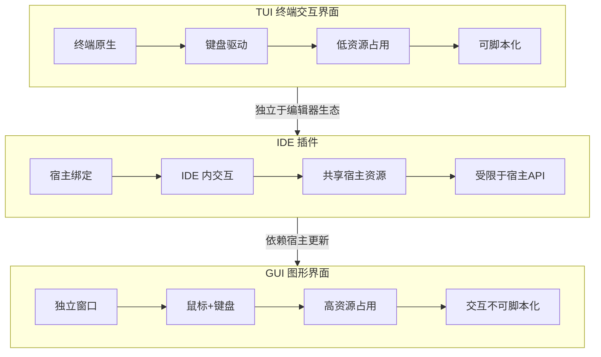
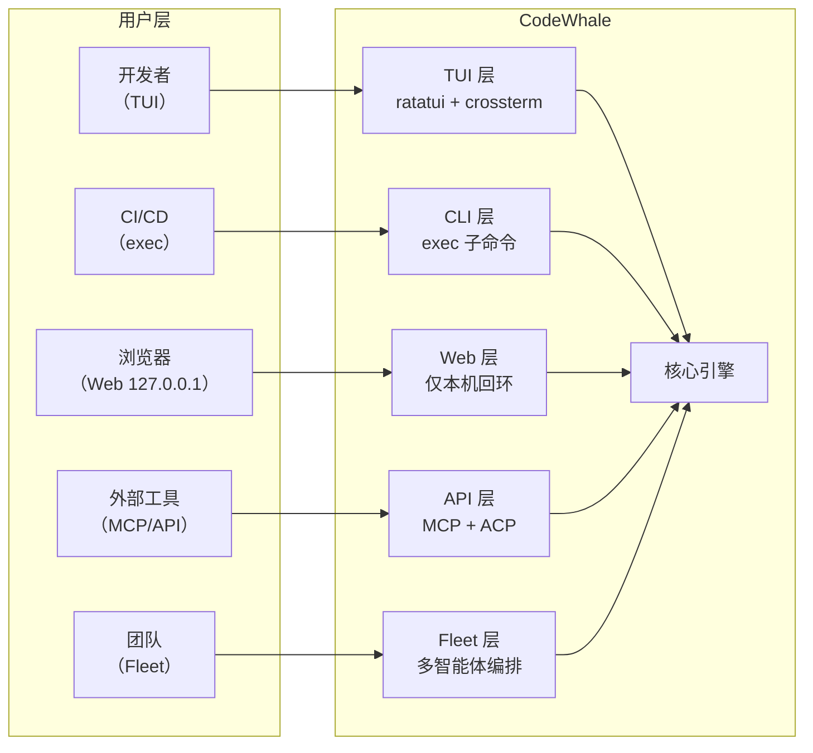
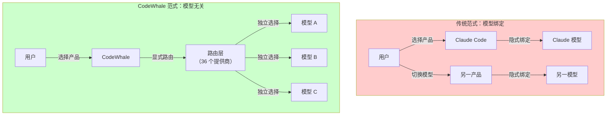
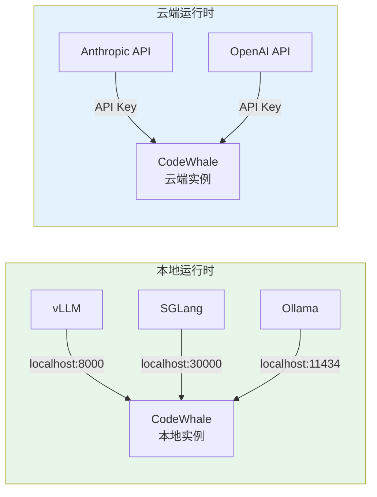
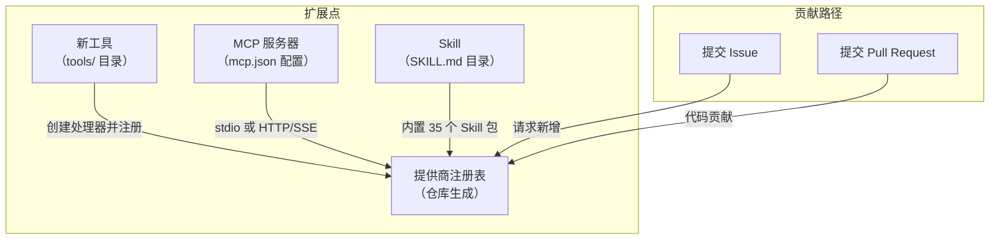
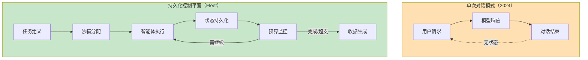
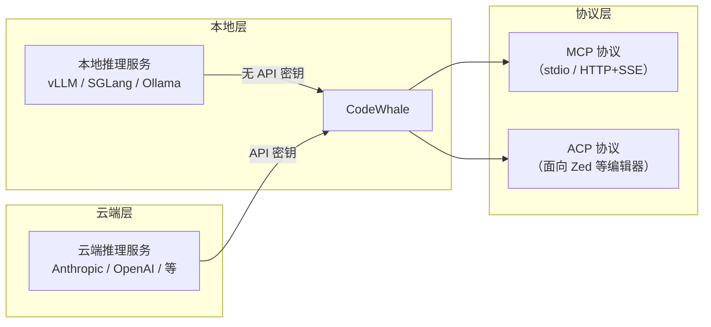

# 终端AI编程助手领域知识

> "在你的终端里读取仓库、修改文件、运行检查、留下收据。"
> —— CodeWhale 产品定位

---

## 1. 终端优先的交互哲学

### 1.1 为什么终端在 AI 时代回归

在图形用户界面（GUI）统治软件开发数十年后，终端（Terminal）正在 AI 编程助手领域经历一场意义深远的回归。这一趋势并非怀旧，而是由终端固有的结构性优势驱动：

1. **可组合性（Composability）**：终端天然支持管道（pipe）和脚本，使 AI 操作可被编排、审计和自动化，而非被黑盒封装在 IDE 插件中。
2. **零上下文切换**：开发者无需在编辑器、浏览器和聊天面板之间频繁切换，终端本身就是最完整的开发环境。
3. **工具链无关性**：终端不绑定任何特定编辑器或 IDE 生态，一个工具可以服务所有开发环境。
4. **CI/CD 原生兼容**：终端界面天然适配持续集成流水线，AI 辅助可以无缝嵌入自动化流程。

### 1.2 TUI vs GUI vs IDE 插件：三种交互范式的系统性对比

| 维度 | TUI（终端交互界面） | GUI（独立图形界面） | IDE 插件 |
|------|---------------------|---------------------|----------|
| **启动速度** | 毫秒级 | 秒级 | 随宿主 IDE 启动 |
| **资源占用** | 极低（纯文本渲染） | 中高（Chromium/Electron） | 共享宿主资源 |
| **可脚本化** | ✅ 原生支持管道与重定向 | ❌ 不可脚本化 | ⚠️ 受限于插件 API |
| **CI/CD 兼容** | ✅ 直接嵌入流水线 | ❌ 需要 Headless 模式 | ❌ 不可用 |
| **跨平台一致性** | ✅ 终端模拟器标准 | ⚠️ 依赖 GUI 框架 | ⚠️ 依赖 IDE 版本 |
| **编辑器中立** | ✅ 不绑定任何编辑器 | ✅ 独立应用 | ❌ 绑定特定 IDE |
| **远程/SSH 兼容** | ✅ 原生支持 | ❌ 需要远程桌面 | ⚠️ 部分支持 |
| **可访问性（a11y）** | ✅ 屏幕阅读器友好 | ⚠️ 取决于实现 | ⚠️ 取决于 IDE |
| **学习曲线** | 较高（需熟悉 CLI） | 低 | 低 |
| **典型代表** | CodeWhale TUI | ChatGPT Desktop | GitHub Copilot、Cursor |

### 1.3 CodeWhale 的五种运行时界面

CodeWhale 并非单一界面产品，而是提供五种互补的运行时入口，覆盖从个人开发到企业级编排的完整场景：

| 界面 | 用途 | 核心 crate/实现 | 典型场景 |
|------|------|----------------|---------|
| **TUI** | 交互式终端界面 | `crates/tui`（~200 源文件，ratatui v0.30 + crossterm v0.29） | 日常开发、代码审查、实时交互 |
| **codewhale exec** | 脚本与 CI 集成 | CLI 子命令 | 自动化流水线、批量任务、Git hooks |
| **Web 客户端** | 本机回环 Web 界面 | 仅监听 `127.0.0.1` | 需要可视化输出的场景 |
| **Runtime API + MCP** | 程序化接口 | stdio 与 HTTP/SSE 传输 | 工具链集成、自定义前端 |
| **Fleet** | 持久化多智能体编排 | 沙箱隔离 + 信任分级 + 预算控制 | 大规模代码库维护、持续集成任务 |

### 1.4 终端优先的国际化实践

CodeWhale TUI 支持 **15 种语言**的国际化，包括简体中文和繁体中文。这一设计决策不仅降低了非英语母语开发者的使用门槛，更体现了"终端不应是精英工具"的产品哲学。在 AI 编程工具领域，语言支持往往被忽视，但 CodeWhale 将其视为终端优先理念的自然延伸——终端是所有人的工具，不应有语言壁垒。

---

## 2. 模型无关设计理念

### 2.1 从"选模型"到"选调度层"：一场范式转变

传统 AI 编程工具的核心假设是"模型即产品"——用户选择 Claude Code 就等于选择了 Claude 模型，选择 Cursor 就等于选择了其内置的模型组合。CodeWhale 从根本上推翻这一假设，提出了一种新的范式：

> **"模型是可选择的组件，不是产品本身。"**

### 2.2 路由身份的四字段模型

CodeWhale 的路由体系由四个独立字段组成，每一个字段的选择都不会隐含地改变其他字段：

| 字段 | 含义 | 独立性保证 |
|------|------|-----------|
| **Provider** | 模型提供商（如 Anthropic、OpenAI、本地 vLLM） | 模型名称不会隐式改变提供商，不发生静默切换 |
| **Model** | 具体模型标识 | 与提供商解耦，用户可逐请求指定 |
| **Requested reasoning** | 请求的推理深度档位 | 独立于模型选择，同一模型可配不同档位 |
| **Effective reasoning** | 实际生效的推理深度 | 运行时反馈，无法确认的值保持"暂不可用" |

### 2.3 本地优先运行时架构

CodeWhale 的本地运行时（Local Runtime）支持直连 `localhost` 上的推理服务，通常不需要 API 密钥：

### 2.4 不发布基准排行榜的决策哲学

CodeWhale 官网明确不发布基准排行榜（Benchmark Leaderboard）。其背后的工程哲学是：

- **任何数字的发布必须同时给出确切条件**：提供商、模型、请求与实际思考档位、测量工具链
- **无法确认的值保持"暂不可用"状态**，不显示为零或成功——这是一种"诚实的不可知"态度
- **拒绝"魔法数字"营销**：不通过选择性披露最佳结果来夸大产品能力

---

## 3. 开源社区驱动的 AI 工具演进模式

### 3.1 从单人维护到全球社区：deepseek-tui 的演进之路

CodeWhale 的前身是 `deepseek-tui`，一个由个人维护的终端 AI 工具。从单人项目演进为全球社区项目的关键转折点包括：

1. **MIT 开源协议的选择**：零门槛采纳，消除法律顾虑
2. **多语言 README 的建立**：9 种语言版本打破语言壁垒
3. **社区治理文件的完善**：`CODE_OF_CONDUCT.md`、`CONTRIBUTING.md`、`SECURITY.md`
4. **14 个 CI/CD 工作流的自动化**：确保社区贡献的质量一致性

### 3.2 MIT 协议的战略价值

MIT 协议并非简单的"免费"选择，而是深思熟虑的战略决策：

| 维度 | MIT 协议的战略意义 |
|------|-------------------|
| **采纳门槛** | 零法律障碍，企业可放心集成和二次开发 |
| **生态扩展** | 允许商业 fork 和私有化部署，不强制回馈 |
| **社区信任** | 代码透明可审计，消除"后门"顾虑 |
| **人才吸引** | 开源贡献者可积累公开可验证的代码贡献记录 |
| **竞争壁垒** | 社区贡献的累积效应远超任何单一闭源团队的能力上限 |

### 3.3 社区扩展机制

CodeWhale 设计了三个清晰的扩展点，降低社区贡献的门槛：

---

## 4. AI Agent 编排的工程化挑战

### 4.1 从"单次对话"到"持久化控制平面"

2024-2025 年 AI 编程工具的主流形态是"单次对话"——用户发起请求，模型生成回复，对话结束。CodeWhale 的 Fleet 子系统将这一范式推进到"持久化控制平面"（Persistent Control Plane）：

### 4.2 Fleet 不是"多 Agent 并行调用"

CodeWhale 对 Fleet 的定位做了明确澄清：**Fleet 不是简单的多 Agent 并行调用，而是工程化基础设施**。其核心特征包括：

| 特征 | 说明 |
|------|------|
| **沙箱隔离** | 每个 Agent 运行在独立沙箱中，互不干扰 |
| **信任分级** | 不同任务分配不同信任级别，限制高风险操作 |
| **预算控制** | 每个 Agent 有独立的 Token 和计算预算，防止失控 |
| **状态持久化** | Agent 执行状态可跨会话保留，支持长周期任务 |
| **收据机制** | 每次执行生成可审计的"收据"，记录完整操作链路 |

---

## 5. 本地优先 vs 云端依赖的架构选择

### 5.1 架构决策矩阵

| 维度 | 本地优先（CodeWhale） | 云端依赖（GitHub Copilot 等） |
|------|----------------------|------------------------------|
| **数据隐私** | 代码不出本地，敏感项目可用 | 代码上传至云端处理 |
| **离线可用** | ✅ 本地模型完全离线运行 | ❌ 需要网络连接 |
| **延迟** | 取决于本地算力，可优化 | 取决于网络和服务端负载 |
| **模型选择** | 36 个提供商自由选择 | 通常由服务商决定 |
| **API 密钥需求** | 本地运行时通常不需要 | 需要服务商账号和密钥 |
| **合规性** | 满足金融、军工等严格合规要求 | 数据跨境传输存在合规风险 |
| **运维成本** | 需要本地 GPU 资源 | 按使用量付费 |

### 5.2 混合架构：CodeWhale 的实用主义路线

CodeWhale 并非教条式地坚持"纯本地"，而是采用实用主义的混合架构：

用户可以在同一会话中混合使用本地模型（处理敏感代码）和云端模型（处理通用任务），实现安全与能力的平衡。

---

## 6. 关键设计决策总结

CodeWhale 的 6 项关键设计决策构成了其架构基础：

| # | 决策 | 含义 | 工程体现 |
|---|------|------|---------|
| 1 | **流式优先** | 响应即时可见，降低等待焦虑 | 所有接口支持 SSE 流式输出 |
| 2 | **工具安全** | 文件操作需沙箱审批 | 工具调用前验证路径和权限 |
| 3 | **可扩展性** | 三个标准化扩展点 | tools/、mcp.json、SKILL.md |
| 4 | **跨平台** | Windows/Linux/macOS 一致体验 | Rust 编译 + crossterm 跨平台终端 |
| 5 | **最小依赖** | 运行时依赖极简 | 单个二进制文件，无外部运行时 |
| 6 | **本地优先运行时 API** | 本地模型直连，无需密钥 | localhost 端口直连，支持 vLLM/SGLang/Ollama |