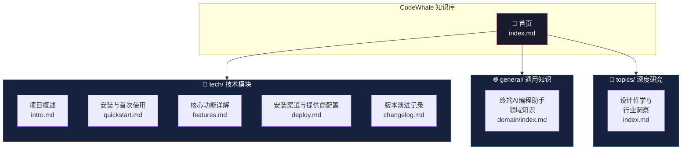

# CodeWhale 知识库

> **"潜入深海，你不必亲自下潜。"**

CodeWhale 是一个基于 Rust 构建的终端 AI 编程助手，支持 36 个 LLM 提供商路由，提供 Plan（只读）、Act（多步骤）、Operate（多任务调度）三种运行模式，以及 TUI、exec、Web、Runtime API+MCP、Fleet 五种运行时。本知识库系统地整理了 CodeWhale 的技术架构、安装使用、进阶主题等核心内容。

---

## 三大知识模块

| 模块 | 路径 | 说明 |
|------|------|------|
| 🔧 **技术模块** | [`tech/`](tech/intro.md) | 项目概述、安装指南、核心功能、部署配置、版本记录 |
| 🌐 **通用知识** | [`general/domain/`](general/domain/index.md) | 终端AI编程助手领域知识、设计理念分析 |
| 🔬 **深度研究** | [`topics/`](topics/index.md) | 设计哲学、行业洞察、竞争格局分析 |

---

## 快速开始

如果你是新用户，建议按以下路径快速上手：

1. **了解项目** → 阅读 [项目概述](tech/intro.md)，理解 CodeWhale 的定位与核心价值
2. **安装运行** → 跟随 [安装与首次使用指南](tech/quickstart.md)，完成环境搭建与第一个任务
3. **深入功能** → 阅读 [核心功能详解](tech/features.md)，理解模型路由、嵌套宪法等核心机制
4. **拓展阅读** → 浏览 [领域知识](general/domain/index.md) 和 [设计哲学](topics/index.md)，深入理解终端AI编程助手生态

---

## 重点阅读推荐

| 文档 | 适合人群 | 预计阅读时间 |
|------|---------|-------------|
| [项目概述](tech/intro.md) | 所有用户 | 10 分钟 |
| [安装与首次使用指南](tech/quickstart.md) | 新用户 | 15 分钟 |
| [核心功能详解](tech/features.md) | 开发者 | 20 分钟 |
| [安装渠道与提供商配置](tech/deploy.md) | 运维/配置者 | 15 分钟 |
| [版本演进记录](tech/changelog.md) | 关注者 | 10 分钟 |
| [终端AI编程助手领域知识](general/domain/index.md) | 架构师 | 25 分钟 |
| [设计哲学与行业洞察](topics/index.md) | 研究者 | 30 分钟 |