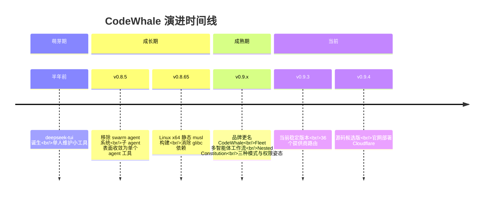

# 版本演进记录

> 本文档记录 CodeWhale 从 deepseek-tui 单人小工具到多智能体编码平台的完整演进历程，涵盖关键版本变更、品牌更名事件和未来发展方向。

## 1. 演进时间线

## 2. 品牌演进

### 2.1 从 deepseek-tui 到 CodeWhale

CodeWhale 的前身是 **deepseek-tui**，一个半年前由个人维护的终端 AI 助手小工具。随着功能不断扩展——从单一模型接入到多提供商路由、从单 Agent 到 Fleet 多智能体编排——项目定位已远超"DeepSeek 终端界面"的范畴，品牌升级为 **CodeWhale** 势在必行。

### 2.2 兼容性策略

| 项目 | 说明 |
|---|---|
| npm 包名 | 保留 `deepseek-tui`，确保现有用户安装命令不中断 |
| 旧版配置路径 | `~/.deepseek` 和 `./.deepseek` 仍作为兼容回退读取 |
| Cargo 包名 | 更新为 `codewhale` |
| Homebrew formula | 更新为 `codewhale` |
| 官网 | 部署在 Cloudflare，网站源码位于 `web/` 目录 |

## 3. 关键版本变更

### 3.1 v0.8.5 — Swarm Agent 移除

**变更类型**：破坏性（Breaking Change）

**核心变更**：
- 移除了 swarm agent 系统（多 agent 并发协作）
- 当前活跃子 agent 表面收敛为单个 agent 工具调用
- 简化了 Agent 交互模型，降低用户心智负担

**设计意图**：swarm 系统在早期阶段带来了过高的复杂度，而实际使用场景中多数任务通过单 agent 的多步工具调用即可完成。移除 swarm 为后续 Fleet 体系（v0.9+）奠定了更清晰的设计基础——Fleet 并非 swarm 的简单替代，而是面向持久化、可编排的多 worker 控制平面。

### 3.2 v0.8.65 — Linux 静态 musl 构建

**变更类型**：增强（Enhancement）

**核心变更**：
- Linux x64 发布资产从动态链接切换为静态 musl 构建
- 消除 glibc 版本依赖，可在任意 Linux 发行版上直接运行
- 显著降低"无法运行"的安装问题

**技术背景**：glibc 不同版本间的 ABI 不兼容一直是 Linux 二进制分发的痛点。musl 静态链接将运行时依赖完全内聚到单个二进制文件中，用户无需关心目标系统的 glibc 版本。

### 3.3 v0.9.x — 品牌更名与架构升级

**变更类型**：重大版本（Major Release）

**核心变更**：

| 特性 | 状态 | 说明 |
|---|---|---|
| 品牌更名 | deepseek-tui → CodeWhale | 反映项目定位升级 |
| Route Resolver | 新增/重构 | 36 个提供商路由，Provider/Model 独立选择 |
| Nested Constitution | 新增 | 五级优先级行为约束体系 |
| 三种运行模式 | 新增 | Plan / Act / Operate 正交模式 |
| 三种权限姿态 | 新增 | Ask / Auto-Review / Full Access |
| Fleet 多智能体 | 新增 | Exact Fleet + Reasoning Router |
| Fleet Workflow 脚本 | 新增 | rquickjs 沙箱，声明式 JS 子集 |
| 生命周期 Hook | 新增 | 11 个 Hook 事件 |
| 搜索后端 | 扩展 | 9 个搜索后端支持 |
| 上下文分层 | 新增 | L1/L2/L3 三层上下文管理 |
| 沙箱安全 | 新增 | macOS Seatbelt / Linux bubblewrap |

## 4. 当前版本特性概览

### 4.1 v0.9.3（当前稳定版）

| 维度 | 详情 |
|---|---|
| 提供商路由 | 36 个内置路由，覆盖商业 API、模型聚合、本地运行时 |
| 平台支持 | Linux (x64/arm64/riscv64)、macOS (x64/arm64)、Windows (x64/arm64)、Android/Termux (arm64, 预览) |
| 安装渠道 | npm、Cargo、Homebrew、Docker、预编译二进制、Nix、源码编译 |
| 配置文件行数 | 约 1364 行，33 个 provider 配置段 |
| 搜索后端 | 9 个（duckduckgo、bing、tavily、bocha、metaso、searxng、baidu、volcengine、sofya） |
| 生命周期 Hook | 11 个事件 |
| 上下文分层 | L1(192k) / L2(384k) / L3(576k) tokens |
| Fleet 验证上限 | 1000 worker / 16 并发 / 5 递归环 |
| 沙箱 | macOS Seatbelt（默认）/ Linux bubblewrap（需启用） |

### 4.2 v0.9.4（源码候选版）

v0.9.4 为源码候选版（Release Candidate），当前处于发布前验证阶段。官网已部署至 Cloudflare，网站源码位于 `web/` 目录。

## 5. 未来路线图方向

> 以下为基于当前版本设计理念的路线图方向推断，非官方发布计划。

| 方向 | 说明 | 优先级 |
|---|---|---|
| 提供商路由扩展 | 持续覆盖更多 AI 提供商和本地推理引擎 | 高 |
| Fleet 工作流增强 | Workflow 脚本能力扩展、更多内置任务模板 | 高 |
| Android/Termux 正式支持 | 从预览阶段过渡到正式版本 | 中 |
| 多平台 GUI | 可能扩展 TUI 之外的图形界面 | 中 |
| 团队协作 | 多用户 Fleet 共享、审计日志聚合 | 低 |
| 插件生态 | 第三方 Skill/Provider 插件市场 | 低 |

## 6. 变更类型说明

| 类型 | 标识 | 说明 |
|---|---|---|
| Breaking Change | 🔴 | 破坏性变更，可能影响现有配置或工作流 |
| Enhancement | 🟡 | 功能增强，向后兼容 |
| Feature | 🟢 | 新增功能 |
| Fix | 🔵 | Bug 修复 |
| Refactor | ⚪ | 代码重构，无功能变更 |

## 延伸阅读

- [核心功能详解](features.md)
- [安装渠道与提供商配置](deploy.md)
- [CodeWhale 快速上手](quickstart.md)