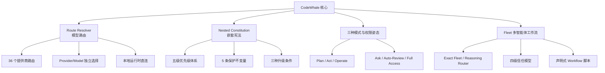
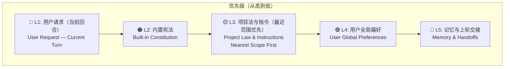
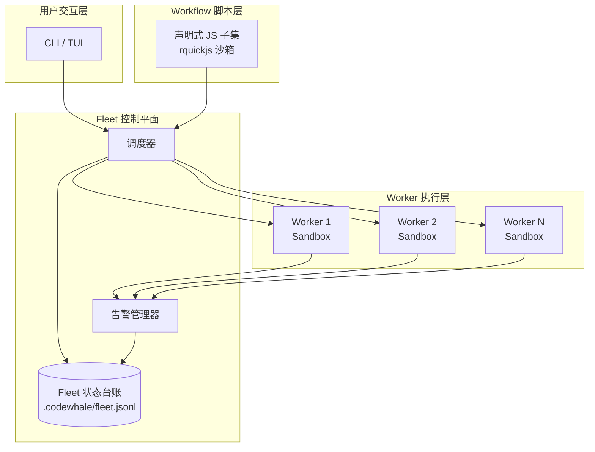

# 核心功能详解

> CodeWhale 是一款面向专业开发者的本地优先 AI 编程助手。其核心设计理念围绕"可控性"与"可审计性"展开，通过四条核心能力支柱——模型路由、嵌套宪法、多模式运行和 Fleet 多智能体工作流——构建了一套完整的编码代理（Coding Agent）基础设施。

## 1. 功能总览



## 2. Route Resolver（模型路由）

### 2.1 设计原理

Route Resolver 是 CodeWhale 的模型调度中枢。其核心设计原则是：**提供商（Provider）和模型（Model）分别独立选择，模型名称不会隐式改变提供商，不发生静默切换**。这意味着用户明确指定了某个模型，CodeWhale 就只会使用该模型对应的提供商，不会因为"智能路由"而将请求转发到其他提供商。

### 2.2 支持的提供商

CodeWhale 内置 **36 个提供商路由**，覆盖主流商业 API、开源模型托管平台和本地推理运行时：

| 类别 | 提供商 | 说明 |
|---|---|---|
| 商业 API | DeepSeek、Anthropic、OpenAI、xAI、Moonshot/Kimi、MiniMax、StepFun、Baidu Qianfan | 头部 AI 厂商 |
| 模型聚合 | OpenRouter、Together AI、Fireworks AI、Novita AI、DeepInfra、SiliconFlow | 多模型聚合平台 |
| 云平台 | Volcengine Ark（火山方舟）、NVIDIA NIM | 云厂商 AI 服务 |
| 本地运行时 | vLLM、SGLang、Ollama | 本地推理引擎 |
| 其他 | Hugging Face、Meta Model API | 开源模型与社区 |

### 2.3 路由字段说明

每条路由由四个字段组成，形成完整的模型调用描述：

| 字段 | 类型 | 说明 |
|---|---|---|
| `Provider` | 枚举 | 提供商标识，决定 API 端点和认证方式 |
| `Model` | 字符串 | 具体模型名称，如 `deepseek-chat`、`claude-sonnet-4-20250514` |
| `Requested reasoning` | 字符串 | 请求时声明的推理深度/思考档位 |
| `Effective reasoning` | 枚举 | 实际生效的推理档位；若无法确认则标记为"暂不可用" |

> **设计约束**：对于无法确认的运行时值（如实际思考档位、token 用量、成本、进度），CodeWhale 保持"暂不可用"（Unavailable）状态，而非返回推测值。这体现了其"可审计性"设计理念。

### 2.4 本地模型接入

本地运行时（vLLM、SGLang、Ollama）可以直接连接 `localhost`，通常不需要 API 密钥：

```toml
# ~/.codewhale/config.toml — Ollama 本地接入示例
[provider.ollama]
endpoint = "http://localhost:11434/v1"
api_key = ""  # 本地运行时通常无需密钥

[model.ollama-qwen]
provider = "ollama"
name = "qwen2.5-coder:14b"
```

## 3. Nested Constitution（嵌套宪法）

### 3.1 优先级体系

Nested Constitution 是 CodeWhale 的行为约束体系，通过五级优先级确保 Agent 行为始终在可控范围内：



### 3.2 保护不变量（Protected Invariants）

以下 5 条不变量在所有优先级层级中均不可被覆盖：

| 编号 | 不变量 | 说明 |
|---|---|---|
| I1 | 保持首轮工具目录头部字节稳定 | 确保 DeepSeek KV 前缀缓存（Prefix Cache）命中，避免首轮推理延迟 |
| I2 | 保留旧会话转录重放 | 保证历史会话的可复现性和审计能力 |
| I3 | 仅使用 Stable Rust | 编译器和依赖链限定在 Rust 稳定通道 |
| I4 | 保持 CLI 调度器与 TUI 二进制同步 | 保证命令行与终端界面的行为一致性 |
| I5 | 优先级仅在 BASE_PROMPT 中声明 | 优先级声明逻辑集中于 BASE_PROMPT，避免分散导致的不可预测行为 |

### 3.3 升级条件（Escalation Conditions）

当以下三种条件之一被触发时，Agent 必须请求用户确认（升级）：

| 条件 | 触发场景 |
|---|---|
| 破坏性/难以撤销的操作 | 如 `rm -rf`、数据库迁移、分区格式化等 |
| 更改 provider/auth/config | 修改 API 密钥、更换模型提供商、重写配置文件 |
| 删除/覆写非自己创建的文件 | 修改用户或第三方代码文件 |

### 3.4 配置层面

Nested Constitution 支持多个指令层面，从全局到项目逐级细化：

| 层面 | 路径 | 管理方式 | 说明 |
|---|---|---|---|
| 内置全局宪法 | 编译时嵌入 | 不可修改 | CodeWhale 核心行为约束 |
| 用户全局宪法 | `/constitution` 命令管理 | 用户自定义 | 跨项目的个人偏好 |
| 仓库本地宪法 | `.codewhale/constitution.json` | 项目级 | 特定项目的团队约定 |
| AGENTS.md | 项目根目录 | 项目级 | 兼容 SpecWeave/Claude Code 等生态 |
| Memory 和 Handoffs | 会话级 | 自动管理 | 跨会话记忆与任务交接 |

## 4. 三种模式与三种权限姿态

### 4.1 三种运行模式

CodeWhale 提供三种正交的运行模式，通过 `Tab` 键循环切换：

| 模式 | 图标 | 设计理念 | 权限边界 | 适用场景 |
|---|---|---|---|---|
| **Plan**（设计优先） | 📋 | 先规划后执行 | 始终只读，不写不改 | 代码审查、架构分析、方案设计 |
| **Act**（Agent 模式） | 🤖 | 多步工具使用 | shell 有审批提示（默认） | 日常编码、代码重构、Bug 修复 |
| **Operate**（多任务调度） | ⚙️ | 自动派发后台 worker | 后台异步执行 | 批量任务、持续集成、自动化流水线 |

### 4.2 三种权限姿态

权限姿态通过 `Shift+Tab` 循环切换，与模式正交组合：

| 权限姿态 | 图标 | 行为 |
|---|---|---|
| **Ask**（默认） | ❓ | 有未决选择时向用户询问 |
| **Auto-Review** | 🔍 | 完全自主执行，但保留安全拦截 |
| **Full Access** | 🔓 | 普通工具不显示审批提示，安全拦截仍生效 |

### 4.3 模式与权限姿态组合矩阵

|  | Ask（默认） | Auto-Review | Full Access |
|---|---|---|---|
| **Plan** | 只读 + 询问 | 只读 + 自主 | 只读 + 无审批 |
| **Act** | Agent + 询问 | Agent + 自主 | Agent + 无审批（安全拦截仍生效） |
| **Operate** | 调度 + 询问 | 调度 + 自主 | 调度 + 无审批（安全拦截仍生效） |

> **关键设计**：Full Access 姿态下，安全拦截（如升级条件中定义的破坏性操作）仍然会触发确认，不会因权限姿态而被绕过。

## 5. Fleet 多智能体工作流

### 5.1 架构概览

Fleet 是 CodeWhale 面向持久多 worker 运行的本地优先控制平面（Control Plane）。其设计目标是将单次 Agent 交互扩展为可编排、可监控、可恢复的多智能体工作流。



### 5.2 Fleet 类型

| 类型 | 说明 | 适用场景 |
|---|---|---|
| **Exact Fleet** | 冻结每个 worker 的完整配置（provider、model、reasoning 等） | 确定性流水线，需要精确复现 |
| **Reasoning Router** | 可复用服务，仅选择推理层级（reasoning level），worker 按需动态分配 | 弹性推理任务，资源优化 |

### 5.3 信任级别

Fleet 支持四级信任模型，逐级放宽约束：

| 级别 | 标识 | 默认 | 说明 |
|---|---|---|---|
| `sandbox` | 🏖️ | ✅ | 默认级别，最大隔离 |
| `local` | 🏠 | | 本地信任，可访问文件系统 |
| `remote-verified` | ✅ | | 远程验证通过 |
| `operator` | 🔧 | | 操作者级别，最高信任 |

### 5.4 命令速查

| 命令 | 说明 |
|---|---|
| `fleet init` | 初始化 Fleet 配置 |
| `fleet run` | 启动 Fleet 运行 |
| `fleet status` | 查看 Fleet 运行状态 |
| `fleet inspect` | 查看 Fleet 详细信息 |
| `fleet logs` | 查看 Worker 日志 |
| `fleet artifacts` | 查看产出物 |
| `fleet interrupt` | 中断运行中的 Fleet |
| `fleet restart` | 重启 Fleet |
| `fleet resume` | 从检查点恢复 |
| `fleet stop` | 停止 Fleet |

### 5.5 验证上限

Fleet 在执行前会对配置进行上限校验，防止资源耗尽：

| 限制项 | 上限值 |
|---|---|
| 单次 Fleet 最大 worker agent 数 | 1000 |
| 同时活跃 worker 数 | 16 |
| 递归环（recursive loop）深度 | 5 |

### 5.6 告警事件

Fleet 运行期间会触发以下 6 种告警事件：

| 事件 | 触发条件 |
|---|---|
| `stale` | Worker 长时间无响应 |
| `restart_exhausted` | 重启次数耗尽 |
| `needs_human` | 需要人工介入 |
| `budget_exceeded` | 预算超限 |
| `verifier_failed` | 验证器检查失败 |
| `run_completed` | 运行完成 |

### 5.7 Workflow 脚本

Fleet 的 Workflow 脚本以编译专用的声明式 JavaScript 子集编写，由 `rquickjs` 沙箱执行。默认校验边界：

| 校验项 | 上限 |
|---|---|
| worker Agent 数量 | 100 |
| 递归环深度 | 5 |
| 循环必须声明 | `max_iterations` |

```javascript
// Fleet Workflow 脚本示例（声明式子集）
workflow({
  name: "code-review-pipeline",
  fleet: {
    type: "exact",
    workers: [
      { role: "reviewer", model: "deepseek-chat", trust: "sandbox" },
      { role: "fixer", model: "claude-sonnet-4-20250514", trust: "sandbox" }
    ]
  },
  steps: [
    { worker: "reviewer", task: "review PR changes" },
    { worker: "fixer", task: "apply suggested fixes", max_iterations: 3 }
  ]
});
```

## 6. 功能矩阵

| 功能 | 状态 | 版本 | 说明 |
|---|---|---|---|
| Route Resolver | ✅ 稳定 | v0.8+ | 36 个提供商，Provider/Model 独立 |
| Nested Constitution | ✅ 稳定 | v0.8+ | 五级优先级，5 条保护不变量 |
| Plan 模式 | ✅ 稳定 | v0.8+ | 只读设计模式 |
| Act 模式 | ✅ 稳定 | v0.8+ | 默认 Agent 模式 |
| Operate 模式 | ✅ 稳定 | v0.9+ | 多任务调度 |
| 权限姿态（Ask/Auto-Review/Full Access） | ✅ 稳定 | v0.9+ | 正交组合 |
| Fleet 多智能体 | ✅ 稳定 | v0.9+ | Exact Fleet + Reasoning Router |
| Fleet Workflow 脚本 | ✅ 稳定 | v0.9+ | rquickjs 沙箱 |

## 延伸阅读

- [安装渠道与提供商配置](deploy.md)
- [版本演进记录](changelog.md)
- [CodeWhale 快速上手](quickstart.md)