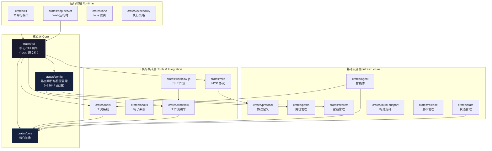

# CodeWhale 项目概述

> **"潜入深海，你不必亲自下潜。"**

## 项目定位

**CodeWhale 是一个模型无关、终端优先、本地优先的开源 AI 编程助手**——把大模型（LLM）的杠杆交给普通人，在你的终端里读取仓库、修改文件、运行检查、留下收据。

CodeWhale 的核心理念是降低 AI 辅助编程的门槛：你不需要在多个 IDE 插件之间切换、不需要为每个模型单独配置、不需要离开终端——只需安装一个命令行工具，即可接入 36 个 LLM 提供商，在 Plan（规划）、Act（执行）、Operate（调度）三种模式间自由切换，以 TUI、exec、Web、Runtime API+MCP 或 Fleet 五种运行时灵活工作。

---

## 核心价值主张

CodeWhale 的设计围绕四个核心原则展开：

| 原则 | 说明 |
|------|------|
| **模型无关（Model-Agnostic）** | 内置 36 个提供商路由，不绑定任何特定模型。你可以自由选择 DeepSeek、OpenAI、Claude、Gemini 等任意提供商，甚至可以同时使用多个模型协同工作 |
| **终端优先（Terminal-First）** | 核心交互界面是 TUI（Terminal User Interface，终端用户界面），所有操作均可在终端中完成。没有浏览器依赖，没有 GUI 弹窗，纯粹的终端体验 |
| **本地优先（Local-First）** | 代码分析与修改在本地执行，配置文件存储在本地，不依赖远程服务。你的代码始终在你的机器上，从未离开 |
| **开源 MIT** | 采用 MIT 开源协议，完全免费、可自由使用、修改和分发。项目托管于 GitHub [Hmbown/CodeWhale](https://github.com/Hmbown/CodeWhale) |

---

## 技术栈概览

CodeWhale 采用 **Rust（edition 2024）** 作为主要开发语言，基于 **Ratatui** 构建终端用户界面，通过 **Cargo Workspace** 管理 18 个 crate 子模块。

| 技术组件 | 选型 | 用途 |
|---------|------|------|
| 编程语言 | Rust（edition 2024） | 核心引擎，rust-toolchain 1.88 |
| TUI 框架 | Ratatui | 终端用户界面渲染 |
| 包管理 | Cargo Workspace | 18 个 crate 模块化管理 |
| 配置管理 | TOML（config.example.toml，~1364 行） | 提供商路由、权限姿态、运行时参数 |
| 分发渠道 | npm / Cargo / Homebrew / Docker | 多平台多方式安装 |
| 工作流引擎 | Fleet（内置于 crates/tui） | 多任务调度与编排 |

---

## 架构概览

CodeWhale 由 18 个 crate 子模块组成，各模块通过清晰的职责边界协同工作：

**核心模块说明**：

- **`crates/tui`**（核心 crate）：约 200 个源文件，集成 TUI 渲染、LLM 引擎、工具系统、Fleet 工作流调度、LSP（Language Server Protocol，语言服务器协议）集成与沙箱（Sandbox）安全隔离
- **`crates/config`**：负责多提供商路由解析与配置管理，`config.example.toml` 包含完整的 ~1364 行配置项，覆盖 30+ LLM 提供商的接入参数
- **`crates/core`**：核心抽象层，定义了智能体、工具、会话等基础接口
- **`crates/tools`**：工具系统实现，包括文件读写、命令执行、代码搜索等内置工具
- **`crates/mcp`**：实现 Model Context Protocol（模型上下文协议），支持与外部 MCP 服务器互操作
- **`crates/workflow`** 与 **`crates/workflow-js`**：工作流引擎，支持多步骤任务编排与 JavaScript 自定义工作流

---

## 三种运行模式

CodeWhale 提供三种运行模式，满足不同场景的需求：

| 模式 | 权限 | 适用场景 |
|------|------|---------|
| **Plan（规划）** | 只读 | 代码审查、架构分析、依赖梳理——仅读取代码，不做任何修改 |
| **Act（执行）** | 多步骤读写 | 日常开发任务——读取代码、修改文件、运行测试，逐步完成任务 |
| **Operate（调度）** | 多任务调度 | 复杂工程任务——编排多个子任务，Fleet 工作流引擎自动调度 |

三种模式可配合三种权限姿态（**Ask**：每次操作前询问、**Auto-Review**：自动执行但生成审查报告、**Full Access**：完全自动执行）使用，形成灵活的安全控制矩阵。

---

## 五种运行时

CodeWhale 的运行时（Runtime）决定了你与 AI 的交互方式：

| 运行时 | 说明 |
|--------|------|
| **TUI** | 终端用户界面，提供完整的交互式体验，是 CodeWhale 的核心交互方式 |
| **exec** | 单次命令执行模式，适合脚本化、CI/CD 集成场景 |
| **Web** | 浏览器端 Web 界面，通过 `crates/app-server` 提供 HTTP 服务 |
| **Runtime API + MCP** | 通过 API 和 MCP 协议与外部系统集成，支持作为子智能体被调用 |
| **Fleet** | 多智能体协作调度，支持并行执行多个任务 |

---

## 四步工作流

CodeWhale 遵循严格的四步工作流，确保每次操作可追溯、可验证：

1. **检查（Check）**：读取目标文件，分析代码结构，理解上下文
2. **执行（Execute）**：按照计划执行修改或操作
3. **验证（Verify）**：运行测试、检查编译、确认修改正确性
4. **报告（Report）**：生成操作收据（receipt），记录每一步的输入、输出与结果

---

## 与同类工具的差异化定位

| 维度 | CodeWhale | Claude Code | Cursor |
|------|-----------|-------------|--------|
| **运行环境** | 终端（TUI） + Web + API | 终端（CLI） | IDE 插件（VS Code） |
| **模型绑定** | 模型无关，36 个提供商 | 绑定 Claude 模型 | 多模型但以 IDE 为中心 |
| **开源协议** | MIT 开源 | 闭源（Anthropic） | 闭源（部分开源） |
| **安装方式** | npm / Cargo / Homebrew / Docker | npm | IDE 插件市场 |
| **本地优先** | 完全本地，代码不离开机器 | 代码上传至 Anthropic | 本地处理 |
| **工作流引擎** | 内置 Fleet 多任务调度 | 单会话模式 | 无内置工作流引擎 |
| **MCP 集成** | 原生支持 | 原生支持 | 通过插件支持 |
| **沙箱安全** | 内置沙箱隔离 | 权限控制 | IDE 沙箱 |
| **多运行时** | TUI / exec / Web / API / Fleet | CLI | IDE |

CodeWhale 的差异化优势在于**模型无关性**（不被单一供应商锁定）、**终端优先**（不依赖特定 IDE）、**多运行时架构**（从单次命令到 Fleet 多智能体调度全覆盖）以及**完全开源 MIT**（无商业限制）。

---

## 关键数据一览

| 指标 | 数据 |
|------|------|
| 当前版本 | v0.9.3（源码候选版 v0.9.4） |
| 开源协议 | MIT |
| GitHub 仓库 | [Hmbown/CodeWhale](https://github.com/Hmbown/CodeWhale) |
| 官网 | [codewhale.net](https://codewhale.net/zh) |
| 开发语言 | Rust（edition 2024） |
| Crate 数量 | 18 个 |
| 提供商路由 | 36 个 |
| 运行模式 | 3 种（Plan / Act / Operate） |
| 权限姿态 | 3 种（Ask / Auto-Review / Full Access） |
| 运行时 | 5 种（TUI / exec / Web / Runtime API+MCP / Fleet） |
| 支持平台 | macOS（Apple Silicon / Intel）、Linux（x64 / arm64）、Windows（x64 / arm64） |
| 安装渠道 | npm / Cargo / Homebrew / Docker / 预编译二进制 / 一键安装脚本 |

---

## 下一步

- 准备开始使用？→ [安装与首次使用指南](quickstart.md)
- 返回知识库首页 → [CodeWhale 知识库](../index.md)