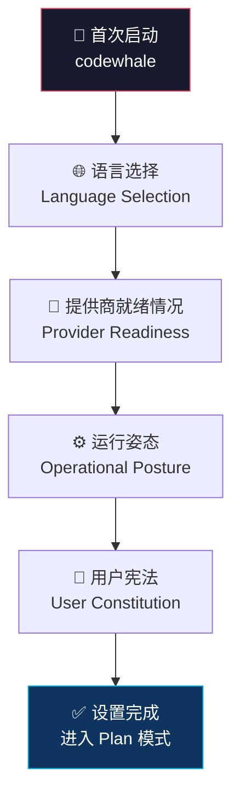

# CodeWhale 安装与首次使用指南

> 四步上手：安装 → 首次会话（无需密钥）→ 连接提供商 → Fleet Workflow

本指南将带领你完成 CodeWhale 的安装、配置与首次使用，从零开始，无需任何 API 密钥即可启动。

---

## 1. 前置要求

| 安装方式 | 前置要求 |
|---------|---------|
| npm | Node.js 18+ |
| Cargo | Rust 1.88+（需安装 rustup） |
| Homebrew | macOS 系统，已安装 Homebrew |
| Docker | 已安装 Docker Engine |
| 预编译二进制 | 无额外依赖，下载即用 |
| 一键安装脚本 | curl 或 wget（Unix-like 系统） |

---

## 2. 安装步骤

### 2.1 npm（推荐，跨平台）

```bash
npm install -g codewhale
```

安装完成后验证：

```bash
codewhale --version
```

### 2.2 Cargo（Rust 用户）

CodeWhale 分为两个 crate 包，需分别安装：

```bash
cargo install codewhale-cli --locked
cargo install codewhale-tui --locked
```

### 2.3 Homebrew（macOS 用户）

```bash
brew tap Hmbown/deepseek-tui
brew install codewhale
```

### 2.4 Docker

```bash
docker pull ghcr.io/hmbown/codewhale:latest
```

运行容器：

```bash
docker run -it --rm \
  -v $(pwd):/workspace \
  -v $HOME/.codewhale:/root/.codewhale \
  ghcr.io/hmbown/codewhale:latest
```

> **注意**：`-v $(pwd):/workspace` 将当前目录挂载到容器内的工作区，`-v $HOME/.codewhale:/root/.codewhale` 持久化配置文件。

### 2.5 预编译二进制

从 [GitHub Releases](https://github.com/Hmbown/CodeWhale/releases) 下载对应平台的预编译二进制文件：

| 平台 | 架构 | 文件 |
|------|------|------|
| macOS | Apple Silicon（arm64） | `codewhale-darwin-arm64.tar.gz` |
| macOS | Intel（x64） | `codewhale-darwin-x64.tar.gz` |
| Linux | x64 | `codewhale-linux-x64.tar.gz` |
| Linux | arm64 | `codewhale-linux-arm64.tar.gz` |
| Windows | x64 | `codewhale-windows-x64.zip` |
| Windows | arm64 | `codewhale-windows-arm64.zip` |

下载后解压并将可执行文件放入 `PATH` 路径即可。

### 2.6 一键安装脚本（Unix-like 系统）

```bash
curl -fsSL https://codewhale.net/install.sh | sh
```

---

## 3. 中国用户镜像加速

对于中国大陆用户，推荐使用以下镜像源加速下载：

### 3.1 CNB 镜像

```bash
# npm 镜像
npm install -g codewhale --registry=https://registry.npmmirror.com

# Cargo 镜像（在 ~/.cargo/config.toml 中配置）
# [source.crates-io]
# replace-with = 'cnb'
# [source.cnb]
# registry = "https://cnb.cool/crates-io-index"
```

### 3.2 清华大学 TUNA 镜像

```bash
# 预编译二进制镜像
# 将 GitHub Releases 下载地址中的 github.com 替换为以下镜像地址：
# https://mirrors.tuna.tsinghua.edu.cn/github-release/Hmbown/CodeWhale/
```

### 3.3 一键安装脚本（镜像加速）

```bash
curl -fsSL https://codewhale.net/install.sh | sh -s -- --mirror cn
```

---

## 4. 首次启动

### 4.1 无需 API 密钥即可启动

CodeWhale 的设计理念是"零门槛上手"。首次运行时，你不需要任何 API 密钥——直接运行即可进入 Plan 模式（只读），安全地探索项目：

```bash
codewhale
```

### 4.2 宪法优先设置（Constitution Setup）

首次启动 CodeWhale 时，将经历四项基础设置，称为"宪法优先设置"：



| 步骤 | 设置项 | 说明 |
|------|--------|------|
| 1 | **语言选择** | 选择界面语言（支持中文、英文等） |
| 2 | **提供商就绪情况** | 查看当前可用的 LLM 提供商列表，了解哪些提供商需要额外配置 API 密钥 |
| 3 | **运行姿态（Posture）** | 选择默认权限姿态：Ask（每次操作询问）、Auto-Review（自动执行并生成审查报告）、Full Access（完全自动） |
| 4 | **用户宪法（Constitution）** | 设置你的编码偏好与约束规则，CodeWhale 将在后续操作中自动遵守这些规则 |

### 4.3 在 Plan 模式中探索

完成宪法设置后，你将进入 **Plan 模式**（只读模式）。在此模式下，你可以：

- 让 CodeWhale 分析代码库结构
- 阅读和理解代码
- 审查代码质量
- 生成代码分析报告

**Plan 模式下不会修改任何文件**——这是安全探索 CodeWhale 能力的最佳起点。

---

## 5. 连接第一个提供商

CodeWhale 支持 36 个 LLM 提供商，你可以自由选择。以下是连接 DeepSeek 的示例：

```bash
codewhale auth set --provider deepseek
```

系统会提示你输入 API Key：

```bash
# 按提示输入你的 DeepSeek API Key
# 配置文件将存储在 ~/.codewhale/config.toml 中
```

连接其他提供商的命令格式相同，只需替换 `--provider` 参数：

```bash
# 连接 OpenAI
codewhale auth set --provider openai

# 连接 Anthropic Claude
codewhale auth set --provider anthropic

# 查看所有可用提供商
codewhale auth list
```

---

## 6. 第一个任务示例

以下示例演示如何使用 **exec 模式**（单次命令执行）修复一个测试文件：

```bash
# 进入你的项目目录
cd /path/to/your/project

# 使用 exec 模式让 CodeWhale 修复测试
codewhale exec "请修复 tests/test_user.py 中失败的测试用例，确保所有测试通过"
```

CodeWhale 将按四步工作流执行：


### 使用 Act 模式（多步骤交互）

```bash
# 启动 Act 模式进行多步骤交互式开发
codewhale act
```

在 Act 模式下，你可以与 CodeWhale 进行多轮对话，逐步完成复杂的开发任务。

### 运行第一个 Fleet Workflow

Fleet 是 CodeWhale 的多任务调度引擎，支持编排多个子任务：

```bash
# 启动 Fleet 模式
codewhale fleet

# 在 Fleet 中，你可以同时管理多个并行任务
# 例如：让 CodeWhale 同时修复不同模块的 bug
```

---

## 7. 常见问题排查

### 7.1 安装失败

**问题**：`npm install -g codewhale` 失败，提示权限不足。

**解决方案**：

```bash
# 方案一：使用 npx（无需全局安装）
npx codewhale

# 方案二：修改 npm 全局安装路径（避免使用 sudo）
mkdir ~/.npm-global
npm config set prefix '~/.npm-global'
echo 'export PATH=~/.npm-global/bin:$PATH' >> ~/.bashrc
source ~/.bashrc
npm install -g codewhale
```

### 7.2 网络超时或下载缓慢

**问题**：在中国大陆下载 npm 包或预编译二进制时速度极慢或超时。

**解决方案**：参考上文[中国用户镜像加速](#3-中国用户镜像加速)章节，使用 CNB 镜像或清华大学 TUNA 镜像。

### 7.3 首次运行无响应

**问题**：运行 `codewhale` 命令后终端无响应。

**排查步骤**：

```bash
# 1. 检查版本是否正确安装
codewhale --version

# 2. 检查 Node.js 版本（npm 安装方式）
node --version  # 需要 >= 18

# 3. 检查 Rust 版本（Cargo 安装方式）
rustc --version  # 需要 >= 1.88

# 4. 查看详细日志
codewhale --verbose
```

### 7.4 API Key 配置问题

**问题**：连接提供商后提示认证失败。

**解决方案**：

```bash
# 查看当前认证状态
codewhale auth list

# 重新设置 API Key
codewhale auth set --provider deepseek

# 手动编辑配置文件
# 配置文件位置：~/.codewhale/config.toml
```

### 7.5 配置文件损坏

**问题**：配置文件损坏导致启动异常。

**解决方案**：

```bash
# 备份当前配置
cp ~/.codewhale/config.toml ~/.codewhale/config.toml.bak

# 重置为默认配置（首次启动时会重新走宪法设置流程）
rm ~/.codewhale/config.toml

# 重新启动
codewhale
```

---

## 8. 下一步

- 了解项目架构与设计理念 → [项目概述](intro.md)
- 浏览完整知识库 → [CodeWhale 知识库首页](../index.md)