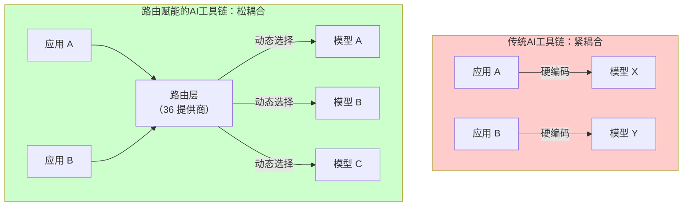
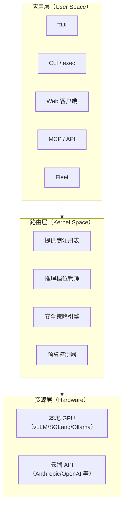
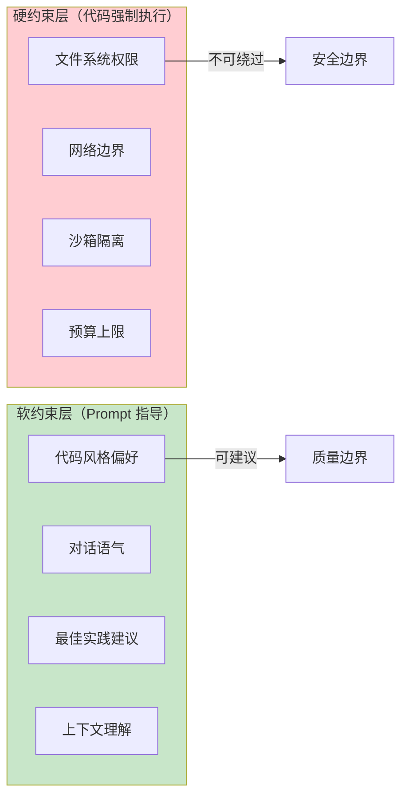
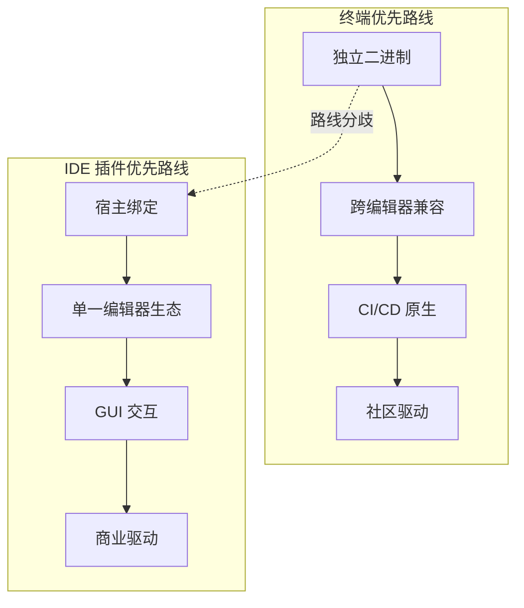
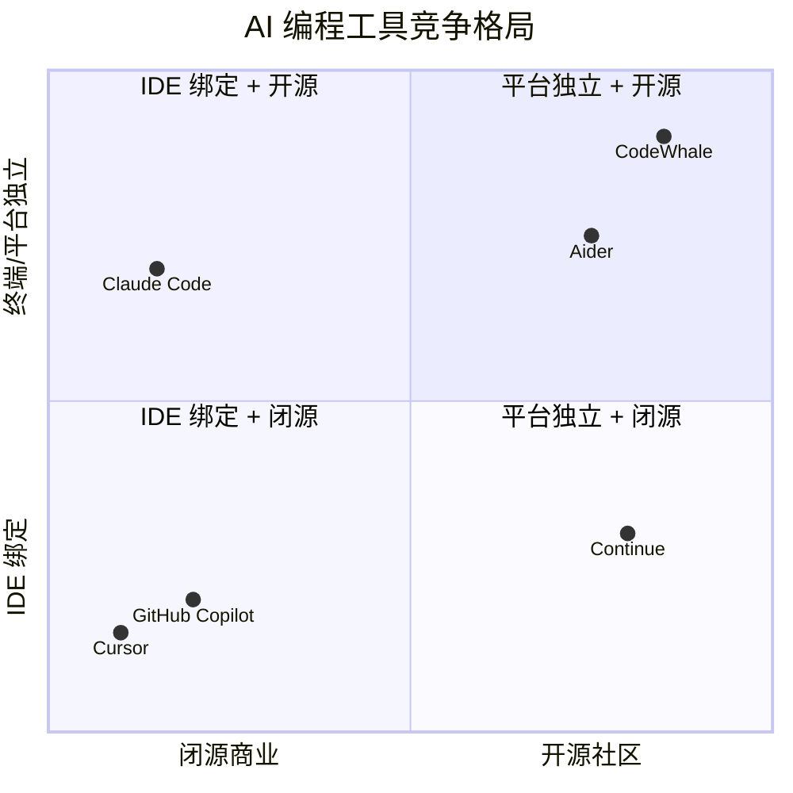
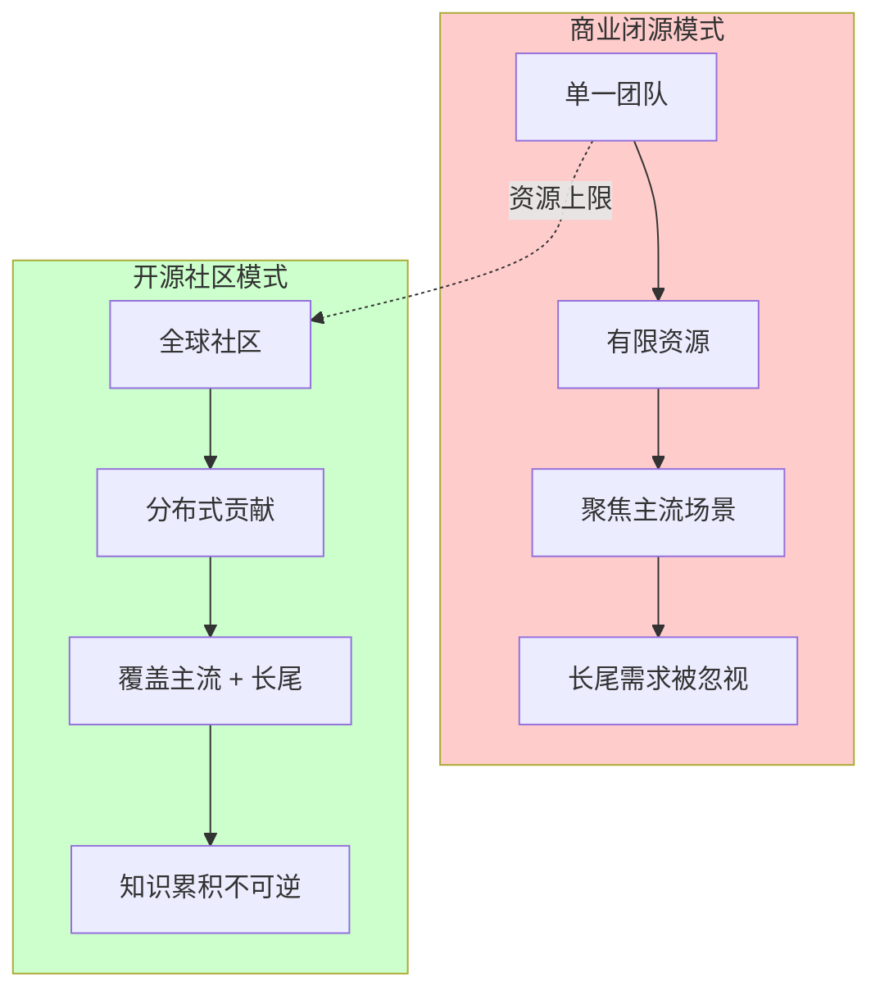
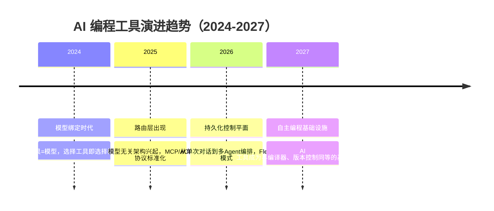

# 设计哲学与行业洞察

> "确定性代码优于概率性推理。"
> —— CodeWhale 硬编码宪法

---

## 1. 模型路由的战略意义：AI 工具链的新基础设施层

### 1.1 路由层：AI 工具链中的"缺失中间件"

在传统软件架构中，数据库连接池、负载均衡器、API 网关等中间件层承担着将上层应用与底层资源解耦的关键职责。然而在 AI 编程工具领域，这一中间件层长期缺失——工具直接绑定特定模型，形成了"应用-模型"的强耦合。

CodeWhale 的 36 提供商路由体系填补了这一空白，其战略意义在于：

### 1.2 路由层的四项核心能力

| 能力 | 说明 | 战略价值 |
|------|------|---------|
| **提供商抽象** | 统一的 Provider 接口屏蔽底层 API 差异 | 更换模型无需修改应用代码 |
| **模型独立选择** | 模型名称与提供商解耦，不会发生静默切换 | 消除"选了模型A却实际调用模型B"的隐患 |
| **推理档位管理** | 请求与实际推理深度独立追踪 | 成本可预测，性能可审计 |
| **本地/云端混合** | 同一会话中可混合使用本地和云端模型 | 安全与能力的灵活平衡 |

### 1.3 路由层作为"AI 工具链的操作系统内核"

更宏观的视角是：路由层正在成为 AI 工具链的"操作系统内核"——它负责将上层应用（TUI、CLI、Web、API、Fleet）的请求调度到下层异构计算资源（本地 GPU、云端 API、自建推理集群），同时管理资源分配、安全策略和成本控制。

---

## 2. 硬编码安全 vs Prompt 工程安全：确定性优先于智能性

### 2.1 两种安全范式的根本分歧

AI 编程工具面临的核心安全困境是：**模型越智能，其行为越不可预测**。这导致了两种截然不同的安全策略：

| 维度 | Prompt 工程安全 | 硬编码安全（CodeWhale 选择） |
|------|----------------|---------------------------|
| **核心理念** | 通过提示词约束模型行为 | 在代码层面强制约束，不依赖模型理解 |
| **可靠性** | 概率性——模型可能误解或绕过提示词 | 确定性——代码逻辑不会"忘记"规则 |
| **攻击面** | 提示词注入、越狱攻击 | 传统软件安全漏洞 |
| **可审计性** | 难以审计（提示词即行为边界） | 完全可审计（代码即行为边界） |
| **维护成本** | 低（修改提示词即可） | 中（需要修改代码逻辑） |
| **适用场景** | 内容风格、对话语气等软约束 | 文件系统访问、网络调用、权限管理等硬约束 |

### 2.2 CodeWhale 的硬编码宪法

CodeWhale 将关键安全约束编码为"硬编码宪法"（Hardcoded Constitution），而非依赖提示词工程。这一设计的核心原则是：

> **"确定性代码优于概率性推理。"**

具体体现包括：

1. **文件系统访问控制**：工具调用前在代码层验证路径和权限，而非在提示词中"请求"模型不要访问敏感目录
2. **Web 客户端仅监听 127.0.0.1**：网络边界在代码中硬编码，而非通过提示词约束
3. **沙箱隔离**：Fleet 中每个 Agent 的隔离边界由操作系统级机制保证，而非模型自我约束
4. **预算控制**：Token 和计算预算的上限在运行时强制执行，不可被模型绕过

### 2.3 两种范式的互补关系

这种分层设计确保了：即使模型在软约束层产生"幻觉"或绕过提示词约束，硬约束层仍然能保证系统的安全底线。

---

## 3. 终端作为 AI 原生载体的宣言意义

### 3.1 终端：AI 时代的"自然语言 Shell"

CodeWhale 的核心宣言之一是：

> **"终端 + 自然语言 = 最直接的 AI 交互。"**

这一宣言的本质是：终端不是 AI 的"辅助界面"，而是 AI 的"原生载体"。其逻辑链条如下：

1. **终端是开发者最自然的操作环境**：开发者已经在终端中编写代码、运行测试、管理版本控制
2. **自然语言是最自然的表达方式**：AI 编程的核心不是"写出更精确的代码"，而是"用更自然的语言表达意图"
3. **两者的结合创造了最短路径**：开发者在终端中直接用自然语言描述意图，AI 在终端中直接执行操作

### 3.2 终端优先 vs IDE 插件优先：两种产品哲学的路线分歧

| 维度 | 终端优先 | IDE 插件优先 |
|------|---------|-------------|
| **产品形态** | 独立二进制文件 | IDE 扩展/插件 |
| **编辑器兼容性** | 所有编辑器（通过 CLI 集成） | 单一 IDE 或有限 IDE 集合 |
| **商业模式** | 开源社区驱动（MIT） | 商业闭源或部分开源 |
| **用户群体** | 全栈开发者、DevOps、SRE | IDE 用户（通常为特定语言/框架开发者） |
| **集成深度** | 通过协议（MCP/ACP）集成 | 通过宿主 IDE API 深度集成 |
| **代表产品** | CodeWhale | Cursor、GitHub Copilot |

### 3.3 VS Code 扩展的定位：补充而非核心

CodeWhale 的 VS Code 扩展被明确定位为 Phase 0 的补充功能，而非核心产品路径。这一取舍体现了"终端优先"哲学的一贯性——不依赖特定 IDE 生态，而是通过 ACP（Agent Client Protocol）等协议与编辑器客户端建立松耦合连接。

---

## 4. 竞争格局分析

### 4.1 四大 AI 编程工具的系统性对比

### 4.2 逐项对比分析

#### vs Claude Code

| 维度 | Claude Code | CodeWhale |
|------|------------|-----------|
| **模型绑定** | 绑定 Claude 生态（Anthropic 独占） | 模型无关，36 个提供商自由选择 |
| **开源协议** | 闭源 | MIT 开源 |
| **交互界面** | 终端 CLI | TUI + exec + Web + MCP + Fleet |
| **本地运行时** | 不支持 | 支持 vLLM/SGLang/Ollama 直连 |
| **扩展机制** | MCP 服务器 | MCP + ACP + tools/ + SKILL.md |
| **核心差异** | 模型生态绑定形成护城河 | 模型无关形成开放生态 |

#### vs Cursor

| 维度 | Cursor | CodeWhale |
|------|--------|-----------|
| **产品形态** | IDE 插件（VS Code 分支） | 终端独立应用 |
| **开源协议** | 闭源 | MIT 开源 |
| **编辑器绑定** | 绑定 VS Code 生态 | 编辑器无关 |
| **CI/CD 兼容** | 不支持 | 原生支持（codewhale exec） |
| **国际化** | 有限 | 15 种语言 |
| **核心差异** | IDE 深度集成体验 | 终端原生 + 全场景覆盖 |

#### vs GitHub Copilot

| 维度 | GitHub Copilot | CodeWhale |
|------|---------------|-----------|
| **架构模式** | 云端依赖（代码上传至云端） | 本地优先（代码不出本地） |
| **开源协议** | 闭源 | MIT 开源 |
| **数据隐私** | 代码上传至 GitHub 云端处理 | 本地运行时完全离线 |
| **离线可用** | 不支持 | 支持 |
| **合规性** | 数据跨境传输风险 | 满足金融、军工等严格合规要求 |
| **核心差异** | 云端 AI 辅助的便利性 | 本地优先的安全与隐私控制 |

### 4.3 CodeWhale 的差异化定位总结

CodeWhale 的差异化可以概括为四个关键维度：

| 差异化维度 | 具体含义 | 对比竞品 |
|-----------|---------|---------|
| **模型无关** | 36 个提供商独立选择，不发生静默切换 | Claude Code（模型绑定）、Cursor（隐式模型选择） |
| **终端优先** | 五种运行时界面，覆盖全场景 | Cursor（IDE 绑定）、GitHub Copilot（IDE 插件） |
| **开源 MIT** | 零法律障碍，可审计可 fork | Claude Code（闭源）、Cursor（闭源）、GitHub Copilot（闭源） |
| **本地优先运行时** | 本地模型直连，无需 API 密钥 | GitHub Copilot（纯云端） |

---

## 5. 开源社区如何挑战商业闭源 AI 工具

### 5.1 开源在 AI 工具领域的独特优势

AI 编程工具领域与传统的操作系统、数据库等基础软件领域不同，开源在此具有独特的结构性优势：

| 优势 | 说明 | 在 CodeWhale 中的体现 |
|------|------|----------------------|
| **信任建立** | AI 工具直接操作代码和文件系统，闭源工具存在"信任赤字" | 完全透明可审计的代码库 |
| **模型多样性** | 闭源工具通常绑定单一模型，开源工具可聚合社区贡献的提供商适配 | 36 个提供商路由，社区可提交 Issue/PR 新增 |
| **合规需求** | 金融、军工、医疗等行业对代码外传有严格限制 | 本地运行时完全离线，满足合规要求 |
| **长尾需求** | 商业公司聚焦主流场景，开源社区覆盖长尾 | 35 个内置 Skill 包覆盖 debug、review、security-review 等 |
| **创新速度** | 社区贡献的累积效应超越单一团队 | 从 deepseek-tui 单人项目到全球社区 |

### 5.2 开源模式的"战略纵深"

### 5.3 开源不等于"免费"：MIT 协议的战略逻辑

CodeWhale 选择 MIT 协议并非简单的"免费"策略，而是基于以下战略逻辑：

1. **降低采纳门槛**：企业无需法务审批即可集成，消除"开源传染"顾虑
2. **允许商业 fork**：不强制回馈，允许企业在 MIT 基础上构建闭源商业产品
3. **最大化社区规模**：宽松的协议吸引最大范围的贡献者
4. **建立事实标准**：通过广泛采纳形成"协议标准"地位，类似 TCP/IP 的演进路径

---

## 6. AI 编程工具未来趋势判断

### 6.1 六大趋势预判

基于 CodeWhale 的设计哲学和当前行业动态，可以梳理出以下六大趋势：

| 趋势 | 关键信号 | 时间窗口 |
|------|---------|---------|
| **模型商品化** | 模型能力趋同，差异化从"模型选择"转向"工具选择" | 2025-2026 |
| **路由层标准化** | MCP、ACP 等协议成为 AI 工具互操作的事实标准 | 2025-2026 |
| **本地优先成为合规刚需** | 数据主权法规推动企业级本地运行时需求 | 2026-2027 |
| **多 Agent 编排工程化** | Fleet 模式从实验走向生产，沙箱隔离和预算控制成为标配 | 2026-2027 |
| **开源生态超越闭源** | 社区贡献累积效应在 AI 工具领域首次超越单一商业团队 | 2025-2027 |
| **终端回归** | 新一代开发者将终端+TUI 视为 AI 交互的首选界面 | 2025-2027 |

### 6.2 从"AI 辅助编程"到"编程基础设施"

最根本的趋势判断是：AI 编程工具正在从"辅助工具"进化为"编程基础设施"——与编译器、版本控制系统、包管理器处于同一层级。这一判断基于以下观察：

1. **不可逆性**：一旦开发者适应了 AI 辅助编程，退回纯手工编程的生产力落差将不可接受
2. **标准化**：MCP、ACP 等协议正在建立 AI 工具间的互操作标准
3. **工具链集成**：AI 工具正在嵌入 Git hooks、CI 流水线、代码审查流程等基础设施层
4. **模型无关**：模型层与工具层的分离使工具层获得了独立演进的能力

### 6.3 CodeWhale 的长期愿景

CodeWhale 的长期愿景可以概括为：

> **成为 AI 编程领域的"编译器"——不是最花哨的，但是最可靠的、最开放的、最可组合的。**

这一愿景体现在其六项核心设计哲学中：

| # | 设计哲学 | 原文 |
|---|---------|------|
| 1 | **模型与提供商中立** | "模型是可选择的组件，不是产品本身" |
| 2 | **确定性优先** | "确定性代码优于概率性推理" |
| 3 | **终端优先** | "终端 + 自然语言 = 最直接的 AI 交互" |
| 4 | **开源战略** | "开源不是免费，而是战略选择" |
| 5 | **工程化基础设施** | "Fleet 不是多 Agent 并行调用，而是工程化基础设施" |
| 6 | **本地优先** | 流式优先、工具安全、可扩展性、跨平台、最小依赖、本地优先运行时 API |

---

## 附录：CodeWhale 技术栈速览

| 层级 | 技术选型 | 说明 |
|------|---------|------|
| **语言** | Rust | 性能、安全、跨平台 |
| **TUI 框架** | ratatui v0.30 + crossterm v0.29 | 终端 UI 渲染与输入处理 |
| **核心 crate** | `crates/tui`（~200 源文件） | TUI 核心实现 |
| **协议** | MCP（stdio/HTTP+SSE）、ACP | 工具链集成与编辑器客户端 |
| **本地运行时** | vLLM、SGLang、Ollama | 本地推理服务直连 |
| **提供商** | 36 个 | 云端 + 本地混合 |
| **Skill 包** | 35 个内置 | batch、best-of-n、debug、review 等 |
| **CI/CD** | 14 个工作流 | ci.yml、nightly.yml、release.yml 等 |
| **国际化** | 15 种语言 | 含简体中文、繁体中文 |
| **开源协议** | MIT | 版权 2024-2025 |