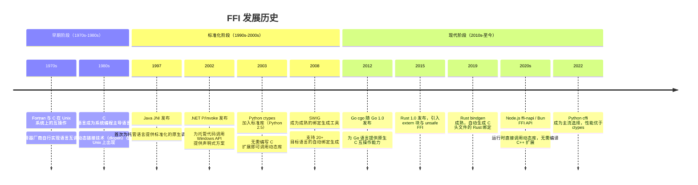
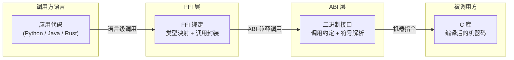

# 第 1 章 — FFI 定义与核心概念

## 1.1 FFI 标准定义

**外部函数接口**（Foreign Function Interface，简称 FFI）是一种允许**用一种编程语言编写的程序调用另一种编程语言编写的函数或服务**的机制。它是跨语言互操作性的基础技术，使不同语言能够共享代码、数据结构和运行时服务。

FFI 的核心特征可以概括为三点：

- **跨语言边界**：调用方与被调用方使用不同的编程语言
- **二进制级互操作**：通过二进制接口（ABI）而非源码级接口（API）实现调用
- **同步调用模型**：调用方直接执行被调用方的函数，如同调用本地函数一样

需要特别说明的是，FFI 本身是一种**机制**（mechanism），而非某一种编程语言的内置特性。不同的语言以不同的方式实现 FFI：Python 提供了 `ctypes` 和 `cffi`，Java 提供了 JNI（Java Native Interface），.NET 提供了 P/Invoke（Platform Invocation Services），Rust 通过 `extern` 块和 `unsafe` 关键字实现 FFI，Go 提供了 `cgo`。

### C ABI 作为事实上的通用 FFI 标准

在 FFI 的实践中，**C 语言的 ABI（Application Binary Interface）**已经成为事实上的通用标准。绝大多数编程语言都提供了调用 C 函数的能力，也同样可以暴露 C 兼容的接口供其他语言调用。原因在于：

1. **C ABI 的简洁性**：C 的函数调用模型相对简单——参数通过寄存器或栈传递，返回值通过寄存器返回，无异常处理、无垃圾回收、无虚函数表等复杂机制
2. **操作系统内核普遍使用 C 编写**：操作系统提供的系统调用接口几乎都是 C 兼容的
3. **C 编译器的广泛存在**：几乎所有平台都有 C 编译器，C ABI 是最低共分母

```c
// C 端：定义一个简单的加法函数
// math_ops.c
int add(int a, int b) {
    return a + b;
}
```

```python
# Python 端：通过 ctypes 调用 C 函数
import ctypes

lib = ctypes.CDLL("./libmath_ops.so")
lib.add.argtypes = [ctypes.c_int, ctypes.c_int]
lib.add.restype = ctypes.c_int

result = lib.add(3, 4)  # 返回 7
```

## 1.2 核心概念

### 1.2.1 跨语言调用 (Cross-Language Invocation)

FFI 存在的根本原因是：**没有任何一种编程语言在所有维度上都最优**。不同语言有各自的优势领域：

| 语言 | 优势领域 | 典型弱项 |
|---|---|---|
| Python | 快速原型、数据科学、生态丰富 | 执行性能、内存效率 |
| C | 极致性能、硬件接近、最小运行时 | 内存安全、开发效率 |
| Rust | 内存安全 + 高性能 | 编译时间、学习曲线 |
| Java | 企业生态、跨平台 JVM | 冷启动时间、内存占用 |
| JavaScript | 前端唯一选择、事件驱动 | 计算密集型任务 |

FFI 的价值在于**不必在所有维度上妥协**：你可以用 Python 编写业务逻辑，通过 FFI 调用 C/Rust 实现的高性能计算核心；你可以用 Rust 构建安全关键的系统，通过 FFI 复用已有的 C 库生态。这种"取长补短"的能力是 FFI 最核心的价值主张。

### 1.2.2 调用约定 (Calling Convention)

**调用约定**（Calling Convention）定义了函数调用在二进制层面的具体规则，是 FFI 能够正确工作的基础。它规定了：

- **参数传递方式**：哪些参数通过寄存器传递，哪些通过栈传递
- **栈清理责任**：由调用方（caller）还是被调用方（callee）负责清理栈空间
- **返回值处理**：返回值通过哪个寄存器返回，大型结构体如何处理
- **寄存器保存**：哪些寄存器由调用方保存，哪些由被调用方保存

常见的调用约定包括：

| 约定 | 环境 | 栈清理 | 说明 |
|---|---|---|---|
| `cdecl` | x86 Unix/Windows | Caller | C 语言默认约定，支持可变参数 |
| `stdcall` | x86 Windows | Callee | Win32 API 标准约定 |
| `fastcall` | x86 | Callee | 优先使用寄存器传递参数 |
| `System V AMD64` | x86-64 Unix/Linux/macOS | — | 前 6 个整数参数用寄存器 |
| `Microsoft x64` | x86-64 Windows | — | 前 4 个参数用寄存器 |

FFI 调用时，调用方和被调用方必须使用**一致的调用约定**，否则会导致栈破坏、参数错位甚至程序崩溃。

```python
# Python ctypes 中指定调用约定
import ctypes

# Windows 上使用 stdcall 约定
lib = ctypes.WinDLL("./mylib.dll")  # WinDLL 默认使用 stdcall

# Unix 上使用 cdecl 约定
lib = ctypes.CDLL("./libmylib.so")  # CDLL 默认使用 cdecl
```

### 1.2.3 数据封送 (Marshalling)

**数据封送**（Marshalling）是指将数据从一种语言的内部表示转换为另一种语言可以理解的格式的过程。因为不同语言的数据类型系统不同，FFI 调用时需要将调用方语言的数据类型"翻译"为被调用方语言的数据类型。

常见的封送转换包括：

- C `int` <-> Python `int`
- C `char*` <-> Python `bytes` / `str`
- C `struct` <-> Python `ctypes.Structure` / Java `Object`
- C 函数指针 <-> Python `CFUNCTYPE` 回调

封送（Marshalling）与序列化（Serialization）是两个不同但相关的概念：

| 概念 | 作用域 | 目标 |
|---|---|---|
| Marshalling | 跨语言边界/跨进程边界 | 将数据转为另一运行时可理解的格式 |
| Serialization | 持久化/网络传输 | 将数据转为字节流以便存储或传输 |

```c
// C 端：操作结构体
typedef struct {
    double x;
    double y;
} Point;

double distance_from_origin(Point p) {
    return sqrt(p.x * p.x + p.y * p.y);
}
```

```python
# Python 端：定义对应的结构体类型
import ctypes, math

class Point(ctypes.Structure):
    _fields_ = [("x", ctypes.c_double),
                ("y", ctypes.c_double)]

lib = ctypes.CDLL("./libgeometry.so")
lib.distance_from_origin.argtypes = [Point]
lib.distance_from_origin.restype = ctypes.c_double

p = Point(3.0, 4.0)
result = lib.distance_from_origin(p)  # 返回 5.0
```

### 1.2.4 内存边界 (Memory Boundary)

FFI 调用跨越了两种不同的内存管理模型。大多数高级语言拥有自己的内存管理器——垃圾回收器（GC），而 C 语言使用手动内存管理（`malloc`/`free`）。当数据跨越 FFI 边界时，**谁拥有内存、谁负责释放**成为必须明确回答的问题。

典型的内存所有权场景：

- **调用方分配，被调用方使用**：调用方在栈上分配结构体，通过 FFI 传递给被调用方。调用方负责释放。
- **被调用方分配，调用方释放**：C 函数通过 `malloc` 分配内存并返回指针，调用方必须调用对应的 `free` 函数。
- **被调用方分配，被调用方释放**：C 函数返回指针，但内存由库内部管理，调用方只负责读取。

```c
// C 端：分配内存并返回
char* create_greeting(const char* name) {
    char* result = malloc(256);
    snprintf(result, 256, "Hello, %s!", name);
    return result;  // 调用方负责 free(result)
}

void free_greeting(char* ptr) {
    free(ptr);
}
```

```python
# Python 端：正确管理内存
lib = ctypes.CDLL("./libgreet.so")
lib.create_greeting.argtypes = [ctypes.c_char_p]
lib.create_greeting.restype = ctypes.c_void_p
lib.free_greeting.argtypes = [ctypes.c_void_p]

ptr = lib.create_greeting(b"World")
greeting = ctypes.cast(ptr, ctypes.c_char_p).value
print(greeting.decode())  # "Hello, World!"
lib.free_greeting(ptr)    # 必须手动释放，否则内存泄漏
```

内存边界问题是 FFI 编程中最常见的 bug 来源之一——内存泄漏、use-after-free、double-free 等错误在跨语言场景下尤为难以调试。

### 1.2.5 符号解析 (Symbol Resolution)

**符号解析**（Symbol Resolution）是指运行时如何找到目标动态库中的函数入口地址。这是 FFI 调用链的第一步：在可以调用函数之前，必须先找到它。

符号解析的典型流程：

1. **加载动态库**：通过 `dlopen`（Unix）或 `LoadLibrary`（Windows）将动态库加载到进程地址空间
2. **查找符号**：通过 `dlsym`（Unix）或 `GetProcAddress`（Windows）查找目标函数的地址
3. **绑定调用**：将函数地址与调用方的 FFI 绑定关联起来

名称修饰（Name Mangling）是符号解析中的常见障碍。C++ 编译器会对函数名进行修饰以支持函数重载，导致编译后的符号名与源码中的函数名不同。例如，C++ 函数 `void foo(int, double)` 在 GCC 下可能被修饰为 `_Z3fooid`。这就是为什么 FFI 通常要求被调用方使用 `extern "C"` 声明以禁用名称修饰：

```cpp
// C++ 端：禁止名称修饰以便 FFI 调用
extern "C" {
    int add(int a, int b) {
        return a + b;
    }
}
```

```python
# Python 端：通过 ctypes 查找符号
import ctypes

lib = ctypes.CDLL("./libexample.so")
# ctypes 内部调用 dlopen + dlsym 完成符号解析
func = lib.add  # 查找 "add" 符号
```

## 1.3 FFI 发展历史



## 1.4 FFI 与 ABI/API 的关系辨析

理解 FFI 必须理解它与 ABI 和 API 之间的关系。这三者处于不同的抽象层次：

| 概念 | 层次 | 定义 | 依赖方 |
|---|---|---|---|
| **API** | 源码级 | 编程接口约定（函数签名、类型定义、头文件） | 编译器、开发者 |
| **ABI** | 二进制级 | 二进制接口约定（调用约定、数据布局、符号命名） | 链接器、运行时 |
| **FFI** | 跨语言层 | 基于 ABI 实现跨语言调用的机制 | 语言运行时、FFI 库 |

它们在调用链中的关系如下：



**关键关系**：
- **API 是源码级契约**：告诉编译器"如何调用"（函数签名、参数类型）
- **ABI 是二进制级契约**：告诉链接器"调用在二进制层面如何工作"（寄存器使用、栈布局）
- **FFI 是 ABI 的消费者**：它利用 ABI 的二进制约定，在运行时将一种语言的调用翻译为另一种语言可以执行的二进制指令

关于 ABI 的深入讨论，详见 [接口/API/ABI/协议教程 — 第 3 章 ABI](../interface-api-abi-protocol-wiki/03-abi.md)。

## 1.5 FFI 解决的核心问题

### 1.5.1 打破语言孤岛 (Breaking Language Silos)

在任何大型软件系统中，不同组件使用不同语言编写是常态而非例外。FFI 消除了"全系统必须用同一种语言重写"的刚性约束，允许每种语言做它最擅长的事，同时通过 FFI 协作。

### 1.5.2 复用已有 C 库生态 (Reusing C Libraries)

经过数十年的积累，C 生态拥有世界上最丰富的软件库集合：

- **密码学**：OpenSSL、LibreSSL、BoringSSL
- **多媒体**：FFmpeg、libpng、libjpeg、libvpx
- **数据库**：SQLite、Redis（hiredis）、PostgreSQL（libpq）
- **压缩**：zlib、zstd、lz4、brotli
- **图形**：OpenGL、Vulkan、SDL、Cairo

通过 FFI，任何语言都可以直接使用这些久经考验的库，无需重新实现。

### 1.5.3 性能关键路径优化 (Performance Optimization)

典型的性能优化模式：用高级语言（Python/JavaScript/Ruby）编写系统的主要逻辑，将性能热点路径用 C/Rust 重写，通过 FFI 调用。这样既保持了高级语言的开发效率，又获得了接近原生的执行性能。

```python
# 示例：Python 调用 C 实现矩阵乘法加速
import numpy as np
import ctypes

lib = ctypes.CDLL("./libblas_wrapper.so")

a = np.random.rand(1000, 1000).astype(np.float32)
b = np.random.rand(1000, 1000).astype(np.float32)
c = np.zeros((1000, 1000), dtype=np.float32)

# 通过 FFI 调用 C 实现的高性能矩阵乘法（如 OpenBLAS）
lib.sgemm_wrapper(
    ctypes.c_void_p(a.ctypes.data),
    ctypes.c_void_p(b.ctypes.data),
    ctypes.c_void_p(c.ctypes.data),
    ctypes.c_int(1000)
)
# 性能可达到纯 Python 实现的 100 倍以上
```

---

> **上一章**：无（这是第一章）
> **返回目录**：[00-overview.md](00-overview.md)
> **下一章**：[02-working-principles.md](02-working-principles.md)