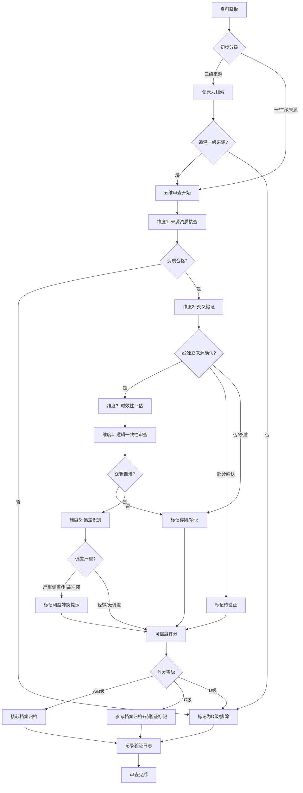

# 对抗性审查标准与验证流程

> **v1.1 更新说明**：跨领域语义漂移防御模式已正式嵌入本协议作为**阶段0：跨领域概念扫描**（步骤0.0）。本项目（第一性原理）作为首次验证在执行中发现并处理了术语漂移问题，但未在Spec阶段前置执行。后续跨领域项目请在启动阶段（Task 0）首先执行跨领域概念扫描（详见下文第0节），可降低15%+整合阶段返工率。参见 [cross-domain-semantic-drift.md](../../../retrospective/patterns/methodology-patterns/research-knowledge/cross-domain-semantic-drift.md) 模式。

## 0. 阶段0：跨领域概念扫描（Spec阶段前置，跨领域项目必做）

> 本章节为v1.1新增，基于第一性原理项目（哲学/物理/商业三领域整合）经验提炼。

若项目涉及2个及以上领域，必须在所有其他标准制定前执行：

1. **列出核心术语**：识别项目涉及的5-15个核心术语
2. **跨领域定义核查**：逐一核查每个术语在不同领域的定义差异
3. **标记歧义术语**：标记存在跨领域语义漂移的术语（本项目中"第一性原理"即为典型歧义术语）
4. **约定项目定义**：在Spec中明确本项目采用哪个领域的定义或综合性定义
5. **规划术语表**：预留10-20%总工作量用于术语对齐和术语表创建
6. **歧义标注规范**：歧义术语首次出现时标注领域语境（如"在物理学意义上"）

**单领域项目跳过条件**：若仅涉及单一领域且无学派分歧，可跳过。若单领域内存在学派分歧，仍需执行。

---

## 1. 来源分级标准

### 1.1 一级来源（Gold Standard）

**判定标准**：
- 经过严格同行评审或专家审核
- 发布机构具有公认的学术权威性
- 内容可追溯至原始研究或第一手记录
- 无明显商业利益驱动

**典型示例**：
- 同行评审学术期刊（Nature、Science、Physical Review Letters、《哲学研究》等）
- 权威出版社学术专著（剑桥大学出版社、牛津大学出版社、商务印书馆等）
- 知名大学官方发布的课程讲义、研究报告、学术论文
- 政府/国际组织官方文件（国家统计局、UNESCO、WHO、世界银行报告）
- 当事人一手演讲、访谈、自传、原始著作（如亚里士多德《形而上学》、爱因斯坦原始论文）

### 1.2 二级来源（Silver Standard）

**判定标准**：
- 由专业机构或资深从业者发布
- 具有事实核查机制但非严格学术同行评审
- 内容基于一级来源的整理或解读
- 立场相对中立，有一定编辑审核

**典型示例**：
- 权威媒体深度报道（《经济学人》、《纽约时报》深度调查、财新深度报道）
- 知名大学公开课（MIT OpenCourseWare、Coursera顶尖大学课程、耶鲁公开课）
- 知名咨询公司公开报告（麦肯锡、BCG、贝恩、Gartner行业研究报告）
- 权威科普机构内容（Scientific American、《科学美国人》中文版、果壳网专业内容）

### 1.3 三级来源（Bronze Standard）

**判定标准**：
- 发布主体资质不明确
- 无正式审核流程
- 内容主观性较强
- 仅作为线索使用，不得直接作为论据

**典型示例**：
- 个人博客、Medium文章
- 自媒体内容、微信公众号文章
- 论坛讨论（Reddit、知乎、Stack Exchange）
- 社交媒体帖子

**使用限制**：仅作线索发现，必须追溯至一级或二级来源验证后方可引用。

---

## 2. 可信度评分体系

| 评分 | 判定标准 | 使用建议 | 颜色标记 |
|------|----------|----------|----------|
| **A级** | 多权威来源交叉验证（≥2个独立一级来源）；无利益冲突；可追溯至原始出处；方法论明确可检验 | 核心论据，可直接引用，作为推理基石 | 🟢 绿色 |
| **B级** | 单一权威一级来源；逻辑自洽；无明显偏差；领域内共识度高 | 可作为辅助论据，标注来源，鼓励交叉验证 | 🔵 蓝色 |
| **C级** | 二级来源；需进一步验证；存在潜在偏差；观点非普遍共识 | 仅作参考，必须标注"待验证"，不得作为独立论据 | 🟡 黄色 |
| **D级** | 存疑；无法验证；存在明显矛盾或利益冲突；来源不可追溯 | 不纳入核心档案；仅作为反面案例或问题线索记录 | 🔴 红色 |

---

## 3. 五维验证流程

### 维度1：来源资质核查

**操作指引**：
1. 核查发布机构：查询机构背景、同行认可度、历史信誉记录
2. 核查作者资质：学术背景、相关领域研究经历、过往作品可信度
3. 核查发表渠道：是否为正规出版物/平台，是否有审核机制
4. 核查引用情况：该资料被其他权威来源引用的次数与评价
5. 核查利益冲突：作者/机构是否与内容结论存在商业或立场关联

### 维度2：交叉验证

**操作指引**：
1. 提取关键事实主张，列出待验证要点清单
2. 为每个关键事实寻找至少2个独立来源进行确认
3. 优先使用不同类型、不同立场的来源进行三角验证
4. 记录验证过程中的一致点与分歧点
5. 对存在分歧的内容标注为"争议观点"，追溯分歧根源

**关键事实判定**：涉及核心概念定义、核心论断、关键数据、重要时间/人物/事件的信息必须交叉验证。

### 维度3：时效性评估

**操作指引**：
1. **经典理论类**（哲学、数学、基础物理原理）：重点考察经典版本，同时关注最新学术讨论是否有修正
2. **实证研究类**（科学实验、社会调查）：要求使用近10年内的研究，经典实验需确认是否被重复验证
3. **前沿领域类**（AI、量子计算、生物科技）：必须使用近3-5年的最新研究，关注领域共识形成状态
4. **历史研究类**：原始史料时间越早越好，但现代考证研究需使用最新学术成果
5. 标注内容的"证据保质期"，定期对时效性敏感内容进行复审

### 维度4：逻辑一致性审查

**操作指引**：
1. **内部逻辑检查**：论证过程是否存在自相矛盾、循环论证、偷换概念
2. **论据支持检查**：结论是否有充分论据支撑，论据是否与结论直接相关
3. **数据合理性检查**：数据来源是否标注，统计方法是否科学，数据解读是否准确
4. **论证结构检查**：识别演绎/归纳/类比论证，检查推理有效性
5. **反例审查**：主动寻找与结论相反的证据或案例，评估解释力

### 维度5：偏差识别

**操作指引**：
1. 识别作者/机构的立场倾向与价值预设
2. 检查是否存在选择性使用证据（只选支持性证据，忽略反证）
3. 评估语言情绪化程度与客观性
4. 识别常见认知偏差在论证中的体现（见第4节清单）
5. 对存在明显偏差的内容标注偏差类型与影响程度

---

## 4. 认知偏差识别清单

| 偏差名称 | 定义 | 第一性原理资料中的典型表现 | 识别方法 | 防控措施 |
|----------|------|----------------------------|----------|----------|
| **确认偏差** | 倾向于寻找、解读和记忆支持自己已有信念的信息 | 只引用支持某一理论的研究，忽略反对证据；对反例进行特殊辩解 | 检查文献综述是否全面覆盖正反两方面研究；统计支持/反对证据的引用比例 | 强制搜索反证；要求列出与结论矛盾的证据并逐一回应 |
| **幸存者偏差** | 只关注经过某种筛选后幸存的案例，忽略被筛选掉的案例 | 用成功企业家案例推导成功法则，忽略失败企业；引用被引用次数高的论文，忽略未被引用但可能有价值的研究 | 检查样本是否全面；提问"沉默的大多数是什么"；是否考虑了失败案例 | 系统性收集正反案例；使用全样本数据分析；区分相关性与因果性 |
| **权威崇拜偏差** | 过度相信权威人物/机构的观点，不加批判地接受 | "某某大师说..."直接作为论据；引用诺贝尔奖得主在非专业领域的观点；将某权威的个人观点当作领域共识 | 检查观点是否有证据支撑而非仅靠权威背书；核查权威是否在相关专业领域发言 | 对权威观点同样进行五维验证；区分权威的研究结果与个人观点 |
| **事后归因偏差** | 认为事件A之后发生事件B，则A导致了B | 用历史案例推导因果关系，忽略其他变量；"因为某人做了X，所以成功了" | 检查是否排除了混淆变量；是否有对照组；相关性是否被错误当作因果 | 寻找对照案例；考虑替代解释；评估因果机制合理性 |
| **锚定效应** | 过度依赖最先获得的信息 | 阅读顺序影响对理论的评价；第一个接触的解释框架成为后续思考的锚点 | 检查是否系统性比较了不同理论框架；是否有先入为主的判断 | 采用不同顺序阅读对立观点；刻意从多个起点重新分析问题 |
| **框架效应** | 同一信息因呈现方式不同而导致不同判断 | 对同一理论的描述使用褒义/贬义词汇影响接受度；选择性强调某些方面 | 检查语言的情感色彩；尝试用中立语言重述观点；对比不同框架下的结论 | 使用中性语言描述对立观点；要求正反方都使用最强论证形式呈现 |
| **可得性启发** | 依赖容易想到的例子而非全面统计 | 用容易想到的生动案例替代统计数据；因媒体报道频繁而高估某些事件概率 | 检查是否使用统计数据而非个案；案例是否具有代表性 | 优先使用系统性统计数据；明确区分个案证据与统计证据 |
| **立场偏向** | 因作者的意识形态、文化、职业立场导致系统性偏差 | 某些学科流派的学者只引用本流派文献；商业机构发布有利于自身行业的研究；政治立场影响历史解读 | 核查作者背景与资金来源；对比不同立场来源对同一问题的描述 | 多立场来源对比；识别预设前提；标注作者立场可能带来的影响 |
| **过度简化偏差** | 为追求简洁而忽略重要复杂性，将复杂问题简单化 | 将复杂理论简化为口号式总结；忽略重要边界条件；"第一性原理就是从本质出发"这类无信息量表述 | 检查核心概念是否有精确定义；边界条件是否明确；是否存在误导性简化 | 保留理论的必要复杂性；明确标注适用范围与边界条件 |
| **跨领域语义漂移** ⭐ | 同一术语在不同领域含义完全不同，默认按本领域含义理解 | "第一性原理"在哲学中是第一因、在物理中是基本单元、在商业中是反类比推理；各领域搜集时内部一致，整合时才暴露矛盾 | Spec阶段执行概念扫描；整合阶段检查术语跨章节使用是否统一；歧义术语首次出现标注领域 | 阶段0概念扫描；建立术语表作为单一事实源；歧义术语首次出现标注领域语境 |

---

## 5. 异常信息标记规范

### 5.1 "待验证"标记

**使用场景**：
- 来自二级来源，尚未找到一级来源支撑
- 关键事实仅单一来源提及，未完成交叉验证
- 数据来源标注不清晰，需要进一步追溯

**格式模板**：
```markdown
> **⚠️ 待验证**：此处关于[具体内容]的信息来自[来源简述]，尚未完成多来源交叉验证。需追溯至[建议验证方向]后确认。
```

### 5.2 "存疑"标记

**使用场景**：
- 内容与其他权威来源存在明显矛盾
- 逻辑存在明显漏洞或无法自洽
- 数据看起来不合理或不符合常识
- 来源资质存在疑问

**格式模板**：
```markdown
> **❓ 存疑**：此处[具体内容]与[矛盾来源]的记载存在冲突/逻辑上存在以下疑问：[具体疑点描述]。需进一步考证。
```

### 5.3 "争议观点"标记

**使用场景**：
- 学术领域内存在明确学派争议的问题
- 不同权威来源持对立观点且均有论据
- 尚无定论的前沿问题

**格式模板**：
```markdown
> **⚖️ 争议观点**：关于[具体问题]，学术界存在不同立场：
> - 观点A（代表人物/来源：xxx）：[核心论点]
> - 观点B（代表人物/来源：yyy）：[核心论点]
> - 争议焦点：[核心分歧点]
> 本档案采用[观点A/B/折中处理]，原因：[说明]。
```

### 5.4 "利益冲突提示"标记

**使用场景**：
- 研究由有利益关联的机构资助
- 作者与结论存在商业、职业或立场关联
- 发布平台可能存在系统性偏向

**格式模板**：
```markdown
> **🔍 利益冲突提示**：本资料[来源/作者]与[相关利益方]存在[资金/雇佣/立场]关联，可能影响结论客观性。阅读时请注意甄别。
```

### 5.5 "歧义术语"标记（v1.1新增）

**使用场景**：
- 术语存在跨领域语义漂移
- 同一术语在不同章节/来源中含义不同
- 需要明确标注使用语境

**格式模板**：
```markdown
> **📚 歧义术语**：本处"[术语名称]"在[领域]意义上使用，定义为[简要定义]。该术语在其他领域（如[其他领域]）有不同含义，详见[术语表链接]。
```

---

## 6. 来源验证日志模板

### 6.1 日志文件结构

日志文件命名为 `source-validation-log.md`，采用表格形式记录，每条记录包含以下字段：

| 字段名 | 说明 |
|--------|------|
| 资料ID | 唯一标识符，格式：SRC-YYYYMMDD-XXX |
| 资料标题 | 资料的完整标题 |
| 来源类型 | 一级/二级/三级 |
| 可信度评分 | A/B/C/D |
| 来源URL/出版信息 | URL或出版社、出版年份、ISBN等 |
| 验证过程记录 | 五维验证的简要过程与发现 |
| 交叉验证来源列表 | 用于交叉验证的其他资料ID |
| 偏差识别结果 | 识别到的偏差类型与说明 |
| 审查结论 | 采纳/待验证/排除 |
| 审查人 | 审查者标识 |
| 审查时间 | YYYY-MM-DD |

### 6.2 示例记录

| 资料ID | 资料标题 | 来源类型 | 可信度评分 | 来源URL/出版信息 | 验证过程记录 | 交叉验证来源列表 | 偏差识别结果 | 审查结论 | 审查人 | 审查时间 |
|--------|----------|----------|------------|------------------|--------------|------------------|--------------|----------|--------|----------|
| SRC-20260709-001 | 《物理学的第一原理》 | 一级 | A | 剑桥大学出版社，2020，ISBN: 978-1108476553 | 1. 来源资质：剑桥大学出版社学术专著，作者为牛津大学物理系教授；2. 交叉验证：核心概念与MIT OpenCourseWare 8.04、费曼物理学讲义一致；3. 时效性：经典物理原理内容不受时效影响；4. 逻辑：论证严谨，公式推导完整；5. 偏差：无明显利益冲突 | SRC-20260709-002, SRC-20260709-003 | 无显著偏差 | 采纳 | AI-Reviewer | 2026-07-09 |
| SRC-20260709-002 | MIT 8.04 量子物理讲义 | 一级 | A | https://ocw.mit.edu/courses/8-04-quantum-physics-i-spring-2013/ | 1. 来源资质：MIT官方开放课程，教授为知名物理学家；2. 交叉验证：与《物理学的第一原理》、费曼讲义第三卷一致；3. 时效性：基础量子理论为成熟理论；4. 逻辑：课程体系完整，习题丰富；5. 偏差：无 | SRC-20260709-001 | 无显著偏差 | 采纳 | AI-Reviewer | 2026-07-09 |
| SRC-20260709-003 | 某自媒体文章《第一性原理思考的十大秘诀》 | 三级 | D | https://example.com/blog/first-principles-tips | 1. 来源资质：个人博客，作者无相关学术背景；2. 交叉验证：核心观点无法在任何一级来源中找到对应表述，存在对马斯克案例的过度解读；3. 逻辑：存在多处循环论证与事后归因偏差；4. 偏差：确认偏差明显，选择性使用证据 | - | 存在确认偏差、幸存者偏差、过度简化偏差、权威崇拜偏差 | 排除 | AI-Reviewer | 2026-07-09 |

---

## 7. 审查执行流程图



---

## 附录：快速检查清单

在完成资料审查前，请确认以下问题均已回答：

**阶段0（Spec阶段，跨领域项目必做）**：
- [ ] 是否已执行跨领域概念扫描，列出核心术语并核查各领域定义？
- [ ] 歧义术语是否已标记，项目内使用定义是否已约定？
- [ ] 术语表创建任务是否已规划（预留10-20%工作量）？

**审查执行阶段**：
- [ ] 来源分级是否正确？
- [ ] 是否完成五维验证流程？
- [ ] 关键事实是否经过至少2个独立来源交叉验证？
- [ ] 可信度评分是否有充分依据？
- [ ] 所有认知偏差（含语义漂移）是否已识别并标注？
- [ ] 是否需要使用异常信息标记（含歧义术语标记）？
- [ ] 验证日志是否已完整记录？
- [ ] 归档位置是否正确？
