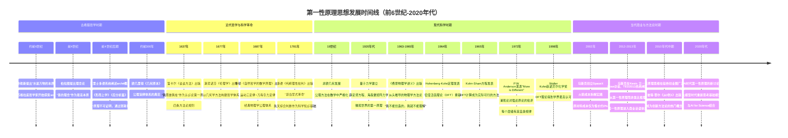
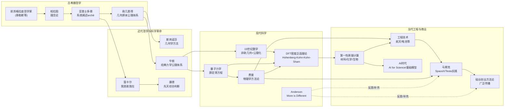

# 第一性原理发展时间线

## 1. 引言

第一性原理（First Principles，希腊文ἀρχαί，archai）是人类思想史上最具生命力的核心概念之一。本时间线覆盖从公元前6世纪古希腊哲学对宇宙本原的探索，到2020年代AI时代第一性原理思维在商业与创新领域的广泛应用，跨度约2600年。

时间线将思想发展划分为四个主要时期：
- **古希腊哲学时期**（前6世纪-前4世纪）：从泰勒斯等前苏格拉底哲学家对本原的探索，经柏拉图理念论，到亚里士多德正式系统阐述archē概念
- **中世纪与近代哲学时期**（17-18世纪）：笛卡尔"我思故我在"的认识论转向、斯宾诺莎几何学方法、牛顿经典力学公理体系、康德先天综合判断
- **现代科学时期**（19-20世纪）：公理方法在数学中的发展、量子力学建立、密度泛函理论（DFT）奠基与发展、费曼物理学方法论、"More is Different"对还原论的反思
- **当代商业与方法论时期**（21世纪）：马斯克在创业实践中应用第一性原理、2013年TED演讲使其在硅谷广泛传播、AI时代的新发展

本时间线的资料来源严格基于已验证的哲学原著、科学史文献和当事人公开演讲，避免自媒体夸张叙事和事后神化偏差。对于无法精确考证的年份，标注为约数并说明依据。时间线不仅记录成功案例和思想进步，也纳入了对第一性原理思维的反思（如Anderson"More is Different"对强还原论的批评），以呈现平衡的视角。理解第一性原理的局限性，与掌握其用法同样重要。

---

## 2. 第一性原理发展时间线图

**时间线节点统计**：
- 古希腊哲学时期：4个关键节点
- 近代哲学与科学革命：4个关键节点
- 现代科学时期：7个关键节点
- 当代商业与方法论时期：4个关键节点
- 总计：19个关键历史节点，覆盖2600年思想演进

---

## 3. 分期详细说明

### 3.1 古希腊哲学时期（前6世纪-前4世纪）

古希腊哲学是第一性原理思想的源头。前苏格拉底哲学家首次摆脱神话思维，以理性方式追问宇宙的"本原"（archē）——泰勒斯认为水是万物的本原，阿那克西曼德提出无定（apeiron）作为无规定的永恒实体，阿那克西美尼以气为本原，赫拉克利特以火为万物本原并强调逻各斯（λόγος）作为万物变化的分寸，毕达哥拉斯学派认为数是万物的本原，巴门尼德提出存在是不动的"一"，德谟克利特提出原子与虚空构成万物。这些探索虽结论各异，但共同开创了"追溯终极基础"的思维范式，不再满足于神话对世界的解释，而是寻求自然本身的根本原理。柏拉图的理念论将真实存在归于永恒不变的理念世界，可感事物因"分有"理念而存在，在《理想国》的"日喻"中，"善的理念"被比作太阳，是理念存在和知识的终极来源，构成其体系中的终极第一原理；"线段喻"将认识划分为四个阶段，辩证法无需假设直接上升到第一原理，是最高的学问。亚里士多德是这一概念的真正奠基者，他在《形而上学》Δ卷系统定义了archē的六种含义，统一了本体论（存在的起点）、认识论（认识的起点）和方法论（证明的起点）三个维度；在《后分析篇》中论证了第一原理不可证明（否则会陷入无穷倒退或循环论证），而是通过努斯（νοῦς，理性直观）在归纳基础上把握；其形式逻辑（三段论）为从第一原理进行演绎推理提供了工具；他还明确区分了"对我们而言更可知"与"在本性上更可知"，科学研究就是从前者上升到后者。欧几里得《几何原本》（约前300年）是公理化方法的首次完美实践，从23个定义、5条公设、5条公理出发演绎出465个定理，成为后世科学理论建构的不朽典范。

### 3.2 近代哲学与科学革命（17-18世纪）

近代哲学将第一性原理问题从古代的本体论范式转向认识论范式，核心问题从"世界的本原是什么"转变为"知识的确定性基础是什么"。笛卡尔以"普遍怀疑"为方法论武器，在《第一哲学沉思集》和《谈谈方法》（1637）中系统清除一切不可靠的成见——感官可能欺骗我们、梦境与清醒无法区分、甚至可能存在一个邪恶精灵系统性地欺骗我们——最终在"我思故我在"（Cogito, ergo sum）中找到了不可动摇的认识论阿基米德点。笛卡尔强调"我思"不是三段论结论，而是精神直观直接把握的自明真理，从这一第一原理出发，他依次证明上帝存在和物质世界存在，试图重建人类知识的确定性大厦。《谈谈方法》中提出的四条方法论规则——绝不接受未明确认识为真的东西、把难题分成若干部分、从最简单对象逐步上升到复杂对象、尽量全面考察——本质上就是第一性原理"拆解-重构"的方法论程序。斯宾诺莎将笛卡尔的理性主义推向极致，在《伦理学》（1677，全名《用几何学方法作论证的伦理学》）中完全模仿欧几里得结构：每卷从定义和公理出发，通过严格证明推导出命题，附以附释说明，实体一元论（神即自然）作为其形而上学最高原理，展示了公理化方法构建哲学体系的力量。牛顿1687年出版的《自然哲学的数学原理》是科学革命的巅峰，他模仿欧几里得结构，从定义（质量、动量、惯性、力）、运动三定律和万有引力定律出发，通过严格数学演绎，推导出开普勒定律、月球运动、潮汐现象、彗星轨道等结论，实现了"天地统一"的伟大综合。麦克斯韦后来评论道：牛顿的工作是人类理性在解释自然方面最伟大的胜利。康德通过"哥白尼式革命"（《纯粹理性批判》1781/1787）将第一原理内化为认识主体的先天认识形式——空间、时间是感性直观形式，十二范畴是知性纯粹概念——这些先天形式是一切经验知识得以可能的前提条件，"人为自然立法"。康德提出"先天综合判断何以可能"作为批判哲学的总问题，系统阐述了"纯粹知性原理体系"（直观的公理、知觉的预测、经验的类比、一般经验思维的公准）作为自然科学的第一原理，同时为理性划定界限：我们只能认识现象，不能认识物自体，当理性超出经验范围就会陷入二律背反。

### 3.3 现代科学时期（19-20世纪）

19世纪非欧几何的发现（罗巴切夫斯基1829年、波尔约1832年、黎曼1854年）深刻改变了人们对公理的理解：公理不再是不证自明的绝对真理，而是一个理论体系的基础假设，选择不同的平行公理可以得到不同但自洽的几何体系（罗氏几何、黎曼几何），这使公理方法获得了更大的灵活性和数学上的严格性，为20世纪希尔伯特形式主义公理化运动奠定了基础。20世纪20年代量子力学的建立标志着微观世界第一原理的确立：1925年海森堡、玻恩、约当创立矩阵力学，1926年薛定谔创立波动力学并证明二者等价，狄拉克、冯·诺依曼等人完成了量子力学的数学基础。薛定谔方程作为量子力学的基本方程，地位相当于经典力学中的牛顿第二定律。尽管量子力学的基本假设（波函数概率解释、不确定关系、测量坍缩）在直觉上难以理解，但量子电动力学（QED）经费曼、朝永振一郎、施温格等人发展后，成为人类有史以来最精确验证的理论，其预测与实验符合精度达10⁻¹⁰量级。1960年代密度泛函理论（DFT）的创立是第一性原理从哲学理念转化为实用计算工具的关键：1964年Hohenberg-Kohn定理证明基态电子密度唯一决定体系所有性质，将问题从3N维多体波函数约化为3维电子密度；1965年Kohn-Sham方程通过引入无相互作用虚拟电子体系，使DFT计算实际可行。1963-1965年出版的《费曼物理学讲义》从头重构了物理学教学体系，费曼拒绝让学生死记公式，而是不断追问"我们到底知道什么、是怎么知道的"，他在1979年访谈中说："我不理解任何东西，除非我能从头把它推导出来"，其黑板遗言"我不能创造的，我就不能理解"成为第一性原理思维的标志性口号。1972年菲利普·安德森（1977年诺贝尔物理学奖得主）在《科学》杂志发表《多者异也》（More is Different），深刻批判了"建构论还原论"：虽然一切现象都还原为基本粒子定律，但这并不意味着能从这些定律出发建构出所有宏观现象；当系统尺度和复杂度增加时，会通过对称性破缺出现全新的涌现性质，每个层级都有自己的基本定律，还原论和涌现论是互补而非对立的视角。这篇论文为第一性原理思维划定了合理边界，避免了将其误用为万能钥匙。1998年沃尔特·科恩（Walter Kohn）因发展DFT与约翰·波普（John Pople，量子化学计算方法）共同获得诺贝尔化学奖，标志着第一性原理计算方法得到学界最高认可。

### 3.4 当代商业与方法论时期（21世纪）

21世纪初，埃隆·马斯克在创业实践中开始自觉运用第一性原理思维，而这一思维方式直接来自他的物理学背景。2002年创立SpaceX时，面对商业火箭发射市场被ULA等传统承包商垄断、发射价格极其昂贵的局面，马斯克没有接受"火箭就是这么贵"的行业共识（类比推理的结论），而是采用物理学方法进行拆解：火箭由什么原材料构成？航空级铝合金、钛、铜、碳纤维。这些原材料在伦敦金属交易所等商品市场的价格是多少？计算结果显示原材料成本仅为传统火箭售价的约2%。这一分析揭示了巨大的成本优化空间——传统火箭价格高昂的主要原因不是物理限制，而是行业惯例、外包模式和缺乏竞争。SpaceX通过垂直整合制造（自产90%以上部件）、可重复使用技术（一级火箭垂直回收）、简化设计（如Starship使用不锈钢替代碳纤维）、规模化生产和高频发射摊薄固定成本，将火箭发射成本降低了约20倍。Tesla电池成本分析是另一个经典案例：2010年前后锂电池组价格约$600-$1100/kWh，行业共识是电池成本短期内难以大幅下降，马斯克将电池拆解到钴、镍、铝、碳、聚合物隔膜、钢壳等原材料，计算伦敦金属交易所现货价格约为$80/kWh（理论下限），通过Gigafactory超级工厂规模化垂直整合制造、电池化学优化（减少钴用量）、4680电池和结构化电池包等技术路径，推动电池成本持续下降。2012年Kevin Rose访谈和2013年TED大会演讲是第一性原理进入商业话语体系的关键节点——马斯克在TED上明确对比了两种思维方式的本质区别：类比思维是"因为之前这么做过或者别人这么做，所以我们也这么做"，第一性原理思维是"把事物煮沸浓缩到最基本的真理，然后从那里向上推理"。2014年南加州大学毕业典礼演讲中他诚实承认："这很难做到，你不能对所有事情都这样思考，这需要很多努力，但如果你想做新的事情，这是最好的思考方式。"2015年Reddit AMA中他用知识之树比喻："确保你理解基本原理（树干和大树枝），然后再看树叶/细节，否则树叶没有地方挂得住。"2010年代中期，第一性原理思维在硅谷创业圈广泛传播，彼得·蒂尔《从0到1》（2014）将其与"从0到1的垂直创造"理念结合推广，但也出现了过度简化、事后神化、幸存者偏差等问题——媒体常将复杂的成功故事简化为"用了第一性原理所以成功"，忽略了Falcon 1前三次发射失败的试错过程、NASA数十亿美元合同的支持、资深工程师团队的经验积累等关键因素。查理·芒格的"多元思维模型"虽然未直接使用"第一性原理"术语，但强调掌握各学科最重要的基本原理形成"格栅框架"，与第一性原理精神有深刻共鸣同时也有重要差异（更强调跨学科综合和逆向思维）。2020年代，大语言模型和AI for Science的兴起为第一性原理思维带来了新的讨论维度：一方面，基础模型（Foundation Models）被视为AI时代的"第一原理"，通过大规模预训练捕捉通用规律；另一方面，DFT等第一性原理计算与机器学习结合（如机器学习势函数）正在大幅加速新材料、药物和催化剂研发；同时，人们也更加清醒地认识到第一性原理思维的适用边界——它在物理、工程等"硬"领域效果显著，在涉及人类行为、市场、组织等复杂系统时需要与经验、类比、启发式方法结合使用。

---

## 4. 跨领域发展脉络图

**脉络说明**：第一性原理概念从古希腊哲学的本体论探索出发，经近代哲学的认识论转向后，在经典物理学中获得了最成功的科学实践；现代物理学（量子力学）和数学（公理化运动）进一步深化了方法论基础，并通过DFT将抽象原理转化为可操作的计算工具；费曼的方法论思想直接影响了马斯克等当代工程师和创业者；2013年后第一性原理从物理学/工程领域进入商业创新话语；Anderson的涌现论思想作为反思线索，提醒人们注意还原论方法的边界；AI时代正在为这一古老思想注入新的活力。

---

## 5. 重要节点详细说明

### 5.1 亚里士多德系统阐述archē概念（前4世纪）

亚里士多德是第一性原理概念的真正奠基者，其贡献在于第一次对这一概念进行了系统、全面的哲学阐述，而这一概念的影响延续了两千三百多年至今。在《形而上学》第五卷（Δ卷，通常被称为"哲学词典"）第四章中，他仔细辨析了"本原"（archē）的六种含义：(1)事物中运动由之开始之点（如一条线的起点）；(2)某一事情最佳的生成点（如学习不一定从第一章开始，从最好入手处开始）；(3)内在于事物、事物由之生成的初始之点（如船的龙骨、房屋的基石、动物的心或脑）；(4)由之生成但并不内在于事物的东西，运动和变化自然地由之开始（如婴儿出于父母、打架出于吵嘴）；(5)按照其意图能运动的东西运动（如城邦的统治者、技师、尤其是大匠师）；(6)事物最初由之认识的东西（如证明的前提是证明的本原）。他总结道："全部本原的共同之点就是存在或生成或认识由之开始之点。"这个定义统一了本体论（存在和生成的起点）、认识论（认识的起点）和方法论（证明的起点）三个维度，是哲学史上对这一概念第一次清晰而全面的界定。在《后分析篇》中，亚里士多德提出了关于第一原理的核心认识论主张：科学知识通过证明获得，但第一原理不可证明——如果要求一切都要有证明，就会陷入无穷倒退（证明的前提还需要证明，永无止境）或者循环论证（用结论证明前提）；因此必须存在直接的、不可证明的第一原理，它们通过努斯（νοῦς，理性直观）在感知和经验归纳（ἐπαγωγή）的基础上被把握。亚里士多德还明确区分了"对我们而言更可知"与"在本性上更可知"：前者是离我们的感官近的具体事物（现象），后者是事物的第一原理（本质、原因），科学研究的道路就是从"对我们而言更可知"的东西出发，上升到"在本性上更可知"的东西。亚里士多德创立的形式逻辑（三段论）为从第一原理进行演绎推理提供了有效的工具。他的archē概念为整个西方哲学和科学的公理化方法论奠定了基础，直到今天，当我们谈论"第一性原理"时，其核心含义——一个系统中不可还原、不可演绎的基础，既是认识起点也是存在根基——仍然可以追溯到亚里士多德的系统阐述。

### 5.2 牛顿《自然哲学的数学原理》（1687年）

牛顿1687年出版的《自然哲学的数学原理》（*Philosophiæ Naturalis Principia Mathematica*，简称《原理》）是第一性原理思维在科学中最成功的典范之一，标志着近代科学革命的巅峰和经典物理学公理体系的建立。这部著作的写作结构本身就体现了对欧几里得《几何原本》的刻意模仿：全书分为三编，第一编从定义和公理（运动定律）出发，通过严格的数学演绎推导出各种运动规律；第二编讨论物体在阻滞介质中的运动；第三编"宇宙体系"将前两编的结果应用于太阳系，解释天体运动。在最开头的"定义"部分，牛顿定义了质量（物质的量）、动量（运动的量）、惯性、外力、向心力等基本概念；然后在"公理或运动定律"部分提出了著名的三大运动定律：第一定律（惯性定律）、第二定律（F=ma，运动变化正比于外力）、第三定律（作用与反作用相等）。加上万有引力定律（任意两个质点通过连心线相互吸引，力与质量乘积成正比、与距离平方成反比），这四条定律构成了经典力学的完整公理基础。从这少数基本原理出发，牛顿推导出了开普勒行星运动三定律（椭圆轨道、面积定律、周期定律），证明了行星在平方反比力作用下必然沿圆锥曲线运动；解释了月球运动的不规则性、潮汐现象（由月球和太阳引力引起）、彗星的轨道；统一解释了地面物体下落（苹果落地）和天体运行（行星绕日）——这是人类历史上第一次"天地统一"的伟大综合，打破了亚里士多德以来"月下界"和"月上界"遵循不同规律的传统观念。牛顿在《原理》总释中写下了著名的"我不杜撰假说"（*Hypotheses non fingo*）宣言："凡不是从现象中推导出来的东西都称为假说；假说无论是形而上学的还是物理学的，无论是隐秘性质的还是力学的，在实验哲学中都没有位置。"这正是第一性原理精神的经典表述：拒绝引入无法从基本定律推导的特设性假设，只接受从现象通过归纳得出的原理。海王星的发现（1846年）是牛顿公理体系演绎威力的惊人展示：天文学家发现天王星轨道与牛顿定律预测存在微小偏差，勒维耶（法国）和亚当斯（英国）没有怀疑牛顿定律，而是假设存在一颗未知行星的引力导致偏差，仅从牛顿定律出发计算出了未知行星的位置和质量，伽勒在收到勒维耶的信后仅用一小时就在预测位置附近发现了海王星——这是人类历史上第一次"笔尖上发现的行星"。牛顿的公理体系不仅是物理学的典范，也深刻影响了后世所有精密科学（包括康德哲学）的方法论建构。

### 5.3 费曼与物理学第一性原理方法论（1960年代）

理查德·费曼（Richard P. Feynman, 1918-1988）不仅是1965年诺贝尔物理学奖得主（因量子电动力学重正化理论），更是20世纪将第一性原理思维方式阐述得最清晰、实践得最彻底的物理学家，他的思想直接影响了埃隆·马斯克等当代创新者。费曼的方法论核心是：拒绝死记硬背和形式主义，始终追问"我们到底知道什么、我们是怎么知道的、这到底意味着什么"，坚持从基本物理原理出发推导和理解一切现象，认为"理解"意味着你能从头把它推导/构建出来。他在1979年的一次访谈中直白地说："我学东西的方式是——除非我能从头把它推导出来，否则我就不理解任何东西。"（*The way I learn is by— I don't understand anything unless I can derive it from scratch.*）写在他黑板上的遗言"我不能创造的，我就不能理解"（*What I cannot create, I do not understand.*）是第一性原理精神的极致表达。《费曼物理学讲义》（1963-1965年出版）是他在加州理工学院为本科生讲授基础物理课程的结晶，全书从头到尾贯彻第一性原理精神：不是按照传统教科书的顺序罗列公式，而是从头重构物理学体系。讲义开篇第一章就提出了著名的"原子假设"作为最有信息量的一句话："如果在某次大灾难中所有科学知识都被摧毁，只给下一代留下一句话，我相信是原子假设——所有事物都由原子构成，这些小粒子在永恒运动，相距不远时相互吸引，被压到一起时就会排斥。"费曼认为，只要加上一点想象力和思考，这句话就包含了关于世界的海量信息。费曼学习法（虽然后人命名，但准确反映其精神）的四个步骤——选择概念、用最简单语言教给小孩（不能用简单语言解释说明没理解）、识别卡壳处回到原材料学习、整理简化——本质上就是第一性原理思维在学习中的应用。1974年费曼在加州理工学院毕业典礼上发表《草包族科学》（*Cargo Cult Science*）演讲，严厉批评只模仿科学表面形式却缺乏内在诚实的伪科学做法：南太平洋土著在二战后修筑跑道、点篝火、让人戴木片当天线等待飞机降落，形式完全正确但飞机不降——"草包族科学"就是只遵循科学的表面形式（实验、统计、公式），却缺乏最本质的精神：对自己诚实，追问证据是什么，不欺骗自己。这是缺乏第一性原理思维的典型症状。1986年挑战者号航天飞机事故调查中，费曼用一个简单的冰水实验（将O型环放入冰水中按压后松开，证明其在低温下失去弹性）直接演示了事故原因，而不是依赖复杂的报告和工程术语——这就是从第一原理出发的"简单但根本"的解释。费曼的物理学方法论对马斯克产生了直接影响，马斯克多次提到物理学（特别是费曼的精神）教会他用第一性原理思考。

### 5.4 密度泛函理论（DFT）的奠基与诺贝尔奖认可（1964-1998年）

密度泛函理论（Density Functional Theory, DFT）是第一性原理从哲学理念和理论物理纸面推导，转化为化学家、材料科学家日常可使用的实用计算工具的里程碑，是"第一性原理计算"（ab initio calculation）领域最成功的方法。在DFT出现之前，求解多电子体系的量子力学问题面临一个根本困难：N个电子的多体波函数Ψ(r₁,r₂,...,r_N)是3N个坐标的函数，即使每个坐标只用10个点离散，存储这个波函数也需要10³ᴺ个数字，对于N=10个电子这已经是10³⁰（远超可观测宇宙的原子总数约10⁸⁰），直接求解薛定谔方程（称为精确对角化）只能处理非常小的体系。1964年，皮埃尔·霍恩伯格（Pierre Hohenberg）和沃尔特·科恩（Walter Kohn）在《物理评论》发表《非均匀电子气》（*Inhomogeneous Electron Gas*），提出了两个革命性的数学定理，奠定了DFT的基础。Hohenberg-Kohn第一定理证明：体系的基态所有性质（能量、波函数等）都是基态电子密度ρ(r)的唯一泛函——这意味着你不需要知道每个电子在哪里，只需要知道空间每个点r处的平均电子数密度（一个3变量函数），就能获得体系的全部信息。这是一个观念上的革命：把问题从3N个变量约化为3个变量。Hohenberg-Kohn第二定理（变分原理）证明：能够使总能量泛函最小化的电子密度就是真实的基态电子密度，给出了实际求解的变分方法。1965年，科恩和沈吕九（Lu Jeu Sham）发表《包含交换关联效应的自洽方程》，提出了Kohn-Sham方程：通过一个巧妙的映射，将有相互作用的真实电子体系变换为一个无相互作用的"虚拟电子"在有效势场中运动的假想体系，这个假想体系的电子密度与真实体系完全相同，但求解容易得多（因为无相互作用粒子满足单粒子方程，可以逐个求解）。所有无法精确处理的多体量子效应（交换效应、关联效应）都被装进一个叫做"交换关联泛函"（E_xc[ρ]）的盒子里，实际计算中只需要对这个泛函做合理近似（LDA局域密度近似、GGA广义梯度近似、杂化泛函等）。DFT在精度和计算效率之间取得了最佳平衡：对于大多数材料和分子体系，DFT能给出足够准确的结果，而计算量比高精度的耦合簇方法（CCSD(T)）小几个数量级，使得处理包含数百到数千个原子的体系成为可能。这使得科学家可以在计算机上"虚拟合成"成千上万种材料，在实验合成之前预测它们的嵌锂电压、离子迁移能垒、催化活性、结合能等关键性质，大大加速了锂电池材料（如磷酸铁锂）、燃料电池催化剂、药物分子设计等领域的研发。美国Materials Project项目已用DFT计算了超过10万种无机材料的性质，建立了开放材料数据库。1998年，沃尔特·科恩因"发展了密度泛函理论"与约翰·波普（发展量子化学计算方法）共同获得诺贝尔化学奖，颁奖词肯定了DFT作为"量子化学中的一个主导范式"的地位。如今DFT计算已成为计算材料科学、计算化学、凝聚态物理的标准工具，是"第一性原理"从抽象哲学到工程技术的最佳范例——但需要注意：DFT并非不做任何近似，交换关联泛函是近似的，赝势、基组等也是近似，但这些近似是系统的、可控的、有物理依据的，而非任意的经验拟合参数，这正是第一性原理方法区别于经验方法的核心特征。

### 5.5 马斯克TED2013演讲与第一性原理的商业传播（2012-2013年）

2012年Kevin Rose访谈和2013年2月TED2013大会演讲，是"第一性原理"（first principles）这一原本主要在哲学和物理学领域使用的术语，进入商业创新和大众话语体系的关键历史节点。在2013年TED大会上，埃隆·马斯克接受Chris Anderson访谈时，被问及如何产生SpaceX、Tesla这些颠覆性想法时，系统阐述了他对第一性原理思维的理解。马斯克明确对比了两种思维方式："我认为重要的是从第一性原理出发推理，而不是通过类比推理。我们日常生活中通常用类比方式思考——我们这样做是因为这像之前做过的其他事情，或者像其他人正在做的事情。而用第一性原理，你把事物煮沸浓缩到你能想象的最基本的真理，然后从那里向上推理。"（"I think it's important to reason from first principles rather than by analogy... With first principles, you boil things down to the most fundamental truths you can imagine, and then you reason up from there."）他用火箭成本作为具体案例说明：当他一开始思考火箭问题时，人们告诉他火箭非常昂贵，而且成本不可能大幅降低，但这是类比推理的结论——因为之前火箭一直这么贵。而用第一性原理思考就是问：火箭是由什么构成的？航空级铝合金，加上一些钛、铜和碳纤维。然后问：这些原材料在商品市场上的价值是多少？结果发现火箭的材料成本大约是传统火箭价格的2%。这意味着98%的成本花在了制造、外包、测试、供应链利润等非物理因素上，而不是物理定律限制——所以只要优化制造方式、实现垂直整合、尝试可重复使用，就有巨大的成本下降空间。这一分析直接导向了SpaceX的战略：从原材料成本看，火箭不应该这么贵；传统价格高是因为行业惯例和缺乏竞争。2012年Kevin Rose访谈中更详细地讲述了这个故事，2014年南加州大学毕业典礼演讲中他进一步补充："不要只是随大流。用物理学的第一性原理方法思考是很好的。这是弄清楚某件事是否真的有意义，还是只是大家都在做的事情的好方法。这很难做到。你不能对所有事情都这样思考。这需要很多努力，但如果你想做一些新的事情，这是最好的思考方式。"2015年Reddit AMA中他用知识之树做比喻："把知识看作一棵语义树很重要——确保你理解基本原理，也就是树干和大树枝，然后再去看树叶/细节，否则树叶没有地方挂得住。"马斯克的这些论述有几个重要特征：第一，他明确将第一性原理思维追溯到物理学（"physics teaches you to reason from first principles"），而不是商业理论；第二，他诚实承认这种思维方式"很难"、"需要很多努力"、"不能用于所有事情"，这与那些把第一性原理包装成万能钥匙的商业鸡汤形成鲜明对比；第三，他用具体案例（火箭、电池）而非抽象口号说明。马斯克的实践和推广使第一性原理思维在硅谷创业圈广泛传播，彼得·蒂尔《从0到1》（2014）等书籍进一步推动了这一趋势。但这一传播过程也伴随问题：过度简化（把第一性原理等同于"拆解问题"）、事后神化（把SpaceX/Tesla的成功完全归因于第一性原理，忽略试错迭代、资本、团队、NASA支持）、幸存者偏差（只讲成功案例不讲失败尝试）。正如芒格的多元思维模型所提醒的：第一性原理是强大的工具，但不是唯一的工具，知道何时使用它、何时尊重经验同样重要。尽管如此，2012-2013年马斯克的系列公开论述仍然是第一性原理概念发展史上的重要转折点——它将一个有着两千多年历史的哲学/科学方法论概念带入了商业创新领域，让更多人意识到类比思维之外还有一种更根本的思考方式。

---

## 6. 关键人物传承关系简表

| 时期 | 关键人物 | 核心贡献 | 第一性原理的"第一"指什么 |
|------|---------|---------|------------------------|
| 古希腊 | 亚里士多德 | 系统阐述archē概念，《形而上学》《后分析篇》 | 存在/生成/认识的起点，不可证明的证明本原 |
| 古希腊 | 欧几里得 | 《几何原本》公理化实践 | 定义+公设+公理作为演绎起点 |
| 近代 | 笛卡尔 | 普遍怀疑找到"我思"，方法论四条规则 | 认识论上不可怀疑的自明真理 |
| 近代 | 牛顿 | 《原理》经典力学公理体系 | 运动三定律+万有引力定律 |
| 近代 | 康德 | 哥白尼式革命，先天综合判断 | 认识主体固有的先天认识形式 |
| 现代 | 薛定谔/海森堡等 | 量子力学建立 | 薛定谔方程等微观世界基本定律 |
| 现代 | 霍恩伯格/科恩/沈吕九 | DFT密度泛函理论 | 电子密度作为描述多体体系的基本变量 |
| 现代 | 费曼 | 从头推导的物理学方法论 | "我不能创造的，我就不能理解" |
| 现代 | 安德森 | "More is Different"对还原论的反思 | 每个层级有其自身的第一原理 |
| 当代 | 马斯克 | 工程实践+商业推广 | 物理/材料/经济的基本约束 |

---

## 7. 第一性原理概念的核心演变

纵观2600年的发展历程，"第一性原理"概念的含义在保持核心精神的同时，也发生了几次重要的演变：

| 演变维度 | 古希腊哲学 | 近代哲学 | 经典物理学 | 现代物理学/计算 | 当代商业 |
|---------|-----------|---------|-----------|---------------|---------|
| **核心问题** | 世界的本原是什么？ | 知识的确定性基础是什么？ | 如何用数学描述自然？ | 如何从基本方程计算真实体系？ | 如何突破行业惯例实现颠覆？ |
| **第一原理的性质** | 本体论上的终极存在/起点 | 认识论上不可怀疑的自明真理 | 经验验证的基本定律 | 基本物理常数+薛定谔方程 | 物理/材料/经济的基本约束 |
| **如何获得第一原理** | 努斯（理性直观）+归纳 | 普遍怀疑+精神直观 | 实验+归纳 | 已确立的物理定律 | 拆解问题+计算理论极限 |
| **真理观** | 绝对、不可错 | 绝对、不可错 | 暂时被接受但可被修正 | 当前框架内的基本定律（非绝对真理） | 作为思考工具，不保证成功 |
| **推理方式** | 三段论演绎 | 直观-演绎 | 数学演绎 | 数值计算+可控近似 | 拆解重构+快速迭代验证 |

核心精神保持不变的是：**拒绝依赖未经审视的假设、传统和类比，追溯到某个层次上最根本的要素和规律，再从这些基础出发进行严谨推理**。但第一原理的"绝对性"在逐渐弱化：从亚里士多德那里它是形而上学的终极基础，到康德那里是认识主体的先天形式，到现代物理学它是当前被实验最精确验证但仍可能被新理论修正的基本定律，到当代商业它是一种思考方法而非绝对真理——这种演变本身反映了人类认识的成熟。

另一个重要演变是第一性原理的"可操作性"：在古希腊和近代哲学中，第一性原理主要是哲学家书斋里的思辨对象；到了牛顿和经典物理学，它成为科学理论建构的方法论原则；到了DFT和现代计算科学，它成为可以在计算机上执行的算法，每天被成千上万的科学家和工程师用来计算真实材料的性质；到了马斯克和当代商业，它成为工程师和创业者可以在产品开发和公司战略中使用的思考工具。这种从哲学思辨到实用工具的演变，是第一性原理概念最引人注目的发展。

---

## 8. 阅读指引

本时间线是第一性原理学习资料的索引性文档，建议结合以下文档深入阅读：

- **哲学起源**：参见 01-philosophy-origins.md，了解从前苏格拉底到康德的哲学发展脉络
- **物理学应用**：参见 02-physics-applications.md，了解DFT、费曼方法论、More is Different等内容
- **商业案例**：参见 03-business-innovation-cases.md，了解SpaceX、Tesla等案例的详细分析，以及常见误区和批评视角
- **思想家言论**：参见 04-key-thinkers-quotes.md，阅读关键人物的原话和出处考证
- **学术资源**：参见 05-academic-resources.md，获取推荐书目、论文、公开课等学习资源

阅读时建议注意：第一性原理思维是强大的工具，但不是万能钥匙。物理学和工程领域有明确的基本定律，第一性原理应用效果显著；在涉及人类行为、市场、组织等复杂系统时，需要与经验、类比、多元思维模型结合使用。理解第一性原理的适用边界，与理解它的用法同样重要。

---

## 9. 时间线节点快速索引

| 序号 | 时间 | 节点 | 所属时期 | 重要程度 |
|------|------|------|---------|---------|
| 1 | 约前6世纪 | 泰勒斯等探索本原 | 古希腊 | 高 |
| 2 | 前4世纪 | 柏拉图理念论 | 古希腊 | 中 |
| 3 | 前4世纪后期 | 亚里士多德系统阐述archē | 古希腊 | 最高 |
| 4 | 约前300年 | 欧几里得《几何原本》 | 古希腊 | 高 |
| 5 | 1637年 | 笛卡尔《谈谈方法》 | 近代 | 高 |
| 6 | 1677年 | 斯宾诺莎《伦理学》 | 近代 | 中 |
| 7 | 1687年 | 牛顿《自然哲学的数学原理》 | 近代 | 最高 |
| 8 | 1781年 | 康德《纯粹理性批判》 | 近代 | 高 |
| 9 | 19世纪 | 非欧几何发展 | 现代科学 | 中 |
| 10 | 1920年代 | 量子力学建立 | 现代科学 | 高 |
| 11 | 1963-1965年 | 《费曼物理学讲义》出版 | 现代科学 | 高 |
| 12 | 1964年 | Hohenberg-Kohn定理 | 现代科学 | 高 |
| 13 | 1965年 | Kohn-Sham方程 | 现代科学 | 高 |
| 14 | 1972年 | Anderson"More is Different" | 现代科学 | 高 |
| 15 | 1998年 | Kohn获诺贝尔化学奖 | 现代科学 | 高 |
| 16 | 2002年 | 马斯克创立SpaceX | 当代商业 | 高 |
| 17 | 2012-2013年 | TED2013等演讲系统阐述 | 当代商业 | 最高 |
| 18 | 2010年代中期 | 硅谷广泛传播 | 当代商业 | 中 |
| 19 | 2020年代 | AI时代新发展 | 当代商业 | 进行中 |

---

*本文档基于已验证的历史资料和学术来源（哲学原著、科学史文献、当事人公开演讲），关键年份准确；精确日期无法考证的事件标注了约数或年代范围。参考文档：01-philosophy-origins.md、02-physics-applications.md、03-business-innovation-cases.md、04-key-thinkers-quotes.md、05-academic-resources.md。*

