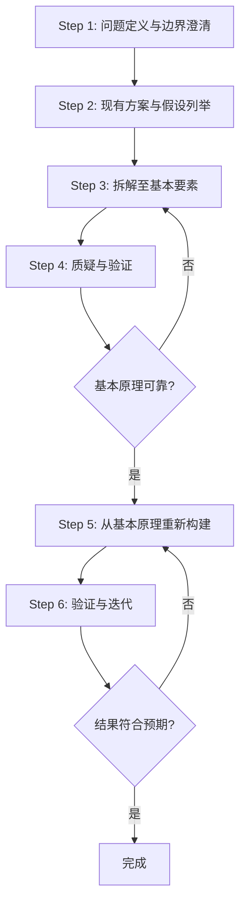

# 第一性原理方法论框架与实践指南

## 1. 引言

### 1.1 为什么需要第一性原理思维方法论

类比思维是人类认知的默认模式——它快速、低成本，在90%以上的日常场景下足够有效。进化让我们依赖类比和模式识别，因为在原始环境中快速判断比深度思考更有利于生存。但当我们面对需要突破性创新的问题、现有范式陷入僵局、或者行业被未经审视的"常识"长期主导时，类比思维会成为枷锁：它让我们在既有框架内修修补补，无法看到框架之外的可能性。第一性原理思维正是为解决这类问题而生：它提供了一套系统性的方法，帮助我们跳出类比陷阱，穿透表面现象，回归问题本质，开辟全新的解决方案空间。

历史上，第一性原理思维带来了人类认知最伟大的突破：牛顿从运动三定律和万有引力定律统一解释了天体和地面物体运动；麦克斯韦从四个方程预言了电磁波的存在；马斯克通过拆解火箭原材料成本，推动商业航天成本降低了约20倍。这些案例共同展示了回归基本原理的颠覆性力量。

### 1.2 本框架的定位

本框架**不是哲学教科书**，不追求构建形而上学体系或进行学术考据；它也不是商业鸡汤或成功学，不会宣称"用了第一性原理就能成功"。它是一套**可操作的实践工具**，综合了哲学、物理学、工程技术、商业创新领域两千多年来的实践经验——从亚里士多德的公理化思想、笛卡尔的普遍怀疑方法，到牛顿的公理演绎体系、费曼"从头推导才是真理解"的方法论，再到马斯克的工程拆解实践、安德森对还原论局限的反思——目标是让读者读完后能够将其应用于实际问题分析，而不仅仅是理解概念。

框架不声称第一性原理思维是万能钥匙——恰恰相反，它用专门章节讨论适用边界、常见误区、认知偏差和成本效益分析，帮助读者避免误用、滥用，知道什么时候该用、什么时候不该用。

### 1.3 框架的跨领域来源

| 领域 | 核心贡献 | 代表 |
|------|---------|------|
| 古希腊哲学 | 公理化演绎、第一原理不可证明思想 | 亚里士多德、欧几里得 |
| 近代理性主义 | 普遍怀疑、从不可怀疑基石重建知识 | 笛卡尔四条方法论规则 |
| 经典物理学 | 从少数基本定律数学演绎整个体系 | 牛顿《原理》、麦克斯韦方程组 |
| 现代物理学 | 从头推导的理解观、承认近似与迭代 | 费曼、DFT计算方法论 |
| 复杂系统科学 | 还原论局限、层级涌现思想 | P.W. Anderson "More is Different" |
| 工程/商业创新 | 拆解到物理/成本层面、快速迭代验证 | SpaceX火箭、Tesla电池案例 |
| 决策科学 | 逆向思维、跨学科模型、认知偏差防控 | 查理·芒格多元思维模型 |

---

## 2. 第一性原理思维操作流程

### Step 1：问题定义与边界澄清

**目标**：确定真正要解决的问题，避免在错误问题上浪费精力。

**操作方法**：
1. 连续问3-5个"为什么"穿透表面症状
2. 明确区分"症状"与"问题"："火箭成本高"是症状，"成本为什么高"通向问题
3. 问题陈述模板：现状是什么？期望状态是什么？核心障碍是什么？解决价值是什么？
4. 划定问题边界：明确哪些在范围内，哪些不在
5. 从至少2个不同视角（技术/用户/商业）重述问题

**常见陷阱**：
- 把解决方案当问题（如"我们需要更好的电池管理系统"是方案不是问题）
- 问题定义过宽或过窄
- 不加审视就接受别人给你的问题

**跨领域案例**：
- 物理：牛顿不满足于"苹果为什么落地"，追问"什么力统一支配天体和地面物体运动"，导向万有引力
- 商业（SpaceX）：马斯克不接受"如何降低火箭采购成本"，而是问"火箭到底由什么构成，原材料成本多少"
- 哲学（笛卡尔）：不问"如何修正知识错误"，而是问"有没有什么绝对不可怀疑的东西"

---

### Step 2：现有方案与假设列举

**目标**：系统性列出通行做法、"常识"和所有隐含假设，让看不见的前提浮出水面。

**操作方法**：
1. 列出行业"标准答案"和主流方案
2. 假设审计：对每个方案追问"基于哪些假设？"
   - 显式假设：被明确说出来的前提
   - 隐式假设：心照不宣但从未明说的前提
   - "不可能"清单：列出所有被认为"不可能"、"一直如此"的事情
3. 分类假设：物理定律类（难质疑）/技术约束类（可改变）/经济成本类（可优化）/惯例文化类（最值得质疑）
4. 使用"魔法棒"问题：如果消除所有约束，理想方案是什么？区分物理约束和人为约束

**常见陷阱**：
- 遗漏隐式假设（最危险的假设是你没意识到是假设的那些）
- 过早判断假设对错（这一步只是列举）
- 只列技术假设，忽略商业/组织/人性假设

**跨领域案例**：
- 商业（Tesla）：行业假设"电池$600/kWh是合理的"、"圆柱电池不适合车用"，马斯克列出后逐一拆解
- 物理（相对论前夜）："绝对时间空间"、"以太存在"是隐式假设，爱因斯坦质疑了它们
- 工程："火箭必须一次性使用"是基于弹道导弹技术的路径依赖，而非物理定律要求

---

### Step 3：拆解至基本要素

**目标**：将问题分解到当前问题层级不必再分的基本事实/原理/构成。

**操作方法**：
1. 分层拆解：
   - 实体产品：产品→子系统→组件→材料→原材料/元素→物理/化学基本原理
   - 软件系统：应用→模块→函数/类→算法→计算复杂度/信息论基本约束
   - 商业问题：商业模式→成本结构/收入来源→成本项→原材料成本/人力成本/交易成本→经济学基本原理
   - 组织问题：组织目标→流程→角色→激励机制→人性基本规律（注意：这一层规律可靠性较低）
2. 多学科视角：物理（物质/能量/约束）、数学（计算/信息）、经济（成本/供需/激励）、人性（需求/动机/认知局限）
3. 计算理论极限：原材料成本理论下限？物理最高效率（卡诺效率、香农极限、布雷顿循环效率）？理论最少需要多少步骤/零件/时间？
4. "原子"停止标准：
   - 该要素是可验证事实而非判断
   - 继续拆解不改变当前问题结论
   - 该层级规律在问题尺度下可靠
   - 不需要拆到夸克，在合适层级找该层级的原理
5. 树状图可视化拆解结构

**常见陷阱**：
- 为拆解而拆解无限递归（拆太细浪费精力，还看不到高层涌现性质）
- 拆解维度单一（只拆技术不拆成本/用户/组织）
- 把拆解结果当现实（材料成本2%≠能以2%价格造出来，制造/研发成本真实存在）

**跨领域案例**：
- 商业（SpaceX）：火箭→箭体/发动机/电子设备/燃料→铝/钛/铜/碳纤维→商品价格→材料成本约售价2%
- 物理（DFT革命）：Hohenberg-Kohn不继续解3N维波函数，追问"描述多体系统真正需要的最少信息是什么？"→答案是3维电子密度
- 哲学（笛卡尔）：将所有知识拆到不可怀疑的基石——"我思故我在"

---

### Step 4：质疑与验证

**目标**：质疑每个假设，区分事实与判断，验证基本原理，清洗不可靠前提。

**操作方法**：
1. 苏格拉底式提问：对每个假设连续问——这是真的吗？证据是什么？如果不成立会怎样？有没有反例？在什么条件下成立？
2. 区分三类陈述：事实（可独立验证）/判断（基于事实的解读）/偏见（无证据支撑的信念）
3. 主动找反证（对抗确认偏差）
4. 基本原理可信度分级：
   - 🟢 高可信：反复验证的物理定律、可直接观察的事实、多来源确认数据
   - 🔵 中可信：有证据但有例外/争议的规律
   - 🟡 低可信：经验模式、行业惯例、单一来源数据（需谨慎）
5. 区分"不可能"类型：物理禁止→接受/工程目前不行→是机会/经济不划算→可改进/只是惯例→最好的机会

**常见陷阱**：
- 为质疑而质疑陷入极端怀疑论（能量守恒不需要质疑，但"必须一次性使用"需要质疑）
- 双重标准——质疑别人不质疑自己
- 把"没人证明不可能"当作"可能"（举证在主张方）
- ✅ 费曼警示：最首要的是不能欺骗自己，而你是最容易被自己欺骗的人

**跨领域案例**：
- 物理（电磁波）：麦克斯韦不质疑电磁方程的实验基础，但质疑"电磁独立"假设，从方程推出电磁波
- 商业（SpaceX）：不质疑热力学/材料强度，但质疑"必须一次性使用"、"只能传统承包商制造"等惯例
- 哲学（笛卡尔普遍怀疑）：系统怀疑一切直到找到"我思"这个不可怀疑的基石

---

### Step 5：从基本原理重新构建

**目标**：从验证后的基本原理出发从头构建方案，而非在现有方案上修修补补。

**操作方法**：
1. 白纸思考：想象问题第一次出现，没有现有方案，你会怎么设计？
2. 从原理向上演绎：从可靠原理出发问"如果这是真的，必然得出什么？"每步检查逻辑
3. 组合基本要素：创新往往是基本要素的新组合而非全新发明
4. 至少生成3个本质不同的方案，不要满足于第一个想法
5. 两阶段法：先想理论最优（忽略约束），再逐步加入硬约束（物理/数学）和软约束（成本/组织/时间），找可行方案
6. 逆向思维补充：除了想"如何成功"，也要想"如何会失败"然后避免（芒格：反过来想）

**常见陷阱**：
- "从头构建"变成"忽视所有前人经验"——可以用已有组件，但整体架构从原理出发
- 拆解完仍按老方式组装（这一步最难，需要创造性，没有公式）
- 只生成一个方案就爱上它
- ✅ 马斯克承认："这非常难，需要很多努力，你不能对所有事情都这样思考"

**跨领域案例**：
- 物理（牛顿）：从三大定律+万有引力重构天体力学，推出开普勒定律、潮汐、彗星轨道
- 工程（SpaceX）：从"原材料成本低"出发，重构制造模式：垂直整合、可重复使用、简化设计、规模化
- 产品（iPhone）：现有是"物理键盘+小屏+手写笔"，回到"手指是最好输入工具"、"用户要大屏"，重构交互范式

---

### Step 6：验证与迭代

**目标**：现实测试方案，根据反馈修正，承认第一性原理推理的局限性。

**操作方法**：
1. 承认推理局限性：你可能漏了重要约束、理解错原理、复杂系统有无法预测的涌现效应、涉及人时没有硬"第一原理"
2. 构建最小可行原型（MVP）：不等方案完美，尽快做最便宜最快的原型验证核心假设
3. 先测试风险最高、最不确定的假设
4. 快速反馈循环：工程做实验/仿真，产品做用户测试，商业小规模试错
5. 区分失败类型：可快速纠正的失败→好（学习）/揭示原理错误→更好（回到前面修正）/执行问题→提升执行力
6. 如果现实与预测不符，不要忽视现实——回到Step3/4检查哪个假设有问题
7. 知道何时停止：追求当前约束下足够好、经得住检验的方案，而非绝对真理

**常见陷阱**：
- "我从第一原理推导过所以一定对"——拒绝反证。现实永远比理论可靠
- 纯推理花太多时间迟迟不测试（分析瘫痪）
- 失败后只做表面修补不反思根本原因
- ✅ 重要提醒：SpaceX算完原材料成本没直接成功，Falcon 1前三次全部失败，大量试错后才成功。第一性原理给方向，不给答案，答案来自迭代。

**跨领域案例**：
- 科学方法：即使从第一原理推出的理论（如麦克斯韦预言电磁波），也必须实验验证（赫兹实验）才被接受
- 工程（SpaceX）：2006-2008 Falcon 1三连败，每次回基本原理分析系统性问题，2008年第四次成功
- DFT计算：从量子力学出发仍需交换关联泛函近似，结果必须与实验对比验证

---

## 3. 常见难点与障碍

### 难点1：信息不完整与不确定性
- **原因**：真实场景尤其商业/社会问题，信息不全，基本原理可能不清晰，决策有时间限制
- **克服**：区分已知已知/已知未知/未知未知；对不确定性做敏感性分析；可逆决策快速行动，不可逆决策多收集信息；小步试错减少不确定性；接受足够好不追求绝对确定

### 难点2：认知偏差干扰
- **原因**：偏差是无意识自动的，我们察觉不到自己受影响。重点防控：确认偏差（只找支持证据）、锚定效应（被现有方案锚定）、事后归因、幸存者偏差、过度自信
- **克服**：学习偏差清单对照检查；引入外部视角挑战假设；使用结构化检查清单；芒格双轨分析：理性分析后评估哪些潜意识倾向可能影响判断

### 难点3：拆解到什么程度为止
- **原因**：理论可一直拆到夸克，但太细浪费精力还看不到高层涌现；没有明确停止规则
- **克服**：目的导向——继续拆不改变结论就停；可靠性导向——到可靠规律支配的层级就停；成本效益——再拆一层成本增10倍精度提1%就不值得；多层验证——在2-3层分析结论一致说明层级合适

### 难点4：基本原理的识别困难
- **原因**：物理之外（商业/社会/人性）没有像物理定律那样硬的第一原理；容易把自己相信的东西当"原理"
- **克服**：用可信度分级（🟢🔵🟡🔴）给原理评级；商业领域把"第一原理"弱化为"当前最可靠基本假设"；问"赌100万美元在这上面我愿意吗？"区分硬约束和软约束

### 难点5：重构的想象力约束
- **原因**：大脑被现有范式塑造，即使知道现有方案错了也难跳出；创新需跨领域组合，专家常被专业限制；新想法刚出现时看起来荒谬
- **克服**：从其他不相关领域找灵感（自然演化有30亿年优秀设计）；广泛阅读建立多元思维格栅；"外星人视角"——外星人刚来地球会怎么设计？强制生成至少3个不同方案；快速原型在动手中激发新想法

### 难点6：现实约束条件
- **原因**：钱/人/时间有限，组织有流程/文化/利益相关者倾向维持现状，系统嵌入性牵一发动全身，人害怕改变
- **克服**：区分硬约束（物理定律必须接受）和软约束（成本/供应链/惯性可改变）；渐进迂回——先做可行版本逐步逼近最优；独立小团队（Skunk Works模式）绕开组织惯性；最坏情况分析——失败损失能承受就试

---

## 4. 常见误区识别清单

### 误区1：把"第一性原理"当口号/标签使用（事后归因）
- **表现**：成功了就说是"第一性原理胜利"，失败就不提；把任何成功都贴这个标签，说不出具体质疑了哪个假设、拆到什么层级
- **为什么是误区**：典型事后归因和幸存者偏差，让术语变空泛荣誉标签，失去方法论意义
- **识别**：你是否事后才说用了第一性原理？是否说不出具体步骤？是否忽略试错/运气/资本等因素？是否只讲成功不讲失败？
- **正确做法**：事前记录分析过程和核心假设；事后对照验证哪些对哪些错；诚实谈论失败和局限；具体说明"在X问题上质疑Y假设拆到Z层得出W"

### 误区2：将个人偏见/主观假设当作"第一原理"
- **表现**：把自己的偏好、直觉、流行偏见包装成"第一原理"，然后从这些"原理"演绎出想要的结论
- **为什么是误区**：第一性原理核心是**质疑假设**，不是给偏见换高级名字。基石是偏见的话推理再严谨也是垃圾进垃圾出
- **识别**：你的"原理"是否得出你本来就想要的结论？是否拿不出证据只说"这显然对"？质疑它你会情绪激动？它完全符合你的立场？
- **正确做法**：对每个"原理"主动找反证；区分事实和价值判断；请不同意你结论的人挑战假设；诚实给原理做可信度评级

### 误区3：忽视约束条件，追求理论最优而无视现实
- **表现**：算出材料成本是售价2%就以为马上能以2%造产品，知道理论极限就觉得现有方案都蠢
- **为什么是误区**：第一性原理揭示**理论可能性空间**，不是**即时可实现性**。理论最优到现实可行之间隔着巨大工程/成本/组织鸿沟。Tesla成立20年电池仍没到当年算的$80/kWh
- **识别**：你是否说"这理论简单为什么那些人蠢做不出来"？是否觉得算完理论问题解决了80%？是否低估制造/供应链难度？
- **正确做法**：同时算理论最优和当前可实现，分析差距在哪；分阶段路线图逐步逼近；尊重工程制造，向一线请教现实约束

### 误区4：否定一切经验和类比，认为第一性原理与经验对立
- **表现**：学了第一性原理就看不起经验类比，任何事都要从头推导，拒绝参考最佳实践
- **为什么是误区**：虚假二元对立。类比经验在99%情况下高效有效，马斯克也说"你不能对所有事情都这样思考"。每个决定都从夸克开始推导，你连穿什么都决定不了
- **识别**：你是否日常决策也强行用这套方法？是否拒绝行业最佳实践说"那是类比"？是否看不起经验丰富的人？
- **正确做法**：知道什么时候用第一性原理什么时候用经验；类比是好的起点灵感但不是终点；尊重经过时间检验的经验——先理解它为什么有效再决定要不要挑战；混合策略：第一性原理定方向，执行层借鉴经验快速迭代

### 误区5：过度拆解导致分析瘫痪
- **表现**：花几个月拆解质疑追求完美分析和绝对确定，始终不行动，错过时机
- **为什么是误区**：完美信息完美分析现实中不存在。第一性原理分析有成本，而且再完美仍需现实测试（Step6）。过度分析本质是逃避决策不确定性
- **识别**：你是否一直在收集信息拆解但从不构建/测试？是否用"还没找到真正第一原理"当拖延借口？分析时间是否超过做快速原型的时间？是否害怕犯错迟迟不决策？
- **正确做法**：给分析设时间盒；遵循70%原则——70%信息70%把握就开始行动，剩下迭代中修正；记住验证是必要部分，纸面上解决不了所有问题

### 误区6：将第一性原理等同于"反共识"或"颠覆"
- **表现**：认为用第一性原理就必须得出和主流不同结论，必须颠覆行业，和大家一样说明你没用对
- **为什么是误区**：目标是**找到正确答案**，不是**找到不同答案**。很多时候分析完发现现有做法恰好符合基本原理——这时候共识就是对的。为反共识而反共识和盲从共识一样蠢
- **识别**：你是否觉得"大家都同意一定是我不够颠覆"？是否为了原创刻意提不同结论？结论和共识一致反而不满足？
- **正确做法**：目标是正确不是不同；分析完发现共识对就大方承认——这是独立验证后的同意，不是盲从；真正颠覆是结果不是目标，原理告诉你现有方案错了颠覆自然发生

### 误区7：认为第一性原理思维保证成功
- **表现**：以为用了第一性原理就一定成功，把它当成功学灵丹妙药——"我用了第一性原理所以项目应该成功"，失败了就怪执行不到位或别人不懂
- **为什么是误区**：第一性原理是强大思维工具，但工具本身不保证结果。成功需要太多因素：正确时机、足够资源、优秀执行、好团队、甚至运气。Theranos的霍尔姆斯也声称在"颠覆医疗检测"，用的也是"质疑行业假设"话术，结果是百亿美元骗局
- **识别**：你是否在说"因为我们用了第一性原理所以我们会赢"？是否拒绝考虑"我可能错了"？失败时是否只怪执行不质疑最初分析？是否忽略了同样用类似思路但失败了的案例？
- **正确做法**：把第一性原理当导航工具，不是预言水晶球；对失败保持开放，现实告诉你错了就回到前面步骤修正；诚实评估执行、团队、时机、资本、运气等其他成功因素；研究失败案例与研究成功案例一样重要

---

## 5. 第一性原理实践检查清单（Checklist）

按阶段逐项勾选，无法打勾说明还有工作要做。

### 问题定义阶段
- [ ] 我是否区分了症状和真正问题，未把表面症状当问题？
- [ ] 我是否连续追问"为什么"穿透了至少3层表象？
- [ ] 我是否清晰描述了现状、期望状态和核心障碍？
- [ ] 我是否明确了问题边界（哪些在范围内，哪些不在）？
- [ ] 我是否从至少2个不同视角（技术/用户/商业）重述了问题？
- [ ] 我是否评估过这个问题是否值得解决——解决它的价值与投入分析成本是否匹配？

### 拆解阶段
- [ ] 我是否系统性列出了当前主流解决方案？
- [ ] 我是否列出了所有显式和隐式假设（至少10条）？
- [ ] 我是否列出了该领域所有被认为"不可能"、"一直如此"的事情？
- [ ] 我是否将问题分层拆解到了合适的基本要素层级？
- [ ] 我是否计算了关键指标的理论极限（成本、性能、效率等）？
- [ ] 我是否从至少3个不同学科视角进行了解构？

### 质疑阶段
- [ ] 我是否对每个假设都问了"这是真的吗？证据是什么？"？
- [ ] 我是否主动寻找了矛盾证据（对抗确认偏差）？
- [ ] 我是否区分了事实、判断和偏见，只把高可信度事实当基石？
- [ ] 我是否区分了物理硬约束和惯例软约束？
- [ ] 我是否请至少一个持不同意见的人挑战过我的假设？
- [ ] 我是否对每个关键基本原理做了可信度评级？

### 重构阶段
- [ ] 我是否做了"白纸思考"——假设从零开始会怎么设计？
- [ ] 我是否从验证后的原理向上演绎而不跳步？
- [ ] 我是否生成了至少3个本质不同的方案？
- [ ] 我是否先思考理论最优再引入现实约束？
- [ ] 我是否用了逆向思维列出失败模式并主动避免？
- [ ] 我是否考虑了其他领域类似问题的解作为灵感而非模板？

### 验证阶段
- [ ] 我是否承认第一性原理推导的局限性，不假设自己一定正确？
- [ ] 我是否识别了方案中风险最高、最不确定的核心假设？
- [ ] 我是否设计了最小可行原型快速测试核心假设？
- [ ] 我是否建立了快速反馈循环来收集现实数据？
- [ ] 现实与预测不符时我是否准备好回到前面步骤修正而非固执己见？
- [ ] 我是否区分了可快速纠正的失败和揭示根本错误的失败？

---

## 6. 第一性原理的适用边界

### 6.1 适合场景
1. **突破性创新**：现有范式陷入瓶颈，渐进改进无法带来数量级提升
2. **全新前沿领域**：没有成熟经验可借鉴
3. **现有方案明显荒谬**：大家都觉得有问题但没人敢问为什么（如火箭成本高）
4. **高杠杆重大决策**：影响重大值得投入深度分析（创业方向、技术路线、战略转型）
5. **遇到"不可能"墙**：所有人都说不可能但你怀疑只是惯例

### 6.2 不适合场景
1. **日常低风险决策**：类比/习惯/经验足够好
2. **时间极度紧迫**：需要立即反应时（应急处理）
3. **领域知识极度不足**：连基本概念都不懂时先学习，别上来就"第一性原理"
4. **充分验证的成熟实践**：几十年几百万人验证有效的做法，没强烈证据错了就不用从头推导
5. **高度复杂快速变化系统**：如股市短期波动，基本原理不清晰，快速试错比深度分析有效
6. **需要协同共识的决策**：反共识方案在政治上可能不可行

### 6.3 与其他思维方式互补
- **类比思维**：类比快速提供灵感和候选方案，第一性原理验证方案是否成立
- **经验/最佳实践**：经验提供现实检验的模式，第一性原理理解为什么有效以及何时失效
- **系统思维**：第一性原理擅长拆解，系统思维擅长整合，分析要素相互作用和涌现
- **逆向思维**：第一性原理正向构建，逆向思维识别风险（Step 5已包含）
- **数据/统计**：第一性原理提供理论框架，数据验证预测发现框架外现象

✅ 成熟思考者掌握多种工具，根据问题选组合，不拿锤子看什么都像钉子。

### 6.4 还原论局限：More is Different
安德森1972年经典论文核心观点：
1. **还原论≠建构论**：知道一切还原为基本粒子，不等于能从粒子定律建构所有宏观现象
2. **涌现**：尺度复杂度增加时，通过对称性破缺出现全新涌现性质——单个水分子没有温度/黏度，大量水分子有；单个神经元没有意识，大量神经元连接有意识
3. **科学层级结构**：粒子物理→凝聚态→化学→生物→心理→经济社科，每层有自己的基本定律
4. **对第一性原理启示**：不需要一切拆到夸克，在每个层级识别该层级的第一原理；高层涌现性质真实存在不能忽略

### 6.5 成本效益：什么时候值得投入？

第一性原理思维是高成本活动：消耗大量时间、认知资源，需要跨学科知识，还可能因挑战现有秩序引发组织阻力。因此做成本效益分析是必要的。

**值得投入信号**：
- 决策影响是10倍级别的（要么10倍收益要么避免10倍损失）
- 现有方案成本/性能与理论极限之间有数量级差距（如材料成本仅售价2%）
- 行业长期无突破性创新，大家都在做渐进式改进
- 你看到明显的"皇帝新装"——所有人都接受但没人能解释为什么
- 这个问题会反复出现，一次性深度分析带来长期回报
- 你有足够时间资源做深度分析和后续迭代

**不值得投入信号**：
- 决策影响很小，错了代价不大
- 时间窗口极短必须立即行动
- 现有方案已经很接近理论极限，改进空间有限
- 你在该领域还是新手，连基本问题都没搞懂——先学习
- 问题主要是政治/协调问题而非技术/认知问题
- 用类比/经验已经能快速得到足够好的答案

**经验法则**：把第一性原理留给你领域最重要的10%-20%问题，剩下80%用快速有效方法处理。就像物理学家不会用量子力学计算桥梁应力——在合适层级用合适的理论，这本身也是第一性原理思维的体现。

---

## 7. 不同领域应用对比

| 维度 | 哲学 | 物理学 | 工程技术 | 商业创新 |
|------|------|--------|---------|---------|
| **第一原理性质** | 自明公理/认识论基石 | 实验精确验证的基本定律 | 物理事实+已验证工程原理 | 物理约束+经济规律+（弱）人性规律 |
| **拆解终点** | 不可怀疑的自明真理 | 基本粒子/基本常数，或问题合适层级 | 材料/组件/物理约束/制造成本 | 原材料成本/供需/用户根本需求/激励 |
| **核心推理** | 演绎+先验论证+概念分析 | 数学演绎+数值计算（可控近似） | 物理建模+工程计算+原型测试 | 成本拆解+逻辑推演+谨慎类比 |
| **验证标准** | 逻辑自洽、体系融贯 | 实验验证、预测精度（QED到10⁻¹⁰） | 功能、性能、可靠性、可制造性 | 市场验证、用户接受、成本目标 |
| **原理可信度** | 体系内极高，但不同体系原理不同 | 极高（精确科学），适用范围外可修正 | 高，但依赖场景和技术成熟度 | 中低——物理部分高，经济/人性部分争议大 |
| **典型成功** | 亚里士多德逻辑、欧几里得几何、笛卡尔转向 | 牛顿力学、麦克斯韦方程、DFT、BCS理论 | 阿波罗、Falcon 9可回收、4680电池 | SpaceX降成本、Tesla电池降本、iPhone重构手机 |
| **典型失败** | 逻辑自洽但脱离现实的形而上学 | 模型错误、近似失控、忽略关键效应 | 过度追求理论最优忽略可制造性 | 理论正确时机太早、忽略组织/供应链约束、把偏见当原理 |
| **方法成熟度** | 哲学方法论成熟，操作性弱 | 极其成熟，标准化科学计算流程 | 物理工程领域成熟 | 最不成熟——大量事后归因，真正有意识成功案例少 |

**共性**：都拒绝盲目接受未审视的传统；都需要拆解到更基本部分；都从可靠基础向上推理；都需要验证；都承认近似必要。
**差异**：从哲学到物理到工程到商业，第一原理硬度递减；数学演绎重要性递减，经验试错重要性递增；预测精度递减，不确定性递增。

---

## 8. 与SpecWeave项目的结合点

第一性原理思维可以应用于AI智能体开发和SpecWeave项目方法论建设。

### 8.1 AI智能体设计中的第一性原理

1. **重新思考智能体基本构成**：不被现有Agent框架（ReAct、Plan-and-Execute、AutoGPT等）类比束缚，回到基本问题："一个能够完成有用任务的智能体，最基本、不可再分的组件是什么？"——感知输入、状态记忆、推理能力、行动输出、反馈循环，这些是真正的基本要素吗？还是有更根本的抽象？
2. **重新审视上下文窗口使用**：不是类比现有做法把所有东西塞进prompt，而是从信息论基本原理出发："完成这个任务真正需要的最小信息集是什么？信息如何组织才能让检索和推理最有效？"——信息熵、上下文窗口的注意力稀释效应、检索精度与召回率的权衡都是可量化的基本原理
3. **工具调用的本质**：工具调用的本质是扩展模型的能力边界，让模型能做它参数化知识做不到的事情（获取实时信息、执行确定性计算、操作外部世界产生副作用）。从这个基本原理出发，可以推导什么样的工具接口设计、调用范式、错误处理机制最有效
4. **多智能体协作的本质**：不类比人类组织就直接套"CEO/产品经理/工程师"角色分工，而是从计算和通信基本原理出发："什么类型的问题多个智能体协作比单个智能体好？分工的本质收益是什么？是专业化降低单智能体认知复杂度？并行化加速推理？还是不同视角/偏见的相互纠错降低系统性偏差？"

### 8.2 SpecWeave方法论建设的启发

1. **从软件工程基本原理出发构建规范体系**：不照搬现有开发流程（敏捷、瀑布、DevOps等类比），而是追问："为什么需要spec？spec的本质是什么？好的spec应该满足什么基本要求？"——spec的本质是在人与人、人与AI之间精确传递意图、消除歧义、对齐期望。从这个基本点出发，推导出spec应该包含什么要素、应该是什么粒度、应该如何验证。
2. **将六步流程应用于方法论本身**：设计AI辅助开发方法论时，应该系统应用本框架：
   - Step 1问题定义：软件开发的根本痛点是什么？是写代码速度慢，还是需求传递失真，还是验证成本高，还是长期维护成本高？
   - Step 2假设列举：敏捷、瀑布、DevOps各自基于什么假设？这些假设在大模型时代是否仍然成立？
   - Step 3拆解要素：软件开发的基本要素是需求、设计、实现、验证、沟通、反馈
   - Step 4质疑验证：哪些假设因为AI的出现已经改变？"写代码是主要瓶颈"这个假设对吗？
   - Step 5重新构建：重构适合AI时代的开发方法论
   - Step 6验证迭代：在真实项目中验证方法论，根据反馈持续修正
3. **承认涌现性，不过度还原**：软件开发是复杂的社会技术系统，参考Brooks《人月神话》的洞见——从代码行、函数、模块这些基本要素无法完全预测项目层面的行为（沟通成本、集成风险、团队动态、架构腐化）。需要在每个层级找到该层级的原理，而不是强行还原到代码层面。
4. **避免方法论口号化**：本框架第4章的误区清单同样适用于方法论建设——不要把"First Principles"、"AI Native"、"Agent-Native"当标签贴，要真正落地为可操作的步骤、检查清单、具体模板、正反案例。
5. **快速迭代方法论本身**：就像Step 6要求的，方法论不是从第一性原理推导出来就完美了，需要在SpecWeave的真实项目实践中不断验证、修正、演进。每个项目结束后做回顾：哪些假设是对的？哪些错了？方法论哪里需要调整？

---

**框架总结**：第一性原理思维不是神秘天赋，也不是万能成功公式。它是一套结构化思维工具——问题定义、假设列举、分层拆解、质疑验证、从头重构、现实迭代六步，帮助我们在需要突破性思考时跳出类比陷阱。它要求对自己诚实，承认认知偏差和局限，承认现实约束和自身可错性。掌握它的最终标志，不是你到处用它，而是你**知道什么时候该用，什么时候不该用，以及如何和其他思维工具结合**。

---

*本文档综合00-07号文档研究成果（哲学起源、物理学应用、商业案例、思想家论述、学术资源、概念术语、时间线）提炼形成可操作实践框架。*
