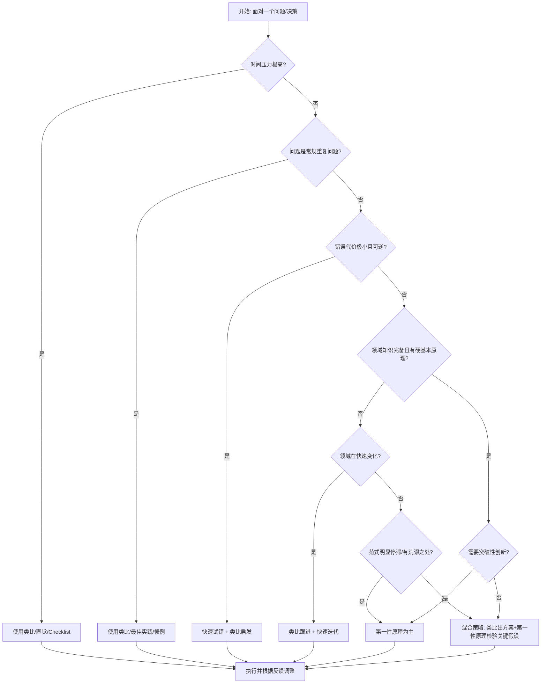

# 第一性原理与类比推理的适用边界研究

> ⚠️ **偏差提示**：本文在撰写过程中可能存在"支持第一性原理"的确认偏差——作者因前期研究已对第一性原理思维投入大量认知资源，可能无意识地高估其价值。读者应保持独立判断，尤其注意第9章"局限性说明"中讨论的问题。本文不做"第一性原理优于类比推理"的价值判断，仅尝试界定两种思维方式各自的适用条件。

## 1. 引言：为什么需要研究适用边界

### 1.1 问题的提出

在[方法论框架](08-methodology-framework.md)第6章中，我们初步讨论了第一性原理思维的适用边界，但那只是框架中的一个小节，不够系统和深入。随着第一性原理概念在商业媒体和创业圈的流行，一个危险的倾向正在出现：将其塑造成一种"高级思维"，似乎只有用第一性原理思考才是深刻的，而类比推理被贬低为"偷懒"、"缺乏想象力"甚至"思维枷锁"。🟡

这种二元对立叙事既不符合认知科学的研究结论，也违背了第一性原理思维本身的精神——它拒绝不加审视地接受任何标签化判断，包括"第一性原理=好，类比=坏"这种简单二分法。事实上，类比推理是人类认知的基石，是我们理解新事物、快速决策、学习知识的最基本机制。没有类比，我们甚至无法理解最基本的抽象概念。🟢

马斯克本人在采访中也承认："你不能对所有事情都这样思考（第一性原理），这太费脑力了。"🔵 这一坦诚表态经常被"第一性原理万能论"的鼓吹者选择性忽略。如果连最著名的实践者都承认其使用范围有限，我们就更有必要系统研究：什么时候应该用第一性原理？什么时候类比推理不仅足够，甚至更好？两种思维方式如何互补而非对立？

### 1.2 研究意义

澄清适用边界具有三重实践意义：

**第一，避免误用导致的资源浪费。** 第一性原理思维是高认知成本活动——它需要大量时间、跨学科知识、深度专注，还需要承担挑战现有秩序的组织成本。在不需要的场景强行使用，不仅浪费资源，还可能导致"分析瘫痪"，错过时间窗口。

**第二，避免教条化和口号化。** 当"用第一性原理思考"变成一种政治正确或装逼标签时，它就失去了方法论价值。人们开始事后给任何成功贴上"第一性原理胜利"的标签（典型事后归因偏差），而失败案例则被悄悄忽略。

**第三，建立整合性思维框架。** 成熟的思考者不是掌握一种"最好的"思维方式，而是拥有一个思维工具箱，能够根据问题特性选择合适的工具组合。第一性原理和类比不是非此即彼的选择，而是可以而且应该混合使用的互补工具。

> ⚠️ **事后归因偏差警示**：本文中所有关于"某某案例用了某种思维方式"的判断，都不可避免地带有事后解读色彩。成功案例尤其容易被过度解读——当我们知道结果是成功的，就更容易在回顾时"发现"当事人使用了第一性原理思维（或类比思维）的"证据"，而忽略同样重要的运气、时机、资源、执行力等因素。请带着这个警示阅读所有案例。

---

## 2. 两种思维方式的本质对比

### 2.1 认知机制差异

| 维度 | 类比推理（Analogical Reasoning） | 第一性原理思维（First Principles Thinking） |
|------|----------------------------------|--------------------------------------------|
| **认知起点** | 已知的相似案例、过往经验、主流范式 | 问题本身、基本事实、不可再分的原理 |
| **推理方向** | 从特殊到特殊（案例A→案例B） | 从一般到特殊（原理→具体方案） |
| **核心操作** | 模式识别、结构映射、迁移适配 | 拆解、质疑、还原、重构 |
| **认知负荷** | 低——依赖大脑自动模式匹配系统 | 高——需要主动控制深度思考 |
| **速度** | 快——毫秒到秒级即可得出结论 | 慢——需要数小时、数天甚至更长时间 |
| **对知识要求** | 需要相关领域的经验库/案例库 | 需要跨学科基础原理知识 |
| **错误类型** | 错误类比、表面相似性误导、路径依赖 | 过度还原、忽略涌现性、分析瘫痪、把偏见当原理 |
| **进化起源** | 古老——哺乳动物普遍具备的模式识别能力 | 新近——依赖人类特有的抽象推理和前额叶功能 |

🟢 注：认知科学研究表明，人类95%以上的日常决策依赖类比和直觉思维（系统1），只有不到5%的决策使用受控的深度分析（系统2）。这不是缺陷，而是进化的高效设计——如果每个日常决策都要从头推导，我们的大脑根本无法处理信息负载。

### 2.2 知识论基础差异

类比推理的知识论基础是**经验主义**：知识来源于经验，我们通过观察相似性模式来归纳规律。它的隐含假设是"如果两个事物在某些方面相似，它们在其他方面也可能相似"、"过去有效的未来也可能有效"。这一假设在稳定环境中高度可靠，但在环境剧变或需要突破时失效。

第一性原理思维的知识论基础是**理性主义**：真正可靠的知识来源于自明公理和逻辑演绎，而非感官经验。它的隐含假设是"存在不依赖于经验的基本原理，从这些原理出发可以推导出可靠结论"。这一假设在硬科学领域极其成功，但在涉及人、组织、复杂社会系统时，"基本原理"本身就变得模糊和不可靠。

> 🔵 **争议提示**：哲学史上经验主义与理性主义之争持续了数百年，双方各有洞见也各有局限，本文不试图判定谁对谁错——在实践层面两者各有适用场景，正如我们不需要在"用锤子还是用螺丝刀"之间做非此即彼的选择。

### 2.3 类比推理不是"低级思维"

需要特别强调：类比推理绝不等于"思维懒惰"或"缺乏创造力"。🟢 认知科学研究表明：

1. **类比是创造力的核心机制之一**——认知科学家侯世达（Douglas Hofstadter）甚至认为"类比是认知的核心"，所有抽象概念本质上都是通过类比建立的。许多重大科学发现依赖类比：卢瑟福通过太阳系类比原子结构，凯库勒通过蛇咬尾巴的梦类比苯环结构。

2. **专家技能本质上是精细的类比库**——象棋大师能记住几万种棋局模式，资深医生见过几千个病例，这些模式库让他们能快速识别模式并做出准确判断。新手才需要一步步推导，专家靠模式识别就能快速决策。

3. **类比是高效学习的基础**——我们理解新概念几乎总是通过将其与已知概念类比：电流像水流，原子像太阳系，神经网络像大脑（虽然最后一类比后来被证明过度简化，但它帮助了几代人入门）。

4. **类比是沟通的桥梁**——没有类比，解释任何抽象概念都会极其困难。好的老师本质上是善用类比的人，能把陌生概念用学生熟悉的事物解释清楚。

因此，问题不是"用不用类比"，而是"什么时候用类比，什么时候需要超越类比"。

---

## 3. 场景判断维度框架

如何判断一个具体问题更适合用第一性原理还是类比推理？我们提出五个核心判断维度：

### 3.1 维度一：时间压力（Time Pressure）

| 时间压力等级 | 推荐思维方式 | 理由 |
|-------------|-------------|------|
| **极高**（秒级-分钟级，如应急响应、即时决策） | 类比/直觉 | 没有时间深度思考，依赖训练有素的模式识别，这就是为什么消防员、急诊医生、飞行员需要大量模拟训练——本质是建立可靠的类比库 |
| **中等**（小时级-天级） | 类比为主+局部第一性原理检验 | 用类比快速生成方案，用第一性原理检验关键假设是否成立 |
| **低**（周级-月级-年级，如战略决策、基础研究） | 第一性原理为主+类比辅助 | 有足够时间深度分析，高杠杆决策值得投入认知资源 |

**关键问题**：我有多少时间做决策？推迟决策的代价是什么？如果做错了，可逆吗？

### 3.2 维度二：问题新颖性（Problem Novelty）

| 新颖性等级 | 推荐思维方式 | 理由 |
|-----------|-------------|------|
| **零新颖性**（你做过几十上百次的常规问题） | 类比/惯例/Checklist | 不需要创新，需要稳定可靠地执行，每次从头推导反而增加出错概率 |
| **低新颖性**（与已有问题高度相似，细节不同） | 类比为主+适配调整 | 类比提供80%的答案，剩下20%根据新情况调整 |
| **中等新颖性**（领域内但范式遇到瓶颈） | 混合策略 | 用类比理解问题现状，用第一性原理识别瓶颈所在 |
| **高新颖性**（全新领域/没人做过/现有方案明显荒谬） | 第一性原理 | 没有可靠类比可用，或者现有类比都是枷锁，必须从头构建 |

**关键问题**：这个问题以前有人解决过吗？跟过去的问题有多相似？现有方案是经过长期验证的，还是只是路径依赖？

### 3.3 维度三：后果严重性（Consequence Severity）

| 后果等级 | 推荐思维方式 | 理由 |
|---------|-------------|------|
| **轻微**（错了代价很小，可逆） | 类比/快速试错 | 快速行动比完美分析更重要，错了再改成本很低 |
| **中等**（有代价但可承受，可逆性中等） | 混合策略 | 类比快速出方案，第一性原理检查致命风险 |
| **严重**（代价巨大，不可逆，影响很多人） | 第一性原理 | 值得投入大量时间精力深入分析，类比可能因为"以前没出事"而忽略系统性风险 |

**关键问题**：如果决策错了，最坏情况是什么？这个代价我（们）能承受吗？错误可以纠正吗？

### 3.4 维度四：知识完备度（Knowledge Completeness）

| 知识完备度 | 推荐思维方式 | 理由 |
|-----------|-------------|------|
| **极高**（硬科学领域，有精确可靠的基本定律） | 第一性原理非常有效 | 物理、化学等领域有经反复验证的硬定律，从原理推导高度可靠 |
| **中等**（工程领域，原理可靠但细节复杂） | 混合策略 | 第一性原理定方向和边界，类比/经验解决具体工程细节 |
| **低**（社会/经济/人性领域，基本原理模糊且有争议） | 类比/经验/实证为主 | 这一领域没有像物理定律那样硬的"第一原理"，强行推导容易把偏见当原理，实证和历史经验反而更可靠 |
| **极低**（前沿探索/未知领域） | 快速试错+类比启发 | 连问题本身都定义不清时，深度分析没有基础，快速实验探索更有效 |

**关键问题**：这个领域有像物理定律那样可靠的基本原理吗？我对这些原理的理解有多深？原理在这个具体场景下成立吗？

### 3.5 维度五：范式停滞程度（Paradigm Stagnation）

| 范式状态 | 推荐思维方式 | 理由 |
|---------|-------------|------|
| **快速进步期** | 类比/快速迭代 | 领域还在快速演化，今天的"第一原理"明天可能就被推翻，跟进行业最佳实践比自己推导更有效 |
| **成熟期** | 类比为主+局部优化 | 范式已经成熟，最佳实践经过充分验证，渐进改进即可 |
| **停滞期/瓶颈期** | 第一性原理 | 行业很久没有突破性进展，大家都在做渐进式改进，现有范式的潜力已经挖掘殆尽，这时候需要从根本上重新思考 |
| **危机期/范式转换期** | 第一性原理 | 现有范式已经明显失效，但新范式还没建立，必须回到基本原理重新构建 |

**关键问题**：这个领域最近10年有没有数量级的进步？还是大家都在修修补补？现有方案与理论极限之间有多大差距？

---

## 4. 类比推理更高效的典型场景

类比推理不是"退而求其次"的选择——在以下场景中，它不仅更高效，而且往往比第一性原理产生更好的结果：

### 场景1：日常常规决策与执行层细节

**具体例子**：
- 写标准业务代码时遵循语言和框架的惯用写法，而不是每次都从计算理论基本原理重新设计架构
- 厨师做菜遵循成熟菜谱，而不是每次都从生物化学原理重新推导烹饪方法
- 飞行员按Checklist操作，而不是每次都从空气动力学重新推导飞行程序
- 写日常公文遵循成熟格式，而不是每次从沟通基本原理重新发明文档结构

**分析**：这些场景的共同特点是：问题重复出现，解决方案经过成千上万次验证，错误成本中等但犯错概率随"创新"而增加。在这些场景中"用第一性原理重新思考"不仅是浪费时间，而且是危险的——你重新"推导"出的方案几乎肯定不如经过无数人打磨的最佳实践。🟢

**反例警示**：Theranos的霍尔姆斯声称要"重新发明血液检测"，拒绝遵循成熟的医疗器械验证流程，认为现有行业惯例都是"可以被第一性原理颠覆的类比"，结果是大规模欺诈。当你声称要在一个有成熟监管和安全标准的领域"从零开始重构"时，要格外警惕——你颠覆的可能不是"惯例"，而是用鲜血换来的安全经验。🔴

### 场景2：时间极度紧迫的应急决策

**具体例子**：
- 急诊室医生面对创伤病人，根据症状模式快速识别并处理，而不是从头推导病理机制
- 消防员在火场中根据经验快速判断逃生路线，而不是从热力学和流体力学计算火势蔓延
- 战场上的战术决策，指挥官根据战场态势和军事经验快速决断
- 生产线上的故障排除，资深工程师根据故障模式快速定位问题

**分析**：当时间窗口以秒、分钟计算时，深度思考是奢侈品，甚至是致命的。这类场景中真正有效的类比不是"随便比一比"，而是**经过成千上万次刻意练习和真实案例打磨的专业模式库**。专家直觉的本质就是高质量类比库的自动化调用。🟢

这就是为什么这些职业需要大量的模拟训练和案例积累——训练的本质就是在大脑中建立高质量的、经过验证的类比库，让你在压力下能快速准确地调用。

### 场景3：高复杂度、高不确定性、知识不完备的领域

**具体例子**：
- 早期创业投资——没有办法从"第一原理"预测哪家创业公司会成功，顶级VC靠的是见过多数案例培养的模式识别能力，以及对创始人特质的敏锐判断
- 复杂组织管理——管理没有硬"第一原理"，优秀管理者靠的是对人性的洞察、大量组织案例的经验，以及根据具体情境的灵活调整
- 宏观经济政策——经济系统是复杂自适应系统，没有可靠的"第一原理"能精确预测政策效果，政策制定主要靠历史类比、实证研究和小范围试点
- 人际关系——人际关系中从"人性基本原理"推导如何与人相处往往适得其反，真正有效的是共情能力（本质是对他人情绪状态的模式识别）和社交经验

**分析**：在这类"软科学"领域，强行应用第一性原理思维最容易犯的错误就是"把偏见包装成原理"——你以为是在从基本原理推演，实际上是在从自己的偏见和有限经验演绎，还因为打着"第一性原理"的旗号而更加固执。在知识不完备时，保持谦逊、尊重经过时间检验的经验、小步试错，比"从原理推导"更可靠。🟢

### 场景4：创新的早期灵感生成阶段

**具体例子**：
- 卢瑟福用太阳系类比原子结构，提出行星模型（虽然后来被量子力学修正，但这个类比对原子物理发展至关重要）
- 早期飞机发明者通过观察鸟类飞行获得灵感（直接扑翼的类比失败了，但机翼剖面、升力概念等类比是重要启发）
- 达尔文通过阅读马尔萨斯《人口论》中生存竞争的类比，形成了自然选择理论的关键洞见
- 软件工程中的"设计模式"本质上是经过验证的类比——"这个问题跟XX问题结构相似，可以用类似的方案解决"

**分析**：第一性原理思维擅长**验证和批判**，但在**生成新想法**方面类比往往更有效——创新几乎从来不是在真空中从零开始的，它通常是把一个领域的成熟模式类比迁移到另一个领域。好的创新者往往是眼界开阔的人，因为他们有更大的类比库可以调用。

> 🔵 注意：类比在这里的角色是**灵感来源**，不是**最终答案**。卢瑟福提出行星模型后，仍然需要用数学推导和实验验证来发展和修正这个模型（最终发现这个类比有严重局限）。类比给你一个起点，第一性原理和实验验证帮你走得更远。

### 场景5：学习新领域的入门阶段

**具体例子**：
- 物理学入门时用"小球碰撞"类比理解分子运动，用"水压"类比理解电压
- 经济学入门时用"大炮和黄油"类比理解生产可能性边界，用"看不见的手"类比理解市场机制
- 编程入门时用"变量像盒子"、"函数像食谱"这类类比建立基本概念
- 理解AI时用"神经网络像大脑"（虽然严格来说不准确，但对入门极其有帮助）

**分析**：当你对一个领域完全陌生时，你根本没有可以用来"第一性原理思考"的基础知识——你连基本概念都不懂，怎么拆到"基本原理"？这时候类比是唯一高效的学习路径，它让你用已知理解未知，快速建立认知地图。🟢

当然，学习者需要知道类比只是入门工具，不是精确描述——随着学习深入，你需要逐步超越简单类比，理解概念的真实本质和类比的局限。但如果一开始就拒绝类比，要求"从第一原理学起"，你根本入不了门。

### 场景6：沟通与跨领域协作

**具体例子**：
- 向非技术人员解释技术问题时，用他们熟悉的事物做类比（"服务器就像餐厅的厨房，并发请求就是同时来了很多客人"）
- 跨学科团队协作时，用其他领域的共同经验作为沟通的共同基础
- 领导者用类比传达愿景（"我们要像修万里长城一样建设这个基础设施"——虽然历史类比可能不准确，但容易理解和记忆）
- 教师解释抽象概念时使用学生熟悉的例子做类比

**分析**：沟通的目标不是逻辑严谨，而是**有效传递意思**。一个准确但没人听得懂的解释，远不如一个不完美但能让人瞬间理解的类比。好的沟通者本质上是类比大师——他们能在不同知识背景的人之间找到共同的经验基础作为桥梁。

> 🟡 当然，用类比沟通时要注意"类比误导"风险——当听众把类比的所有细节都当真时，可能产生误解。所以用类比解释完后，最好补充一句"这个类比在XX方面是准确的，但在YY方面不成立，真实情况是..."。

---

## 5. 第一性原理更适用的典型场景

类比推理有其不可替代的价值，但在以下场景中，第一性原理思维几乎是必要的：

### 场景1：现有范式遇到明显瓶颈或荒谬之处

**典型特征**：行业里所有人都知道有问题，但没人能说清为什么；成本/性能与理论极限之间有数量级差距；大家都在做渐进式改进但没人能突破。

**案例**：SpaceX进入航天业时，火箭发射成本数千万美元，但原材料成本只占售价的2%左右——这个巨大差距就是明确信号，说明现有范式不是物理定律决定的，而是路径依赖和行业惯例决定的。这时候类比推理只会告诉你"火箭一直都是这么贵的"，只有第一性原理能问出"火箭到底是用什么做的，原材料到底值多少钱"。🟢

### 场景2：需要突破性、非共识创新

**典型特征**：你要做的事情被所有人认为"不可能"、"疯狂"；现有方案已经优化到极限但仍然无法满足需求；你看到了别人看不到的（或者看到了但不敢质疑的）"皇帝的新装"。

**案例**：iPhone诞生前，所有手机厂商都在做"带键盘的功能机"，类比推理告诉你"手机就应该是这样的"。但乔布斯回到"用户到底需要什么"、"手指是最好的输入工具"这些基本点，重新发明了手机。如果只是在现有范式里用类比做渐进改进，永远不会有iPhone。🔵

> ⚠️ **偏差提示**：请注意这里的事后归因风险——我们知道iPhone成功了，所以很容易"追溯"出乔布斯"用了第一性原理"。但历史上有无数同样声称"重新发明"的产品失败了，它们的故事很少被讲述。不要因为几个成功案例就以为"只要用第一性原理反共识就会成功"——反共识的想法大多数时候确实是错的。

### 场景3：高杠杆、不可逆的重大战略决策

**典型特征**：决策影响是10倍级别的（要么获得10倍收益，要么避免10倍损失）；决策一旦做出很难逆转；需要投入大量资源，错了代价巨大。

**案例**：创业方向选择、重大技术路线选择、公司战略转型、国家重大政策制定。这类决策值得投入几周甚至几个月的时间用第一性原理深入分析，因为决策质量的微小提升都会带来巨大回报，而一个错误的类比（"上次这么做成功了"）可能导致灾难性后果。🟢

当然，即使是这类决策，第一性原理分析也不能替代判断——它只能帮你理清思路、识别假设、排除明显错误选项，但不能给你"正确答案"。

### 场景4：全新领域或范式转换期

**典型特征**：没有成熟经验可以借鉴；旧范式已经失效但新范式还没建立；所有人都在黑暗中摸索。

**案例**：互联网早期（1990年代）、移动互联网早期（2007-2010年）、当前的AI大模型时代初期。在这些时候，"过去的经验"和"行业最佳实践"不仅无用，反而可能是枷锁——因为游戏规则已经变了，旧地图找不到新大陆。这时候类比往往误导（"AI就像互联网/电力/蒸汽机..."——每个类比都有道理但都不准确），相对更可靠的是回到技术和人性的基本点思考。🟡

### 场景5：识别和挑战隐性假设

**典型特征**：你感觉某个问题的"标准答案"有问题，但说不出哪里不对；大家都在重复"事情就是这样的"但没人能解释为什么；决策似乎建立在一堆未经审视的前提之上。

**案例**：马斯克挑战"火箭必须一次性使用"、"电动车不可能普及"；爱因斯坦挑战"绝对时间和空间"——这些在当时都是所有人默认为真的"常识"，但它们不是物理定律，只是历史路径依赖形成的假设。第一性原理思维最强大的地方就是让这些隐性假设浮出水面并接受检验。🟢

---

## 6. "何时使用哪种思维"的定性决策框架

综合以上五个维度，我们提出一个简化的定性决策框架：

### 6.1 决策流程图

### 6.2 快速自检问题清单

在决定用哪种思维方式前，问自己以下问题：

**如果大部分回答"是"，倾向于用类比/经验：**
- [ ] 我需要在几分钟/几小时内做决定吗？
- [ ] 这个问题我（或别人）已经解决过很多次了吗？
- [ ] 错了代价很小，很容易纠正吗？
- [ ] 这个领域在快速变化，今天的"原理"明天可能失效吗？
- [ ] 我是这个领域的新手，连基本概念都还没搞懂吗？
- [ ] 现有最佳实践经过了多年、几百万人的验证吗？

**如果大部分回答"是"，倾向于用第一性原理：**
- [ ] 我有足够时间（几天/几周/几个月）深入分析吗？
- [ ] 这个决策影响巨大，错了代价很高且不可逆吗？
- [ ] 现有方案明显荒谬或与理论极限有数量级差距吗？
- [ ] 行业很久没有突破性创新，大家都在做渐进改进吗？
- [ ] 我能清晰识别出这个领域的硬约束（物理/数学定律）吗？
- [ ] 所有人都说"不可能"但我怀疑只是惯例吗？

### 6.3 经验法则（拇指规则）

1. **80/20规则**：把第一性原理思维留给你生活和工作中最重要的10%-20%问题，剩下80%用类比、经验、最佳实践快速处理。正如物理学家不会用量子力学计算桥梁应力——在合适层级用合适理论，这本身就是第一性原理思维的体现。🟢

2. **可逆性原则**：可逆决策快速行动（类比+试错），不可逆决策多花时间用第一性原理深入分析。贝索斯的"双向门/单向门"决策框架：双向门（可逆）决策——即使判断错了也可以退回来，可以快速大胆做；单向门（不可逆）决策——一旦走过去就回不来了，需要慢下来深入思考。🟢

3. **可信度原则**：在硬科学领域（物理、化学、工程硬约束）多相信第一性原理；在涉及人、组织、社会、经济的软领域多尊重经验、历史类比和实证证据，对"从第一原理推导出的结论"保持怀疑。

4. **学习阶段原则**：入门新领域时用类比快速建立认知地图；掌握基础后用第一性原理深入理解本质；成为专家后模式识别（高质量类比）再次成为你的主要工具，同时你知道什么时候需要超越类比。

---

## 7. 两种思维混合使用的策略与模式

最好的思考既不是纯类比也不是纯第一性原理，而是两者的有机结合。以下是几种经过实践验证的混合模式：

### 模式1：类比提供假设，第一性原理验证假设

**流程**：
1. 先用类比从过往经验和其他领域快速生成2-3个候选方案
2. 不要直接接受这些方案，而是把它们当作需要检验的假设
3. 用第一性原理拆解每个方案的核心假设：哪些是物理硬约束？哪些是惯例？哪些假设在当前场景下成立？哪些不成立？
4. 保留通过检验的部分，修改不成立的部分，从头重构出更优方案

**适用场景**：大多数中等复杂度问题，你有相关经验但又需要一定创新。

**案例**：设计一个新的互联网产品——先看类似产品怎么做的（类比），但不要直接抄，而是追问"用户为什么需要这个功能？本质需求是什么？现有方案基于什么假设？这些假设在我们的场景下成立吗？"（第一性原理）。

### 模式2：第一性原理定方向，类比填细节

**流程**：
1. 先用第一性原理分析问题本质和理论边界，确定大方向和不能违反的硬约束
2. 在具体执行和实现细节层面，广泛借鉴类比和最佳实践，不要重复发明轮子
3. 当类比方案与第一原理得出的方向冲突时，以第一原理为准调整方案

**适用场景**：需要突破性方向但执行细节有大量前人经验可以借鉴的问题。

**案例**：SpaceX——方向上用第一性原理确定"火箭可以重复使用"、"原材料成本很低"，但在具体发动机设计、制造工艺、供应链管理等细节层面，大量借鉴航天业几十年积累的经验和最佳实践，而不是真的"从零开始发明火箭"。🔵

### 模式3：类比做"广度优先"探索，第一性原理做"深度优先"验证

**流程**：
1. 早期探索阶段用类比做广度扫描：这个问题跟哪些领域的问题类似？其他领域是怎么解决的？有哪些现成模式可以借鉴？
2. 识别出2-3个最有希望的方向后，停下来用第一性原理做深度分析：这个方向的底层逻辑是什么？核心假设成立吗？理论极限在哪里？
3. 用深度分析的结果筛选和优化方案，再回到类比层面找实现灵感
4. 反复迭代，逐步收窄到最优方案

**适用场景**：复杂问题、全新问题，你一开始不确定哪个方向对。

### 模式4：用第一性原理识别类比的失效边界

**流程**：
1. 当你准备使用一个类比时，不要直接用，先用第一性原理分析：这个类比的哪些方面是有效的？哪些方面是误导性的？
2. 明确标注类比的适用边界："A在X、Y、Z方面像B，但在P、Q方面不像，因为..."
3. 在类比有效的范围内放心使用，在类比失效的地方切换到第一性原理分析

**适用场景**：所有使用类比的场景——尤其是跨领域类比时。

**案例**："神经网络像大脑"这个类比——在"简单单元大规模并行连接产生智能"这一层面是对的，但在学习机制、能量效率、架构细节等方面完全不像。知道这个类比的边界在哪里，你就既能用它获得启发，又不会被它误导。🟢

### 模式5：紧急时类比，事后第一性原理复盘

**流程**：
1. 时间压力极大时，先用类比/直觉快速决策和行动，不要犹豫
2. 紧急情况过去后，用第一性原理复盘：当时的决策基于什么类比/假设？为什么有效/无效？有没有更好的选择？
3. 从复盘中学到的东西更新你的类比库，让下次的直觉更准确

**适用场景**：应急决策、危机处理。这也是专业能力成长的核心机制——每次实战后复盘，把经验提炼成更准确的模式。

> 🟢 这一模式解释了为什么"刻意练习"有效：不是简单重复，而是每次行动后有深度反思和反馈，不断优化你的模式识别库。

---

## 8. 局限性说明

在结束前，我们必须诚实地说明本文和这一框架本身的局限性：

### 8.1 本文的认知偏差

1. **事后归因偏差**：如前所述，所有案例分析都带有"知道结果后找原因"的偏差。我们很容易在成功案例中"发现"第一性原理的作用，在失败案例中"发现"错误类比的问题，但如果我们不知道结果，真的能在事前做出正确判断吗？大多数时候不能。本文没有解决这个问题——因为这本质上是人类认知的固有局限。

2. **选择偏差**：本文选取的案例都是为了说明论点而选择的，很可能存在"选了支持我们观点的案例，忽略了不支持的案例"的问题。比如，我们讲了SpaceX用第一性原理成功，但没讲更多同样声称"用第一性原理颠覆行业"但惨败的公司；我们讲了类比在日常决策中有效，但没讲错误类比导致重大灾难的案例（如挑战者号航天飞机灾难中，工程师通过类比之前的O型环腐蚀情况判断"以前没问题这次也没问题"）。

3. **框架过度简化**：真实决策过程比这个框架复杂得多——人类思维很少纯用一种方式，通常是快速的直觉类比和缓慢的分析推理混合进行、相互作用、反复迭代，而不是像流程图那样清晰地二选一。这个框架是简化模型，不是真实思维过程的描述。

### 8.2 第一性原理思维本身的根本局限

除了[方法论框架](08-methodology-framework.md)中提到的误区外，第一性原理思维还有几个更根本的局限：

1. **"基本原理"本身的识别问题**：在物理之外的领域，到底什么算"第一原理"往往没有共识。你以为的"基本原理"很可能只是你的偏见、你所在文化的常识、或者你有限经验的归纳。哲学上的"基础论"（foundationalism）本身就受到严厉批评——也许根本不存在绝对可靠的"第一原理"，所有知识都是相互支撑的（融贯论）。

2. **涌现性问题**：如Anderson在"More is Different"中指出的，复杂系统会涌现出无法从组成部分的规律推导出来的新性质。你即使完全理解了单个神经元的工作原理，也无法从神经生理学基本原理推导出意识和人类行为；你即使完全理解了单个个体的行为规律，也无法推导出宏观经济现象。强行还原可能错过最重要的东西。🟢

3. **计算复杂度问题**：即使基本原理是对的，从基本原理向上推导出正确结论也可能在计算上不可行——这就是为什么我们在工程上大量使用经验公式、近似方法和启发式规则，而不是真的从量子力学开始计算每个工程问题。

4. **价值和目标问题**：第一性原理思维能帮你找到实现某个目标的最优方法，但它不能告诉你应该追求什么目标。目标和价值问题本质上是主观选择，不是从原理能推导出来的。用第一性原理追求错误的目标，可能比用类比追求正确的目标结果更糟。

### 8.3 没有"银弹"

最后也是最重要的：**没有任何一种思维方式能保证你做出正确决策或获得成功**。🔴

无论是第一性原理、类比推理、系统思维、逆向思维、设计思维还是任何其他思维框架，都只是工具——工具有好用不好用之分，但工具本身不能保证结果。成功是太多因素共同作用的结果：正确的时机、足够的资源、优秀的执行、好的团队、甚至运气。思维方式只是众多因素中的一个，而且往往不是决定性的那个。

如果你读完本文（或整个第一性原理档案）后觉得"只要我用对了思维方法就能无往不利"，那你完全误解了我们想传达的意思。我们的目标恰恰相反——希望你了解每种工具的长处和短处，知道它们的边界，保持谦逊，不要被任何一种方法论的"万能感"迷惑。

---

## 9. 进一步研究方向

本研究只是一个起点，还有很多问题值得更深入探索：

### 9.1 短期研究方向（可立即开展）

1. **类比推理质量评估框架**：不是所有类比都是好的，如何系统评估一个类比的质量？哪些信号说明一个类比比另一个更可靠？如何识别"表面相似但本质不同"的坏类比？
2. **第一性原理思维的认知成本测量**：能不能量化第一性原理思维的时间成本、认知负荷成本、组织阻力成本？如何建立更精确的成本收益分析模型？
3. **混合策略的具体模式库**：除了本文提到的5种模式，还有哪些经过验证的混合使用模式？不同领域（工程/产品/战略/科研）的最佳混合模式有什么不同？
4. **决策辅助检查清单**：将本文的判断维度开发成可操作的检查清单和工具，帮助实践者在具体决策前快速评估应该用哪种思维组合。

### 9.2 中期研究方向（需要更多研究和案例积累）

1. **认知科学视角的实证研究**：神经科学和认知心理学对类比推理和演绎推理的大脑机制已有大量研究，这些研究如何指导我们更有效地使用两种思维方式？
2. **失败案例系统研究**：目前绝大多数讨论聚焦于成功案例，系统收集和分析"用了第一性原理但失败"、"没用第一性原理但成功"的案例，能帮助我们更平衡地理解两种思维的边界。
3. **专家能力发展研究**：从新手到专家的过程中，类比和第一性原理的使用模式如何变化？新手应该先练什么？专家如何避免过度依赖直觉？
4. **AI时代的思维方式变革**：AI大模型本质上是超级类比机器（基于统计模式匹配），在AI越来越擅长类比的时代，人类的第一性原理思维能力是变得更重要还是更不重要？人类思维的独特价值在哪里？

### 9.3 长期开放性问题

1. **是否存在更根本的思维分类法？** 第一性原理vs类比的二分法本身是不是一种类比？有没有更根本的方式理解人类不同思维模式之间的关系？
2. **直觉（自动化类比）可以被训练吗？** 多大程度上高质量的专业直觉是可以刻意练习的，多大程度上是天赋？第一性原理的刻意练习如何提升直觉质量？
3. **复杂社会系统中到底有没有"第一原理"？** 经济学、社会学、政治学领域有没有类似物理定律那样可靠的基本原理？如果有，它们是什么？如果没有，在这些领域做"第一性原理思考"到底意味着什么？
4. **思维方式的文化差异**：东西方思维传统在推理方式上有系统性差异（东方更重类比/整体/辩证，西方更重演绎/分析/逻辑），这些差异各有什么优劣？如何结合？

---

## 结语

第一性原理思维和类比推理不是竞争对手，而是合作伙伴。类比给我们速度、效率、灵感和沟通能力；第一性原理给我们深度、准确性、突破性和对假设的批判性审视。

成熟的思考者不是只会用锤子的木匠——他们拥有一个装满工具的工具箱，知道什么时候用什么工具，知道每个工具能做什么不能做什么，知道如何组合使用工具来解决复杂问题。

正如[方法论框架](08-methodology-framework.md)结尾所说：掌握第一性原理思维的最终标志，不是你到处用它，而是你知道**什么时候该用，什么时候不该用，以及如何和其他思维工具结合**。本文就是对这句话的展开论证。

最后，保持谦逊。即使你掌握了所有思维工具，你仍然会做出错误决策——因为世界太复杂，未来太不确定，人类认知太有限。知道这一点，本身就是第一性原理级别的洞见。

---

*本文档是第一性原理后续研究方向的第一个成果，重点回应了"第一性原理万能论"的流行叙事偏差，尝试建立两种思维方式的平衡视角。文档可信度自评：核心框架🟢A级（基于认知科学共识和实践经验总结），具体案例分析🔵B级（存在事后归因偏差），开放性问题🟡C级（有待进一步研究）。*
