# GitHub CLI (gh) 完全指南 — 概述

> 一句话摘要：本教程系统讲解 GitHub CLI（`gh`）的安装、核心命令、PR 工作流、CI/CD 集成、高级用法和排错技巧，帮助开发者在命令行中高效完成 GitHub 全流程操作，尤其适用于 AI 辅助开发场景。

---

## 1. 教程介绍

GitHub CLI（命令行工具 `gh`）是 GitHub 官方推出的开源命令行工具，它将 GitHub 上的几乎所有操作——从仓库管理、Issue 跟踪、Pull Request 工作流，到 Actions CI/CD、Release 发布、Secret 管理——全部搬到终端中完成。无需离开命令行，即可完成从代码提交到部署上线的全流程。

本教程以 [GitHub CLI 官方手册](https://cli.github.com/manual/) 为核心参考，按照由浅入深的原则组织为 8 个章节，覆盖从零基础安装到高级自动化集成的完整知识体系。

### 为什么选择 GitHub CLI？

| 对比维度 | GitHub Web UI | GitHub CLI (`gh`) |
|---------|--------------|-------------------|
| 操作速度 | 鼠标点击、页面切换，多次往返 | 一条命令完成，秒级响应 |
| 工作流连贯性 | 终端 ↔ 浏览器频繁切换 | 全程在终端，无需切换上下文 |
| 自动化能力 | 依赖第三方 API 调用 | 原生支持，脚本化友好 |
| CI/CD 集成 | 需手动查看 Actions 页面 | `gh run watch` 实时追踪 |
| AI 工具集成 | 仅限浏览器操作 | 命令行输出易于被 AI 解析和编排 |
| 批量操作 | 逐条手动处理 | 配合 shell 脚本批量执行 |

---

## 2. 目标受众

本教程面向以下读者：

| 角色 | 典型需求 | 建议阅读深度 |
|------|---------|-------------|
| **前端/后端开发者** | 日常 PR 创建、Code Review、Issue 管理 | 第 1-3 章 + 第 7 章 |
| **DevOps / SRE 工程师** | CI/CD 流水线管理、Secret 配置、Release 自动化 | 第 1-2 章 + 第 4-5 章 + 第 7 章 |
| **开源项目维护者** | 社区 PR 管理、Issue 分类、Release 发布 | 全部章节 |
| **AI 辅助开发实践者** | 将 `gh` 集成到 AI Agent 工作流中，实现自动化代码操作 | 第 1-3 章 + 第 5 章 + 第 7 章 |
| **技术团队 Leader** | 了解团队可用的效率工具，制定标准化开发流程 | 第 0 章（本文） + 第 7 章 |

> **特别关注**：如果你正在使用 AI 编程助手（如 Trae、Cursor、Copilot 等），GitHub CLI 可以作为 AI Agent 与 GitHub 之间的桥梁——AI 生成代码后，通过 `gh` 命令自动创建 PR、触发 CI、管理 Issue，实现从"AI 写代码"到"AI 驱动全流程"的升级。详见 [与 SpecWeave 开发工作流的关系](#6-与-specweave-开发工作流的关系)。

---

## 3. 章节导航

| 章节 | 标题 | 内容概要 | 难度 |
|------|------|---------|------|
| 00 | [概述](00-overview.md)（当前页） | 教程总览、目标受众、架构图、阅读路径 | ⭐ |
| 01 | [安装与配置指南](01-installation.md) | 各平台安装、认证配置、Shell 补全 | ⭐ |
| 02 | [基础命令速通](02-basic-commands.md) | 仓库操作、Issue 管理、Gist 使用 | ⭐⭐ |
| 03 | [Pull Request 工作流](03-pr-workflow.md) | PR 创建、Review、Merge、Checkout 全流程 | ⭐⭐⭐ |
| 04 | [Actions 与 CI/CD 集成](04-actions-cicd.md) | Workflow 管理、Run 追踪、日志查看 | ⭐⭐⭐ |
| 05 | [高级用法与自动化](05-advanced-usage.md) | API 调用、Extension 扩展、Alias 别名、批量操作 | ⭐⭐⭐⭐ |
| 06 | [常见问题与排错](06-faq-troubleshooting.md) | 认证失败、权限问题、网络代理、常见错误码 | ⭐⭐ |
| 07 | [速查表](07-cheatsheet.md) | 全部命令速查、常用组合、Shell 别名推荐 | ⭐⭐ |

---

## 4. GitHub CLI 功能架构

```mermaid
graph TB
    subgraph Core["🔐 核心命令组"]
        Auth["gh auth<br/>认证管理<br/>login / logout / status / token"]
        Repo["gh repo<br/>仓库管理<br/>clone / create / fork / view / sync"]
        Config["gh config<br/>配置管理<br/>get / set / list"]
    end

    subgraph Collaboration["🤝 协作命令组"]
        Issue["gh issue<br/>Issue 管理<br/>list / create / view / status / close / reopen"]
        PR["gh pr<br/>Pull Request 工作流<br/>list / create / view / review / merge / checkout / diff"]
    end

    subgraph CICD["⚙️ CI/CD 命令组"]
        Actions["gh run / workflow<br/>Actions 管理<br/>list / view / watch / rerun / cancel"]
        Release["gh release<br/>Release 管理<br/>list / create / download / edit / delete"]
        Secret["gh secret / variable<br/>密钥与变量<br/>list / set / remove"]
    end

    subgraph Extended["🚀 扩展命令组"]
        Gist["gh gist<br/>Gist 管理<br/>list / create / edit / view / delete"]
        API["gh api<br/>API 调用<br/>REST / GraphQL 直接调用"]
        Search["gh search<br/>搜索<br/>issues / prs / repos / commits / code"]
        Extension["gh extension<br/>扩展管理<br/>list / install / remove / upgrade / create"]
        Alias["gh alias<br/>别名管理<br/>list / set / delete"]
    end

    gh["🐙 gh CLI"] --> Core
    gh --> Collaboration
    gh --> CICD
    gh --> Extended

    Auth -.->|"认证后可用"| Repo
    Auth -.->|"认证后可用"| Issue
    Auth -.->|"认证后可用"| PR
    Auth -.->|"认证后可用"| Actions
    Auth -.->|"认证后可用"| Release
    Auth -.->|"认证后可用"| Secret
    Auth -.->|"认证后可用"| Gist
    Auth -.->|"认证后可用"| API
    Auth -.->|"认证后可用"| Search
```



> **架构解读**：GitHub CLI 的所有命令以 `gh auth` 认证为入口，认证通过后即可调用仓库管理、协作、CI/CD、扩展共四大命令组。其中 `gh auth` 支持 OAuth 设备码、Personal Access Token（PAT）、GitHub.com 和 GitHub Enterprise Server 等多种认证方式。

---

## 5. 阅读路径建议

根据你的角色和目标，选择以下阅读路径：

### 🟢 初学者路径（入门 → 日常使用）

```
01-installation → 02-basic-commands → 03-pr-workflow
```

1. 先从 [安装与配置](01-installation.md) 开始，完成环境搭建
2. 掌握 [基础命令](02-basic-commands.md)，熟悉仓库和 Issue 的日常操作
3. 深入 [PR 工作流](03-pr-workflow.md)，这是日常开发最高频的场景

> 完成此路径后，你将能用命令行完成 80% 的日常 GitHub 操作。

### 🔵 进阶路径（自动化 → 效率最大化）

```
04-actions-cicd → 05-advanced-usage → 07-cheatsheet
```

1. 学习 [Actions CI/CD](04-actions-cicd.md)，将 `gh` 嵌入自动化流水线
2. 掌握 [高级用法](05-advanced-usage.md)，利用 API、Extension、Alias 定制工作流
3. 配备 [速查表](07-cheatsheet.md)，随时查阅命令组合，提升效率

> 完成此路径后，你将能构建高度自动化的开发工作流，显著减少重复性操作。

### 🟡 排错路径（遇到问题 → 快速解决）

```
06-faq-troubleshooting
```

直接跳转到 [常见问题与排错](06-faq-troubleshooting.md)，按症状索引查找解决方案。

### 🟣 全栈路径（从零到精通）

```
00 → 01 → 02 → 03 → 04 → 05 → 06 → 07
```

按章节顺序通读，适合希望全面掌握 GitHub CLI 的开发者。

---

## 6. 与 SpecWeave 开发工作流的关系

在 [SpecWeave](https://github.com/xinetzone/SpecWeave) 项目中，GitHub CLI 是 AI 智能体与 GitHub 之间的核心桥梁。以下场景展示了 `gh` 在 AI 辅助开发中的实际应用：

| SpecWeave 工作流场景 | 使用的 gh 命令 | 说明 |
|---------------------|---------------|------|
| **原子化提交** | `gh pr create`、`gh pr view` | AI 生成代码后自动创建 PR，提交 Conventional Commits 格式的 commit |
| **CI 综合检查** | `gh run watch`、`gh run view --log` | 监控 CI 流水线执行状态，实时查看日志 |
| **代码审查** | `gh pr review`、`gh pr diff` | AI 参与 Code Review，通过命令行提交审查意见 |
| **Issue 管理** | `gh issue list`、`gh issue create` | 将任务拆解为 Issue，AI 自动跟踪和更新状态 |
| **Release 发布** | `gh release create` | 自动化 Release 发布，附带 changelog 和资产上传 |
| **Secret 管理** | `gh secret set`、`gh variable set` | CI/CD 密钥的自动化配置，避免手动在 Web UI 操作 |
| **跨仓库协作** | `gh api`、`gh search` | 跨仓库搜索代码、查询 API，辅助 AI 获取上下文 |

> **核心原则**：在 SpecWeave 的 AI 辅助开发范式中，`gh` 是"AI 的手"——AI 负责思考、规划和生成代码，`gh` 负责执行与 GitHub 的交互操作。两者结合，实现了从需求分析到代码合入的端到端自动化。

---

## 7. 前置知识

开始学习本教程前，建议具备以下基础知识：

- **Git 基本操作**：`clone`、`commit`、`push`、`pull`、`branch`、`merge` 等命令
- **GitHub 基本概念**：Repository、Issue、Pull Request、Actions、Release 等
- **命令行基本使用**：终端操作、环境变量配置、Shell 脚本基础

如果你是 Git 初学者，建议先学习 [Git 官方教程](https://git-scm.com/doc) 再阅读本教程。

---

- [下一章：安装与配置指南](01-installation.md) →