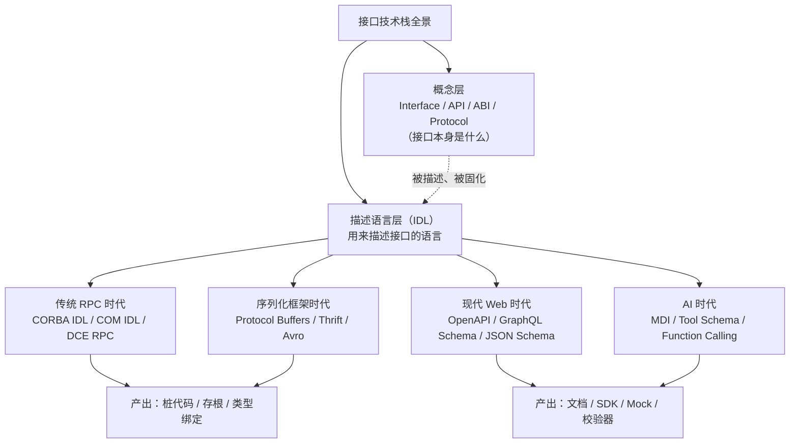

# IDL（接口定义语言）Wiki 教程 - 总览

## 引言

在分布式系统、跨语言调用、序列化协议设计中，**IDL（Interface Definition Language，接口定义语言）** 是一块基石。它不是某种具体的接口，而是一种"用来描述接口的语言"——通过中立、语言无关的声明式语法，把数据结构、服务方法、错误码、流式契约等固化成可被机器解析、可被多语言生成、可被版本演进的"契约文本"。

无论你是在写 gRPC 服务、Thrift RPC、CORBA 分布式对象，还是设计 OpenAPI 文档、GraphQL Schema，乃至为 AI Agent 定义工具调用接口，背后都离不开 IDL 的思想：**先声明契约，再生成实现**。

本教程与项目内已有的 [`../interface-api-abi-protocol-wiki/00-overview.md`](../interface-api-abi-protocol-wiki/00-overview.md)（讲解 Interface/API/ABI/Protocol 四个概念本身）形成互补关系：

- **interface-api-abi-protocol-wiki** 关注"接口是什么"——接口的不同层次（Interface / API / ABI / Protocol）的本质区别
- **idl-wiki（本教程）** 关注"接口怎么描述"——用什么样的语言/规范把接口写成可解析、可生成、可演进的契约

两者是不同维度的内容：前者是"接口本体论"，后者是"接口描述方法论"。

## IDL 在接口技术栈中的定位

下面的层次图展示了 IDL 与 Interface/API/ABI/Protocol/OpenAPI/GraphQL Schema 的关系。核心要点：**IDL 是描述接口的语言层**，而 Protobuf、Thrift、CORBA IDL、OpenAPI、GraphQL Schema 等都是 IDL 思想在不同时代、不同场景下的具体实现。



图中可以清晰看到：IDL 不是某一门具体语言，而是贯穿分布式演进史的一类"契约描述语言"的统称。概念层（Interface/API/ABI/Protocol）是被描述的对象，IDL 层是描述工具，二者通过"描述与被描述"的关系耦合在一起。

## 10 章导航表

本教程共 10 章（00–09），章节之间既可线性阅读，也可按需跳转。各章节文件均位于本目录 `idl-wiki/` 下。

| 章节 | 标题 | 内容简述 |
| --- | --- | --- |
| 00 | [概念总览（本章）](00-overview.md) | IDL 定位、10 章导航、阅读路径 |
| 01 | [IDL 定义与作用](01-what-is-idl.md) | IDL 标准定义、核心特征、发展三阶段、与编程语言原生 interface 对比 |
| 02 | [IDL 类型系统](02-syntax-types.md) | 基本数据类型（标量/复合/枚举/容器）与注解注释机制，含三语法对照 |
| 03 | [IDL 接口声明与方法描述](03-syntax-interface.md) | 接口声明、方法描述、参数方向、异常声明，含三语法对照与设计哲学差异 |
| 04 | [主要 IDL 规范介绍](04-major-idl-specs.md) | Protocol Buffers、Thrift、CORBA IDL、COM IDL、Avro IDL 五种规范详解 |
| 05 | [IDL 规范对比](05-comparison.md) | 多维度对比表格、Mermaid 决策树、按场景的选型推荐 |
| 06 | [IDL 编译流程与工具链](06-toolchain.md) | 编译流程图、主流编译器、构建系统集成、Schema 演进与兼容性 |
| 07 | [实际应用案例与最佳实践](07-use-cases.md) | gRPC/Thrift/CORBA 三案例 + ≥5 条最佳实践 |
| 08 | [与现代接口描述方式对比](08-vs-modern-formats.md) | 与 OpenAPI/GraphQL Schema/JSON Schema/AsyncAPI 对比 + MDI 关联 |
| 09 | [学习资源与参考资料](09-resources.md) | 术语表、权威资料、扩展阅读、项目内交叉引用 |

## 目标读者

本教程面向以下读者：

- **初中级开发人员**：希望系统理解 IDL 是什么、为什么需要它、如何读懂一份 `.proto` / `.thrift` / `.idl` 文件
- **架构师**：在技术选型阶段需要对比不同 IDL 规范的取舍，做出符合团队与场景的决策
- **分布式系统开发者**：日常使用 gRPC / Thrift / CORBA，希望深入理解契约驱动开发（CDD）的全流程
- **跨语言调用场景工程师**：需要在多语言（Go / Java / C++ / Python / Rust 等）之间生成类型安全的桩代码与存根
- **AI Agent 工具定义开发者**：为 LLM 工具调用、Function Calling、MCP 等场景设计结构化的工具接口描述，希望从 IDL 演进史中借鉴模式

## 阅读路径建议

根据读者的背景与目标，推荐三种阅读路径。

### 线性阅读（推荐初学者）

按章节顺序通读，建立完整知识体系：

```
00 → 01 → 02 → 03 → 04 → 05 → 06 → 07 → 08 → 09
```

- 00–03 建立概念与语法基础（类型系统 + 接口声明）
- 04–05 掌握主流规范并学会选型
- 06–07 理解工具链与工程实践
- 08–09 拓展视野并沉淀参考资料

### 按需查阅（推荐有经验者）

已有 IDL 基础、只需解决具体问题的读者，可直接跳转：

- 想快速了解某门规范 → 跳转 [04 - 主要 IDL 规范介绍](04-major-idl-specs.md)
- 正在做技术选型、需要对比 → 跳转 [05 - IDL 规范对比](05-comparison.md)
- 遇到 Schema 演进 / 兼容性问题 → 跳转 [06 - IDL 编译流程与工具链](06-toolchain.md)
- 想看真实案例与避坑指南 → 跳转 [07 - 实际应用案例与最佳实践](07-use-cases.md)

### 延伸阅读

本教程聚焦 IDL 本身，若需扩展到接口概念与 AI 视角，推荐：

- 接口概念基础：[`../interface-api-abi-protocol-wiki/00-overview.md`](../interface-api-abi-protocol-wiki/00-overview.md) ——理解 Interface / API / ABI / Protocol 四个概念的边界与联系
- AI Agent 接口视角：[`../agent-interface-deep-dive/`](../agent-interface-deep-dive/) ——从 AI Agent 角度重新审视工具接口、MCP、Function Calling 的设计

---

**下一章**：[01 - IDL 定义与作用](01-what-is-idl.md)
