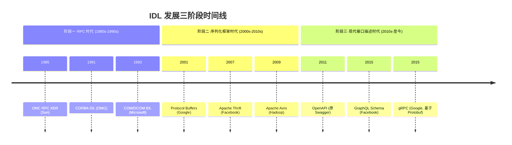
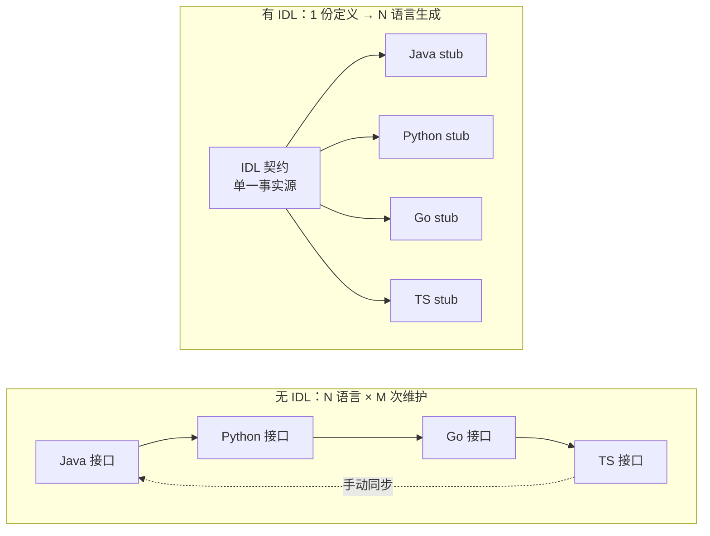

# 一、IDL 定义与作用：接口契约的语言中立描述

## 标准定义

### OMG 定义

根据对象管理组织（Object Management Group, OMG）的规范，IDL（Interface Definition Language，接口定义语言）是一种**声明式语言**，用于以语言中立的方式描述对象接口的契约。OMG IDL 最早服务于 CORBA（Common Object Request Broker Architecture，通用对象请求代理体系）分布式对象标准，将接口定义与具体编程语言实现彻底解耦，使得不同语言编写的组件能够通过同一份契约互相调用。

### 通用工程定义

在工程实践中，IDL 是一种特殊的领域特定语言（Domain Specific Language, DSL），用平台与语言中立的方式描述软件组件间交互的接口契约，并通过编译器（codegen）自动生成多目标语言的桩代码（Stub）与骨架代码（Skeleton）。其本质是"接口即契约"的形式化表达：开发者只需维护一份契约文本，由工具链负责将其翻译为各语言的可用代码。

## 核心特征

### 1. 语言中立（Language Neutral）

IDL 本身不属于任何编程语言，其语法独立于 Java、C++、Python、Go、TypeScript 等具体语言。通过 IDL 编译器的 codegen 能力，一份 IDL 源文件可生成多种目标语言的绑定代码，开发者只需维护一份契约定义，即可在多语言技术栈中复用。

### 2. 平台中立（Platform Neutral）

IDL 不绑定操作系统（Windows/Linux/macOS）、硬件架构（x86/ARM/RISC-V）或网络协议（TCP/HTTP/UDP）。同一份 IDL 可在异构平台间复用，是分布式系统跨环境协作的基础设施。

### 3. 可编译生成（Compilable）

IDL 文件经编译器处理后会自动生成客户端 stub（桩）与服务端 skeleton（骨架）代码。典型编译器包括 `protoc`（Protocol Buffers）、`thrift`（Apache Thrift）、`MIDL`（Microsoft IDL）等。生成代码涵盖序列化/反序列化、网络传输、接口分发等样板逻辑，让开发者聚焦业务实现。

### 4. 类型系统支持（Type System）

IDL 提供完整的类型系统：标量类型（int/float/bool/string）、复合类型（struct/message）、枚举（enum）、容器类型（list/map/set）、可选类型（optional/nullable）。部分现代 IDL（如 Protobuf 3、Thrift）还支持泛型与注解（annotations），用于扩展元信息与代码生成策略。

### 5. 契约式设计（Contract-First）

IDL 是接口的单一事实源（Single Source of Truth, SSOT）。开发流程遵循"先定义契约、后实现逻辑"的契约优先模式，确保多团队、多语言协作时接口语义一致。任何接口变更必须先修改 IDL，再通过编译器传播到所有下游语言，从源头杜绝不一致。

## IDL 发展三阶段

### 阶段一·RPC 时代（1980s-1990s）

分布式对象计算兴起，IDL 用于描述跨进程、跨机器的对象接口。代表产物：

- **CORBA IDL**（OMG, 1991）：跨语言、跨平台分布式对象标准
- **COM/DCOM IDL**（Microsoft, 1993）：Windows 平台组件对象模型
- **ONC RPC XDR**（Sun, 1985）：外部数据表示与远程过程调用

### 阶段二·序列化框架时代（2000s-2010s）

互联网规模增长催生高效跨语言序列化需求，IDL 演进为序列化+RPC 框架核心。代表产物：

- **Protocol Buffers**（Google, 2001）：二进制高效序列化
- **Apache Thrift**（Facebook, 2007）：可插拔传输协议的 RPC 框架
- **Apache Avro**（Hadoop, 2009）：基于 schema 的数据序列化

### 阶段三·现代接口描述时代（2010s-至今）

云原生与微服务兴起，IDL 扩展到 Web API、API 网关、微服务治理领域。代表产物：

- **OpenAPI**（原 Swagger, 2011）：RESTful API 描述标准
- **GraphQL Schema**（Facebook, 2015）：图查询接口定义
- **gRPC**（Google, 2015）：基于 Protobuf 与 HTTP/2 的高性能 RPC

## IDL 解决的核心问题

### 痛点：多语言接口维护的"幂次爆炸"

在没有 IDL 的工程实践中，同一接口需要在 Java、Python、Go 等多种语言中各写一遍。当接口演进时（新增字段、修改签名、调整类型），开发者必须手动同步 N 个语言的实现。任何遗漏都会导致运行时不一致，且难以通过编译期发现，最终演变为线上故障。

### IDL 方案：单源定义 + 编译器多语言生成

IDL 通过"单源定义 → 编译器多语言生成"的机制，将接口维护成本从 O(N×M) 降为 O(1)。任何接口变更只需修改 IDL 一次，编译器自动传播到所有目标语言，从根本上消除人为疏漏。

## IDL vs 编程语言原生 interface

| 维度 | 编程语言原生 interface | IDL |
|---|---|---|
| 定义范围 | 单语言内的类型契约 | 跨语言的接口契约 |
| 例子 | Go interface、Java interface、TS interface | Protobuf service、CORBA interface、Thrift service |
| 生成物 | 编译期类型检查 | 多语言 stub/skeleton + 序列化代码 |
| 跨语言能力 | 无（仅同语言） | 核心能力 |
| 传输协议绑定 | 无 | 通常绑定 RPC/HTTP |
| 适用场景 | 单体应用内解耦 | 分布式系统、跨语言调用 |

## 小结

IDL 是分布式系统接口契约的标准表达载体，其语言中立、平台中立、可编译生成的特性，使其成为跨语言协作的基石。理解 IDL 的定义、核心特征与演进历程，是后续学习具体 IDL 语法（如 Protobuf、Thrift）与工程实践的前提。

---

**上一章**：[00 - 概念总览](00-overview.md)  
**返回目录**：[00 - 概念总览](00-overview.md)  
**下一章**：[02 - IDL 类型系统](02-syntax-types.md)
