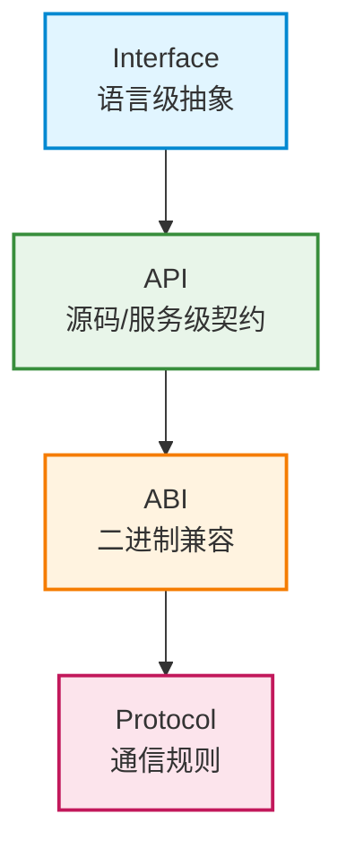

# 一、概念总览：软件接口的四层抽象

## 引言

在软件开发实践中，"接口"是一个被频繁使用却又经常被混淆的概念。开发人员在日常工作中会接触到 Interface、API、ABI、Protocol 这四个相关但层次不同的概念，却常常对它们的边界和适用场景感到困惑：

- 为什么 Go 语言的 `interface` 和 REST API 都叫"接口"？
- 为什么 C++ 程序换个编译器编译就可能崩溃？这和 ABI 有什么关系？
- 同样是通信，HTTP 和 TCP Protocol 到底有什么本质区别？
- 微服务之间用 API 调用，为什么还要谈 Protocol Buffers？

本教程的目标就是系统梳理这四个核心概念的层次关系，帮助开发者建立清晰的技术认知框架，避免在架构设计、系统集成、跨语言调用等场景中因概念混淆而产生设计错误。

## 四个概念的层次定位

从抽象程度最高的语言级概念到最具体的通信规则，这四个概念形成了一条清晰的抽象层次链：

**层次演进方向**：从"是什么"（抽象定义）到"怎么用"（使用方式），再到"如何兼容"（二进制边界），最终到"如何传输"（通信规则）。

## 核心区别速览

| 概念 | 核心关注点 | 解决的问题 |
|------|-----------|-----------|
| **Interface** | 行为契约的抽象定义 | "能做什么"——类型系统层面的能力约束 |
| **API** | 源码/服务级的使用契约 | "怎么调用"——开发者可见的编程边界 |
| **ABI** | 二进制级的兼容约定 | "如何链接"——编译后二进制之间的互操作 |
| **Protocol** | 网络/进程间的通信规则 | "如何传输"——分布式系统中的数据交换 |

## 目标读者

本教程面向以下读者群体：

- **初中级开发人员**：厘清易混淆概念，建立系统的技术认知
- **高级开发人员**：查漏补缺，深化对跨层次交互的理解
- **架构师**：在系统设计时准确选择接口抽象层次
- **跨语言/跨平台开发者**：理解二进制兼容和跨语言调用的底层原理
- **分布式系统开发者**：掌握协议设计与API设计的不同考量

## 阅读路径指南

本教程共分7章，建议按顺序阅读。每章内容简介如下：

1. **第00章 概念总览**（本章）：建立四层抽象框架，快速理解概念关系
2. **第01章 Interface**：深入语言级接口，包括鸭子类型、显式接口、面向接口编程
3. **第02章 API**：源码级与服务级API设计，包括RESTful、GraphQL、库API设计原则
4. **第03章 ABI**：二进制兼容深度解析，调用约定、名称修饰、内存布局、跨语言调用
5. **第04章 Protocol**：通信协议分层，从传输层到应用层，协议设计三要素
6. **第05章 对比分析**：系统对比四个概念的区别联系，包含Mermaid层次图、混淆点澄清、决策指南
7. **第06章 参考资料**：术语表、权威参考资料、扩展阅读建议

## 章节导航

| 章节 | 内容 |
|------|------|
| [00 - 概念总览](00-overview.md) | 四层抽象框架、核心区别速览、阅读路径指南 |
| [01 - Interface](01-interface.md) | 语言级接口：行为契约、鸭子类型、面向接口编程实践 |
| [02 - API](02-api.md) | 源码级与服务级API：RESTful、GraphQL、库API设计 |
| [03 - ABI](03-abi.md) | 二进制兼容：调用约定、名称修饰、内存布局、跨语言调用 |
| [04 - Protocol](04-protocol.md) | 通信协议：分层模型、序列化、协议设计三要素 |
| [05 - 对比分析](05-comparison.md) | 四概念对比表格、关联关系、Mermaid层次图、混淆点澄清、决策指南 |
| [06 - 参考资料](06-resources.md) | 术语表、权威参考资料、扩展阅读建议 |

---

**下一章**：[01 - Interface：语言级行为抽象](01-interface.md)
