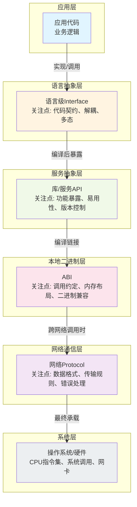

# 六、对比分析：四概念系统辨析

前四章分别介绍了Interface、API、ABI、Protocol四个核心概念。本章将它们放在一起系统对比，梳理层次关系，澄清常见混淆点，帮助读者建立完整的认知地图。

## 四概念对比表格

| 对比维度 | Interface（接口） | API（应用编程接口） | ABI（应用二进制接口） | Protocol（协议） |
|---------|------------------|-------------------|---------------------|-----------------|
| **定义/核心关注点** | 语言级契约，定义"能做什么"的抽象规范 | 库/服务对外暴露的编程入口，定义"如何调用服务" | 二进制层面的调用约定，定义编译后如何交互 | 通信双方的数据交换规则，定义"如何传输数据" |
| **抽象层次** | 源码级抽象（最高层） | 源码/设计级抽象 | 二进制级抽象（最低层本地约定） | 通信级抽象（跨机器） |
| **关注时期** | 设计时、编码时 | 设计时、编码时、调用时 | 编译时、链接时、运行时 | 通信时、运行时 |
| **应用范围** | 语言内、模块内 | 模块间、进程间、语言间 | 同一平台/编译器下的二进制边界 | 网络间、跨进程、跨机器 |
| **实现/定义方式** | 语言关键字（interface、trait、abstract class） | 文档、代码注释、IDL、OpenAPI规范 | 编译器约定、操作系统规范、处理器指令集 | RFC标准、行业规范、IDL（Protobuf/Thrift） |
| **变化影响范围** | 实现类需适配，通常需重新编译 | 调用方代码可能需要修改，重新编译/部署 | 所有依赖二进制必须重新编译/链接 | 通信双方都需升级，全链路兼容处理 |
| **典型使用者** | 应用开发者、架构师 | 应用开发者、库开发者、服务提供者 | 编译器工程师、库发布者、系统集成者 | 网络工程师、后端开发者、分布式系统架构师 |
| **兼容性问题** | 源码兼容（编译通过） | 源码兼容、API版本兼容 | 二进制兼容（无需重编译） | 协议版本兼容、向前/向后兼容 |
| **举例** | Java `interface`、Go `interface`、Rust `trait` | libc函数、REST API、Java SDK方法 | System V ABI、C++ vtable布局、调用约定（cdecl/stdcall） | HTTP/1.1、gRPC、MQTT、TCP、Protobuf序列化 |

## 概念关联关系分析

四个概念并非孤立存在，而是构成了从抽象到具体的完整层次链。

### 1. API与Protocol的关系

API定义"提供什么服务"，协议定义"如何传输交互"。API常基于某种协议实现：
- REST API基于HTTP协议
- gRPC API基于HTTP/2 + Protobuf协议
- 数据库API（JDBC/ODBC）底层可能基于TCP自定义协议

API聚焦于"调用什么方法、传什么参数、返回什么结果"，协议聚焦于"数据怎么打包、怎么传、怎么校验、错误怎么处理"。

### 2. Interface与API的联系

Interface是语言级的API表达形式：
- 库API在面向对象语言内通常通过Interface/抽象类暴露
- 良好的API设计往往以Interface为核心，对外隐藏实现细节
- 例如Java的`List`是Interface，`ArrayList`是具体实现，`List`构成了集合API的核心契约

### 3. Interface与ABI的联系

源码中的Interface定义编译后生成特定的ABI约定：
- C++虚函数接口编译后生成vtable（虚函数表），表项顺序、内存布局构成ABI的一部分
- 保持ABI稳定意味着不改变虚函数顺序、不新增虚函数在中间位置、不改变成员变量布局
- Rust的`trait`编译后通过static dispatch或dynamic dispatch（vtbl）实现，后者涉及ABI

### 4. ABI与Protocol的相似性

二者本质上都是"约定"而非"实现"，但作用边界不同：
- ABI关注**单机内**二进制边界（进程内、模块间、跨语言调用）
- Protocol关注**网络/进程间**数据交换边界（跨机器、跨网络、跨进程通信）
- 二者都需要精确定义数据格式、顺序、错误处理，一旦变化就可能导致兼容性问题

### 5. 完整层次链

从抽象到具体的完整抽象栈：
```
Interface → API → ABI → Protocol
```
- 一层比一层更具体、更接近硬件/网络
- 上层变化通过下层体现，下层稳定性决定上层兼容性
- Interface变化 → API变化 → 触发重编译 → ABI可能变化 → 跨网络时Protocol承载变化

## 软件系统架构中的定位

下图展示了完整的抽象栈，从应用代码到底层操作系统/硬件：



各层关键特征：
- **应用代码**：业务逻辑所在，面向Interface编程
- **语言级Interface**：语言内契约，设计时核心
- **库/服务API**：对外服务边界，模块/服务交互核心
- **ABI**：编译后二进制契约，本地调用核心
- **网络Protocol**：跨机器通信契约，分布式系统核心
- **操作系统/硬件**：最终执行载体

## 常见混淆点澄清

### Q: HTTP是API还是协议？
**A:** HTTP本身是**协议**（应用层协议），定义了客户端与服务器之间通信的报文格式、请求方法、状态码等规则。"REST API"是基于HTTP协议设计的API风格/架构模式，利用HTTP的动词（GET/POST/PUT/DELETE）和状态码来表达资源操作。不能把HTTP协议等同于API。

### Q: 为什么C++库升级经常需要重新编译依赖它的程序？
**A:** 因为C++**没有标准化的稳定ABI**。不同编译器（GCC/Clang/MSVC）、甚至同一编译器的不同版本，在以下方面可能不同：
- name mangling（名字修饰）规则
- vtable（虚函数表）布局
- 结构体成员对齐
- 异常处理实现
- 标准库实现
这导致旧程序编译出的二进制无法链接新版本C++库，必须重新编译。相比之下，C语言有更稳定的ABI约定。

### Q: Go的interface和Java的interface有什么区别？
**A:** 核心区别在于类型系统：
- **Go**：结构化类型（structural typing，鸭子类型），不需要显式`implements`声明，只要方法集匹配就自动实现接口
- **Java**：标称类型（nominal typing），必须显式`class X implements Y`声明实现关系
这是语言层面Interface设计的差异，影响代码的耦合方式和扩展模式。Go的方式更灵活，Java的方式更显式。

### Q: SDK和API是什么关系？
**A:** SDK（Software Development Kit，软件开发工具包）是**包含API实现、工具、文档、示例代码**的完整开发工具包；API是SDK对外暴露的**编程接口**本身。简单说：SDK是"工具包"，API是工具包提供的"使用说明书和入口"。例如AWS SDK包含了签名实现、HTTP客户端、重试逻辑等，而API是你调用的`client.PutObject()`这样的方法。

### Q: 二进制兼容和源码兼容有什么区别？
**A:**
- **源码兼容**：旧代码在新版本库/API下能**编译通过**，但必须重新编译。例如新增可选参数、新增接口方法（有默认实现）通常保持源码兼容
- **二进制兼容**：**已经编译好**的旧程序能直接链接/运行新版本库，不需要重新编译。例如C库中新增函数不改变原有函数布局时保持二进制兼容
源码兼容是开发者视角（能编译），二进制兼容是发布视角（不用重编译）。二进制兼容的要求远高于源码兼容。

## 决策指南：何时关注哪个层次

根据工作场景选择需要重点关注的抽象层次：

| 工作场景 | 关注层次 | 核心要点 |
|---------|---------|---------|
| 设计模块内部代码、写业务逻辑 | **Interface** | 面向接口编程，依赖倒置，解耦实现 |
| 设计公共库/开放服务供他人调用 | **API** | 易用性、一致性、命名清晰、版本控制、文档完善 |
| 发布预编译二进制库（.so/.dll/.a） | **ABI** | 保持稳定，不随意改虚函数顺序、内存布局，考虑符号可见性 |
| 跨语言调用（FFI、JNI、C# P/Invoke） | **ABI** | 使用C ABI作为共同基础，避免C++高阶特性跨边界 |
| 设计分布式系统、微服务通信 | **Protocol** | 根据场景选择（HTTP/gRPC/MQTT/自定义TCP），考虑性能、跨平台、演进性 |
| 设计语言/编译器/操作系统组件 | **ABI + Protocol** | ABI定义本地调用规范，Protocol定义内核/用户态交互 |

## 本章要点

- 四个概念构成完整抽象栈：Interface（语言契约）→ API（服务入口）→ ABI（二进制约定）→ Protocol（通信规则）
- 不同层面对应不同关注点和兼容性要求，越往下稳定性要求越高、影响范围越大
- 混淆往往发生在相邻层次之间，理解边界是掌握的关键
- 实际工作中根据场景选择重点关注的层次，避免跨层设计或忽略下层约束

---

**上一章：**[04 - Protocol：通信规则约定](04-protocol.md)  
**下一章：**[06 - 参考资料与扩展阅读](06-resources.md)
