# MiniT2I极简文生图模型 — 概述与学习目标

> 一句话摘要：MiniT2I是何恺明团队发布的极简像素空间文生图模型，通过移除VAE、AdaLN、私有数据、RL/DPO和辅助损失这五大"标配"组件，证明纯粹的朴素Transformer即可在学术级算力上达到SOTA级性能，标志着文生图领域从"堆料"到"提纯"的范式转移。

---

## 1. 背景介绍

文生图（Text-to-Image Generation）领域自Stable Diffusion发布以来，长期遵循着"堆料"的竞争逻辑：

- **堆参数**：模型规模从几亿膨胀到几十亿甚至上百亿参数
- **堆组件**：VAE编解码器、AdaLN条件注入、多文本编码器、辅助损失函数、RL/DPO对齐阶段……组件越来越多
- **堆数据**：依赖工业级私有数据集，大规模爬取、清洗、人工标注
- **堆算力**：数千张GPU训练数周甚至数月，学术实验室难以企及

这种"军备竞赛"式的发展路径虽然带来了性能提升，但也导致：
1. 顶尖研究成为少数工业巨头的专属游戏
2. 系统复杂度不断累积，组件间交互难以理解
3. 默认前提很少被质疑——"大家都这么做"等同于"必须这么做"

MiniT2I的出现正是对这一现状的系统性反思。

---

## 2. 核心主题

MiniT2I的核心可以概括为"三大减法 + MM-JiT架构 + 范式转移"：

| 核心主题 | 核心内容 |
|---------|---------|
| **三大减法** | 减VAE（像素空间直出）、减AdaLN（回归朴素Transformer）、减私有数据/RL（全公开数据两阶段训练） |
| **MM-JiT架构** | Multi-Modal Joint Transformer，仅用两层文本适配器+标准联合注意力，文本与图像patch平等交互 |
| **范式转移** | 从"堆料"（增加复杂度）转向"提纯"（识别本质），文生图研究门槛实质性降低 |

关键金句：

> "当一个258M参数的模型，用纯公开数据，在学术级算力上训练3天就能打败体量大数倍的对手时，或许文生图正在经历从'堆料'到'提纯'的范式转换。"

---

## 3. 学习目标

完成本Wiki教程后，你将能够：

1. **理解核心哲学**：掌握"每一步都做减法"的设计思想，以及质疑默认前提、基线先于优化的研究方法论
2. **解析技术路线**：深入理解无VAE像素空间直出、无AdaLN朴素Transformer、全公开数据两阶段训练这三大减法的技术逻辑与量化收益
3. **掌握MM-JiT架构**：理解MM-JiT与主流MM-DiT架构的本质区别，以及"噪声图像携带时间步信息"这一关键洞察
4. **分析实验结果**：能够解读GenEval、DPG-Bench、PRISM-Bench等评测结果，理解参数效率与训练成本优势
5. **获得方法论启示**：从MiniT2I中提炼可复用的研究方法论和工程实践原则，应用到自己的AI工作中

---

## 4. 前置知识

开始学习前，建议具备以下基础知识：

- **Transformer基本原理**：了解自注意力机制、预归一化、patch token化等概念
- **扩散模型基础**：对扩散过程、噪声预测、Classifier-Free Guidance（CFG）有概念性了解
- **文生图领域常识**：知道Stable Diffusion、DALL·E、SD3等主流模型的基本架构特点
- **深度学习基础**：了解FID指标、GFLOPs计算量、过拟合/泛化等基本概念

> 即使你对文生图领域不熟悉，本教程也会在关键概念处提供解释，可以直接开始学习。

---

## 5. 章节导航

| 章节 | 标题 | 内容概要 | 难度 |
|------|------|---------|------|
| 00 | [概述与学习目标](00-overview.md)（当前页） | 背景介绍、核心主题、学习目标、技术路线概览 | ⭐ |
| 01 | [核心设计哲学](01-design-philosophy.md) | "每一步都做减法"的四大原则、五大减法量化成果汇总 | ⭐ |
| 02 | [技术路线三大减法](02-three-subtractions.md) | 无VAE、无AdaLN、无私有数据的详细技术解析与数据支撑 | ⭐⭐⭐ |
| 03 | [MM-JiT架构深度解析](03-mm-jit-architecture.md) | MM-DiT vs MM-JiT对比、两层文本适配器、噪声图像携带时间步详解 | ⭐⭐⭐⭐ |
| 04 | [实验结果与性能分析](04-experiments-performance.md) | 模型规格、计算量、评测基准结果、训练成本、消融实验、与SD3综合对比 | ⭐⭐ |
| 05 | [局限性与开放问题](05-limitations-open-problems.md) | patch伪影、CFG副作用、分辨率天花板、数据瓶颈——诚实面对不足 | ⭐⭐ |
| 06 | [范式转移与方法论启示](06-paradigm-shift-insights.md) | 堆料vs提纯、研究门槛降低、LLM范式迁移、对研究者和工程师的建议 | ⭐⭐⭐ |
| 07 | [总结、FAQ与资源](07-summary-faq-resources.md) | 10条关键要点、常见问题解答、术语表、参考资料 | ⭐ |

---

## 6. 技术路线概览

下图展示了MiniT2I从传统文生图范式出发的"减法路径"：

```mermaid
graph LR
    subgraph Traditional["传统文生图范式（堆料）"]
        T1[VAE编解码器<br/>潜在空间扩散]
        T2[AdaLN条件注入<br/>scale/shift/gate]
        T3[私有数据集<br/>工业级爬取清洗]
        T4[RL/DPO对齐<br/>复杂训练流程]
        T5[多个辅助损失<br/>超参数调优]
    end

    subgraph Subtractions["三大减法 + 两项移除"]
        S1["− VAE<br/>像素空间直出"]
        S2["− AdaLN<br/>回归朴素Transformer"]
        S3["− 私有数据<br/>全公开数据"]
        S4["− RL/DPO<br/>纯粹流匹配目标"]
        S5["− 辅助损失<br/>单一目标训练"]
    end

    subgraph MiniT2I["MiniT2I极简范式（提纯）"]
        M1[RGB像素空间<br/>直接生成]
        M2[MM-JiT架构<br/>标准联合注意力]
        M3[两阶段训练<br/>CC12M预训练+12万微调]
        M4[258M去噪器<br/>~600M总参数]
        M5[8张H100×3天<br/>学术级算力]
    end

    Results["性能结果<br/>GenEval: 0.87<br/>DPG-Bench: 84.2<br/>FID降低26.7%（生成质量提升）<br/>计算量降低58.7%"]

    Traditional --> Subtractions
    Subtractions --> MiniT2I
    MiniT2I --> Results

    style Traditional fill:#ffcccc,stroke:#cc0000
    style Subtractions fill:#fff4cc,stroke:#cc9900
    style MiniT2I fill:#ccffcc,stroke:#009900
    style Results fill:#cce5ff,stroke:#0066cc
```



> **路线解读**：MiniT2I不是在传统架构上做增量改进，而是系统性地移除了被视为"必需"的组件。每一次减法都释放了算力/参数预算，这些预算被重新投入到更本质的能力扩展（如增加网络深度），实现了"减法即加法"。

---

## 7. 阅读路径建议

根据你的背景和目标，选择适合的阅读路径：

### 🟢 初学者路径（了解概念 → 建立认知）

```
00-overview → 01-design-philosophy → 04-experiments-performance → 05-limitations → 07-summary
```

1. 从本章（概述）开始，建立整体认知
2. 阅读第1章理解核心设计哲学
3. 跳至第4章看实验结果，直观感受性能
4. 阅读第5章了解局限性，建立全面认识
5. 最后读第7章总结和FAQ巩固理解

> 完成此路径后，你将理解MiniT2I的核心价值和为什么它重要。

### 🔵 进阶路径（技术细节 → 架构理解）

```
00 → 01 → 02-three-subtractions → 03-mm-jit-architecture → 04 → 07
```

1. 按顺序阅读00-04章，深入理解三大减法和MM-JiT架构
2. 重点研读第3章的关键洞察解析
3. 结合第7章的术语表和FAQ巩固技术细节

> 完成此路径后，你将能够清晰解释MiniT2I的技术创新点。

### 🟣 研究者路径（深度思考 → 方法论迁移）

```
00 → 01 → 02 → 03 → 04 → 05 → 06-paradigm-shift-insights → 07
```

1. 通读全部章节
2. 重点研读第6章的范式转移和方法论启示
3. 结合自身研究方向思考减法哲学的应用场景
4. 参考第7章资源阅读原论文和代码

> 完成此路径后，你将能够将MiniT2I的研究方法论应用到自己的工作中。

---

- [下一章：核心设计哲学](01-design-philosophy.md) →
