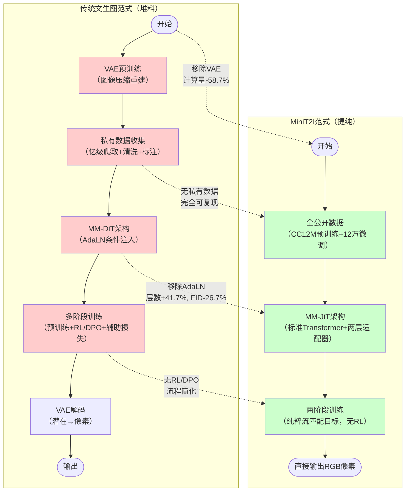

# 技术路线三大减法：VAE、AdaLN与私有数据

本章深入解析MiniT2I在技术路线上的三个激进减法决策，以及支撑每个决策的技术逻辑和实验证据。

---

## 1. 减法一：无VAE——像素空间直出

### 技术背景：什么是潜在扩散？

当前主流文生图模型（如Stable Diffusion、SD3）都采用**潜在扩散（Latent Diffusion）**范式：

1. 先用VAE（变分自编码器）将高维RGB图像（如512×512×3）压缩到低维潜在空间（如64×64×4），压缩率约48倍
2. 在低维潜在空间做扩散/流匹配训练，大幅降低计算量
3. 推理时，去噪后的潜在向量再通过VAE解码器重建为RGB图像

VAE的初衷是解决高分辨率下Transformer自注意力O(n²)复杂度过高的问题，但它也引入了三个固有代价：
- VAE本身需要单独预训练，增加训练阶段
- VAE解码器引入重建误差，为生成质量设定了上限
- VAE编码器的训练目标（像素重建）与去噪器的训练目标（噪声预测/流匹配）存在不对齐

### MiniT2I的选择：直接在像素空间训练

MiniT2I通过消融实验发现，对于512×512这一常用分辨率，VAE带来的计算收益小于它引入的代价：

| 维度 | 详细内容 |
|------|---------|
| **去掉了什么** | VAE编解码器、潜在空间扩散范式、图像压缩-重建两阶段流程 |
| **像素预处理** | 输入图像resize+中心裁剪到512×512后，**归一化到[-1, 1]范围**（与扩散模型标准实践一致） |
| **为什么能去掉** | 使用16×16 patch可将512×512图像切分为(512/16)²=1024个token，这一序列长度完全在Transformer的处理舒适区内；VAE虽解决更高分辨率的计算问题，但并非512分辨率下的必需组件 |
| **计算收益** | 单步前向计算量从~1379 GFLOPs降至~570 GFLOPs（B/16设置），**计算成本降低约58.7%** |
| **质量收益** | 消除VAE重建误差引入的质量上限；消除编码器与去噪器之间的目标不对齐问题；去噪器能力有多强，输出质量就能有多好 |
| **支撑证据** | 相同参数预算下，像素模型FID为18.7，与潜在空间模型的19.0持平；去噪器单步GFLOPs从~1379降至~570（降低约58.7%），整体训练/推理效率显著提升 |

> **关键理解**：MiniT2I不是说"VAE没用"，而是说"在512分辨率、16×16 patch的设置下，VAE的代价超过了收益"。对于更高分辨率（如1024以上），VAE或其他压缩机制仍然是必要的。

---

## 2. 减法二：无AdaLN——回归朴素Transformer

### 技术背景：什么是AdaLN？

AdaLN（Adaptive Layer Normalization，自适应层归一化）是当前文生图Transformer（如DiT、MM-DiT）的标配条件注入机制：

1. 将时间步t通过正弦位置编码+MLP映射为嵌入向量
2. 将池化后的文本全局特征也映射为嵌入向量
3. 在每个Transformer block中，用这些嵌入向量生成scale（缩放）、shift（平移）、gate（门控）参数
4. 通过仿射变换逐层调制特征图，实现条件信息的"注入"

AdaLN的设计初衷是：时间步和文本条件是"全局控制信号"，需要通过专门路径调制整个网络的特征。但这一设计是否必需？

### MiniT2I的关键洞察：噪声图像本身携带时间步信息

这是MiniT2I最具方法论价值的洞察之一。让我们通俗解释：

扩散/流匹配模型的前向过程是逐渐向图像加噪：
- 时间步t=0：干净图像x₀
- 时间步t=T：纯噪声

对于任意时间步t，对应的噪声图像为：
**xₜ = √(ᾱₜ)·x₀ + √(1-ᾱₜ)·ε**

其中ᾱₜ是随t单调递减的系数。这意味着：
- t越小（接近干净图像）：xₜ信噪比高、包含更多高频细节、更"像"真实图像
- t越大（接近纯噪声）：xₜ信噪比低、更平滑、更接近高斯噪声

**Transformer的自注意力机制具有足够的表达能力，可以从xₜ的这些统计特征（信噪比、平滑度、高频成分比例）中隐式推断出当前是哪个时间步**。如果模型自己能"看"出当前在哪个去噪阶段，显式注入时间步嵌入就是冗余的。

### MiniT2I的选择：删除AdaLN分支

| 维度 | 详细内容 |
|------|---------|
| **去掉了什么** | AdaLN条件注入分支、每个子块中用于生成scale/shift/gate参数的额外MLP、通过额外路径注入时间步和全局文本信息的机制 |
| **为什么能去掉** | 两个关键洞察支撑：(1) 被噪声污染的图像本身就携带了噪声水平（时间步）信息，模型可直接从输入图像感知；(2) 通过两层文本适配器让冻结的T5特征先"适应"去噪器需求，再通过标准联合注意力融合，无需专门的调制路径 |
| **参数/架构收益** | 模型参数减少；相同算力预算下可将层数从12层增加到17层（**+41.7%**）；FID从18.7降至13.7（**相对提升约26.7%**）；架构接近标准预归一化Transformer，更简洁、更容易理解和修改 |
| **支撑证据** | MM-JiT架构在相同算力预算下实现了显著的FID提升，验证了朴素Transformer架构在文生图任务上的有效性 |

---

## 3. 减法三：无私有数据/RL——全公开数据两阶段训练

### 技术背景：文生图训练的传统范式

工业级文生图模型的训练通常包括：
1. **大规模预训练**：在数亿甚至数十亿张私有爬取图像上预训练，数据不公开
2. **多阶段对齐**：使用RLHF/DPO等强化学习方法做人类偏好对齐
3. **辅助损失**：使用多个辅助损失函数帮助收敛
4. **数据清洗流水线**：投入大量人力做数据筛选、标注、去重

这导致顶尖模型只有工业巨头能训练，学术研究者难以复现和跟进。

### MiniT2I的选择：LLM式"预训练-微调"两阶段范式

MiniT2I将LLM领域成熟的两阶段训练范式成功迁移到文生图：

| 阶段 | 数据集 | 规模 | 训练步数 | 阶段作用 |
|------|--------|------|---------|---------|
| **预训练** | LLaVA-recaptioned CC12M | 公开可用的VLM重标注数据集 | **250K步** | 获取广度覆盖，学习通用的图文对齐和图像生成能力 |
| **微调** | BLIP3o-60K + LAION DALL·E 3 Discord set + ShareGPT-4o-Image | **~12万张**高质量公开图文对 | **40K步** | 学习"什么是好答案"，提升生成质量和提示跟随能力 |

> **关键数据**：CC12M 250K步预训练 + ~12万张公开数据40K步微调，没有任何私有数据，没有RL/DPO。

### 减法三的详细解析

| 维度 | 详细内容 |
|------|---------|
| **去掉了什么** | 私有训练数据集、RL/DPO对齐阶段、辅助损失函数、海量工业级数据爬取与清洗流水线 |
| **为什么能去掉** | 采用LLM式"预训练-微调"两阶段范式：预训练买覆盖面，微调教模型什么是好答案；纯粹的流匹配目标直接在像素上训练即可收敛 |
| **可复现性收益** | 训练完全可复现；学术级算力即可完成（B/32消融模型在8张H100上仅需约3天）；总训练FLOPs与标准ImageNet 200 epoch实验相当；无需RL/DPO等复杂对齐阶段，训练流程大幅简化 |
| **支撑证据** | 258M参数的B/16版本在GenEval上达到**0.873**，DPG-Bench达到84.2，超越参数量3-4倍的同类像素空间模型；扩展到L/16（914M去噪器+341M文本编码器，总约1.25B）后，GenEval达0.883、DPG达85.9，在风格多样性、空间关系和想象力场景上与SD3-Medium（~2B参数）相当甚至更优 |

### 消融实验结论

预训练和微调两者缺一不可——这与LLM领域的经验完全一致：
- **只做预训练**：图像质量可以，但提示跟随能力很差（模型不知道"什么样的生成是好的"）
- **只做微调**：模型看到的世界太窄，生成多样性坍塌（过拟合到小规模微调数据）

---

## 4. 技术路线对比：传统范式 vs MiniT2I范式

> **对比总结**：MiniT2I不是在传统pipeline上做局部修改，而是重新思考了从文到图生成的整个流程，去掉了所有无法证明其必要性的组件。结果是pipeline更短、架构更简单、成本更低、可复现性更强，而性能反而达到甚至超越了更复杂的系统。

---

← [上一章](01-design-philosophy.md) | [下一章：MM-JiT架构解析](03-mm-jit-architecture.md) →
