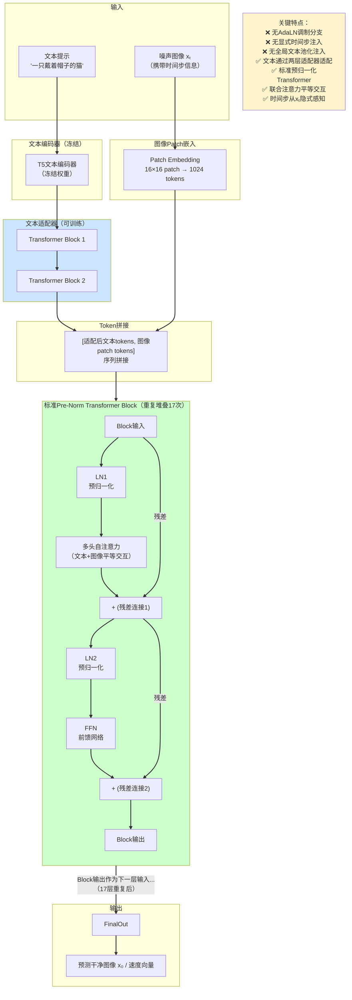

# MM-JiT架构深度解析：回归朴素Transformer

MM-JiT（Multi-Modal Joint Transformer）是MiniT2I提出的核心架构创新。它不是在现有MM-DiT架构上做增量改进，而是从第一性原理出发重新思考多模态条件注入的方式，最终回归到接近标准预归一化Transformer的极简设计。

---

## 1. MM-DiT vs MM-JiT：8维度架构对比

SD3采用的MM-DiT（Multi-Modal Diffusion Transformer）是当前文生图领域的主流架构范式，其核心条件注入机制为AdaLN。MiniT2I提出的MM-JiT是对这一范式的根本性反思。

| 对比维度 | SD3 MM-DiT（AdaLN范式） | MiniT2I MM-JiT（朴素Transformer范式） |
|----------|-------------------------|----------------------------------------|
| **条件注入哲学** | 异质模态需要专门调制路径，通过AdaLN逐层注入时间步和全局文本 | 所有模态都是token，通过标准联合注意力平等交互，无需专门注入分支 |
| **时间步处理** | 显式时间步嵌入→MLP生成scale/shift/gate→逐层调制 | 隐式从噪声图像统计特征中感知，无显式注入路径 |
| **文本处理** | 池化文本编码通过AdaLN全局注入；文本token参与联合注意力 | 冻结T5→两层轻量适配器→联合注意力，无全局池化注入 |
| **架构复杂度** | 每个block包含调制MLP和门控机制，结构复杂 | 接近标准预归一化Transformer，结构简洁干净 |
| **参数效率** | AdaLN分支占用部分参数预算 | 节省的参数预算用于增加层数（12→17层，+41.7%） |
| **FID表现** | 基线18.7（相同算力预算） | 13.7（相同算力预算，提升26.7%） |
| **可复用性** | 定制化架构，迁移改进需理解AdaLN细节 | 标准Transformer架构，可直接复用NLP/CV领域成熟技术 |
| **理论假设** | 时间步和全局文本必须通过调制路径注入；图像本身不携带足够的时间步信息 | 噪声图像本身携带时间步信息；文本token通过注意力充分融合即可；逐层调制是冗余的 |

---

## 2. 核心设计一：两层文本适配器

MM-JiT并非盲目地直接拼接文本和图像token——它承认文本与图像特征存在分布差异，但用更轻量、更符合Transformer本质的方式处理这种差异。

### 设计动机

冻结的T5文本编码器输出的特征分布与去噪器主干期望的输入分布存在**域偏移（domain gap）**：
- T5是在大规模文本语料上预训练的语言模型，其特征空间是为语言理解优化的
- 去噪器是在像素空间做流匹配训练的图像生成模型，其特征空间是为图像生成优化的
- 如果直接将T5输出与图像patch token拼接进行联合注意力，可能导致融合效果不佳

### 实现方式

在文本token与图像patch token进入联合注意力计算之前，插入两个轻量级Transformer block作为**文本适配器（Text Adapter）**：

1. 文本token先经过这两层适配器的独立处理
2. 适配器专门学习将T5特征空间映射到去噪器的特征空间
3. 图像patch token不经过适配器，直接进入联合注意力
4. 适配后的文本token与图像patch token拼接，进入标准Transformer层做联合注意力

### 设计考量

| 设计选择 | 考量 |
|---------|------|
| **仅对文本使用适配器** | 图像patch是去噪器直接处理的对象，其特征空间就是去噪器自己的空间；只有文本是"外来者"需要适配 |
| **适配器层数为两层** | 在表达能力（足够完成域对齐）和计算成本（轻量不占用过多预算）之间取得平衡 |
| **T5整体冻结** | T5已经是成熟的文本编码器，冻结可以节省训练显存和计算，避免过拟合，同时适配器提供足够的适配能力 |
| **不使用全局池化注入** | 全局池化会丢失文本的细粒度位置信息；通过token级注意力融合，每个图像patch可以直接关注到相关的文本token |

### 设计本质

> 承认文本特征与图像特征存在分布差异，但不采用全局调制的方式处理这种差异，而是通过轻量级适配层在token进入联合注意力前完成域对齐，随后让两种模态在标准注意力机制下平等交互。

这与AdaLN的哲学形成鲜明对比：AdaLN认为文本条件是"控制信号"，需要"调制"整个网络；MM-JiT认为文本是"语义上下文"，只需要作为"参考资料"让模型在生成时查阅即可。

---

## 3. 核心设计二：删除AdaLN分支

删除AdaLN是MM-JiT最激进也最有争议的设计决策，但它建立在坚实的实验证据和关键洞察之上。

### 删除的组件列表

移除AdaLN意味着从每个Transformer子块中删除以下组件：

| 被删除组件 | 原作用 |
|-----------|--------|
| 时间步嵌入MLP | 将时间步t映射为高维嵌入向量 |
| 文本池化投影MLP | 将池化后的全局文本特征投影到与时间步嵌入相同维度 |
| Scale/Shift/Gate生成MLP | 在每个block中根据时间步+文本嵌入生成调制参数 |
| AdaLN仿射变换 | 用生成的scale和shift对归一化后的特征做仿射变换 |
| 门控机制 | 用gate参数控制残差连接的信息流 |
| 所有相关的专用路径 | 时间步和文本从嵌入层到每个block的专用传递路径 |

### 删除依据

删除AdaLN不是"拍脑袋"决定，而是建立在两个关键洞察之上：

1. **被噪声污染的图像本身携带时间步信息**（详见下节详解）——模型不需要外部告诉它"现在是第几步"，它自己能从输入图像"看"出来
2. **文本信息已经通过适配器+联合注意力充分融合**——文本token就在序列中，每个图像patch在每一层都能通过注意力直接"看到"所有文本token，不需要再通过全局调制路径"广播"一次

---

## 4. 关键洞察详解："被噪声污染的图像本身携带时间步信息"

这是MiniT2I最核心的科学洞见，也是移除AdaLN的理论基础。

### 理论基础：扩散/流匹配前向过程回顾

在扩散模型和流匹配模型中，前向加噪/插值过程遵循统一的形式。对于时间步t∈[0,T]：

**xₜ = √(ᾱₜ)·x₀ + √(1-ᾱₜ)·ε**

其中：
- x₀是干净图像
- ε是高斯噪声
- ᾱₜ是随t单调递减的系数（t=0时ᾱ=1，xₜ=x₀；t=T时ᾱ→0，xₜ→ε）

这意味着xₜ的统计特性随t呈现**规律性、可预测的单调变化**：

| t值（时间步） | 信噪比（SNR） | 图像特征 | 高频成分 |
|--------------|--------------|---------|---------|
| t≈0（早/干净端） | 高 | 清晰的物体轮廓、纹理、细节 | 丰富 |
| t中等 | 中等 | 大尺度结构可见，细节模糊 | 中等 |
| t≈T（晚/噪声端） | 低 | 接近纯噪声，无明显结构 | 极少 |

### 通俗解释

想象你是一个去噪模型：
- 如果输入图像很清晰、有丰富细节、有明显的物体——你知道现在是在去噪的后期，只需要做精细修饰
- 如果输入图像很模糊、只有大尺度色块、细节不可辨——你知道现在是在去噪的中期，需要补充细节
- 如果输入图像基本是噪声、看不出任何结构——你知道现在是在去噪的早期，需要先构建大框架

你不需要有人在旁边告诉你"这是第50步"——你看一眼输入图像的噪声程度就知道了。

Transformer的自注意力机制具有强大的特征提取和模式识别能力，它完全可以从xₜ的这些统计特征中隐式推断出时间步信息。显式通过AdaLN注入时间步嵌入，对于具有足够表达能力的Transformer来说是**冗余**的。

### 对传统设计的反思

这一洞察迫使我们反思：为什么之前的模型都需要AdaLN显式注入时间步？

可能的原因：
1. **历史路径依赖**：扩散模型最早是用UNet做的，UNet的卷积结构局部感受野有限，难以从全局统计特征推断时间步，确实需要显式注入
2. **模型规模较小**：早期DiT模型规模较小（如DiT-S/XL等），表达能力有限，可能确实需要时间步嵌入的"帮助"
3. **没有人尝试移除**：AdaLN被视为"必需组件"，没有人认真做消融实验验证它是否可以去掉

MiniT2I的实验表明，当模型有足够深度（17层）且采用适当架构（文本适配器+联合注意力）时，模型确实可以隐式感知时间步，AdaLN是冗余的。

### 验证意义

这一洞察的意义远不止于"可以省掉AdaLN"：
1. **方法论价值**：它提醒我们，很多"被证明必需"的组件可能只是历史条件下的最优解，当其他条件变化时可能不再必要
2. **架构简化**：移除AdaLN后架构接近标准Transformer，大量NLP/CV领域的Transformer改进（位置编码、高效注意力、初始化策略等）可以直接复用
3. **理论启发**：它暗示生成模型的条件注入机制可能比我们想象的更简单——模型比我们认为的更"聪明"，能自己从数据中学到很多我们以为需要显式设计的东西

---

## 5. 架构简化的量化收益

删除AdaLN分支直接减少了模型参数和计算量，但MiniT2I并未将这部分算力预算"节省"下来，而是将其重新投入到更本质的模型能力扩展中——增加网络深度，实现了"减法变加法"。

| 指标 | 基线（有AdaLN，12层） | MM-JiT（无AdaLN，17层） | 变化幅度 |
|------|------------------------|--------------------------|----------|
| Transformer层数 | 12层 | 17层 | **+41.7%**（+5层） |
| FID分数 | 18.7 | 13.7 | **-26.7%**（FID越低越好，显著提升） |
| 单步计算量 | ~570 GFLOPs（B/16像素空间基线） | 与基线相当（算力预算重新分配） | 计算成本不变 |
| 架构复杂度 | 高（AdaLN调制分支+额外MLP） | 低（接近标准预归一化Transformer） | 大幅简化 |

### 收益分析

1. **深度增加带来表达能力提升**：从12层增加到17层，网络的非线性变换能力和特征抽象层次显著增强，这是FID大幅提升的主要来源
2. **计算预算优化配置**：AdaLN分支的参数和计算被重新分配给更多的Transformer层，展示了"做减法"本身就是"做加法"
3. **可理解性与可修改性提升**：接近标准Transformer的架构意味着研究者可以直接复用Transformer领域的大量成熟技术，降低了后续改进的门槛

---

## 6. MM-JiT架构图

下图完整展示了MM-JiT的架构流程：

> **架构解读**：MM-JiT的设计可以概括为"冻结T5编码 → 两层适配器域对齐 → 文本图像token拼接 → 17层标准预归一化Transformer联合注意力 → 输出预测"。没有AdaLN、没有特殊的条件注入路径、没有复杂的门控机制——所有交互都通过Transformer最本质的自注意力机制完成。

---

← [上一章](02-three-subtractions.md) | [下一章：实验结果与性能](04-experiments-performance.md) →
