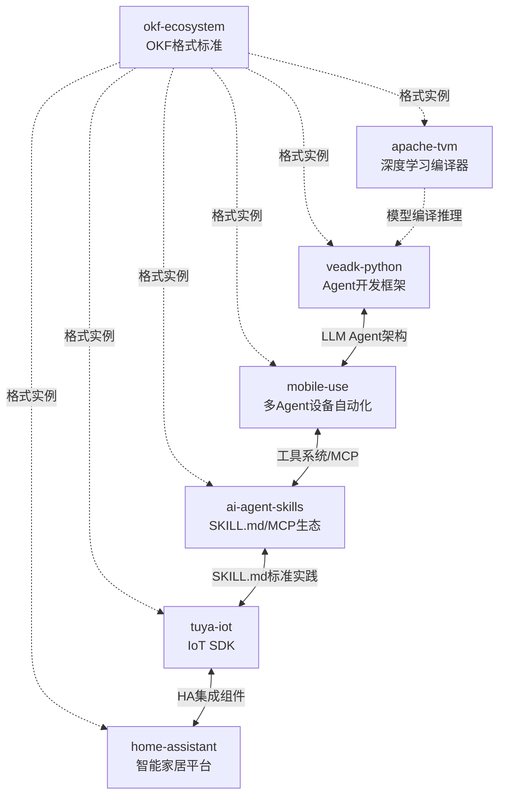

# 跨 Bundle 一致性审查报告

> **审查日期**：2026-08-22
> **审查范围**：`d:\AI\bundles\` 下 7 个源码转 OKF Wiki 知识包
> **审查方法**：Grep/Read 逐文件验证，基于 OKF v0.2 规范与 source-code-to-okf-wiki 工作流模式
> **审查阶段**：C 阶段（模式沉淀前的跨包一致性审查）

---

## 一、审查总览

| 序号 | Bundle 名称 | 项目类型 | 概念文档数 | 事实数 | V阶段修复数 | 根index完整度 | 概念文档verified状态 |
|------|------------|---------|-----------|--------|------------|--------------|-------------------|
| 1 | okf-ecosystem | Python CLI + 桌面应用 | 6 | 311 | 10 | 1/7 字段 | draft/pending |
| 2 | mobile-use | Python Agent SDK | 7 | 265 | 1 | 1/7 字段 | draft/pending |
| 3 | veadk-python | Python Agent 框架 | 12 | 131 | 3 | 1/7 字段 | draft/pending |
| 4 | ai-agent-skills | Markdown/技能集合 | 12 | 292 | 1 | 1/7 字段 | draft/pending |
| 5 | apache-tvm | C/C++ 编译器框架 | 22 | 4事实文件 | 23 | 5/7 字段 | draft/pending（index/log 为 verified） |
| 6 | tuya-iot | C/C++ 嵌入式 IoT SDK | 15 | 599 | 11 | 1/7 字段 | draft/pending |
| 7 | home-assistant | Python 大型框架 | 19 | 4事实文件 | 12类/16处 | 7/7 字段 ✅ | verified ✅ |
| **合计** | — | — | **93** | **1598+** | **61+** | — | — |

**总体结论**：7 个 bundle 在目录结构、内部链接、API 真实性方面基础扎实，但在 **frontmatter 元数据一致性** 方面存在系统性缺口——6 个 bundle 的根 `index.md` frontmatter 不完整，6 个 bundle 的概念文档 `verified.by` 仍为 `pending`、`status` 仍为 `draft`，尽管 V 阶段验证已执行并产出了验证报告。

---

## 二、根 index.md Frontmatter 验证（任务 1.1）

### 2.1 验证标准

OKF v0.2 规范要求根 `index.md` frontmatter 包含：
- `okf_version: "0.2"`
- `type: Index`
- `title`
- `description`
- `tags`
- `generated`（含 `by` 和 `at`）
- `stale_after`

### 2.2 逐 Bundle 验证结果

| Bundle | okf_version | type:Index | title | description | tags | generated | stale_after | 完整度 |
|--------|:-----------:|:----------:|:-----:|:-----------:|:----:|:---------:|:-----------:|:------:|
| okf-ecosystem | ✅ | ❌ | ❌ | ❌ | ❌ | ❌ | ❌ | 1/7 |
| mobile-use | ✅ | ❌ | ❌ | ❌ | ❌ | ❌ | ❌ | 1/7 |
| veadk-python | ✅ | ❌ | ❌ | ❌ | ❌ | ❌ | ❌ | 1/7 |
| ai-agent-skills | ✅ | ❌ | ❌ | ❌ | ❌ | ❌ | ❌ | 1/7 |
| apache-tvm | ✅ | ✅ | ✅ | ✅ | ❌ | ✅ | ❌ | 5/7 |
| tuya-iot | ✅ | ❌ | ❌ | ❌ | ❌ | ❌ | ❌ | 1/7 |
| home-assistant | ✅ | ✅ | ✅ | ✅ | ✅ | ✅ | ✅ | 7/7 |

### 2.3 问题详情

**P1-1：5 个 bundle 根 index.md 仅有 `okf_version` 字段**

- **涉及**：okf-ecosystem、mobile-use、veadk-python、ai-agent-skills、tuya-iot
- **现状**：frontmatter 仅 3 行（`---\nokf_version: "0.2"\n---`），其余元数据全部缺失
- **影响**：知识包缺乏标题、描述、标签、生成时间、过期时间等元数据，无法被 OKF 消费端正确索引和展示
- **建议修复**：参照 home-assistant 根 index.md 补全全部 7 个字段

**P1-2：apache-tvm 根 index.md 缺少 `tags` 和 `stale_after`**

- **现状**：已有 `okf_version`、`type`、`title`、`description`、`generated`，但缺少 `tags` 数组和 `stale_after` 日期
- **建议修复**：补充 `tags: [tvm, compiler, deep-learning, ...]` 和 `stale_after: 2027-08-23`

**P1-3：home-assistant 是唯一完全合规的 bundle**

- 其 frontmatter 包含全部 7 个字段，格式规范，可作为其他 bundle 的参考模板

---

## 三、Concepts Frontmatter 风格统一检查（任务 1.2）

### 3.1 检查维度

1. `generated.at` 时间格式是否一致（ISO 8601）
2. `verified.by` 是否已更新为非 "pending"
3. `status` 是否为 `verified`（非 `draft`）
4. `stale_after` 日期是否统一（generated 后约一年）

### 3.2 逐 Bundle 检查结果

| Bundle | generated.at 格式 | verified.by | status | stale_after | 内部一致性 |
|--------|------------------|-------------|--------|-------------|-----------|
| okf-ecosystem | ISO 8601 ✅ | `pending` ❌ | `draft` ❌ | 2027-08-23 ✅ | 一致 ✅ |
| mobile-use | ISO 8601 ✅ | `pending` ❌ | `draft` ❌ | 2027-08-23 ✅ | 一致 ✅ |
| veadk-python | ISO 8601 ✅ | `pending` ❌ | `draft` ❌ | 2027-08-23 ✅ | 一致 ✅ |
| ai-agent-skills | ISO 8601 ✅ | `pending` ❌ | `draft` ❌ | 2027-08-23 ✅ | 一致 ✅ |
| apache-tvm | ISO 8601 ✅ | 混合 ⚠️ | 混合 ⚠️ | 2027-08-23 ✅ | **不一致** ❌ |
| tuya-iot | ISO 8601 ✅ | `pending` ❌ | `draft` ❌ | 2027-08-23 ✅ | 一致 ✅ |
| home-assistant | 混合格式 ⚠️ | 具体标识 ✅ | `verified` ✅ | 2027-08-23 ✅ | 一致 ✅ |

### 3.3 问题详情

**P2-1：V 阶段验证完成但未回写 frontmatter（系统性问题，影响 6 个 bundle）**

- **涉及**：okf-ecosystem、mobile-use、veadk-python、ai-agent-skills、apache-tvm、tuya-iot
- **现状**：
  - 每个 bundle 都有完整的 `verification-report.md`，记录了 Grep API 验证、链接检查、结构检查等结果
  - 验证报告明确写着"验证通过""零虚构""可发布"
  - 但 concepts/*.md 的 frontmatter 仍为 `verified: { by: pending, at: pending }` 和 `status: draft`
- **根因**：V 阶段流程中，验证员生成了验证报告但未将验证结果回写到每个内容文档的 frontmatter
- **对比**：home-assistant bundle 正确执行了回写——所有 19 篇概念文档 + 1 篇示例的 `verified.by` 更新为 `"Home Assistant 验证工程师"`，`status` 更新为 `verified`
- **建议修复**：
  1. 对每个 bundle，将 `verified.by` 从 `pending` 更新为验证报告中记录的验证员标识
  2. 将 `status` 从 `draft` 更新为 `verified`
  3. 补充 `verified.at` 为验证报告日期

**P2-2：apache-tvm 内部 frontmatter 状态不一致**

- **现状**：
  - `concepts/00-21-*.md`（22 篇概念文档）：`verified.by: pending`，`status: draft`
  - `concepts/index.md`：`verified.by: blackbox-validator/V`，`status: verified`
  - `log.md`：`verified.by: blackbox-validator/V`，`status: verified`
  - `examples/tvm-quickstart.md`：`verified.by: pending`，`status: draft`
- **问题**：同一个 bundle 内，索引文件和日志已标记为 verified，但内容文档仍为 draft/pending，状态矛盾
- **建议修复**：统一全部文档的 verified 状态

**P2-3：home-assistant 的 verified.at 时间格式不统一**

- **现状**：
  - `generated.at`：`2026-08-23T00:00:00Z`（ISO 8601 完整格式）
  - `verified.at`：`"2026-08-22"`（仅日期字符串）
- **建议修复**：统一为 ISO 8601 格式（`2026-08-22T00:00:00Z`）

**P2-4：apache-tvm 的 concepts/index.md 违规携带 frontmatter**

- **现状**：`concepts/index.md` 包含完整 YAML frontmatter（type/title/description/tags/generated/verified/status/stale_after）
- **规范要求**：根据 source-code-to-okf-wiki 模式文档和其他 6 个 bundle 的实践，子目录 index.md 不应有 frontmatter
- **建议修复**：移除 `concepts/index.md` 的 frontmatter，以 `# Concepts 索引` 标题开头

**P2-5：stale_after 日期一致性良好**

- 7 个 bundle 全部使用 `2027-08-23`，距 generated 日期（2026-08-23）正好一年，符合规范 ✅

---

## 四、跨 Bundle 关联识别（任务 1.3）

以下关联基于项目领域和技术栈分析识别，记录在案供后续知识图谱构建参考，当前不强制添加交叉链接。

### 4.1 关联矩阵

| 关联方向 | 关联类型 | 关联强度 | 关联说明 |
|---------|---------|---------|---------|
| veadk-python ↔ mobile-use | LLM Agent 架构 | 强 | 两者均基于 LLM 的 Agent 系统：veadk-python 是火山引擎 Agent 开发框架，mobile-use 是基于 LangGraph 的多 Agent 设备自动化系统。共享概念：Agent 生命周期、LLM 可插拔配置、工具系统、记忆/状态管理 |
| tuya-iot ↔ home-assistant | IoT 集成 | 强 | TuyaOpen 明确包含 Home Assistant 集成组件（`concepts/13-ha-integration.md`），HA 有 Tuya 官方集成。两者在 IoT 设备抽象、实体模型、服务调用层面有对应关系 |
| ai-agent-skills ↔ tuya-iot | 技能体系 | 中 | TuyaOpen 有 `dev-skills` 技能体系（10 个 SKILL.md），与 ai-agent-skills bundle 研究的 SKILL.md 标准、MCP 协议、插件架构属于同一知识领域。TuyaOpen 的 skills 可视为 ai-agent-skills 模式的一个工业实践案例 |
| apache-tvm ↔ veadk-python | AI 模型编译与推理 | 中 | TVM 是深度学习模型编译器，veadk-python 是 Agent 开发框架。veadk-python 中的 LLM 模型推理在底层可能经过 TVM 等编译栈优化。关联点在于 AI 模型从训练到部署的完整链路 |
| okf-ecosystem → 全部 bundle | 元层面标准 | 基础 | okf-ecosystem 定义了 OKF 知识格式标准（Bundle 数据模型、frontmatter 规范、爬取构建流水线），其他 6 个 bundle 都是 OKF 格式的实例。这是"标准"与"实例"的关系 |
| mobile-use ↔ ai-agent-skills | Agent 工具生态 | 中 | mobile-use 的工具系统（ToolWrapper、15 个设备操作工具）与 ai-agent-skills 研究的 MCP 工具协议、插件架构属于同一领域。MCP 协议可视为工具注册和调用的标准化协议 |
| apache-tvm ↔ home-assistant | 嵌入式/本地 AI | 弱 | HA 的本地优先理念与 TVM 的边缘端模型编译部署有理念层面的关联，但技术栈直接交集较少 |

### 4.2 关联图（Mermaid）

---

## 五、结构一致性检查（任务 1.4）

### 5.1 标准结构要求

每个 bundle 应包含：
- `concepts/` 目录 + `index.md`
- `references/` 目录 + `index.md`
- `examples/` 目录 + `index.md`
- 根 `index.md`
- `log.md`
- `verification-report.md`（V 阶段完成后）

### 5.2 逐 Bundle 结构检查

| 结构项 | okf-eco | mobile-use | veadk-py | ai-skills | tvm | tuya | ha |
|--------|:-------:|:----------:|:--------:|:---------:|:---:|:----:|:--:|
| concepts/ + index.md | ✅ | ✅ | ✅ | ✅ | ✅ | ✅ | ✅ |
| references/ + index.md | ✅ | ✅ | ✅ | ✅ | ✅ | ✅ | ✅ |
| examples/ + index.md | ✅ | ✅ | ✅ | ✅ | ✅ | ✅ | ✅ |
| 根 index.md | ✅ | ✅ | ✅ | ✅ | ✅ | ✅ | ✅ |
| log.md | ✅ | ✅ | ✅ | ✅ | ✅ | ✅ | ✅ |
| verification-report.md | ✅ | ✅ | ✅ | ✅ | ✅ | ✅ | ✅ |
| insights.md | ✅ | ✅ | ✅ | ✅ | ✅ | ✅ | ✅ |
| facts-*.md | ✅ | ✅ | ✅ | ✅ | ✅ | ✅ | ✅ |

**结构完整性结论**：7 个 bundle 的目录结构全部符合 OKF v0.2 规范，无遗漏目录或文件 ✅

### 5.3 结构不一致项

**P3-1：verification-report.md 位置不统一**

| 位置 | Bundles |
|------|---------|
| bundle 根目录 | apache-tvm、tuya-iot、home-assistant、ai-agent-skills（4个） |
| references/ 目录 | okf-ecosystem、mobile-use、veadk-python（3个） |

- **分析**：验证报告作为 V 阶段产出物，两种放置位置各有道理：
  - 根目录：与 log.md 同级，作为 bundle 级元文档，便于发现
  - references/：作为信源参考的一部分，与事实清单、洞察文档归类
- **建议**：统一位置。推荐放在 bundle 根目录（与 log.md 同级），因为验证报告是 bundle 级状态声明，不属于"信源登记"范畴

**P3-2：verification-report.md 的 frontmatter 不统一**

| Bundle | frontmatter | type 值 |
|--------|------------|---------|
| home-assistant | ✅ 有 | `VerificationReport` |
| apache-tvm | ✅ 有 | `VerificationReport`（字段名非标准：verified_at/verifier） |
| mobile-use | ✅ 有 | `Reference`（类型标注不准确） |
| veadk-python | ❌ 无 | — |
| okf-ecosystem | ❌ 无 | — |
| tuya-iot | ❌ 无 | — |
| ai-agent-skills | ❌ 无 | — |

- **建议**：统一为 `type: VerificationReport`，包含标准 frontmatter 字段

**P3-3：log.md 的 frontmatter 不统一**

| Bundle | frontmatter |
|--------|------------|
| home-assistant | ✅ 有（type: Changelog） |
| apache-tvm | ✅ 有（type: Log，含完整字段） |
| 其他 5 个 | ❌ 无（以 `# 变更日志` 开头） |

- **建议**：log.md 可不强制要求 frontmatter（与子目录 index 同理），但如需元数据管理则应统一

**P3-4：references/ 信源文件 type 值不一致**

| Bundle | source 文件 type 值 |
|--------|-------------------|
| 多数 bundle | `Reference` |
| apache-tvm | `source-code`（V 阶段修复后） |

- **分析**：apache-tvm 的 V 阶段验证将信源文件 type 从 `Reference` 改为 `source-code` 并添加了 `source_id` 字段，但其他 bundle 仍使用 `Reference`
- **建议**：在 OKF 规范层面明确信源登记文件的 type 取值范围，统一执行

---

## 六、其他发现

### 6.1 正面发现

1. **API 真实性验证执行到位**：7 个 bundle 全部使用 Grep 在源码中验证关键 API，零虚构。TVM 发现并修复了 8 类虚构/过时 API（PackedFunc → ffi::Function 等），HA 发现并修复了 12 类错误（虚构 bus 方法、枚举类型错误等），Tuya 修复了 11 处命令签名错误。
2. **分批生成策略落实良好**：TVM 分 4 批生成 22 篇概念文档，Tuya 分 2 批，HA 分 3 批，veadk 分 2 组，ai-agent-skills 分 2 批，均符合"每批 ≤7 个文件"的规范。
3. **内部链接全部有效**：所有 bundle 的交叉链接均以 `/` 开头，Grep 验证无断链。
4. **信源先行原则遵循**：references/ 信源文件均在 concepts/ 之前生成。

### 6.2 需关注项

1. **TVM 事实编号格式不一致**：`facts-ir-tir.md` 使用 `F-XXX:` 格式，其余三个事实文件使用纯数字列表，概念文档统一用 `[F-XXX]` 引用。虽不影响可追溯性，但风格应统一。
2. **home-assistant 的 verified.by 使用自然语言名称**：`"Home Assistant 验证工程师"` 而非进程标识（如 `process:seven-concepts-v`），可追溯性弱于进程标识方式。
3. **okf-ecosystem 链接风格混合**：根 index.md 使用相对链接（`concepts/`），概念文档内使用 bundle-relative 绝对链接（`/concepts/`），风格不完全统一。

---

## 七、修复建议优先级

| 优先级 | 问题编号 | 问题描述 | 影响范围 | 建议行动 |
|:------:|---------|---------|---------|---------|
| **P1** | P2-1 | V阶段完成但frontmatter仍为pending/draft | 6个bundle、93篇文档 | 批量回写verified和status |
| **P1** | P1-1 | 5个bundle根index.md frontmatter不完整 | 5个bundle | 参照home-assistant模板补全 |
| **P2** | P2-2 | apache-tvm内部frontmatter状态矛盾 | 1个bundle | 统一全部文档状态 |
| **P2** | P3-1 | verification-report.md位置不统一 | 3个bundle | 统一移至根目录 |
| **P2** | P1-2 | apache-tvm根index缺少tags/stale_after | 1个bundle | 补充缺失字段 |
| **P3** | P2-4 | apache-tvm concepts/index.md违规有frontmatter | 1个文件 | 移除frontmatter |
| **P3** | P2-3 | home-assistant verified.at格式不统一 | 20个文件 | 统一为ISO 8601 |
| **P3** | P3-2 | verification-report frontmatter不统一 | 全部7个 | 统一type和字段 |
| **P3** | P3-4 | 信源文件type值不一致 | 全部7个 | 规范层面明确取值 |

---

## 八、审查结论

7 个源码转 OKF Wiki 知识包在**内容质量、结构完整性、API 真实性**方面表现优秀，93 篇概念文档全部经源码 Grep 验证，累计修复 61+ 处问题，零虚构 API。

主要一致性缺口集中在**元数据回写**环节：V 阶段验证完成后，验证结果未系统回写到内容文档的 frontmatter，导致 6 个 bundle 的文档状态停留在 `draft/pending`，与验证报告中"验证通过"的结论矛盾。这是一个流程性问题而非内容质量问题，修复成本低（批量替换 frontmatter 字段），建议优先处理。

home-assistant bundle 在 frontmatter 完整性和 V 阶段回写方面是标杆，可作为其他 bundle 的参考模板。

---

> 本报告由知识工程质量审计师基于 Grep/Read 逐文件验证编制，所有检查结果均可复现。
