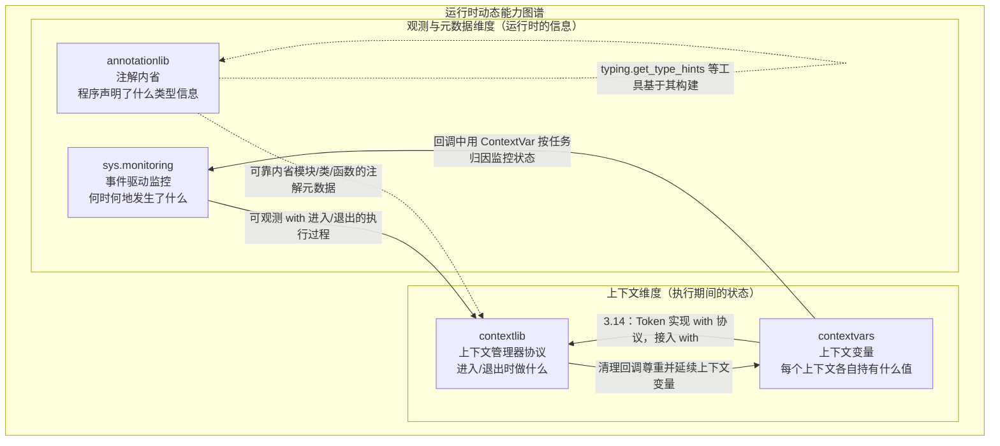

# Python 3.14 标准库教程 — 跨模块综合分析

> 一句话摘要：`contextlib`、`contextvars`、`sys.monitoring`、`annotationlib` 分别回答"进入/退出时做什么""每个上下文持有什么值""何时何地发生了什么""程序声明了什么"四个维度的问题；它们彼此互补，共同构成 Python 运行时"动态能力"的一套底层拼图。

## 一、四个模块的定位对比

| 维度 | `contextlib` | `contextvars` | `sys.monitoring` | `annotationlib` |
|---|---|---|---|---|
| 解决的核心问题 | 资源的获取与释放、临时改变全局状态 | 并发执行单元的"上下文局部"状态隔离 | 低开销观测运行时执行事件 | 可靠内省懒惰求值的类型注解 |
| 典型使用场景 | `with` 管理文件/连接/锁、重定向输出、切换目录 | asyncio 中按任务持有请求 ID、用户身份等 | 调试器、覆盖率、性能分析器、调用统计 | 类型工具、文档生成器、前向引用处理 |
| 关键抽象 | 上下文管理器（`__enter__`/`__exit__`）、`ExitStack` 回调栈 | `ContextVar` + `Token` + `Context` 上下文栈 | 工具 ID + 事件集合 + 回调 | `Format`（VALUE/FORWARDREF/STRING）+ `ForwardRef` |
| 作用于 | 代码块的边界（进入/退出） | 每个执行单元的取值 | 代码对象的执行过程 | 模块/类/函数的声明 |
| 引入版本 | 长期存在 | 3.7（PEP 567） | 3.12（PEP 669） | 3.14（PEP 649/749） |

## 二、模块间协作关系

### 1. `contextlib` 与 `contextvars`：执行上下文 vs 状态上下文

二者都含"上下文"二字，但关注点完全不同、互为补充：

- `contextlib` 服务于 `with` 语句，即**上下文管理器协议**，解决"进入与退出时做什么"（资源的进入与退出）。
- `contextvars` 解决**并发执行上下文中的状态隔离**问题，与 `with` 语法本身无直接关系。

两点交汇：

- **清理回调尊重上下文**：官方文档在 `aclosing` 中特别指出，其保证"生成器的异步退出代码在与迭代相同的上下文中执行，这样异常和**上下文变量**将能按预期工作"——即 `contextlib` 的清理机制（含 `ExitStack`/`@contextmanager` 的回调）尊重并延续 `contextvars` 建立的上下文。
- **3.14 的新桥接**：`ContextVar.set()` 返回的 `Token` 自 3.14 起实现了上下文管理器协议，于是可以写 `with var.set(value):`，在退出时自动还原变量——把 contextvars 的状态还原能力"挂接"到了 `with` 语法上。

典型协作：在 `@contextmanager` 维护一个 `ContextVar`，让"进入时设置、退出时还原"既受 `with` 语法管理、又天然地在并发上下文里彼此隔离。

### 2. `sys.monitoring` 与 `contextvars`：异步/高并发监控中的状态归因

`sys.monitoring` 的事件与回调是"全局 / 代码对象"维度的，**本身不区分异步任务**。在 `asyncio` 场景中，多个协程任务可能在同一执行流上交错运行，同一个监控回调会在不同任务的上下文中被反复触发。

此时 `contextvars` 恰好补上"这是谁的上下文"这一环：`asyncio` 为每个任务维护独立的 context，回调被调用时可借 `ContextVar.get()` 读取当前任务专属的状态，从而把监控数据正确归因到对应逻辑流，而不是混在同一个全局计数里。

**分工**：`sys.monitoring` 负责"何时、何地触发"，`contextvars` 负责"当前属于谁的上下文"。

### 3. `annotationlib` 与运行时元数据处理

`annotationlib` 属于**定义期元数据的运行时读取**维度，与前三个模块关注"运行期行为/状态"形成一静一动之别：

- 前三个模块在程序**运行过程中**做事（清理、隔离、观测）；
- `annotationlib` 读取的是程序**声明阶段**沉淀下来的信息（类型注解），它是"静态信息在运行时的可靠入口"。

它与 `contextlib` 之类并无直接交互，而是与 `typing` 生态对接：`annotationlib.get_annotations()` 是底层、格式可控、不做类型系统加工的内省原语，`typing.get_type_hints()` 是在其上的便捷封装；`typing.ForwardRef` 自 3.14 起成为 `annotationlib.ForwardRef` 的别名。可把 `annotationlib` 理解为"程序元数据（声明了什么）"这一维度的代表，与前三个"运行期动态能力"共同拼出完整图景。

## 三、运行时动态能力图谱

下图用一张图概括四个模块在"运行时动态能力"中的定位与关系（实线为主协作关系，虚线为较弱/间接关系）：

> 图中双向边表示"互为桥接"：`contextlib` 的清理机制沿用了 `contextvars` 的上下文；`contextvars.Token`（3.14）反过来接入了 `with` 协议。

## 四、统一设计哲学归纳

四个模块虽分属不同维度，却共享同一套设计取向：

1. **轻量、低开销**：`@contextmanager` 用一个生成器替代手写类；`copy_context()` 为 O(1)；`sys.monitoring` 通过局部事件 + `DISABLE` 让开销趋近于零；`annotationlib` 的惰性求值避免导入期执行注解的开销。
2. **上下文/事件驱动，而非全局一把抓**：`contextvars` 用"当前上下文"取代进程级全局变量；`sys.monitoring` 只在显式开启的事件上触发回调（取代 `sys.settrace` 的"每一行都回调"）；`contextlib` 的 `redirect_stdout`/`chdir` 虽是全局改动的特例，但官方明确警告其不适合库代码与并发程序——这反向印证了"能用上下文就用上下文"的取向。
3. **可组合、可分层**：`ExitStack` 组合任意数量清理动作；`Token` 与 `with` 组合；`sys.monitoring` 用"工具 ID + 事件集合"隔离不同工具；`annotationlib` 作为 `typing` 的底层原语被上层封装。
4. **面向不同维度、彼此正交**：执行边界（contextlib）、状态归属（contextvars）、时序观测（sys.monitoring）、声明元数据（annotationlib）互不重叠，拼合起来才完整。

## 五、章节导航

- [上一章：annotationlib](05-annotationlib.md) ←
- [下一章：综合使用示例](07-usage-examples.md) →