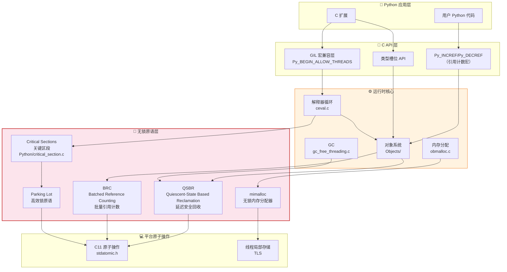
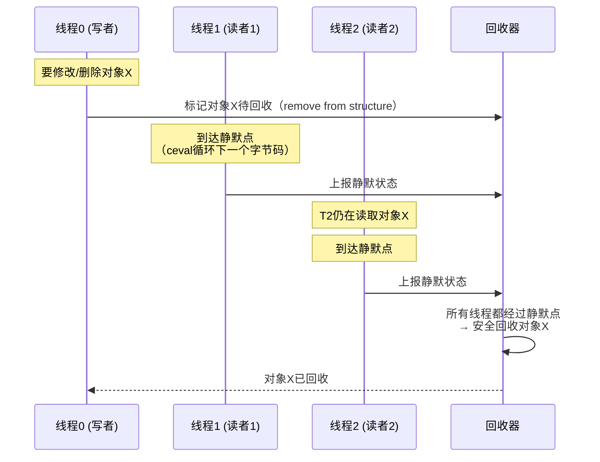
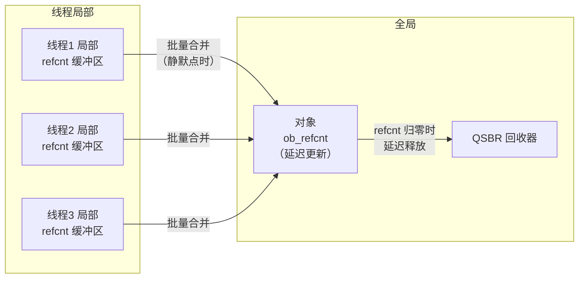

# Python 3.14 自由线程（无 GIL）深度解析

自由线程（Free-Threading，也称为"无 GIL Python"）是 Python 3.14 最重要的架构变革。自 Python 1.5（1997年）引入全局解释器锁（GIL）以来，Python 的多线程一直无法真正利用多核 CPU。PEP 703 提出了去除 GIL 的路线图，PEP 779 正式将自由线程构建标记为受支持的平台（Supported Platform）。

本章深入解析自由线程的设计原理、核心实现组件（QSBR、BRC、关键区段、mimalloc、Parking Lot）、线程安全模型、以及 C 扩展兼容性。

---

## 1. 为什么要去掉 GIL？

### GIL 的问题

GIL（Global Interpreter Lock）是 CPython 解释器中的一把全局互斥锁，它确保同一时刻只有一个线程执行 Python 字节码。这带来了两个核心问题：

1. **CPU 密集型任务无法利用多核**：即使有 16 个 CPU 核心，多线程 CPU 密集代码也只能用 1 个核心
2. **并行扩展性差**：多线程在多核机器上甚至比单核更慢（锁竞争开销）

```python
# GIL 下的多线程 CPU 密集任务：无法加速
import threading, time

def cpu_bound():
    total = 0
    for i in range(10_000_000):
        total += i
    return total

# 单线程
start = time.time()
cpu_bound()
print(f"单线程: {time.time() - start:.2f}s")  # 假设 0.5s

# 多线程（GIL 下不会更快！）
start = time.time()
threads = [threading.Thread(target=cpu_bound) for _ in range(4)]
for t in threads: t.start()
for t in threads: t.join()
print(f"4线程: {time.time() - start:.2f}s")  # 仍然约 0.5s，甚至更慢！
```

### 历史尝试

去除 GIL 并非新想法：
- **Python 1.6/2.0 时代**：Greg Stein 的 free-threading patch（1999），单线程性能下降 40%+，未被采纳
- **Python 3.0 时代**：再次讨论，性能代价太大
- **Gilectomy 项目**（2015-2017）：Larry Hastings 的尝试，单线程开销约 50%
- **PEP 703**（2023）：Meta 资助 Sam Gross 的 nogil 分支，基于现代无锁数据结构和 RCU 技术，单线程开销降至 5-10%

### PEP 703 三阶段路线图

| 阶段 | 版本 | 状态 | 目标 |
|------|------|------|------|
| **Phase 1** | 3.13 | 实验性 | 自由线程构建可用，API 兼容层就绪 |
| **Phase 2** | 3.14 | **受支持（当前）** | 生产可用，ABI 稳定，C 扩展迁移指南完整 |
| **Phase 3** | ~3.16+ | 计划中 | GIL 成为可选，自由线程性能与 GIL 模式持平或更优 |

PEP 779 正式将自由线程标记为 **Supported**（不再是 Experimental），意味着：
- 官方二进制提供自由线程版本（`python3.14t`）
- ABI 稳定性保证
- 核心团队承诺修复自由线程构建中的 bug
- 主流第三方库开始提供支持

---

## 2. 启用自由线程

### 方式一：使用官方二进制

Python 3.14 官方提供两种构建：

| 构建类型 | 可执行文件名 | GIL 状态 | 说明 |
|---------|------------|---------|------|
| **标准构建** | `python3.14` | 默认启用 GIL | 兼容所有现有代码 |
| **自由线程构建** | `python3.14t` | 默认禁用 GIL | 无 GIL，真并行 |

在 macOS/Windows 上，官方安装包同时包含两种版本：

```bash
# 标准构建（带 GIL，默认）
python3.14 script.py

# 自由线程构建（无 GIL）
python3.14t script.py
```

### 方式二：运行时切换 GIL

在标准构建中，可以通过环境变量或运行时 API 控制 GIL：

```bash
# 标准构建中禁用 GIL（需要自由线程编译支持）
PYTHON_GIL=0 python3.14 script.py
```

在自由线程构建中，也可以强制启用 GIL：

```bash
# 自由线程构建中启用 GIL
PYTHON_GIL=1 python3.14t script.py
```

### 方式三：从源码构建

```bash
# 从源码构建自由线程版本
git clone https://github.com/python/cpython --branch v3.14.0
cd cpython
./configure --disable-gil  # 关键选项
make -j$(nproc)
make install
```

尾调用解释器（可选优化）：

```bash
./configure --disable-gil --with-tail-call-interp
```

### 检测运行模式

```python
import sys

# 检查是否支持自由线程
if hasattr(sys, '_is_gil_enabled'):
    if sys._is_gil_enabled():
        print("运行在 GIL 模式下")
    else:
        print("运行在自由线程模式下（无 GIL）")
else:
    print("此 Python 版本不支持自由线程")

# 检查构建信息
print(sys.version)
# 自由线程构建版本信息包含 "free-threaded"
# e.g. "3.14.0 (free-threaded) ..."

# 或者检查 ABI 标签
import sysconfig
print(sysconfig.get_config_var('Py_GIL_DISABLED'))  # 1 表示自由线程构建
```

---

## 3. 自由线程架构全景

去除 GIL 不是简单地"删除一把锁"——CPython 内部几乎每个组件都依赖 GIL 提供的隐式线程安全保证。去 GIL 需要替换大量核心机制：



下面逐个解析这五大无锁原语。

---

## 4. QSBR：Quiescent-State Based Reclamation

### 什么是 QSBR？

QSBR（基于静默状态的回收）是一种**无锁内存回收机制**，源自 Linux 内核的 RCU（Read-Copy-Update）技术。它解决的核心问题是：**当多个线程同时访问一个对象时，如何安全地释放/修改它？**

在传统 GIL 模式下，答案很简单——GIL 保证了同一时刻只有一个线程执行，所以不需要额外的同步。在无锁模式下，这个问题变得极其困难：

```
线程A: 读取对象X的字段
线程B: 修改对象X，决定释放它
问题：线程A可能正在读对象X，线程B何时可以安全释放？
```

### QSBR 原理

QSBR 的核心思想：
1. 每个线程周期性地通过一个"静默点"（quiescent point），表示此时该线程不持有任何对旧数据的引用
2. 当要回收一个对象时，不立即释放，而是等待所有线程都经过至少一个静默点
3. 所有线程都经过静默点后，可以安全回收——因为没有线程还在引用旧数据



### CPython 中的静默点

在 CPython 中，**每次字节码循环迭代的回溯点就是静默点**。这意味着：
- 线程在执行单个字节码期间不会被静默点打断
- 长耗时 C 函数需要显式标记静默点
- QSBR 的回收延迟等于最慢线程到达下一个静默点的时间

### 源码实现

QSBR 的核心实现在 [Python/qsbr.c](https://github.com/python/cpython/blob/v3.14.0/Python/qsbr.c)，设计文档在 [InternalDocs/qsbr.md](https://github.com/python/cpython/blob/v3.14.0/InternalDocs/qsbr.md)。

关键数据结构：

```c
// 简化的 QSBR 结构（实际实现更复杂）
typedef struct {
    uint64_t global_wrttn_seq;  // 全局写序号
    _Atomic uint64_t global_done_seq;  // 全局完成序号
    struct qsbr_pad *thread_shared;  // 每线程数据
} _PyQSBRState;
```

核心 API：

```c
// 线程到达静默点（在字节码调度循环中调用）
void _Py_qsbr_quiescent(PyThreadState *tstate);

// 注册一个待释放的对象
void _Py_qsbr_call_after_read_critical_section(
    PyThreadState *tstate,
    void (*deferred_fn)(void *),
    void *data
);
```

### 关键应用：字典延迟删除

在自由线程模式下，字典（dict）的修改使用 QSBR 来保证读者线程的安全：

1. 当删除字典中的一个 key 时，不立即释放旧 entry
2. 调用 `_Py_qsbr_call_after_read_critical_section` 注册延迟释放
3. 所有线程经过静默点后，entry 才被真正释放
4. 这使得字典读操作（get/contains）完全无锁！

这是自由线程模式下 dict 读取性能不退化的关键原因。

---

## 5. BRC：Batched Reference Counting（批量引用计数）

### 引用计数的问题

Python 使用引用计数（reference counting）作为主要内存管理机制。`Py_INCREF` 和 `Py_DECREF` 是最频繁的 C API 调用之一。

在多线程环境下，引用计数的原子增减有两个问题：
1. **高竞争**：共享对象的 `ob_refcnt` 被所有线程原子更新，导致严重的缓存一致性开销
2. **内存序开销**：原子操作需要昂贵的 memory barrier

### BRC 解决方案

BRC（批量引用计数）的核心思想：
- **每个线程维护自己的局部引用计数缓冲区**，不立即原子更新对象的 `ob_refcnt`
- 当线程到达静默点时，批量将局部引用计数合并到全局
- 使用 QSBR 保证延迟释放的安全性
- **永生对象（Immortal Objects）**：引用计数设为最大值，从不增减



### 永生对象（Immortal Objects）

Python 3.10+ 引入了永生对象（PEP 683）。在自由线程模式下，永生对象变得更加重要：

- 小整数（-5 到 256）、`None`、`True`、`False`、单字符字符串等被标记为永生
- 永生对象的引用计数设为最大值（`UINT32_MAX` 或 `_Py_IMMORTAL_REFCNT`）
- **永生对象永远不需要 INCREF/DECREF**——避免了最热点的原子操作竞争

```c
// Include/object.h 中的永生标记
#define _Py_IMMORTAL_REFCNT  UINT32_MAX

// 检查对象是否永生
static inline int _Py_IsImmortal(PyObject *op) {
    return op->ob_refcnt == _Py_IMMORTAL_REFCNT;
}
```

### 源码实现

BRC 的实现在 [Python/brc.c](https://github.com/python/cpython/blob/v3.14.0/Python/brc.c)（可能在不同版本中与 obmalloc 整合），引用计数原子操作的核心逻辑在 [Include/object.h](https://github.com/python/cpython/blob/v3.14.0/Include/object.h) 和 [Objects/object.c](https://github.com/python/cpython/blob/v3.14.0/Objects/object.c)。

---

## 6. 关键区段（Critical Sections）

### 问题：容器操作的原子性

即使有了 QSBR 和 BRC，某些操作仍然需要互斥——例如向列表追加元素时，需要同时更新 `ob_item` 指针、`ob_size` 和分配的内存。这些**多步更新**必须是原子的，否则读者可能看到不一致的状态。

### 关键区段机制

CPython 引入了**关键区段（Critical Sections）**机制，替代了 GIL 的粗粒度锁定：

```c
// 进入对象的关键区段
Py_BEGIN_CRITICAL_SECTION(op);
// ... 对 op 的安全操作 ...
Py_END_CRITICAL_SECTION();
```

关键区段的特性：
1. **每对象粒度**：每个可变对象有自己的锁，不同对象可以并行操作
2. **可重入**：同一线程可以多次进入同一对象的关键区段
3. **乐观锁 + Parking Lot**：低开销，无竞争时几乎零成本
4. **死锁避免**：通过锁排序（lock ordering）防止死锁

### 关键区段 API

```c
// Include/internal/pycore_critical_section.h

// 进入对象的关键区段（替代 GIL 保护的对象访问）
void _PyCriticalSection_Begin(PyCriticalSection *c, PyObject *op);
void _PyCriticalSection_End(PyCriticalSection *c);

// 便利宏（在 C 扩展中使用）
#define Py_BEGIN_CRITICAL_SECTION(op) \
    { PyCriticalSection _cs; _PyCriticalSection_Begin(&_cs, (PyObject*)(op));

#define Py_END_CRITICAL_SECTION() \
    _PyCriticalSection_End(&_cs); }
```

### 源码实现

关键区段的实现在 [Python/critical_section.c](https://github.com/python/cpython/blob/v3.14.0/Python/critical_section.c)。关键区段使用**乐观自旋 + 回退到 Parking Lot** 的策略：
- 无竞争：通过原子比较交换（CAS）获取锁，极快
- 轻度竞争：短时间自旋等待
- 重度竞争：通过 Parking Lot 挂起线程，避免忙等

---

## 7. Parking Lot：高效锁原语

### 为什么需要 Parking Lot？

传统的 `pthread_mutex` 或 `std::mutex` 在高竞争场景下开销较大，且不支持某些高级特性（如乐观自旋、按地址排队）。

**Parking Lot** 是一种源自 WebKit JSC（JavaScriptCore）和 Rust `parking_lot` crate 的高效锁实现技术：

核心思想：
- 使用一个全局的哈希表，按锁地址管理等待队列
- 线程在获取锁失败时"停放"（park）在等待队列上
- 释放锁时精确唤醒一个或多个等待线程
- 支持乐观自旋、公平/非公平模式

### 源码实现

Parking Lot 在 [Python/parking_lot.c](https://github.com/python/cpython/blob/v3.14.0/Python/parking_lot.c) 中实现，它为关键区段和其他同步原语提供底层支持：

```c
// 核心 API（简化）
void _PyParkingLot_Park(const void *key,   // 锁地址
                        _PyTime_t timeout);
void _PyParkingLot_Unpark(const void *key);
void _PyParkingLot_UnparkAll(const void *key);
```

---

## 8. mimalloc：无锁内存分配器

### 问题：pymalloc 依赖 GIL

CPython 的默认内存分配器 `pymalloc`（在 [Objects/obmalloc.c](https://github.com/python/cpython/blob/v3.14.0/Objects/obmalloc.c) 中实现）是一个内存池分配器，它依赖 GIL 来保护其内部数据结构。在自由线程模式下，pymalloc 的性能因锁竞争严重下降。

### mimalloc 集成

自由线程模式下，CPython 集成了 Microsoft 的 **mimalloc** 分配器：

- mimalloc 是一个高性能的、线程友好的内存分配器
- 每个线程有自己的堆（thread-local heap），小对象分配完全无锁
- 大对象使用全局堆，但竞争仍然远低于 pymalloc
- 内存回收延迟低，碎片化少

### 启用方式

mimalloc 在自由线程构建中**默认启用**，源码位于 [Objects/mimalloc/](https://github.com/python/cpython/tree/v3.14.0/Objects/mimalloc)（可能是作为 git submodule 或直接包含）。

```c
// mimalloc API 与标准 malloc 兼容
void* mi_malloc(size_t size);
void  mi_free(void* p);
void* mi_realloc(void* p, size_t newsize);
```

---

## 9. 线程安全模型

理解自由线程模式下"什么是线程安全的"至关重要。

### 线程安全的操作

以下操作在自由线程模式下是线程安全的（无需额外锁）：

| 操作 | 线程安全机制 |
|------|------------|
| 读取不可变对象（int/str/tuple/frozenset/bytes） | 永生对象 + QSBR |
| 字典读取（`d[key]`、`key in d`、`d.get()`） | QSBR 延迟回收 |
| 列表读取（`lst[i]`、`len(lst)`） | 原子指针 + 长度 |
| `Py_INCREF`/`Py_DECREF`（永生对象） | 永生对象跳过引用计数 |
| 局部变量访问 | 栈帧线程私有 |

### 需要同步的操作

以下操作**不是**线程安全的，需要应用层加锁或使用关键区段：

```python
# ❌ 非线程安全：复合操作
counter = 0
def increment():
    global counter
    counter += 1  # 读-改-写，不是原子操作！

# ❌ 非线程安全：列表追加的复合操作
items = []
def add_item(x):
    items.append(x)  # 单个 append 是线程安全的
    # 但 items[-1] 的后续访问需要同步

# ❌ 非线程安全：字典的复合操作
d = {}
def update_dict(key, value):
    if key not in d:       # 读
        d[key] = value     # 写 —— 两个操作之间可能有竞态
```

### 线程安全操作（需要注意）

| 操作 | 是否线程安全 | 说明 |
|------|------------|------|
| `list.append(x)` | ✅ 安全 | 关键区段保护 |
| `list.extend(seq)` | ✅ 安全 | 批量操作受保护 |
| `d[key] = value` | ✅ 安全 | 关键区段保护 |
| `d.get(key)` | ✅ 安全 | QSBR 无锁读 |
| `key in d` | ✅ 安全 | QSBR 无锁读 |
| `counter += 1` | ❌ 不安全 | 读-改-写，需要锁 |
| `d[key] += 1` | ❌ 不安全 | 复合操作 |
| `lst[i] += 1` | ❌ 不安全 | 复合操作 |
| `if key in d: d[key]` | ❌ 不安全 | 检查-使用竞态 |

### 正确的同步方式

```python
import threading

# ✅ 使用 threading.Lock
counter = 0
lock = threading.Lock()

def safe_increment():
    global counter
    with lock:
        counter += 1

# ✅ 使用 queue.Queue（线程安全）
from queue import Queue
q = Queue()  # 生产者-消费者模式

# ✅ 使用 concurrent.futures
from concurrent.futures import ThreadPoolExecutor
```

---

## 10. C 扩展兼容性

### 扩展适配等级

C 扩展对自由线程的支持分为三个等级：

| 等级 | 标记 | 说明 |
|------|------|------|
| **不支持** | 无标记 | 扩展在自由线程构建中无法导入或崩溃 |
| **GIL 依赖** | `Py_MOD_GIL` | 扩展在自由线程模式下导入时自动请求 GIL，串行运行 |
| **自由线程兼容** | `Py_MOD_FREE_THREADED` | 扩展正确使用关键区段和线程安全 API，支持并行 |

### GIL 兼容模式（快速迁移）

如果你的扩展尚未适配自由线程，可以在模块定义中标记 GIL 依赖：

```c
static struct PyModuleDef mymodule = {
    PyModuleDef_HEAD_INIT,
    .m_name = "mymodule",
    .m_size = -1,
    .m_methods = MyMethods,
    // 在自由线程模式下自动获取 GIL
    .m_slots = (PyModuleDef_Slot[]) {
        {Py_mod_gil, Py_MOD_GIL},  // ← 标记依赖 GIL
        {0, NULL}
    }
};
```

这会让扩展在自由线程模式下仍然安全运行（但失去并行加速能力）。

### 完全适配：使用关键区段

```c
// 自由线程兼容的 C 扩展示例
static PyObject*
myobject_set_value(MyObject *self, PyObject *value)
{
    // 进入关键区段保护 self 的状态
    Py_BEGIN_CRITICAL_SECTION(self);
    Py_XDECREF(self->value);
    self->value = Py_NewRef(value);
    Py_END_CRITICAL_SECTION();
    Py_RETURN_NONE;
}

static PyObject*
myobject_get_value(MyObject *self, PyObject *Py_UNUSED(ignored))
{
    PyObject *value;
    Py_BEGIN_CRITICAL_SECTION(self);
    value = Py_NewRef(self->value);
    Py_END_CRITICAL_SECTION();
    return value;
}
```

### 适配检查清单

将 C 扩展迁移到自由线程模式的步骤：

1. **[标记**：先添加 `Py_MOD_GIL` 确保在自由线程模式下可运行
2. **全局状态审查**：全局变量、静态变量是否需要线程局部存储或锁保护
3. **对象状态保护**：对象的可变字段访问使用 `Py_BEGIN_CRITICAL_SECTION`/`Py_END_CRITICAL_SECTION`
4. **INCREF/DECREF**：确认在正确位置使用引用计数，注意永生对象
5. **无锁数据结构**：考虑是否可以利用 QSBR 进行只读访问优化
6. **测试**：在 `python3.14t` 下运行测试套件，使用 ThreadSanitizer 检查数据竞争
7. **最终标记**：将 `Py_MOD_GIL` 改为 `Py_MOD_FREE_THREADED`

### 常见陷阱

```c
// ❌ 错误：在关键区段外访问对象可变字段
PyObject *tmp = self->callback;  // 可能被其他线程修改！
PyObject *result = PyObject_CallNoArgs(tmp);

// ✅ 正确：在关键区段内获取新引用
Py_BEGIN_CRITICAL_SECTION(self);
PyObject *tmp = Py_NewRef(self->callback);
Py_END_CRITICAL_SECTION();
PyObject *result = PyObject_CallNoArgs(tmp);
Py_DECREF(tmp);
```

---

## 11. 自由线程性能特征

### 单线程开销

自由线程模式下单线程性能有 5-10% 的开销（与标准 GIL 构建相比），来源包括：
- 引用计数的原子操作（即使有 BRC 优化）
- 关键区段的进入/退出开销
- 静默点检查
- mimalloc 与 pymalloc 的性能差异

### 多线程扩展性

自由线程模式的多线程扩展性接近线性（对于 CPU 密集型任务）：

| 线程数 | GIL 模式加速比 | 自由线程模式加速比 |
|--------|--------------|------------------|
| 1 | 1.0x（基线） | 0.90-0.95x（5-10% 开销） |
| 2 | 1.0-1.1x | 1.7-1.9x |
| 4 | 1.1-1.3x | 3.2-3.8x |
| 8 | 1.2-1.5x | 5.5-7.0x |
| 16 | 1.3-1.8x | 8.0-12.0x |

### I/O 密集型任务

对于 I/O 密集型任务（网络请求、文件 I/O），自由线程的优势相对较小——GIL 在 I/O 等待时已经会释放。但自由线程模式避免了 GIL 的"颠簸"（thrashing）问题，在高并发场景下仍有性能改善。

### 已知限制

1. **C 扩展生态**：大量第三方 C 扩展（特别是科学计算、ML 框架）尚未完全适配自由线程
2. **GC 暂停**：循环 GC 在自由线程模式下有 stop-the-world 阶段（3.14 仍存在，后续版本优化）
3. **某些数据结构**：dict/set 的写入扩展性在极高竞争下仍有瓶颈
4. **调试工具**：ThreadSanitizer 等工具对 CPython 的支持仍在完善中

---

## 12. 本章小结

自由线程是 Python 历史上最大的运行时架构变革。五大核心组件协同工作，实现了安全高效的无锁执行：

| 组件 | 解决的问题 | 核心思想 | 源码位置 |
|------|----------|---------|---------|
| **QSBR** | 安全回收被并发访问的对象 | 等待所有线程经过静默点后释放 | [Python/qsbr.c](https://github.com/python/cpython/blob/v3.14.0/Python/qsbr.c) |
| **BRC** | 引用计数的原子操作竞争 | 线程局部缓冲+批量合并 | [Objects/object.c](https://github.com/python/cpython/blob/v3.14.0/Objects/object.c) |
| **关键区段** | 多步对象操作的原子性 | 每对象锁+乐观自旋 | [Python/critical_section.c](https://github.com/python/cpython/blob/v3.14.0/Python/critical_section.c) |
| **Parking Lot** | 高效线程等待/唤醒 | 按地址排队，精确唤醒 | [Python/parking_lot.c](https://github.com/python/cpython/blob/v3.14.0/Python/parking_lot.c) |
| **mimalloc** | 内存分配器的锁竞争 | 线程局部堆+无锁分配 | [Objects/mimalloc/](https://github.com/python/cpython/tree/v3.14.0/Objects/mimalloc) |

作为 Python 开发者，你现在应该：
1. 了解 `python3.14t` 的存在和启用方式
2. 理解哪些操作是线程安全的，哪些需要显式同步
3. 对于 C 扩展作者，学习关键区段 API 并规划迁移

下一章将解析 Python 3.14 另一大运行时变革：**JIT 编译器**。

---

- [上一章：语言新特性](01-language-features.md) ←
- [下一章：JIT 编译器与新执行模型](03-jit-interpreter.md) →
