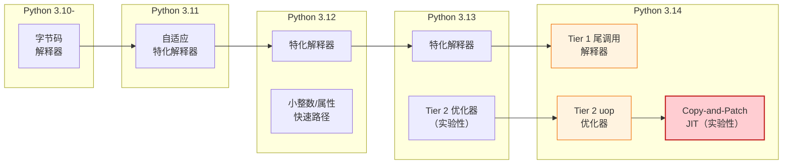
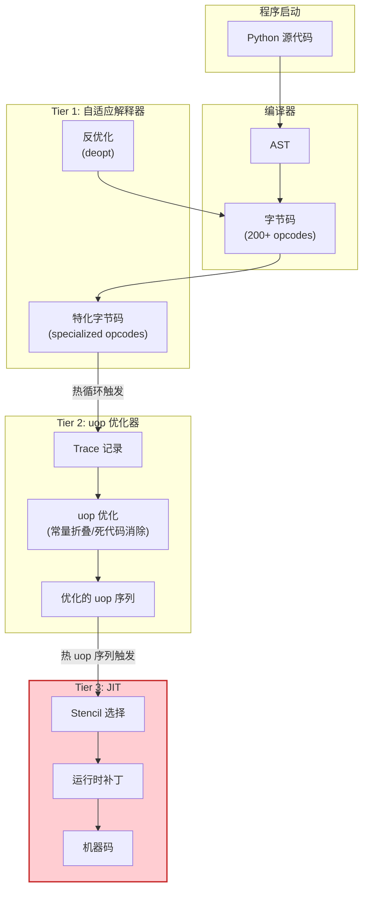
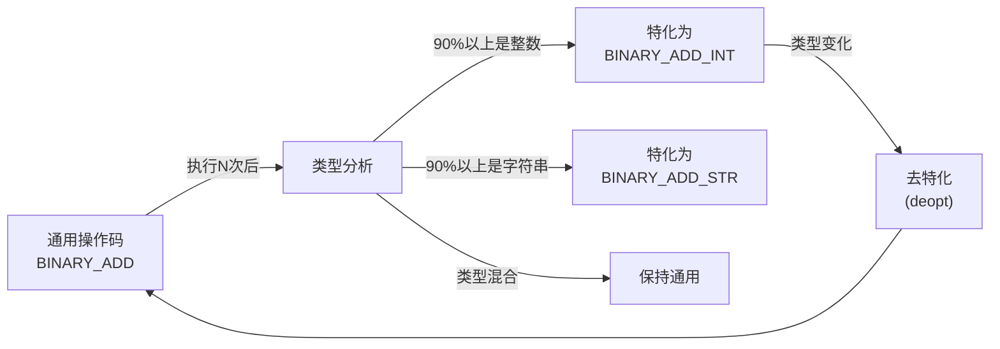
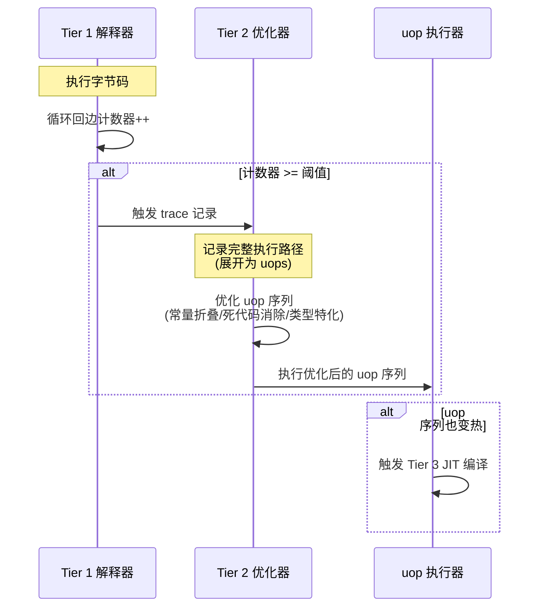
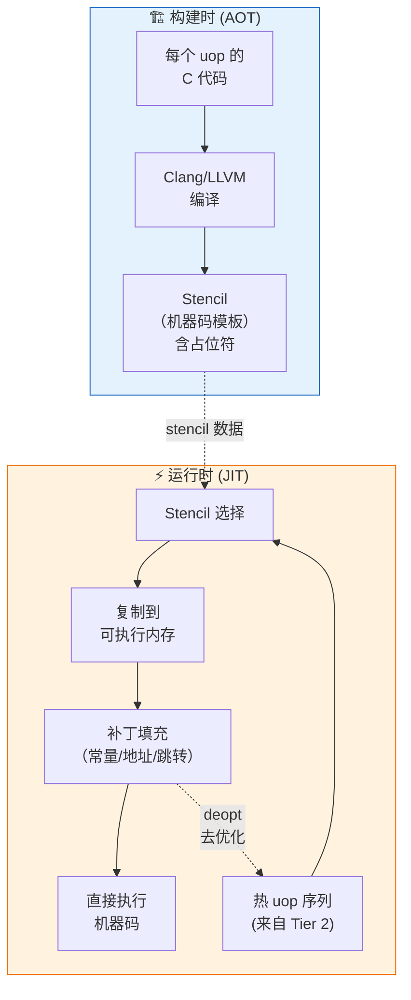
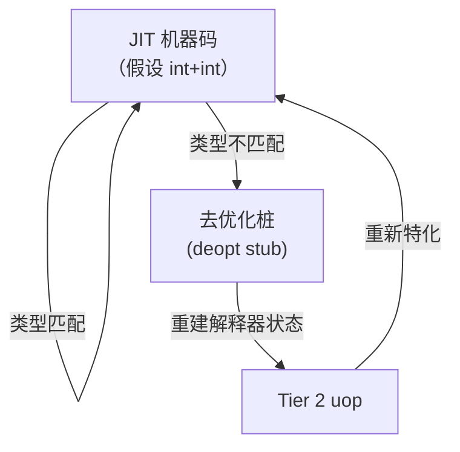

# Python 3.14 JIT 编译器与新执行模型

Python 3.14 是第一个随官方二进制分发**实验性 JIT 编译器**的 Python 版本。与自由线程移除并行限制不同，JIT 专注于提升单线程执行速度。Python 3.14 的执行模型从简单的字节码解释器演进为三层架构：**Tier 1 自适应解释器 → Tier 2 micro-op 优化器 → Copy-and-Patch JIT 编译器**。

本章从执行模型演进讲起，深入解析尾调用解释器、自适应特化、Tier 2 uop 优化器和 Copy-and-Patch JIT 的原理与实现。

---

## 1. Python 执行模型演进

### 从解释器到 JIT 的路线



### 三层执行架构

Python 3.14 的执行模型分为三个 Tier（层级）：

| 层级 | 组件 | 代码表示 | 执行方式 | 性能 |
|------|------|---------|---------|------|
| **Tier 1** | 自适应解释器 | CPython 字节码（200+ 操作码） | 尾调用/switch-case 解释 | 基线（1.0x） |
| **Tier 2** | uop 优化器 | micro-ops（1000+ 微操作） | 优化后解释执行 | 1.2-2.0x |
| **Tier 3** | JIT 编译器 | 机器码（x86-64/arm64） | 直接执行 | 1.5-5.0x |



---

## 2. 启用 JIT

### 环境变量方式

```bash
# 启用 JIT（官方 macOS/Windows 二进制包含实验性 JIT）
PYTHON_JIT=1 python3.14 your_script.py

# 标准构建（从源码编译时，需要 --enable-experimental-jit）
./configure --enable-experimental-jit
make -j$(nproc)
PYTHON_JIT=1 ./python your_script.py
```

### 运行时检测

```python
import sys

# 检查 JIT 是否可用
if hasattr(sys, '_jit_enabled'):
    print(f"JIT 已启用: {sys._jit_enabled}")
else:
    # 也可以通过环境变量检测
    import os
    jit = os.environ.get('PYTHON_JIT', '0') == '1'
    print(f"JIT 状态: {'启用' if jit else '未启用或不可用'}")

# 检查是否是自由线程构建
print(f"自由线程: {hasattr(sys, '_is_gil_enabled') and not sys._is_gil_enabled()}")
```

### 构建选项

```bash
# 完整优化构建：自由线程 + 尾调用解释器 + JIT
./configure --disable-gil --with-tail-call-interp --enable-experimental-jit
make -j$(nproc)

# 注意：JIT 编译在构建时需要 LLVM/Clang 来生成 stencil
# 如果没有 LLVM，将使用预先生成的 stencil（如果可用）
```

---

## 3. 尾调用解释器（Tail-Call Interpreter）

### 传统解释器的问题

CPython 长期以来使用 **switch-case 分派**（direct-threaded code 在 GCC/Clang 上是 computed goto）：

```c
// Python/ceval.c 的经典结构（简化）
for (;;) {
    switch (opcode) {
        case LOAD_FAST: ...; goto dispatch;
        case BINARY_ADD: ...; goto dispatch;
        // ... 200+ cases
    }
}
```

switch-case 的问题：
- 编译器难以优化跨 opcode 的代码
- 函数调用开销在 opcode 之间累积
- CPU 分支预测器在循环开关处效率不高

### 尾调用解释器原理

尾调用解释器将**每个字节码操作码实现为一个独立函数**，并使用**尾调用**（tail call）在操作码之间跳转：

```c
// 尾调用解释器的结构（概念性）
TARGET(LOAD_FAST) {
    PyObject *value = GETLOCAL(oparg);
    STACK_PUSH(value);
    DISPATCH();  // 尾调用下一个 opcode
    // 编译器将 DISPATCH() 优化为 jmp，而非 call
}
```

当编译器支持 C 语言的"必须尾调用"（musttail）属性时（Clang 支持），DISPATCH 被编译为直接跳转指令，消除了函数调用开销：

```c
// 使用 Clang 的 musttail 属性
#define DISPATCH() \
    goto *next_opcode_target;  // 或者 __attribute__((musttail)) return next_fn();
```

### 性能提升

尾调用解释器带来 **3-5% 的单线程性能提升**，主要来源于：
- 编译器可以更好地优化每个独立 opcode 函数（寄存器分配、内联）
- 更好的 CPU 分支预测
- 减少了栈帧管理开销

### 启用方式

尾调用解释器是构建时选项：

```bash
./configure --with-tail-call-interp
```

在 Python 3.14 中，尾调用解释器不是默认启用的——需要构建时显式开启。预计未来版本可能成为默认选项。

### 源码实现

- [Python/ceval.c](https://github.com/python/cpython/blob/v3.14.0/Python/ceval.c) — 主解释器循环，包含尾调用和传统两种模式
- [Python/generated_cases.c.h](https://github.com/python/cpython/blob/v3.14.0/Python/generated_cases.c.h) — 由 [Tools/cases_generator/](https://github.com/python/cpython/tree/v3.14.0/Tools/cases_generator) 自动生成的 opcode 实现

---

## 4. Tier 1：自适应特化解释器

### 什么是自适应特化？

PEP 659（Python 3.11 引入）定义了自适应特化（Adaptive Specialization）机制。核心思想：**大多数字节码操作只处理特定类型**，通用操作码浪费了大量时间在类型分发上。

例如，`BINARY_ADD` 操作码可以处理整数加法、浮点数加法、字符串拼接、列表拼接等——每次执行都要检查类型。但在实际代码中，同一个位置的加法操作通常只处理一种类型。

自适应特化的流程：



### 特化示例

```python
def add_numbers(a, b):
    return a + b  # 这个 BINARY_ADD 会被特化

# 多次整数调用后
for i in range(10000):
    add_numbers(i, i)
# add_numbers 中的 BINARY_ADD 被特化为 BINARY_ADD_INT（快速整数加法路径）

# 突然传入字符串
add_numbers("hello", "world")
# BINARY_ADD_INT 检测到类型不匹配，触发去特化（deopt），回到通用 BINARY_ADD
```

### Python 3.14 的特化改进

Python 3.14 在自适应特化方面持续改进：
- 更多操作码被特化（属性访问、函数调用、子脚本操作等）
- 更好的特化失败处理
- 特化命中率统计可通过 `sys._stats` 查看

```python
import sys
# 查看特化统计
stats = sys._stats
# stats 包含各 opcode 的特化命中率、去特化次数等信息
```

---

## 5. Tier 2：micro-op（uop）优化器

### 从字节码到微操作

CPython 字节码虽然只有 200+ 操作码，但每个操作码内部做了很多工作。例如 `LOAD_FAST_AND_CLEAR` + `BINARY_ADD` + `STORE_FAST` 这样的序列可以被分解为更细粒度的**微操作（micro-ops, uops）**。

Tier 2 优化器的工作：
1. **Trace 记录**：检测"热"循环（执行次数超过阈值），记录执行 trace（执行路径）
2. **uop 展开**：将字节码序列展开为 uop 序列
3. **优化**：常量折叠、死代码消除、类型特化融合
4. **优化执行**：执行优化后的 uop 序列

### Trace 记录触发条件

Tier 2 优化在以下条件下被触发：
- 循环回边（`JUMP_BACKWARD`）执行次数超过阈值（默认约 1000 次）
- 函数入口（`RESUME`）执行次数超过阈值
- 记录 trace 后，trace 中的 uop 序列被优化



### micro-op 示例

一个简单的 `x = a + 1` 字节码序列：

```
LOAD_FAST a        → uops: _LOAD_FAST(a)
LOAD_CONST 1       → uops: _LOAD_CONST(1)
BINARY_ADD         → uops: _CHECK_INT, _INT_ADD, _OVERFLOW_CHECK
STORE_FAST x       → uops: _STORE_FAST(x)
```

Tier 2 优化后，如果已知 `a` 是整数，`_CHECK_INT` 和 `_OVERFLOW_CHECK` 可以被消除或简化：

```
优化后 uops: _LOAD_FAST(a), _LOAD_CONST(1), _INT_ADD_UNCHECKED, _STORE_FAST(x)
```

### 源码实现

- [Python/optimizer.c](https://github.com/python/cpython/blob/v3.14.0/Python/optimizer.c) — Tier 2 优化器主逻辑
- [Python/optimizer_analysis.c](https://github.com/python/cpython/blob/v3.14.0/Python/optimizer_analysis.c) — 优化分析（常量折叠、类型推断）
- [Python/bytecodes.c](https://github.com/python/cpython/blob/v3.14.0/Python/bytecodes.c) — 字节码到 uop 的 DSL 定义
- [Python/generated_cases.c.h](https://github.com/python/cpython/blob/v3.14.0/Python/generated_cases.c.h) — 自动生成的 uop 执行代码
- [InternalDocs/tier2.md](https://github.com/python/cpython/blob/v3.14.0/InternalDocs/tier2.md) — Tier 2 设计文档

---

## 6. Tier 3：Copy-and-Patch JIT

### 为什么选择 Copy-and-Patch？

传统 JIT 编译器（如 V8 的 TurboFan、HotSpot 的 C2）非常复杂——它们包含完整的编译器基础设施（IR、寄存器分配器、指令选择器、优化 passes）。开发和维护一个生产级 JIT 编译器需要巨大的工程投入。

**Copy-and-Patch JIT**（由 Haoran Xu 和 Fredrik Kjolstad 在 2021 年提出）是一种极简但高效的 JIT 编译策略：

核心思想：
1. **构建时（AOT）**：将每个 uop 预编译为机器码"模板"（stencil），包含占位符（patch points）
2. **运行时（JIT）**：
   - 选择需要的 stencil
   - 将 stencil 复制到可执行内存
   - 在占位符处填入运行时已知的常量值（patch）
   - 直接执行

这不需要运行时编译器——只需要复制和补丁！

### Copy-and-Patch 工作流程



### Stencil 示例

假设 `_INT_ADD` uop 的 stencil（以 x86-64 汇编为例）：

```asm
; 构建时生成的 _INT_ADD stencil（概念性）
mov rax, [rbp - ARG1_OFFSET]  ; ARG1_OFFSET 是占位符
add rax, [rbp - ARG2_OFFSET]  ; ARG2_OFFSET 是占位符
jo  OVERFLOW_LABEL             ; OVERFLOW_LABEL 是占位符
mov [rbp - RES_OFFSET], rax   ; RES_OFFSET 是占位符
jmp NEXT_UOP                   ; NEXT_UOP 是占位符
```

运行时，这些占位符被填入实际的栈偏移量和跳转地址：

```asm
; JIT 编译后（运行时补丁）
mov rax, [rbp - 16]   ; 实际的局部变量位置
add rax, [rbp - 24]
jo  deopt_stub        ; 溢出时跳回去优化
mov [rbp - 8], rax
jmp next_uop_addr     ; 直接跳转到下一个 uop
```

### 性能特征

Copy-and-Patch JIT 的性能特征：
- **编译速度极快**：复制+补丁几乎不需要编译时间（微秒级），比传统 JIT 快 100 倍以上
- **代码质量良好**：因为 stencil 是由 LLVM -O2 预编译的，生成的机器码质量接近静态编译
- **内存占用低**：不需要编译器基础设施
- **启动开销小**：JIT 编译几乎没有停顿

典型加速比（相对于 Tier 1 解释器）：
- 微基准测试：2-5x
- 实际应用：10-30%（因为大部分时间在 C 扩展中）
- 纯 Python 循环密集型代码：最高可达 3-5x

### 去优化（Deoptimization）

JIT 编译的代码做出了类型假设（如"这里总是整数"）。当假设不成立时（突然传入字符串），需要**去优化**（deoptimize）回到 Tier 2 或 Tier 1 重新执行：



### JIT 限制

Python 3.14 的 JIT 有以下限制（实验性阶段）：
1. **仅支持 x86-64 和 arm64** 架构
2. **macOS/Windows 官方二进制包含** JIT；Linux 可能需要从源码构建
3. **不支持所有操作码**：复杂操作码（如函数调用、某些方法调用）仍回退到解释器
4. **内存开销**：JIT 代码需要可执行内存，大量 JIT 编译会增加内存使用
5. **调试困难**：JIT 编译的代码没有 Python 级别的堆栈信息
6. **不支持自由线程构建的某些组合**

### 源码实现

- [Python/jit.c](https://github.com/python/cpython/blob/v3.14.0/Python/jit.c) — JIT 运行时核心（stencil 选择、复制、补丁、执行）
- [InternalDocs/jit.md](https://github.com/python/cpython/blob/v3.14.0/InternalDocs/jit.md) — JIT 设计文档
- [Tools/jit/](https://github.com/python/cpython/tree/v3.14.0/Tools/jit) — stencil 构建工具
- [Python/assemble.c](https://github.com/python/cpython/blob/v3.14.0/Python/assemble.c) — JIT 代码组装和重定位

---

## 7. 三层架构的协作

### 完整执行流程

```python
# 示例代码：JIT 会优化的热循环
def sum_squares(n):
    total = 0
    for i in range(n):
        total += i * i    # ← 这个循环会触发 Tier 2 和 Tier 3
    return total

result = sum_squares(1_000_000)
```

执行流程：

1. **初始执行（Tier 1）**：
   - `sum_squares` 被编译为字节码
   - Tier 1 解释器开始执行
   - 前几十次循环迭代使用通用/特化字节码

2. **自适应特化（Tier 1 内）**：
   - `BINARY_MULTIPLY` 检测到 `i * i` 总是整数 × 整数
   - 特化为 `BINARY_MULTIPLY_INT`
   - `BINARY_ADD` 检测到 `total += ...` 总是整数加法
   - 特化为 `BINARY_ADD_INT`

3. **Tier 2 触发**：
   - 循环回边（JUMP_BACKWARD）计数器达到阈值
   - Tier 2 记录 trace，将字节码展开为 uop 序列
   - 优化器进行常量折叠、类型传播、死代码消除
   - 执行优化后的 uop 序列（1.5-2x 加速）

4. **Tier 3 JIT 触发**：
   - 优化后的 uop 序列执行也变热
   - JIT 选择对应的 stencil，复制到可执行内存，填充补丁
   - 直接执行机器码（2-5x 加速）

5. **去优化（如果需要）**：
   - 如果某次迭代中 `total` 变成了非整数（溢出到任意精度整数），JIT 代码的类型检查失败
   - 跳转到去优化桩，回到 Tier 2/Tier 1 重新处理

### 性能调优建议

要让 JIT 发挥最大效果：

1. **保持循环内类型一致**：JIT 基于类型假设，类型多变的代码无法有效特化
2. **避免循环内的复杂操作**：函数调用、方法分派、异常处理会打断 trace
3. **使用局部变量**：局部变量访问比全局变量/属性访问快得多（且更容易优化）
4. **使用内置类型**：list/dict/int/str 的操作有深度优化，自定义类方法调用开销较大

```python
# ✅ JIT 友好的代码
def fast_sum(lst):
    total = 0
    for item in lst:
        total += item  # 类型一致，简单操作
    return total

# ❌ JIT 难以优化的代码
def slow_sum(lst):
    total = MyNumber(0)
    for item in lst:
        total = total.add(item)  # 方法调用开销，类型多变
        if total.value > 100:
            total.reset()  # 条件分支打断 trace
    return total
```

---

## 8. 监控与调试

### 查看 JIT/优化器统计

```python
import sys

# 启用详细统计
sys._stats.enable()

# 运行你的代码
result = sum_squares(1_000_000)

# 打印统计
sys._stats.dump()
# 输出包括：
# - 各 tier 执行指令数
# - 特化成功率/失败率
# - JIT 编译次数
# - 去优化次数
# - trace 长度等
```

### 环境变量调优

```bash
# 启用 JIT
PYTHON_JIT=1

# 调整 Tier 2 触发阈值（较小值更早触发优化，可能更热）
PYTHON_TIER2_THRESHOLD=500

# 禁用 Tier 2（仅使用 Tier 1）
PYTHON_DISABLE_TIER2=1

# 详细 JIT 调试输出
PYTHON_JIT_DEBUG=1
```

---

## 9. 本章小结

Python 3.14 的执行模型是一个三层渐进优化系统：

| 层级 | 组件 | 核心技术 | 加速 | 源码位置 |
|------|------|---------|------|---------|
| **Tier 1** | 尾调用解释器 | musttail、自适应特化 | 基线 +3-5% | [Python/ceval.c](https://github.com/python/cpython/blob/v3.14.0/Python/ceval.c) |
| **Tier 2** | uop 优化器 | Trace、常量折叠、类型传播 | 1.2-2x | [Python/optimizer.c](https://github.com/python/cpython/blob/v3.14.0/Python/optimizer.c) |
| **Tier 3** | Copy-and-Patch JIT | Stencil、运行时补丁、去优化 | 1.5-5x | [Python/jit.c](https://github.com/python/cpython/blob/v3.14.0/Python/jit.c) |

关键要点：
- JIT 在 Python 3.14 中是**实验性**的，通过 `PYTHON_JIT=1` 启用
- Copy-and-Patch 是一种极简 JIT 策略——构建时预编译 stencil，运行时只做复制和补丁
- 类型稳定性是 JIT 优化效果的关键——保持循环内类型一致
- 自由线程解决并行问题，JIT 解决单线程速度问题——两者是独立的，可以同时启用

下一章将介绍 Python 3.14 的**新模块**：annotationlib、concurrent.interpreters、string.templatelib 和 compression。

---

- [上一章：自由线程（无 GIL）深度解析](/concepts/02-free-threading.md) ←
- [下一章：新模块详解](/concepts/04-new-modules.md) →
