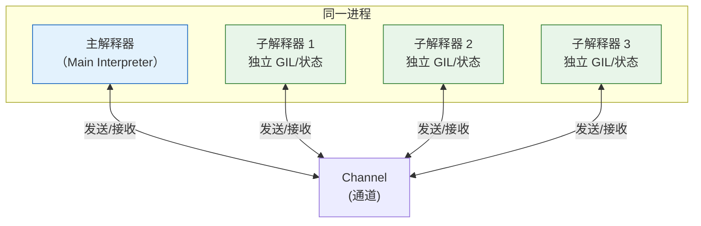

# Python 3.14 新模块详解

Python 3.14 引入了四个重要的新模块/包，分别服务于类型注解、多解释器并行、模板字符串和数据压缩。本章逐一详解每个新模块的 API、使用场景和最佳实践。

---

## 1. `annotationlib` — 注解操作库（PEP 749）

### 模块定位

`annotationlib` 是 PEP 749 的配套模块，提供对 Python 注解（annotations）的统一访问接口。它是 PEP 649（延迟注解求值）的标准库前端，解决了以往 `__annotations__` 和 `typing.get_type_hints()` 之间的行为不一致问题。

### 核心 API

#### `get_annotations()` — 获取注解

```python
import annotationlib
from annotationlib import Format

def greet(name: str, age: int | None = None) -> str:
    return f"Hello, {name}!"

# 默认格式（VALUE）：返回已求值的真实类型对象
ann = annotationlib.get_annotations(greet)
# {'name': <class 'str'>, 'age': int | None, 'return': <class 'str'>}

# STRING 格式：返回字符串（类似 PEP 563 行为）
ann_str = annotationlib.get_annotations(greet, format=Format.STRING)
# {'name': 'str', 'age': 'int | None', 'return': 'str'}

# FORWARDREF 格式：返回 ForwardRef 对象
ann_fwd = annotationlib.get_annotations(greet, format=Format.FORWARDREF)
# {'name': ForwardRef('str'), 'age': ForwardRef('int | None'), 'return': ForwardRef('str')}
```

#### `Format` 枚举

```python
class Format(enum.Enum):
    VALUE = "VALUE"          # 已求值的类型对象（默认，推荐）
    FORWARDREF = "FORWARDREF"  # ForwardRef 包装
    STRING = "STRING"        # 字符串形式
```

三种格式的使用场景：

| 格式 | 使用场景 |
|------|---------|
| `VALUE` | 运行时类型检查、序列化、依赖注入框架（最常用） |
| `FORWARDREF` | 需要延迟解析、处理前向引用、类型检查器 |
| `STRING` | 代码生成、静态分析、文档生成工具 |

#### 获取类/模块的注解

```python
class User:
    name: str
    age: int
    role: "UserRole"  # 前向引用

    def __init__(self, name: str, age: int):
        self.name = name
        self.age = age

# 获取类注解（自动解析前向引用）
ann = annotationlib.get_annotations(User)
# {'name': <class 'str'>, 'age': <class 'int'>, 'role': <class 'UserRole'>}

# 获取模块注解
# import mymodule
# ann = annotationlib.get_annotations(mymodule)

# 获取方法注解
init_ann = annotationlib.get_annotations(User.__init__)
```

#### `ForwardRef` 对象

```python
from annotationlib import ForwardRef

# 手动创建 ForwardRef
ref = ForwardRef("int | str")
# 可选：绑定到全局/局部命名空间进行求值
ref.evaluate(globals(), locals())  # 返回 int | str
```

### 与 `typing.get_type_hints()` 的关系

`typing.get_type_hints()` 在 Python 3.14 中底层调用 `annotationlib.get_annotations()`，两者关系：

| 特性 | `annotationlib.get_annotations()` | `typing.get_type_hints()` |
|------|----------------------------------|--------------------------|
| **定位** | 底层通用接口 | typing 模块便捷函数 |
| **格式控制** | 三种 Format 可选 | 仅 VALUE + include_extras |
| **前向引用解析** | 自动 | 自动 |
| **额外处理** | 无 | 处理 TypeVar、ClassVar 等 typing 特殊类型 |
| **推荐场景** | 框架作者、需要精细控制 | 普通类型提示使用 |

```python
import typing
import annotationlib

# 两者在基本场景下等效
def foo(x: int) -> str: ...

typing.get_type_hints(foo)
# {'x': <class 'int'>, 'return': <class 'str'>}

annotationlib.get_annotations(foo)
# {'x': <class 'int'>, 'return': <class 'str'>}
```

### 迁移指南

如果你的代码使用了 `from __future__ import annotations`，迁移到 `annotationlib`：

```python
# ❌ 旧方式（PEP 563，3.14 弃用）
from __future__ import annotations

def process(items: list[Item]) -> Result:
    ...

# 访问注解需要 get_type_hints
hints = typing.get_type_hints(process)

# ✅ 新方式（PEP 649，3.14 默认）
# 无需 import，直接定义
def process(items: list[Item]) -> Result:
    ...

# 直接访问（自动延迟求值）
ann = process.__annotations__  # 返回已求值类型
# 或使用 annotationlib 获得更多控制
ann = annotationlib.get_annotations(process, format=Format.VALUE)
```

### 源码位置

[Lib/annotationlib.py](https://github.com/python/cpython/blob/v3.14.0/Lib/annotationlib.py)

---

## 2. `concurrent.interpreters` — 多解释器模块（PEP 734）

### 为什么需要多解释器？

Python 长期以来提供多种并行方案，但各有局限：

| 方案 | 并行性 | 开销 | 共享状态 | 问题 |
|------|--------|------|---------|------|
| `threading` | 受 GIL 限制（或自由线程） | 低 | 共享内存 | GIL 限制（3.14前）/ 竞态条件 |
| `multiprocessing` | 真并行 | 高（进程） | 需要 IPC | 高内存开销、启动慢、pickle 限制 |
| `asyncio` | 并发（非并行） | 低 | 共享 | 无法利用多核、协程阻塞 |
| **子解释器** | **真并行** | **中等** | **隔离+通道** | **CPython 长期支持但无标准库 API** |

**子解释器（Sub-interpreters）** 是 CPython 长期存在但隐藏的功能——在同一进程内创建多个独立的 Python 解释器，每个有自己的 GIL（或在自由线程模式下无锁），可以真正并行运行。PEP 734 将其暴露为标准库 `concurrent.interpreters`。

### 核心概念



**关键特性**：
- 每个子解释器有独立的模块命名空间（`sys.modules`）
- 每个子解释器有独立的 GIL（非自由线程构建时）→ 真并行
- 对象默认**不共享**（与 multiprocessing 类似，但在同一进程内）
- 通过**通道（Channel）**进行通信（类似 Go 的 channel、CSP 模型）
- 比 multiprocessing 启动更快、内存开销更小

### 基本用法：创建和运行子解释器

```python
import concurrent.interpreters as interpreters

# 创建子解释器
interp = interpreters.create()
print(f"子解释器 ID: {interp.id}")

# 在子解释器中执行代码
interp.exec("""
import sys
print(f'Hello from sub-interpreter {sys._getinterpreter().id}!')
print(f'Python version: {sys.version}')
""")

# 执行字符串代码并传递数据
interp.exec("""
result = sum(range(100))
print(f'Sum from sub-interpreter: {result}')
""")
```

### 通道（Channel）通信

```python
import concurrent.interpreters as interpreters

# 创建通道
ch = interpreters.channel()

# 创建子解释器
interp = interpreters.create()

# 主解释器发送数据
ch.send(42)
ch.send("hello")
ch.send([1, 2, 3])

# 在子解释器中接收数据
interp.exec(f"""
import concurrent.interpreters as interpreters
ch = interpreters.channel({ch.id})

# 接收数据
while True:
    try:
        data = ch.recv(timeout=1.0)
        print(f'Sub-interpreter received: {{data}}')
    except interpreters.ChannelEmpty:
        break
""")

# 关闭通道
ch.close()
```

### InterpreterPoolExecutor

类似 `concurrent.futures.ThreadPoolExecutor` 和 `ProcessPoolExecutor`，`concurrent.interpreters` 提供了 `InterpreterPoolExecutor`：

```python
from concurrent.interpreters import InterpreterPoolExecutor

def cpu_bound_task(n):
    """CPU 密集型计算——在子解释器中真并行运行"""
    total = 0
    for i in range(n):
        total += i * i
    return total

# 使用 InterpreterPoolExecutor 并行执行
with InterpreterPoolExecutor(max_workers=4) as executor:
    # 提交任务（注意：函数必须是可序列化的字符串或模块引用）
    results = list(executor.map(cpu_bound_task, [1_000_000] * 4))
    print(results)
```

> ⚠️ **注意**：与 `ProcessPoolExecutor` 类似，传递给子解释器的函数和数据需要能够跨解释器边界传递。初始阶段支持 pickle 序列化的对象，后续版本会支持更多共享机制。

### 与其他并行方案对比

```python
import time
from concurrent.futures import ThreadPoolExecutor, ProcessPoolExecutor
from concurrent.interpreters import InterpreterPoolExecutor

def fibonacci(n):
    if n <= 1:
        return n
    return fibonacci(n-1) + fibonacci(n-2)

N = 35
WORKERS = 4

def benchmark(executor_class, name):
    start = time.time()
    with executor_class(max_workers=WORKERS) as ex:
        results = list(ex.map(fibonacci, [N] * WORKERS))
    elapsed = time.time() - start
    print(f"{name}: {elapsed:.2f}s, results={results}")

# threading（GIL 限制，无法并行）
benchmark(ThreadPoolExecutor, "Thread")

# multiprocessing（真并行，高开销）
benchmark(ProcessPoolExecutor, "Process")

# interpreters（真并行，中等开销）
benchmark(InterpreterPoolExecutor, "Interpreter")
```

预期性能（4 核 CPU，fibonacci(35)）：

| 方案 | 耗时（相对） | 内存开销 | 启动延迟 |
|------|------------|---------|---------|
| Thread | 4x 单线程时间（GIL） | 极低 | 极低 |
| Process | ~1x（真并行） | 高（每个进程 ~15MB+） | 高（进程 fork/spawn） |
| Interpreter | ~1x（真并行） | 中（每个解释器 ~1-5MB） | 低（进程内创建） |

### CSP/Actor 并发模型

`concurrent.interpreters` 鼓励使用**消息传递**而非共享内存的并发风格（类似 Go 的 CSP 或 Erlang 的 Actor 模型）：

```python
import concurrent.interpreters as interpreters

def worker(interp_id, ch):
    """子解释器中的 worker 代码"""
    interp_code = f"""
import concurrent.interpreters as interpreters
ch = interpreters.channel({ch.id})

while True:
    msg = ch.recv()
    if msg == 'STOP':
        ch.send(('done', {interp_id}))
        break
    # 处理消息
    result = msg * 2
    ch.send(('result', {interp_id}, result))
"""
    return interp_code

# 创建通道和 workers
ch = interpreters.channel()
workers = [interpreters.create() for _ in range(4)]

for i, w in enumerate(workers):
    w.exec(worker(i, ch))

# 分发任务
for i in range(10):
    ch.send(i)

# 收集结果
for _ in range(10):
    result = ch.recv()
    print(f"Got: {result}")

# 停止 workers
for w in workers:
    ch.send("STOP")

ch.close()
```

### 当前限制

Python 3.14 中的多解释器仍有一些限制：
1. **对象共享有限**：默认不能直接共享 Python 对象，需要通过通道传递（支持 pickle 序列化）
2. **C 扩展兼容性**：使用 GIL 的 C 扩展需要标记 `Py_MOD_GIL`（在子解释器中自动获取 GIL）
3. **某些模块不支持**：某些有全局状态的 C 扩展模块可能在子解释器中无法正确工作
4. **解释器销毁**：子解释器的资源回收在极端情况下可能有泄漏（已知问题，持续改进中）
5. **自由线程模式**：在自由线程构建中，子解释器之间共享无锁运行时，并行模型略有不同

### 源码位置

- C 实现：[Modules/_interpretersmodule.c](https://github.com/python/cpython/blob/v3.14.0/Modules/_interpretersmodule.c)（可能因版本结构不同）
- Python 封装：[Lib/concurrent/interpreters/](https://github.com/python/cpython/tree/v3.14.0/Lib/concurrent/interpreters)

---

## 3. `string.templatelib` — 模板字符串库（PEP 750）

### 模块定位

`string.templatelib` 是 t-strings（PEP 750）配套的 Python 层模块，提供 `Template` 和 `Interpolation` 类以及自定义模板处理工具。

> 注：t-strings 的语法和基本用法已在 [01-language-features.md §4](/concepts/01-language-features.md#4-pep-750t-strings-模板字符串) 中介绍，这里聚焦于 `string.templatelib` 模块 API。

### 核心类

#### `Interpolation` — 插值段

```python
from string.templatelib import Interpolation

# Interpolation 对象表示 t-string 中的一个插值表达式
# 用户通常不直接创建，而是通过迭代 Template 对象获得
interp: Interpolation

interp.value       # 插值表达式的求值结果
interp.expr        # 表达式的源码字符串，如 "name"、"x + 1"
interp.conv        # 转换标志：'s'、'r'、'a' 或 None
interp.format_spec # 格式说明符字符串，如 ".2f" 或 None
```

#### `Template` — 模板对象

```python
from string.templatelib import Template

# t-string 语法创建 Template
name = "Python"
version = 3.14
t = t"Language: {name} v{version:.1f}"

# Template 是可迭代的
for part in t:
    if isinstance(part, str):
        print(f"静态文本: {part!r}")
    else:  # Interpolation
        print(f"插值: expr={part.expr!r}, value={part.value!r}, format={part.format_spec!r}")
# 静态文本: 'Language: '
# 插值: expr='name', value='Python', format=None
# 静态文本: ' v'
# 插值: expr='version', value=3.14, format='.1f'
# 静态文本: ''
```

#### `Template.__str__()` — 渲染为字符串

```python
t = t"Hello, {name}!"
str(t)  # "Hello, Python!" — 等价于 f-string 行为
```

### 自定义模板处理器：装饰器模式

你可以创建函数装饰器来处理 t-strings，这是"标签模板字面量"模式：

```python
from string.templatelib import Template, Interpolation
from functools import wraps

def sql_query(func):
    """SQL 查询模板处理器——自动参数化防注入"""
    @wraps(func)
    def wrapper(*args, **kwargs):
        template = func(*args, **kwargs)
        if not isinstance(template, Template):
            raise TypeError("sql_query decorated function must return a t-string")

        params = []
        parts = []
        for part in template:
            if isinstance(part, str):
                parts.append(part)
            else:
                parts.append("?")
                params.append(part.value)

        return "".join(parts), params
    return wrapper

# 使用
@sql_query
def get_user(user_id: int):
    return t"SELECT * FROM users WHERE id = {user_id}"

sql, params = get_user(42)
# sql = "SELECT * FROM users WHERE id = ?"
# params = [42]
# cursor.execute(sql, params)  ← 安全！
```

### HTML 安全模板

```python
import html
from string.templatelib import Template, Interpolation

class SafeHTML:
    def __init__(self, template: Template):
        parts = []
        for part in template:
            if isinstance(part, str):
                parts.append(part)  # 模板中的静态 HTML 不转义
            else:
                # 动态内容转义防止 XSS
                parts.append(html.escape(str(part.value)))
        self._html = "".join(parts)

    def __str__(self) -> str:
        return self._html

    def __repr__(self) -> str:
        return f"SafeHTML({self._html!r})"

# 使用
user_input = "<script>alert('xss')</script>"
page = SafeHTML(t"<div>Welcome, {user_input}</div>")
print(page)
# <div>Welcome, &lt;script&gt;alert('xss')&lt;/script&gt;</div>
```

### 国际化（i18n）模板

```python
from string.templatelib import Template

translations = {
    "Hello, ": "你好，",
    "!": "！",
}

def i18n(template: Template) -> str:
    parts = []
    for part in template:
        if isinstance(part, str):
            parts.append(translations.get(part, part))
        else:
            parts.append(str(part.value))
    return "".join(parts)

name = "世界"
print(i18n(t"Hello, {name}!"))  # "你好，世界！"
```

### 源码位置

[Lib/string/templatelib.py](https://github.com/python/cpython/blob/v3.14.0/Lib/string/templatelib.py)
C 实现：[Objects/interpolationobject.c](https://github.com/python/cpython/blob/v3.14.0/Objects/interpolationobject.c)、[Objects/stringtemplateobject.c](https://github.com/python/cpython/blob/v3.14.0/Objects/stringtemplateobject.c)

---

## 4. `compression` — 统一压缩包（PEP 784）

### 模块定位

Python 标准库中有多个压缩相关模块（`zlib`、`gzip`、`bz2`、`lzma`），但它们 API 不一致。PEP 784 引入了统一的 `compression` 包，提供一致的压缩/解压接口，并新增了 **Zstandard**（zstd）支持。

### `compression.zstd` — Zstandard 压缩

Zstandard（zstd）是 Facebook（Meta）开发的现代压缩算法，提供：
- 比 gzip 更好的压缩率（比 gzip -9 高 15-20%）
- 更快的压缩/解压速度（比 gzip 快 3-5x）
- 多种压缩级别（1-22，1 最快，22 最高压缩）

```python
import compression.zstd as zstd

# 基本压缩/解压
data = b"Hello, World! " * 1000

compressed = zstd.compress(data)
print(f"原始大小: {len(data)}, 压缩后: {len(compressed)}")
# 原始大小: 14000, 压缩后: ~50-100

original = zstd.decompress(compressed)
assert original == data

# 指定压缩级别（1-22，默认 3）
compressed_fast = zstd.compress(data, level=1)   # 最快
compressed_best = zstd.compress(data, level=22)  # 最高压缩率
```

### 流式压缩/解压

```python
import compression.zstd as zstd

# 流式压缩（适合大文件）
with open("large_file.dat", "rb") as fin:
    with zstd.open("large_file.zst", "wb") as fout:
        while chunk := fin.read(65536):
            fout.write(chunk)

# 流式解压
with zstd.open("large_file.zst", "rb") as fin:
    while chunk := fin.read(65536):
        process(chunk)
```

### 统一的压缩包 API

`compression` 包提供了统一入口，支持多种算法：

```python
import compression

# 可用算法列表
print(compression.algorithms())
# ['zstd', 'gzip', 'bz2', 'lzma']

# 使用指定算法压缩
compressed = compression.compress(data, algorithm="zstd", level=3)
original = compression.decompress(compressed, algorithm="zstd")

# 自动检测压缩格式（通过魔数）
with compression.open("data.zst", "rb") as f:
    content = f.read()  # 自动检测 zstd 格式
```

### 与其他压缩算法对比

```python
import compression.zstd as zstd
import gzip
import bz2
import lzma
import time
import os

data = os.urandom(1_000_000)  # 1MB 随机数据（不可压缩，展示真实开销）
text_data = b"Hello World! " * 100000  # 1.4MB 高度可压缩数据

def benchmark(name, compress_fn, decompress_fn, data):
    c_start = time.time()
    compressed = compress_fn(data)
    c_time = time.time() - c_start

    d_start = time.time()
    decompressed = decompress_fn(compressed)
    d_time = time.time() - d_start

    assert decompressed == data
    print(f"{name:10s} | 压缩: {c_time*1000:6.1f}ms | "
          f"解压: {d_time*1000:6.1f}ms | "
          f"大小: {len(compressed):>8d} ({len(compressed)/len(data)*100:.1f}%)")

print("=== 随机数据（低可压缩性）===")
benchmark("zstd(3)",  lambda d: zstd.compress(d, 3),  zstd.decompress, data)
benchmark("gzip(6)",  lambda d: gzip.compress(d, 6),  gzip.decompress, data)
benchmark("bz2(9)",   lambda d: bz2.compress(d, 9),   bz2.decompress, data)
benchmark("lzma(6)",  lambda d: lzma.compress(d, 6),  lzma.decompress, data)

print("\n=== 重复文本（高可压缩性）===")
benchmark("zstd(3)",  lambda d: zstd.compress(d, 3),  zstd.decompress, text_data)
benchmark("gzip(6)",  lambda d: gzip.compress(d, 6),  gzip.decompress, text_data)
```

典型结果（现代 CPU）：

| 算法 | 压缩速度 | 解压速度 | 压缩率（文本） |
|------|---------|---------|--------------|
| zstd(3) | ⚡⚡⚡ 最快 | ⚡⚡⚡ 最快 | 好 |
| gzip(6) | ⚡⚡ 快 | ⚡⚡ 快 | 中等 |
| bz2(9) | 🐢 慢 | 🐢 慢 | 较好 |
| lzma(6) | 🐌 最慢 | 🐢 慢 | 最好 |

### tarfile/zipfile/shutil 的 Zstd 支持

`compression.zstd` 的集成使得标准库的归档工具也支持 zstd：

```python
import tarfile

# 创建 .tar.zst 归档
with tarfile.open("archive.tar.zst", "w:zstd") as tar:
    tar.add("my_directory/")

# 解压 .tar.zst
with tarfile.open("archive.tar.zst", "r:zstd") as tar:
    tar.extractall("output/")
```

```python
import shutil

# shutil 也支持 zstd
shutil.make_archive("backup", "zst", "my_directory")
```

### 压缩字典（高级功能）

Zstandard 支持预训练字典，对小文件压缩率提升显著：

```python
import compression.zstd as zstd

# 训练字典（需要一组样本数据）
samples = [b"small log entry 1", b"small log entry 2", ...]
dict_data = zstd.train_dictionary(samples, dict_size=1024 * 100)  # 100KB 字典

# 使用字典压缩
cctx = zstd.ZstdCompressor(dict_data=dict_data)
compressed = cctx.compress(small_data)

# 使用字典解压
dctx = zstd.ZstdDecompressor(dict_data=dict_data)
original = dctx.decompress(compressed)
```

### 源码位置

- Python 层：[Lib/compression/](https://github.com/python/cpython/tree/v3.14.0/Lib/compression)
- C 实现：[Modules/_zstd/](https://github.com/python/cpython/tree/v3.14.0/Modules/_zstd)（基于官方 zstd 库）

---

## 5. 本章小结

| 新模块 | PEP | 解决的问题 | 核心 API |
|--------|-----|----------|---------|
| `annotationlib` | 749 | 注解访问的统一接口 | `get_annotations()`, `Format`, `ForwardRef` |
| `concurrent.interpreters` | 734 | 真并行+低开销（替代 multiprocessing） | `create()`, `channel()`, `InterpreterPoolExecutor` |
| `string.templatelib` | 750 | 安全模板字符串处理 | `Template`, `Interpolation` |
| `compression.zstd` | 784 | 现代化高速压缩 | `compress()`, `decompress()`, `open()` |

四个模块分别服务于不同场景：
- **类型系统现代化** → `annotationlib`
- **并行计算新范式** → `concurrent.interpreters`
- **安全字符串处理** → `string.templatelib`
- **数据压缩升级** → `compression.zstd`

下一章将介绍 Python 3.14 **标准库中已有模块的重大改进**。

---

- [上一章：JIT 编译器与新执行模型](/concepts/03-jit-interpreter.md) ←
- [下一章：标准库重大改进](/concepts/05-stdlib-improvements.md) →
