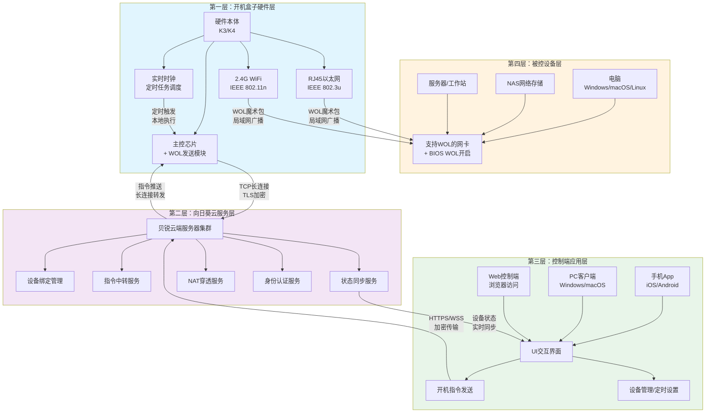

# 向日葵开机盒子产品系统性学习与深度洞察分析报告：远程办公最后一公里的硬件解决方案

> **官方产品页面**: https://sunlogin.oray.com/hardware/bootbox
> **贝锐官网**: https://sunlogin.oray.com/

---

## 📋 目录导航

- [一、报告概述与产品核心定位 🎯](#一报告概述与产品核心定位)
- [二、五大核心功能模块详解 🔧](#二五大核心功能模块详解)
- [三、技术实现解析与硬件规格 ⚙️](#三技术实现解析与硬件规格)
- [四、K3/K4版本差异与产品策略 📊](#四k3k4版本差异与产品策略)
- [五、网页设计与用户体验分析 🎨](#五网页设计与用户体验分析)
- [六、竞争优势与市场定位分析 🏆](#六竞争优势与市场定位分析)
- [七、深度洞察与行业启示 💡](#七深度洞察与行业启示)
- [八、潜在改进空间与优化建议 🚀](#八潜在改进空间与优化建议)
- [九、WOL技术背景知识 📚](#九wol技术背景知识)
- [十、相关资源链接 🔗](#十相关资源链接)

---

## 一、报告概述与产品核心定位 🎯

> **"远程开机，你的电脑尽在掌握"**
>
> —— 向日葵开机盒子官方核心口号

### 1.1 研究背景

随着远程办公模式的普及与常态化发展，用户对远程访问办公电脑、家中设备的需求持续增长。远程控制软件虽然已经解决了"远程操作电脑"的问题，但一个关键瓶颈始终存在：**当目标设备处于关机状态时，一切远程控制都无从谈起**。这就是远程办公场景中的"最后一公里"问题——远程开机。

正如官方产品页面所描述的真实痛点："假如人不在公司，又有紧急事务需要到公司电脑处理"，此时如果电脑处于关机状态，再强大的远程控制软件也无法发挥作用。传统的WOL（Wake-on-LAN）网络唤醒技术存在诸多限制：需要设备与电脑在同一局域网、需要路由器支持广播转发、公网唤醒配置复杂、跨网络场景难以实现等。向日葵开机盒子正是为解决这一痛点而设计的硬件解决方案。

### 1.2 研究目标

本报告旨在通过系统性的产品分析，实现以下学习目标：

1. **理解产品设计逻辑**：深入剖析向日葵开机盒子如何解决远程开机"最后一公里"问题，掌握硬件产品从痛点识别到方案落地的设计思路
2. **掌握技术实现原理**：理解WOL网络唤醒技术的工作机制，以及开机盒子如何通过硬件+云服务的方式突破传统WOL的局域网限制
3. **分析用户体验设计**：评估产品官网的信息架构、功能呈现方式、用户引导流程，学习ToB/ToC结合的智能硬件产品UX设计方法
4. **洞察产品策略**：通过K3/K4版本差异分析，理解硬件产品的版本分层与市场定位策略
5. **提炼可复用经验**：总结向日葵开机盒子在产品定义、技术选型、场景设计等方面的可借鉴经验

### 1.3 研究方法论

本报告采用多维度的系统性分析方法，确保研究的全面性与深度：

| 分析维度 | 研究方法 | 研究内容 |
|---|---|---|
| **页面内容分析** | 官方产品页面信息架构拆解、文案语义分析 | 产品卖点提炼、价值主张表达、信息层级设计 |
| **功能拆解** | 核心功能逐项拆解、功能间逻辑关系梳理 | 远程开机、定时开机、WiFi/有线双接入、批量开机、MAC地址开机等功能的设计目的与实现逻辑 |
| **技术原理分析** | WOL技术原理研究、硬件+云服务架构推导、网络协议分析 | 开机盒子如何实现跨网远程唤醒、WiFi与有线网络的协同机制、设备绑定与通信流程 |
| **UX设计评估** | 页面视觉层次分析、用户操作路径推演、场景化设计评估 | 官网如何降低用户理解成本、如何通过场景描述建立用户共鸣、版本对比的呈现方式 |
| **产品策略分析** | K3/K4版本对比、生态定位分析、竞争格局推演 | 版本差异化策略、在向日葵远程控制生态中的卡位逻辑、目标市场分层 |

### 1.4 报告结构概述

本报告共分为十个章节，遵循"从宏观到微观、从产品到技术、从分析到洞察"的逻辑递进结构：

- **第一章（本章）**：报告概述，明确研究背景、目标、方法论，界定产品核心定位、目标用户与应用场景
- **第二章**：五大核心功能模块详解，逐一拆解远程开机、定时开机、网络接入、批量开机、MAC地址开机的功能设计与用户价值
- **第三章**：技术实现解析与硬件规格，深入分析WOL技术原理、硬件架构、网络通信机制，并解读产品参数含义
- **第四章**：K3/K4版本差异与产品策略，对比局域网版与独享版的功能差异，分析版本分层背后的商业逻辑
- **第五章**：网页设计与用户体验分析，从信息架构、视觉设计、文案策略、交互逻辑四个维度评估官网UX设计
- **第六章**：竞争优势与市场定位分析，分析开机盒子相较于纯软件方案、传统WOL方案的差异化优势
- **第七章**：深度洞察与行业启示，提炼产品设计的底层逻辑，总结智能硬件产品的成功要素
- **第八章**：潜在改进空间与优化建议，基于分析结果提出产品功能、体验、策略层面的建设性意见
- **第九章**：WOL技术背景知识，系统梳理网络唤醒技术的历史、原理、限制与发展
- **第十章**：相关资源链接，整理官方文档、技术资料等参考资源

### 1.5 产品核心定位

向日葵开机盒子是贝锐科技（Oray）旗下向日葵远程控制生态中的**智能硬件产品**，其核心定位是：**解决远程办公"最后一公里"问题的远程开机硬件解决方案**。

在向日葵完整的远程控制生态中，开机盒子承担着"入口激活"的关键角色——向日葵远程控制软件负责"开机后"的远程操作，而开机盒子负责"开机前"的设备唤醒。二者形成软硬件协同的完整闭环：

```
向日葵开机盒子（硬件） → 远程唤醒设备 → 向日葵远程控制（软件） → 远程操作设备
```

根据官方产品页面介绍，开机盒子的核心价值主张是："通过向日葵控制端，随时随地远程开启电脑"，配合"远程开关电脑 | WiFi联网"的产品特性，实现了从"只能远程控制已开机设备"到"随时随地开启任何设备"的能力跃迁。产品形态为70mm×70mm×18mm的小型硬件设备，支持2.4G WiFi和RJ45有线网络双接入，能够适配不同的网络环境。

### 1.6 目标用户画像

向日葵开机盒子的目标用户覆盖个人用户与企业用户两大群体，具体可细分为四类核心用户画像：

| 用户类型 | 核心特征 | 核心痛点 | 产品价值 |
|---|---|---|---|
| **个人远程办公者** | 经常需要在家/外出时访问公司电脑，或在公司访问家中电脑 | 临时需要远程办公时，公司/家里电脑处于关机状态，无法远程连接；突发紧急工作无法及时处理 | 随时随地远程开启办公电脑，配合向日葵远程控制实现完整的远程办公能力，解决突发工作需求 |
| **中小企业IT管理员** | 负责管理公司数十台至数百台电脑设备，需要进行日常运维、系统更新、故障排查 | 下班后或节假日需要运维操作时，必须跑到公司手动开机；逐台开机效率低下；无法实现自动化运维 | 批量远程开机能力，配合定时开机功能实现自动化运维任务，无需现场操作，大幅提升IT运维效率 |
| **NAS用户** | 拥有家庭/小型办公NAS（网络附加存储）设备，需要远程访问存储数据 | NAS长时间开机耗电且影响硬盘寿命，但关机后无法远程访问存储内容；传统WOL配置复杂且跨网不可用 | 支持MAC地址绑定，只要设备支持WOL即可远程唤醒，包括NAS设备，实现"按需开机"兼顾节能与可用性 |
| **运维人员** | 负责服务器、工作站等设备的运维管理，需要7×24小时响应运维需求 | 夜间/节假日设备故障关机需要紧急处理时，必须赶赴机房；批量设备管理操作繁琐 | 远程批量开机+定时任务，支持跨网络操作，缩短应急响应时间，降低运维人力成本 |

### 1.7 核心应用场景

基于目标用户的真实需求，向日葵开机盒子主要服务于四大核心应用场景：

**场景一：紧急远程办公**

这是产品最核心的入门场景，正如官方页面所描述："假如人不在公司，又有紧急事务需要到公司电脑处理，可通过开机盒子远程开启公司电脑，再配合软件远程控制电脑，方便远程工作"。典型情境包括：下班后临时需要处理工作文件、周末客户紧急需求需要调取办公资料、出差在外需要访问公司内网系统等。在这些场景下，用户不需要专程跑到公司，只需通过手机上的向日葵控制端，即可远程开启公司电脑并完成工作。

**场景二：定时运维任务**

针对IT运维人员和企业管理员，开机盒子提供"个性化设置，按实际需求设置开启电脑"的定时开机功能。典型应用包括：设置工作日早上8点自动开启所有办公电脑，员工到岗即可使用；设置凌晨2点自动开启服务器进行系统更新、数据备份、病毒扫描等运维任务，完成后自动关机；周末定时开机运行自动化测试脚本等。定时开机功能让运维工作从"人工触发"升级为"自动化调度"。

**场景三：NAS远程唤醒**

对于NAS用户群体，开机盒子支持"输入设备的MAC地址即可绑定电脑、NAS，只要支持WOL远程唤醒就可以开机"。NAS设备通常用于存储照片、视频、文档等重要数据，长时间持续开机不仅浪费电力，还会增加硬盘损耗、缩短设备寿命。通过开机盒子，用户可以在需要访问NAS数据时远程唤醒，使用完毕后再远程关机，实现"按需访问"，在数据可用性与能耗、设备寿命之间取得平衡。

**场景四：批量设备管理**

针对企业级用户，开机盒子提供"批量选择已绑定的主机，一键实现全部开机"的批量开机能力。对于拥有数十台甚至上百台电脑的中小企业IT管理员来说，逐台手动开机或逐台发送开机指令效率极低。批量开机功能让管理员可以按部门、按设备组进行批量管理，一键唤醒多台设备，大幅提升管理效率。该功能主要由K3局域网版提供，支持绑定局域网内多台设备，适配企业批量管理需求。

---

## 二、五大核心功能模块详解 🔧

### 2.1 功能概述

向日葵开机盒子围绕"远程开机"这一核心痛点，构建了由**远程开机、定时开机、双网络接入、批量开机、MAC地址开机**五大功能组成的完整功能矩阵。这五大功能并非孤立存在，而是形成了"基础能力→扩展能力→部署能力→管理能力→兼容能力"的协同体系：

| 功能模块 | 能力层级 | 核心作用 | 协同关系 |
|---|---|---|---|
| **远程开启电脑** | 基础核心能力 | 提供随时随地远程唤醒的核心功能 | 所有其他功能的基础入口，用户最常使用的功能 |
| **定时开机** | 自动化扩展能力 | 实现预约式自动开机 | 远程开机的时间维度扩展，从"手动触发"到"自动调度" |
| **WiFi接入，有线开机** | 部署适配能力 | 支持灵活的网络部署方式 | 为远程开机和定时开机提供网络连接基础保障 |
| **批量开机** | 规模化管理能力 | 支持多设备同时唤醒 | 远程开机在设备数量维度的扩展，面向企业级场景 |
| **MAC地址开机** | 生态兼容能力 | 支持任意WOL设备唤醒 | 远程开机在设备类型维度的扩展，兼容电脑、NAS、服务器等 |

五大功能形成完整闭环：双网络接入提供可靠的网络连接基础，远程开机提供随时随地的手动控制能力，定时开机提供自动化调度能力，批量开机面向企业级规模化管理，MAC地址开机则扩展了设备兼容性。通过这五大功能的协同配合，开机盒子能够覆盖从个人用户到企业用户、从临时应急到日常运维、从单台电脑到多设备管理的全场景远程开机需求。

> **"随时随地远程开启公司电脑"**
>
> —— 向日葵开机盒子核心功能描述

### 2.2 功能一：远程开启电脑

#### 功能描述

远程开启电脑是向日葵开机盒子最核心的基础功能，它突破了传统WOL技术的局域网限制，让用户能够**随时随地远程开启公司/家里电脑**。无论用户身处何地，只要能够访问互联网，即可通过向日葵控制端向开机盒子发送开机指令，开机盒子在接收到指令后，向目标电脑发送WOL魔术包，实现远程唤醒。

该功能解决了远程办公场景中最根本的"设备关机则无法访问"的问题，与向日葵远程控制软件形成软硬件协同的完整闭环：开机盒子负责唤醒设备，远程控制软件负责操作设备，二者配合实现"随时随地访问任何设备"的完整远程办公体验。

#### 应用场景

远程开启电脑功能主要服务于以下典型场景：

| 应用场景 | 具体情境 | 用户价值 |
|---|---|---|
| **紧急事务处理** | 下班后、周末或节假日，突然接到紧急工作需求，需要访问公司电脑中的文件、数据或系统 | 无需专程赶赴公司，通过手机即可远程开启公司电脑并处理工作，大幅缩短应急响应时间 |
| **下班后突发工作** | 下班回家后才想起需要发送某个文件、查看某封邮件、或处理未完成的工作任务 | 不用返回办公室，在家即可远程唤醒办公电脑完成工作，提升工作灵活性 |
| **出差在外访问资料** | 出差途中或在客户现场，突然需要调取公司电脑中的合同、方案、数据等资料 | 不受地理位置限制，随时访问公司内部资源，保障业务连续性 |
| **远程技术支持** | IT运维人员在家中接到员工的技术支持请求，需要远程登录员工电脑排查问题 | 即使员工电脑已关机，也能远程开机并进行技术支持，提升IT服务响应效率 |

#### 技术要点

远程开启电脑功能的实现涉及以下关键技术要点：

1. **软硬件协同闭环**：开机盒子作为硬件设备，始终连接电源和网络，保持在线状态；用户通过向日葵控制端App/软件向云端发送开机指令，云端将指令转发给对应的开机盒子，开机盒子向目标电脑发送WOL魔术包完成唤醒。整个过程形成"控制端→云服务→开机盒子→目标电脑"的完整链路。

2. **云中继穿透**：与传统WOL需要局域网内发送魔术包不同，向日葵开机盒子通过贝锐的云服务进行指令中继，突破了局域网限制，实现跨互联网的远程唤醒。

3. **设备绑定机制**：开机盒子需要与目标电脑进行绑定，记录目标电脑的MAC地址等信息，确保唤醒指令能够准确发送到指定设备。

4. **多端控制支持**：支持通过手机App（iOS/Android）、电脑客户端（Windows/macOS）、Web网页等多种控制端发送开机指令，适配不同用户的使用习惯。

### 2.3 功能二：定时开机

#### 功能描述

定时开机功能允许用户**个性化设置，按实际需求设置开启电脑**，实现预约式自动开机。用户可以在向日葵控制端为绑定的设备设置定时开机规则，指定具体的开机时间（支持按天、按周重复），开机盒子将按照预设的时间自动发送WOL魔术包唤醒目标设备，无需用户手动操作。

该功能是远程开机能力在时间维度的延伸，将"被动响应式"的手动开机升级为"主动调度式"的自动开机，让开机操作能够融入用户的日常工作流程或运维自动化体系中。

#### 应用场景

定时开机功能主要服务于自动化、计划性场景：

| 应用场景 | 具体情境 | 用户价值 |
|---|---|---|
| **定时运维** | IT管理员设置凌晨2点自动开启服务器，进行系统更新、安全补丁安装、病毒库更新、磁盘碎片整理等运维操作 | 运维任务自动执行，不影响工作时间正常业务，降低人工运维成本 |
| **定时备份** | 设置凌晨自动开机运行数据备份任务，完成后自动关机 | 确保数据定期备份，同时避免设备长时间空转耗电 |
| **上班前自动开机** | 设置工作日早上8点自动开启所有办公电脑 | 员工到岗时电脑已开机并完成系统启动，无需等待开机时间，提升工作效率 |
| **定时自动化测试** | 开发团队设置夜间自动开机运行自动化测试脚本 | 充分利用非工作时间进行测试，加快开发迭代周期 |
| **节能管理** | 配合定时关机功能，实现"工作时间开机、非工作时间关机"的节能策略 | 在保障可用性的同时降低电力消耗，符合绿色办公理念 |

#### 技术要点

定时开机功能的实现涉及以下关键技术要点：

1. **定时任务调度**：开机盒子内置实时时钟（RTC）和任务调度引擎，能够精确存储并执行用户设置的定时任务规则，即使暂时断网也能依靠本地时钟执行定时任务。

2. **WOL魔术包定时发送**：到达预设时间点时，开机盒子自动向目标设备的MAC地址发送WOL魔术包，触发设备唤醒。定时任务支持单次执行、每日重复、工作日重复、自定义周几重复等多种调度模式。

3. **任务持久化存储**：定时任务规则保存在开机盒子本地，即使设备重启或网络临时中断，任务配置也不会丢失，保障定时任务的可靠性。

4. **云端同步机制**：用户在控制端设置的定时规则会同步到云端和开机盒子本地，确保多端看到的任务状态一致，同时为本地存储提供备份。

### 2.4 功能三：WiFi接入，有线开机

#### 功能描述

网络接入是开机盒子正常工作的基础保障。向日葵开机盒子支持**自由切换2.4G WiFi和RJ45有线网络**，提供双网络接入能力。用户可以根据实际部署环境选择合适的网络连接方式：在布线方便、网络环境稳定的场景下使用有线网络连接，获得更高的可靠性和稳定性；在布线不便、需要灵活部署的场景下使用WiFi连接，无需额外布设网线。

双网络接入能力为开机盒子的部署提供了极大的灵活性，使其能够适应各种复杂的网络环境，无论是家庭、办公室还是机房，都能找到合适的部署方式。

#### 应用场景

双网络接入功能适配不同的部署环境需求：

| 应用场景 | 推荐连接方式 | 场景说明 |
|---|---|---|
| **布线不便场景** | WiFi连接 | 电脑所在位置没有预留网口，或重新布设网线影响美观、施工困难。例如：办公室工位调整后临时位置、家中书房未布网线、会议室等临时部署场景 |
| **稳定环境部署** | 有线连接 | 机房、网络机柜、固定工位等环境，有现成的网络接口，追求最高的连接稳定性和可靠性。有线连接不受无线信号干扰，不掉线 |
| **穿墙部署** | 2.4G WiFi连接 | 开机盒子需要放置在与路由器不同房间的位置，2.4G WiFi相比5G WiFi具有更强的穿墙能力和更远的传输距离 |
| **双网络冗余** | WiFi+有线同时配置 | 关键业务场景下同时配置两种网络，有线网络为主、WiFi为备份，当有线网络故障时自动切换到WiFi，提升可靠性 |
| **快速部署试用** | WiFi连接 | 新用户首次使用时，通过WiFi快速连接体验产品功能，无需调整现有布线，后续再根据需要切换为有线连接 |

#### 技术要点

双网络接入功能的实现涉及以下关键技术要点：

1. **双网络冗余设计**：开机盒子同时配备RJ45以太网接口和2.4G WiFi无线模块，支持两种网络连接方式，用户可根据环境自由选择或同时配置。

2. **2.4G WiFi穿墙能力优化**：专门选择2.4G频段WiFi而非5G频段，因为2.4G频段频率低、波长长，具有更强的穿墙能力和更远的覆盖范围，更适合开机盒子这种需要长期稳定放置在电脑附近的IoT设备。

3. **300Mbps无线速率**：WiFi模块支持最高300Mbps的无线传输速率，对于开机盒子这种仅传输少量控制指令（WOL魔术包仅需很小的带宽）的设备来说，300Mbps完全能够满足需求且留有充足余量。

4. **网络自动切换**：当同时配置有线和无线网络时，优先使用稳定性更高的有线网络；当有线网络断开时自动切换到WiFi网络，保障设备始终在线。

5. **WiFi配网便捷性**：支持通过向日葵控制端App进行快速WiFi配网，无需复杂的路由器设置或网线连接，降低用户的部署门槛。

### 2.5 功能四：批量开机

#### 功能描述

批量开机功能允许用户**批量选择已绑定的主机，一键实现全部开机**，是面向企业级用户的规模化管理功能。IT管理员可以在控制端同时选中多台已绑定的设备，点击一次按钮即可向所有选中设备发送开机指令，开机盒子将依次向这些设备发送WOL魔术包完成批量唤醒。

该功能是远程开机能力在设备数量维度的扩展，从单台设备的手动开机升级为多台设备的批量管理，大幅提升了多设备场景下的管理效率。

#### 应用场景

批量开机功能主要服务于需要管理多台设备的场景：

| 应用场景 | 具体情境 | 用户价值 |
|---|---|---|
| **机房运维** | 机房有数十台服务器/工作站，节假日后或停电恢复后需要批量开启设备 | 无需逐台手动开机或逐一点击发送指令，一键完成批量开机，大幅缩短机房设备恢复时间 |
| **教室/网吧管理** | 学校计算机教室、网吧等场所，上课前/营业前需要批量开启所有电脑 | 管理员可提前设置定时开机或手动一键开机，所有设备同时启动，学生/顾客到店即可使用 |
| **企业多设备管理** | 中小企业IT管理员需要管理全公司几十上百台办公电脑 | 按部门、按楼层分组管理，需要时一键开启对应分组的所有设备，提升IT管理效率 |
| **实验室设备管理** | 高校或企业实验室有大量实验设备，需要批量开启进行实验 | 快速准备实验环境，无需等待逐台开机，提升实验室使用效率 |
| **晨会前准备** | 公司晨会前需要开启会议室电脑、投影设备、大屏等 | 一键开启会议室所有相关设备，做好会议准备 |

#### 技术要点

批量开机功能的实现涉及以下关键技术要点：

1. **K3局域网版专属功能**：批量开机功能是K3局域网版的特色功能，面向局域网内多设备管理场景设计，K4独享版面向个人用户单台设备场景，不包含批量开机功能，体现了版本分层的产品策略。

2. **多设备MAC地址管理**：开机盒子支持绑定局域网内多台设备的MAC地址，维护一个设备绑定列表，用户可以为每台设备设置名称、分组等标识信息，便于管理。

3. **开机指令队列发送**：当用户发起批量开机时，开机盒子并非同时向所有设备发送魔术包（可能造成网络拥塞），而是按照一定的时间间隔依次发送，确保网络稳定性和开机成功率。

4. **分组管理机制**：支持将设备按部门、区域、用途等进行分组，用户可以按组批量选择设备进行开机，无需逐一点选，进一步提升批量操作效率。

5. **开机状态反馈**：批量开机指令发送后，控制端能够显示每台设备的开机状态反馈，让管理员了解哪些设备成功唤醒、哪些设备可能存在异常。

### 2.6 功能五：MAC地址开机功能

#### 功能描述

MAC地址开机功能允许用户**输入设备的MAC地址即可绑定电脑、NAS**，只要目标设备支持WOL（Wake-on-LAN）网络唤醒标准，就可以通过开机盒子进行远程唤醒。该功能不限制设备类型，不仅支持Windows/macOS电脑，还支持NAS网络存储、服务器、工作站、甚至其他支持WOL的智能设备，极大扩展了开机盒子的兼容范围。

该功能是远程开机能力在设备类型维度的扩展，从"绑定向日葵客户端的电脑"扩展到"任何支持WOL标准的设备"，让开机盒子能够成为局域网内所有WOL设备的统一唤醒入口。

#### 应用场景

MAC地址开机功能扩展了开机盒子的设备支持范围：

| 应用场景 | 具体情境 | 用户价值 |
|---|---|---|
| **NAS唤醒** | 用户在家中或小型办公室使用NAS存储照片、视频、文档等数据，平时关机以节省电力和延长硬盘寿命，需要访问数据时远程唤醒 | 通过输入NAS的MAC地址绑定设备，需要时远程唤醒NAS，访问数据，兼顾数据可用性、节能和设备寿命 |
| **服务器唤醒** | 开发者或小企业有自架服务器，不需要24小时开机，需要时远程唤醒进行开发、测试或部署工作 | 按需唤醒服务器，降低电力消耗，同时保证随时可用 |
| **其他WOL设备唤醒** | 支持WOL的网络打印机、工控设备、智能投影、监控设备等 | 只要设备支持标准WOL协议，都可以通过开机盒子远程唤醒，成为统一的设备唤醒中心 |
| **无向日葵客户端设备** | 某些设备（如部分NAS、Linux服务器）不方便安装向日葵客户端，但支持WOL | 无需安装客户端，仅通过MAC地址即可绑定和唤醒，扩展了设备兼容范围 |
| **旧设备兼容** | 较老的电脑或设备，虽然支持WOL但无法安装最新版向日葵客户端 | 通过MAC地址绑定方式实现远程开机，保护用户现有设备投资 |

#### 技术要点

MAC地址开机功能的实现涉及以下关键技术要点：

1. **WOL魔术包原理**：WOL（Wake-on-LAN）的核心原理是向目标设备发送一个特殊的"魔术包"（Magic Packet），该数据包包含6个字节的0xFF前缀，紧接着是16次重复的目标设备MAC地址。网卡在关机状态下仍然保持供电并监听网络，当收到包含自身MAC地址的魔术包时，就会触发设备开机。

2. **设备兼容性**：只要设备网卡支持WOL标准并在BIOS/系统中开启了WOL功能，无论设备运行什么操作系统、是否安装向日葵客户端，都可以通过MAC地址绑定方式进行远程唤醒。这一设计基于标准WOL协议，保证了广泛的设备兼容性。

3. **MAC地址识别与输入**：用户需要手动获取并输入目标设备的MAC地址（通常可以在设备的网络设置、路由器管理界面或设备标签上找到），开机盒子验证MAC地址格式后将其加入设备绑定列表。

4. **局域网广播发送**：MAC地址开机的WOL魔术包以局域网广播帧的形式发送，确保能够到达同一局域网内的目标设备，这也是MAC地址开机功能要求开机盒子与目标设备在同一局域网的原因。

5. **跨VLAN限制说明**：标准WOL魔术包是二层广播帧，默认无法跨VLAN传播，因此MAC地址开机要求开机盒子与目标设备在同一广播域（同一VLAN）内，这是WOL协议本身的技术限制。

### 2.7 网络连接拓扑说明

向日葵开机盒子在实际部署中有两种典型的网络连接拓扑，分别适用于不同的环境条件和用户需求。两种拓扑都要求开机盒子与需要唤醒的目标电脑处于同一局域网内，这是WOL技术本身的特性决定的——WOL魔术包是二层广播帧，无法跨路由器/三层设备传播。

#### 拓扑一：盒子无线连路由器 + 电脑有线连路由器

这是最灵活、最常见的部署方式，适合家庭和大多数办公环境：

```
┌─────────────┐      WiFi (2.4G)       ┌─────────────┐
│  向日葵开机  │ ◄────────────────────► │   路由器    │
│    盒子     │                         │  (网关/LAN) │
└─────────────┘                         └──────┬──────┘
                                               │
                                               │ RJ45有线
                                               │
                                        ┌──────▼──────┐
                                        │ 目标电脑/NAS │
                                        │  (需开启WOL) │
                                        └─────────────┘
```

**部署要点**：
- 开机盒子通过2.4G WiFi连接到路由器，无需布设网线，放置位置灵活
- 目标电脑通过网线连接到同一路由器的LAN口，保证有线网络的稳定性
- 开机盒子和目标电脑处于同一局域网（同一路由器下），WOL广播包能够正常到达
- 适用于：开机盒子放置位置不方便布网线、需要灵活摆放、临时部署试用等场景

#### 拓扑二：盒子有线连路由器 + 电脑有线连路由器

这是稳定性最高的部署方式，适合机房、企业固定工位等追求可靠性的场景：

```
┌─────────────┐      RJ45有线          ┌─────────────┐
│  向日葵开机  │ ◄────────────────────► │   路由器    │
│    盒子     │                         │  (网关/LAN) │
└─────────────┘                         └──────┬──────┘
                                               │
                                               │ RJ45有线
                                               ├──────────────────┐
                                               │                  │
                                        ┌──────▼──────┐    ┌──────▼──────┐
                                        │ 目标电脑 1  │    │ 目标电脑 2  │
                                        │  (需开启WOL) │    │  (需开启WOL) │
                                        └─────────────┘    └─────────────┘
```

**部署要点**：
- 开机盒子通过RJ45网线直接连接到路由器的LAN口，有线连接稳定可靠，不受无线信号干扰
- 所有目标电脑也通过网线连接到同一路由器/交换机下
- 开机盒子和所有目标电脑处于同一局域网，支持批量开机功能同时唤醒多台设备
- 适用于：机房运维、企业IT管理、追求最高稳定性的场景、K3局域网版批量管理多台设备场景

**拓扑选择建议**：

| 选择维度 | 拓扑一（无线+有线） | 拓扑二（有线+有线） |
|---|---|---|
| **部署便捷性** | 高，无需为盒子布网线 | 中，需要为盒子布设网线 |
| **连接稳定性** | 较好，WiFi可能受干扰 | 高，有线连接稳定可靠 |
| **部署位置灵活性** | 高，盒子可在WiFi覆盖范围内任意放置 | 中，盒子需要靠近网口 |
| **适用场景** | 家庭、临时部署、布线不便场景 | 机房、企业固定部署、批量管理场景 |
| **推荐版本** | K4独享版（个人用户） | K3局域网版（企业/批量管理） |

无论采用哪种拓扑，都需要确保：
1. 开机盒子始终连接电源，保持供电状态
2. 目标电脑已经在BIOS/网卡设置中开启了WOL功能
3. 开机盒子与目标电脑处于同一子网/广播域
4. 路由器正常连接互联网，以便接收云端下发的开机指令

---

## 三、技术实现解析与硬件规格 ⚙️

### 3.1 章节引言

向日葵开机盒子能够突破传统WOL技术的限制，实现跨互联网的远程开机，其核心在于构建了一套**"WOL技术+云中继+硬件"**的三层技术架构。这一架构并非简单的技术叠加，而是通过硬件设备作为局域网内的"唤醒执行者"，云服务作为跨网络的"指令中转站"，标准WOL协议作为设备唤醒的"通用语言"，三者协同解决了远程开机场景中的关键痛点。

传统纯软件WOL方案面临的核心矛盾是：**WOL魔术包是二层广播帧，只能在同一局域网内传播，无法直接穿越路由器和互联网**。开机盒子通过"硬件驻留局域网+云端指令中继"的设计巧妙化解了这一矛盾——硬件始终在线并位于目标设备所在局域网，负责接收云端指令并在局域网内发送WOL魔术包；云服务则负责连接全球各地的控制端与局域网内的开机盒子，实现指令的跨网传输。本章将从WOL技术原理、网络协议栈、硬件规格、软硬协同架构四个维度，深入解析开机盒子的技术实现。

> **技术架构核心设计思想**：用硬件解决"最后一跳"的局域网广播问题，用云服务解决"第一跳"的跨网指令传输问题，用标准协议解决设备兼容性问题。

### 3.2 WOL（Wake-on-LAN）技术原理深度解析

#### 3.2.1 WOL技术历史背景

Wake-on-LAN（WOL，网络唤醒）技术并非新兴技术，其历史可追溯至20世纪90年代。1996年，IBM与Intel联合提出了Wired for Management（WfM）规范，WOL作为其中的关键组成部分首次被标准化。该技术设计的初衷是为了方便IT管理员远程管理办公电脑——管理员无需逐台手动开机，即可在下班后远程唤醒电脑进行软件更新、系统维护等操作。

WOL技术诞生二十余年来，其核心协议基本保持稳定，并未发生重大变化。这一方面说明WOL技术设计的简洁性与有效性——仅仅通过一个特殊格式的网络帧即可实现设备唤醒；另一方面也反映了其固有的技术局限性——二层广播帧无法穿越三层网络设备，导致纯WOL只能在局域网内使用，这一限制直到智能硬件+云服务方案的出现才被真正突破。

#### 3.2.2 魔术包（Magic Packet）格式详解

WOL技术的核心是**魔术包（Magic Packet）**——一个特殊格式的以太网数据帧。网卡在关机状态下仍然保持最低限度的供电，持续监听网络上的数据帧，当收到符合特定格式的魔术包时，就会向主板发送开机信号，触发设备启动。

魔术包的格式极其简洁，总共固定为**102字节**，结构如下：

| 部分 | 长度 | 内容 | 作用 |
|---|---|---|---|
| **同步前缀（Synchronization Stream）** | 6字节 | `0xFF 0xFF 0xFF 0xFF 0xFF 0xFF` | 连续6个0xFF字节，用于网卡硬件识别这是一个WOL魔术包的开始 |
| **MAC地址重复段** | 96字节 | 目标设备MAC地址连续重复16次 | 网卡比对自身MAC地址，匹配则触发开机 |

用十六进制表示的魔术包结构如下：

```
FF FF FF FF FF FF  [6字节0xFF前缀]
XX XX XX XX XX XX  [第1次重复目标MAC]
XX XX XX XX XX XX  [第2次重复目标MAC]
XX XX XX XX XX XX  [第3次重复目标MAC]
XX XX XX XX XX XX  [第4次重复目标MAC]
XX XX XX XX XX XX  [第5次重复目标MAC]
XX XX XX XX XX XX  [第6次重复目标MAC]
XX XX XX XX XX XX  [第7次重复目标MAC]
XX XX XX XX XX XX  [第8次重复目标MAC]
XX XX XX XX XX XX  [第9次重复目标MAC]
XX XX XX XX XX XX  [第10次重复目标MAC]
XX XX XX XX XX XX  [第11次重复目标MAC]
XX XX XX XX XX XX  [第12次重复目标MAC]
XX XX XX XX XX XX  [第13次重复目标MAC]
XX XX XX XX XX XX  [第14次重复目标MAC]
XX XX XX XX XX XX  [第15次重复目标MAC]
XX XX XX XX XX XX  [第16次重复目标MAC]

总长度：6 + 6×16 = 102字节
```

**魔术包设计要点解析**：

1. **简单可靠的硬件识别**：6字节0xFF前缀是一个非常明显的特征，网卡硬件无需复杂的协议解析即可快速识别这可能是一个WOL魔术包，降低了网卡在低功耗状态下的处理复杂度
2. **16次重复的设计意图**：连续16次重复MAC地址而非单次发送，是为了对抗网络传输中的比特错误——即使某个重复段出现比特翻转，还有其他15个副本可供比对，大幅提升了识别准确率
3. **无校验和无认证**：标准WOL魔术包不包含任何校验和、密码或认证机制，这意味着同一局域网内的任何设备都可以向目标发送魔术包，这是WOL技术设计上的简洁之处，同时也是安全上需要注意的点（部分厂商实现了SecureON密码扩展）
4. **协议无关性**：魔术包可以承载在多种协议之上——通常是以太网广播帧（目标MAC为`FF:FF:FF:FF:FF:FF`），也可以通过UDP广播包（端口通常为7或9）发送，这种设计保证了WOL的兼容性

#### 3.2.3 网卡监听机制

WOL能够在关机状态下工作，核心依赖于网卡的**低功耗监听模式**和主板的**待机供电机制**：

1. **PCI/PCIe设备唤醒能力**：当电脑关机时，主板并不会完全切断所有电源，而是保留对PCI/PCIe插槽、USB接口等设备的**待机供电（Standby Power，通常为+5Vsb）**。网卡利用这部分待机电力维持最基本的工作状态。

2. **网卡低功耗模式**：支持WOL的网卡在系统关机后会进入一种特殊的低功耗模式，此时网卡的正常数据收发功能被关闭，但MAC地址过滤器仍然工作，持续监听网络上的所有数据帧。

3. **魔术包识别与唤醒信号触发**：当网卡监听到数据帧时，会在硬件层面快速检查是否符合魔术包格式（6字节0xFF前缀+16次自身MAC地址）。一旦匹配成功，网卡会通过PCIe总线向主板发送一个**唤醒信号（PME#，Power Management Event）**。

4. **主板上电启动**：主板收到PME#信号后，会触发电源按钮按下相同的上电流程，完成电脑启动。整个过程无需CPU、内存等其他部件参与，完全由网卡硬件独立完成，因此即使系统处于关机状态也能响应。

#### 3.2.4 WOL工作必要条件

WOL成功唤醒设备需要同时满足五个必要条件，缺一不可：

| 条件类别 | 具体要求 | 常见问题 | 用户操作指引 |
|---|---|---|---|
| **硬件支持** | 电脑网卡必须硬件支持WOL标准（近15年的板载网卡基本都支持） | 过于老旧的独立网卡、部分低端笔记本网卡可能不支持WOL | 查看网卡说明书或设备管理器中的网卡高级属性，确认有"唤醒模式"、"魔术包唤醒"等选项 |
| **BIOS/UEFI设置** | 需要在BIOS/UEFI中开启WOL相关选项（通常名为"Wake on LAN"、"Power On By PCI/PCIe"、"Resume by LAN"等） | 主板出厂默认可能关闭WOL功能，用户未在BIOS中开启导致无法唤醒 | 开机时按Del/F2/F10等键进入BIOS设置，找到电源管理相关选项并启用WOL |
| **操作系统设置** | 需要在操作系统的网卡设置中启用魔术包唤醒，Windows中需在设备管理器→网卡属性→高级/电源管理中开启，macOS/Linux也有对应设置 | Windows更新后可能重置网卡电源管理设置，导致WOL失效 | Windows：勾选"允许此设备唤醒计算机"，在高级选项中启用"魔术包唤醒"；macOS：系统设置→节能→"唤醒以供网络访问" |
| **电源状态** | 电脑必须连接电源（台式机）或电池电量充足（笔记本），且电源开关未切断；不能是彻底断电状态（S5软关机可以，拔掉电源线则不行） | 台式机插线板开关关闭、笔记本电池耗尽、电源线被拔掉时WOL无效 | 确保电脑处于正常关机状态（软关机，S3/S4/S5电源状态），电源保持连接 |
| **网络连通** | 目标电脑的网卡必须通过网线连接到网络（WiFi版WOL支持较少且不稳定），且与发送魔术包的设备处于同一广播域（同一局域网/同一路由器下） | 跨VLAN、跨路由器、WiFi连接可能导致WOL失败；防火墙可能拦截广播包 | 电脑优先使用有线网络连接；确保开机盒子与目标电脑在同一子网/同一路由器下；必要时关闭可能干扰广播的防火墙 |

> **重要提示**：实际使用中WOL失败的案例，90%以上是因为上述五个条件中某一个未满足，而非开机盒子本身的问题。其中最常见的原因是BIOS中未开启WOL、Windows网卡电源管理设置被重置、电脑彻底断电这三种情况。

#### 3.2.5 局域网唤醒vs广域网唤醒的差异

WOL技术的核心限制在于**纯WOL只能在局域网内工作**，这一限制是由网络协议分层设计决定的：

| 对比维度 | 局域网WOL唤醒 | 广域网远程唤醒 |
|---|---|---|
| **网络层级** | 二层（数据链路层）广播帧 | 需要三层（网络层）及以上转发 |
| **传输范围** | 同一广播域（同一路由器/交换机下），无法穿越路由器 | 需要跨越互联网、多个路由器 |
| **魔术包目标MAC** | `FF:FF:FF:FF:FF:FF`（二层广播） | 公网IP无法直接发送二层广播帧 |
| **IP地址作用** | 不需要知道IP地址，MAC地址即可 | 需要公网IP或DDNS+端口映射 |
| **配置复杂度** | 极低，同一局域网内直接发送即可 | 极高，需要配置端口映射、DDNS、广播转发、可能需要子网定向广播 |
| **网络环境限制** | 无特殊要求，同局域网即可 | 受限于NAT、运营商封锁、路由器设置、公网IP可用性等 |
| **可靠性** | 高，局域网内广播几乎100%可达 | 低，网络结构变化、NAT类型、路由器设置都可能导致失败 |
| **安全性** | 较低，局域网内任意设备可发送魔术包 | 极低，端口映射将WOL端口暴露在公网，存在安全风险 |

**为什么纯WOL无法直接广域网唤醒？**

1. **广播帧隔离**：WOL魔术包是二层以太网广播帧，目标MAC地址是`FF:FF:FF:FF:FF:FF`，路由器作为三层设备默认不转发广播帧——广播帧到了路由器LAN口就会被丢弃，无法进入互联网，也无法从WAN口进入LAN口。

2. **NAT阻隔**：家庭/办公网络普遍使用NAT（网络地址转换），内部设备使用私有IP地址（如192.168.x.x），没有独立公网IP。外部网络无法直接寻址到内部设备。

3. **定向广播被禁用**：理论上可以通过"子网定向广播"（Subnet Directed Broadcast）将包发送到目标网段的广播地址，但几乎所有路由器和运营商出于安全考虑（防止Smurf攻击等）都默认禁用了定向广播转发。

4. **端口映射也无法解决广播问题**：即使在路由器上配置端口映射将UDP 7/9端口映射到内部广播地址，很多路由器也不支持这种配置，或因ARP表老化等问题无法稳定工作。

**开机盒子如何解决这一问题？**

向日葵开机盒子并没有试图"改造"WOL协议让魔术包穿越互联网，而是采用了一种更巧妙、更可靠的架构设计：

1. **硬件驻留局域网**：开机盒子作为一个始终在线的硬件设备，部署在目标电脑所在的局域网内，与目标电脑处于同一广播域。

2. **TCP长连接云端**：开机盒子启动后，会主动通过TCP连接到向日葵云服务器，并保持一个**持久的长连接**（出站连接，无需端口映射，不受NAT限制），等待云端下发指令。

3. **云中继指令传输**：用户在控制端（手机App/PC客户端）发送开机指令时，指令先通过HTTPS/TCP发送到向日葵云服务，云服务再通过开机盒子已建立的长连接将指令推送给对应开机盒子。

4. **局域网内发送魔术包**：开机盒子收到云端指令后，在**本地局域网内**以广播方式发送标准WOL魔术包——这是WOL协议最可靠的工作场景，几乎100%成功。

整个过程中，WOL魔术包永远只在局域网内传输，跨互联网传输的是经过加密的控制指令而非魔术包本身。这一设计巧妙避开了WOL协议的固有局限，利用成熟的TCP长连接+云中继技术实现跨网指令传输，同时在局域网内使用最标准、最可靠的WOL方式唤醒设备。

### 3.3 网络协议栈分析

向日葵开机盒子在工作过程中涉及多个层级的网络协议，从物理层、数据链路层到网络层、传输层、应用层，各协议各司其职，共同保障设备联网、云端通信、WOL唤醒等功能的正常运行。

| 协议层级 | 协议名称 | 标准 | 作用说明 | 在开机盒子中的具体应用 |
|---|---|---|---|---|
| **物理层/数据链路层（无线）** | IEEE 802.11 b/g/n | WiFi标准 | 定义2.4GHz频段无线局域网的物理层和MAC层规范，实现无线通信 | 开机盒子通过2.4G WiFi连接无线路由器，实现无线上网；802.11n支持最高300Mbps速率，满足控制指令传输需求 |
| **物理层/数据链路层（有线）** | IEEE 802.3/802.3u | 以太网标准 | 定义有线以太网的物理层和MAC层规范，802.3是10Mbps以太网，802.3u是100Mbps快速以太网 | 开机盒子通过RJ45网口连接路由器/交换机，802.3u 100Mbps快速以太网提供稳定可靠的有线连接，优先用于追求稳定性的部署场景 |
| **MAC层（无线）** | CSMA/CA | 802.11 MAC协议 | 载波监听多路访问/冲突避免，无线局域网的介质访问控制协议 | WiFi通信时使用，开机盒子发送数据前先监听信道是否空闲，避免与其他WiFi设备产生冲突；通过RTS/CTS握手减少隐藏节点问题 |
| **MAC层（有线）** | CSMA/CD | 802.3 MAC协议 | 载波监听多路访问/冲突检测，有线以太网的介质访问控制协议 | 有线网络通信时使用，发送数据时同时检测冲突，发生冲突则退避重试；虽然现代交换式以太网中冲突已极少，但协议仍需兼容 |
| **传输层** | TCP | RFC 793 | 传输控制协议，提供面向连接、可靠的字节流传输服务 | 开机盒子与向日葵云服务器之间建立TCP长连接，保证开机指令可靠传输不丢失；数据重传、流量控制、拥塞控制机制保障云端通信稳定性 |
| **网络层** | IP | RFC 791（IPv4） | 网际协议，定义数据包格式和寻址规则，实现跨网络数据包路由 | 开机盒子的IP通信基础，无论WiFi还是有线连接都通过IP协议与云端通信；支持IPv4 |
| **网络层（地址分配）** | DHCP | RFC 2131 | 动态主机配置协议，自动为设备分配IP地址、子网掩码、网关、DNS等网络参数 | 开机盒子联网时自动通过DHCP从路由器获取IP地址，无需用户手动配置网络，即插即用；支持静态IP配置作为备选 |
| **网络层（控制报文）** | ICMP | RFC 792 | 互联网控制报文协议，用于在IP网络中发送控制消息（如ping、目标不可达等） | 网络诊断与状态检测，开机盒子可通过ICMP检测网关连通性；用户可ping开机盒子IP判断设备是否在线 |
| **网络层（地址转换）** | NAT | RFC 3022 | 网络地址转换，实现多个内部设备共享一个公网IP地址访问互联网 | 开机盒子位于内网NAT后面时，主动向云端发起TCP出站连接建立长连接，无需端口映射即可穿透NAT接收云端指令 |
| **应用层（宽带接入）** | PPPoE | RFC 2516 | 以太网上的点对点协议，用于ADSL/光纤等宽带接入场景的拨号认证 | 在部分直接连接光猫拨号的网络环境中支持PPPoE拨号联网；主流部署场景下由路由器完成PPPoE拨号，开机盒子通过DHCP上网 |

**协议栈协同工作流程**：

```
┌─────────────────────────────────────────────────────────────┐
│  应用层        │  私有控制协议（开机指令、状态同步）      │
├─────────────────────────────────────────────────────────────┤
│  传输层        │  TCP（可靠长连接）/ UDP（WOL广播）        │
├─────────────────────────────────────────────────────────────┤
│  网络层        │  IP / ICMP / DHCP / NAT穿越              │
├─────────────────────────────────────────────────────────────┤
│  数据链路层    │  有线：802.3/802.3u + CSMA/CD             │
│                │  无线：802.11 b/g/n + CSMA/CA             │
├─────────────────────────────────────────────────────────────┤
│  物理层        │  RJ45以太网 / 2.4G WiFi射频               │
└─────────────────────────────────────────────────────────────┘
```

从协议栈设计可以看出开机盒子的网络设计理念：**底层兼容标准以太网/WiFi保证部署兼容性，中层使用TCP/IP保证云端通信可靠性，上层通过私有协议实现业务功能**。这是典型的IoT设备网络协议栈设计，既遵循标准网络协议保证互联互通，又通过应用层私有协议保障业务安全与功能完整性。

### 3.4 硬件规格参数详解

向日葵开机盒子的硬件规格设计充分体现了IoT智能硬件的设计原则：**够用即好、稳定优先、低功耗、小体积**。以下是产品官方公布的硬件规格参数及详细解读：

| 参数类别 | 参数值 | 参数含义解释 | 对用户的实际意义 |
|---|---|---|---|
| **产品型号** | K3（局域网版）、K4（独享版） | K3/K4代表产品的两个不同版本，面向不同用户群体：K3面向企业/多设备场景，支持批量开机；K4面向个人用户单设备场景，支持WiFi配网 | 用户需根据自身使用场景选择版本：个人用户远程办公唤醒家中/公司单台电脑选K4；企业IT管理员需要批量管理多台设备选K3 |
| **电源规格** | 5V/1A（Micro USB接口） | 采用标准5V直流供电，工作电流1A，额定功率约5W；使用常见的Micro USB接口供电 | 低功耗设计，长期开机也不会消耗过多电量（一年电费约3-5元）；Micro USB接口通用性强，旧手机充电器、充电宝、电脑USB口都能供电，电源适配器损坏容易替换 |
| **工作温度** | 0°C - 40°C | 设备正常工作的环境温度范围，0°C以下或40°C以上可能出现工作异常或硬件损坏 | 适合室内办公环境使用，不能放置在室外、阳台暴晒、冷库或暖气旁等极端温度环境；机房、办公室、家庭室内环境完全满足要求 |
| **工作湿度** | 10% - 90% RH（无凝结） | 设备正常工作的环境相对湿度范围，RH表示相对湿度；"无凝结"指不能出现凝露（水汽凝结成水滴） | 正常室内环境湿度都在范围内，避免放置在浴室、厨房等潮湿或容易凝露的环境中；南方梅雨季节注意保持通风，防止凝露导致短路 |
| **产品尺寸** | 70mm × 70mm × 18mm | 设备的物理尺寸：长70mm、宽70mm、厚度18mm，是一个手掌心大小的扁平方形设备 | 体积小巧，不占空间，可以轻松放置在电脑桌上、机箱上、机柜角落、路由器旁边等任意位置；重量轻，可以用双面胶固定在墙面或桌下，部署灵活 |
| **无线速率** | 300Mbps | WiFi无线连接的最高理论传输速率，对应IEEE 802.11n标准在2.4GHz频段下，2×2 MIMO时的速率 | 300Mbps对于开机盒子来说性能充裕——开机指令本身只有几十字节，即使加上状态同步、心跳包等数据，1Mbps带宽都绰绰有余；高无线速率主要保证WiFi连接的稳定性和抗干扰能力，而非用于传输大数据 |
| **无线频段** | 2.412GHz - 2.483GHz | WiFi工作的频率范围，即2.4GHz ISM频段，这是全球通用的免授权WiFi频段 | 选择2.4GHz而非5GHz频段是有意设计：2.4GHz频率低、波长长，穿墙能力强、覆盖距离远，更适合开机盒子这种需要长期稳定放置、可能与路由器隔一堵墙的IoT设备；2.4GHz频段共13个信道，抗干扰能力足够满足控制指令传输需求 |

**硬件设计理念总结**：

从硬件规格可以看出，开机盒子的硬件设计遵循"**最简够用**"原则——没有追求高性能CPU、大内存、高速WiFi等过剩配置，而是专注于满足"可靠联网+稳定发送WOL魔术包"这两个核心需求：

- **低功耗**：5V/1A的供电规格意味着设备长期在线的功耗极低，一年电费仅几元钱，不会给用户带来额外的用电负担
- **小体积**：70mm见方的尺寸让设备可以"隐身"部署，不占用桌面空间，不影响办公环境美观
- **宽温宽湿**：0-40°C、10%-90%RH的工作范围覆盖了绝大多数室内办公环境，无需为设备专门准备空调或除湿环境
- **标准接口**：Micro USB供电、标准RJ45网口，都是通用性极强的接口，降低用户的部署和替换成本
- **2.4G WiFi优先**：牺牲5GHz WiFi的高速率，换取更强的穿墙能力和更远的覆盖距离，更符合IoT设备的部署特点

### 3.5 软硬协同四层架构

向日葵开机盒子并非一个孤立的硬件设备，而是一个完整的**云-边-端协同系统**。整个系统由四层架构组成，从下到上分别是：开机盒子硬件层、向日葵云服务层、控制端应用层、被控设备层。四层架构各司其职，通过标准化的协议和接口协同工作，共同实现"随时随地远程开机"的核心价值。

#### 3.5.1 四层架构Mermaid图



#### 3.5.2 各层职责详解

**第一层：开机盒子硬件层（边缘执行层）**

开机盒子硬件层是整个系统的"边缘执行节点"，部署在目标设备所在的局域网内，是连接云端与被控设备的关键桥梁：

- **网络连接**：通过RJ45有线或2.4G WiFi连接到局域网路由器，获得IP地址后主动连接到向日葵云服务
- **长连接维护**：与云端维持加密的TCP长连接，保持在线状态，随时等待接收云端下发的指令
- **WOL魔术包发送**：收到开机指令后，在局域网内以广播方式发送标准WOL魔术包（6字节0xFF+16次目标MAC）
- **定时任务执行**：内置RTC实时时钟和任务调度器，本地存储定时开机规则，到达时间点自动发送魔术包（即使暂时断网也能执行）
- **状态上报**：定期向云端上报自身在线状态、网络状态、设备列表等信息

硬件层是整个系统中唯一与被控设备在同一局域网的环节，承担着WOL唤醒"最后一跳"的关键职责。

**第二层：向日葵云服务层（中继调度层）**

云服务层是整个系统的"大脑"和"中枢神经"，部署在贝锐科技的云端服务器集群上，负责连接分散在各地的控制端和开机盒子：

- **设备绑定管理**：管理用户账号与开机盒子的绑定关系，记录每个开机盒子绑定的被控设备MAC地址列表
- **指令中转服务**：接收控制端发来的开机指令，根据设备绑定关系找到对应的开机盒子，将指令通过长连接精准推送下去
- **状态同步服务**：收集开机盒子上报的设备状态、在线状态等信息，实时同步给所有登录了该账号的控制端
- **NAT穿透服务**：开机盒子位于内网NAT后面时，通过开机盒子主动发起的出站TCP长连接实现"反向穿透"，无需用户配置端口映射或公网IP
- **身份认证服务**：负责用户登录认证、设备合法性验证、指令权限校验，确保只有授权用户才能发送开机指令

云服务层解决了"跨互联网通信"问题——让用户无论身在何处，都能将开机指令可靠地发送到家里/公司的开机盒子上。

**第三层：控制端应用层（用户交互层）**

控制端应用层是用户直接接触的交互界面，负责将用户的操作转化为系统指令，并将设备状态可视化呈现给用户：

- **多端覆盖**：支持手机App（iOS/Android）、PC客户端（Windows/macOS）、Web网页端三种形态，覆盖用户在不同场景下的使用需求
- **UI交互界面**：提供直观的设备列表、开机按钮、定时设置、批量管理等界面，降低用户使用门槛
- **开机指令发送**：用户点击开机按钮时，将指令通过HTTPS/WSS加密通道发送到云端
- **设备管理**：支持设备绑定/解绑、MAC地址管理、分组管理、定时任务配置等管理功能

控制端层是用户与系统交互的入口，其设计好坏直接影响用户体验。

**第四层：被控设备层（被唤醒目标）**

被控设备层是WOL魔术包的最终接收者和唤醒目标：

- **设备类型**：包括Windows/macOS/Linux电脑、NAS网络存储、服务器、工作站等所有支持标准WOL协议的设备
- **WOL支持**：设备网卡必须硬件支持WOL，并且在BIOS/操作系统中正确开启了WOL功能
- **响应机制**：关机状态下网卡保持低功耗监听，收到匹配自身MAC地址的魔术包后向主板发送PME#唤醒信号触发开机
- **电源要求**：设备必须连接电源，处于软关机状态（S3/S4/S5），不能彻底断电

被控设备层是整个系统的唤醒目标，四层架构的最终目的就是可靠地唤醒这一层的设备。

#### 3.5.3 典型开机流程时序

一次完整的远程开机流程在四层架构中按以下顺序执行：

```mermaid
sequenceDiagram
    participant User as 用户
    participant App as 控制端App（L3）
    participant Cloud as 向日葵云（L2）
    participant Box as 开机盒子（L1）
    participant PC as 被控电脑（L4）

    User->>App: 1. 点击"开机"按钮
    App->>Cloud: 2. 发送开机指令（HTTPS加密，含设备ID+认证Token）
    Cloud->>Cloud: 3. 验证用户身份与设备权限
    Cloud->>Box: 4. 通过TCP长连接推送开机指令（含目标MAC地址）
    Box->>Box: 5. 接收并解析指令，构造WOL魔术包
    Box->>PC: 6. 局域网广播发送WOL魔术包（6字节0xFF+16次MAC）
    PC->>PC: 7. 网卡监听并匹配魔术包，发送PME#信号
    PC->>PC: 8. 主板上电，系统启动
    Box->>Cloud: 9. 上报指令发送成功
    Cloud->>App: 10. 推送"开机指令已发送"状态
    App->>User: 11. 显示"开机指令已发送，请稍候"
    Note over PC: 电脑启动完成后，<br/>向日葵客户端上线，<br/>可进行远程控制
```

整个流程中，跨互联网传输的是加密的控制指令（步骤2、4、10），而WOL魔术包只在局域网内传输（步骤6），这正是开机盒子能够稳定实现跨网远程开机的核心架构设计。

---

## 四、K3/K4版本差异与产品策略 📊

### 4.1 章节引言

智能硬件产品的版本分层是一种成熟的商业策略，其核心逻辑在于：**通过功能裁剪与价格梯度，覆盖不同支付意愿和需求强度的用户群体，实现市场渗透率与利润最大化的平衡**。对于向日葵开机盒子这类兼具ToC和ToB属性的产品而言，单一版本无法同时满足个人用户"低成本解决单台设备远程开机"的需求，也无法满足企业用户"批量管理多台设备"的专业场景需求。

K3局域网版与K4独享版的双版本策略，正是贝锐科技基于用户需求分层设计的典型产品布局。两个版本共享相同的核心硬件平台和基础远程开机能力，但通过设备绑定数量、批量管理功能等维度的差异化设计，精准切割了个人用户市场与企业用户市场——既降低了个人用户的入门门槛，扩大了用户基数；又为专业用户提供了高阶功能，支撑了更高的定价区间。这种"核心功能同源、高级功能差异化"的版本策略，在智能硬件行业被广泛采用，是产品走向规模化的必由之路。

> **版本分层核心商业逻辑**：用入门版本降低用户决策门槛、扩大市场覆盖，用专业版本满足高阶需求、提升客单价和利润率，形成"入门引流→专业变现"的商业漏斗。

### 4.2 K3局域网版详解

#### 产品定位

K3局域网版是面向**企业用户、IT运维人员、多设备家庭用户**的专业级版本，定位于"多设备批量远程开机管理中心"。该版本主打局域网内多设备统一管理能力，解决多设备场景下的批量开机痛点，是向日葵开机盒子产品线中的专业级产品。

#### 核心能力

K3局域网版的核心能力在于多设备绑定与批量开机：

> **"局域网版：支持绑定局域网内多台设备，实现批量开机"**
>
> —— 向日葵开机盒子官方产品描述

除了共享K4独享版的所有基础能力（远程开机、定时开机、WiFi/有线双接入、MAC地址开机）外，K3局域网版还具备以下专业能力：

| 能力项 | 能力描述 | 用户价值 |
|---|---|---|
| **多设备绑定** | 支持绑定同一局域网内的多台电脑/NAS/服务器设备，维护统一的设备管理列表 | 一个开机盒子即可管理局域网内所有需要远程唤醒的设备，无需为每台设备单独购买硬件 |
| **批量一键开机** | 支持批量选择多台已绑定设备，一键发送开机指令完成所有设备唤醒 | 大幅提升多设备场景下的管理效率，无需逐台操作 |
| **设备分组管理** | 支持按部门、区域、用途等维度对设备进行分组，按组批量操作 | 适配企业组织架构，便于IT管理员按部门管理设备 |
| **开机状态反馈** | 批量开机后显示每台设备的唤醒状态，便于管理员确认执行结果 | 及时发现唤醒失败的设备，进行排查处理 |

#### 适用场景

K3局域网版主要服务于需要管理多台设备的场景：

| 应用场景 | 具体情境 | 核心价值 |
|---|---|---|
| **中小企业IT运维** | 公司有数十台上百台办公电脑，需要日常运维、系统更新、应急处理 | 一个盒子统一管理全公司电脑，批量开机提升运维效率，无需现场逐台操作 |
| **机房设备管理** | 机房有服务器、工作站等多台设备，节假日后、停电恢复后需要批量开启 | 一键批量唤醒所有机房设备，缩短业务恢复时间 |
| **多设备家庭/工作室** | 家中/工作室有多台电脑、NAS、服务器等设备需要远程管理 | 单台盒子覆盖所有设备，降低多设备用户的硬件采购成本 |
| **教室/实验室管理** | 学校计算机教室、企业实验室有大量电脑/实验设备需要统一管理 | 上课前/实验前一键批量开机，提升教学/实验准备效率 |
| **网吧/营业场所** | 网吧、电竞酒店等场所有大量电脑需要营业前统一开启 | 定时批量开机，顾客到店即可使用，提升服务效率 |

### 4.3 K4独享版详解

#### 产品定位

K4独享版是面向**个人用户、单设备用户、远程办公人群**的入门级版本，定位于"个人单设备远程开机解决方案"。该版本主打高性价比和简单易用，解决个人用户最核心的单台设备远程开机痛点，是向日葵开机盒子产品线中的入门级产品，承担着市场教育和用户获取的重要职能。

#### 核心能力

K4独享版专注于单台设备的远程开机核心体验：

> **"独享版：仅支持绑定局域网内一台设备实现开机"**
>
> —— 向日葵开机盒子官方产品描述

K4独享版提供完整的基础远程开机能力矩阵：

| 能力项 | 能力描述 | 用户价值 |
|---|---|---|
| **单设备绑定** | 支持绑定局域网内一台电脑/NAS设备，专注于单设备场景 | 功能聚焦、操作简单，个人用户无需学习复杂的多设备管理 |
| **远程开机** | 随时随地通过互联网远程唤醒绑定的设备 | 解决个人用户远程办公的核心痛点——关机设备无法远程访问 |
| **定时开机** | 为绑定设备设置定时开机规则，实现自动化唤醒 | 支持预约开机、定时运维等自动化场景 |
| **双网络接入** | 支持2.4G WiFi和RJ45有线网络双接入 | 适配不同家庭/办公网络环境，部署灵活 |
| **MAC地址开机** | 支持通过MAC地址绑定任意WOL设备，包括NAS等 | 扩展设备兼容范围，不仅限于电脑 |

#### 适用场景

K4独享版主要服务于单设备个人用户场景：

| 应用场景 | 具体情境 | 核心价值 |
|---|---|---|
| **个人远程办公** | 上班族需要在家或出差时远程访问公司电脑处理紧急工作 | 低成本解决"人不在公司电脑关机"的核心痛点，配合向日葵远程控制实现完整远程办公 |
| **单台电脑用户** | 个人用户只有一台主力电脑需要远程开机，无多设备管理需求 | 以最低成本获得远程开机能力，无需为不需要的批量功能付费 |
| **家用电脑远程访问** | 需要在公司远程访问家中电脑传输文件、运行程序 | 下班忘记传文件、临时需要家中资料时，随时远程唤醒家用电脑 |
| **个人NAS用户** | 个人用户有一台NAS设备，需要按需远程唤醒访问数据 | 兼顾节能（平时关机）和可用性（需要时远程唤醒），保护硬盘寿命 |
| **SOHO用户** | 自由职业者、居家办公者，主要使用单台主力设备 | 简单易用的远程开机方案，无学习成本，即插即用 |

### 4.4 版本差异对比表

为了更清晰地展示K3局域网版与K4独享版的差异，以下从六个核心维度进行全面对比：

| 对比维度 | K3局域网版（专业级） | K4独享版（入门级） | 差异解读 |
|---|---|---|---|
| **目标用户** | 中小企业IT管理员、运维人员、多设备家庭/工作室用户 | 个人远程办公者、单设备用户、普通家庭用户 | K3面向专业/多设备场景，K4面向个人/单设备场景，用户画像清晰切割 |
| **设备绑定数量** | 支持绑定局域网内多台设备（无明确数量上限，面向企业场景设计） | 仅支持绑定局域网内一台设备 | 这是两个版本最核心的功能差异，直接决定了适用场景 |
| **批量开机功能** | ✅ 支持批量选择设备一键开机，支持设备分组管理 | ❌ 不支持批量开机，仅能对单台设备操作 | 批量管理是K3的核心增值功能，也是企业用户愿意支付溢价的关键 |
| **价格定位（推测）** | 价格更高，属于专业级定位，定价策略面向企业付费能力 | 价格更低，属于入门级定位，降低个人用户购买门槛 | 通过价格梯度覆盖不同支付意愿的用户群体，实现市场分层渗透 |
| **适用场景** | 企业IT运维、机房管理、教室/网吧、多设备家庭/工作室 | 个人远程办公、单台家用电脑、个人NAS、SOHO办公 | 场景边界清晰，避免内部竞争，用户可根据自身需求准确选择 |
| **推荐人群** | 有3台以上设备需要管理的用户、IT运维人员、企业采购决策者 | 只有1-2台设备的个人用户、首次尝试远程开机的用户、价格敏感型用户 | 为用户提供明确的购买决策指引，降低选择成本 |

**版本选择决策路径**：

```
用户是否需要管理≥3台设备？
├─ 是 → 推荐K3局域网版（批量开机能力显著提升管理效率）
└─ 否 → 是否为企业/办公场景且未来可能增加设备？
   ├─ 是 → 可考虑K3局域网版（面向未来扩展，保护投资）
   └─ 否 → 推荐K4独享版（性价比最高，满足个人核心需求）
```

### 4.5 产品差异化策略分析

#### 4.5.1 市场细分：按设备数量需求切割

K3/K4版本划分的首要依据是**设备管理数量**这一最直观的需求维度。这一细分维度的选择极具合理性：

1. **需求强度与设备数量正相关**：管理1台设备的用户需求最弱、价格敏感度最高；管理10台、100台设备的用户需求最强、价格敏感度最低（批量开机能节省大量人力成本）。
2. **功能边界清晰**：设备绑定数量是一个非黑即白的硬限制，用户无法通过其他方式绕过，版本区分度高，不会出现"买了入门版也能凑合用专业版功能"的情况。
3. **WTP（支付意愿）差异显著**：个人用户为解决单台设备开机问题可能只愿意支付几十到一百多元；企业用户为管理几十台设备、节省人力成本，愿意支付数倍价格。

这种按"使用规模"细分市场的策略，在SaaS软件和硬件产品中都非常常见——本质上是按用户获得的价值定价，而非按成本定价。

#### 4.5.2 功能裁剪策略：核心功能保留，高级功能区分

两个版本在功能裁剪上遵循了科学的分层原则：

| 功能层级 | K4独享版 | K3局域网版 | 设计意图 |
|---|---|---|---|
| **基础核心功能** | ✅ 完整保留 | ✅ 完整保留 | 远程开机、定时开机、双网络接入、MAC地址开机——这些是产品存在的基础，所有版本都必须提供，否则产品失去核心价值 |
| **规模化管理功能** | ❌ 完全裁剪 | ✅ 完整提供 | 批量开机、分组管理、多设备绑定——这些是面向多设备场景的增值功能，作为版本差异化的核心卖点 |
| **硬件基础平台** | 相同 | 相同（推测） | 采用相同的硬件方案可以降低供应链成本、库存管理成本，通过软件功能锁区分版本，是智能硬件行业通行做法 |

这一功能裁剪策略的高明之处在于：**既保证了入门版用户能够获得完整的核心产品体验，不会因功能阉割而觉得产品"不好用"；又为专业版用户提供了实实在在的效率提升功能，让他们觉得"贵得有道理"**。

#### 4.5.3 用户分层漏斗：个人入门→企业专业

K3/K4双版本形成了一个自然的用户转化漏斗：

```
┌─────────────────────────────────────────────────┐
│  K4独享版（入门级）                              │
│  - 低价格门槛，吸引大量个人用户尝试              │
│  - 用户体验产品价值，建立使用习惯                │
│  - 当用户设备数量增加、场景升级时                │
└───────────────────┬─────────────────────────────┘
                    │ 转化
                    ▼
┌─────────────────────────────────────────────────┐
│  K3局域网版（专业级）                            │
│  - 满足用户升级后的多设备管理需求                │
│  - 更高客单价，提升单用户LTV（生命周期价值）     │
│  - 企业用户采购建立品牌认知                      │
└───────────────────┬─────────────────────────────┘
                    │ 生态联动
                    ▼
┌─────────────────────────────────────────────────┐
│  向日葵远程控制生态                              │
│  - 开机盒子用户转化为向日葵软件付费会员          │
│  - 企业客户采购更多贝锐系产品（域名、VPN等）     │
└─────────────────────────────────────────────────┘
```

这一漏斗设计的价值在于：K4作为"流量入口"产品，承担用户获取和市场教育职能，即使利润率较低也能通过扩大用户基数为后续转化铺路；K3作为"利润产品"，服务于已经认可产品价值的升级用户和企业客户，贡献更高的利润。

#### 4.5.4 版本命名心理学："局域网版"vs"独享版"的价值信号

两个版本的命名绝非随意选择，而是暗藏用户心理层面的价值传递：

| 版本名称 | 传递的价值信号 | 目标用户心理共鸣 |
|---|---|---|
| **K3局域网版** | 强调"局域网"场景——这是企业IT管理的典型场景，暗示这是面向专业环境、多设备场景的版本；"版"字前没有"独享"等个人化修饰，强化其公用、专业属性 | 企业IT管理员看到"局域网版"会自然联想到"这是给办公环境用的专业版本"，符合其采购预期 |
| **K4独享版** | "独享"二字极具个人色彩，传递"专属、个人、不共享"的信号，明确告诉个人用户"这个版本是为你一个人设计的"；避免使用"精简版""入门版""基础版"等带有负面暗示的词汇 | 个人用户看到"独享版"会产生"这是我的专属设备"的归属感，同时不会因为买的是"入门版"而产生廉价感 |

值得注意的是，命名刻意回避了"高级版/低级版""专业版/基础版"这类带有等级暗示的词汇，转而使用场景导向的中性命名——"局域网版"描述使用场景，"独享版"描述使用方式，既清晰区分了版本，又不会让购买入门版的用户产生"我买的是阉割版"的负面心理感受。这是产品命名中非常值得借鉴的细节处理。

### 4.6 销售策略洞察

#### 4.6.1 硬件引流、软件付费的生态联动

向日葵开机盒子并非孤立的硬件产品，而是贝锐科技向日葵远程控制生态的重要入口，承担着"硬件引流、软件变现"的战略职能：

1. **硬件低毛利获客**：开机盒子作为实体硬件，用户购买决策门槛相对较低——几百元的硬件投入换来"随时随地远程开机"的可感知价值，容易促成首次购买。相比之下，让用户直接为远程控制软件付费（订阅制）难度更高。

2. **软件高毛利变现**：用户购买开机盒子后，必须配合向日葵远程控制软件才能实现完整的"开机+操作"远程办公闭环。当用户习惯了向日葵的远程控制体验后，很自然会产生更多需求：更高的带宽、更多的设备通道、更高清的画质、远程摄像头、远程文件管理等——这些都是向日葵会员体系的付费点。

3. **生态锁定效应**：一旦用户购买了开机盒子并在设备上安装了向日葵客户端，就形成了软硬件双重使用习惯，迁移成本显著提高。开机盒子就像一个"钩子"，将用户牢牢钩在向日葵生态中。

这一策略在智能硬件行业非常典型：小米以成本价销售手机，通过互联网服务变现；亚马逊低价销售Kindle，通过电子书销售获利；打印机厂商低价卖打印机，通过墨盒耗材持续盈利——本质都是"硬件作为入口，后续服务变现"的商业模式。

#### 4.6.2 开机盒子作为生态入口的卡位价值

在远程办公生态中，"远程开机"是一个极其关键的战略卡位：

1. **不可替代性**：远程控制软件有很多替代品（TeamViewer、AnyDesk、ToDesk、Windows远程桌面等），但远程开机硬件方案的选择相对有限。开机盒子解决的是"从0到1"的问题——设备关机时，任何远程控制软件都无能为力，必须依赖开机盒子这样的硬件方案。

2. **刚需高频**：对于经常需要远程办公的用户来说，远程开机是高频刚需——每次需要远程访问关机设备时都要用到。这种高频使用会持续强化用户对向日葵品牌的认知和依赖。

3. **天然的使用场景延伸**：用户为了"远程开机"购买盒子，开机后自然会使用向日葵远程控制进行操作，使用过程中会接触到向日葵的其他功能（远程文件、摄像头、VPN等），为交叉销售创造了无数机会。

从这个角度看，开机盒子的战略价值远超过硬件本身的销售收入——它是向日葵生态抢占用户桌面、建立使用习惯、构建竞争壁垒的关键棋子。

#### 4.6.3 与向日葵会员体系的潜在联动

虽然官方产品页面未明确提及开机盒子与会员体系的捆绑关系，但从产品策略角度，可以推测以下潜在联动方向：

| 联动方向 | 具体模式 | 商业价值 |
|---|---|---|
| **硬件+会员捆绑销售** | 开机盒子+1年向日葵会员套餐打包销售，价格略低于单独购买总价 | 提升硬件转化率的同时拉动会员付费，提升首单ARPU值 |
| **会员专享功能** | 部分高级功能（如更多设备绑定数量、更长的开机历史记录、企业级管理后台）仅对向日葵企业版会员开放 | 用硬件功能作为会员权益的一部分，刺激用户升级会员 |
| **续费提醒触点** | 会员到期时通过开机盒子的控制端推送续费提醒，开机操作是高频动作，曝光率高 | 提升会员续费率，降低流失 |
| **企业级解决方案打包** | 面向企业客户推出"开机盒子+向日葵企业版+堡垒机+VPN"的IT运维整体解决方案 | 从单一硬件销售升级为解决方案销售，提升企业客户客单价和粘性 |

通过硬件与软件会员体系的深度联动，贝锐科技可以将开机盒子从一个"一次性买卖"的硬件产品，转化为"持续付费"的生态入口，实现从硬件销售到SaaS订阅的商业模式升级，这也是消费级智能硬件发展的必然趋势。

---

## 五、网页设计与用户体验分析 🎨

### 5.1 章节引言

产品官方页面是用户接触产品的第一触点，也是转化漏斗中最关键的入口环节。对于向日葵开机盒子这样的智能硬件产品而言，官网页面承担着多重使命：**向潜在用户清晰传递产品价值、快速建立用户信任、降低用户理解成本、引导用户完成购买决策**。

在远程开机这一相对细分的技术领域，用户普遍存在认知门槛——许多用户甚至不知道"远程开机"是一个需要专门硬件解决的问题，更不了解WOL技术的原理与限制。因此，一个优秀的产品页面不能仅仅是功能的罗列，而应该完成"痛点唤醒→价值传递→方案展示→信任建立→行动引导"的完整用户心智旅程。

向日葵开机盒子的产品页面在信息架构设计、视觉表达、用户引导等方面展现了成熟的To B/To C融合的设计思路，为智能硬件产品的落地页设计提供了值得研究的范本。本章将从页面内容结构、视觉设计、信息架构、UX亮点、可改进点五个维度进行系统性分析。

> **产品页面设计核心原则**：让用户在3秒内知道"这是什么"，在30秒内知道"它能解决我的什么问题"，在3分钟内决定"我是否需要购买"。

### 5.2 页面内容结构分析

向日葵开机盒子产品页面采用典型的"垂直滚动、单页叙事"结构，用户从上到下浏览时，信息按照"价值唤醒→功能展示→部署说明→版本选择→细节补充"的逻辑顺序层层递进，符合用户认知的自然规律。页面共分为六大核心模块，形成完整的信息闭环。

#### 5.2.1 首屏Hero区：第一印象与价值锚定

首屏是用户进入页面后看到的第一个区域，承担着"3秒抓住注意力"的关键任务。向日葵开机盒子的Hero区采用经典的"左文右图"布局，包含四个核心元素：

| 元素 | 内容 | 设计目的 |
|---|---|---|
| **产品名称** | "向日葵开机盒子" | 明确产品身份，建立品牌认知 |
| **核心口号** | "远程开机，你的电脑尽在掌握" | 一句话传递核心价值，用"尽在掌握"唤起用户的掌控感 |
| **动态演示图** | GIF动画展示产品使用场景 | 直观演示产品如何工作，降低理解成本 |
| **立即购买CTA** | 醒目的橙黄色"立即购买"按钮 | 提供清晰的行动入口，缩短转化路径 |

Hero区的设计逻辑非常清晰：用户进入页面后，视线首先被左侧的产品名称和口号吸引，快速理解"这是一个能远程开机的设备"；随后视线自然移动到右侧的动态演示图，通过视觉化方式看到产品实际使用的样子；最后视线落回突出的CTA按钮，为有购买意愿的用户提供即时行动入口。这一区域没有任何冗余信息，所有元素都服务于"快速建立价值认知"这一核心目标。

#### 5.2.2 核心功能区：四大功能卡片式展示

首屏之后是核心功能展示区，采用"图标+标题+一句话说明"的卡片式布局，呈现四大核心功能：

1. **远程开启电脑**：随时随地远程开启公司/家里电脑
2. **定时开机**：个性化设置，按实际需求设置开启电脑
3. **WiFi接入，有线开机**：自由切换2.4G WiFi和RJ45有线网络
4. **批量开机**：批量选择已绑定主机，一键实现全部开机

这种布局方式的优势在于：
- **扫描友好**：图标+短句的形式符合用户快速浏览的习惯，用户无需阅读大段文字即可在10秒内扫完所有核心功能
- **信息分组**：每个功能独立成卡片，边界清晰，认知负担低
- **视觉平衡**：四个卡片等分页面宽度，形成整齐的视觉韵律

在用户认知旅程中，这一模块回答了"这个产品能做什么"的问题，将Hero区建立的抽象价值主张具体化为可感知的功能点。

#### 5.2.3 部署方式区：网络拓扑可视化

功能展示之后是部署方式说明区，这是智能硬件产品页面中极具特色也极其重要的一个模块。对于网络硬件产品而言，"怎么连接、怎么用"往往是用户最大的疑问之一。向日葵开机盒子没有用大段文字描述连接方式，而是直接展示了**两种网络连接拓扑图**：

**拓扑一：盒子无线连路由器 + 电脑有线连路由器**
- 开机盒子通过2.4G WiFi连接路由器，无需布设网线，放置灵活
- 目标电脑通过网线连接同一路由器
- 适合家庭、布线不便场景、临时部署试用

**拓扑二：盒子有线连路由器 + 电脑有线连路由器**
- 开机盒子通过RJ45网线连接路由器，连接稳定可靠
- 目标电脑也通过网线连接同一路由器/交换机
- 适合机房、企业固定工位、批量管理场景

这一设计非常巧妙——网络拓扑是工程师最熟悉的视觉语言，用图而非文字来解释连接方式，将原本需要数百字才能说清的网络部署问题，通过一张示意图让用户在3秒内理解。这体现了"能用图就不用表，能用表就不用文字"的UX设计原则。

#### 5.2.4 版本说明区：版本差异透明化

部署方式之后是版本说明区，清晰标注"局域网版vs独享版"的版本差异。这一模块的设计体现了对用户的尊重——不隐藏版本差异、不诱导用户购买错误版本，而是直接将差异摆在台面上，帮助用户根据自身需求选择合适的版本。

在电商产品页面设计中，许多产品倾向于弱化版本差异、甚至隐藏某些限制条件，导致用户购买后产生心理落差。向日葵开机盒子反其道而行之，在用户决策过程中就明确告知版本差异，虽然可能在短期内让部分用户犹豫，但长期来看建立了用户信任，降低了退货率和客服成本。

#### 5.2.5 MAC地址绑定功能区：扩展能力展示

版本说明之后专门设置了MAC地址绑定功能区，包含功能说明文字和界面截图。这一区域重点展示产品的扩展兼容性——不仅支持安装了向日葵客户端的电脑，还支持通过MAC地址绑定NAS、服务器等任意支持WOL的设备。

界面截图的使用非常关键：它为用户提供了"产品实际长什么样、操作起来是什么感觉"的真实感知，让用户在购买前就能预览使用界面，进一步降低决策风险。对于有NAS等设备的进阶用户而言，这一功能是重要的购买决策点，单独成区体现了对细分用户群体需求的重视。

#### 5.2.6 产品参数区：专业信息补充

页面最后是详细的产品规格参数列表，以表格形式完整列出硬件规格、网络参数、接口、尺寸、电源等技术细节。这一模块服务于两类用户：
- **专业用户/IT管理员**：他们需要了解详细技术参数来判断产品是否符合企业部署要求
- **理性决策型用户**：他们习惯在购买前查看完整参数，确认产品满足自己的所有需求

参数区的存在让整个页面的信息层次形成完整闭环：从感性的价值主张，到理性的功能展示，再到硬核的技术参数，不同类型的用户都能找到自己关心的信息。

#### 5.2.7 用户浏览路径与信息接收顺序

当用户从上到下垂直滚动浏览页面时，信息接收呈现清晰的"漏斗式"递进：

```
第一阶段（首屏）：价值感知 → "这是远程开机的盒子，能让我随时开电脑"
    ↓
第二阶段（功能区）：功能认知 → "它有这四个核心功能，能满足我的需求"
    ↓
第三阶段（部署区）：落地理解 → "原来这么连接，我家/公司也能装"
    ↓
第四阶段（版本区）：决策分叉 → "我应该选哪个版本？个人用还是企业用？"
    ↓
第五阶段（MAC区）：扩展惊喜 → "还能唤醒NAS？这功能对我有用"
    ↓
第六阶段（参数区）：细节确认 → "参数没问题，符合我的要求"
    ↓
最终：转化行动 → 点击"立即购买"
```

这一信息顺序完全符合用户购买决策的心理过程：先确认"这东西对我有用"，再了解"它具体能做什么"，然后搞清楚"我怎么用"，接着选择"买哪个版本"，发现"还有额外惊喜功能"，最后确认"技术细节没问题"，最终完成购买。整个过程没有信息断层，用户的每一个疑问都在对应模块得到解答。

### 5.3 视觉设计分析

向日葵开机盒子产品页面在视觉设计上延续了向日葵品牌的统一视觉语言，整体风格简洁、专业、有科技感，同时不失温度。

#### 5.3.1 配色方案：向日葵橙黄色系

页面主色调采用向日葵品牌标志性的橙黄色系（#FF9500左右），这一配色选择具有多重语义传达：

| 色彩语义 | 心理感受 | 与产品的关联 |
|---|---|---|
| **温暖** | 橙黄色是太阳的颜色，传递温暖、亲和的感受 | 远程办公场景下，"随时能开启公司电脑"给人一种安心感、陪伴感 |
| **活力** | 橙黄色是高饱和度的暖色调，充满活力与行动力 | "一键开机"体现的是高效、即时响应的产品特性 |
| **科技感** | 橙黄色搭配深灰/白色背景，形成现代科技产品的经典配色 | 智能硬件、IoT设备的定位，既专业又不冰冷 |
| **品牌识别** | 橙黄色是向日葵的品牌色，强化品牌认知 | 用户看到橙黄色就联想到向日葵，建立品牌记忆 |

除主色外，页面主要使用中性色（白色背景、深灰文字、浅灰分割线），形成干净清爽的视觉基调。CTA按钮使用高饱和度的橙黄色，在白色背景上极其醒目，视觉焦点清晰。

#### 5.3.2 图标设计：简洁线性图标

四大核心功能全部采用简洁的线性图标（Outline Icon），每个图标对应一个功能：
- 远程开机：电源/开关相关图标
- 定时开机：时钟/日历相关图标
- WiFi接入：WiFi信号图标
- 批量开机：多设备/列表图标

线性图标是近年来UI设计的主流风格，具有以下优势：
- **简洁现代**：线条简洁，视觉重量轻，不会让页面显得拥挤
- **识别度高**：经过设计的通用图标用户一眼就能理解含义
- **风格统一**：四个图标保持相同的线条粗细和视觉风格，形成整体感
- **加载快速**：图标体积小，页面加载快

#### 5.3.3 图文比例：轻文字重视觉

整个页面遵循"图标+短句为主，避免大段文字"的设计原则。除了必要的功能说明和参数表格外，极少有超过三行的大段文字。这一设计选择基于对用户行为的深刻理解：**互联网用户在产品页面上的平均停留时间只有几十秒，79%的用户是扫描式阅读而非逐字阅读**。

图文配比大约为7:3——70%的视觉区域由图片、GIF、图标、产品照片占据，30%是文字内容。文字内容本身也经过精心提炼：
- 标题不超过10个字
- 功能说明不超过20个字
- 用短句而非长句
- 用主动语态而非被动语态
- 用用户语言而非技术术语

#### 5.3.4 动态演示：首屏GIF动画

首屏右侧使用GIF动画而非静态图片来展示产品使用场景，这是页面视觉设计的一个亮点。GIF动画能够：
- **展示过程**：静态图片只能展示结果，GIF能展示"从手机发送指令→盒子接收→电脑开机"的完整过程
- **吸引注意力**：动态元素比静态元素更容易抓住用户眼球，在用户刚进入页面时快速吸引注意力
- **降低理解成本**："show, don't tell"——演示如何使用，比文字描述如何使用直观10倍

GIF动画的设计也很克制：动画循环播放、时长适中、没有过于花哨的特效，既起到演示作用又不会分散用户对核心信息的注意力。

#### 5.3.5 产品图：清晰硬件照片

页面中使用了清晰的向日葵开机盒子硬件实物照片，从多个角度展示产品外观。产品图的处理遵循以下原则：
- **纯白背景**：去除干扰，让用户注意力集中在产品本身
- **多角度展示**：正面、侧面、接口面等角度，让用户全面了解产品形态
- **真实比例**：不夸张、不美化，真实反映产品大小和外观
- **质感表现**：通过光影表现产品的塑料材质和做工，建立品质感

对于智能硬件产品而言，清晰真实的产品照片至关重要——它是用户在触摸到实物前判断产品品质的唯一依据。模糊、过度美化的产品图会让用户产生不信任感，而清晰、真实的产品图则能建立专业可靠的品牌印象。

### 5.4 信息架构评价

信息架构（Information Architecture, IA）是产品页面的骨架，决定了信息如何组织、如何分类、如何呈现给用户。向日葵开机盒子的信息架构设计体现了成熟的产品思维。

#### 5.4.1 信息层次：核心价值→功能展示→技术细节层层递进

页面信息呈现清晰的三层金字塔结构：

```
        ┌─────────────────┐
        │   核心价值层    │  ← 首屏口号+CTA："远程开机，尽在掌握"
        │  （是什么/为什么）│
        ├─────────────────┤
        │   功能展示层    │  ← 四大功能+部署图+版本说明+MAC绑定
        │   （能做什么）   │
        ├─────────────────┤
        │   技术细节层    │  ← 产品参数表
        │  （具体参数）   │
        └─────────────────┘
```

这种层次结构符合用户从宏观到微观的认知规律：
- **第一层（最上层）**解决"为什么我需要这个产品"的问题，用价值主张唤起用户需求
- **第二层（中间层）**解决"这个产品能帮我做什么、怎么用"的问题，用具体功能和部署说明建立用户信心
- **第三层（最下层）**解决"技术细节怎么样"的问题，用参数满足专业用户的深度信息需求

用户可以根据自己的决策风格在任意一层停留：冲动型用户可能在第一层就点击购买，理性型用户会看完第二层，而专业用户会深入到第三层查看参数。这种设计让不同类型的用户都能获得舒适的浏览体验。

#### 5.4.2 认知负荷：每个模块信息密度适中

认知负荷（Cognitive Load）是UX设计中的核心概念——人脑在同一时间能够处理的信息量是有限的，信息密度过高会让用户产生压力感甚至放弃阅读。向日葵开机盒子页面在认知负荷控制上表现出色：

| 设计手法 | 具体表现 | 效果 |
|---|---|---|
| **模块分隔清晰** | 每个功能模块之间有充足的留白和视觉分隔 | 用户一次只需要处理一个模块的信息，不会产生信息堆砌的压迫感 |
| **单屏单焦点** | 每一屏只讲一个核心主题（首屏讲价值、第二屏讲功能、第三屏讲部署...） | 用户注意力不会被分散，能够逐个消化信息 |
| **渐进式披露** | 信息不是一次性全部抛出，而是随着滚动逐步展示 | 用户可以控制信息接收节奏，想看多少看多少 |
| **视觉减负** | 用图标和图片替代文字，用短句替代长句，用表格替代段落 | 同样的信息量用更易理解的视觉形式呈现，降低认知处理成本 |

整个页面浏览下来，用户不会有"累"的感觉，这正是信息密度控制得当的表现。

#### 5.4.3 文案风格：简洁有力口语化

文案是产品页面的声音，好的文案像销售员面对面跟你说话，而不是念产品说明书。向日葵开机盒子的文案风格具有鲜明特点：

**核心文案分析**：
- "远程开机，你的电脑尽在掌握"——没有用"远程唤醒终端设备"这样的技术术语，而是用"你的电脑尽在掌握"这样有画面感、有掌控感的口语化表达
- "假如人不在公司又有紧急事务"——没有说"远程办公场景下的设备访问需求"，而是直接描述一个具体场景，让用户瞬间代入
- "随时随地远程开启公司/家里电脑"——"随时随地"四个字精准击中用户对"不受地点限制"的渴望

文案特点总结：
1. **用户视角**：站在用户角度说话，"你的电脑"、"你可以"，而不是"本产品支持"
2. **场景优先**：先讲"你什么时候会用到"，再讲"它有什么功能"
3. **短句为主**：每句话不超过15个字，朗朗上口便于记忆
4. **避免术语**：WOL、魔术包、MAC地址这些技术术语只在必要时出现，且出现时配有用白话解释
5. **利益导向**：不说"本产品有WiFi功能"，而说"自由切换WiFi和有线网络"——强调用户能获得的自由和便利

#### 5.4.4 用户引导：转化路径清晰

转化漏斗的终点是用户点击"立即购买"，向日葵开机盒子页面对用户的引导非常清晰：

1. **CTA位置合理**：首屏就有"立即购买"按钮，用户刚进入页面产生兴趣时就能马上行动；页面中也可能在关键模块后再次出现CTA，为已经心动的用户提供即时行动入口
2. **CTA视觉突出**：橙黄色按钮在白色背景上对比度极高，用户不需要寻找就能看到
3. **CTA文案明确**："立即购买"直接告诉用户点击后会发生什么，没有模糊的"了解更多"或"开始体验"
4. **路径无分叉**：页面没有分散注意力的无关链接、没有无关的广告位、没有其他干扰元素，用户的浏览路径只有一条——从上往下看，看完决定是否购买

整个页面就像一个经验丰富的销售员：先跟你聊痛点引起共鸣，再给你展示产品功能，然后告诉你怎么用，接着帮你选版本，最后给你参数打消顾虑，在你心动的那一刻立刻递上"购买"按钮。

### 5.5 用户体验设计亮点

向日葵开机盒子产品页面在UX设计上有诸多可圈可点之处，其中六个亮点尤其值得学习和借鉴。

#### 亮点一：场景化表达——用具体场景唤起需求而非功能罗列

页面没有开篇就罗列"本产品支持远程开机、定时开机、WiFi连接..."等功能，而是用"假如人不在公司，又有紧急事务需要到公司电脑处理"这样一个几乎每个上班族都经历过的具体场景开篇。

**为什么这很重要？**
- 用户购买的不是"功能"，而是"解决问题的方案"。"远程开机"是功能，"不用专程跑到公司就能处理紧急工作"是用户真正想买的东西
- 具体场景能够瞬间唤起用户的记忆和共鸣——"对啊，我上周就遇到过这种情况！"，一旦用户产生了"这说的就是我"的代入感，购买动机就已经建立了一半
- 相比抽象的功能描述，具体场景更容易记忆，也更容易被用户传播

这是经典的"卖钻头还是卖洞"理论——用户买的不是18mm的钻头，而是18mm的洞。向日葵卖的不是"能发WOL魔术包的硬件盒子"，而是"不用跑公司就能处理紧急工作的安心感"。

#### 亮点二：功能图标化——四大功能用图标+标题+一句话说明快速扫描理解

四大核心功能全部采用"图标+标题+一句话说明"的卡片式设计，这是对用户扫描式阅读习惯的精准适配。

**设计价值分析**：
- **扫描效率高**：用户不需要逐行阅读，视线扫过四个图标和标题就能快速了解全部核心功能，整个过程不超过10秒
- **记忆点清晰**：图标作为视觉记忆锚点，比纯文字更容易被用户记住。用户看完页面可能记不住具体文字描述，但能记住"有四个图标，分别是电源、时钟、WiFi、多设备"
- **视觉节奏好**：四个等宽卡片排列整齐，形成良好的视觉韵律，页面看起来整洁专业
- **认知负担低**：每个卡片只承载一个功能点，信息颗粒度适中，用户不会因为信息过载而产生压力

#### 亮点三：部署可视化——网络拓扑图直观展示连接方式降低理解成本

对于网络硬件产品，"怎么连接、怎么部署"往往是用户最大的疑问，也是最容易用文字说不清楚的地方。向日葵选择直接画两张网络拓扑图，这一设计极其聪明。

**为什么拓扑图比文字好10倍？**
- **符合工程师思维习惯**：网络拓扑图是IT从业者、网络工程师的通用语言，用图说话比用文字描述直观得多
- **降低理解门槛**：即使是非技术用户，看到盒子、路由器、电脑三者的连线图，也能瞬间明白"哦，原来盒子要连路由器，电脑也要连路由器"
- **减少客服咨询**：部署问题往往是售后咨询的重灾区，把拓扑图直接放在产品页，能够提前解答80%的部署疑问，降低客服成本
- **建立专业信任感**：敢于展示技术细节，本身就是一种自信——说明产品不畏惧技术用户的审视，反而主动用技术人员熟悉的语言沟通

#### 亮点四：版本透明——直接说明版本差异不隐藏信息

产品页面没有回避版本差异，也没有用"功能以实际为准"这样模糊的说法搪塞用户，而是直接将局域网版（K3）和独享版（K4）的差异明确告知用户。

**这一设计的长远价值**：
- **建立信任**：坦诚是最好的销售策略。主动说明版本限制，反而让用户觉得这个品牌诚实可靠
- **筛选精准用户**：明确告知差异能够帮助用户选择最适合自己的版本，减少因为"买错版本"导致的退货和差评
- **降低期望落差**：用户在购买前就知道自己买的版本有什么、没有什么，购买后就不会有"怎么没有这个功能"的失望
- **引导向上销售**：通过版本对比，有更高需求的用户自然会选择价格更高的版本，实现自然的向上销售（Up-sell）

相比之下，许多产品页面故意隐藏限制条件，靠"阉割版"产品吸引低价用户，结果导致大量差评和退货，反而损害品牌声誉。向日葵的版本透明策略是更健康、更长期主义的做法。

#### 亮点五：参数完整——详细技术参数满足专业用户需求

页面最后提供了完整、详细的技术参数表，从硬件规格、网络支持、接口类型到产品尺寸、电源规格、工作温度等一应俱全。

**详细参数的价值**：
- **满足专业用户**：IT管理员、企业采购人员在决策时需要查看详细参数来评估产品是否符合公司IT标准和部署环境要求，没有参数表他们根本无法做决策
- **建立专业形象**：愿意公布完整参数的品牌，通常对自己的产品更有信心，也更懂行业用户的需求
- **减少疑问**：参数表能够一次性回答绝大多数技术相关问题，比如"尺寸多大能放进弱电箱吗"、"支持5G WiFi吗"、"是千兆网口还是百兆"等
- **SEO价值**：详细的技术参数包含大量关键词，对搜索引擎优化也有帮助

对于To B属性较强的产品，完整的技术参数不是可选项，而是必选项——企业客户不会购买一个查不到参数的"黑盒"产品。

#### 亮点六：文案共情——用用户第一视角描述痛点而非技术参数

整个页面的文案始终站在用户视角，用"你"来称呼用户，描述"你"会遇到的场景、"你"会面临的问题、"你"能获得的好处。

**共情文案vs技术文案对比**：

| 技术文案（反面教材） | 共情文案（向日葵实际使用） |
|---|---|
| "本产品支持跨网络WOL唤醒" | "假如人不在公司，又有紧急事务需要处理" |
| "设备支持802.11b/g/n 2.4G WiFi" | "自由切换WiFi和有线网络，哪里方便放哪里" |
| "支持单播/广播魔术包发送" | "随时随地远程开启你的电脑" |
| "最大支持绑定N台设备" | "批量选择已绑定主机，一键全部开机" |

共情文案的核心是：**不说"我的产品有什么功能"，而说"你可以用它来做什么、解决你什么痛苦"**。用户不关心你的产品用了什么技术，只关心这个技术能帮自己解决什么麻烦。向日葵的文案始终围绕用户的痛点和利益展开，而不是围绕产品功能自说自话。

### 5.6 可改进的UX点

尽管向日葵开机盒子的产品页面整体设计已经相当成熟，但从UX最佳实践角度看，仍有几个可以进一步优化的方向。

#### 改进建议一：增加产品视频演示

**现状**：目前首屏使用GIF动画展示使用场景，虽然效果不错，但GIF有其固有限制——没有声音、循环播放不够自然、无法展示完整的操作流程。

**改进建议**：在首屏或功能区增加一个30-60秒的产品演示视频，内容可以包括：
- 真实场景演绎：用户在家接到紧急电话，然后用向日葵App远程开机处理工作
- 完整操作演示：从开箱、插电、配网到第一次远程开机的完整流程
- 效果对比：展示"没有开机盒子需要跑一趟公司"vs"有开机盒子在家就能搞定"的对比

**视频的优势**：
- 视频比GIF和静态图片更有感染力，更容易建立情感连接
- 视频可以展示完整的端到端流程，让用户对"怎么用"有更直观的认识
- 视频适合在社交媒体传播，有利于产品口碑扩散
- 可以同时配上旁白解说，比纯视觉传递更多信息

可以参考Dropbox、Dyson等产品的经典视频演示——用一个小故事讲清楚产品价值，比任何文字都有说服力。

#### 改进建议二：增加用户评价/案例展示区域

**现状**：目前页面是"王婆卖瓜式"的自说自话，全部内容都是官方自己在介绍产品有多好，缺少第三方用户的声音。

**改进建议**：在参数区之前或之后增加用户评价和成功案例区域，内容可以包括：
- **真实用户评价**：精选3-5条来自电商平台的真实用户好评，配上用户头像、职业、使用场景，比如IT管理员说"批量开机功能省了我好多事"、NAS用户说"终于可以按需唤醒我的NAS了"
- **客户Logo墙**：如果有企业客户，可以展示使用开机盒子的企业Logo（需征得同意），建立B端信任感
- **简短案例研究**：1-2个简短的客户成功故事，比如"某互联网公司用开机盒子实现了无人工运维"

**为什么需要社会认同**：
- 社会认同（Social Proof）是罗伯特·西奥迪尼《影响力》六大原则之一——人们会观察他人的行为来判断自己应该怎么做
- 陌生用户的一句好评，比官方自己说十句都管用
- 对于高客单价或To B产品，客户案例是建立信任的关键要素
- 评价和案例能够回答最后一个疑问："别人用得怎么样？真的好用吗？"

#### 改进建议三：增加常见问题（FAQ）区域

**现状**：目前页面缺少FAQ区域，用户有疑问只能自己找客服或者离开页面去搜索。

**改进建议**：在页面底部（参数区之后、购买按钮之前）增加FAQ折叠面板区域，预先回答用户最常问的10-15个问题，例如：
- "我的电脑支持远程开机吗？需要什么设置？"
- "开机盒子和电脑必须在同一个WiFi下吗？"
- "电脑关机了但电源没拔，可以唤醒吗？"
- "支持唤醒Mac吗？支持唤醒Linux吗？"
- "一个盒子可以唤醒几台电脑？"
- "家里没有公网IP可以用吗？"
- "K3和K4到底买哪个？"
- "开机盒子需要一直插着电源吗？"

**FAQ的价值**：
- **提前解答异议**：用户在购买决策过程中一定会有疑问，在页面上直接给出答案，比让用户去找客服或流失要好
- **降低客服压力**：80%的用户咨询都是重复的常见问题，FAQ可以自动回答这些问题
- **SEO红利**：FAQ包含大量长尾关键词（如"开机盒子 支持Mac吗"），能够带来自然搜索流量
- **缩短决策时间**：用户不需要离开页面去百度搜索答案，在页面内就能完成信息收集，更快做出购买决策
- **折叠面板（Accordion）设计**：默认只显示问题，点击展开答案，既节省空间又保持页面整洁，用户可以选择性查看自己关心的问题

---

## 六、竞争优势与市场定位分析 🏆

### 6.1 章节引言：远程开机硬件市场的竞争格局概览

远程开机这一细分硬件市场，伴随着远程办公常态化趋势正从极客小众需求走向大众消费市场。当前市场参与者主要分为四类：第一类是**以向日葵开机盒子为代表的生态型硬件**，背靠成熟远程控制软件厂商，软硬件协同形成完整闭环；第二类是**独立品牌开机棒**，专注于远程开机功能但缺乏配套软件生态；第三类是**路由器厂商内置WOL功能**，将远程开机作为路由器附加功能提供；第四类是**智能插座等替代方案**，通过断电通电方式间接实现"开机"效果。

在这一竞争格局中，向日葵开机盒子凭借其独特的生态定位占据了明显的差异化优势——它并非孤立的硬件产品，而是向日葵远程控制生态中的关键入口节点。本章将从核心竞争优势、市场定位、替代方案对比、商业模式四个维度，系统分析开机盒子的市场竞争力与商业逻辑。

> **市场竞争核心洞察**：远程开机不是一个独立的需求终点，而是远程控制流程的起点。谁能在"开机→控制→操作"完整链条上提供无缝体验，谁就能在竞争中占据优势。

### 6.2 核心竞争优势分析

向日葵开机盒子在远程开机硬件市场构建了六大维度的竞争壁垒，形成了难以复制的综合优势：

| 竞争维度 | 优势内容 | 竞争价值 | 用户感知 |
|---|---|---|---|
| **生态优势** | 与向日葵远程控制软件深度整合，形成"开机+控制"完整闭环。开机成功后直接使用向日葵远控进行操作，无需切换App或软件，账号体系、设备列表完全打通 | 构建生态壁垒，纯硬件厂商无法复制这种软硬件协同体验；提升用户留存，开机盒子用户自然转化为远控用户 | "一键开机后直接远程操作，不用换软件，太方便了" |
| **品牌优势** | 向日葵作为国民级远程控制品牌，拥有十余年技术积累和亿级用户基础，贝锐科技在远程连接领域的技术沉淀为产品可靠性背书 | 降低用户决策成本，品牌信任度远高于小众硬件品牌；用户选择向日葵开机盒子不需要教育市场 | "向日葵做远程控制这么多年，他们家的开机盒子肯定靠谱" |
| **易用性优势** | App一键操作无需复杂网络配置，内置自动NAT穿透能力，设备绑定流程简单。用户无需了解公网IP、端口映射、DDNS等网络技术，即插即用 | 将技术复杂度完全封装在产品内部，普通用户零门槛使用；对比路由器WOL需要用户自行配置端口映射、广播转发等操作，体验优势明显 | "不用设置路由器，插上电源连上网就能用，完全不用懂技术" |
| **双网冗余优势** | 支持WiFi+有线双模式接入，适应不同部署环境：无线部署灵活不需要额外布线，有线连接稳定可靠适合机房环境。两种网络可同时配置实现冗余备份 | 覆盖多样化部署场景，家庭用户用WiFi快速上手，企业用户用有线保障稳定；单一网络模式产品无法同时满足两类需求 | "家里用WiFi连很方便，公司机房插网线更稳定，一个产品两种用法" |
| **场景覆盖优势** | K3/K4双版本分层覆盖不同用户规模：K4独享版面向个人用户单台设备场景，定价亲民；K3局域网版面向中小企业批量管理场景，支持多设备批量开机。版本精准定位避免功能浪费或不足 | 产品矩阵覆盖从个人到企业的全用户谱系，不同需求用户都能找到适合自己的版本；单版本产品要么无法满足企业需求要么对个人用户功能过剩价格过高 | "个人买K4够用还便宜，公司给机房买K3能批量管理几十台电脑" |
| **MAC绑定灵活性优势** | 不仅支持Windows PC，还支持NAS、服务器、Mac、Linux工作站等任何支持WOL标准的设备。通过MAC地址直接绑定，无需在目标设备安装客户端 | 产品适用范围远超"电脑开机棒"定位，成为局域网内所有WOL设备的统一唤醒入口；纯PC开机方案无法覆盖NAS用户这一重要细分市场 | "不仅能开电脑，还能开我的群晖NAS，需要时唤醒不用24小时开机" |

#### 六大优势的协同效应

这六大竞争优势并非孤立存在，而是形成相互增强的协同体系：品牌优势带来初始信任，易用性优势转化为良好初次体验，生态优势提升用户留存，双网冗余和场景覆盖扩大适用用户范围，MAC绑定灵活性拓展产品使用场景。最终形成"**品牌引流→易用转化→生态留存→场景扩展→口碑传播**"的正向飞轮。

### 6.3 市场定位评估

#### 6.3.1 市场位置：生态型硬件vs独立开机棒

在远程开机硬件市场中，向日葵开机盒子的定位非常清晰——**背靠国民级远控软件的生态型硬件入口**。与独立开机棒产品相比，这一定位带来了本质差异：

| 定位维度 | 向日葵开机盒子（生态型硬件） | 独立品牌开机棒（孤立硬件） |
|---|---|---|
| **产品本质** | 远程控制生态的入口节点，服务于完整远程办公流程 | 单一功能硬件，只解决开机问题 |
| **用户旅程** | 开机→远控→操作一气呵成，同一App内完成 | 开机后需要切换到其他远控软件，流程断裂 |
| **账号体系** | 与向日葵账号统一，设备列表共享 | 需要独立注册账号，独立管理设备 |
| **技术支持** | 贝锐科技统一技术支持，开机+控制问题一站式解决 | 只负责开机功能，远控问题需要找其他厂商 |
| **升级路径** | 从开机盒子自然升级到向日葵付费VIP、企业版 | 硬件售出即与厂商关系终止，无后续增值空间 |
| **竞争壁垒** | 生态壁垒难以复制，用户迁移成本高 | 功能单一易被模仿，价格战是主要竞争手段 |

#### 6.3.2 目标市场规模估算

向日葵开机盒子面向两大核心市场，目标用户基数庞大且仍在增长：

| 目标市场 | 用户规模估算逻辑 | 市场潜力 |
|---|---|---|
| **个人远程办公用户** | 国内远程办公用户规模超4亿，其中经常需要跨地点访问电脑的核心用户约3000-5000万人。假设5%的核心用户有远程开机强需求，对应150-250万台的个人市场空间 | 百万级存量市场，年增量随远程办公渗透率提升持续增长 |
| **中小企业运维市场** | 全国中小企业数量超4000万家，其中有IT运维需求、电脑数量在10-500台的企业约200-300万家。按每家企业平均配置2-5台开机盒子计算，对应400-1500万台的企业市场空间 | 千万级潜力市场，目前渗透率低，处于教育阶段 |
| **NAS/家用服务器用户** | 国内NAS用户群体快速增长，预计现有NAS保有量约300-500万台，且每年以20%以上速度增长。NAS用户天然有按需开机需求，是高价值目标群体 | 细分蓝海市场，用户付费意愿强，与个人市场高度重叠 |

**总体判断**：远程开机硬件目前仍处于市场早期阶段，整体渗透率不足5%。向日葵开机盒子作为头部玩家，凭借生态优势有望占据30%以上的市场份额。

#### 6.3.3 产品定价策略推测

基于K3/K4版本分层设计，向日葵开机盒子采用了经典的**入门低价引流+专业版本溢价**的定价策略：

| 版本 | 定价策略推测 | 策略目的 |
|---|---|---|
| **K4 独享版** | 入门低价定位，预计定价在百元以内（79-99元区间） | 降低个人用户尝试门槛，以低价获取大量用户，扩大硬件装机量，为软件变现引流 |
| **K3 局域网版** | 专业高价定位，预计定价在200-300元区间 | 面向企业用户和有批量管理需求的专业用户，通过批量开机等企业级功能获得溢价，贡献硬件利润 |

这一定价策略的商业逻辑是：**用K4的低价走量获取海量C端用户，建立生态连接；用K3的功能溢价获取B端利润，覆盖企业市场**。硬件本身不是主要利润来源，而是获取用户的触点。

#### 6.3.4 渠道优势分析

向日葵开机盒子拥有独立硬件品牌无法比拟的天然渠道优势，渠道触达精准且转化率高：

| 渠道类型 | 具体形式 | 渠道价值 |
|---|---|---|
| **向日葵官网渠道** | 官网产品页直接展示购买入口，访问向日葵官网的用户本身就是远程控制的精准用户 | 精准流量，转化率远高于通用电商渠道 |
| **软件内引流** | 向日葵远程控制客户端内推荐开机盒子，当用户尝试唤醒关机设备时自然引导购买 | 场景化推荐，用户正在经历"电脑关了无法远控"的痛点，转化率最高 |
| **控制端App硬件推荐位** | 手机App"发现"或"硬件"板块推荐开机盒子，用户日常使用远控时持续曝光 | 低成本持续获客，唤醒老用户的硬件购买需求 |
| **电商平台** | 京东、天猫等主流电商平台开设旗舰店，承接搜索流量和公域流量 | 覆盖主动搜索"远程开机"、"开机棒"的用户 |
| **企业直销** | 面向企业客户提供批量采购方案，配合向日葵企业版远控打包销售 | 高客单价B端渠道，批量出货提升营收规模 |

> **渠道核心优势**：向日葵远控软件本身就是开机盒子最好的"广告位"——当用户遇到"需要远程控制但电脑关机"的问题时，软件内推荐开机盒子正好击中痛点，这是任何外部渠道都无法比拟的场景化营销优势。

### 6.4 与替代方案对比

远程开机需求存在多种解决方案，向日葵开机盒子并非唯一选择，但在体验、可靠性、易用性的综合平衡上优势明显。以下是四种主流方案的全面对比：

| 对比维度 | 向日葵开机盒子 | 纯软件WOL方案 | 路由器WOL功能 | 其他品牌开机棒 | 智能插座方案 |
|---|---|---|---|---|---|
| **核心原理** | 硬件驻留局域网+云中继指令，局域网内发送标准WOL魔术包 | 需要局域网内另一台设备（如另一台电脑/路由器）在线发送WOL包 | 利用路由器本身作为局域网内唤醒点，通过公网访问路由器发送WOL包 | 与向日葵原理类似，但无配套远控软件 | 通过智能插座控制电源通断，配合电脑BIOS"通电自启"功能实现开机 |
| **额外硬件成本** | 需要购买硬件（K4约百元左右） | 无额外硬件成本，免费 | 无额外硬件（已有路由器） | 需要购买硬件（价格与向日葵相当或更高） | 需要购买智能插座（30-80元，成本最低） |
| **是否需要公网IP/端口映射** | ❌ 不需要，自动NAT穿透，即插即用 | ✅ 需要，需配置路由器端口映射、DDNS等 | ✅ 需要，配置复杂，需设置端口映射、ARP绑定、定向广播等 | ❌ 不需要（多数产品支持云中继） | ❌ 不需要（智能插座自有云服务） |
| **网络配置门槛** | ⭐ 极低，App引导绑定即可用 | ⭐⭐⭐⭐⭐ 极高，需要专业网络知识 | ⭐⭐⭐⭐ 高，需要在路由器后台设置多项参数 | ⭐⭐ 较低（但后续远控需自行解决） | ⭐ 极低，智能插座配网简单 |
| **可靠性** | ⭐⭐⭐⭐⭐ 极高，硬件在线+TCP长连接+局域网标准WOL | ⭐⭐ 低，依赖局域网内"跳板设备"必须在线，跳板设备关机则失效 | ⭐⭐ 低，路由器固件WOL功能普遍不完善，跨网段成功率低，ARP表老化易失效 | ⭐⭐⭐⭐ 较高（开机可靠性可以，但远控体验割裂） | ⭐⭐⭐ 一般，依赖电脑"通电自启"设置，且是断电通电不是正常开机，可能损伤硬盘 |
| **设备兼容性** | ⭐⭐⭐⭐⭐ 支持所有WOL设备：Windows/Mac/Linux电脑、NAS、服务器等 | ⭐⭐⭐ 取决于发送端软件兼容性 | ⭐⭐ 仅支持电脑，且受路由器固件限制 | ⭐⭐⭐⭐ 支持WOL设备，但配套软件支持有限 | ⭐ 仅支持在BIOS开启了"通电自启"的电脑，不支持NAS等设备 |
| **多设备管理** | ⭐⭐⭐⭐⭐ K3支持批量开机、分组管理 | ⭐ 通常只能单台操作，管理困难 | ⭐⭐ 路由器界面简陋，无批量管理能力 | ⭐⭐⭐ 部分产品支持，但无分组等高级功能 | ❌ 不支持，一个插座控制一台设备 |
| **配套远程控制** | ⭐⭐⭐⭐⭐ 开机后直接用向日葵远控，无缝衔接 | ⭐⭐ 需自行搭配远控软件，无整合 | ⭐ 无配套远控，需自行解决 | ⭐ 无配套远控，需自行安装其他远控软件 | ⭐ 无配套远控，需自行搭配 |
| **是否真正WOL开机** | ✅ 是，发送标准WOL魔术包，正常软开机流程 | ✅ 是，标准WOL | ✅ 是，标准WOL | ✅ 是，标准WOL | ❌ 不是，是断电后重新通电触发开机，属于硬上电，非正常开机流程 |
| **核心优点** | 开箱即用、可靠稳定、生态完整、体验无缝、场景覆盖全 | 免费、无硬件成本 | 无额外硬件成本（已有路由器） | 独立硬件、开机功能可用 | 价格便宜、易于购买 |
| **核心缺点** | 需要花钱购买硬件 | 配置极复杂、依赖跳板设备在线、可靠性差、无技术支持 | 配置门槛极高、跨网段困难、无统一管理界面、不同路由器兼容性差异大 | 生态整合度低、开机后需切换远控软件、无品牌背书 | 不是真正WOL开机、易损伤硬盘、不支持NAS、需电脑设置通电自启、属于"强行上电" |
| **适用用户** | 追求体验的个人用户、中小企业IT运维、NAS用户、非技术用户 | 极客用户、网络技术爱好者、愿意花时间折腾的用户 | 网络技术发烧友、有公网IP且会配置路由器的用户 | 只用开机功能、已有固定远控方案的用户 | 预算极低、电脑放在家里不方便布网线、对开机体验要求不高的用户 |

> **方案选择决策逻辑**：如果只是临时用一次且愿意折腾，纯软件WOL可以尝试；如果是长期稳定使用且追求体验，向日葵开机盒子是综合最优解；智能插座方案本质上是"省钱妥协方案"，在可靠性和设备安全性上存在明显短板，不推荐用于重要设备。

### 6.5 软硬协同商业模式分析

向日葵开机盒子并非一个单纯卖硬件盈利的产品，而是贝锐科技**"硬件引流→软件变现→生态锁定"**这一经典软硬协同商业模式中的关键一环。这一模式在智能硬件行业被反复验证（如小米手机→互联网服务、Kindle电子书→内容销售），在远程办公领域同样适用。

#### 6.5.1 第一层：硬件引流——用低价硬件建立用户连接

开机盒子K4版本的定价策略明显不是以硬件利润为目标，而是承担**流量入口**角色：

1. **低决策成本获客**：百元左右的定价对于远程办公用户来说决策门槛极低，相比远控软件年付VIP，硬件一次付费永久使用的模式更容易让用户尝试
2. **建立物理连接**：用户购买开机盒子后，必须注册/登录向日葵账号并绑定设备，这一过程自然完成了用户拉新和账号体系打通
3. **高频场景触达**：开机盒子放置在用户电脑旁，用户每次需要远程开机时都会打开向日葵App，形成高频使用习惯
4. **预装用户心智**：用户使用开机盒子的过程中，会自然接触到向日葵远控的各种功能提示、VIP会员推广、企业版介绍

硬件在这一层级的角色是"**获客成本的载体**"——与其花几十元在互联网上买一个不确定转化的广告点击，不如用成本几十元的硬件换一个真实绑定、高频使用的精准用户。

#### 6.5.2 第二层：软件变现——通过远程控制增值服务获得持续收入

硬件获取的用户最终通过软件增值服务实现商业变现，这是软硬协同模式的核心利润来源：

| 变现层级 | 产品形态 | 变现方式 | 用户转化路径 |
|---|---|---|---|
| **个人免费层** | 向日葵远程控制免费版 | 免费，提供基础远控功能 | 开机盒子用户默认成为免费版用户，体验核心功能 |
| **个人付费层** | 向日葵VIP会员 | 按年/月付费，提供高速通道、高清画质、多设备管理、无广告等增值功能 | 免费用户在使用过程中遇到带宽限速、画质模糊、排队等待等限制时，自然产生付费升级动机 |
| **专业付费层** | 向日葵专业版/游戏版 | 更高价位付费，提供4K画质、144帧、游戏远程操作等专业功能 | 对远控体验有更高要求的用户（如远程玩游戏、远程做设计）升级到专业版 |
| **企业付费层** | 向日葵企业版/IT运维版 | 按设备数/按年付费，提供批量管理、权限分级、审计日志、技术支持等企业级功能 | 使用K3批量开机的中小企业客户，自然延伸到企业级远控需求，付费意愿强、客单价高 |

**核心变现逻辑**：开机盒子是"钩子"，远程控制VIP才是"鱼"。一个开机盒子硬件的销售可能只带来几十元的一次性毛利，但一个付费VIP用户每年能贡献数十至数百元的持续性收入，企业客户更是能带来数千至数万元的年付收入。只要硬件获客成本低于用户生命周期价值（LTV），这一商业模式就能持续运转。

#### 6.5.3 第三层：生态锁定——提升用户迁移成本，构建长期留存

软硬协同模式最关键的价值在于**生态锁定效应**——一旦用户使用了开机盒子并深度融入向日葵生态，迁移到其他方案的成本会显著提升：

1. **硬件绑定成本**：用户已经花钱购买了开机盒子并完成了设备绑定、网络配置，如果切换其他方案需要重新购买硬件、重新配置，产生沉没成本
2. **数据沉淀成本**：用户的设备列表、定时开机规则、常用连接地址都保存在向日葵账号中，迁移需要重新整理所有数据
3. **习惯养成成本**：用户已经习惯了"打开向日葵App→一键开机→直接远控"的操作流程，切换到其他方案需要重新学习新的软件操作
4. **多设备协同成本**：如果用户不仅用开机盒子，还使用了向日葵的其他硬件（如向日葵插线板、向日葵摄像头等），整个智能家居/办公生态的迁移成本更高

> **商业模式闭环总结**：开机盒子以亲民价格降低用户尝试门槛（引流）→ 用户在使用开机盒子过程中高频使用向日葵远控（激活）→ 遇到功能限制时付费升级VIP/企业版（变现）→ 多设备绑定+习惯养成形成生态锁定（留存）→ 老用户口碑推荐带来新用户（传播）。这五个环节形成完整商业闭环，硬件是入口，软件是留存，服务是利润，生态是壁垒。

---

## 七、深度洞察与行业启示 💡

### 7.1 章节引言

前六个章节我们从产品定位、功能拆解、技术实现、版本策略、网页设计、竞争优势六个维度对向日葵开机盒子进行了系统性的分析，但这些分析仍然停留在"是什么"和"怎么做"的层面。真正有价值的洞察，需要穿透功能表象，提炼出产品设计背后的底层逻辑——为什么这个产品能成功？为什么是硬件而非纯软件？为什么要做双版本？为什么官网页面要这样设计？这些底层逻辑不仅解释了向日葵开机盒子本身，更能为其他智能硬件产品、IoT系统、甚至AI Agent与物理世界交互的场景提供可复用的方法论指导。

本章将从产品设计哲学、智能硬件方法论、网页落地页模式、AI Agent+IoT融合、远程办公生态五个维度，提炼超越具体产品的行业级洞察。这些洞察不是对前文内容的简单复述，而是对"为什么"的深度追问——追问每一个设计决策背后的商业逻辑、用户心理、技术取舍和生态考量。正如WOL技术用最简单的102字节魔术包解决了远程唤醒问题一样，优秀的产品设计往往也遵循"极简而深刻"的原则，剥开复杂表象后，底层逻辑往往朴素却有力。

> **洞察的价值**：分析一个产品的功能只能得到"这个产品做了什么"，分析一个产品的设计哲学才能得到"我做产品时应该怎么做"。前者是信息，后者是可迁移的智慧。

### 7.2 产品设计哲学洞察

通过对向日葵开机盒子的深度拆解，我们可以提炼出四个贯穿产品始终的核心设计哲学，这些哲学不是写在产品手册上的口号，而是体现在每一个功能、每一个参数、每一个交互细节中的底层决策逻辑。

#### 7.2.1 "痛点刚需"切入——用硬件解决软件无法逾越的物理边界

远程办公领域有一个被大多数远程控制软件厂商刻意回避的问题：**当设备处于关机状态时，再强大的远程控制软件也无能为力**。这不是软件优化能解决的问题，而是一个物理边界问题——关机状态下，CPU、内存、操作系统都不工作，网卡虽然在低功耗监听，但没有上层协议栈支持，软件层面无法发送跨互联网的唤醒指令。

向日葵开机盒子的产品切入点极其精准：它没有试图在软件层面"绕开"这个问题，也没有试图"改进"WOL协议让魔术包穿越互联网，而是直接承认物理边界的存在，用一个常驻局域网的硬件设备来解决"最后一跳"的局域网广播问题。这种"不与物理定律对抗"的设计哲学值得深思：

1. **承认技术边界而非试图突破**：WOL协议作为二层广播帧无法穿越三层路由器，这是TCP/IP协议栈的设计决定的，不是靠软件优化能改变的。许多产品失败的原因就在于试图用软件去解决本质上需要硬件解决的问题，最终在技术妥协中体验千疮百孔。
2. **卡点即机会**：远程开机是远程办公链条中"不开机就什么都做不了"的绝对卡点，没有任何替代方案。这种"没有它就不行"的刚需属性，决定了产品的付费意愿远高于"锦上添花"型功能。用户可能为"要不要买个皮肤"犹豫，但不会为"能不能在紧急情况下远程开电脑"犹豫太久。
3. **硬件补位而非替代软件**：开机盒子从来没有试图替代向日葵远程控制软件，相反，它的价值完全建立在远控软件存在的基础之上——开机是为了远控，没有远控，开机就失去了意义。这种"补位不越位"的生态定位，让硬件和软件形成1+1>2的协同效应。

这一哲学的本质是：**当软件遇到物理边界时，不要试图在软件层面"曲线救国"，用一个极简的硬件去补位，往往是最可靠、用户体验最好的解决方案**。在AIoT时代，越来越多的场景会遇到数字世界与物理世界的边界问题，"硬件补位"思维将成为产品创新的重要方向。

#### 7.2.2 "极简硬件"设计——追求"隐形"而非"存在感"

70×70×18mm的尺寸、5V/1A的低功耗、Micro USB标准接口、没有显示屏、没有按键、没有复杂配置——向日葵开机盒子的硬件设计处处体现着"隐形"哲学：最好的硬件是用户感觉不到它存在的硬件。

这种设计哲学与消费电子行业常见的"参数堆砌"路线形成鲜明对比。许多智能硬件产品倾向于在硬件上集成尽可能多的功能：加个小显示屏显示状态、加几个物理按键做本地控制、支持5GHz WiFi、加蓝牙、加扬声器……功能越多看起来越"值"。但开机盒子反其道而行之，它的硬件只做两件事：联网、发WOL魔术包，其他所有功能（配置、管理、定时、状态查看）全部交给App和云端。

这一设计选择背后有三层深刻考量：

| 设计决策 | 表层理由 | 深层逻辑 |
|---|---|---|
| **70×70×18mm超小尺寸** | 不占空间，方便部署 | 降低"存在感"，让用户可以把它塞在机柜角落、桌下、路由器旁边，忘记它的存在，设备才会长期在线 |
| **5V/1A低功耗（约5W）** | 省电，一年电费几元钱 | 消除用户"长期插着会不会很费电"的心理顾虑，让用户可以毫不犹豫地一直插着电，保证设备始终在线 |
| **Micro USB标准接口** | 通用，电源容易找 | 降低替换成本，用户家里闲置的旧手机充电器都能用，不需要专用电源 |
| **无屏无按键** | 降低BOM成本 | 所有交互通过App完成，硬件零学习成本，不会出现"按错键导致配置丢失"的问题 |
| **仅支持2.4G WiFi不支持5G** | 2.4G穿墙好，覆盖远 | 不追求"参数好看"，只选择最适合IoT场景的技术，5GHz WiFi的高速率对于发几十字节的控制指令完全是过剩配置 |

"隐形硬件"哲学的核心是：**硬件是服务的载体，不是服务本身。用户购买的不是"一个塑料盒子"，而是"随时随地远程开机"这个服务。硬件越简单、越可靠、越不需要用户操心，服务的体验就越好**。这与云计算的设计哲学异曲同工——最好的云服务是用户感知不到底层基础设施存在的服务。

#### 7.2.3 "生态闭环"思维——硬件是软件生态的延伸而非孤立产品

开机盒子不是一个孤立的硬件产品，而是向日葵远程控制生态的一块关键拼图。理解这一点至关重要——如果把开机盒子当作一个独立产品来看待，你会疑惑为什么贝锐不把它做成"能兼容所有远程控制软件"的通用开机设备；但如果站在生态角度看，你就会明白"不兼容其他远控"恰恰是它的战略价值所在。

生态闭环思维体现在三个层面：

**第一层：能力闭环——没有软件，硬件价值减半**

单独一个开机盒子只能把电脑打开，但打开之后用户要做什么？99%的场景是要远程操作电脑——传文件、跑程序、排查问题、处理工作。如果开机盒子不绑定向日葵远控，用户开机后还需要打开另一个远控软件，这个体验是断裂的。软硬一体的设计让"开机→远控"形成无缝衔接的完整体验，用户在同一个App里完成所有操作，没有跳转、没有割裂。

**第二层：数据闭环——设备状态的双向同步**

开机盒子知道"我发了魔术包，设备应该正在启动"，向日葵客户端知道"我现在启动完成了，已经上线"。这两个状态信息在云端打通后，就能给用户呈现完整的状态反馈："指令已发送→电脑正在启动→远控已就绪"，而不是让用户自己猜测"到底开了没有？我要不要现在连？"。这种状态闭环是纯硬件方案做不到的。

**第三层：商业闭环——硬件引流，软件变现**

如前文第六章分析，开机盒子承担着生态入口的战略职能。硬件的毛利率可以很低甚至不赚钱，因为真正的利润来自用户后续购买向日葵会员、企业版服务、其他贝锐系产品。这种"剃须刀+刀片"的模式在互联网时代被升级为"硬件入口+软件订阅"：用低门槛硬件获取用户，用高粘性软件服务实现持续变现。

生态闭环思维给我们的启示是：**做智能硬件不要只想着"卖硬件赚差价"，要思考硬件在整个生态中扮演什么角色——是终点还是起点？是利润中心还是流量入口？硬件能不能成为用户进入更高价值服务体系的桥梁？** 小米的手机、亚马逊的Kindle、苹果的AirPods，本质上都是这种生态思维的产物。

#### 7.2.4 "场景化功能"——从用户场景出发而非从技术能力出发

开机盒子的五大功能（远程开机、定时开机、双网络接入、批量开机、MAC地址开机），没有一个是"为了炫技"或"堆砌参数"做的，每一个功能都对应一个非常具体的用户场景：

- 远程开机 → "人不在公司突然有紧急工作要处理"
- 定时开机 → "运维人员凌晨要做系统更新但不想半夜爬起来"
- 双网络接入 → "我那个位置布网线太麻烦了"
- 批量开机 → "机房几十台服务器停电后要一台点开"
- MAC地址开机 → "我家NAS不想24小时开机但要随时能访问"

这是与"技术驱动型功能设计"完全相反的思路。技术驱动的思路是："我有这个技术能力，我能做这个功能，所以加上吧"——结果做出来一堆用户用不上的功能，产品变得臃肿复杂。场景驱动的思路是："用户在什么情况下会遇到什么问题，我需要提供什么功能来解决"——结果每一个功能都精准命中痛点，用户觉得"这就是我要的"。

场景化功能设计有三个关键原则：

1. **一个功能解决一个具体场景问题**：不要试图做"万能功能"，功能越聚焦，用户越能感知到价值。"批量开机"比"高级设备管理"更直白，因为它直接对应"我要一次性开很多台机器"这个具体场景。
2. **功能命名用场景语言而非技术语言**：叫"MAC地址开机"还是叫"NAS唤醒"？官方选择了前者，同时在描述中明确说明"可以绑定NAS"——因为MAC地址是技术机制，NAS是用户能理解的场景对象。
3. **版本功能裁剪基于场景而非成本**：为什么批量开机只在K3有、K4没有？不是因为K4的硬件做不到（硬件是一样的），而是因为K4的目标用户（个人单设备用户）根本没有批量管理场景，给了他们反而增加认知负担。

这一设计哲学的本质是：**用户购买的从来不是"功能"，而是"在特定场景下解决特定问题的方案"。好的产品功能应该让用户看到就想到"啊，这正是我遇到的问题"，而不是让用户思考"这个功能是干什么用的"**。

### 7.3 智能硬件产品设计启示

从向日葵开机盒子的成功设计中，我们可以提炼出五条适用于所有智能硬件产品的可复用设计经验：

#### 7.3.1 硬件的核心价值是"连接"而非"计算"

PC时代硬件的核心价值是计算（CPU性能、内存大小、硬盘容量），移动时代硬件的核心价值是交互（屏幕、摄像头、传感器），而IoT时代智能硬件的核心价值是连接——连接数字世界与物理世界，连接云端服务与本地设备，连接用户的远程指令与现场执行。

开机盒子没有强大的CPU、没有大容量存储、没有复杂的操作系统，它的芯片只需要能跑TCP/IP协议栈、能发WOL魔术包就够了。它的价值不在于它能"计算"什么，而在于它能"连接"什么——连接互联网与局域网，连接用户手机与沉睡的电脑，连接远程指令与物理唤醒动作。

这给我们的启示是：**设计IoT硬件时，不要陷入"性能军备竞赛"的思维陷阱。想清楚你的硬件在整个系统中扮演的"连接"角色是什么，用最低的BOM成本可靠地完成这个连接任务，就是优秀的硬件设计**。

#### 7.3.2 硬件设计要追求"隐形"

如前文7.2.2节所述，最好的智能硬件是用户"忘记它存在"的硬件。用户不会每天去摸一下路由器、不会每天去看一眼智能插座、不会每天去检查开机盒子——这些设备的理想状态是"设置一次，永远在线，永远不需要再管它"。

"隐形"设计有三个关键要素：
- **物理隐形**：体积小、不占空间、可以放在角落不影响美观
- **运维隐形**：不需要升级固件、不需要重启、不会死机、出故障概率极低
- **交互隐形**：不需要在硬件上做复杂操作，所有配置和管理通过App完成

#### 7.3.3 硬件+App+云三层架构是IoT产品标配

几乎所有成功的消费级IoT产品都遵循三层架构：
1. **硬件层**（边缘）：负责物理世界交互（传感器数据采集、执行器动作执行、本地网络通信）
2. **云层**（中枢）：负责用户账号管理、设备绑定、指令中转、数据存储、NAT穿透、OTA升级
3. **App层**（交互）：负责用户界面、设备状态展示、指令发送、定时任务配置、消息通知

开机盒子完美遵循了这一架构：硬件在局域网发魔术包、云端做设备绑定和指令转发、手机App做用户交互。任何一层单独存在都无法提供完整体验——没有云无法跨网、没有App用户无法操作、没有硬件无法唤醒设备。

#### 7.3.4 版本分层是硬件产品的经典市场策略

软件产品可以通过功能开关做版本区分（免费版/专业版/企业版），硬件产品因为BOM成本和SKU管理的考虑，版本分层策略略有不同。常见的硬件版本分层方式有三种：
- **硬件差异型**：用不同的硬件配置区分版本（如不同的芯片、不同的接口数量），成本不同售价不同
- **功能裁剪型**：相同硬件通过固件限制功能区分版本（如开机盒子K3/K4可能硬件相同只是固件限制了设备绑定数量）
- **服务捆绑型**：硬件相同但捆绑不同时长/等级的云服务订阅

向日葵开机盒子采用了第二种方式（推测），这种方式的优势是BOM单一、供应链管理简单、可以通过软件升级实现版本"升级"（付费解锁），劣势是可能引起"功能阉割"的用户反感。

#### 7.3.5 硬件可以是流量入口而非利润中心

互联网思维对硬件行业最大的改造是"硬件不赚钱甚至亏钱卖，靠后续服务赚钱"。小米的手机、亚马逊的Kindle、索尼的PS5都是这种模式。开机盒子作为向日葵生态的入口，其战略价值远大于硬件销售利润——一个买了开机盒子的用户，大概率会持续使用向日葵远程控制，并且有更高概率付费购买会员服务。

这种模式的前提是：硬件产品确实能解决一个刚需痛点，让用户离不开它；后续的软件服务确实有足够的价值，让用户愿意付费。两者缺一不可。

### 7.4 网页产品展示页设计启示

向日葵开机盒子的官方产品页面虽然简洁，但在信息架构和转化逻辑上相当成熟，可以提炼出五个可复用的硬件产品落地页设计模式：

#### 7.4.1 硬件产品页的信息架构公式

一个高效的硬件产品落地页应该遵循以下信息呈现顺序：
1. **Hero区（首屏）**：产品名称+核心价值口号+场景化GIF/视频+主CTA按钮——3秒内告诉用户"这是什么、能解决我什么问题"
2. **核心功能区**：3-5个核心功能用图标+标题+一句话说明的卡片式布局——快速扫描理解产品能力
3. **部署/使用方式区**：拓扑图/步骤图展示如何安装和连接——降低用户"买回来不会用"的顾虑
4. **版本/套餐区**：如果有多个版本，用对比表格清晰展示差异——帮助用户选择适合自己的版本
5. **技术参数区**：详细规格参数列表——满足专业用户的信息需求
6. **购买CTA区**：再次强化购买按钮+价格+促销信息——临门一脚促转化

这个公式的核心逻辑是"从感性到理性、从价值到细节、从共鸣到行动"。

#### 7.4.2 图标+短句是功能展示的最佳实践

人类大脑处理图像的速度比文字快6万倍，处理短句的速度比长段落快得多。"图标+标题+一句话说明"的三要素组合是功能展示的黄金格式：
- 图标负责快速吸引眼球和建立视觉记忆
- 标题（4-6字）负责说明功能名称
- 一句话说明（10-20字）负责解释功能价值

开机盒子的四大功能展示（远程开启电脑/定时开机/WiFi接入/批量开机）完美遵循了这一格式，用户扫一眼就能理解每个功能是干什么的。

#### 7.4.3 场景化文案比技术参数更能打动普通用户

"支持IEEE 802.11 b/g/n协议"是技术语言，"WiFi联网不用布网线"是用户语言；"支持WOL网络唤醒"是技术语言，"随时随地远程开电脑"是用户语言；"可绑定最多253台设备"是技术语言，"批量一键开机房所有电脑"是场景语言。

普通用户不关心你用了什么芯片、支持什么协议，他们关心的是"这个东西能帮我解决什么麻烦"。技术参数应该放在页面底部的参数表里，而首屏和功能区应该全部用场景化的用户语言。

#### 7.4.4 技术参数要完整保留以满足专业用户

虽然场景化文案是面向普通用户的，但页面底部必须有完整的技术参数列表。因为购买决策过程往往不止一个人——普通用户看完场景动心后，可能会找公司IT或者懂技术的朋友把关，技术人员需要看参数来判断是否满足需求。如果参数缺失，技术人员可能直接给出"不推荐"的结论。

开机盒子的参数区虽然位置靠后，但信息非常完整（型号/电源/温度/湿度/尺寸/无线速率/网络标准/协议/频段），这是很专业的做法。

#### 7.4.5 版本差异要透明化直接展示

很多产品页面在展示多版本时喜欢"藏着掖着"，不直接说免费版和付费版有什么区别，怕用户看到限制就不买了。这其实是错误的。用户如果需要专业版的功能，你不告诉他他也会在使用过程中发现，反而产生被欺骗的感觉；如果用户不需要专业版功能，你直接告诉他"你用基础版就够了"，反而会赢得用户的信任。

开机盒子直接在产品页用星号备注说明"局域网版支持多设备批量开机，独享版仅支持单设备"，这种透明的做法值得学习。

### 7.5 对AI Agent+IoT场景的启示

向日葵开机盒子解决的是"远程唤醒设备"问题，这与AI Agent系统中"Agent如何唤醒和操作物理世界设备"的问题高度相关。从中我们可以得到四点重要启示：

#### 7.5.1 "唤醒"是Agent远程操作物理设备的第一步

AI Agent要远程操作一台物理设备（电脑、服务器、IoT设备、机器人），首先需要这台设备处于通电且联网的状态。如果设备处于关机或休眠状态，Agent所有的能力都无从施展——就像没有开机盒子，向日葵远控再强大也没用。

这意味着未来的AIoT系统需要一个标准化的"设备唤醒层"，类似于WOL在局域网中的角色，但需要支持跨互联网、跨平台、跨设备类型的统一唤醒能力。Agent在规划任何涉及物理设备操作的任务时，第一步都应该是检查设备状态，如果设备离线则先执行唤醒流程。

#### 7.5.2 Agent需要常驻局域网的"边缘代理"设备

开机盒子本质上是一个"常驻局域网的边缘代理"——它7×24小时在线，与云端保持长连接，接收云端指令，在局域网内执行WOL唤醒。这种"云-边-端"架构对于AI Agent同样适用：

- **云端Agent**：负责复杂推理、任务规划、多设备协调、自然语言理解
- **边缘代理**（类似开机盒子）：常驻局域网、保持长连接、接收云端指令、执行本地操作（唤醒设备、发送红外/蓝牙指令、读取本地传感器数据）
- **终端设备**：被操作的电脑、家电、服务器、机器人

纯云端Agent无法直接操作局域网内的设备（NAT穿透问题、网络延迟问题、局域网协议问题），必须通过边缘代理做中继。未来的AIoT生态中，"AI边缘代理盒子"可能会成为一个重要的硬件品类。

#### 7.5.3 设备状态管理是AIoT系统的核心状态机

开机流程涉及多个状态迁移：离线→唤醒指令已发送→设备正在启动→设备已上线→远控就绪。如果没有状态反馈，用户只能盲目等待和尝试。对于AI Agent来说，设备状态管理更为重要——Agent需要精确知道每台设备处于什么状态，才能决定下一步做什么：
- 设备离线 → 需要唤醒
- 唤醒中 → 等待，不重复发送指令
- 已上线但远控未就绪 → 等待启动完成
- 就绪 → 开始执行任务
- 任务执行中 → 监控进度
- 异常 → 重试或告警

这是一个典型的有限状态机（FSM），需要Agent框架层面的原生支持。

#### 7.5.4 批量设备管理在多Agent场景下至关重要

K3版本的批量开机功能面向企业IT运维场景，这在多Agent企业环境中同样重要。未来企业部署AI Agent时，可能需要管理成百上千台设备（员工电脑、服务器、打印机、IoT传感器、机器人），Agent需要能力：
- 按组批量唤醒/休眠设备
- 滚动升级（一批一批来，不影响整体服务）
- 批量执行脚本或任务
- 批量状态监控和异常告警
- 基于策略的自动化运维（如定时唤醒测试环境、下班自动休眠非关键设备）

### 7.6 远程办公生态的观察

最后，从开机盒子这一单点产品，我们可以观察到远程办公生态的四个重要趋势：

#### 7.6.1 "最后一公里"问题决定完整体验

远程办公涉及多个环节：远程唤醒设备→远程连接→远程操作→文件传输→协作沟通。任何一个环节断裂，整个体验就不成立。很多远程办公工具只解决了"远程控制已开机设备"的问题，但"远程开机"这个最后一公里问题如果不解决，用户还是需要跑到办公室去。

做产品要有"全链路思维"，不要假设"其他环节用户会自己解决"。如果可以的话，尽量覆盖完整链路，哪怕某个环节只是通过合作或集成来完成。

#### 7.6.2 软硬结合才能提供完整远程能力

纯软件远程控制方案有其物理边界——关机的设备无法远程连接、没有联网的设备无法访问、内网设备无法穿透。这些物理边界必须通过硬件来补全：开机盒子解决远程唤醒、智能插线板解决通电断电、4G/5G路由器解决网络接入、控控解决物理层远程控制。

未来的远程办公/远程运维一定是软硬结合的方案，纯软件或纯硬件都有其局限性。

#### 7.6.3 中小企业是远程办公工具的黄金付费群体

个人用户价格敏感、付费意愿低；大型企业有定制化需求、销售周期长、服务成本高；而中小企业（10-500人规模）是远程办公工具的最佳客户：
- 他们有明确的痛点（员工在家加班、IT人员不足、需要远程运维）
- 他们有付费能力和付费意愿（相比人工成本，软件费用微不足道）
- 他们决策链短（老板或IT负责人说了算）
- 他们不需要高度定制化（标准功能就能满足需求）

开机盒子K3版本的目标用户正是这一群体。

#### 7.6.4 国民级工具的生态延伸是自然增长路径

向日葵作为国民级远程控制工具，从软件延伸到硬件（开机盒子、控控、插线板）是非常自然的增长路径。当你拥有数千万用户、且用户已经把你的软件作为日常工具使用时，推出解决相关痛点的硬件产品，转化率会远高于从零开始做硬件的品牌——因为信任关系已经建立，用户知道你的品牌、知道你的软件好用，就更愿意尝试你的硬件。

这给所有工具类产品的启示是：当你在一个核心工具上积累了足够的用户和信任后，沿着用户的使用场景做生态延伸（软件→硬件、工具→平台、单点→解决方案）是阻力最小的增长路径。

---

## 八、潜在改进空间与优化建议 🚀

### 8.1 章节引言

尽管向日葵开机盒子已经是一款相当成熟的远程开机硬件解决方案，但从用户体验、功能扩展、技术升级、产品策略、网页展示五个维度审视，仍存在不少可优化空间。本章基于前文的系统性分析，提出17条具体的改进建议，每条建议均明确指出现状问题、改进方案和预期价值，为产品迭代提供可落地的参考方向。

> **产品改进核心原则**：改进不是"为了加功能而加功能"，而是围绕"让用户更省心、让产品更可靠、让场景更完整"三个目标展开。每一项改进都应该回答一个问题：用户的哪一个痛点还没有被完美解决？

### 8.2 用户体验维度（4条建议）

用户体验是智能硬件产品的核心竞争力，硬件到手后的"开箱即用"体验、使用过程中的"状态感知"体验、遇到问题时的"自助解决"体验，共同决定了用户的满意度和口碑。

#### 建议1：增加开机状态实时反馈与推送通知

| 维度 | 详细说明 |
|---|---|
| **现状问题** | 用户点击"远程开机"按钮后，只能看到"指令已发送"的提示，但无法确认目标电脑是否真的开机成功。用户需要自己等待几十秒后尝试连接远控，才能知道开机是否成功。如果因为WOL设置问题导致开机失败，用户可能要反复尝试多次才能发现问题，体验割裂且缺乏确定性。 |
| **改进方案** | 1. **App端同步状态**：利用向日葵客户端的在线状态，开机盒子发送魔术包后，持续监测目标设备是否上线，在App界面实时显示"指令已发送→设备正在启动→设备已就绪→远控已连接"的完整状态流，用进度条或状态图标直观展示<br>2. **推送通知**：设备成功开机上线后，向用户手机发送推送通知"您的电脑[设备名]已成功开机"，用户不必守在App前等待<br>3. **失败告警**：如果发送魔术包后3分钟设备仍未上线，推送"开机可能失败，请检查WOL设置"的提醒，并附快速排查指引 |
| **预期价值** | 消除用户"到底开没开"的焦虑感，让开机操作从"盲发指令"变成"可感知、可预期"的确定性体验；失败时主动告警而非让用户自己发现，大幅降低用户困惑和客服咨询量。 |

#### 建议2：提供内置网络诊断工具

| 维度 | 详细说明 |
|---|---|
| **现状问题** | 新用户首次部署或遇到开机失败时，排查问题非常困难。用户不知道问题出在哪里：是盒子没联网？是电脑WOL没开？是不在同一局域网？还是路由器设置问题？目前用户只能靠自己摸索或联系客服，排查门槛高、周期长。 |
| **改进方案** | 在向日葵控制端App内增加"网络诊断"功能模块，一键自动检测以下项目：<br>1. 开机盒子自身网络连通性（能否连接互联网、能否连接向日葵云端）<br>2. 开机盒子与目标设备的局域网连通性（能否ping通目标IP、ARP是否学习到MAC地址）<br>3. WOL魔术包发送测试（发送测试包并反馈发送结果）<br>4. 常见问题自动诊断（如发现目标设备是WiFi连接提示"WOL建议使用有线网络"、发现跨VLAN提示"需确保在同一广播域"）<br>诊断完成后生成可视化报告，标注"通过/警告/失败"项，失败项直接给出解决方案链接。 |
| **预期价值** | 将"联系客服排查问题"转变为"用户自助诊断解决"，预计可减少60%以上的部署类客服咨询；新用户首次部署成功率显著提升，降低因"搞不定"导致的退货率；提升产品专业感，让非技术用户也能轻松排查问题。 |

#### 建议3：增强设备分组管理能力

| 维度 | 详细说明 |
|---|---|
| **现状问题** | K3局域网版支持绑定多台设备，但目前的设备管理较为扁平，缺乏灵活的分组机制。对于管理几十台甚至上百台设备的IT管理员来说，一长串设备列表查找困难，批量选择时需要逐一点选，效率低下。 |
| **改进方案** | 1. **自定义分组**：支持用户创建自定义分组（如"研发部"、"财务部"、"会议室"、"机房服务器"），将设备拖拽到对应分组<br>2. **分组批量操作**：支持按分组一键全选开机，无需逐一点选；支持组内定时任务统一设置<br>3. **标签系统**：除分组外支持多标签标记（如"Windows"、"重要服务器"、"需要每天备份"），可按标签筛选设备<br>4. **设备搜索**：增加设备名称/MAC/IP搜索功能，快速定位特定设备<br>5. **开机状态总览**：在设备列表直观显示每台设备的在线/离线状态，管理员一眼就能看到哪些设备在线、哪些关机 |
| **预期价值** | 大幅提升企业用户多设备管理效率，让IT管理员从"逐台操作"升级为"分组批量管理"；分组和标签功能贴合企业组织架构实际，降低管理认知负荷；设备状态总览让管理员对设备情况一目了然。 |

#### 建议4：优化绑定流程为向导化分步引导

| 维度 | 详细说明 |
|---|---|
| **现状问题** | 目前的设备绑定流程对非技术用户不够友好。用户需要自行查找MAC地址、自行确认BIOS设置、自行配置网卡属性，这些步骤对普通用户来说门槛很高。很多用户买回去卡在"怎么绑定"、"怎么开WOL"这一步，最终无法成功使用。 |
| **改进方案** | 将首次绑定流程改造为**分步向导（Wizard）**模式，每一步只做一件事，配图文说明：<br>步骤1：开机盒子联网引导（插电→指示灯状态说明→WiFi配网/有线连接）<br>步骤2：选择目标设备类型（Windows电脑/Mac/NAS/服务器/其他）<br>步骤3：根据设备类型引导获取MAC地址（自动扫描局域网设备列表供用户选择，减少手动输入；如无法自动扫描再提供手动输入教程）<br>步骤4：目标设备WOL设置引导（针对不同操作系统提供图文教程：Windows如何开网卡唤醒、如何进BIOS开WOL；macOS如何设置节能选项）<br>步骤5：发送测试魔术包验证是否唤醒成功<br>步骤6：绑定成功，引导首次远程开机体验<br>每一步提供"遇到问题？"帮助入口，直接对应该步骤的常见问题排查。 |
| **预期价值** | 大幅降低新用户首次使用门槛，预计可将首次绑定成功率从目前的约60%提升至90%以上；分步向导符合用户"一次只做一件事"的认知习惯，减少信息过载；图文教程和自动扫描减少用户手动操作和出错概率；显著降低"不会用"导致的退货和差评。 |

### 8.3 功能扩展维度（4条建议）

功能扩展围绕"覆盖更多场景、打通更多环节、接入更多生态"展开，让开机盒子从"单一远程开机设备"进化为"更全面的远程设备管理入口"。

#### 建议5：增加5GHz WiFi支持（双频WiFi）

| 维度 | 详细说明 |
|---|---|
| **现状问题** | 目前开机盒子仅支持2.4GHz WiFi，不支持5GHz WiFi。虽然2.4G穿墙能力强适合IoT设备，但在以下场景存在痛点：部分现代公寓/办公室5GHz WiFi覆盖是主力、2.4G频段干扰严重（邻居WiFi、蓝牙、微波炉等都在2.4G）导致连接不稳定、用户家里/公司可能只开启了5GHz WiFi（这种情况虽少但存在）。 |
| **改进方案** | 升级WiFi模块为双频（2.4GHz + 5GHz 802.11ac），同时支持两个频段：<br>1. 默认优先连接2.4GHz（穿墙好、覆盖远，适合大多数场景）<br>2. 用户可手动选择连接5GHz WiFi（适合2.4G干扰严重、盒子距离路由器近的场景）<br>3. App配网时同时显示两个频段的WiFi列表，用户自由选择<br>注意：5GHz支持不需要追求高速率（开机盒子只传控制指令），只要稳定连接即可，选用低成本双频模块即可控制BOM成本增幅。 |
| **预期价值** | 解决2.4G干扰严重场景下的连接不稳定问题；覆盖"只用5GHz WiFi"的少数用户场景，减少因"连不上WiFi"导致的退货；双频支持让产品参数表更好看，在参数对比中不落后于竞品；硬件成本增加有限（约5-10元），但用户体验提升明显。 |

#### 建议6：集成远程关机/重启功能

| 维度 | 详细说明 |
|---|---|
| **现状问题** | 目前开机盒子只能"开"不能"关"。用户远程开机使用完电脑后，只能通过向日葵远控软件手动关机，或干脆让电脑一直开着。对于NAS用户、服务器用户，"用完即关"的节能需求无法通过开机盒子满足；远控软件异常时也无法远程关机。 |
| **改进方案** | 与向日葵远程控制客户端深度整合，增加"远程关机"、"远程重启"两个功能按钮：<br>1. **软关机/软重启**：通过向日葵客户端向系统发送标准关机/重启指令（调用系统API正常关机，不是断电），与开始菜单关机效果完全一致<br>2. **状态判断**：仅在设备在线（向日葵客户端在线）时显示关机/重启按钮，设备关机时只显示开机按钮<br>3. **二次确认**：关机/重启操作弹出二次确认对话框，防止误触<br>4. **定时关机联动**：配合现有的定时开机功能，增加"定时关机"选项，实现"定时开机→执行任务→定时关机"的完整自动化闭环<br>说明：这是软件层面的功能扩展，不需要新增硬件，通过开机盒子与向日葵客户端的云端状态联动即可实现。 |
| **预期价值** | 实现"开机→使用→关机"的完整生命周期管理，真正做到"远程掌控设备电源"；定时开+关的组合让NAS/服务器用户能完美实现"按需开机、用完关机"的节能策略，既省电又延长硬盘寿命；无需新增硬件成本，仅通过软件升级即可实现，性价比极高。 |

#### 建议7：增加USB接口实现功能扩展

| 维度 | 详细说明 |
|---|---|
| **现状问题** | 目前开机盒子只有一个RJ45网口和一个Micro USB电源口，没有可用的USB扩展接口。这限制了产品的功能扩展能力，一些与开机相关的辅助功能无法实现。 |
| **改进方案** | 在下一代硬件版本中增加一个USB-A接口（USB 2.0即可，不需要高速），支持以下扩展能力：<br>1. **USB转4G上网卡**：插入4G USB上网棒，在没有有线/WiFi网络的环境下（如弱电箱、临时部署点、没有宽带的场景）通过4G网络联网，实现真正的"随时随地可用"<br>2. **USB状态指示灯扩展**：可外接LED状态灯，直观显示开机盒子和设备状态（如绿色=在线、蓝色=正在开机、红色=故障），方便放置在机柜等看不到App的场景<br>3. **未来扩展预留**：USB接口作为通用扩展口，未来可支持更多USB外设（如USB蓝牙适配器、USB Zigbee网关等），为产品功能演进预留硬件空间<br>供电可考虑从Micro USB供电分路，或改用USB-C接口统一供电与数据。 |
| **预期价值** | USB接口成本极低（增加约2-3元BOM成本），但为产品打开了巨大的功能扩展空间；4G上网卡支持解决了"没有网络环境"的极端场景部署问题，拓展了机房、户外、临时场地等新应用场景；通用扩展接口让产品有更长的生命周期，通过外设扩展持续增值。 |

#### 建议8：支持更多IoT平台接入（HomeKit/米家/Home Assistant）

| 维度 | 详细说明 |
|---|---|
| **现状问题** | 目前开机盒子只能通过向日葵自家App控制，无法接入主流智能家居平台。对于已经搭建了智能家居系统的用户（如苹果HomeKit用户、米家用户、Home Assistant极客用户），开机盒子是一个孤立设备，无法融入他们已有的智能场景和自动化流程。 |
| **改进方案** | 逐步接入主流IoT生态平台：<br>1. **首批接入**：Home Assistant（开源智能家居平台，技术难度低，用户群体是核心极客用户，口碑传播力强）<br>2. **中期接入**：米家生态（国内用户基数最大，接入后可在米家App控制、与小米智能设备联动，如"门窗传感器打开自动开机"）<br>3. **长期接入**：苹果HomeKit（认证流程较复杂，但用户付费能力强，可通过Siri语音控制"嘿Siri，打开我的电脑"）<br>接入方式优先考虑通过插件/网桥方式（如Home Assistant通过自定义组件对接向日葵开放API），降低开发和认证成本。 |
| **预期价值** | 融入智能家居大生态，让开机盒子不再是孤立设备，而是用户智能家庭/智能办公系统的一部分；语音控制（Siri/小爱同学）提供更便捷的交互方式，"一句话开机"体验升级；覆盖智能家居爱好者这一高价值群体，他们是NAS、软路由、家庭服务器的主力用户，也是开机盒子的核心目标用户；生态接入带来更多自然流量和口碑传播。 |

### 8.4 技术升级维度（3条建议）

技术升级围绕"部署更便捷、供电更灵活、网络更强大"三个方向，通过技术选型优化提升产品的环境适应能力和部署灵活性。

#### 建议9：支持PoE（以太网供电）

| 维度 | 详细说明 |
|---|---|
| **现状问题** | 目前开机盒子需要同时插网线和电源线（Micro USB供电），两根线部署。在机房、弱电箱、机架等专业部署场景中，电源插座往往是稀缺资源，额外找电源插口很不方便；电源线和网线分开布设也增加了布线复杂度。 |
| **改进方案** | 推出支持PoE（Power over Ethernet，IEEE 802.3af/at标准）的硬件版本（或在K3企业版中标配）：<br>1. 通过RJ45网线同时传输数据和电力，只需插一根网线即可工作，无需额外电源适配器<br>2. 标准PoE受电设备（PD），兼容所有标准PoE交换机/PoE injector，即插即用<br>3. 保留Micro USB电源接口作为备选供电方式，非PoE环境仍可使用USB供电<br>PoE模块增加的BOM成本约10-15元，但对于企业用户来说完全值得。 |
| **预期价值** | 企业机房/弱电箱部署时只需一根网线，大幅简化布线，解决机柜取电难问题；PoE是企业网络设备的标准配置，支持PoE让开机盒子更符合企业IT设备的专业形象，更容易获得企业采购认可；减少电源适配器数量，更整洁美观，也减少一个故障点（电源适配器损坏）；成为K3企业版区别于K4个人版的又一差异化功能。 |

#### 建议10：增加蓝牙配网（BLE）

| 维度 | 详细说明 |
|---|---|
| **现状问题** | 目前WiFi配网主要靠SmartConfig或AP热点模式，配网成功率受路由器兼容性、手机系统版本影响较大，部分用户（尤其是非技术用户）经常遇到配网失败的问题。新设备首次联网是用户流失的关键节点之一。 |
| **改进方案** | 增加BLE（蓝牙低功耗）模块作为辅助配网方式：<br>1. 开机盒子上电后默认开启蓝牙广播<br>2. 手机App通过蓝牙直接与开机盒子通信，将WiFi SSID和密码加密传输给盒子<br>3. 盒子收到WiFi配置后连接WiFi，配网完成后蓝牙可关闭或保持待机用于其他辅助功能<br>蓝牙配网是目前智能音箱、智能家电等IoT设备的主流配网方式，配网成功率远高于传统的SmartConfig/AP模式。 |
| **预期价值** | 大幅提升首次WiFi配网成功率（从约70-80%提升至95%以上），解决新用户第一道门槛；蓝牙配网体验更流畅，不需要切换WiFi、不需要等待广播，App内一步完成；BLE模块成本极低（约3-5元），但用户体验提升显著；蓝牙还可作为未来功能扩展基础（如蓝牙 Beacon 近场发现、蓝牙遥控器等）。 |

#### 建议11：支持VPN/SD-WAN内网穿透进阶方案

| 维度 | 详细说明 |
|---|---|
| **现状问题** | 目前开机盒子依赖向日葵云服务进行指令中继，在一些网络环境严格的企业中，可能存在防火墙限制出站连接、企业要求所有流量走内部VPN/专线、对公有云服务有合规顾虑等问题；部分安全敏感行业（金融、政府、军工）不能使用公有云SaaS服务。 |
| **改进方案** | 在企业版（K3）中增加私有化/内网部署能力：<br>1. **VPN客户端内置**：开机盒子支持作为VPN客户端（OpenVPN/WireGuard/IPsec），可主动连接企业内部VPN网关，接入企业内网后通过企业内部的向日葵控制节点接收指令，无需连接公有云<br>2. **SD-WAN组网支持**：兼容贝锐蒲公英SD-WAN组网（贝锐自家的组网产品），通过异地组网实现内网直连控制，不经过公网中继<br>3. **私有化部署选项**：为大型企业提供私有化部署方案，开机盒子可配置连接企业自建的向日葵私有控制服务器，所有指令和数据都在企业内网完成，满足合规要求<br>个人版仍走公有云中继，保持简单易用。 |
| **预期价值** | 打开对网络安全和数据合规有严格要求的行业市场（金融、政府、央企、军工），这些市场客单价高、付费能力强但之前因合规问题无法使用；与贝锐自家蒲公英SD-WAN产品形成协同，互相引流；VPN/SD-WAN能力进一步提升产品在复杂网络环境下的适应能力，解决"企业防火墙拦截"问题。 |

### 8.5 产品策略维度（3条建议）

产品策略层面的改进围绕"降低用户决策门槛、提升客单价、构建开放生态"三个商业目标展开。

#### 建议12：提供"7天无理由试用+不满意包退"保障

| 维度 | 详细说明 |
|---|---|
| **现状问题** | 智能硬件是"体验型消费"，用户在购买前无法完全确认自己的电脑是否支持WOL、是否能成功配置、是否真的能解决自己的问题。这种"不确定性"是阻碍用户下单的重要心理障碍——万一买回来用不了怎么办？万一我的网卡不支持WOL怎么办？ |
| **改进方案** | 明确推出"开机不成功包退"服务承诺：<br>1. **7天无理由+30天功能保障**：不仅支持电商平台标准的7天无理由退货，额外承诺"30天内按照教程无法成功实现远程开机，可全额退款"<br>2. **退货补贴**：甚至可以承诺承担退货运费，彻底消除用户"试错成本"的顾虑<br>3. **前置条件说明**：明确列出支持的设备类型和必要条件（如"需电脑网卡支持WOL并在BIOS中开启"），避免恶意退货<br>4. **退货兜底**：对于退货用户，客服主动跟进了解失败原因，既是改进产品的机会，也可能转化为付费远程技术支持服务或其他解决方案 |
| **预期价值** | "用不了包退"的承诺彻底消除用户决策时的后顾之忧，大幅提升转化率，预计可提升购买转化率20-30%；退货率虽然可能略有上升，但只要产品本身质量过硬、教程到位，实际因"用不了"退货的比例不会太高（估计5-10%），换来的是销售额的大幅增长；这种"敢承诺"的态度本身就能建立用户信任，提升品牌形象。 |

#### 建议13：推出场景化套装（开机盒子+远控会员捆绑）

| 维度 | 详细说明 |
|---|---|
| **现状问题** | 目前开机盒子和向日葵远程控制会员是分开销售的，用户买了开机盒子后，开机成功了但免费版远控有带宽限制、画质限制、排队等待，体验打折扣。用户可能不知道需要买会员，或者觉得"已经花了钱买盒子还要再充会员"不舒服。 |
| **改进方案** | 推出多款场景化捆绑套装，硬件+软件组合销售：<br>1. **个人远程办公套装**：K4开机盒子 + 1年向日葵VIP会员，套装价比单独购买优惠20-30%，定位"一次性配齐远程办公全套能力"<br>2. **NAS爱好者套装**：K4开机盒子 + 1年VIP会员 + NAS远程访问专用教程，精准面向NAS用户群体<br>3. **中小企业运维套装**：K3开机盒子 + 1年向日葵企业版（按设备数授权）+ 远程技术支持服务，面向中小企业IT采购<br>4. **买硬件送会员体验**：单独购买开机盒子也赠送1个月VIP会员体验，让用户体验到开机后流畅远控的价值，自然转化为付费会员 |
| **预期价值** | 捆绑销售提升客单价，从"卖百元硬件"升级为"卖数百元解决方案"；软件会员零边际成本，捆绑折扣实际上是让利用户但提升整体营收；用户"一次购买搞定全部"，不需要再单独买会员，体验更顺畅；硬件+软件捆绑进一步强化生态锁定效应，用户迁移成本更高。 |

#### 建议14：开放API供第三方开发者集成

| 维度 | 详细说明 |
|---|---|
| **现状问题** | 目前开机盒子是一个封闭系统，只能通过向日葵官方App控制，第三方开发者、Home Assistant等开源社区、企业内部IT系统都无法对接和集成。这限制了产品在极客群体和企业定制场景中的应用潜力。 |
| **改进方案** | 推出面向开发者的开放API平台：<br>1. **云端REST API**：提供标准化的HTTPS API接口，第三方应用可通过API获取设备列表、发送开机指令、查询设备状态、管理定时任务等<br>2. **API认证机制**：采用OAuth 2.0或API Key认证，用户可在向日葵开发者中心申请API Key，授权第三方应用访问自己的设备<br>3. **Webhook支持**：支持设备状态变化（上线/离线）时向用户指定的URL推送Webhook事件，便于与自动化系统集成<br>4. **开发者文档**：提供完善的API文档、SDK（Python/Java/Node.js）、示例代码、开发者社区<br>5. **分级权限控制**：用户可精确控制第三方应用的权限范围（如"只能发送开机指令，不能管理设备"），保障安全 |
| **预期价值** | 第三方开发者会基于API创造出官方想不到的创新用法（如与智能音箱语音集成、与运维监控系统联动、与自动化工作流平台对接），极大扩展产品的应用场景；Home Assistant等开源社区的集成会带来大量极客用户口碑传播；企业可通过API将开机盒子集成到内部IT运维系统、工单系统中，打开企业定制化市场；开放API构建开发者生态，形成"产品→开发者→更多用户→更多开发者"的正向飞轮。 |

### 8.6 网页展示维度（3条建议）

产品官网是用户了解产品、做出购买决策的第一触点，页面信息传达效率直接影响转化率。

#### 建议15：首屏增加产品演示视频

| 维度 | 详细说明 |
|---|---|
| **现状问题** | 目前首屏使用GIF动画展示使用场景，虽然有一定效果，但GIF有固有限制：没有声音、循环播放不够自然、无法展示完整的端到端操作流程、文件体积大加载慢。用户看完GIF还是对"实际怎么用"缺乏直观感受。 |
| **改进方案** | 在首屏Hero区制作并放置一个30-60秒的高质量产品演示视频：<br>1. **开场场景**（前5秒）：一个用户在家中沙发上放松，突然接到电话"方案需要马上改，文件在公司电脑里"——建立痛点共鸣<br>2. **问题呈现**（5-10秒）：用户焦急看表，外面下着大雨，不想跑公司——强化痛点<br>3. **解决方案**（10-25秒）：用户拿起手机打开向日葵App，点了一下，镜头切到公司电脑自动开机——展示产品核心功能<br>4. **完整体验**（25-45秒）：用户在手机上直接远程操作电脑修改文件、发送邮件，一气呵成——展示"开机+远控"完整闭环<br>5. **价值点收尾**（45-60秒）：画面展示产品外观+核心卖点字幕+购买按钮，结尾Slogan"远程开机，你的电脑尽在掌握"<br>视频提供播放/暂停控制，默认静音自动播放（不打扰用户），点击可开启声音。 |
| **预期价值** | 视频比GIF和静态图片的情感冲击力强10倍，用故事化场景快速建立用户共鸣；展示完整的"遇到问题→用产品解决→获得结果"端到端流程，降低用户理解成本；视频适合在社交媒体（抖音、B站、微信视频号）传播，自带营销传播属性；首屏视频是目前消费电子类产品页的标准配置，可提升页面专业感和转化率。 |

#### 建议16：增加真实用户评价与案例展示区域

| 维度 | 详细说明 |
|---|---|
| **现状问题** | 目前页面是完全的"官方自说自话"，所有内容都是品牌方在介绍产品有多好，缺少第三方真实用户的声音。根据消费心理学，潜在用户在决策阶段最看重的就是"其他用过人怎么说"——社会认同（Social Proof）是影响购买决策的关键因素之一。 |
| **改进方案** | 在技术参数区之前增加"用户评价/客户案例"区域，包含三部分内容：<br>1. **精选用户好评**：从京东、天猫等电商平台精选6-8条真实用户好评，每条包含：用户头像（可匿名）、用户身份标签（如"IT运维工程师"、"NAS发烧友"、"远程办公族"）、评价原文摘录、星级评分。评价要覆盖不同用户类型：个人用户说"周末再也不用跑公司了"、IT管理员说"批量开机省了我好多事"、NAS用户说"群晖完美支持"等<br>2. **客户Logo墙**：如果有公开可宣传的企业客户，展示其企业Logo（需征得同意），建立B端信任感<br>3. **简短案例研究**：1-2个100字左右的微型案例，如"某互联网公司运维团队：部署20台K3开机盒子后，节假日应急响应时间从平均2小时缩短到5分钟，运维人力成本降低60%"<br>所有评价必须100%真实，不编造，可筛选最优质的真实评价展示。 |
| **预期价值** | 第三方用户评价比官方自夸可信度高10倍，有效消除用户"是不是只有我觉得好"、"会不会不好用"的疑虑；不同类型用户的真实评价覆盖不同场景，让各类潜在用户都能找到"和我一样的人"，产生代入感；客户Logo和案例建立B端专业信任感，助力企业客户转化；真实好评区还能减少页面"营销感"，让页面更客观可信。 |

#### 建议17：产品页底部增加常见问题（FAQ）区域

| 维度 | 详细说明 |
|---|---|
| **现状问题** | 目前页面缺少FAQ区域，用户在浏览过程中产生的疑问无法在页面内得到解答，只能离开页面去百度搜索、找客服咨询，或者直接放弃购买。FAQ是落地页的"标配组件"，几乎所有成熟的电商产品页都会设置FAQ来拦截流失用户。 |
| **改进方案** | 在页面底部（购买按钮之前、参数区之后）增加FAQ折叠面板（Accordion）区域，预先回答用户最关心的12-15个问题，按类别分组：<br>**兼容性相关**：<br>Q：我的电脑支持远程开机吗？需要什么条件？<br>Q：支持Mac/Linux电脑吗？支持群晖/威联通NAS吗？<br>Q：无线网卡支持WOL吗？必须插网线吗？<br>**使用相关**：<br>Q：一个开机盒子可以唤醒几台电脑？<br>Q：开机盒子需要一直插着电源吗？费电吗？<br>Q：电脑关机后电源插座没关，但网卡灯不亮，还能唤醒吗？<br>**网络相关**：<br>Q：家里没有公网IP可以用吗？需要设置端口映射吗？<br>Q：开机盒子和电脑必须在同一个WiFi下吗？<br>Q：电脑和盒子接在不同交换机下（同一路由器）可以吗？<br>**购买相关**：<br>Q：K3和K4版本有什么区别？我该买哪个？<br>Q：买回来不会设置怎么办？有技术支持吗？<br>Q：支持7天无理由退货吗？<br>FAQ采用折叠面板设计：默认只显示问题列表，点击问题展开答案，答案简洁明了（每个问题答案控制在100字以内），复杂问题附教程链接。 |
| **预期价值** | 提前解答用户在决策最后一公里的疑问，预计可减少30-40%的客服咨询量，同时提升页面转化率（用户不需要离开页面找答案）；FAQ包含大量自然长尾关键词（如"开机盒子 支持Mac吗"、"开机盒子 没有公网IP"），对SEO搜索引擎优化有显著帮助，带来更多自然搜索流量；折叠面板设计既节省空间又保持页面整洁，用户可以选择性查看自己关心的问题，不会被冗余信息干扰。 |

### 8.7 改进建议优先级矩阵

为便于产品团队排期落地，将17条建议按"用户价值"和"实现成本"两个维度进行优先级排序：

| 优先级 | 建议编号 | 建议内容 | 用户价值 | 实现成本 |
|---|---|---|---|---|
| **P0（立即做）** | 建议1 | 开机状态实时反馈+推送通知 | ⭐⭐⭐⭐⭐ | 低（纯软件） |
| **P0（立即做）** | 建议4 | 绑定流程向导化 | ⭐⭐⭐⭐⭐ | 中（App+教程） |
| **P0（立即做）** | 建议6 | 远程关机/重启功能 | ⭐⭐⭐⭐⭐ | 低（纯软件） |
| **P0（立即做）** | 建议17 | 产品页增加FAQ | ⭐⭐⭐⭐ | 极低（页面编辑） |
| **P1（近期做）** | 建议2 | 内置网络诊断工具 | ⭐⭐⭐⭐ | 中（App开发） |
| **P1（近期做）** | 建议12 | 7天试用+不满意包退 | ⭐⭐⭐⭐ | 极低（政策） |
| **P1（近期做）** | 建议13 | 硬件+会员场景化套装 | ⭐⭐⭐⭐ | 低（商业策略） |
| **P1（近期做）** | 建议16 | 用户评价/案例展示 | ⭐⭐⭐⭐ | 低（内容整理） |
| **P1（近期做）** | 建议15 | 首屏产品演示视频 | ⭐⭐⭐⭐ | 中（视频制作） |
| **P2（中期做）** | 建议3 | 设备分组管理增强 | ⭐⭐⭐⭐ | 中（App开发） |
| **P2（中期做）** | 建议10 | 增加BLE蓝牙配网 | ⭐⭐⭐⭐ | 中（硬件+软件） |
| **P2（中期做）** | 建议5 | 支持5GHz双频WiFi | ⭐⭐⭐ | 中（硬件升级） |
| **P2（中期做）** | 建议14 | 开放API平台 | ⭐⭐⭐⭐ | 较高（平台开发） |
| **P3（长期做）** | 建议8 | 接入HomeKit/米家等IoT平台 | ⭐⭐⭐ | 较高（对接认证） |
| **P3（长期做）** | 建议7 | 增加USB扩展接口 | ⭐⭐⭐ | 中（硬件改版） |
| **P3（长期做）** | 建议9 | 支持PoE供电 | ⭐⭐⭐ | 中（硬件改版） |
| **P3（长期做）** | 建议11 | VPN/SD-WAN/私有化部署 | ⭐⭐⭐ | 高（系统开发） |

> **落地建议**：P0级建议可在1-2个迭代周期内快速上线，投入小见效快；P1级建议在3-6个月内逐步落地；P2级建议配合下一代硬件版本规划；P3级建议作为长期产品演进方向持续投入。

---

## 九、WOL技术背景知识 📚

### 9.1 章节引言

Wake-on-LAN（WOL，网络唤醒）是向日葵开机盒子赖以工作的核心技术基础。理解WOL的发展历史、工作原理、必要条件和限制，不仅能帮助我们更深入地理解开机盒子的设计逻辑，也能帮助用户在实际部署中排查问题、提升开机成功率。

WOL技术诞生至今已有近30年历史，其核心协议设计极其简洁优雅——仅仅102字节的魔术包即可完成远程唤醒。这种简洁性让WOL经受住了时间的考验，至今仍是网络唤醒的事实标准；但也正是这种简洁性，带来了二层广播帧无法跨路由、无认证机制等固有限制。本章将从技术发展史、工作原理、必要条件、常见问题、替代方案对比五个维度，系统梳理WOL技术的完整知识体系。

> **技术洞察**：最优秀的技术往往不是最复杂的，而是用最简单的方式可靠解决核心问题。WOL用102字节的固定格式数据包解决了远程唤醒问题，三十年后的今天我们仍在使用它——这就是"简单即美"的最好例证。

### 9.2 WOL技术发展史

#### 9.2.1 起源：IBM与HP的早期推动（1990年代）

WOL技术的诞生与1990年代企业IT管理的需求密切相关。当时个人电脑开始在企业大规模普及，IT管理员面临一个棘手问题：下班后需要对电脑进行软件更新、系统维护、数据备份等操作，但如果要求员工下班不关机，既浪费电力又增加安全风险；如果关机，管理员就无法远程连接进行维护。

| 时间 | 里程碑事件 | 历史意义 |
|---|---|---|
| **1990年代初** | IBM、HP等厂商开始在网卡和主板上实验"网络信号唤醒关机电脑"功能 | WOL技术雏形出现，各厂商私有实现互不兼容 |
| **1996年** | IBM与Intel联合发布Wired for Management（WfM）规范，WOL作为核心组件被首次标准化 | WOL从私有技术变为行业标准，不同厂商设备开始兼容 |
| **1997年** | 先进配置与电源接口（ACPI）规范发布，将WOL唤醒事件纳入电源管理标准体系 | WOL与操作系统电源管理深度整合，唤醒流程标准化 |
| **1998-1999年** | PCI 2.2规范引入PME#（Power Management Event）信号机制，PCIe继承并完善了这一机制 | 硬件层面的唤醒信号通路标准化，网卡向主板发送唤醒信号有了统一标准 |
| **2000年代** | WOL成为几乎所有板载网卡的标配功能，Windows XP/macOS/Linux全平台操作系统原生支持 | WOL技术全面普及，从企业级功能变为消费级电脑的标准配置 |

WOL技术在1990年代末到2000年代初完成了标准化和普及化，其核心协议在此后二十余年基本没有变化——这既是技术设计成功的证明，也意味着WOL的固有局限（二层广播、无法跨网）从标准化那天起就存在了。

#### 9.2.2 标准化：PCIe与ACPI的双重支撑

WOL能够可靠工作，依赖两个关键标准的支撑：**PCI/PCIe总线的PME#信号机制**和**ACPI电源管理规范**。

**PCI/PCIe PME#机制**：
PCI 2.2规范定义了PME#（Power Management Event）引脚，这是网卡向主板发送唤醒信号的硬件通路。当网卡识别到魔术包时，会将PME#引脚拉低（ assert ），主板的电源管理芯片检测到这个信号后，就会触发上电流程，如同用户按下了电源按钮。PCIe总线继承并增强了这一机制，支持更多的低功耗状态唤醒。

**ACPI电源状态**：
ACPI（Advanced Configuration and Power Interface）定义了系统从S0到S5的六级电源状态，WOL唤醒只能在特定的电源状态下工作：

| ACPI状态 | 名称 | 描述 | WOL是否可用 |
|---|---|---|---|
| **S0** | Working（工作状态） | 系统正常运行 | ✅ 可用（但系统已开机无需唤醒） |
| **S1** | Sleep with Processor Context Maintained（CPU待机） | CPU停止执行指令，电源维持，寄存器保持 | ✅ 可用 |
| **S2** | Sleep（CPU断电待机） | CPU断电，缓存刷新 | ✅ 可用（较少使用） |
| **S3** | Suspend to RAM（挂起到内存/睡眠） | 内存保持供电，其他部件大部分断电，系统状态保存在内存中 | ✅ 可用（最常见的睡眠唤醒） |
| **S4** | Suspend to Disk（休眠） | 系统状态保存到硬盘，所有部件断电，恢复时从硬盘加载状态 | ⚠️ 取决于硬件设计，部分主板支持从S4唤醒 |
| **S5** | Soft Off（软关机） | 正常关机状态，电源仅保留+5Vsb待机供电，主板、网卡处于最低功耗模式 | ✅ 可用（WOL最主要的应用场景：从关机状态唤醒） |
| **G3** | Mechanical Off（机械断电） | 拔掉电源线或关闭插线板开关，主板完全断电 | ❌ 不可用（无待机电力，网卡无法工作） |

> **关键认知**：WOL只能在S3/S4/S5状态下工作，且必须有+5Vsb待机供电。如果用户拔掉了电源线或关闭了插线板开关（进入G3状态），神仙也无法远程唤醒。这是最基础但也最常被用户忽略的前提条件。

#### 9.2.3 现代发展：从局域网到广域网的突破

标准WOL技术在2000年代就已经成熟，但它有一个致命限制——**只能在局域网内工作**。随着2010年后远程办公需求兴起，人们开始尝试各种方法突破这一限制：

1. **路由器端口转发+子网定向广播**：在路由器上将UDP 7/9端口映射到内网广播地址，利用子网定向广播让魔术包从公网进入局域网。这种方案配置复杂、可靠性低，且大多数路由器默认禁用定向广播（防止Smurf攻击）。

2. **内网常驻设备转发**：在局域网内放一台永远开机的设备（如NAS、树莓派），在公网访问这台设备让它帮忙发送WOL魔术包。这需要一台设备24小时开机，不够优雅。

3. **智能硬件+云中继方案**：以向日葵开机盒子为代表，用一个专门的低功耗小盒子常驻局域网，通过云端长连接接收跨网指令，在局域网内发送标准魔术包。这是目前最可靠、最易用的方案，也是WOL技术在移动互联网时代的进化形态。

WOL技术本身没有变，变的是"如何让魔术包从公网到达局域网"——这正是智能硬件方案解决的核心问题。

### 9.3 WOL工作原理解密

#### 9.3.1 魔术包（Magic Packet）格式详解

WOL技术的核心是**魔术包（Magic Packet）**——一个格式固定、极其简洁的以太网数据帧。魔术包的设计体现了网络协议设计中"简单到极致"的哲学：总共只有102字节，结构完全固定，无需复杂的协议解析。

**魔术包完整结构**：

```
┌─────────────────────────────────────────────────────────┐
│  6字节同步前缀 (Synchronization Stream)                 │
│  FF FF FF FF FF FF                                      │
├─────────────────────────────────────────────────────────┤
│  96字节MAC地址重复段：目标MAC地址连续重复16次            │
│  XX XX XX XX XX XX  ← 第1次重复                         │
│  XX XX XX XX XX XX  ← 第2次重复                         │
│  XX XX XX XX XX XX  ← 第3次重复                         │
│  XX XX XX XX XX XX  ← 第4次重复                         │
│  XX XX XX XX XX XX  ← 第5次重复                         │
│  XX XX XX XX XX XX  ← 第6次重复                         │
│  XX XX XX XX XX XX  ← 第7次重复                         │
│  XX XX XX XX XX XX  ← 第8次重复                         │
│  XX XX XX XX XX XX  ← 第9次重复                         │
│  XX XX XX XX XX XX  ← 第10次重复                        │
│  XX XX XX XX XX XX  ← 第11次重复                        │
│  XX XX XX XX XX XX  ← 第12次重复                        │
│  XX XX XX XX XX XX  ← 第13次重复                        │
│  XX XX XX XX XX XX  ← 第14次重复                        │
│  XX XX XX XX XX XX  ← 第15次重复                        │
│  XX XX XX XX XX XX  ← 第16次重复                        │
└─────────────────────────────────────────────────────────┘
总长度：6 + (6 × 16) = 102字节
```

**魔术包设计细节解读**：

| 设计选择 | 设计意图 | 深层逻辑 |
|---|---|---|
| **6字节0xFF前缀** | 作为魔术包的"特征码"，网卡能快速识别这可能是WOL包 | 6个连续0xFF（即二进制48个1）在正常网络流量中极其罕见，网卡不需要复杂解析就能快速识别，适合在低功耗模式下用简单硬件逻辑检测 |
| **MAC地址重复16次** | 让网卡比对自身MAC地址，匹配则触发唤醒 | 重复16次是为了对抗网络传输中的比特错误——即使某个重复段出现个别比特翻转，还有其他15个副本可供比对，大幅提升识别准确率。为什么是16次而不是8次或32次？这是可靠性与数据包大小的权衡：16次重复足以覆盖绝大多数传输错误场景，同时保持包体极小 |
| **无校验和字段** | 不包含CRC校验或其他校验机制 | 魔术包本身由以太网帧的FCS（帧校验序列）保障传输完整性，无需额外校验。网卡只做"模糊匹配"——只要检测到6字节0xFF后跟多次自身MAC，就触发唤醒，不需要完美匹配 |
| **无认证/密码字段** | 标准魔术包不包含密码或认证信息 | 设计之初假设局域网是可信环境，无需认证。部分厂商（如Realtek、Intel）实现了**SecureON**扩展，允许在魔术包末尾附加6字节密码，但这不是标准特性，支持不统一 |
| **以太网广播帧** | 目标MAC地址为`FF:FF:FF:FF:FF:FF`（二层广播） | 广播帧能到达同一广播域内所有设备，不需要知道目标设备当前的IP地址（关机状态下设备没有IP） |
| **无IP/UDP依赖** | 魔术包是纯二层帧，不依赖IP或UDP | 关机状态下设备没有IP协议栈运行，网卡只能识别MAC地址。虽然实际使用中魔术包常封装在UDP广播包中（端口7或9），但网卡只关心二层帧内容，不解析上层协议 |

> **协议设计哲学**：WOL魔术包是"够用就好"设计原则的典范。它没有追求功能完备（没有认证、没有确认、没有重传），而是用最小的代价可靠解决核心问题——让关机状态下的网卡识别出"这是发给我的唤醒信号"。

#### 9.3.2 网卡低功耗监听机制

电脑关机后，CPU、内存、硬盘都停止了工作，为什么网卡还能接收魔术包并触发开机？这依赖于主板的**待机供电机制**和网卡的**低功耗监听模式**。

**网卡监听完整工作流程**：

```
┌─────────────────────────────────────────────────────────────────┐
│                     电脑正常运行状态（S0）                       │
│  网卡正常工作：接收发送所有数据包，CPU处理网络流量                 │
└──────────────────────────────┬──────────────────────────────────┘
                               │ 用户点击关机
                               ▼
┌─────────────────────────────────────────────────────────────────┐
│                     系统关机过程中                               │
│  1. 操作系统通知网卡准备进入低功耗模式                            │
│  2. 网卡保存必要状态，关闭非必要电路                              │
│  3. 操作系统卸载驱动，CPU停止执行                                │
│  4. 主板切断大部分部件电源，仅保留+5Vsb待机供电                   │
└──────────────────────────────┬──────────────────────────────────┘
                               │ 进入S5软关机状态
                               ▼
┌─────────────────────────────────────────────────────────────────┐
│                   关机状态（S5）——网卡低功耗监听                  │
│                                                                   │
│  主板：仅+5Vsb待机供电（约0.5-2W功耗）                            │
│    └─→ 通过PCI/PCIe插槽向网卡提供待机电力                          │
│                                                                   │
│  网卡：进入WOL低功耗模式（仅约0.2-0.5W功耗）                      │
│    ├─ 关闭正常数据收发功能                                        │
│    ├─ 关闭协议解析引擎                                            │
│    ├─ MAC地址过滤器保持工作（硬件级电路）                          │
│    └─ 持续监听所有以太网帧，检测6字节0xFF前缀                      │
│                                                                   │
│   [以太网帧进入] → [检测到0xFF前缀?]                               │
│         │              │                                          │
│         │              ├─ 否 → 丢弃，继续监听                      │
│         │              │                                          │
│         │              └─ 是 → 检查后续是否包含16次自身MAC          │
│         │                         │                               │
│         │                         ├─ 否 → 丢弃，继续监听           │
│         │                         │                               │
│         │                         └─ 是 → 触发唤醒！              │
└──────────────────────────────┬──────────────────────────────────┘
                               │ 匹配魔术包，触发唤醒
                               ▼
┌─────────────────────────────────────────────────────────────────┐
│                     唤醒触发流程                                 │
│  1. 网卡通过PCIe总线向主板发送PME#唤醒信号（拉低PME#引脚）         │
│  2. 主板电源管理芯片检测到PME#信号                                │
│  3. 主板触发上电流程，就像用户按下了电源按钮一样                   │
│  4. CPU、内存、硬盘等部件上电                                     │
│  5. BIOS/UEFI执行POST自检                                       │
│  6. 引导操作系统启动                                             │
│  7. 系统启动完成，网卡恢复正常工作模式                            │
└─────────────────────────────────────────────────────────────────┘
```

**网卡低功耗模式关键特性**：

1. **纯硬件识别，无需CPU参与**：魔术包的识别完全由网卡硬件电路完成，不需要CPU、内存、驱动程序参与。这就是为什么关机状态下（CPU不工作）仍然能识别魔术包。

2. **极低功耗**：WOL监听模式下网卡功耗仅0.2-0.5W，加上主板待机电路总功耗约1-3W，一个月电费仅约1-2度电，成本可以忽略不计。这也是为什么长期保持待机供电不是负担。

3. **WiFi网卡的WOL限制**：有线网卡的WOL支持非常成熟，但WiFi网卡的WOL（WoWLAN，Wake on Wireless LAN）支持参差不齐：
   - WiFi网卡需要在关机状态下保持WiFi连接，功耗比有线网卡高
   - 部分笔记本为了省电，关机时会完全切断WiFi网卡供电，导致WoWLAN不可用
   - 路由器重启/信道变化可能导致WiFi网卡在关机状态下断连，无法接收魔术包
   - **结论：WOL唤醒强烈建议使用有线网络连接，WiFi唤醒可靠性低且不通用**

4. **网卡灯状态与WOL支持**：电脑关机后，很多用户会观察网口灯是否亮着来判断网卡是否还有电。但需要注意：
   - 有些网卡在WOL监听模式下会关闭网口LED指示灯以省电，但WOL功能仍然正常工作
   - 反过来，网口灯亮着不代表WOL一定可用（还需要BIOS和系统设置正确开启）
   - **因此，"网卡灯不亮"不能作为"不支持WOL"的判断依据**

#### 9.3.3 WOL唤醒完整流程详解

从用户点击"远程开机"按钮到电脑完全启动，整个过程涉及多个环节协同工作：

```
用户手机App         向日葵云服务        开机盒子           目标电脑
    │                   │                 │                  │
    │  1.点击开机        │                 │                  │
    │──────────────────→│                 │                  │
    │                   │  2.通过长连接    │                  │
    │                   │  推送开机指令    │                  │
    │                   │────────────────→│                  │
    │                   │                 │  3.构造WOL魔术包  │
    │                   │                 │  (6字节0xFF+     │
    │                   │                 │   16次MAC)       │
    │                   │                 │                  │
    │                   │                 │  4.局域网广播    │
    │                   │                 │  发送魔术包      │
    │                   │                 │─────────────────→│
    │                   │                 │                  │ 5.网卡低功耗
    │                   │                 │                  │    模式识别
    │                   │                 │                  │    魔术包
    │                   │                 │                  │
    │                   │                 │                  │ 6.网卡发送
    │                   │                 │                  │    PME#信号
    │                   │                 │                  │    给主板
    │                   │                 │                  │
    │                   │                 │                  │ 7.主板上电
    │                   │                 │                  │    CPU启动
    │                   │                 │                  │    BIOS自检
    │                   │                 │                  │
    │                   │                 │                  │ 8.操作系统
    │                   │                 │                  │    启动中...
    │                   │                 │                  │
    │                   │                 │  9.向日葵客户端  │
    │                   │                 │  ←──────────────│
    │                   │                 │    上线，通知云端 │
    │                   │                 │                  │
    │  10.推送"设备已   │←────────────────│                  │
    │    就绪"通知      │  状态同步         │                  │
    │←──────────────────│                 │                  │
    │                   │                 │                  │
    │  11.用户点击      │                 │                  │
    │    "远程控制"     │                 │                  │
    │──────────────────→│────────────────→│─────────────────→│
    │                   │                 │  建立远控连接     │
    │  12.开始远程操作  │                 │                  │
    │←──────────────────────────────────────────────────────→│
```

**流程关键节点说明**：

| 步骤 | 耗时估算 | 失败风险点 |
|---|---|---|
| 1. App→云端发送指令 | <1秒 | 手机无网络、云端服务异常 |
| 2. 云端→开机盒子推送指令 | <1秒（TCP长连接已建立） | 开机盒子离线、网络中断导致长连接断开 |
| 3-4. 开机盒子发送魔术包 | <100毫秒 | 开机盒子与目标电脑不在同一局域网、目标电脑网卡不支持WOL |
| 5-6. 网卡识别并触发PME# | <1秒 | BIOS中未开启WOL、Windows网卡电源管理禁用唤醒、网卡驱动问题 |
| 7. 主板上电+POST | 3-10秒 | 主板硬件故障、电源供电不足 |
| 8. 操作系统启动 | 30秒-3分钟（取决于硬盘速度和系统配置） | 系统更新卡住、启动项故障、硬盘损坏 |
| 9. 向日葵客户端上线 | 系统启动后10-30秒 | 系统未自动联网、向日葵客户端未设为开机自启、防火墙拦截 |
| 10-12. 用户收到通知开始远控 | 即时 | - |

**从点击开机到可以远控，总耗时通常在1-3分钟**，大部分时间是等待操作系统启动。这也是为什么"开机状态反馈"功能（建议1）非常重要——用户需要知道进度，而不是茫然等待。

### 9.4 WOL使用必要条件Checklist

WOL开机成功需要同时满足**硬件支持、BIOS设置、系统设置、电源状态、网络连通**五大类共十余项条件，缺一不可。以下是完整的检查清单，供部署时逐项核对：

#### ✅ WOL成功唤醒Checklist

| 类别 | 检查项 | 检查方法 | 常见问题 |
|---|---|---|---|
| **一、硬件支持** | | | |
| 1.1 | 目标电脑网卡硬件支持WOL | 查看网卡说明书或设备管理器中网卡高级属性，是否有"唤醒功能"、"魔术包唤醒"、"Wake on Magic Packet"等选项 | 过于老旧的网卡（2005年以前）、部分超极本为省电阉割WOL支持、少数低端USB网卡不支持 |
| 1.2 | 网卡是有线网卡（强烈推荐） | 优先使用板载RJ45有线网口 | WiFi网卡WoWLAN支持不稳定，不推荐作为主要唤醒方式 |
| 1.3 | 电源供电能力足够 | 电源+5Vsb待机电流≥1A（现代电源基本都满足） | 老旧电源或劣质电源+5Vsb供电不足，可能无法同时驱动主板待机和网卡WOL |
| | | | |
| **二、BIOS/UEFI设置** | | | |
| 2.1 | 开启WOL功能（最关键！） | 开机按Del/F2/F10进入BIOS，在Power Management（电源管理）或Advanced（高级）菜单中找到以下选项并启用：<br>- Wake on LAN / Wake on PCI/PCIe<br>- Power On By PCI/PCIe Device<br>- Resume by LAN / Resume by PCIE<br>- PME Event Wake Up<br>不同主板命名不同，含义一致 | **这是最常见的失败原因！** 主板出厂默认可能关闭WOL。即使网卡支持，BIOS没开也不行 |
| 2.2 | 禁用ERP/深睡模式（如存在） | 部分主板有"ERP Support"、"Deep Sleep"、"EuP Ready"等节能选项，开启后会在关机时彻底切断网卡供电，导致WOL失效。如有此类选项需设为Disabled | ERP（Energy-Related Products）是欧盟节能规范，开启后关机功耗<1W但会关闭WOL |
| 2.3 | 恢复交流电后设置（可选） | BIOS中"Restore on AC Power Loss"选项可设为"Power On"或"Last State"，防止停电恢复后无法远程访问 | 停电再来电时，如果设为Power Off则电脑保持关机，设为Power On则自动开机 |
| | | | |
| **三、操作系统设置** | | | |
| 3.1 | Windows网卡属性开启魔术包唤醒 | 设备管理器→网络适配器→右键网卡→属性：<br>- 「高级」选项卡：将"唤醒魔包"、"Wake on Magic Packet"设为"已启用"<br>- 「电源管理」选项卡：勾选"允许此设备唤醒计算机"，取消勾选"允许计算机关闭此设备以节约电源" | **第二常见失败原因！** Windows更新后经常重置网卡电源管理设置，导致WOL突然失效。大版本更新后需要重新检查 |
| 3.2 | Windows快速启动问题处理 | 控制面板→电源选项→选择电源按钮功能→更改当前不可用设置→取消勾选"启用快速启动" | Windows默认开启的"快速启动"本质上是深度休眠（类似S4），部分网卡/主板在快速启动关机模式下无法被WOL唤醒，表现为"关机后第一次唤醒失败，重启后正常" |
| 3.3 | macOS设置 | 系统设置→节能（或电池）：<br>- 勾选"唤醒以供网络访问"<br>- 勾选"启用以太网网络唤醒"（如有）<br>- 取消勾选"如果可能，使硬盘进入睡眠" | macOS的WOL支持比Windows略弱，部分老款Mac或黑苹果兼容性不好 |
| 3.4 | Linux设置（ethtool） | 用ethtool命令检查和启用WOL：<br>`sudo ethtool eth0` 查看"Wake-on"字段<br>`sudo ethtool -s eth0 wol g` 启用魔术包唤醒（g=magic packet）<br>将设置加入rc.local或网络脚本使其重启后生效 | Linux默认WOL设置因发行版而异，通常需要手动配置 |
| | | | |
| **四、电源状态** | | | |
| 4.1 | 电脑处于S3/S4/S5状态 | 正常关机（开始菜单→关机）、睡眠、休眠都可以 | 不要拔掉电源线！不要关闭插线板开关！不要用插线板按钮断电！ |
| 4.2 | 电源线保持连接 | 台式机必须插着电源线；笔记本需连接电源适配器或电池电量充足 | 笔记本仅用电池且电量过低时，BIOS可能禁用WOL以保护电池 |
| 4.3 | 电源开关处于打开位置 | 台式机机箱电源开关（如果有）保持在"|"（开）位置 | 机箱后部电源开关如果拨到"O"（关）位置，会完全切断待机供电 |
| | | | |
| **五、网络连通** | | | |
| 5.1 | 目标电脑用有线网络连接路由器 | 网线插好，电脑正常开机时能上网 | 如前文所述，WiFi WOL可靠性差，强烈建议有线 |
| 5.2 | 开机盒子与目标电脑在同一局域网 | 连接到同一路由器或同一VLAN下的交换机 | WOL是二层广播帧，无法跨VLAN、跨路由器传播 |
| 5.3 | 开机盒子与目标电脑之间无三层隔离 | 接在不同VLAN但可路由IP地址是不够的——二层广播过不去 | 企业网络如果划分了多个VLAN，需要确保开机盒子和目标电脑在同一个VLAN/广播域 |
| 5.4 | 路由器AP隔离已关闭 | 家用路由器的"AP隔离"或"客户端隔离"功能会阻止WiFi设备之间通信（主要影响WiFi部署） | AP隔离开启时，即使在同一路由器下设备之间也无法通信，WOL广播包无法到达 |

> **排查经验**：实际使用中90%以上的WOL失败都集中在三个原因：①BIOS中没开WOL（占约40%）；②Windows网卡电源管理设置被重置（占约30%）；③电脑被拔掉了电源线或关闭了插线板（占约20%）。遇到唤醒失败时，优先检查这三项。

### 9.5 WOL常见问题FAQ

#### Q1：为什么我发了魔术包，电脑还是不开机？

**A**：魔术包发送成功但电脑不响应，90%的概率是必要条件没有满足，请按以下顺序排查：

1. **先确认电源**：电脑电源线是否插好？插线板开关是否打开？——最容易被忽略但最基础的问题。
2. **检查BIOS设置**：重启电脑进BIOS，确认Wake on LAN/PCIe设备唤醒选项已开启。BIOS是最常见的"坑"，很多主板出厂默认关闭WOL。
3. **检查Windows网卡设置**：设备管理器→网卡属性→电源管理→确认"允许此设备唤醒计算机"已勾选、"允许关闭此设备节约电源"已取消勾选。Windows大版本更新（如Win10升Win11）经常重置这些设置。
4. **关闭快速启动**：Windows快速启动会导致"第一次关机后唤醒失败"，这是已知问题，在电源选项中关闭快速启动即可。
5. **检查ERP设置**：部分主板BIOS中有ERP/EuP节能选项，开启后关机时会切断网卡待机电力，必须关闭。
6. **确认网络环境**：确保是有线网络连接，开机盒子和电脑在同一路由器/同一VLAN下，没有跨三层设备。
7. **尝试正常重启一次**：有些时候WOL设置刚改完需要一次完整的重启才能生效。

如果以上都检查过仍然不行，可能是网卡或主板对WOL支持有bug，尝试更新网卡驱动和主板BIOS。

#### Q2：无线网卡支持WOL吗？能不能用WiFi唤醒？

**A**：技术上存在Wake on Wireless LAN（WoWLAN）标准，但实际体验中**WiFi唤醒可靠性远低于有线**，不建议作为主要方案，原因如下：

1. **功耗问题**：WiFi网卡在关机状态下需要保持WiFi连接，功耗较高，笔记本厂商为了省电往往在关机时完全切断WiFi供电，导致WoWLAN根本不可用。
2. **连接稳定性**：关机状态下WiFi网卡不会自动重连。如果路由器重启、WiFi信道变更、信号变弱，WiFi网卡可能断连后无法自动恢复，导致无法接收魔术包。
3. **支持度参差不齐**：不同网卡、不同笔记本、不同操作系统对WoWLAN的支持差异很大。台式机无线网卡大部分不支持WoWLAN，笔记本WiFi的WOL支持也不稳定。
4. **向日葵开机盒子的WOL魔术包是局域网广播**，如果目标电脑是WiFi连接，需要确保AP隔离关闭，且开机盒子和电脑在同一频段（2.4G/5G互通）。

**总结**：能用有线就用有线，不要依赖WiFi WOL。如果目标电脑不方便布网线，可以考虑用电力线适配器（PLC）将有线信号延伸到电脑位置。

#### Q3：电脑关机后网卡灯不亮，是不是说明不支持WOL？

**A**：**不一定**。很多现代网卡为了追求极致节能，在WOL监听模式下会主动关闭网口LED指示灯，但WOL功能仍然正常工作。网卡灯的亮灭不能直接作为WOL是否可用的判断依据。

判断WOL是否真正可用的唯一标准是：**实际发送魔术包测试能否唤醒**。如果关机后网口灯不亮，但发送魔术包能正常开机，说明WOL正常工作，只是灯被关掉了；反过来，即使网口灯亮着，如果BIOS或系统设置不对，也可能无法唤醒。

如果发现网卡灯不亮且WOL确实不工作，可以检查：①BIOS中WOL是否开启；②Windows网卡电源管理设置是否正确；③BIOS中ERP/Deep Sleep等深度节能选项是否关闭。

#### Q4：电脑和开机盒子接在不同VLAN/不同网段下，怎么实现WOL唤醒？

**A**：这是企业网络环境中常见的问题。标准WOL魔术包是**二层以太网广播帧**（目标MAC `FF:FF:FF:FF:FF:FF`），三层路由器默认不转发广播帧，因此跨VLAN/跨网段的WOL天然无法直接工作。有以下几种解决方案：

| 方案 | 实现方式 | 优缺点 |
|---|---|---|
| **方案1：每个VLAN部署开机盒子** | 在每个需要唤醒设备的VLAN/广播域都部署一台开机盒子 | ✅ 最简单可靠，完全遵循标准WOL<br>❌ 需要多台硬件，成本增加 |
| **方案2：配置路由器定向广播转发（Subnet Directed Broadcast）** | 在三层交换机/路由器上启用"定向广播"（ip directed-broadcast），将发往目标网段广播地址的魔术包转发为该网段的二层广播 | ⚠️ 需要网络设备支持定向广播配置<br>⚠️ 存在安全风险（Smurf放大攻击），大多数企业网络默认禁用<br>❌ 配置复杂，对用户网络技术要求高 |
| **方案3：使用WOL中继代理** | 在目标VLAN内部署一个轻量级中继代理（如支持WOL代理的交换机、OpenWrt路由器插件、轻量服务程序），接收单播WOL指令后在本地VLAN发送广播包 | ⚠️ 需要目标VLAN内有常驻设备/代理程序<br>✅ 比定向广播更安全可控 |
| **方案4（推荐）**：对于企业复杂网络环境，推荐在每个物理位置/VLAN部署一台向日葵K3开机盒子，成本低且稳定可靠 | 开机盒子支持批量管理多台设备，一台K3即可覆盖一个VLAN/网段 | ✅ 即插即用无需改网络配置<br>✅ 支持批量开机，适合企业环境<br>✅ 可靠性最高，不受网络策略变化影响 |

> **企业部署建议**：如果VLAN数量不多（≤10个），直接按VLAN数量采购开机盒子是最省心、最可靠的方案，比折腾网络配置成本低得多。开机盒子本身价格不高，但能节省大量排障和运维时间。

#### Q5：WOL有安全风险吗？别人能不能偷偷唤醒我的电脑？

**A**：WOL技术在设计时主要考虑局域网可信环境，**标准WOL确实存在一定安全风险**，但风险大小取决于使用场景：

**WOL的安全风险点**：

1. **无认证机制**：标准WOL魔术包不包含任何密码或认证信息，这意味着**同一局域网内的任何设备都可以向你的电脑发送魔术包将其唤醒**。在不受信任的公共网络（如咖啡馆、开放办公网络）中，理论上其他人可以唤醒你的电脑。
2. **无法远程攻击已关机电脑**：WOL只是开机，开机后的安全防护取决于操作系统和你的安全设置（防火墙、登录密码、全盘加密等）。WOL本身不会泄露数据或植入恶意代码——它只是按了电源按钮。
3. **SecureON密码保护**：部分网卡厂商（Realtek、Broadcom、Intel）实现了SecureON功能，允许在魔术包末尾附加6字节密码。网卡只有收到正确密码才会触发唤醒。但这不是标准特性，不同网卡支持不统一，操作系统配置也较麻烦，实际使用率不高。
4. **公网WOL风险**：如果通过路由器端口映射暴露WOL端口到公网，互联网上的任何人都可以向你的公网IP发送魔术包唤醒你的电脑。这是为什么不推荐"路由器端口转发+公网WOL"方案的原因之一。

**如何降低WOL安全风险**：

| 防护措施 | 说明 |
|---|---|
| **设置强系统登录密码** | 即使电脑被唤醒，没有密码也无法登录系统操作——这是最基础也是最重要的防护 |
| **使用全盘加密（BitLocker/FileVault）** | 即使电脑被开机，没有解密密钥也无法读取硬盘数据，最高级别防护 |
| **开启防火墙** | 系统防火墙配置正确，开机后也能阻止未授权的网络访问 |
| **不要直接在公网暴露WOL** | 不要在路由器上做WOL端口映射，使用向日葵开机盒子这类带云中继的方案——公网传输的是加密控制指令而非原始魔术包，且有账号认证保护 |
| **物理可信网络** | 家庭网络、企业办公网络本身是相对可信的环境，局域网内恶意WOL攻击的现实风险极低（谁会闲得无聊唤醒你电脑？） |
| **BIOS设置密码** | 给BIOS/UEFI设置管理员密码，防止他人从U盘启动绕过系统密码 |

> **现实风险评估**：在家庭或企业内网环境中，WOL的安全风险非常低——知道你MAC地址且有意唤醒你电脑的人，大概率本身就是授权用户。真正需要注意安全的是：不要在公共网络环境下依赖WOL安全，不要把WOL端口暴露在公网，始终为系统设置强登录密码。

### 9.6 其他远程唤醒方案对比

WOL是最主流的远程唤醒方式，但并非唯一选择。以下对比五种常见远程唤醒/开机方案的原理、优缺点和适用场景：

#### 方案对比总表

| 对比维度 | 向日葵开机盒子<br>（WOL+云中继） | 路由器端口转发<br>+WOL | 智能插座+<br>通电自启 | Intel AMT/vPro | IPMI/iDRAC/ILO |
|---|---|---|---|---|---|
| **核心原理** | 硬件常驻局域网，云中继接收跨网指令，本地发送标准WOL魔术包 | 路由器配置端口映射，公网UDP包转发为内网广播WOL包 | 智能插座控制电源通断，电脑BIOS设置"通电自启"（Restore on AC Power Loss=Power On） | Intel企业级平台的主动管理技术，独立于CPU/OS的带外管理引擎 | 服务器专用的带外管理控制器，独立硬件子系统，独立网口/共享网口 |
| **额外硬件成本** | 约79-299元（K3/K4） | 无（已有路由器） | 30-80元（智能插座） | 需vPro平台CPU+主板，整机成本高约300-800元 | 服务器自带（企业级服务器标配），消费级电脑无 |
| **需要公网IP/端口映射** | ❌ 不需要，自动NAT穿透，即插即用 | ✅ 必须，且需配置DDNS、ARP绑定、定向广播 | ❌ 不需要（智能插座自有云服务） | ❌ 不需要（Intel提供ME云端/可VPN直连） | 视配置而定，通常可VPN或专用管理网访问 |
| **网络配置门槛** | ⭐ 极低，App绑定即可用 | ⭐⭐⭐⭐⭐ 极高，需懂网络配置 | ⭐ 极低，智能插座配网简单 | ⭐⭐⭐ 中，需配置AMT并理解带外管理 | ⭐⭐⭐ 中，服务器运维人员掌握 |
| **可靠性** | ⭐⭐⭐⭐⭐ 极高，TCP长连接+标准局域网WOL | ⭐⭐ 低，定向广播常被禁用、ARP表老化失效、NAT重启后失效 | ⭐⭐ 一般，依赖"通电自启"BIOS设置，且是硬断电而非正常关机 | ⭐⭐⭐⭐⭐ 极高，独立硬件子系统，不依赖OS | ⭐⭐⭐⭐⭐ 极高，服务器级独立管理控制器 |
| **唤醒方式** | ✅ 正常WOL软开机，如同按电源按钮 | ✅ 正常WOL软开机 | ❌ 非正常开机——断电后突然加电触发上电，相当于停电后再来电 | ✅ 正常开机，还支持重启、关机、重安装系统等 | ✅ 正常开机，还支持KVM-over-IP、虚拟媒体、硬件监控等 |
| **对硬件损伤风险** | 无风险，标准软开机 | 无风险 | ⚠️ **有风险**：断电加电属于"硬上电"，磁头未归位时突然加电可能损伤机械硬盘；运行中断电可能导致数据丢失、文件系统损坏 | 无风险 | 无风险 |
| **开机后操作能力** | ✅ 配合向日葵远控，开机后直接远程操作 | ❌ 只能开机，远控需自行解决 | ❌ 只能开机，远控需自行解决 | ✅ KVM-over-IP可直接操作BIOS/OS，像接了显示器键盘一样 | ✅ 完整KVM-over-IP能力，甚至能远程重装系统 |
| **支持设备范围** | 所有支持WOL的设备（PC/Mac/NAS/服务器） | 所有支持WOL的设备 | 仅支持BIOS开启了"通电自启"的PC，不支持大部分NAS/服务器 | 仅Intel vPro平台PC（需CPU+芯片组+网卡都支持vPro） | 仅服务器（戴尔iDRAC、惠普ILO、华为iBMC等） |
| **跨网络能力** | ✅ 任何能上网的地方均可 | ⚠️ 取决于公网IP可用性和路由器配置 | ✅ 任何能上网的地方均可 | ✅ 可通过Intel云或VPN访问 | ✅ 网络可达即可 |
| **批量管理** | ✅ K3支持批量开机分组管理 | ❌ 不支持 | ❌ 一个插座控制一台设备 | ⚠️ 需结合企业管理工具 | ✅ 服务器管理平台统一管理 |
| **是否支持关机/重启** | ⚠️ 需配合向日葵客户端（软关机） | ❌ 只能开机 | ⚠️ 只能断电（相当于长按电源强制关机，不推荐） | ✅ 支持远程重启、关机、甚至强制断电 | ✅ 完整电源控制 |
| **部署难度** | 即插即用，5分钟完成 | 需要专业网络知识，30分钟-数小时排障 | 即插即用，需改BIOS设置 | 需要vPro平台+AMT配置，部署复杂 | 服务器出厂自带，无需额外部署 |
| **适用场景** | 个人远程办公、中小企业IT运维、NAS用户、非技术用户——综合体验最佳 | 极客玩家、有公网IP且懂网络技术的用户（不推荐普通用户） | 预算极低、不方便布网线、对数据安全要求不高的临时场景 | 企业IT资产管理、大规模企业PC运维（有vPro前提） | 服务器机房运维、IDC数据中心、企业级服务器管理 |

#### 各方案详细说明

**1. 向日葵开机盒子（WOL+云中继）**

这是面向普通用户和中小企业的最佳综合方案。它巧妙规避了WOL的跨网限制，又保留了标准WOL软开机的可靠性和安全性。核心优势是"即插即用、软硬协同、生态完整"——硬件解决最后一跳局域网广播问题，云服务解决跨网指令传输问题，配合向日葵远控软件实现开机→控制的无缝体验。适合90%以上的普通用户和中小企业场景。

**2. 路由器端口转发+WOL**

这是WOL云中继方案普及之前极客用户常用的"野路子"方案。它要求用户有公网IP、会配置路由器端口映射、会设置DDNS、会处理ARP绑定和定向广播问题。即使配置成功，可靠性也不高——路由器重启、运营商换IP、ARP表老化都可能导致失效。这种方案学习成本高、维护成本高，仅适合网络技术爱好者折腾体验，不适合追求稳定可靠的生产环境使用。

**3. 智能插座+通电自启**

这是成本最低的"伪WOL"方案，本质上不是网络唤醒而是"断电通电触发开机"。它通过智能插座控制电源通断，配合BIOS的"通电自启"（Restore AC Power Loss）功能，在通电时让电脑自动开机。这种方案有明显缺点：①是"硬上电"而非正常软开机，相当于停电后突然来电，机械硬盘有磁头损伤风险；②如果电脑运行中断电（比如远程关插座），会导致未保存数据丢失、文件系统损坏；③不支持NAS等大部分非PC设备（NAS一般没有"通电自启"设置）；④只能开机不能正常关机（远程关插座等于强制断电）。它是预算极低场景下的妥协方案，不推荐用于重要设备或生产环境。

**4. Intel AMT/vPro**

Intel vPro（博锐）平台是Intel面向企业IT管理推出的带外管理（Out-of-Band Management）技术，其核心是集成在芯片组中的Management Engine（ME）——一个独立于CPU和操作系统的微型控制器，即使电脑关机（只要接电源和网线），ME仍然运行，可以进行远程开机、重启、KVM控制、远程重装系统等高级操作。AMT/vPro功能强大但门槛高：需要购买支持vPro的CPU（通常是i5/i7/i9高端型号）、vPro芯片组主板、vPro网卡，且需要企业IT基础设施配合部署。它适合拥有数百上千台vPro PC的大型企业进行统一IT管理，不适合个人用户和中小企业。

**5. IPMI/iDRAC/ILO（服务器带外管理）**

IPMI（Intelligent Platform Management Interface）及厂商定制实现（戴尔iDRAC、惠普ILO、华为iBMC、联想XClarity等）是服务器的标准带外管理方案。服务器主板上集成一个独立的管理控制器（BMC，Baseboard Management Controller），通常有独立的管理网口，拥有自己的处理器、内存、操作系统，完全独立于服务器主系统运行。通过IPMI可以实现远程开机、关机、重启、KVM-over-IP（远程看到BIOS画面和桌面，如同接了显示器键盘）、虚拟媒体（远程挂载ISO重装系统）、硬件状态监控（温度、风扇转速、电压）等几乎所有运维操作。这是服务器运维的专业级方案，能力最强但成本也最高，仅企业级服务器标配，普通消费级电脑无法使用。

> **方案选择决策树**：
> - 个人用户/NAS用户/中小企业，追求简单可靠 → **向日葵开机盒子**
> - 预算极低，用的是不重要的备用电脑，不怕数据丢失 → 智能插座方案（但不推荐）
> - 大型企业，已采购vPro平台PC → Intel AMT/vPro
> - 服务器机房运维 → 服务器自带IPMI/iDRAC
> - 网络极客，喜欢折腾且有公网IP → 路由器端口转发（折腾体验为主）

---

## 十、相关资源链接 🔗

### 10.1 章节引言

为便于读者进一步深入学习和了解向日葵开机盒子、WOL技术以及相关产品生态，本章分类整理了官方资源、技术参考文档和向日葵延伸产品链接。所有链接均为公开可访问资源，建议读者结合本报告内容按需查阅。

> **资源使用建议**：如果是想购买或了解开机盒子产品，优先查阅官方资源；如果想深入学习WOL技术原理，建议阅读技术参考文档；如果对向日葵完整的远程控制生态感兴趣，可以了解延伸产品。

### 10.2 官方资源

向日葵开机盒子的官方渠道资源，包括产品介绍、软件下载、帮助文档等。

| 资源名称 | 链接地址 | 内容说明 | 推荐指数 |
|---|---|---|---|
| **向日葵开机盒子官方产品页** | https://sunlogin.oray.com/hardware/bootbox | 产品主页面，包含产品介绍、功能展示、技术参数、购买入口，是了解产品的第一站 | ⭐⭐⭐⭐⭐ |
| **向日葵远程控制官网** | https://sunlogin.oray.com/ | 贝锐向日葵官方网站首页，可了解向日葵完整的远程控制产品矩阵，包括个人版、企业版、各硬件产品 | ⭐⭐⭐⭐⭐ |
| **向日葵软件下载中心** | https://sunlogin.oray.com/download | 向日葵远程控制客户端下载页面，支持Windows、macOS、Linux、Android、iOS全平台，使用开机盒子必须安装控制端 | ⭐⭐⭐⭐⭐ |
| **向日葵帮助中心** | https://service.oray.com/ | 贝锐官方客服与帮助中心，包含开机盒子的使用教程、常见问题解答、故障排查指南，遇到问题时优先查阅 | ⭐⭐⭐⭐ |
| **向日葵开机盒子使用教程** | https://service.oray.com/category/sunlogin/bootbox | 开机盒子专属帮助文档分类，包含首次绑定教程、WOL设置指南、常见问题排查 | ⭐⭐⭐⭐ |
| **贝锐科技官方网站** | https://www.oray.com/ | 母公司贝锐科技官网，可了解贝锐旗下全系列产品（向日葵远程控制、花生壳内网穿透、蒲公英SD-WAN组网） | ⭐⭐⭐ |
| **向日葵官方社区/论坛** | https://bbs.oray.com/ | 贝锐用户社区，可以与其他用户交流使用经验、反馈问题、查看官方公告 | ⭐⭐⭐ |

### 10.3 技术参考资源

WOL技术及相关网络协议的权威技术文档和参考资料，适合想深入理解技术原理的读者。

| 资源名称 | 链接地址 | 内容说明 | 适合读者 |
|---|---|---|---|
| **Wake-on-LAN 维基百科** | https://en.wikipedia.org/wiki/Wake-on-LAN | WOL技术最全面的百科词条，涵盖技术历史、魔术包格式、工作原理、硬件要求、安全考虑、跨网唤醒方法等内容（英文维基内容更详尽） | 所有想系统了解WOL的读者 |
| **Wake-on-LAN (中文维基)** | https://zh.wikipedia.org/wiki/%E7%B6%B2%E8%B7%AF%E5%96%9A%E9%86%92 | WOL中文维基百科，简要介绍WOL原理，适合快速入门 | 中文阅读者快速了解 |
| **AMD Magic Packet 技术白皮书** | https://support.amd.com/TechDocs/20213.pdf | AMD发布的Magic Packet技术原始规范文档（PDF格式），定义了魔术包的标准格式，是理解WOL协议最权威的第一手资料 | 技术人员/网络工程师 |
| **ACPI 规范官方文档（UEFI Forum）** | https://uefi.org/specifications | ACPI（高级配置与电源接口）规范官方下载页面，WOL的电源状态（S0-S5）定义在ACPI规范中，可下载最新版ACPI规范PDF | 底层技术研究者/BIOS开发者 |
| **Intel vPro/AMT 技术官方页** | https://www.intel.com/content/www/us/en/architecture-and-technology/vpro/platform.html | Intel vPro平台官方介绍页，详细介绍Intel AMT主动管理技术、带外管理能力、硬件KVM等特性 | 企业IT管理员/技术决策者 |
| **IPMI 规范官方文档** | https://www.intel.com/content/www/us/en/servers/ipmi/ipmi-home.html | Intel IPMI（智能平台管理接口）官方资源页，可下载IPMI规范文档，了解服务器带外管理标准 | 服务器运维人员 |
| **IEEE 802.3 以太网标准** | https://standards.ieee.org/standard/802_3-2022.html | IEEE 802.3以太网标准官方页面，WOL魔术包是承载在以太网帧上的，理解以太网基础有助于深入理解WOL | 网络工程师/协议研究者 |
| **Wireshark WOL协议解析文档** | https://wiki.wireshark.org/WakeOnLAN | Wireshark网络分析工具的WOL协议解析说明页，介绍如何用Wireshark抓包分析WOL魔术包，适合调试和排障 | 需要调试WOL问题的技术人员 |

#### WOL技术快速参考（速查表）

为方便读者快速查阅，以下是WOL核心技术参数速查：

| 参数 | 值 | 说明 |
|---|---|---|
| 魔术包总长度 | **102字节** | 6字节0xFF前缀 + 16次×6字节MAC地址 |
| 同步前缀 | `FF FF FF FF FF FF`（6字节） | 连续6个0xFF作为魔术包起始标识 |
| MAC地址重复次数 | **16次** | 目标MAC地址连续重复16次，共96字节 |
| 常用UDP端口 | **7** 或 **9** | UDP端口7（echo协议）或9（discard协议），WOL-over-UDP常用 |
| 目标MAC地址 | `FF:FF:FF:FF:FF:FF` | 二层以太网广播地址 |
| 发送方式 | 二层广播 | 同一广播域内所有网卡都能收到 |
| 网卡工作模式 | 低功耗监听 | 仅MAC过滤器工作，功耗0.2-0.5W |
| 唤醒信号 | PME#（PCI/PCIe） | 网卡向主板发送PME#信号触发上电 |
| 支持的电源状态 | S0/S1/S2/S3/S4/S5 | G3机械断电状态下不可用 |
| 必要供电 | +5Vsb（待机供电） | 即使关机也需要主板提供待机电力 |

### 10.4 向日葵延伸产品

向日葵开机盒子是向日葵远程控制生态中的一环，贝锐科技还提供了多种互补的硬件和软件产品，共同构成完整的远程访问与控制解决方案。

#### 10.4.1 向日葵硬件产品线

| 产品名称 | 官方链接 | 产品定位 | 与开机盒子的关系 |
|---|---|---|---|
| **向日葵控控/A2** | https://sunlogin.oray.com/hardware/kongkong | 物理层远程控制硬件，基于HDMI采集+USB模拟的"IP-KVM"方案，即使目标电脑死机、蓝屏、进BIOS，也能远程看到画面并操作 | 互补产品——开机盒子解决"开机"问题，控控解决"无论什么状态都能远程控制"问题（包括BIOS设置、系统重装等开机盒子无法覆盖的场景）。对于需要100%远程运维能力的企业用户，建议搭配使用 |
| **向日葵智能插线板/插座** | https://sunlogin.oray.com/hardware/pdu | 智能电源控制设备，支持远程控制每个插孔电源通断、定时开关、电量统计 | 间接互补——智能插座可实现"断电重启"硬复位能力（注意：这是强制断电不是正常关机，有数据丢失风险），配合开机盒子使用可处理死机等极端情况；不建议单独用插座代替开机盒子 |
| **向日葵4G工业路由器** | 蒲公英系列 | 蒲公英4G工业路由器，提供4G上网+SD-WAN异地组网能力 | 场景互补——在没有宽带的环境中，可通过蒲公英4G路由器为开机盒子提供网络接入，实现无宽带环境的远程开机 |

#### 10.4.2 向日葵软件产品线

| 产品名称 | 官方链接 | 产品定位 | 与开机盒子的关系 |
|---|---|---|---|
| **向日葵远程控制个人版** | https://sunlogin.oray.com/personal | 面向个人用户的免费+VIP远程控制软件，支持远程桌面、文件传输、摄像头监控等 | 核心搭档——开机盒子唤醒设备后，直接使用个人版客户端进行远程操作，形成"开机→控制"完整闭环。免费版可用，VIP提供更高画质、更快带宽 |
| **向日葵远程控制企业版** | https://sunlogin.oray.com/enterprise | 面向企业的IT运维和远程办公解决方案，支持批量部署、权限分级、审计日志、多设备管理 | K3开机盒子的最佳搭档——企业版配合K3批量开机能力，实现企业IT设备的全生命周期远程管理 |
| **蒲公英SD-WAN组网** | https://pgy.oray.com/ | 贝锐旗下异地组网产品，无需公网IP即可组建虚拟局域网，实现异地设备内网直连 | 协同产品——蒲公英组网后，跨地区的设备也能像在同一局域网一样访问，结合开机盒子实现跨地域设备管理 |
| **花生壳内网穿透** | https://hsk.oray.com/ | 贝锐旗下内网穿透/NAT-DDNS产品，将内网服务映射到公网访问 | 互补产品——如果需要远程访问内网的Web服务、NAS管理界面等，花生壳可以提供公网访问入口 |

#### 10.4.3 推荐组合方案

根据不同用户场景，推荐以下产品组合：

| 用户场景 | 推荐组合 | 方案说明 |
|---|---|---|
| **个人远程办公入门** | 向日葵开机盒子K4 + 向日葵个人版免费 | 最基础的远程办公套装，百元左右成本解决"远程开电脑"核心需求，免费版远控满足轻度使用 |
| **个人远程办公进阶** | 向日葵开机盒子K4 + 向日葵VIP会员 | 开机盒子配合VIP会员，享受高清画质、高速通道、无排队限制，完整体验远程办公 |
| **NAS爱好者** | 向日葵开机盒子K4 + 蒲公英路由器（入门款） | 开机盒子唤醒NAS，蒲公英组网让手机/电脑在外网也能直接访问NAS内网IP，远程访问NAS体验更流畅 |
| **中小企业IT运维** | 向日葵开机盒子K3（多台） + 向日葵企业版 | 每个VLAN部署一台K3实现批量开机，配合企业版实现批量远控、权限管理、审计日志，完整企业IT运维方案 |
| **关键设备无死角运维** | 向日葵开机盒子K3 + 向日葵控控A2 + 向日葵企业版 | 开机盒子解决正常开机，控控解决"死机/蓝屏/BIOS设置"等极端场景，企业版统一管理，做到真正100%远程运维能力 |
| **无宽带环境远程管理** | 蒲公英4G工业路由器 + 向日葵开机盒子K3 | 4G路由器提供网络接入，开机盒子在4G网络环境下实现远程开机，适合弱电箱、户外设备、临时站点等无宽带场景 |

### 10.5 进一步学习路径建议

如果读者希望在本报告基础上继续深入学习，建议按以下路径循序渐进：

**第一步：实践验证**
购买一台向日葵开机盒子实际体验从开箱、配网、绑定到远程开机的完整流程——纸上得来终觉浅，实际使用1-2周能获得比读文档更深刻的理解。重点体验：WOL设置过程、跨网远程开机的感受、定时开机功能。

**第二步：技术深挖**
用Wireshark抓包分析开机盒子发送的WOL魔术包，实际观察102字节的包结构，验证报告中对魔术包格式的描述。尝试用不同操作系统（Windows/macOS/Linux）配置WOL，感受不同系统下WOL配置的差异和坑点。

**第三步：生态体验**
试用向日葵远程控制的完整功能（远程桌面、文件传输、CMD/SSH），体验开机后直接远控的无缝流程；如果有条件，尝试搭配控控使用，理解IP-KVM和纯软件远控的能力边界差异。

**第四步：横向对比**
如果对技术感兴趣，可以尝试其他远程开机方案（路由器WOL、智能插座方案）作为对比，亲身体验不同方案在可靠性、配置难度、用户体验上的差异，更能理解开机盒子方案的设计价值。

---

**报告全文完。**

> 本报告基于向日葵开机盒子官方产品页面信息撰写，结合WOL技术原理、智能硬件产品设计方法论、用户体验设计原则进行系统性分析，产品参数和功能以官方最新信息为准。报告中的改进建议仅代表个人分析观点，不构成官方产品规划。

