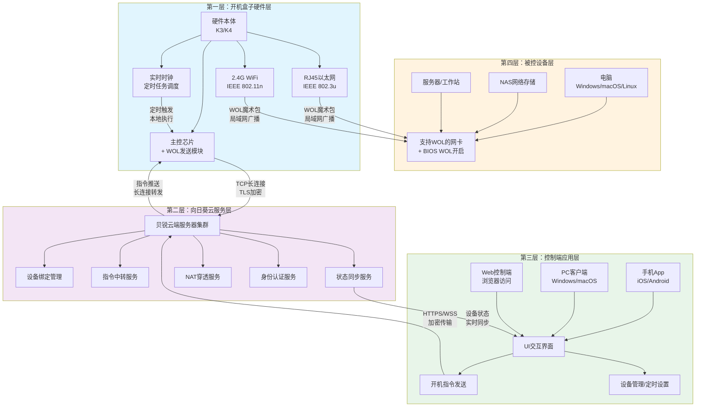

## 三、技术实现解析与硬件规格


### 3.1 章节引言

向日葵开机盒子能够突破传统WOL技术的限制，实现跨互联网的远程开机，其核心在于构建了一套**"WOL技术+云中继+硬件"**的三层技术架构。这一架构并非简单的技术叠加，而是通过硬件设备作为局域网内的"唤醒执行者"，云服务作为跨网络的"指令中转站"，标准WOL协议作为设备唤醒的"通用语言"，三者协同解决了远程开机场景中的关键痛点。

传统纯软件WOL方案面临的核心矛盾是：**WOL魔术包是二层广播帧，只能在同一局域网内传播，无法直接穿越路由器和互联网**。开机盒子通过"硬件驻留局域网+云端指令中继"的设计巧妙化解了这一矛盾——硬件始终在线并位于目标设备所在局域网，负责接收云端指令并在局域网内发送WOL魔术包；云服务则负责连接全球各地的控制端与局域网内的开机盒子，实现指令的跨网传输。本章将从WOL技术原理、网络协议栈、硬件规格、软硬协同架构四个维度，深入解析开机盒子的技术实现。

> **技术架构核心设计思想**：用硬件解决"最后一跳"的局域网广播问题，用云服务解决"第一跳"的跨网指令传输问题，用标准协议解决设备兼容性问题。

### 3.2 WOL（Wake-on-LAN）技术原理深度解析

#### 3.2.1 WOL技术历史背景

Wake-on-LAN（WOL，网络唤醒）技术并非新兴技术，其历史可追溯至20世纪90年代。1996年，IBM与Intel联合提出了Wired for Management（WfM）规范，WOL作为其中的关键组成部分首次被标准化。该技术设计的初衷是为了方便IT管理员远程管理办公电脑——管理员无需逐台手动开机，即可在下班后远程唤醒电脑进行软件更新、系统维护等操作。

WOL技术诞生二十余年来，其核心协议基本保持稳定，并未发生重大变化。这一方面说明WOL技术设计的简洁性与有效性——仅仅通过一个特殊格式的网络帧即可实现设备唤醒；另一方面也反映了其固有的技术局限性——二层广播帧无法穿越三层网络设备，导致纯WOL只能在局域网内使用，这一限制直到智能硬件+云服务方案的出现才被真正突破。

#### 3.2.2 魔术包（Magic Packet）格式详解

WOL技术的核心是**魔术包（Magic Packet）**——一个特殊格式的以太网数据帧。网卡在关机状态下仍然保持最低限度的供电，持续监听网络上的数据帧，当收到符合特定格式的魔术包时，就会向主板发送开机信号，触发设备启动。

魔术包的格式极其简洁，总共固定为**102字节**，结构如下：

| 部分 | 长度 | 内容 | 作用 |
|---|---|---|---|
| **同步前缀（Synchronization Stream）** | 6字节 | `0xFF 0xFF 0xFF 0xFF 0xFF 0xFF` | 连续6个0xFF字节，用于网卡硬件识别这是一个WOL魔术包的开始 |
| **MAC地址重复段** | 96字节 | 目标设备MAC地址连续重复16次 | 网卡比对自身MAC地址，匹配则触发开机 |

用十六进制表示的魔术包结构如下：

```
FF FF FF FF FF FF  [6字节0xFF前缀]
XX XX XX XX XX XX  [第1次重复目标MAC]
XX XX XX XX XX XX  [第2次重复目标MAC]
XX XX XX XX XX XX  [第3次重复目标MAC]
XX XX XX XX XX XX  [第4次重复目标MAC]
XX XX XX XX XX XX  [第5次重复目标MAC]
XX XX XX XX XX XX  [第6次重复目标MAC]
XX XX XX XX XX XX  [第7次重复目标MAC]
XX XX XX XX XX XX  [第8次重复目标MAC]
XX XX XX XX XX XX  [第9次重复目标MAC]
XX XX XX XX XX XX  [第10次重复目标MAC]
XX XX XX XX XX XX  [第11次重复目标MAC]
XX XX XX XX XX XX  [第12次重复目标MAC]
XX XX XX XX XX XX  [第13次重复目标MAC]
XX XX XX XX XX XX  [第14次重复目标MAC]
XX XX XX XX XX XX  [第15次重复目标MAC]
XX XX XX XX XX XX  [第16次重复目标MAC]

总长度：6 + 6×16 = 102字节
```

**魔术包设计要点解析**：

1. **简单可靠的硬件识别**：6字节0xFF前缀是一个非常明显的特征，网卡硬件无需复杂的协议解析即可快速识别这可能是一个WOL魔术包，降低了网卡在低功耗状态下的处理复杂度
2. **16次重复的设计意图**：连续16次重复MAC地址而非单次发送，是为了对抗网络传输中的比特错误——即使某个重复段出现比特翻转，还有其他15个副本可供比对，大幅提升了识别准确率
3. **无校验和无认证**：标准WOL魔术包不包含任何校验和、密码或认证机制，这意味着同一局域网内的任何设备都可以向目标发送魔术包，这是WOL技术设计上的简洁之处，同时也是安全上需要注意的点（部分厂商实现了SecureON密码扩展）
4. **协议无关性**：魔术包可以承载在多种协议之上——通常是以太网广播帧（目标MAC为`FF:FF:FF:FF:FF:FF`），也可以通过UDP广播包（端口通常为7或9）发送，这种设计保证了WOL的兼容性

#### 3.2.3 网卡监听机制

WOL能够在关机状态下工作，核心依赖于网卡的**低功耗监听模式**和主板的**待机供电机制**：

1. **PCI/PCIe设备唤醒能力**：当电脑关机时，主板并不会完全切断所有电源，而是保留对PCI/PCIe插槽、USB接口等设备的**待机供电（Standby Power，通常为+5Vsb）**。网卡利用这部分待机电力维持最基本的工作状态。

2. **网卡低功耗模式**：支持WOL的网卡在系统关机后会进入一种特殊的低功耗模式，此时网卡的正常数据收发功能被关闭，但MAC地址过滤器仍然工作，持续监听网络上的所有数据帧。

3. **魔术包识别与唤醒信号触发**：当网卡监听到数据帧时，会在硬件层面快速检查是否符合魔术包格式（6字节0xFF前缀+16次自身MAC地址）。一旦匹配成功，网卡会通过PCIe总线向主板发送一个**唤醒信号（PME#，Power Management Event）**。

4. **主板上电启动**：主板收到PME#信号后，会触发电源按钮按下相同的上电流程，完成电脑启动。整个过程无需CPU、内存等其他部件参与，完全由网卡硬件独立完成，因此即使系统处于关机状态也能响应。

#### 3.2.4 WOL工作必要条件

WOL成功唤醒设备需要同时满足五个必要条件，缺一不可：

| 条件类别 | 具体要求 | 常见问题 | 用户操作指引 |
|---|---|---|---|
| **硬件支持** | 电脑网卡必须硬件支持WOL标准（近15年的板载网卡基本都支持） | 过于老旧的独立网卡、部分低端笔记本网卡可能不支持WOL | 查看网卡说明书或设备管理器中的网卡高级属性，确认有"唤醒模式"、"魔术包唤醒"等选项 |
| **BIOS/UEFI设置** | 需要在BIOS/UEFI中开启WOL相关选项（通常名为"Wake on LAN"、"Power On By PCI/PCIe"、"Resume by LAN"等） | 主板出厂默认可能关闭WOL功能，用户未在BIOS中开启导致无法唤醒 | 开机时按Del/F2/F10等键进入BIOS设置，找到电源管理相关选项并启用WOL |
| **操作系统设置** | 需要在操作系统的网卡设置中启用魔术包唤醒，Windows中需在设备管理器→网卡属性→高级/电源管理中开启，macOS/Linux也有对应设置 | Windows更新后可能重置网卡电源管理设置，导致WOL失效 | Windows：勾选"允许此设备唤醒计算机"，在高级选项中启用"魔术包唤醒"；macOS：系统设置→节能→"唤醒以供网络访问" |
| **电源状态** | 电脑必须连接电源（台式机）或电池电量充足（笔记本），且电源开关未切断；不能是彻底断电状态（S5软关机可以，拔掉电源线则不行） | 台式机插线板开关关闭、笔记本电池耗尽、电源线被拔掉时WOL无效 | 确保电脑处于正常关机状态（软关机，S3/S4/S5电源状态），电源保持连接 |
| **网络连通** | 目标电脑的网卡必须通过网线连接到网络（WiFi版WOL支持较少且不稳定），且与发送魔术包的设备处于同一广播域（同一局域网/同一路由器下） | 跨VLAN、跨路由器、WiFi连接可能导致WOL失败；防火墙可能拦截广播包 | 电脑优先使用有线网络连接；确保开机盒子与目标电脑在同一子网/同一路由器下；必要时关闭可能干扰广播的防火墙 |

> **重要提示**：实际使用中WOL失败的案例，90%以上是因为上述五个条件中某一个未满足，而非开机盒子本身的问题。其中最常见的原因是BIOS中未开启WOL、Windows网卡电源管理设置被重置、电脑彻底断电这三种情况。

#### 3.2.5 局域网唤醒vs广域网唤醒的差异

WOL技术的核心限制在于**纯WOL只能在局域网内工作**，这一限制是由网络协议分层设计决定的：

| 对比维度 | 局域网WOL唤醒 | 广域网远程唤醒 |
|---|---|---|
| **网络层级** | 二层（数据链路层）广播帧 | 需要三层（网络层）及以上转发 |
| **传输范围** | 同一广播域（同一路由器/交换机下），无法穿越路由器 | 需要跨越互联网、多个路由器 |
| **魔术包目标MAC** | `FF:FF:FF:FF:FF:FF`（二层广播） | 公网IP无法直接发送二层广播帧 |
| **IP地址作用** | 不需要知道IP地址，MAC地址即可 | 需要公网IP或DDNS+端口映射 |
| **配置复杂度** | 极低，同一局域网内直接发送即可 | 极高，需要配置端口映射、DDNS、广播转发、可能需要子网定向广播 |
| **网络环境限制** | 无特殊要求，同局域网即可 | 受限于NAT、运营商封锁、路由器设置、公网IP可用性等 |
| **可靠性** | 高，局域网内广播几乎100%可达 | 低，网络结构变化、NAT类型、路由器设置都可能导致失败 |
| **安全性** | 较低，局域网内任意设备可发送魔术包 | 极低，端口映射将WOL端口暴露在公网，存在安全风险 |

**为什么纯WOL无法直接广域网唤醒？**

1. **广播帧隔离**：WOL魔术包是二层以太网广播帧，目标MAC地址是`FF:FF:FF:FF:FF:FF`，路由器作为三层设备默认不转发广播帧——广播帧到了路由器LAN口就会被丢弃，无法进入互联网，也无法从WAN口进入LAN口。

2. **NAT阻隔**：家庭/办公网络普遍使用NAT（网络地址转换），内部设备使用私有IP地址（如192.168.x.x），没有独立公网IP。外部网络无法直接寻址到内部设备。

3. **定向广播被禁用**：理论上可以通过"子网定向广播"（Subnet Directed Broadcast）将包发送到目标网段的广播地址，但几乎所有路由器和运营商出于安全考虑（防止Smurf攻击等）都默认禁用了定向广播转发。

4. **端口映射也无法解决广播问题**：即使在路由器上配置端口映射将UDP 7/9端口映射到内部广播地址，很多路由器也不支持这种配置，或因ARP表老化等问题无法稳定工作。

**开机盒子如何解决这一问题？**

向日葵开机盒子并没有试图"改造"WOL协议让魔术包穿越互联网，而是采用了一种更巧妙、更可靠的架构设计：

1. **硬件驻留局域网**：开机盒子作为一个始终在线的硬件设备，部署在目标电脑所在的局域网内，与目标电脑处于同一广播域。

2. **TCP长连接云端**：开机盒子启动后，会主动通过TCP连接到向日葵云服务器，并保持一个**持久的长连接**（出站连接，无需端口映射，不受NAT限制），等待云端下发指令。

3. **云中继指令传输**：用户在控制端（手机App/PC客户端）发送开机指令时，指令先通过HTTPS/TCP发送到向日葵云服务，云服务再通过开机盒子已建立的长连接将指令推送给对应开机盒子。

4. **局域网内发送魔术包**：开机盒子收到云端指令后，在**本地局域网内**以广播方式发送标准WOL魔术包——这是WOL协议最可靠的工作场景，几乎100%成功。

整个过程中，WOL魔术包永远只在局域网内传输，跨互联网传输的是经过加密的控制指令而非魔术包本身。这一设计巧妙避开了WOL协议的固有局限，利用成熟的TCP长连接+云中继技术实现跨网指令传输，同时在局域网内使用最标准、最可靠的WOL方式唤醒设备。

### 3.3 网络协议栈分析

向日葵开机盒子在工作过程中涉及多个层级的网络协议，从物理层、数据链路层到网络层、传输层、应用层，各协议各司其职，共同保障设备联网、云端通信、WOL唤醒等功能的正常运行。

| 协议层级 | 协议名称 | 标准 | 作用说明 | 在开机盒子中的具体应用 |
|---|---|---|---|---|
| **物理层/数据链路层（无线）** | IEEE 802.11 b/g/n | WiFi标准 | 定义2.4GHz频段无线局域网的物理层和MAC层规范，实现无线通信 | 开机盒子通过2.4G WiFi连接无线路由器，实现无线上网；802.11n支持最高300Mbps速率，满足控制指令传输需求 |
| **物理层/数据链路层（有线）** | IEEE 802.3/802.3u | 以太网标准 | 定义有线以太网的物理层和MAC层规范，802.3是10Mbps以太网，802.3u是100Mbps快速以太网 | 开机盒子通过RJ45网口连接路由器/交换机，802.3u 100Mbps快速以太网提供稳定可靠的有线连接，优先用于追求稳定性的部署场景 |
| **MAC层（无线）** | CSMA/CA | 802.11 MAC协议 | 载波监听多路访问/冲突避免，无线局域网的介质访问控制协议 | WiFi通信时使用，开机盒子发送数据前先监听信道是否空闲，避免与其他WiFi设备产生冲突；通过RTS/CTS握手减少隐藏节点问题 |
| **MAC层（有线）** | CSMA/CD | 802.3 MAC协议 | 载波监听多路访问/冲突检测，有线以太网的介质访问控制协议 | 有线网络通信时使用，发送数据时同时检测冲突，发生冲突则退避重试；虽然现代交换式以太网中冲突已极少，但协议仍需兼容 |
| **传输层** | TCP | RFC 793 | 传输控制协议，提供面向连接、可靠的字节流传输服务 | 开机盒子与向日葵云服务器之间建立TCP长连接，保证开机指令可靠传输不丢失；数据重传、流量控制、拥塞控制机制保障云端通信稳定性 |
| **网络层** | IP | RFC 791（IPv4） | 网际协议，定义数据包格式和寻址规则，实现跨网络数据包路由 | 开机盒子的IP通信基础，无论WiFi还是有线连接都通过IP协议与云端通信；支持IPv4 |
| **网络层（地址分配）** | DHCP | RFC 2131 | 动态主机配置协议，自动为设备分配IP地址、子网掩码、网关、DNS等网络参数 | 开机盒子联网时自动通过DHCP从路由器获取IP地址，无需用户手动配置网络，即插即用；支持静态IP配置作为备选 |
| **网络层（控制报文）** | ICMP | RFC 792 | 互联网控制报文协议，用于在IP网络中发送控制消息（如ping、目标不可达等） | 网络诊断与状态检测，开机盒子可通过ICMP检测网关连通性；用户可ping开机盒子IP判断设备是否在线 |
| **网络层（地址转换）** | NAT | RFC 3022 | 网络地址转换，实现多个内部设备共享一个公网IP地址访问互联网 | 开机盒子位于内网NAT后面时，主动向云端发起TCP出站连接建立长连接，无需端口映射即可穿透NAT接收云端指令 |
| **应用层（宽带接入）** | PPPoE | RFC 2516 | 以太网上的点对点协议，用于ADSL/光纤等宽带接入场景的拨号认证 | 在部分直接连接光猫拨号的网络环境中支持PPPoE拨号联网；主流部署场景下由路由器完成PPPoE拨号，开机盒子通过DHCP上网 |

**协议栈协同工作流程**：

```
┌─────────────────────────────────────────────────────────────┐
│  应用层        │  私有控制协议（开机指令、状态同步）      │
├─────────────────────────────────────────────────────────────┤
│  传输层        │  TCP（可靠长连接）/ UDP（WOL广播）        │
├─────────────────────────────────────────────────────────────┤
│  网络层        │  IP / ICMP / DHCP / NAT穿越              │
├─────────────────────────────────────────────────────────────┤
│  数据链路层    │  有线：802.3/802.3u + CSMA/CD             │
│                │  无线：802.11 b/g/n + CSMA/CA             │
├─────────────────────────────────────────────────────────────┤
│  物理层        │  RJ45以太网 / 2.4G WiFi射频               │
└─────────────────────────────────────────────────────────────┘
```

从协议栈设计可以看出开机盒子的网络设计理念：**底层兼容标准以太网/WiFi保证部署兼容性，中层使用TCP/IP保证云端通信可靠性，上层通过私有协议实现业务功能**。这是典型的IoT设备网络协议栈设计，既遵循标准网络协议保证互联互通，又通过应用层私有协议保障业务安全与功能完整性。

### 3.4 硬件规格参数详解

向日葵开机盒子的硬件规格设计充分体现了IoT智能硬件的设计原则：**够用即好、稳定优先、低功耗、小体积**。以下是产品官方公布的硬件规格参数及详细解读：

| 参数类别 | 参数值 | 参数含义解释 | 对用户的实际意义 |
|---|---|---|---|
| **产品型号** | K3（局域网版）、K4（独享版） | K3/K4代表产品的两个不同版本，面向不同用户群体：K3面向企业/多设备场景，支持批量开机；K4面向个人用户单设备场景，支持WiFi配网 | 用户需根据自身使用场景选择版本：个人用户远程办公唤醒家中/公司单台电脑选K4；企业IT管理员需要批量管理多台设备选K3 |
| **电源规格** | 5V/1A（Micro USB接口） | 采用标准5V直流供电，工作电流1A，额定功率约5W；使用常见的Micro USB接口供电 | 低功耗设计，长期开机也不会消耗过多电量（一年电费约3-5元）；Micro USB接口通用性强，旧手机充电器、充电宝、电脑USB口都能供电，电源适配器损坏容易替换 |
| **工作温度** | 0°C - 40°C | 设备正常工作的环境温度范围，0°C以下或40°C以上可能出现工作异常或硬件损坏 | 适合室内办公环境使用，不能放置在室外、阳台暴晒、冷库或暖气旁等极端温度环境；机房、办公室、家庭室内环境完全满足要求 |
| **工作湿度** | 10% - 90% RH（无凝结） | 设备正常工作的环境相对湿度范围，RH表示相对湿度；"无凝结"指不能出现凝露（水汽凝结成水滴） | 正常室内环境湿度都在范围内，避免放置在浴室、厨房等潮湿或容易凝露的环境中；南方梅雨季节注意保持通风，防止凝露导致短路 |
| **产品尺寸** | 70mm × 70mm × 18mm | 设备的物理尺寸：长70mm、宽70mm、厚度18mm，是一个手掌心大小的扁平方形设备 | 体积小巧，不占空间，可以轻松放置在电脑桌上、机箱上、机柜角落、路由器旁边等任意位置；重量轻，可以用双面胶固定在墙面或桌下，部署灵活 |
| **无线速率** | 300Mbps | WiFi无线连接的最高理论传输速率，对应IEEE 802.11n标准在2.4GHz频段下，2×2 MIMO时的速率 | 300Mbps对于开机盒子来说性能充裕——开机指令本身只有几十字节，即使加上状态同步、心跳包等数据，1Mbps带宽都绰绰有余；高无线速率主要保证WiFi连接的稳定性和抗干扰能力，而非用于传输大数据 |
| **无线频段** | 2.412GHz - 2.483GHz | WiFi工作的频率范围，即2.4GHz ISM频段，这是全球通用的免授权WiFi频段 | 选择2.4GHz而非5GHz频段是有意设计：2.4GHz频率低、波长长，穿墙能力强、覆盖距离远，更适合开机盒子这种需要长期稳定放置、可能与路由器隔一堵墙的IoT设备；2.4GHz频段共13个信道，抗干扰能力足够满足控制指令传输需求 |

**硬件设计理念总结**：

从硬件规格可以看出，开机盒子的硬件设计遵循"**最简够用**"原则——没有追求高性能CPU、大内存、高速WiFi等过剩配置，而是专注于满足"可靠联网+稳定发送WOL魔术包"这两个核心需求：

- **低功耗**：5V/1A的供电规格意味着设备长期在线的功耗极低，一年电费仅几元钱，不会给用户带来额外的用电负担
- **小体积**：70mm见方的尺寸让设备可以"隐身"部署，不占用桌面空间，不影响办公环境美观
- **宽温宽湿**：0-40°C、10%-90%RH的工作范围覆盖了绝大多数室内办公环境，无需为设备专门准备空调或除湿环境
- **标准接口**：Micro USB供电、标准RJ45网口，都是通用性极强的接口，降低用户的部署和替换成本
- **2.4G WiFi优先**：牺牲5GHz WiFi的高速率，换取更强的穿墙能力和更远的覆盖距离，更符合IoT设备的部署特点

### 3.5 软硬协同四层架构

向日葵开机盒子并非一个孤立的硬件设备，而是一个完整的**云-边-端协同系统**。整个系统由四层架构组成，从下到上分别是：开机盒子硬件层、向日葵云服务层、控制端应用层、被控设备层。四层架构各司其职，通过标准化的协议和接口协同工作，共同实现"随时随地远程开机"的核心价值。

#### 3.5.1 四层架构Mermaid图



#### 3.5.2 各层职责详解

**第一层：开机盒子硬件层（边缘执行层）**

开机盒子硬件层是整个系统的"边缘执行节点"，部署在目标设备所在的局域网内，是连接云端与被控设备的关键桥梁：

- **网络连接**：通过RJ45有线或2.4G WiFi连接到局域网路由器，获得IP地址后主动连接到向日葵云服务
- **长连接维护**：与云端维持加密的TCP长连接，保持在线状态，随时等待接收云端下发的指令
- **WOL魔术包发送**：收到开机指令后，在局域网内以广播方式发送标准WOL魔术包（6字节0xFF+16次目标MAC）
- **定时任务执行**：内置RTC实时时钟和任务调度器，本地存储定时开机规则，到达时间点自动发送魔术包（即使暂时断网也能执行）
- **状态上报**：定期向云端上报自身在线状态、网络状态、设备列表等信息

硬件层是整个系统中唯一与被控设备在同一局域网的环节，承担着WOL唤醒"最后一跳"的关键职责。

**第二层：向日葵云服务层（中继调度层）**

云服务层是整个系统的"大脑"和"中枢神经"，部署在贝锐科技的云端服务器集群上，负责连接分散在各地的控制端和开机盒子：

- **设备绑定管理**：管理用户账号与开机盒子的绑定关系，记录每个开机盒子绑定的被控设备MAC地址列表
- **指令中转服务**：接收控制端发来的开机指令，根据设备绑定关系找到对应的开机盒子，将指令通过长连接精准推送下去
- **状态同步服务**：收集开机盒子上报的设备状态、在线状态等信息，实时同步给所有登录了该账号的控制端
- **NAT穿透服务**：开机盒子位于内网NAT后面时，通过开机盒子主动发起的出站TCP长连接实现"反向穿透"，无需用户配置端口映射或公网IP
- **身份认证服务**：负责用户登录认证、设备合法性验证、指令权限校验，确保只有授权用户才能发送开机指令

云服务层解决了"跨互联网通信"问题——让用户无论身在何处，都能将开机指令可靠地发送到家里/公司的开机盒子上。

**第三层：控制端应用层（用户交互层）**

控制端应用层是用户直接接触的交互界面，负责将用户的操作转化为系统指令，并将设备状态可视化呈现给用户：

- **多端覆盖**：支持手机App（iOS/Android）、PC客户端（Windows/macOS）、Web网页端三种形态，覆盖用户在不同场景下的使用需求
- **UI交互界面**：提供直观的设备列表、开机按钮、定时设置、批量管理等界面，降低用户使用门槛
- **开机指令发送**：用户点击开机按钮时，将指令通过HTTPS/WSS加密通道发送到云端
- **设备管理**：支持设备绑定/解绑、MAC地址管理、分组管理、定时任务配置等管理功能

控制端层是用户与系统交互的入口，其设计好坏直接影响用户体验。

**第四层：被控设备层（被唤醒目标）**

被控设备层是WOL魔术包的最终接收者和唤醒目标：

- **设备类型**：包括Windows/macOS/Linux电脑、NAS网络存储、服务器、工作站等所有支持标准WOL协议的设备
- **WOL支持**：设备网卡必须硬件支持WOL，并且在BIOS/操作系统中正确开启了WOL功能
- **响应机制**：关机状态下网卡保持低功耗监听，收到匹配自身MAC地址的魔术包后向主板发送PME#唤醒信号触发开机
- **电源要求**：设备必须连接电源，处于软关机状态（S3/S4/S5），不能彻底断电

被控设备层是整个系统的唤醒目标，四层架构的最终目的就是可靠地唤醒这一层的设备。

#### 3.5.3 典型开机流程时序

一次完整的远程开机流程在四层架构中按以下顺序执行：

```mermaid
sequenceDiagram
    participant User as 用户
    participant App as 控制端App（L3）
    participant Cloud as 向日葵云（L2）
    participant Box as 开机盒子（L1）
    participant PC as 被控电脑（L4）

    User->>App: 1. 点击"开机"按钮
    App->>Cloud: 2. 发送开机指令（HTTPS加密，含设备ID+认证Token）
    Cloud->>Cloud: 3. 验证用户身份与设备权限
    Cloud->>Box: 4. 通过TCP长连接推送开机指令（含目标MAC地址）
    Box->>Box: 5. 接收并解析指令，构造WOL魔术包
    Box->>PC: 6. 局域网广播发送WOL魔术包（6字节0xFF+16次MAC）
    PC->>PC: 7. 网卡监听并匹配魔术包，发送PME#信号
    PC->>PC: 8. 主板上电，系统启动
    Box->>Cloud: 9. 上报指令发送成功
    Cloud->>App: 10. 推送"开机指令已发送"状态
    App->>User: 11. 显示"开机指令已发送，请稍候"
    Note over PC: 电脑启动完成后，<br/>向日葵客户端上线，<br/>可进行远程控制
```

整个流程中，跨互联网传输的是加密的控制指令（步骤2、4、10），而WOL魔术包只在局域网内传输（步骤6），这正是开机盒子能够稳定实现跨网远程开机的核心架构设计。