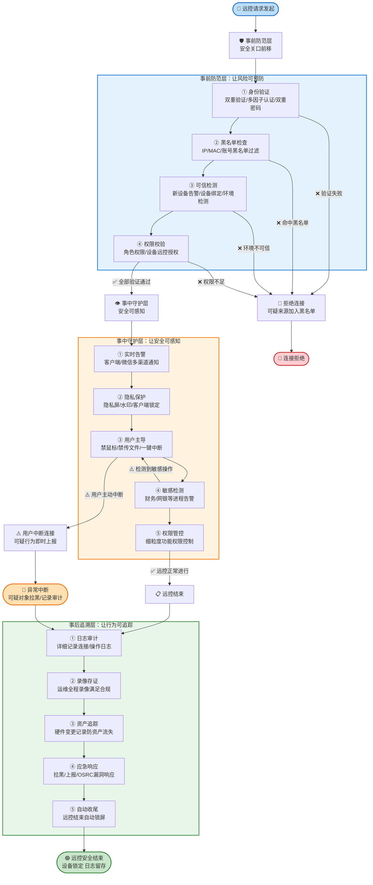
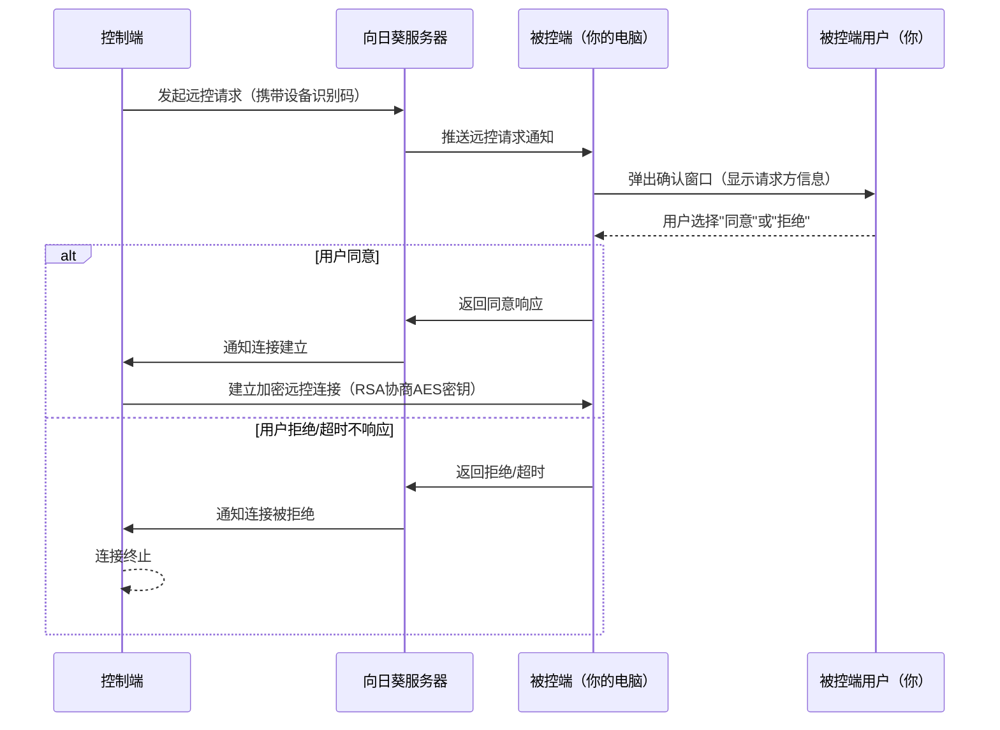

# 向日葵远程控制安全产品完整学习教程：国民远控的全流程安全体系深度解析

> **官方安全页面**: https://sunlogin.oray.com/product/safe?ici=sunlogin_navigation
> **贝锐官网**: https://sunlogin.oray.com/

---

## 📋 目录导航

- [一、产品概述与学习目标 🎯](#一产品概述与学习目标)
- [二、核心概念与安全术语 📚](#二核心概念与安全术语)
- [三、三大应用场景安全特性详解 🔐](#三三大应用场景安全特性详解)
- [四、全流程安全防护体系深度解析 🛡️](#四全流程安全防护体系深度解析)
- [五、技术实现与加密算法 🔒](#五技术实现与加密算法)
- [六、合规认证与安全标准 ✅](#六合规认证与安全标准)
- [七、专业深度洞察：优势·定位·UX设计 💡](#七专业深度洞察优势定位ux设计)
- [八、潜在优化方向与行业启示 🚀](#八潜在优化方向与行业启示)
- [九、常见问题解答（FAQ）❓](#九常见问题解答faq)
- [十、相关资源链接 🔗](#十相关资源链接)

---

## 一、产品概述与学习目标 🎯

> **"力保国民远控安全 我们始终践行"**
>
> —— 向日葵官方安全口号

### 1.1 向日葵产品介绍

**向日葵远程控制**是贝锐科技（Oray）旗下的国民级远程控制软件，作为国内远程控制领域的领军产品，拥有广泛的用户基础和成熟的技术积累。向日葵致力于为个人用户和企业客户提供稳定、安全、高效的远程连接解决方案，覆盖远程协助、远程办公、IT运维、技术支持等多种应用场景。

正如官方所强调的安全理念：**"国民远控安全早已深植向日葵，全方位安全设计正竭力保护你的远控安全"**。在远程控制软件中，安全是生命线——一旦远控链路被攻破，用户的设备隐私、企业数据、商业机密都将面临严重风险。因此，向日葵将安全作为产品设计的核心基石，构建了完整的全流程安全防护体系。

### 1.2 为什么远控安全至关重要

远程控制软件直接连接用户的设备终端，拥有极高的系统权限，这意味着：
- **隐私泄露风险**：屏幕内容、文件数据、键盘输入都可能被窃取
- **设备被控风险**：恶意攻击者可远控设备执行任意操作
- **企业内网渗透风险**：被控设备可成为进入企业内网的跳板
- **数据安全风险**：远控过程中传输的敏感数据可能被截获

正因如此，远控安全绝非可有可无的附加功能，而是远程控制软件的**核心生命线**。向日葵从产品设计之初就将安全理念融入每一个环节，形成了"三大场景 × 三层防护"的完整安全体系。

### 1.3 本教程学习目标

通过本教程的系统学习，你将能够：

1. **理解远控安全的核心挑战**：掌握远程控制领域特有的安全风险点和防护逻辑
2. **熟悉向日葵安全体系架构**：清晰了解"三大场景 × 三层防护"的完整安全矩阵设计
3. **掌握核心安全术语**：理解等保2.0、国密算法、零信任等专业安全概念
4. **学会安全功能配置**：能够根据自身场景合理配置水印、隐私屏、多因子认证等安全功能
5. **评估安全合规性**：了解向日葵通过的各项安全认证和合规标准
6. **建立企业级安全思维**：为企业部署远控方案时具备安全选型和配置的专业判断能力

### 1.4 向日葵安全体系整体架构总览

向日葵构建了**"三大场景 × 三层防护"**的全方位安全矩阵，覆盖远控前、中、后完整生命周期：

| 防护层级 \ 应用场景 | **接受远程协助** | **远控自己设备** | **企业级安全方案** |
|---|---|---|---|
| **事前防范** | 访问验证码、授权确认、身份验证 | 设备绑定、访问密码、二次验证 | 等保合规、零信任架构、多因子认证(MFA)、访问策略配置 |
| **事中守护** | 会话加密、权限最小化、操作提示 | 端到端加密、通道隔离、隐私屏 | 国密算法加密、传输加密、水印策略、实时监控、行为审计 |
| **事后追溯** | 操作日志、会话记录 | 登录日志、连接历史 | 安全审计、日志留存、异常告警、OSRC漏洞响应、数据可追溯 |

这个安全矩阵的设计理念是：**不依赖单点防护，而是通过多层级、全场景的纵深防御体系，确保远控行为的每一个环节都处于安全保护之下。**

---

## 二、核心概念与安全术语 📚

本章将用通俗易懂的语言解释向日葵安全体系中涉及的核心技术术语，帮助不同技术水平的读者建立统一的认知基础。

### 2.1 等保2.0（信息系统等级保护2.0）

**等保2.0**是中国国家网络安全等级保护制度的2.0版本，是国家网络安全领域的基本制度、基本策略和基本方法。它要求网络运营者按照网络安全等级保护制度要求，履行安全保护义务，保障网络免受干扰、破坏或者未经授权的访问，防止网络数据泄露或者被窃取、篡改。

简单来说，等保2.0是国家对信息系统安全的**强制性国家标准**，企业产品通过等保2.0认证，意味着其安全能力达到了国家认可的标准要求。

### 2.2 国密算法（SM2/SM3/SM4）

**国密算法**是中国国家密码管理局发布的商用密码算法标准，是我国自主可控的密码技术体系，包含一系列算法：

- **SM2**：非对称加密算法，功能类似国际通用的RSA算法，用于数字签名和密钥交换，基于椭圆曲线密码（ECC）机制，在相同安全强度下密钥长度更短、性能更高。
- **SM3**：密码哈希算法，功能类似SHA-256，用于生成数据摘要、校验数据完整性，输出256位哈希值。
- **SM4**：对称加密算法，功能类似AES（高级加密标准），用于数据加密传输和存储，分组长度和密钥长度均为128位。

向日葵采用国密算法对远控数据进行加密，满足国内用户对密码技术自主可控的安全合规要求。

### 2.3 RSA 2048位非对称加密

**RSA**是目前应用最广泛的国际标准非对称加密算法，2048位指的是其密钥长度。非对称加密使用一对密钥：**公钥**（公开用于加密）和**私钥**（私密用于解密），二者数学相关但无法从公钥推导出私钥。

在远控场景中，RSA 2048通常用于会话建立阶段的密钥交换和身份认证，确保双方身份真实可信，且协商出的会话密钥不会被中间人截获。2048位密钥长度在当前计算能力下被认为是安全的。

### 2.4 AES对称加密

**AES（高级加密标准）**是目前全球最通用的对称加密算法，加密和解密使用同一个密钥。对称加密的特点是**速度快、效率高**，适合大量数据的实时加密传输。

在向日葵远控过程中，屏幕画面、键盘鼠标输入、文件传输等大量实时数据，都是通过AES算法进行加密传输的，确保数据在网络传输过程中即使被截获也无法被解密还原。

### 2.5 零信任理念

**零信任（Zero Trust）**是一种现代网络安全理念，其核心原则是：**"永不信任，始终验证"（Never Trust, Always Verify）**。传统安全模型基于"内网可信"假设，只要进入企业内网就默认信任；而零信任模型打破了这个假设，不默认信任任何访问请求——无论请求来自内网还是外网，都必须经过严格的身份验证和授权检查。

在远控场景中，零信任意味着：即使设备曾经成功连接过，每次发起远控请求时都需要重新验证身份、检查权限、评估风险，不因为历史连接记录就给予信任。

### 2.6 全流程防护

**全流程防护**指的是构建"事前预防 + 事中监控 + 事后追溯"的完整安全闭环，而不是只在某一个环节做防护：
- **事前**：通过身份验证、权限配置、访问策略把风险挡在门外
- **事中**：通过加密传输、实时监控、操作拦截在连接过程中守护安全
- **事后**：通过日志审计、异常告警、追溯机制确保安全事件可定位、可追责

向日葵的三层防护体系正是全流程防护理念的具体实践。

### 2.7 安全审计

**安全审计**是指对系统中所有用户的操作行为进行完整记录、留存和审查的机制。在远控场景中，安全审计会记录：谁在什么时间、从什么地点、连接了哪台设备、做了哪些操作、传输了什么文件。

安全审计的价值体现在两方面：一是**威慑作用**——用户知道操作会被记录，就会减少违规操作；二是**追溯作用**——一旦发生安全事件，可以通过审计日志还原完整过程，定位问题源头，界定责任归属。

### 2.8 水印策略

**水印策略**是指在远程控制的屏幕画面上叠加可见或不可见的水印信息。水印内容通常包含：访问者账号、连接时间、设备信息等识别特征。

水印的核心作用是**防止截屏录屏泄露**——即使有人通过截屏或录屏方式窃取屏幕上的敏感信息，水印也能追溯到泄露源头，对信息窃取行为形成震慑。企业版向日葵支持管理员自定义水印内容和显示策略。

### 2.9 隐私屏

**隐私屏**（也叫黑屏模式）是向日葵的一项重要隐私保护功能：当远程控制连接建立后，被控端的本地显示器会显示黑屏，而远控端可以正常看到和操作桌面。

隐私屏解决了一个真实场景的痛点：如果你在办公室远程连接家里的电脑，或者在公共场合远程操作设备，旁边的人可能会通过被控端的屏幕看到你的操作内容。开启隐私屏后，只有远控端能看到画面，被控端本地什么都不显示，有效防止旁人偷看。

### 2.10 多因子认证（MFA）

**多因子认证（Multi-Factor Authentication, MFA）**是指在身份验证时，要求用户提供两种或以上不同类型的验证凭证，组合起来确认身份。常见的验证因子包括：
- **知识因子**：你知道什么（密码、验证码）
- **持有因子**：你有什么（手机、硬件令牌、短信验证码）
- **生物因子**：你是谁（指纹、人脸、声纹）

比如登录时除了输入密码（知识因子），还需要输入手机收到的短信验证码（持有因子），这就是典型的多因子认证。即使密码泄露，攻击者没有你的手机也无法登录，大幅提升了账号安全性。

### 2.11 OSRC（贝锐安全应急响应中心）

**OSRC（Oray Security Response Center）**是贝锐科技建立的安全漏洞接收和响应平台，面向广大安全研究者和白帽子黑客，负责接收、处理和公开向日葵等贝锐旗下产品的安全漏洞。

- **OSRC平台地址**：https://url.oray.com/GbsIba

OSRC的建立体现了向日葵"开放安全"的理念：通过建立正规的漏洞反馈渠道，与安全社区合作，主动发现和修复安全问题，而不是掩盖漏洞。这是成熟安全产品的重要标志。

---

## 三、三大应用场景安全特性详解 🔐

向日葵在安全设计上采用了**场景化安全策略**而非一刀切的防护模式。这是因为远程控制的使用场景差异巨大：接受他人远程协助时，你需要防范的是不可信的外部控制者；远程访问自己设备时，你需要防范的是设备周围的旁人窥探和账号盗用风险；而企业级部署时，则需要兼顾权限管理、数据防泄露、合规审计等多重需求。针对这三种典型场景，向日葵分别设计了贴合场景痛点的安全特性，让每一种使用方式都能获得恰到好处的安全保护。

---

### 3.1 场景一：当你接受远控时（帮助他人远程协助你的电脑）

当你需要技术支持、请朋友帮忙解决电脑问题时，你需要将设备控制权临时交给他人。这种场景下的核心安全诉求是：**确保只有你信任的人能连接，连接过程中你能感知并主导控制权，可疑行为可及时中断，事后可追溯拉黑**。向日葵为此提供了8项安全特性，覆盖事前、事中、事后全流程。

#### 事前防范·让风险可预防

**🔒 双重验证访问**
每次远程协助都需要获取你的明确同意，确保只有你信任的人能控制你的设备。这意味着即使对方知道你的设备识别码，没有你的实时授权也无法建立连接。对用户的价值在于：从连接入口就把好第一道关，彻底杜绝未经授权的强制远控。

**🚫 防骚扰设置**
可设置IP地址和MAC地址黑名单，防止陌生人向你发起远控骚扰。如果你频繁收到不明来源的远控请求，可以直接将可疑IP或设备加入黑名单，从网络层面阻断骚扰来源。对用户的价值在于：减少不必要的打扰，提升使用体验，同时从源头降低被恶意攻击的概率。

**❌ 拒绝陌生远控（拉黑陌生账号）**
若接收到陌生远控请求，你可直接拉黑该账号，禁止对方再次向你发起控制请求。这是一种轻量级的即时反制措施，无需复杂配置即可快速屏蔽骚扰者。对用户的价值在于：操作简单直接，遇到可疑请求一键拉黑，有效防止同一账号反复骚扰。

#### 事中守护·让安全可感知

**🔔 被控及时告警**
当你的设备被控时，系统会及时向你的向日葵客户端、微信等渠道发送告警信息。如有可疑远控，你可以马上中断连接。多渠道告警确保即使你不在电脑前，也能通过手机及时获知设备被控状态。对用户的价值在于：让远控行为透明化，你始终掌握设备控制权的实时状态，异常连接可第一时间发现并处置。

**🛡️ 可疑进程防护**
当你的电脑运行敏感进程（如财务软件、网银客户端等）时，可及时收到通知并中断远控，防止远控过程中数据外泄。这是针对敏感操作场景的专项防护，避免在处理涉密信息时被远程窥视。对用户的价值在于：智能识别高风险操作场景，主动提醒并提供中断选项，保护财务数据、账号密码等核心敏感信息。

**👑 被控端拥有强主导地位**
你可以单独禁止控制端的鼠标操作、文件传输权限，防止控制端在你的电脑上进行敏感操作和偷传文件。即使连接已经建立，你依然掌握细粒度的权限开关，可以随时收回某项权限。对用户的价值在于：连接建立后你依然保有最高控制权，既能让对方帮你解决问题，又能限制对方的操作范围，做到"可用但不可乱为"。

#### 事后追溯·被控安全追踪

**📋 多渠道查看被控记录**
在PC客户端和手机APP上都可以查看你账号下的所有被控记录，发现可疑远控可及时上报，与向日葵共同维护良好的远控环境。完整的历史记录让每一次远控都有迹可循。对用户的价值在于：事后可以回溯所有连接历史，一旦发现异常可以留存证据并上报，形成安全闭环。

**🚷 拉黑可疑远控**
事后你可以拉黑陌生或者可疑的账号或设备，不再接收它们的远控请求，防止不必要的骚扰。即使当时没有及时处理，事后回顾记录时发现可疑对象依然可以进行拉黑操作。对用户的价值在于：提供了事后补救手段，避免可疑对象再次尝试连接，持续净化你的远控环境。

---

### 3.2 场景二：当你远控自己设备时（远程访问自己的电脑/设备）

当你在外出差、居家办公需要远程连接公司或家里的电脑时，设备控制权始终在你自己手中。这种场景下的核心安全诉求是：**确保只有你自己能访问设备，远控过程中不被旁人窥视，结束后不留安全隐患**。向日葵为此提供了7项安全特性。

#### 事前防范

**📱 设备登录验证**
当你的账号在新设备和异地登录时，系统会进行告警提示，确保可信的环境与身份。如果你的账号密码不慎泄露，攻击者在陌生设备或异地尝试登录时，你会第一时间收到提醒。对用户的价值在于：及时发现账号盗用风险，在攻击者建立远控连接前就能采取改密、下线等措施，保护账号安全。

**🔐 双重密码保护**
采用账号密码 + 被控终端本地密码验证的双重校验机制，双重保护你的数据防泄漏。即使攻击者攻破了你的向日葵账号，没有被控电脑本身的系统密码依然无法完成最终连接。对用户的价值在于：构建了两层独立的身份认证壁垒，单一点失守不会导致整体安全失效，大幅提升破解难度。

#### 事中守护

**🖥️ 隐私屏**
远程控制过程中，被控设备本地显示器会显示黑屏，防止电脑上的隐私信息被旁边的人无意中看到。这解决了远程办公的一个真实痛点：如果你在公司远程连接家里电脑，或在公共场合远程操作设备，旁人无法通过被控端屏幕看到你的操作内容。对用户的价值在于：远控操作只对你可见，即使被控设备周围有人，也无法窥视你的屏幕内容，有效保护操作隐私。

**🔒 自动锁定客户端**
自动锁定向日葵客户端，防止别人查看和修改你的软件设置。如果你在公共电脑上登录过向日葵忘记退出，或者电脑暂时借给他人使用，客户端自动锁定可以防止他人篡改你的配置或冒用你的身份发起远控。对用户的价值在于：即使你临时离开设备，客户端配置和远控权限也不会被他人随意操作。

#### 事后追溯

**🔒 被控结束后自动锁屏**
远控会话结束后，系统会自动锁定电脑本地屏幕，进一步提升远程办公的信息安全。远控结束后如果被控端处于登录状态，自动锁屏可以防止物理接触到该设备的人直接进入系统。对用户的价值在于：避免远控结束后设备处于"裸奔"状态，即使你忘记手动锁屏，系统也会帮你自动锁定，补上最后一道安全防线。

---

### 3.3 场景三：企业级安全方案（贴合各企业不同需求，全维度安全方案）

企业级远程控制场景的复杂度远高于个人用户：需要管理大量员工账号、区分不同岗位权限、防范内部数据泄露、满足合规审计要求、管理硬件资产等。向日葵企业级安全方案为此提供了6项专项安全特性，覆盖企业远控的全方位安全需求。

#### 事前防范

**👥 精细化角色权限**
提供灵活的访问控制和权限管理，管理员可为不同成员分配不同权限，确保安全操作。企业管理员可以根据员工岗位和工作需要，精确配置每个人可访问的设备范围、可使用的功能（如是否允许文件传输、是否允许远程CMD等）。对企业的价值在于：遵循最小权限原则，普通员工无法越权访问敏感设备，从权限架构上杜绝越权操作风险。

**🔑 多因子安全保护**
支持多因子安全保护、登录行为审计、设备远控授权，确保身份可信、环境可信。除了账号密码外，企业可以强制开启短信验证、硬件令牌等多因子认证方式，同时对登录行为进行审计，对设备远控进行单独授权。对企业的价值在于：构建多层身份验证体系，即使账号密码泄露也无法轻易登录，所有登录和授权行为都有记录可查。

#### 事中守护

**💧 水印策略**
防止在远控办公设备时通过截屏、录屏等方式泄露公司数据，不同权限匹配不同安全操作策略。屏幕上叠加的水印包含访问者账号、连接时间等溯源信息，对截屏录屏行为形成震慑。对企业的价值在于：即使发生信息泄露事件，也可以通过水印追溯到泄露源头，同时对潜在的泄密行为产生心理威慑，减少内部泄密风险。

**⚙️ 软件定制权限自定义**
可设置禁止远程传输文件等权限，防止重要文件资料被复制传送、向外泄露。管理员可以全局禁用或按角色配置文件传输、剪贴板共享等可能导致数据外泄的功能。对企业的价值在于：从功能层面堵住数据泄露通道，重要文档只能远程查看使用，无法被轻易拷贝带走，保护企业核心数据资产。

#### 事后追溯

**📊 安全审计**
远控日志详细记录，运维过程全程录像，确保事件的可追溯性。每一次远控连接的时间、操作者、目标设备、操作内容都有完整日志记录，关键运维操作还可以全程屏幕录像存档。对企业的价值在于：满足等保合规要求，一旦发生安全事件可以完整还原操作过程，界定责任归属，同时对运维人员形成规范操作的约束。

**🖥️ 硬件变更记录**
全面记录企业硬件资产信息和变更记录，防止员工私自更换配件，导致企业资产流失。系统自动追踪企业IT资产的硬件配置变化，配件更换行为可被及时发现。对企业的价值在于：实现IT资产的可视化管理，硬件资产异动有记录、可追溯，防范企业固定资产流失。

---

### 三大场景安全特性对比表

| 防护阶段 | 接受远程协助（他控） | 远控自己设备（自控） | 企业级安全方案（企控） |
|---|---|---|---|
| **核心安全诉求** | 防范不可信外部控制者，保持主导权 | 防范旁人窥探和账号盗用，隐私保护 | 权限管控、数据防泄漏、合规审计、资产管理 |
| **事前防范** | 双重验证访问 IP/MAC黑名单 陌生账号拉黑 | 新设备/异地登录告警 账号+本地密码双重验证 | 精细化角色权限配置 多因子认证+设备授权 |
| **事中守护** | 多渠道被控告警 敏感进程防护 细粒度权限开关（禁鼠标/禁传文件） | 隐私屏（本地黑屏） 客户端自动锁定 | 屏幕水印溯源 文件传输等功能权限自定义 |
| **事后追溯** | 多渠道被控记录查询 可疑账号/设备拉黑 | 远控结束自动锁屏 | 完整操作日志+运维录像 硬件资产变更记录 |
| **特性数量** | 8项 | 7项 | 6项 |
| **安全设计重心** | 让用户"看得见、管得住、断得开" | 让访问"只有自己能进、只有自己能看" | 让管理"权限分级、行为留痕、资产可管" |

---

> 📌 **企业服务入口**
>
> [了解企业服务 >](https://url.oray.com/tqaqqs) | [申请企业试用 >](https://url.oray.com/YXZbWb)

---

## 四、全流程安全防护体系深度解析 🛡️

> **官方定位**："从里到外，不让任何威胁有可乘之机"、"全流程保护被控用户的信息安全，安心接受他人的远程协助"
>
> **核心理念**：事前防范·事中守护·事后追溯——构建远控安全的完整闭环

---

### 4.1 全流程安全防护理念

远程控制软件的安全防护不能依赖单一环节的"铜墙铁壁"，而必须构建覆盖远控全生命周期的纵深防御体系。这一设计理念与网络安全领域经典的"纵深防御（Defense in Depth）"思想一脉相承——就像城堡不会只建一道城门，而是通过护城河、城墙、城门、内城警戒等多层防线，即使某一层被突破，后续防线依然能够提供保护。

向日葵将远控生命周期划分为三个阶段，并针对每个阶段的安全特点设计了对应的防护机制：

| 阶段 | 时间维度 | 核心目标 | 设计哲学 |
|---|---|---|---|
| **事前防范** | 远控连接建立前 | 让风险可预防 | 安全关口前移，在风险发生前建立防线 |
| **事中守护** | 远控连接进行中 | 让安全可感知 | 即使防线被突破，用户依然实时掌握控制权 |
| **事后追溯** | 远控连接结束后 | 让行为可追踪 | 安全事件可还原、可取证、可处置 |

这三大设计原则共同构成了全流程防护的基石：

**🔹 安全关口前移——预防胜于补救**

在安全领域有一个公认的成本规律：在风险发生前阻止攻击的成本，远低于攻击发生后进行补救的成本。事前防范就是将安全措施部署在连接建立之前，通过身份验证、访问控制、黑名单过滤等机制，把绝大多数风险直接挡在门外。这是成本最低、效果最好的安全策略。

**🔹 安全可感知——透明带来信任**

安全不应该是黑盒。即使系统在后台做了再多防护，如果用户对正在发生的远控行为毫无感知，安全体验也是失败的。事中守护层的核心设计理念是"安全不打扰但可感知"——平时不干扰正常远控操作，但一旦有可疑行为或高风险操作，用户能够第一时间获知并拥有干预能力。

**🔹 行为可追溯——威慑重于追责**

完整的日志记录和审计机制，其价值不仅仅在于事后追责。当用户知道"所有操作都会被记录"时，这一事实本身就会对潜在的恶意行为形成强大的心理威慑，从根源上减少违规操作的发生。同时，完善的追溯机制也是企业合规审计的硬性要求。

**全流程防护 vs 单一环节防护**

传统安全产品往往只在某一个环节做重点防护，比如只强调加密传输，或者只做身份认证。但远控安全是一个系统性问题：
- 只做身份认证，无法防止连接建立后的越权操作
- 只做传输加密，无法阻止已经获得授权的恶意用户
- 只做事后审计，无法在攻击发生时及时止损

向日葵的全流程防护体系不是简单的功能叠加，而是让三层防护机制形成有机闭环——事前过滤绝大多数风险，事中实时监控并赋予用户控制权，事后追溯形成闭环威慑，三者缺一不可。

---

### 4.2 事前防范层：让风险可预防

#### 设计思路深度解析

事前防范层的核心逻辑是**"将安全关口前移"**。在远程控制的安全生命周期中，连接建立前是阻断攻击的最佳时机——此时风险尚未真正触达用户设备，拦截成本最低，对用户体验的影响也最小。

这一设计借鉴了零信任安全架构"永不信任，始终验证"的核心原则：不因为"曾经连接过"、"在同一网络"等历史因素就默认放行，而是对每一次远控请求都进行严格的身份验证、环境检测和权限检查。

事前防范层的本质是在用户设备与外部远控请求之间建立多道过滤闸门，只有通过所有闸门验证的请求才能最终建立连接。这种多层过滤机制确保了即使某一道闸门被绕过（比如密码泄露），后续闸门依然能够提供保护。

#### 核心机制汇总

从事前防范的设计逻辑出发，向日葵从三大场景中提炼出四类共性防护机制：

**1. 访问控制与验证——建立身份信任的第一道闸门**

| 机制 | 应用场景 | 防护逻辑 |
|---|---|---|
| **双重验证访问** | 接受远程协助 | 每次远控都需要被控端用户实时明确授权，"知道识别码"≠"能连接" |
| **多因子认证(MFA)** | 企业级方案 | 密码+短信/硬件令牌的组合验证，单一口令泄露不导致账号失陷 |
| **双重密码保护** | 远控自己设备 | 账号密码+被控终端本地密码的双重校验，构建两层独立认证壁垒 |

这组机制解决的核心问题是"你是谁"——通过多维度的身份验证，确保请求连接者确实是其声称的身份，而非冒充者。

**2. 黑名单与过滤——主动阻断已知风险来源**

| 机制 | 应用场景 | 防护逻辑 |
|---|---|---|
| **IP/MAC黑名单** | 接受远程协助 | 从网络层面阻断已知恶意IP或设备的连接请求 |
| **设备/账号拉黑** | 全场景通用 | 对发起可疑请求的账号或设备进行一键拉黑，防止反复骚扰 |

黑名单机制是一种轻量高效的主动防御手段，类似于手机的骚扰电话拦截——对于已经识别出的恶意来源，直接从入口阻断，无需每次都重复验证。

**3. 身份可信保障——持续验证而非一次验证通过**

| 机制 | 应用场景 | 防护逻辑 |
|---|---|---|
| **新设备/异地登录告警** | 远控自己设备 | 账号在陌生环境登录时即时告警，及时发现盗用风险 |
| **设备绑定** | 远控自己设备 | 将账号与可信设备绑定，限制陌生设备的登录权限 |
| **精细化角色权限** | 企业级方案 | 基于岗位配置最小权限，普通员工无法越权访问敏感设备 |

零信任理念强调"持续验证"，身份可信保障机制正是这一理念的体现——不是登录时验证一次就万事大吉，而是持续评估登录环境和设备的可信度。

**4. 环境可信检测——验证不仅是人，还有环境**

| 机制 | 应用场景 | 防护逻辑 |
|---|---|---|
| **登录环境检测** | 企业级方案 | 评估登录设备、网络环境的安全性 |
| **设备远控授权** | 企业级方案 | 设备需要单独授权才能被远控，而非账号登录即可访问所有设备 |

在企业场景中，仅仅验证用户身份是不够的——同一个员工从公司内网办公电脑登录，和从公共网吧电脑登录，风险等级完全不同。环境可信检测就是对访问上下文进行安全评估。

#### 设计价值分析

安全行业的数据表明，**事前防范能够阻止90%以上的常见攻击和骚扰**。这是因为绝大多数远控安全事件并非来自技术高超的黑客攻击，而是来自：
- 密码泄露后的暴力尝试
- 陌生人的恶意远控骚扰
- 未授权的越权访问
- 账号盗用后的异地登录

这些常见风险都可以通过事前防范机制有效阻断。更重要的是，事前防范是"用户无感知"的安全防护——验证通过后用户可以正常使用远控功能，不会在连接过程中被频繁打断，实现了安全与体验的平衡。

---

### 4.3 事中守护层：让安全可感知

#### 设计思路深度解析

即使事前防范做得再完善，也无法保证100%阻断所有风险。原因很简单：在"接受远程协助"场景中，你需要将控制权临时交给一个你授权的人——这个人是你"信任"的，但"信任"不等于"无限授权"。你可能信任技术支持人员帮你解决软件问题，但并不意味着你允许他查看你的财务文件、传输你的私人数据。

事中守护层的设计哲学可以概括为三句话：
- **信任但要验证（Trust but Verify）**：即使是授权用户，操作过程也处于监控之下
- **用户始终拥有最高控制权**：被控端用户是设备的主人，可以随时干预或中断
- **安全不打扰但可感知**：正常操作时无感，可疑操作时第一时间告警

这一层解决的是"连接建立之后怎么办"的问题——防线被突破不等于游戏结束，用户依然拥有多重保护手段。

#### 核心机制汇总

**1. 实时多渠道告警——让远控行为透明化**

| 机制 | 应用场景 | 防护逻辑 |
|---|---|---|
| **客户端通知** | 全场景通用 | 设备被控时客户端即时弹出提示 |
| **微信通知** | 接受远程协助 | 即使不在电脑前，也能通过手机获知被控状态 |

多渠道告警的核心价值在于"让远控行为看得见"。很多安全事件的恶化，根源在于用户"不知道设备正在被控"。实时告警确保用户始终掌握设备控制权的实时状态，异常连接可以第一时间发现。

**2. 隐私保护措施——防止旁窥和截屏泄露**

| 机制 | 应用场景 | 防护逻辑 |
|---|---|---|
| **隐私屏（黑屏模式）** | 远控自己设备 | 被控端本地显示器黑屏，只有远控端可见，防止旁人物理偷窥 |
| **水印策略** | 企业级方案 | 屏幕叠加访问者信息水印，对截屏录屏形成溯源威慑 |
| **自动锁定客户端** | 远控自己设备 | 离开时自动锁定客户端配置，防止被他人篡改 |

隐私保护是事中防护的重要维度——远控安全不仅要防范"远端的恶意控制者"，还要防范"物理接触到被控设备的旁人"。隐私屏和水印分别从"防旁窥"和"防截屏泄露"两个角度保护隐私。

**3. 用户主导权——被控端始终掌握最高控制权**

| 机制 | 应用场景 | 防护逻辑 |
|---|---|---|
| **被控端最高控制权** | 全场景通用 | 被控端用户权限高于控制端，可随时收回权限或中断连接 |
| **单独禁止鼠标操作** | 接受远程协助 | 即使保持连接，也可以禁止对方操作鼠标键盘 |
| **单独禁止文件传输** | 接受远程协助/企业方案 | 允许屏幕查看和操作，但禁止传输文件 |
| **一键中断连接** | 全场景通用 | 发现异常时立即断开远控 |

这是事中守护层最核心的设计理念——**"我的设备我做主"**。用户不是被动的被控制者，而是始终掌握着"生杀大权"。细粒度的权限开关让用户可以做到"让对方帮我解决问题，但不能乱动我的东西"，实现了"可用但不可乱为"的平衡。

**4. 敏感行为检测——智能识别高风险操作场景**

| 机制 | 应用场景 | 防护逻辑 |
|---|---|---|
| **可疑进程防护** | 接受远程协助 | 检测到财务软件、网银等敏感进程运行时主动告警 |

这是一种场景化的智能防护机制——系统不需要用户手动配置，而是自动识别"当前正在处理敏感信息"这一高风险场景，并主动提醒用户注意。这种主动式防护降低了用户的安全认知负担。

**5. 权限细粒度控制——最小权限原则的实践**

| 机制 | 应用场景 | 防护逻辑 |
|---|---|---|
| **文件传输权限自定义** | 企业级方案 | 可全局禁用或按角色配置文件传输权限 |
| **软件定制权限** | 企业级方案 | 剪贴板共享、远程CMD等功能可按需开关 |

企业场景下的权限控制更加精细化——不是"要么全给要么不给"，而是根据岗位需要精确配置功能权限。这正是安全领域"最小权限原则（Principle of Least Privilege）"的实践：每个用户只拥有完成其工作所必需的最小权限集。

#### 设计价值分析

事中守护层体现的是**"安全不打扰但可感知"的平衡艺术**。

好的安全设计不是把用户锁在笼子里——那样虽然安全，但完全无法使用。好的事中防护应该像空气：平时感觉不到存在，但一旦有异常就会立刻发挥作用。向日葵的事中守护层正是遵循这一理念：
- 正常远控过程中，这些机制都在后台静默运行，不会干扰操作
- 一旦出现可疑行为（敏感进程运行）、用户需要干预（禁止某项功能）、或者发生异常（非授权连接），用户能够第一时间感知并采取行动

更重要的是，这一层始终贯穿"用户主权"理念——无论配置了多少自动化防护措施，最终的决策权始终在用户手中。用户是设备的主人，安全机制是助手而非替代者。

---

### 4.4 事后追溯层：让行为可追踪

#### 设计思路深度解析

即使事前和事中防护都发挥了作用，我们依然需要面对一个现实问题：**万一发生安全事件怎么办？**

事后追溯层的存在基于两个认知前提：
1. **没有绝对的安全**：任何防护体系都不可能保证100%永不被突破
2. **追溯本身就是威慑**：知道"会被记录"会大幅降低违规操作的动机

这一层的核心目标不是"阻止"（那是事前和事中的职责），而是**"可还原、可取证、可处置、可改进"**：
- **可还原**：完整记录远控全过程，事后可以复盘发生了什么
- **可取证**：日志和录像可以作为安全事件的证据
- **可处置**：对确认的恶意账号/设备进行拉黑处理
- **可改进**：通过分析安全事件，优化事前和事中的防护策略

#### 核心机制汇总

**1. 完整日志审计——每一次远控都有迹可循**

| 机制 | 应用场景 | 防护逻辑 |
|---|---|---|
| **多渠道可查被控记录** | 接受远程协助 | PC客户端和手机APP均可查询历史连接记录 |
| **远控日志详细记录** | 企业级方案 | 记录谁在何时、从哪、连接了哪台设备、做了什么 |

日志是追溯的基础。完整的审计日志回答了安全事件调查最核心的五个问题（5W）：Who（谁）、When（何时）、Where（从哪）、What（做了什么）、Which（对哪台设备）。没有日志，安全事件发生后只能是一笔糊涂账。

**2. 全程录像存证——满足企业合规审计要求**

| 机制 | 应用场景 | 防护逻辑 |
|---|---|---|
| **运维过程全程录像** | 企业级方案 | 关键运维操作屏幕录像存档，不可篡改 |

对于企业IT运维场景，仅仅有文字日志是不够的——日志只能记录"打开了什么文件"，但无法记录"看到了什么内容"。全程录像提供了最完整的操作证据，这不仅是安全追溯的需要，也是等保2.0等合规标准的硬性要求。

**3. 资产追踪——防止企业硬件资产流失**

| 机制 | 应用场景 | 防护逻辑 |
|---|---|---|
| **硬件变更记录** | 企业级方案 | 自动追踪IT资产的硬件配置变化，配件更换可追溯 |

企业级安全不仅要防范数据泄露，还要管理物理资产。硬件变更记录功能让企业IT资产"看得见、管得住"，防止员工私自更换配件导致固定资产流失。

**4. 应急响应机制——发现问题后的处置闭环**

| 机制 | 应用场景 | 防护逻辑 |
|---|---|---|
| **拉黑可疑账号/设备** | 全场景通用 | 事后追溯发现可疑对象，即时拉黑防止再次连接 |
| **上报可疑远控** | 接受远程协助 | 用户可向向日葵官方上报可疑行为，共同维护安全环境 |
| **OSRC漏洞响应中心** | 全场景通用 | 独立的安全漏洞接收和响应平台，与安全社区合作修复漏洞 |

追溯不是终点，处置才是。发现可疑行为后，用户可以即时拉黑，形成"发现→处置→不再受害"的闭环。OSRC平台则体现了厂商层面的安全担当——通过开放渠道接收漏洞反馈，持续改进产品安全性。

**5. 自动安全收尾——远控结束后的最后一道防线**

| 机制 | 应用场景 | 防护逻辑 |
|---|---|---|
| **远控结束后自动锁屏** | 远控自己设备 | 会话结束自动锁定被控端屏幕，防止物理接触者直接进入系统 |

这是一个非常细腻但极其重要的安全设计。很多用户远控结束后会忘记手动锁屏，如果此时有人物理接触到被控设备，可以直接进入系统操作。自动锁屏补上了这个容易被忽略的安全敞口，真正做到了"全程无死角"。

#### 设计价值分析

事后追溯层的价值常常被低估——很多人认为"事后再追溯有什么用，损失已经造成了"。这种认知忽略了追溯机制的三层核心价值：

**第一层价值：威慑作用**

当用户（特别是企业内部员工）明确知道"所有远控操作都会被记录，关键操作还会录像"时，这一认知本身就会形成强大的心理约束。绝大多数人不会在知道"会被留下证据"的情况下尝试违规操作，这从根源上减少了内部威胁。

**第二层价值：止损和改进**

安全事件发生后，通过日志快速定位问题源头，可以：
- 即时拉黑恶意账号，防止其继续攻击其他设备
- 分析攻击路径，发现事前/事中防护的薄弱环节
- 针对性优化安全策略，避免同类事件再次发生

**第三层价值：合规与取证**

对于企业用户，日志留存和审计是等保2.0等法规的强制性要求。没有完善的追溯机制，企业甚至无法通过合规认证。同时，万一发生重大安全事件，完整的日志和录像也是界定责任、追溯损失的关键证据。

从事前防范到事中守护，再到事后追溯，三层防护共同构成了一个完整的安全闭环——事前阻断绝大多数风险，事中控制剩余风险的影响范围，事后追溯完善整个防护体系。

---

### 4.5 全流程安全防护架构图

下图展示了向日葵远控全流程中三层安全防护机制的协同工作流程，从远控请求发起开始，经过事前验证过滤、事中实时监控、事后审计追溯，最终完成安全收尾：

**架构图关键节点说明**：

- **蓝色区域（事前层）**：四道验证闸门依次过滤，任何一道失败都会直接拒绝连接并可选择加入黑名单，从源头阻断风险
- **橙色区域（事中层）**：连接建立后五道防护机制持续运行，用户始终拥有一键中断的最高控制权，检测到敏感操作会主动提醒
- **绿色区域（事后层）**：无论正常结束还是异常中断，都会进入追溯流程——记录日志、留存证据、处置可疑对象、自动锁屏收尾

---

### 4.6 三层防护的协同效应

#### 不是简单叠加，而是有机闭环

向日葵的三层防护体系不是"事前做几件事、事中做几件事、事后做几件事"的简单功能堆砌，而是一个相互配合、层层递进、自我完善的有机安全闭环。理解三层防护的协同效应，才能真正理解向日葵全流程安全体系的设计精髓。

**三层防护的协同机制可以用"筛子模型"来理解**：

事前层是网眼最大的第一道筛子，过滤掉最明显、最常见的风险（暴力破解、陌生骚扰、越权访问）；
事中层是第二道更细密的筛子，监控通过第一道筛子的授权用户行为，防止合法用户做越权的事；
事后层不是筛子，而是筛子下面的承接盘——万一有漏网之鱼，完整记录其行为轨迹，并反过来优化前两道筛子的网眼大小和过滤规则。

三者的协同关系体现在三个方面：

**🔗 信息流动的协同**

事前层的黑名单数据来自哪里？很大一部分来自事后追溯层的用户上报和历史分析。用户在事后查看记录时发现可疑对象并拉黑，这些黑名单数据会让事前层的过滤更加精准。同样，事中层检测到的可疑行为模式，也会帮助优化事前层的验证策略。

**🔗 控制权的协同**

三层防护共同指向一个核心——"用户主权"：
- 事前层：用户可以配置谁能连接、谁不能连接（黑名单、权限配置）
- 事中层：用户可以实时干预、中断正在进行的远控
- 事后层：用户可以查看记录、拉黑可疑对象、上报问题

从连接前的配置，到连接中的控制，再到连接后的追溯处置，用户的主导权贯穿全程，安全机制始终是用户的助手而非替代者。

**🔗 防御纵深的协同**

三层防护形成了"即使一层失效，还有下一层"的纵深防御：
- 如果事前认证被绕过（比如用户主动告诉了对方验证码），事中层的告警和用户控制权依然能发挥作用
- 如果事中层用户没有及时发现异常，事后层的日志和录像依然能追溯问题、处置可疑对象
- 事后层发现的新型攻击模式，可以反过来优化事前层的检测规则

没有任何单点失效会导致整个防护体系崩溃，这就是纵深防御的核心价值。

#### 一次完整远控中的三层防护协同示例

让我们通过一个具体场景，看看三层防护如何在一次完整的远控中依次发挥作用：

> **场景**：用户A需要技术支持人员B远程协助解决电脑问题。
>
> **事前防范层发挥作用**：
> 1. B发起远控请求，A收到双重验证提示
> 2. 系统检查B不在A的黑名单中
> 3. A点击"同意"，验证通过，连接建立
>
> **事中守护层发挥作用**：
> 1. A的客户端和微信同时收到"设备正在被控"的通知
> 2. A看到B正在操作，一开始是正常的系统设置
> 3. B不小心打开了A的网银客户端，系统立刻弹出"检测到敏感进程"告警
> 4. A警觉起来，点击"禁止文件传输"，防止B下载任何文件
> 5. B解决完问题后，A主动点击"断开连接"
>
> **事后追溯层发挥作用**：
> 1. 连接断开，系统自动锁定A的电脑屏幕
> 2. 这次远控的时间、操作者、时长被完整记录在日志中
> 3. A事后查看被控记录，确认B没有做任何超出范围的操作
> 4. A觉得B的服务不错，将B加入可信列表（优化事前层策略）

如果这个场景中出现异常呢？比如B在远控过程中尝试打开A的私人文件夹：
- 事中层：A看到后立刻点击"中断连接"
- 事后层：A在记录中标记这次远控为可疑，将B拉黑
- 事前层：下次B再发起请求，会直接被黑名单拦截

这就是三层防护协同工作的完整闭环——事前过滤风险，事中监控和干预，事后追溯和优化。

#### "用户主权"贯穿全程的设计理念

纵观向日葵的全流程安全体系，有一条设计主线贯穿始终，那就是**"用户主权"原则**：

- **事前**：用户决定谁能连接，配置信任范围和权限边界
- **事中**：用户实时感知连接状态，随时可以干预或中断
- **事后**：用户查看历史记录，决定是否拉黑可疑对象

这与很多安全产品"替用户做决定"的设计思路形成鲜明对比。向日葵没有试图做一个"全知全能的安全卫士"把用户保护在温室里，而是做一个"专业可靠的安全助手"——提供专业的安全机制和风险提示，但最终的决策权始终交给用户。

这种设计理念体现了对用户的尊重，也让安全体验更加自然：用户不会觉得"被安全功能绑架"，而是觉得"安全功能在帮我更好地掌控我的设备"。这正是向日葵作为"国民远控"在安全体验设计上的成熟之处。

---

## 五、技术实现与加密算法 🔒

> **官方技术定位**：采用国际2048位RSA非对称密钥交换，基于AES加密机制的自主P2P数据传输协议，支持国密算法SM2/SM3/SM4；依据信息系统等级保护2.0管理办法进行数据处理及信息存储，严守安全合规标准
>
> **加密体系设计理念**：非对称加密交换密钥、对称加密传输数据、国密算法满足合规，三者结合兼顾安全性、性能与合规需求

---

加密是远程控制安全的技术基石。如果说第四章讲述的"事前防范·事中守护·事后追溯"是安全体系的"骨架"，那么本章将要详解的加密算法和核心安全技术，就是支撑起整个骨架的"肌肉和血液"——所有安全机制最终都要落实到技术实现层面，而加密算法则是技术层面最核心、最基础的防线。

向日葵采用"RSA+AES"的经典加密组合，并加入国密算法支持，构建了一套既符合国际标准、又满足国内合规要求的加密传输体系。本章将用通俗易懂的语言，逐一解析这套加密体系的设计逻辑，以及隐私屏、水印、双重验证等核心安全技术的实现原理和用户价值。

---

### 5.1 加密算法体系详解

现代加密体系中，没有任何一种单一算法能同时满足"安全强度高、加解密速度快、适合各类场景"的全部需求。成熟的安全产品通常会采用"组合拳"策略：用非对称加密解决密钥交换问题，用对称加密解决实际数据传输问题，再根据合规需求提供国密算法选项。向日葵的加密体系正是遵循这一成熟设计思路。

#### 5.1.1 RSA 2048位非对称密钥交换

**什么是非对称加密？**

非对称加密是密码学中一项革命性的发明，它使用一对数学上相关但功能不同的密钥：
- **公钥（Public Key）**：可以公开给任何人，用于加密数据
- **私钥（Private Key）**：只有持有者自己知道，用于解密数据

这对密钥有一个精妙的特性：用公钥加密的数据，只有对应的私钥才能解密；反过来，用私钥签名的数据，任何人都可以用公钥验证签名真伪。最关键的是——**从公钥几乎不可能推导出私钥**，即使它们数学相关。这就像一个特制的锁：你可以把打开的锁（公钥）寄给任何人，他们锁上信件后寄回给你，只有你手里的钥匙（私钥）能打开。中途即使有人截获了锁着的信件，没有钥匙也打不开。

**2048位密钥长度的安全强度**

密钥长度直接决定了加密的安全强度——密钥越长，暴力破解需要尝试的组合就越多，破解难度呈指数级增长。RSA 2048位密钥意味着密钥长度为2048个二进制位，大约相当于617位十进制数。以当前全球的计算能力估算，暴力破解一个RSA 2048位密钥需要的时间远超宇宙年龄，在可预见的未来是安全的。

| 密钥长度 | 安全强度估算 | 适用场景 |
|---|---|---|
| RSA 1024位 | 已不推荐，可被国家级算力破解 |  legacy系统兼容 |
| RSA 2048位 | 当前主流安全强度，可抵御常规攻击 | 金融、互联网、政企等主流场景 |
| RSA 3072位+ | 更高安全强度，性能开销更大 | 高安全等级场景 |

**RSA在向日葵中的作用：安全协商对称加密密钥**

理解RSA的作用，首先要理解远控加密的一个核心难题：**两台设备在建立连接之初，如何安全地商定一个用于后续加密的"会话密钥"，而不被中间人截获？**

如果直接在网络上明文传输这个密钥，任何截获数据的人都能解密后续所有通信。这就是经典的"密钥分发问题"。RSA正是用来解决这个问题的：

1. 远控连接建立时，双方先交换各自的RSA公钥
2. 控制端生成一个随机的AES对称密钥（用于后续实际数据加密）
3. 控制端用被控端的RSA公钥加密这个AES密钥，发送给被控端
4. 只有被控端持有对应的RSA私钥，因此只有它能解密得到这个AES密钥
5. 双方现在都持有相同的AES密钥，可以开始加密传输实际数据了

整个过程中，即使攻击者截获了所有网络数据包，他能看到的只是用RSA公钥加密后的AES密钥——没有RSA私钥，他无法还原出真正的AES密钥，也就无法解密后续的远控数据。

**为什么用RSA做密钥交换而不是直接传输数据？**

这是一个关键的设计选择问题。RSA虽然安全，但加解密速度很慢——比AES慢几百到上千倍。如果直接用RSA加密远控过程中传输的海量数据（屏幕画面是持续的视频流，数据量极大），会导致严重的性能问题，远控会变得卡顿延迟。

因此行业标准做法是：
- **RSA（非对称）**：只用于连接建立时的一次密钥交换，数据量小，慢一点没关系
- **AES（对称）**：用于后续所有实际数据的加密传输，速度极快，体验流畅

这种"非对称交换密钥、对称传输数据"的组合，是HTTPS、网银、VPN等几乎所有现代安全通信的标准设计，兼顾了安全和效率。

---

#### 5.1.2 AES对称加密传输

**什么是对称加密？**

对称加密是更传统、更直观的加密方式：加密和解密使用**同一个密钥**。就像你家里的门锁——同一个钥匙既能锁门也能开门。对称加密的最大优势就是**速度极快**，加解密效率比非对称加密高几个数量级，适合加密大量数据。

**AES算法特点：全球标准、久经考验**

AES（Advanced Encryption Standard，高级加密标准）是美国国家标准与技术研究院（NIST）在2001年发布的加密标准，用来取代之前的DES算法。AES的诞生过程本身就极具权威性：NIST在全球范围内公开征集算法，经过长达5年的公开密码分析和评估，最终从15个候选算法中选定了比利时密码学家设计的Rijndael算法作为AES标准。

AES的特点包括：
- **公开透明**：算法完全公开，全球密码学家持续研究了20多年，没有发现致命弱点
- **性能优异**：软硬件实现都很快，适合各种设备（从高性能服务器到嵌入式设备）
- **分组加密**：将数据分成128位的块进行处理，支持128/192/256位密钥长度
- **全球通用**：是HTTPS、Wi-Fi加密（WPA2/WPA3）、磁盘加密（BitLocker）、VPN等无数安全系统的基础

可以说，你每天访问HTTPS网站、连接Wi-Fi、进行网银交易时，背后几乎都有AES在保护你的数据安全。

**AES在向日葵中的作用：远控数据的实际加密传输**

通过RSA协商好AES密钥后，向日葵远控过程中所有实际数据都通过AES加密传输，包括：
- **屏幕画面数据**：被控端的屏幕实时画面，是数据量最大的部分
- **鼠标键盘操作**：控制端的鼠标移动、点击、键盘输入指令
- **文件传输**：双向传输的文件内容
- **剪贴板同步**：剪贴板中的文本或文件内容
- **语音通话**：如果使用语音对讲功能，语音数据也会加密

这些数据经过AES加密后，即使在传输过程中被网络运营商、Wi-Fi热点管理者、或者同一局域网内的攻击者截获，他们看到的也只是无法解读的乱码——只有持有正确AES密钥的通信双方才能解密还原成原始数据。

**RSA+AES组合的精妙之处：安全与效率的平衡**

让我们用一个生活化的比喻来理解这套组合的设计逻辑：

> 想象你要给朋友寄一个装满私密物品的大箱子。RSA就像一个结实的小保险箱——你先把打开大箱子的钥匙放进小保险箱，用小锁锁好寄给朋友。朋友用只有他有的钥匙打开小保险箱，拿到大箱子的钥匙。然后你再把用那个钥匙锁好的大箱子寄过去，朋友用拿到的钥匙打开大箱子。
>
> - 小保险箱（RSA）很安全但很小很沉，只能装下钥匙，寄起来慢
> - 大箱子（AES）可以装很多东西，锁上打开都很快，运输效率高
> - 你不会用小保险箱装所有东西（太慢），也不会不通过安全方式寄大箱子钥匙（会被截获）

这就是RSA+AES组合的核心智慧——用慢但安全的非对称加密保护"钥匙"，用快但高效的对称加密保护"货物"，两者结合实现了"既安全又快"的目标。

---

#### 5.1.3 自主P2P加密传输协议

**P2P（点对点）通信的优势：数据不中转、泄露风险更低**

在传统的客户端-服务器（C/S）架构中，所有数据都要经过服务器中转：A发数据给B，实际上是A→服务器→B，服务器能看到所有传输内容。而P2P（Peer-to-Peer，点对点）通信则是两台设备直接建立连接，数据在两者之间直接传输，不经过中间服务器。

P2P架构对安全的价值体现在：
- **减少泄露节点**：数据不经过服务器，服务器端看不到实际传输内容，从架构上减少了数据泄露的潜在节点
- **降低服务器风险**：即使服务器被攻破，攻击者也无法直接获取用户的远控数据
- **提升传输速度**：直连通常比经过服务器中转延迟更低、速度更快，远控体验更流畅

向日葵采用了基于加密机制的自主P2P数据传输协议，在网络条件允许的情况下优先建立P2P直连。

**P2P打洞技术：让内网设备也能直连**

P2P通信有一个现实障碍：绝大多数设备都位于路由器后面的内网中，没有公网IP地址，外网设备无法直接向内网设备发起连接。这就像两栋大楼里的住户，各自在楼内可以自由通信，但楼外人要找到楼里的具体住户需要经过大楼前台（NAT路由器）。

"P2P打洞"（NAT穿透）技术就是用来解决这个问题的。其基本原理是：
1. 两台设备都先和公网上的打洞服务器通信，服务器记录下它们各自在外网的"地址"（路由器分配的公网IP和端口）
2. 服务器把对方的外网地址告诉两台设备
3. 两台设备同时向对方的外网地址发送数据包，在路由器上"打"出一条通道
4. 一旦通道建立，后续数据就可以直接传输，不再经过服务器

这是一项非常成熟的技术，几乎所有主流P2P应用（如视频通话、在线游戏、文件分享）都在使用。值得强调的是：**打洞过程只涉及连接建立的控制信息，不传输实际的远控数据**，而且打洞过程本身也是加密的。

**无法P2P时的中继服务器兜底加密**

P2P直连并非100%能成功——在某些复杂的网络环境下（如企业防火墙严格限制、对称NAT、多层NAT等），打洞可能失败。这种情况下，向日葵会自动切换到**中继服务器转发**模式：数据通过向日葵的中继服务器中转，保证连接不会中断。

即使在中继模式下，安全性依然有充分保障：
- **端到端加密不变**：中继服务器只是转发加密后的数据包，服务器端没有AES密钥，无法解密数据内容
- **中继节点安全**：中继服务器本身遵循等保2.0要求进行安全管理，数据不落地存储
- **自动透明切换**：用户感知不到P2P还是中继，连接过程中网络变化时会自动切换，不影响远控体验

这就像快递配送——优先走直达专线（P2P），专线走不通时就走区域中转中心（中继服务器），但无论哪种方式，包裹都是密封的（加密），中转中心只看地址不拆包裹。

---

#### 5.1.4 国密算法支持（SM2/SM3/SM4）

**为什么支持国密算法：自主可控、满足政企合规要求**

在向日葵的加密体系中，除了国际标准的RSA和AES，还全面支持中国国家密码管理局发布的国密算法（SM2/SM3/SM4）。这不是简单的"技术跟风"，而是针对国内市场特别是政企客户需求的重要设计：

- **合规要求**：中国《网络安全法》《密码法》以及等保2.0相关标准，对关键信息基础设施、政务系统、金融系统等领域使用密码技术有明确的合规要求，国密算法是合规选型的重要选项
- **自主可控**：国密算法是我国自主设计、自主掌控的密码技术体系，不依赖国外算法标准，在特殊国际环境下能保证供应链安全
- **政企客户刚需**：政府机关、国有企业、金融机构、军工单位等客户，在采购安全产品时通常明确要求支持国密算法

向日葵同时支持国际算法和国密算法，用户可以根据自身合规需求灵活选择——个人用户和一般企业可以使用国际标准算法，有合规要求的政企客户可以切换到国密算法套件。

**国密三算法详解**

国密是一个算法家族，SM2/SM3/SM4分别对应不同的密码学功能，形成一套完整的国密应用体系：

| 国密算法 | 类型 | 国际对标算法 | 核心功能 | 密钥/输出长度 |
|---|---|---|---|---|
| **SM2** | 非对称加密 | RSA/ECC | 数字签名、密钥交换 | 256位（ECC曲线） |
| **SM3** | 密码杂凑（哈希） | SHA-256 | 数据完整性校验、摘要生成 | 输出256位哈希值 |
| **SM4** | 对称加密 | AES | 数据加密传输、存储加密 | 128位密钥、128位分组 |

让我们逐一解析这三个算法的具体作用：

**SM2：非对称加密算法（替代RSA）**

SM2是国家密码管理局2010年发布的椭圆曲线公钥密码算法，基于椭圆曲线密码（ECC）机制。与RSA相比，SM2有两个显著优势：
- **密钥更短、强度更高**：SM2使用256位密钥即可达到RSA 3072位相当的安全强度，计算开销更小
- **性能更好**：在相同安全强度下，SM2的运算速度比RSA更快，尤其在资源受限的设备上优势明显

在向日葵国密模式下，SM2承担与RSA相同的角色——用于连接建立阶段的身份认证和密钥交换，安全协商出后续用于数据加密的SM4密钥。

**SM3：密码杂凑算法（替代SHA-256）**

SM3是密码哈希算法，能将任意长度的数据计算出固定长度（256位）的"数字指纹"（哈希值）。它具有哈希算法的所有典型特性：
- **确定性**：相同输入永远得到相同输出
- **不可逆**：从哈希值无法反推出原始数据
- **雪崩效应**：输入哪怕只改一个比特，输出哈希值会完全不同
- **抗碰撞**：很难找到两个不同输入得到相同哈希值

在向日葵中，SM3主要用于**数据完整性校验**——确保传输的数据没有被篡改。发送方在发送数据前计算数据的SM3哈希值并随数据一起加密发送，接收方解密后重新计算哈希值并对比，如果一致说明数据完整没有被篡改。SM3还用于数字签名场景、密钥派生等环节。

**SM4：对称加密算法（替代AES）**

SM4是我国无线局域网标准（WAPI）中使用的分组密码算法，2012年发布为行业标准，2021年成为ISO/IEC国际标准。SM4的设计特点：
- 分组长度和密钥长度均为128位，与AES-128参数相同
- 设计公开透明，经过国内密码学界多年分析评估
- 软硬件实现性能良好，适合各类应用场景

在向日葵国密模式下，SM4承担与AES相同的角色——用于加密实际的远控数据（屏幕画面、键盘鼠标、文件传输等）。在SM2安全协商出SM4密钥后，所有远控数据流都通过SM4算法加密传输。

**国密算法支持对政企客户的重要意义**

对于政府、国企、金融、能源、医疗等关键行业客户，国密支持不仅仅是"多一个选项"，而是产品能否进入采购清单的硬性门槛：

1. **满足等保2.0合规要求**：等保2.0测评中，密码使用合规性是重要测评项，国密算法支持有助于顺利通过等保测评
2. **符合《密码法》规定**：《中华人民共和国密码法》要求关键信息基础设施运营者使用商用密码进行保护，国密是商用密码的核心
3. **供应链安全保障**：在国际关系复杂多变的背景下，使用自主可控的国密算法能避免密码技术层面的"卡脖子"风险
4. **行业监管要求**：金融、政务、电力、交通等行业监管部门对密码算法选型有明确指导意见，国密算法是推荐甚至强制选项

向日葵对国际算法和国密算法的双支持，让不同类型用户都能找到适合自己的加密方案——个人和普通企业用成熟的国际标准，有合规要求的政企客户用国密算法套件，兼顾了普适性和合规性。

---

**国际算法 vs 国密算法对比总表**

为了帮助读者清晰理解两套加密体系的对应关系，下表汇总了国际通用算法与国密算法的功能定位对比：

| 功能定位 | 国际标准算法 | 国密算法 | 在向日葵中的作用 |
|---|---|---|---|
| **非对称加密（密钥交换/签名）** | RSA 2048 | SM2 | 连接建立时安全协商会话密钥、验证双方身份 |
| **对称加密（数据传输）** | AES | SM4 | 加密实际远控数据（屏幕/键鼠/文件等） |
| **哈希算法（完整性校验）** | SHA-256 | SM3 | 校验数据完整性，防止传输过程中被篡改 |
| **安全设计理念** | 全球公开标准，久经考验 | 中国自主设计，满足合规 | 双算法套件，用户按需选择 |
| **典型适用用户** | 个人用户、外资企业、一般商业场景 | 政府机关、国企、金融、关键信息基础设施 | 全场景覆盖 |

---

### 5.2 核心安全技术实现要点

如果说加密算法是远控安全的"隐蔽防线"（用户看不见但在后台持续工作），那么本节要详解的各项安全技术，则是用户能直接感知、直接交互的"显性安全能力"。这些技术从验证、隐私、溯源、检测、权限、收尾等多个维度，构建起远控过程中的立体防护网。

#### 5.2.1 双重验证机制

**机制原理**

双重验证是向日葵最基础也是最重要的安全机制之一，其核心逻辑是：**"知道识别码"≠"能控制你的设备"**。每一次远程控制请求，都必须经过被控端用户的手动明确同意才能建立连接——即使对方知道你的设备识别码和验证码，只要你不点击"同意"，连接就无法建立。

**完整实现流程**：

**防止什么风险？**

双重验证机制直接封堵了两类最常见的远控风险：
- **未经授权的访问**：即使攻击者通过某种方式获取了你的设备识别码，没有你的实时同意也无法连接，从入口杜绝了强制远控
- **暴力破解尝试**：验证码暴力破解工具即使试对了验证码，依然需要你手动点击同意才能进入，暴力破解失去意义
- **社会工程学攻击**：即使骗子通过电话欺骗你说出了识别码，在最后一步你看到弹窗时依然有机会警觉并拒绝

这是一种"用户始终掌握连接决定权"的设计——连接的"开关"物理性地掌握在被控端用户手里，而不是由系统自动放行。

---

#### 5.2.2 隐私屏技术

**效果呈现**

隐私屏（也叫黑屏模式）是一项非常直观的隐私保护功能：开启隐私屏后，当有远程控制连接建立时，**被控端的本地显示器会显示纯黑屏**，远控端则可以正常看到和操作桌面。远控结束后，本地显示自动恢复正常。

**实现原理（产品视角）**

从产品技术实现角度，隐私屏通常通过以下方式实现（不涉及代码细节）：
- 在远控会话期间，系统在本地显示输出层与物理显示器之间插入一个虚拟的"黑屏层"
- 被控端的显卡依然正常渲染桌面内容，但不输出到本地显示器
- 或者创建一个独立的虚拟桌面会话，远控操作在虚拟桌面中进行，本地显示器只显示锁屏/黑屏界面
- 远控端通过加密通道接收的是正常的屏幕画面数据，不受本地显示输出的影响

无论具体技术实现方式如何，最终效果是一致的：本地物理显示器黑屏，只有远控端能看到操作画面。

**用户价值**

隐私屏解决了一个非常真实的使用场景痛点：
- **办公室场景**：你在工位远程连接家里的电脑处理私人事务，旁边同事看不到你家里电脑屏幕上的内容
- **公共场合场景**：你在咖啡馆、机场等公共场所用笔记本远程操作公司电脑，周围的人看不到你的屏幕
- **多人环境场景**：家里电脑放在客厅，你远程工作时家人看不到你的工作文档内容

隐私屏与"用户主导权"理念一脉相承——你不仅能决定谁能连接，还能决定"连接时旁边的人能不能看到"。

---

#### 5.2.3 屏幕水印策略

**效果呈现**

屏幕水印策略是企业版的重要安全功能。开启后，远控画面上会叠加包含操作者信息的水印。水印分为两种类型：
- **可见水印**：半透明的文字水印直接显示在屏幕上，肉眼可见
- **不可见水印**：肉眼难以察觉，但通过技术手段可以提取识别的数字水印（通常叠加在像素层的细微变化中）

水印内容通常包括：访问者账号、连接时间、IP地址、企业名称等可溯源信息。

**核心作用：截屏录屏溯源与威慑**

水印策略的核心价值不是"阻止截屏"（技术上无法完全阻止截屏），而是**"截屏后可以溯源，并且让想截屏的人知道这一点"**：

1. **溯源能力**：即使内部人员通过截屏、录屏、手机拍照等方式窃取屏幕上的敏感信息，安全部门可以从泄露的截图/照片中提取水印信息，追溯到具体是哪个员工、在什么时间进行的操作
2. **威慑作用**：当屏幕上明确显示着"本画面访问者：张三 2026-07-04 14:30"这样的水印时，绝大多数有泄密企图的人会放弃尝试——他们知道泄密后一定会被追查到
3. **合规价值**：水印策略是数据防泄露（DLP）体系的重要组成部分，帮助企业满足等保2.0和行业监管对数据安全追溯的要求

心理威慑是水印策略经常被低估的价值——安全领域有句名言："安全不是让攻击不可能，而是让攻击被发现的概率足够高，高到让攻击者不敢尝试。" 水印正是通过提高"被抓到的概率"来降低内部泄密风险。

---

#### 5.2.4 可疑进程检测防护

**机制原理**

可疑进程检测是一项场景化的智能安全机制：被控端客户端会实时监测系统中运行的进程列表，当检测到用户配置的敏感进程（或系统默认的高风险进程类型）正在运行时，会触发主动防护动作。

典型的敏感进程类型包括：
- **财务软件**：各类ERP系统、财务记账软件、税务申报软件
- **网银客户端**：各银行网上银行客户端、支付类软件
- **密码管理器**：保存大量密码的密码管理软件
- **涉密业务系统**：企业定义的其他高敏感应用

**触发后的动作**：
- **即时通知用户**：弹出醒目提示"检测到您正在运行XX软件，是否继续远控？"
- **可配置自动中断**：企业管理员可以配置为检测到敏感进程时自动断开远控
- **记录审计日志**：将敏感进程事件记录到安全审计日志中

**防止什么风险？**

这项防护针对的是一个非常现实的风险场景：
- 你请技术支持远程帮你解决电脑问题，对方在操作过程中"不小心"打开了你的网银
- 或者你的电脑被控时，你自己打开了财务软件处理转账，但忘记了远程连接还在
- 更恶劣的情况：有恶意的控制者趁你不注意，偷偷打开财务软件转移数据或操作网银

可疑进程检测就像一个"安全提醒员"——它不替你做决定，但会在你进入高风险场景时拍你一下："嘿，注意，你现在在操作敏感内容，远程还连着呢！"

这种"主动提醒但不强制中断"的设计，既保护了安全，又尊重了用户的自主权——如果是你自己在操作，你可以选择继续；如果不是你预期的，你可以立刻中断。

---

#### 5.2.5 被控端权限细粒度控制

**机制原理**

细粒度权限控制是"最小权限原则"在远控产品中的具体实践。它打破了"连接上就能做任何事"的粗放模式，将远控权限拆解为多个独立的功能开关，被控端用户可以单独启用或禁用每一项权限。

向日葵支持单独控制的权限项通常包括：

| 权限项 | 功能说明 | 禁止后效果 |
|---|---|---|
| **鼠标键盘控制** | 允许控制端操作你的鼠标和键盘 | 对方只能看屏幕，不能操作 |
| **文件传输** | 允许双向传输文件 | 无法从你的电脑下载文件，也无法上传文件 |
| **剪贴板同步** | 允许双方剪贴板内容共享 | 对方无法粘贴你复制的内容，反之亦然 |
| **远程CMD/终端** | 允许打开命令行终端执行命令 | 禁止使用命令行操作 |
| **语音对讲** | 允许开启麦克风语音通话 | 无法听到或发送语音 |
| **多屏切换** | 允许查看和切换你的多个显示器 | 只能看到主屏幕 |

**设计理念：最小权限原则（PoLP）**

细粒度权限控制的设计遵循安全领域经典的"最小权限原则（Principle of Least Privilege）"：**任何主体（用户、程序、进程）只应该拥有完成其当前任务所必需的最小权限集，不多给任何不必要的权限。**

用一个实际场景来理解这个设计的价值：
- 你请IT支持人员远程帮你排查一个软件显示问题
- 这个问题只需要"看屏幕"就能诊断，不需要对方操作，也绝对不需要传文件
- 你可以设置：允许连接，但只给"查看屏幕"权限，禁止鼠标键盘、禁止文件传输、禁止剪贴板
- 这样既能让IT人员看到问题帮你解决，又完全杜绝了对方操作你的电脑或拷贝文件的风险

如果没有细粒度权限控制，你就面临一个两难选择：要么完全不让对方连（问题解决不了），要么给对方全部权限（有安全风险）。细粒度控制让你可以"精确授权"——只给解决问题所必需的那一项权限，其他全部关闭。

---

#### 5.2.6 远控结束自动锁屏

**机制原理**

远控结束自动锁屏是一个非常细腻但极其重要的"安全收尾"设计：当远控会话正常结束或异常断开时，被控端系统会自动触发本地操作系统的锁屏功能（Windows锁定屏幕、macOS锁定屏幕），需要输入系统密码才能重新进入桌面。

**防止什么风险？**

这个功能针对的是一个很多人都会忽略的"最后100米"安全敞口：
- 你在公司远程连接家里的电脑，用完后断开了远控——但家里的电脑还停留在桌面，任何人走到电脑前都可以直接操作
- 你远程操作完公司电脑后断开连接，但人不在公司，电脑没锁屏的话其他同事可以直接使用
- 远控过程中网络异常断开，你以为结束了，但被控端可能还停留在某个打开了敏感文档的界面

自动锁屏补上了这个安全链条的最后一环——无论远控怎么结束（正常断开、主动中断、网络异常），系统都会自动锁定屏幕，确保即使有人物理接触到被控设备，也无法直接进入系统。

这是典型的"安全收尾"设计思维：真正的安全不是只在过程中做防护，而是连"结束之后"这个最容易被遗忘的环节都考虑到。就像你离开家会锁门、下车会拔钥匙一样，远控结束后自动锁屏就是数字世界的"出门落锁"。

---

### 5.3 数据安全合规处理

除了加密算法和各项安全技术之外，向日葵在数据处理层面也严格遵循国家信息安全标准，按照信息系统等级保护2.0的管理办法要求，对用户数据进行全生命周期的安全保护。

#### 数据分类分级处理

依据等保2.0要求，向日葵对系统中的数据进行分类分级管理：
- **用户身份数据**：账号信息、认证凭证等，按最高敏感级别保护，加密存储
- **远控会话数据**：连接日志、操作记录等，按审计要求完整留存，防篡改
- **传输过程数据**：屏幕画面、键鼠操作、文件内容等，只在内存中加解密，不持久化存储在服务器
- **设备信息数据**：设备识别码、硬件配置等，用于服务提供，最小化收集

数据分级的核心原则是：**越敏感的数据，保护措施越严格，留存时间越短，访问权限越高**。

#### 数据存储加密

对于需要持久化存储的数据（如账号信息、日志记录等），向日葵采用加密存储机制：
- 敏感字段数据库级加密存储，即使数据库文件被窃取也无法直接读取
- 密钥采用分层管理机制，加密密钥本身也被加密保护
- 遵循等保2.0关于数据存储保密性的要求

#### 传输全程加密

正如5.1节详细解析的，远控数据传输全程采用加密保护：
- 控制端到被控端的远控数据流：RSA/AES或SM2/SM4端到端加密
- 客户端到服务器的通信链路：TLS/HTTPS加密传输
- P2P直连模式：端到端加密，服务器不接触明文数据
- 中继转发模式：数据加密后转发，中继服务器无法解密

#### 用户数据最小化收集原则

向日葵遵循数据安全领域的"最小必要"原则：
- 只收集提供远控服务所必需的数据，不收集与服务无关的用户信息
- 用户文件内容、屏幕画面等用户隐私数据，不在服务器端持久化存储
- 远控录像（企业版功能）只有在企业管理员开启时才录制，且存储在企业指定的位置
- 用户可以查询、导出、删除自己的账号数据，保障用户对个人数据的控制权

---

> 📌 **安全合规小结**
>
> 技术实现层面的安全不是某一项技术的"单打独斗"，而是加密算法（RSA/AES/国密）、安全技术（双重验证/隐私屏/水印等）、数据合规（等保2.0/最小化收集）三者的协同配合。加密算法保证"即使数据被截获也看不懂"，各项安全技术保证"用户能感知、能控制、能追溯"，数据合规处理保证"从管理制度层面符合国家标准"——三者共同构成了向日葵技术层面的完整安全底座。

---

## 六、合规认证与安全标准 ✅

> **官方认证资质**：国家信息系统安全等级保护第三级（等保三级）、ISO27001国际安全管理体系标准
>
> **官方定位**："依据信息系统等级保护2.0管理办法进行数据处理及信息存储，严守安全合规标准"

---

前面五章我们详细解析了向日葵的安全架构、加密算法和各项安全技术——这些是"产品自身做了什么"。但安全产品还有一个重要的维度需要考察：**第三方权威机构的认证和背书**。就像一个人说自己身体好不算数，需要医院的体检报告来证明；一款产品说自己安全，也需要通过国家和国际权威标准的检验来验证。

本章将详解向日葵通过的两项核心安全认证——等保三级（国家标准）和ISO27001（国际标准），以及贝锐OSRC安全应急响应中心、远控安全白皮书等安全生态建设，帮助你理解"合规认证"不是墙上的一张纸，而是产品安全能力的"体检合格证"。

---

### 6.1 国家信息系统安全等级保护第三级（等保三级）

#### 6.1.1 等保2.0基本概念

**网络安全等级保护制度**是《中华人民共和国网络安全法》规定的国家网络安全基本制度，是国家对信息系统安全进行分级管理的强制性国家标准。简单来说，国家把所有信息系统按照重要程度和安全风险划分为五个等级，不同等级有不同的安全要求，级别越高要求越严格。

五个安全保护等级的定位如下：

| 等级 | 定位 | 适用对象 | 监管强度 |
|---|---|---|---|
| **第一级** | 自主保护级 | 一般信息系统，影响范围小 | 自主保护，不强制监管 |
| **第二级** | 指导保护级 | 一定影响的信息系统 | 指导保护，建议测评 |
| **第三级** | 监督保护级 | 涉及国家安全、公共利益的重要信息系统 | **强制监管，每年测评检查** |
| **第四级** | 强制保护级 | 涉及国家核心安全的重要系统 | 强制监管，高频度检查 |
| **第五级** | 专控保护级 | 极端重要的核心系统 | 国家专控保护 |

**等保2.0**是等级保护制度的2.0版本（2019年正式实施），相比1.0版本，它实现了对云计算、大数据、物联网、移动互联、工业控制系统等新技术新应用的全覆盖，真正做到了"对象全覆盖、领域全覆盖、技术全整合"。

用一个通俗的比喻：等保制度就像汽车的安全评级——C-NCAP碰撞测试星级越高，说明汽车安全性能越好。等保等级越高，说明信息系统的安全防护能力越强、监管越严格。

#### 6.1.2 三级认证的含金量

等保三级被称为**"监管级别"**，是非涉密信息系统能拿到的最高等级认证（四级五级一般用于军工、涉密等特殊领域）。通过等保三级认证，意味着产品需要满足以下严格要求：

**技术要求（五个层面）**：
- **物理安全**：机房环境、防火防水、供电备份、访问控制等物理层面的安全保障
- **网络安全**：网络架构安全、访问控制、入侵防范、通信加密等网络层面防护
- **主机安全**：操作系统安全加固、身份鉴别、恶意代码防范、资源控制等
- **应用安全**：应用层面的身份认证、访问控制、安全审计、通信完整性、通信保密性等
- **数据安全及备份恢复**：数据完整性、数据保密性、数据备份与恢复等

**管理要求（五个方面）**：
- **安全管理制度**：完善的信息安全管理制度体系
- **安全管理机构**：设立专门的安全管理部门和岗位
- **人员安全管理**：人员录用、离岗、考核、安全教育培训等
- **系统建设管理**：系统定级、备案、测评、工程实施等全过程管理
- **系统运维管理**：环境管理、资产管理、介质管理、漏洞管理、应急响应等

获得等保三级认证需要经过严格流程：
1. 企业自主定级，向公安机关备案
2. 聘请**公安部门认可的第三方测评机构**进行全面测评
3. 测评通过后获得等保三级认证证书
4. **每年需要进行监督检查**，持续保持合规状态

这不是一次考试通过就终身有效的证书，而是需要每年复检、持续合规的"动态合格证"。

#### 6.1.3 对用户的意义

等保三级认证不是一个"荣誉称号"，而是实实在在给用户带来安全价值的保障：

1. **安全能力经过国家权威验证**：产品的安全设计、技术实现、管理流程都经过了第三方专业测评机构的严格检验，不是企业自说自话
2. **数据处理流程符合国家标准**：向日葵依据等保2.0管理办法进行数据处理和信息存储，你的数据从收集、传输、存储到销毁全流程都有规范约束
3. **满足企业采购合规要求**：对于政府机关、国有企业、金融机构、能源电力等行业客户，等保三级是产品采购的**准入门槛**——没有等保三级认证，根本无法进入采购清单
4. **规范的应急响应流程**：等保三级要求企业建立完善的安全事件应急响应机制，万一发生安全事件，有规范的处置流程来降低损失、追溯责任

> 💡 **一句话理解等保三级**：就像一家餐厅拿到了食品经营许可证A级（最高级），意味着它的卫生条件、操作流程、食材管理都经过了市场监管部门的严格检查，你可以更放心地消费。

---

### 6.2 ISO27001国际安全管理体系标准

#### 6.2.1 ISO27001基本概念

**ISO27001**是国际标准化组织（ISO）发布的信息安全管理体系（Information Security Management System, ISMS）标准，是全球最权威、最被广泛认可的信息安全管理认证。它起源于英国标准BS 7799，经过多年发展已成为国际公认的信息安全管理"黄金标准"。

如果说等保三级是"国家对产品安全技术的要求"，那么ISO27001就是"国际对企业安全管理能力的认可"。两者的视角不同：等保更偏向技术和合规，ISO27001更偏向管理体系和流程。

#### 6.2.2 认证核心要求

ISO27001认证的核心不是验证某一项安全技术是否先进，而是验证企业是否建立了一套**系统化、可落地、持续改进**的信息安全管理体系。它的核心要求包括：

**1. 建立完整的信息安全管理体系**
- 要有明确的信息安全方针和目标
- 要有完善的信息安全组织架构和职责分工
- 要有成体系的管理制度和操作规程
- 不是"想到哪做到哪"，而是"凡事有制度、操作有流程、过程有记录"

**2. 风险评估与风险管理**
- 定期对企业面临的信息安全风险进行系统识别和评估
- 根据风险等级采取相应的控制措施（规避、转移、降低、接受）
- 风险管理是动态持续的，不是一劳永逸的

**3. 14个安全控制域、35个控制目标、114项控制措施**

ISO27001给出了非常具体的安全控制清单，覆盖信息安全的方方面面：

| 控制域分类 | 核心控制目标 |
|---|---|
| 信息安全政策 | 制定明确的信息安全方针政策 |
| 信息安全组织 | 建立内部安全组织、明确职责、与外部各方协作 |
| 人力资源安全 | 人员入职前、在职、离职全周期安全管理 |
| 资产管理 | 资产盘点、分类分级、责任到人 |
| 访问控制 | 用户访问管理、权限控制、网络访问控制 |
| 密码学 | 加密技术的合理使用和密钥管理 |
| 物理和环境安全 | 机房物理安全、设备安全、桌面清屏等 |
| 运行安全 | 操作流程、恶意代码防范、备份、日志监控等 |
| 通信安全 | 网络安全管理、信息传输安全 |
| 系统获取开发维护 | 系统开发全生命周期安全管理 |
| 供应商关系 | 第三方供应商安全管理 |
| 信息安全事件管理 | 安全事件报告、处置、改进流程 |
| 业务连续性管理 | 灾难备份、业务连续性计划 |
| 合规性管理 | 法律法规合规、政策合规、审计检查 |

**4. PDCA循环持续改进**

ISO27001遵循经典的**PDCA循环**（计划-执行-检查-改进）来确保持续改进：
- **Plan（计划）**：识别风险、制定目标和计划
- **Do（执行）**：实施和运行安全管理体系
- **Check（检查）**：监控、测量、评审体系运行效果
- **Act（改进）**：持续改进和优化管理体系

这意味着通过ISO27001认证不是终点，而是一个持续改进的起点——企业需要不断检查、不断优化，让安全管理能力螺旋上升。

#### 6.2.3 国际认证的意义

获得ISO27001认证，对用户特别是国际业务用户来说有重要价值：

1. **安全管理与国际接轨**：ISO27001是全球通用的标准，通过认证意味着企业的安全管理水平达到了国际公认的水准
2. **海外客户和跨国企业认可**：对于有海外业务的企业、外资企业、跨国公司来说，ISO27001是选择供应商时的重要考量标准——他们更熟悉也更信任这个国际认证
3. **证明系统化的安全管理能力**：这是ISO27001与等保三级最核心的区别——它不只是看你用了什么安全技术，更看你有没有一套让安全持续有效的管理体系。安全不是"装个防火墙就完事"，而是需要制度、流程、人员、技术协同的系统工程
4. **持续改进机制保障安全与时俱进**：PDCA循环确保企业不会"认证通过就躺平"，而是每年都要接受监督审核，持续优化安全管理，安全能力可以跟上威胁形势的发展

> 💡 **一句话理解ISO27001**：等保三级证明"产品技术过关"，ISO27001证明"企业管理靠谱"——前者是"产品的合格证"，后者是"企业的管理体系认证"。

---

### 6.3 双重认证的价值

向日葵同时通过了等保三级（国家权威认证）和ISO27001（国际标准认证），这两项认证不是简单的"1+1=2"，而是形成了技术与管理、国内与国际的双重保障。

#### 6.3.1 等保三级 vs ISO27001对比表

为了帮助你清晰理解两项认证的区别和互补关系，下表从多个维度进行对比：

| 对比维度 | 等保三级（信息系统安全等级保护第三级） | ISO27001（信息安全管理体系） |
|---|---|---|
| **认证性质** | 中国国家标准，强制性要求（特定行业） | 国际标准，自愿性认证 |
| **发布机构** | 国家市场监督管理总局、国家标准化管理委员会 | 国际标准化组织（ISO）、国际电工委员会（IEC） |
| **核心视角** | 技术导向：侧重信息系统的安全技术防护能力 | 管理导向：侧重企业整体的信息安全管理体系建设 |
| **适用范围** | 在中国境内运营的信息系统 | 全球通用，跨国企业普遍认可 |
| **关注重点** | 物理安全、网络安全、主机安全、应用安全、数据安全 | 管理体系、风险评估、流程制度、人员管理、持续改进 |
| **审核方式** | 公安部门认可的测评机构现场测评，年度监督检查 | 第三方认证机构审核，年度监督审核，三年换证复审 |
| **主要价值** | 满足国内监管合规要求，是政府采购准入门槛 | 证明企业安全管理能力成熟，获得国际客户信任 |
| **典型适用场景** | 政府、国企、金融、能源等国内合规要求强的场景 | 跨国企业、外资企业、海外业务、希望展示管理成熟度的企业 |

#### 6.3.2 双重认证意味着什么？

同时持有这两项认证，意味着向日葵构建了**"技术+管理"双重保障、"国内+国际"双重认可**的安全合规体系：

**🔹 技术与管理的双重保障**
- 等保三级确保"安全技术措施到位"——加密、访问控制、入侵防范、数据备份等技术措施都按国家标准落实
- ISO27001确保"安全管理体系有效"——制度完善、职责清晰、流程规范、持续改进，技术不会因为管理混乱而失效
- 技术是安全的"硬实力"，管理是安全的"软实力"，两者缺一不可：再好的技术如果没人管、没有流程保障，也会失效；再好的管理如果技术措施跟不上，也只是空中楼阁

**🔹 国内国际的双重认可**
- 等保三级让向日葵满足中国国内法律法规要求，能够服务政府、金融、能源、国企等对合规有硬性要求的客户
- ISO27001让向日葵获得国际市场的认可，能够服务外资企业、跨国公司以及有海外业务的中国企业
- 无论你是国内企业还是有国际业务需求，都不需要担心合规性问题

这就像一个学生既通过了国内高考（等保三级），又通过了国际SAT/AP考试（ISO27001）——证明他既能适应国内教育体系的要求，也具备国际认可的学术能力。

---

### 6.4 贝锐安全应急响应中心（OSRC）

#### 6.4.1 OSRC定位

**贝锐安全应急响应中心（Oray Security Response Center, OSRC）**是贝锐科技建立的企业级安全漏洞接收和响应平台，官方地址：[贝锐安全应急响应中心 →](https://url.oray.com/GbsIba)

OSRC的定位是连接企业安全团队与外部安全研究者（白帽黑客）的桥梁。它体现了一种成熟的安全理念：**没有绝对完美的安全产品，开放地接收漏洞反馈、快速修复问题，比掩盖漏洞更能保护用户安全**。

#### 6.4.2 运作模式

OSRC采用业界标准的漏洞响应运作模式：

1. **白帽提交漏洞**：安全研究者、白帽黑客、甚至普通用户，如果发现向日葵或贝锐其他产品的安全漏洞，可以通过OSRC平台提交
2. **企业验证确认**：贝锐安全团队收到漏洞报告后，会第一时间进行验证，确认漏洞的真实性和危害等级
3. **修复与反馈**：确认漏洞后，安全团队会联合产品研发团队尽快修复漏洞，并将修复进度反馈给提交者
4. **漏洞奖励**：对于有效、有价值的漏洞报告，贝锐会给予提交者相应的奖励，包括奖金、荣誉证书、官方致谢等
5. **公开披露**：漏洞修复完成后，在保护用户安全的前提下，会按照负责任的披露原则公开漏洞信息和修复情况

这是一个"三赢"的机制：
- 白帽黑客通过正规渠道贡献安全能力，获得奖励和认可
- 企业借助外部力量发现内部团队没发现的问题，快速修复提升产品安全性
- 最终用户在"不知不觉"中获得了更安全的产品，安全漏洞在被黑客利用前就被修复了

#### 6.4.3 OSRC的价值

很多用户可能会问："产品有漏洞是不是说明不安全？"恰恰相反——**建立正规的漏洞响应渠道，是企业对安全有信心、负责任的表现**。

OSRC的价值体现在四个方面：

1. **借助外部力量发现问题**：企业内部安全团队的视角总有局限，外部成千上万的安全研究者能从更多角度发现问题。业内有句话："足够多的眼睛盯着，所有bug都是浅显的（Given enough eyeballs, all bugs are shallow）"
2. **比内部测试覆盖更广的视角**：外部研究者会用各种"意想不到"的方式测试产品，很多内部团队思维盲区里的问题，外部研究者反而更容易发现
3. **体现开放负责任的安全态度**：真正可怕的不是有漏洞，而是发现漏洞后捂盖子、不修复。建立OSRC公开接收漏洞，说明企业不回避安全问题，愿意以开放的态度和安全社区合作，共同提升产品安全性
4. **建立规范的漏洞处置流程**：OSRC让漏洞报告有正规渠道可走，避免安全研究者找不到反馈渠道而直接公开漏洞，给用户带来风险

贝锐官方在OSRC平台明确表示：

> "非常欢迎广大用户向我们反馈贝锐产品和业务的安全漏洞，以帮助我们提升产品和业务的安全性。"

这句话背后是一种成熟的安全观——安全不是"宣称自己100%没有漏洞"，而是"建立机制让漏洞能被快速发现、快速修复"。这也是微软、谷歌、腾讯、阿里等所有重视安全的科技公司都在做的事情。

---

### 6.5 远控安全标准白皮书

除了产品认证和漏洞响应机制，向日葵还发布了**远控安全标准白皮书**，官方定位为"远控领域首个全维度安全合规体系"。

#### 白皮书的意义

白皮书通常是企业对自身安全理念、安全架构、安全实践的系统性总结文档，它的价值在于：

1. **系统性阐述安全理念**：不是零散地说"我们有这个功能、那个功能"，而是从架构层面完整阐述向日葵的安全体系设计思路
2. **透明化安全实践**：将安全措施、合规资质、技术实现向客户和公众公开，接受监督和检验
3. **提供最佳实践指南**：除了介绍产品安全特性，白皮书通常还会为企业用户提供远控安全部署的最佳实践建议，帮助客户更好地使用产品保障安全
4. **引领行业标准**：作为"远控领域首个全维度安全合规体系"白皮书，它在一定程度上起到了推动远控行业安全标准建立的作用

#### 获取方式

完整版白皮书可通过向日葵官方安全页面扫码获取。对于企业IT决策者、安全负责人来说，白皮书是评估远控产品安全性、制定企业远控安全策略的重要参考资料。

---

### 6.6 合规对普通用户和企业的不同价值

讲完了等保三级、ISO27001、OSRC、白皮书这些合规和安全生态建设，你可能会问："这些认证听起来很'高大上'，但对我这个普通用户来说有什么实际意义？"实际上，合规认证对不同类型用户的价值是不同的。

#### 6.6.1 对个人用户：用起来更放心

个人用户通常不需要直接面对"合规审计"、"资质审查"这些问题——你用向日葵远程帮父母修电脑、远程访问自己家里的电脑，不会有人要求你出示产品的等保证书。但这不意味着合规认证与你无关：

- **等保三级和ISO27001意味着产品经过了严格检验**：就像你买食品会看有没有QS/SC标志，买电器会看有没有3C认证——虽然你不一定懂这些认证的具体技术细节，但你知道通过认证的产品达到了国家和国际标准的基本要求，用起来更放心
- **安全管理体系确保安全是持续的**：ISO27001要求的PDCA持续改进，意味着产品安全性不是"认证时一个样，认证后另一个样"，而是有机制保障持续安全
- **OSRC让你用的产品在不断变安全**：通过OSRC平台发现和修复的每一个漏洞，都在让你正在使用的向日葵变得更安全——即使你不知道这些漏洞的存在

简单来说：**个人用户不需要"用"合规认证，但合规认证在后台保护着你。**

#### 6.6.2 对中小企业：满足商业安全要求

对于几十人到几百人的中小企业，合规认证的价值开始显现：

- **客户审计时可提供资质证明**：很多企业在选择供应商、服务商时，会要求对方提供信息安全资质证明，等保三级和ISO27001是最有说服力的资质
- **满足基本商业安全要求**：当你的企业使用远控软件进行IT运维、远程办公时，使用通过权威认证的产品，本身就是企业信息安全管理的一部分
- **降低选型决策成本**：市场上远控产品很多，判断哪个更安全？通过等保三级+ISO27001双重认证的产品，至少安全底线是有保障的，大幅降低你选型时的决策风险

#### 6.6.3 对大型政企：等保三级是准入门槛

对于政府机关、国有企业、金融机构、能源电力、医疗教育等大型政企客户，合规认证不是"加分项"，而是**"准入项"**：

- **等保三级是政府采购的硬性门槛**：没有等保三级认证，产品根本无法进入政府采购目录，也无法通过国企、金融机构的供应商安全评估
- **国密+等保是刚需组合**：正如第五章所讲，对于关键信息基础设施运营者，国密算法支持+等保三级合规是法律法规要求的标配，向日葵同时满足这两项要求
- **ISO27001满足跨国业务需求**：如果企业有海外业务、海外上市、或者与外资企业合作，ISO27001认证是国际公认的信息安全资质证明
- **安全审计有依据**：企业内部审计、外部监管检查时，产品的合规资质是证明企业"已尽到安全保护义务"的重要证据

#### 6.6.4 总结：合规是安全能力的"体检合格证"

很多人对合规认证有一种误解，觉得它是"花钱买证"的形式主义。这是对合规认证的误解。真正的合规认证（特别是等保三级和ISO27001这类需要严格测评和持续监督的认证）不是"装饰品"，而是**安全能力的"体检合格证"**：

- **体检不是为了证明你永远不生病**，而是证明你当前身体状况符合健康标准，没有发现重大疾病风险
- **合规认证也不是为了证明产品永远不会有漏洞**，而是证明产品的安全设计、技术措施、管理流程达到了权威标准的要求，并且有机制持续发现和修复问题

就像你不会因为有体检合格证就胡吃海喝、不注意健康，企业也不会因为有了合规认证就停止安全投入。但体检合格证能给你一个基础的信心——至少在体检那一刻，你的身体是健康的；同样，合规认证能给用户一个基础的信心——至少产品的安全能力是经过权威验证的。

对于个人用户，合规认证让你用得更放心；对于企业用户，合规认证让你采购得更安心、审计得更顺利。

---

> 📌 **合规认证小结**
>
> 安全是"做出来的"也是"验出来的"。向日葵获得的等保三级（国家）+ ISO27001（国际）双重认证，从技术和管理两个维度验证了产品的安全能力；OSRC安全应急响应中心的建立，体现了开放、负责任的安全态度；远控安全标准白皮书的发布，则展示了在远控安全领域的标准引领意识。这些合规建设不是一劳永逸的终点，而是持续安全保障的新起点。

---

## 七、专业深度洞察：优势·定位·UX设计 💡

前面六章系统拆解了向日葵安全体系的功能细节与技术实现，本章将跳出"功能清单"的视角，从产品设计、市场战略、用户体验、信息架构四个维度进行深度分析，并萃取可复用的设计模式。

---

### 7.1 产品优势深度分析

#### 7.1.1 场景化安全设计：差异化防护 vs 一刀切

远控软件的安全设计最容易犯的错误是"一刀切"——给所有用户、所有场景配置完全相同的安全策略。这种做法看似公平，实则在两个方向上同时失败：对高风险场景防护不足，对低风险场景过度打扰。

向日葵最值得称道的设计智慧在于，它深刻理解三种使用场景的**风险本质差异**，并针对性地配置了不同的防护重心：

| 场景 | 核心风险本质 | 防护设计重心 | 具体功能体现 |
|---|---|---|---|
| **接受别人远控** | 控制权临时让渡给不可信/半可信的外部人员，最大威胁是"被陌生人骚扰、被越权操作、控制权收不回来" | **同意机制 + 黑名单 + 中断权**——确保用户始终能感知、能干预、能收回控制权 | 双重验证访问、IP/MAC黑名单、单独禁用鼠标/文件传输、多渠道实时告警、一键断连 |
| **远控自己设备** | 控制权始终在自己手中，最大威胁不是"远端的攻击者"，而是"设备周围的旁人窥探"和"账号盗用" | **隐私保护 + 自动收尾**——确保只有自己能访问、只有自己能看到、用完不留痕迹 | 隐私屏（本地黑屏）、新设备/异地登录告警、双重密码保护、客户端自动锁定、远控结束自动锁屏 |
| **企业统一管理** | 风险从"个人安全"升级为"组织安全"，最大威胁是内部数据泄露、权限滥用、合规审计失败 | **权限分级 + 审计追溯 + 资产管控**——满足企业级的管理需求和合规要求 | 精细化角色权限、多因子认证强制、水印策略、文件传输权限自定义、全程审计录像、硬件变更记录 |

这种场景化设计与"功能堆叠"形成了本质区别。功能堆叠的思路是"我有什么安全功能就都给你加上"，结果是用户面对一堆开关不知所措，关键场景的风险反而没有被针对性覆盖；场景适配的思路是"你在什么场景下面临什么风险，我就给你什么保护"，用户不需要理解复杂的安全概念，只要选择自己的使用场景，就能获得恰到好处的防护。这是产品从"功能集合"走向"成熟解决方案"的重要标志。

---

#### 7.1.2 用户主权理念：被控端始终拥有最高控制权

远程控制软件从诞生之日起就面临一个根本性的信任悖论：**"我如何敢把设备控制权交给你？"** 这个问题不解决，再强的加密、再多的认证都无法真正打消用户顾虑。

向日葵对这个问题的回答是一条极其清晰的设计原则：**"谁的设备谁说了算，被控端始终拥有最高控制权。"** 这条原则贯穿了从连接建立到会话结束的每一个环节：

- **连接前**：没有被控端的实时明确同意，任何人无法建立连接（即使知道识别码和密码）
- **连接中**：被控端可以随时单独禁用鼠标操作、禁用文件传输，甚至一键中断整个会话
- **感知层**：多渠道实时告警（客户端+微信）确保被控用户始终知道"我的设备正在被访问"
- **结束后**：自动锁屏补上最后一道防线，防止远控结束后设备被物理接触者利用

这套设计的心理学价值远大于技术价值。它向用户传递了一个极其明确的信号：**"你把控制权临时借给对方，但钥匙始终在你手里，你随时可以收回来。"** 这种"可控感"是远控安全体验的核心——用户怕的不是"被远控"，而是"被远控了却无能为力"。

对比很多竞品的设计思路：要么过度强调"远控端便利"而弱化被控端的干预能力，要么把控制权藏在深层菜单里让用户找不到。向日葵把"中断""禁用权限""拉黑"这些安全操作放在最显眼、最容易触达的位置，本质上是在产品价值观层面做了选择——**安全优先于便利，设备所有者的主权优先于远控端的操作流畅度**。

---

#### 7.1.3 全流程覆盖：事前-事中-事后无死角的纵深防御

信息安全领域有一个经典的"纵深防御（Defense in Depth）"原则：不依赖任何单一防线，而是构建多层防护体系，即使一层被突破，后续防线依然能够提供保护。这一原则在企业级安全产品中是标配，但在面向个人用户的消费级产品中，能完整落地的并不多见。

向日葵的三层防护体系是纵深防御思想在消费级产品中的一次教科书级实践：

| 防护层级 | 防御目标 | 拦截/应对的风险类型 | 行业常见缺失 |
|---|---|---|---|
| **事前防范** | 阻止90%以上的常见攻击和骚扰 | 暴力破解、陌生骚扰、未授权访问、异地登录盗用 | 很多产品只有简单的密码验证，缺少黑名单、环境检测、二次确认机制 |
| **事中守护** | 即使连接建立，用户依然掌握控制权 | 授权用户的越权操作、敏感信息泄露、旁窥风险 | 很多产品连接建立后就"放任不管"，用户缺少实时干预手段 |
| **事后追溯** | 万一出事，可还原、可取证、可改进 | 无法解释的安全事件、违规操作、持续攻击 | 个人版产品通常只有简单的连接历史，缺少审计、录像、处置闭环 |

更重要的是，这三层不是孤立存在的，而是形成了一个有机闭环：事后追溯发现的新型攻击模式，可以用来优化事前的过滤规则；事中监控发现的异常行为，可以触发事后的告警和拉黑机制。这种"防御-检测-响应-改进"的循环，正是成熟安全运营体系的核心特征。

个人版产品能做到完整三层防护的稀缺性在于：这需要产品团队真正理解安全的系统性本质，而不是把"加密传输""密码验证"当作营销噱头。很多远控产品的宣传页上也写着"银行级加密""安全可靠"，但仔细拆解就会发现，它们只在"传输加密"这一个点上做了文章，连接建立前没有验证、连接过程中没有监控、连接结束后没有追溯——相当于给城堡装了一扇很厚的城门，但没有城墙、没有守卫、没有监控。

---

#### 7.1.4 国密+等保三级+ISO27001：合规能力是ToB的护城河

如果说场景化设计、用户主权、纵深防御体现的是向日葵的"产品内功"，那么等保三级、ISO27001、国密算法支持这三张牌，则是征战企业级和政企市场的"入场券"。

这三项资质的战略价值怎么强调都不为过：

- **等保三级**：这是中国信息安全等级保护的最高等级之一（更高的等保四级主要适用于国家关键基础设施），是政府、国企、金融、医疗等强监管行业采购的硬性准入门槛。没有等保三级认证，连参与投标的资格都没有。
- **ISO27001**：这是国际公认的信息安全管理体系标准，是跨国企业、外资公司选择安全产品的重要参考依据。拿到ISO27001意味着安全管理能力达到了国际认可的水平。
- **国密算法（SM2/SM3/SM4）**：在政务、国企、金融等场景中，使用国密算法不仅是"更好"，而是"必须"——国家密码管理局有明确要求，涉及国家秘密和敏感政务信息的系统必须使用国产密码算法。

这三项资质的组合拳，透露出一个清晰的战略信号：向日葵虽然以"国民远控"的个人免费产品广为人知，但它的安全合规能力已经达到了企业级甚至政企级的标准。这不是"做了个人版顺便做一下企业版"的产品延伸，而是有预谋的向上渗透——用个人版积累用户口碑和品牌认知，用企业级合规能力敲开B端高价值市场的大门。

更值得注意的是，这些合规能力不是"企业版专属"，而是从底层架构上就融入了产品体系。个人用户虽然不需要关心等保和国密，但他们同样享受着这些企业级合规要求带来的安全架构红利。

---

#### 7.1.5 国民级海量用户验证：安全能力在实战中迭代

"国民级应用"这个标签经常被当作营销口号使用，但在安全领域，它有着实实在在的技术分量——**海量用户本身就是安全能力最好的试炼场**。

向日葵作为国内远控领域的头部产品，拥有千万级甚至亿级的用户规模。这意味着：

1. **每天都在经受海量攻击尝试**：暴力破解、撞库攻击、社工诈骗、恶意骚扰……大规模用户基数必然吸引大量攻击者，安全团队每天都要面对真实世界的各种攻击手段，而不是在实验室里假想威胁。
2. **覆盖极端多样的使用场景**：从个人用户远程看家里的监控，到IT运维管理上千台企业设备，到游戏玩家挂机刷副本，到技术支持远程协助老人调试手机……真实用户的使用方式永远比产品经理预想的更复杂、更边缘、更出乎意料。
3. **误操作和异常场景的充分暴露**：安全设计不仅要防"恶意攻击"，还要防"用户自己误操作"。海量用户意味着各种误操作场景都会被遇到——输错验证码、忘记锁屏、在公共电脑上登录忘记退出……这些边缘case只有在大规模使用中才会充分暴露。

小用户量的产品可能也能做出"理论上很安全"的设计，但没有经过大规模实战检验的安全架构是脆弱的——就像一艘在游泳池里试航的船，图纸再完美，没经过大海的风浪考验，就不能说它真正适航。向日葵的安全能力是在亿万次真实连接中迭代出来的，这种实战淬炼出来的可靠性，是小团队短时间内难以复制的壁垒。

---

#### 7.1.6 OSRC开放漏洞响应：安全是协作而非闭门造车

贝锐安全应急响应中心（OSRC）的建立，是向日葵安全成熟度的另一个重要标志。

在安全行业有一个共识：**没有完美的系统，任何复杂软件都一定存在漏洞**。区别不在于"有没有漏洞"，而在于"发现漏洞后能不能快速响应、负责任地修复"。成熟的科技公司都会建立公开的漏洞响应渠道，邀请白帽黑客和安全研究者共同发现问题，这比完全依赖内部安全团队"闭门造车"高效得多。

OSRC的价值体现在三个层面：

1. **漏洞发现渠道的拓展**：外部白帽黑客相当于一支"编外安全团队"，他们能从不同视角发现内部团队容易忽略的问题。很多重大安全漏洞都是外部研究者首先发现的。
2. **负责任的披露机制**：给安全研究者一个正规渠道提交漏洞，而不是让他们直接公开到社交媒体或黑市，这给了厂商修复的窗口期，避免漏洞被恶意利用。
3. **向用户传递安全信心**：敢于设立公开的漏洞响应中心，本身就是一种实力和自信的体现——如果产品安全做得很差，是不敢开门揖客的。

对比很多国内软件厂商"发现漏洞先捂盖子"的鸵鸟心态，OSRC的设立体现了一种更成熟、更开放的安全观：**安全不是一个"做完就完了"的状态，而是一个持续发现问题、修复问题的动态过程。** 开放接受外部监督，比自说自话的"我们很安全"有说服力得多。

---

### 7.2 市场定位评估

向日葵的安全体系设计不是技术导向的"为安全而安全"，而是紧密围绕不同层级用户的核心诉求，形成了清晰的三层市场定位。

---

#### 7.2.1 个人用户市场：低门槛的安全默认配置

**定位核心**：让不懂安全的普通用户，不需要学习复杂的安全知识，不需要进行繁琐的配置，也能获得可靠的安全保护。

个人安全市场最大的敌人从来不是技术高超的黑客，而是**用户自己**——准确地说，是用户"嫌麻烦就把安全功能关掉"的行为。双重验证太麻烦？关掉。自动锁屏影响使用？关掉。告警通知太吵？关掉。很多安全产品死在这一步：功能设计得很全面，但默认关闭，需要用户主动开启，结果90%的用户永远不会去开。

向日葵对个人用户的策略可以概括为**"安全默认开启，不折腾用户"**：
- 双重验证不需要用户手动开启，每次远控自然触发
- 告警通知默认推送，不需要用户配置
- 远控结束自动锁屏默认生效，用户甚至感知不到它的存在
- 隐私屏一键开关，不需要复杂的设置向导

这种设计背后是对人性的深刻理解：**绝大多数普通用户不会主动去读安全设置手册，他们只会用默认配置。** 把安全配置为默认开启，把安全操作设计得极其简单（一键拉黑、一键断连），才是真正对普通用户负责的安全设计。"安全但不打扰"是个人安全产品体验的黄金平衡点。

---

#### 7.2.2 中小企业市场：性价比极高的开箱即用企业安全

**定位核心**：不需要配备专业的安全团队，不需要昂贵的硬件部署，中小企业也能获得专业级的企业安全能力。

传统企业级远控/运维方案是什么样的？通常需要：部署专用服务器、购买硬件VPN、聘请专业IT安全人员配置策略、每年支付高昂的许可费用。一套下来几十万上百万是常态，这对于几十人规模的中小企业来说是不可承受的成本。

向日葵企业版瞄准的正是这个市场空白：用SaaS化的交付模式，把角色权限、文件传输控制、日志审计这些企业级安全能力做成开箱即用的功能。中小企业不需要懂复杂的安全配置，开通企业账号后：
- 管理员可以直接给员工分配不同权限
- 可以全局禁止文件传输防止数据泄露
- 所有远控日志自动留存可审计
- 不需要额外部署任何硬件

这种"普惠型企业安全"的价值主张非常清晰：**让用不起传统企业安全方案的中小企业，也能用得上、用得好企业级的安全能力。**

---

#### 7.2.3 大型政企市场：等保+国密满足合规刚需

**定位核心**：满足政府采购、国企、金融、医疗等强监管行业的合规准入要求，拿下高价值客户。

这个层级的市场有一个鲜明特点：**对价格不敏感，但对合规资质要求极高。** 政府单位采购远控方案，首先问的不是"多少钱"，而是"有没有等保三级？支不支持国密？能不能留存审计日志？有没有ISO27001？"——这些问题有一个答不上来，产品再好也进不了采购名单。

向日葵在这个市场的核心竞争力就是前面分析过的"三张牌"：
- 等保三级认证（国内合规准入）
- 国密算法支持（密码合规要求）
- ISO27001认证（国际标准背书）
- 完整审计录像能力（运维合规要求）
- 硬件资产管理（IT资产管控需求）

此外，水印策略、精细化权限、多因子认证强制等功能，也都是政企客户非常看重的管控能力。这部分市场虽然用户量不如个人市场大，但客单价高、续费率稳定、竞争壁垒高，是真正的高价值利润区。

---

#### 7.2.4 远程运维场景：审计录像满足运维合规

除了按组织规模分层，还有一个值得单独拎出来的垂直场景：**第三方IT运维和技术支持场景**。

当企业把IT运维外包给第三方服务商，或者设备厂商远程给客户做技术支持时，最大的痛点是：**"运维人员做了什么？有没有违规操作？出了问题谁负责？"** 这在金融、政府、医疗等监管严格的行业是一个硬性合规问题。

向日葵的运维全程录像功能正好命中这个刚需：运维操作全程不可篡改地录制存档，所有操作都有日志记录，屏幕上还叠加了访问者水印。这解决了运维场景的两个核心问题：
1. **合规满足**：等保2.0等法规明确要求特权操作必须有审计记录，录像比文字日志更完整、更有取证效力
2. **责任界定**：万一运维过程中出现问题，可以通过录像完整还原操作过程，清晰界定是运维方的责任还是原有系统的问题
3. **行为威慑**：运维人员知道全程录像，自然会规范自己的操作，减少违规操作的动机

水印策略则从另一个角度补充了数据防泄露能力——即使运维人员截屏泄露了屏幕数据，水印也能追溯到具体的访问者和时间，对泄密行为形成震慑。

---

#### 7.2.5 三层市场定位总结表

| 维度 | 个人用户市场 | 中小企业市场 | 大型政企市场 |
|---|---|---|---|
| **目标用户** | 普通消费者、个人玩家、SOHO用户 | 几十到几百人规模的中小企业、团队 | 政府单位、国企、金融机构、大型企业 |
| **核心诉求** | 简单易用、不折腾、默认就安全 | 性价比高、开箱即用、满足基础管理需求 | 合规资质、审计能力、数据安全、可管可控 |
| **关键安全能力** | 默认开启双重验证、多渠道告警、隐私屏、自动锁屏 | 角色权限、文件传输控制、基础日志审计 | 等保三级、国密算法、全程录像审计、水印策略、硬件资产管理 |
| **价格敏感度** | 极高（免费版是主流） | 中等（关注性价比） | 低（合规和安全优先于价格） |
| **销售模式** | 自助注册、免费+增值付费 | 线上销售+轻量客服 | 大客户销售、定制化方案、招投标 |
| **核心竞争壁垒** | 产品体验、用户口碑、品牌认知 | 性价比、易用性、交付速度 | 合规资质、安全认证、大客户服务能力 |

这三层定位不是互斥的，而是形成了一个漏斗：个人免费用户积累品牌认知和用户口碑→部分成长型的个人用户转化为付费个人版或团队版→中小企业成长为大型企业后继续使用企业版/政企版。这是典型的"PLG（Product-Led Growth，产品驱动增长）"路径，从免费工具切入，逐步向上渗透高价值市场。

---

### 7.3 用户体验（UX）设计分析

安全产品的用户体验设计是一个公认的难题：安全和便利天然存在张力——安全措施越多，用户往往觉得越麻烦、越难用。向日葵在这方面做了很多值得借鉴的探索。

---

#### 7.3.1 安全不打扰原则："平时无感，风险时出现"

好的安全设计应该像空气：你平时感觉不到它的存在，但一旦需要它，它就在那里。

向日葵的大部分安全机制都是在后台默默工作的：
- 双重验证只有在有人发起远控时才会弹出，平时你自己远控自己设备时不会打扰你
- 传输加密全程自动进行，用户完全感知不到加密解密的过程
- 远控结束自动锁屏默默执行，不会弹窗打断用户
- 黑名单在后台自动过滤骚扰请求，用户不会收到被拦截的骚扰通知

只有当真正出现风险或需要用户决策时，安全机制才会显式出现：收到陌生远控请求时的验证弹窗、检测到敏感进程时的告警提示、设备正在被控时的实时通知。这种"不鸣则已，一鸣惊人"的设计，避免了安全功能变成"狼来了"——如果安全提示太多太频繁，用户就会麻木，真的遇到风险时反而不会注意。

这背后的设计哲学是：**安全机制应该是"安全网"而不是"紧身衣"**。安全网在你掉下去的时候接住你，但平时不会束缚你的行动；紧身衣虽然把你裹得严严实实，但你什么都做不了。

---

#### 7.3.2 告警可达性设计："确保用户真的能收到"

安全告警最悲哀的结局是什么？是告警发出来了，但用户没看到，等发现时损失已经造成了。

向日葵在告警可达性上的设计非常务实，它没有假设用户"一直坐在电脑前盯着客户端"，而是构建了多渠道告警矩阵：
- **客户端桌面通知**：用户在电脑前时第一时间看到
- **手机APP推送**：用户不在电脑前时手机收到通知
- **微信消息推送**：不安装APP也能通过微信收到告警——这一点尤其重要，因为微信是国内用户打开频率最高的应用，推送到微信的消息被看到的概率远高于小众APP的推送

这种多渠道冗余设计遵循的是安全告警的核心原则：**"宁可重复告警，不能让用户收不到。"** 不同渠道覆盖不同的用户场景，只要用户不是完全与世隔绝，总能在至少一个渠道收到告警通知。

对比很多产品只在客户端弹一个通知，如果用户刚好离开座位几分钟，可能就错过了关键的异常远控告警，等回来时已经来不及了。多渠道告警看起来是一个小功能，但它真正体现了"以用户真实使用场景为中心"的设计思维。

---

#### 7.3.3 操作极简设计："一键处置，不要让用户思考"

安全事件发生时，用户是处于紧张甚至恐慌状态的。这时候任何复杂的配置、深层的菜单、多步的确认，都可能让用户错失处置的最佳时机。

向日葵把所有关键安全操作都设计成了一键完成：
- **一键中断连接**：发现异常，点一下就断开，不需要二次确认（因为误断连的成本远低于被恶意控制的成本）
- **一键拉黑账号/设备**：收到骚扰，点一下拉黑，不需要填写拉黑理由、不需要配置规则
- **一键禁用鼠标/文件传输**：需要临时收回权限，点一下对应按钮就行，不用进入设置页面

更重要的是，这些操作按钮都放在远控窗口最显眼的位置，用户不需要去菜单里找，视线自然落在上面。这符合紧急情况下的UX设计原则：**"关键操作按钮要大、要明显、要一步可达。"**

反观很多安全产品的设计：封禁一个攻击者要跳转到管理后台、筛选日志、找到对应IP、点击封禁、确认操作……等你走完这五步，攻击者可能已经得手离开了。向日葵的设计思路很明确：**安全处置的操作路径越短越好，最好只有一步。**

---

#### 7.3.4 可视化安心感："让用户看得见安全，而不是让用户相信安全"

安全感本身就是用户体验的重要组成部分。用户不是在"使用安全功能"，而是在"获得安心的感觉"。

向日葵在"可视化安心感"上做了很多细腻的设计：
- **被控记录随时可查**：在PC客户端和手机APP都能清晰看到所有历史被控记录，谁、什么时候、连接了多久，一目了然。这给用户一种"一切尽在掌握"的掌控感。
- **远控状态明确提示**：设备被控时，客户端有明确的视觉提示（通常是颜色变化或浮窗），用户一眼就能知道当前连接状态。
- **权限状态实时显示**：当前会话是"允许鼠标操作"还是"仅查看"、文件传输是"开启"还是"禁止"，都有明确的状态指示。

这些设计本质上是在解决一个心理学问题：**用户对"看不见的风险"的恐惧，远大于看得见的风险。** 当安全状态是透明的、可查的、可视化的，用户就不需要"猜"自己现在安不安全，焦虑感自然就降低了。这就是为什么"能看到被控记录"这件事本身就是安全体验的一部分——即使你从来没有遇到过可疑远控，知道"随时可以查"这件事本身就能让你安心。

---

#### 7.3.5 分层权限精细控制："不是全控或全不控的二元选择"

很多远控产品在权限设计上是二元的：要么给你完全控制权，要么完全不让你连接。但真实的远控场景需求是高度多样的：
- 让技术支持帮我调试软件问题，需要给他鼠标控制权，但不能让他传我文件
- 让同事帮我看一个文档的排版问题，只让他看屏幕就行，不用给他控制权
- 让运维人员登录服务器排查问题，需要给他操作权限，但要全程录像
- 远程给父母演示手机怎么用，只需要共享屏幕，不需要反向控制

向日葵的细粒度权限控制正好满足了这些差异化需求：可以单独控制"是否允许鼠标键盘操作""是否允许文件传输""是否允许剪贴板共享"等独立维度。这让用户可以根据具体场景，精确地"裁剪"给对方的权限范围，实现"最小权限原则"在交互层面的落地——**只给对方完成当前任务所必需的最小权限，不多给一分。**

这种设计还有一个额外的好处：降低了用户"授权的心理门槛"。如果权限是二元的（全控/全不控），很多用户会因为"不想给对方全部权限"而干脆不使用远控协助；有了细粒度控制，用户可以放心地说"我只给你看屏幕的权限，你指导我操作就行"，远控协助的使用场景自然就拓宽了。

---

### 7.4 信息架构评价

向日葵官方安全页面（https://sunlogin.oray.com/product/safe）的信息架构设计也有很多可圈可点之处，同时也存在一些可以改进的空间。

---

#### 7.4.1 清晰的矩阵结构：三大场景 × 三层防护

页面最核心的信息组织方式就是前面反复提到的"三大场景 × 三层防护"矩阵。这是一个极其聪明的信息架构选择：

1. **用户认知成本低**：用户进入页面后，不需要先学习复杂的安全术语，只需要回答两个问题："我是要接受别人远控、还是远控自己设备、还是企业用？""我关心的是连接前、连接中、还是连接后的安全？"——顺着这两个维度自然就能找到自己需要的信息。
2. **结构化展示，不零散**：不是把几十个安全功能杂乱无章地堆在页面上，而是有结构、有逻辑、有分类地组织起来。用户看完能形成一个完整的认知框架，而不是记住一堆零散的功能点。
3. **符合产品本身的设计逻辑**：页面的信息架构和产品内部的安全架构是一致的，这意味着用户在页面上理解了安全逻辑，回到产品里配置安全功能时不需要重新学习一遍，认知是连续的。

好的信息架构就像好的城市规划：第一次来的人也能凭直觉找到想去的地方，不需要反复看地图。

---

#### 7.4.2 图标+文字的直观展示方式

每个安全功能都配有对应的图标，这不是装饰，而是非常实用的信息设计：
- **视觉锚点**：图标帮助用户快速扫描页面，找到自己关心的功能点
- **降低理解成本**：一个好的图标能传递功能的大意，用户不用读完整段文字就能知道这是什么功能
- **减轻阅读压力**：大段文字容易让人产生阅读畏惧感，图标+短标题+简短说明的组合，让页面看起来更轻松、更易读

在ToC和中小企业市场，用户不会花30分钟仔细研读你的安全白皮书——他们可能花30秒扫一眼页面就要做决定。图标化的展示方式正好适应了这种"快速浏览"的用户行为模式，让核心信息在短时间内被有效传递。

---

#### 7.4.3 个人/企业明确区分，企业服务入口清晰

页面在内容组织上明确区分了个人场景和企业场景，并且在显著位置放置了企业服务的入口（"了解企业服务""申请企业试用"）。这是一个非常清晰的转化路径设计：

- 个人用户进来看到个人场景的安全特性，了解产品，形成"向日葵很安全"的认知
- 有企业需求的用户（IT管理员、企业采购）不需要在个人功能里找半天，直接就能看到企业方案和转化入口
- 两种用户的诉求都被照顾到了，不会出现"个人用户看了一堆企业功能看不懂，企业用户找了半天找不到企业方案"的混乱局面

对于同时服务个人和企业市场的产品，这种"分层展示、清晰导流"的信息架构是很有必要的，避免了信息混杂导致的两边都不讨好。

---

#### 7.4.4 认证与OSRC放在页面底部建立信任

等保三级徽章、ISO27001认证、OSRC入口这些"信任背书"内容被放在页面底部，这是一个很经典的信任建立布局：

- 用户先看具体的安全功能（理性认知：产品有哪些安全能力）
- 最后看到权威认证和开放漏洞响应（感性信任：这些能力是经过验证的，厂商态度是负责的）

信任的建立是递进的：先让用户知道"你有什么"，再让用户相信"你说的是真的"。如果一上来就堆一堆认证徽章，用户还没理解你的产品价值，看到徽章也没感觉；看完功能再看到认证，正好形成"这些功能果然是靠谱的"的心理印证。

---

#### 7.4.5 可改进点：客观存在的不足

客观来看，官方安全页面也存在一些可以进一步优化的地方：

1. **缺少安全事件案例和第三方测试报告**：目前页面上都是"自说自话"——厂商讲自己有什么功能、通过了什么认证。对于安全产品来说，最有说服力的其实是："我们发现并修复了什么问题""第三方安全机构给我们做了什么测试，结论是什么""历史上有没有发生过重大安全事件，我们是怎么响应的"。这些"自曝其短"的内容反而比全是正面宣传更能建立信任。

2. **白皮书获取门槛略高**：安全白皮书需要扫码填写信息才能获取，这对于想深入了解技术细节的安全从业者和技术决策者来说是一个不必要的 friction。白皮书作为建立专业信任的内容，应该尽量降低获取门槛——公开放在页面上下载，让更多人看到，比收集销售线索更有长期价值。

3. **缺少安全更新日志**：没有一个公开的"安全更新日志"页面，告诉用户"我们最近修复了哪些安全问题、升级了哪些安全机制"。这会让关注安全的用户不知道产品的安全能力是不是在持续进步。成熟的安全产品都会有公开的安全公告和更新日志。

4. **缺少针对常见安全疑问的直接回应**：比如很多用户关心"向日葵会不会被黑客利用？""你们能不能看到我的远控内容？""数据经过你们服务器吗？"——这些用户最关心的尖锐问题，页面上没有直接正面回应。对于安全产品来说，直面疑问比回避疑问更能建立信任。

当然，这些不足更多是"营销和信息透明层面"的，而不是产品安全能力本身的问题。

---

### 7.5 关键设计模式萃取（可复用经验）

向日葵的安全设计中蕴含了若干具有普适性的设计模式，可以供设计其他安全敏感系统（远程控制、协同办公、云服务、权限管理系统等）时参考借鉴。

---

#### 模式一：场景化安全矩阵

**模式描述**：不做一刀切的安全配置，而是先识别用户的核心使用场景，分析每个场景的风险本质差异，再针对性地配置安全防护重心。用"场景×安全生命周期"的二维矩阵组织安全功能，而不是做无结构的功能堆叠。

**核心逻辑**：不同场景下的风险性质完全不同，用同一套策略应对所有场景，必然导致"高风险场景防护不足，低风险场景过度打扰"。

**适用场景**：面向多种用户类型、多种使用模式的安全产品设计。

**实践要点**：
- 先做场景分类，再做功能设计——不要反过来
- 每个场景回答一个问题："这个场景下用户最怕的是什么？"
- 安全矩阵不是内部文档，要能直接让用户看懂——最好直接体现在产品界面和宣传页上

---

#### 模式二：用户主权默认

**模式描述**：在涉及"控制权让渡"的系统设计中，始终将资源/设备的所有者放在最高控制地位，赋予其随时感知、随时干预、随时收回权限的能力。所有安全机制都围绕"强化所有者掌控感"设计，而不是围绕"便利被授权方"设计。

**核心逻辑**：信任的基础是可控感。"我随时能收回来"是用户敢把控制权交出去的前提。

**适用场景**：远程控制、屏幕共享、账号代操作、临时授权访问、设备托管等涉及控制权临时让渡的系统。

**实践要点**：
- 中断/收回权限的操作必须一键可达，不能藏在深层菜单
- 必须有实时状态感知——所有者要随时知道"谁在访问我的资源"
- 授权必须是"临时的"而非"永久的"——会话结束自动收回权限
- 所有者的权限永远高于被授权方，不能出现"被授权方反客为主"的设计

---

#### 模式三：全流程纵深防御

**模式描述**：不依赖任何单一安全防线，而是构建"事前防范-事中监控-事后追溯"三层完整的防护闭环：事前过滤绝大多数风险，事中监控和干预剩余风险，事后追溯处置并优化前两层防线。

**核心逻辑**：没有100%牢不可破的单点防线，纵深防御确保"即使一层失效，还有下一层"。

**适用场景**：所有安全敏感系统——从身份认证、数据访问、交易系统到运维管理，都是通用的。

**实践要点**：
- 事前：安全关口前移，在风险发生前阻断，成本最低效果最好
- 事中：用户始终有最终决策权，安全机制是助手不是替代者
- 事后：追溯不仅仅是追责，更重要的是威慑和持续改进
- 三层之间要有信息流动——事后发现的问题要能反哺事前和事中的策略优化

---

#### 模式四：安全不打扰UX模式

**模式描述**：安全功能默认开启、后台静默运行、平时不打扰用户；只有在风险发生或需要用户决策时才显式出现。告警通过多渠道冗余确保可达，安全处置操作设计得极简易用（一键完成）。

**核心逻辑**：用户最大的敌人不是攻击者，而是"嫌麻烦关掉安全功能"。安全设计必须尊重人性，不能要求用户都是安全专家。

**适用场景**：所有面向普通用户、非专业安全人员的消费级或SMB级产品。

**实践要点**：
- 安全默认开启——不要指望用户主动去打开安全开关
- 平时无感——正常使用时感觉不到安全机制的存在
- 风险时出现——出现异常时第一时间显著告警
- 一键处置——紧急操作不要让用户思考、不要多步确认
- 多渠道告警——不要假设用户一定坐在电脑前/盯着客户端
- 可视化安心感——让用户能"看到"安全状态，而不是只能"相信"安全

---

#### 模式五：合规资质前置

**模式描述**：在面向B端市场（尤其是政企、金融、大客户）时，提前获取目标市场所需的权威合规认证，将这些资质作为市场准入的敲门砖，而不是等到客户问起才去准备。

**核心逻辑**：在强监管行业，合规资质不是"加分项"而是"入场券"——没有资质，产品再好也进不了采购名单。

**适用场景**：面向企业级、政府、金融、医疗、教育等B端市场的产品。

**实践要点**：
- 研究目标市场的合规要求（等保、ISO、SOC2、HIPAA、GDPR等），提前布局
- 合规能力要从底层架构上融入，而不是企业版"打补丁"加上去
- 把合规资质清晰地展示出来——放在官网显眼位置、写进投标材料
- 个人版用户也能享受到合规架构带来的安全红利

---

## 八、潜在优化方向与行业启示 🚀

前面章节系统解析了向日葵安全体系的现有设计与优势，本章将站在产品迭代和行业发展的视角，提出建设性的优化建议，并提炼对远程协作行业乃至AI Agent系统设计具有参考价值的经验模式。

---

### 8.1 潜在优化方向探讨（建设性建议）

基于对向日葵现有安全体系的客观分析，以下从产品迭代角度提出若干具有可行性的优化方向。这些建议并非对现有设计的否定，而是在当前成熟基础上的进一步提升空间。

---

#### 8.1.1 安全透明度进一步提升

**现状**：官方安全页面介绍了主要安全功能，但对于技术用户和企业安全团队关心的深度技术细节披露相对有限。例如，加密协议的具体版本与配置参数、密钥交换的完整流程、安全架构的技术白皮书全文本等内容，目前需要扫码填写信息才能获取，且公开披露的技术深度仍有提升空间。

**改进思路**：
- 发布完整的安全技术白皮书，无需扫码即可直接下载，让技术人员能够深入审查安全架构
- 开设官方安全博客，定期披露安全技术细节、加密协议升级说明、安全机制设计思路
- 定期发布安全透明度报告，公开漏洞接收数量、修复时效、安全事件响应统计等数据
- 对于"数据是否经过服务器""服务器能否解密远控内容"等用户高频疑问，在安全页面给出直接、明确、可验证的技术回答

**预期价值**：技术用户和企业安全团队的信任建立在"可验证"而非"被承诺"之上。更高的透明度不仅能打消专业用户的疑虑，也是安全自信的体现——真正安全的系统不怕被审视。安全透明度已经成为国际安全产品的标配（如Cloudflare、Signal、1Password等都有详尽的公开技术文档和透明度报告）。

---

#### 8.1.2 引入AI异常行为检测

**现状**：当前向日葵的安全防护主要基于规则-based机制（IP/MAC黑名单、敏感进程检测、异地登录告警等）。规则-based机制的优势是准确率高、误报少，但局限性在于只能检测已知特征的威胁，无法识别新型未知攻击模式。

**改进思路**：
- 在企业版中引入基于用户行为基线（UEBA，User and Entity Behavior Analytics）的异常检测
- 利用机器学习建立每个用户的正常行为画像：常用登录时间段、常用登录地点/设备、典型操作类型（如主要是屏幕查看还是频繁文件传输）、平均会话时长等
- 当检测到显著偏离基线的行为时（如凌晨3点从非常用地点登录+立即开始大量文件传输+尝试访问敏感目录），自动触发更高等级的身份验证，必要时临时阻断会话并通知用户
- 建立分级告警机制：低风险异常仅记录日志，中风险异常推送通知，高风险异常自动阻断

**预期价值**：从"被动防御"走向"主动预警"。规则-based防护是"已知风险清单"，而AI异常检测能够发现"看起来不对劲但不知道具体是什么问题"的新型威胁。随着攻击者手段不断演进，基于行为的异常检测已经成为企业安全产品的发展趋势。

---

#### 8.1.3 零信任架构深化：持续验证而非一次认证

**现状**：当前的身份验证主要发生在连接建立阶段，连接成功建立后，默认在会话有效期内持续信任该连接。这种设计符合大多数使用场景的体验需求，但在高安全要求场景下存在风险：如果连接建立后被劫持（如本地恶意软件注入、会话token窃取），攻击者可以在剩余会话时间内自由操作。

**改进思路**：
- 对高敏感操作引入二次身份验证机制：传输大文件（如超过100MB）、访问/修改系统关键目录、启动远程CMD/SSH、修改安全设置等操作，需要额外验证身份（如手机APP确认、硬件密钥验证）
- 实现会话持续评估：在会话过程中持续评估风险，如检测到IP地址突然变化、被控端切换了前台敏感进程，自动触发重新验证或临时限制权限
- 长时间空闲后自动要求重新验证：如会话空闲超过30分钟，再次操作时需要重新输入密码或进行二次验证
- 在企业版中提供"会话持续验证"开关，允许管理员根据安全等级配置不同的验证策略

**预期价值**：真正落地零信任"永不信任，始终验证"的核心原则。一次认证不等于全程可信，将身份验证从"一次性检查点"变为"持续评估过程"，能够有效防范连接建立后的会话劫持和权限滥用风险。这也是Gartner等分析机构推荐的零信任架构最佳实践。

---

#### 8.1.4 端到端加密（E2EE）可选模式

**现状**：当前向日葵的加密机制是端到服务器/服务器到端的传输加密，对于绝大多数用户场景这已经足够安全。但对于极高安全需求的用户（如涉密单位、处理核心知识产权的研发团队、高净值个人用户），可能存在"即使是厂商服务器也不希望能接触到明文数据"的诉求。

**改进思路**：
- 提供可选的端到端加密（End-to-End Encryption）模式，密钥由用户自行管理和交换
- 在E2EE模式下，远控内容在发送端加密、接收端解密，向日葵中继服务器只传输加密后的密文，即使服务器被攻破也无法解密远控内容
- 密钥交换可以通过用户预共享密钥、或基于用户设备间的安全配对完成，不经过厂商服务器
- 明确标注E2EE模式的适用场景和体验 trade-off：如P2P穿透成功率可能降低、无法使用云端录像等依赖服务器处理的功能，让用户自主选择
- 参考Signal的做法，公开E2EE实现的技术白皮书供安全社区审计

**预期价值**：满足极高安全需求场景的差异化需求，形成技术上的安全制高点。端到端加密是目前通信领域安全的黄金标准（Signal、WhatsApp、WireGuard等都采用E2EE），在远控领域提供E2EE选项可以成为强有力的差异化卖点，吸引对隐私和安全有极致要求的用户群体。

---

#### 8.1.5 开源核心安全模块接受社区审计

**现状**：向日葵的安全机制目前是闭源实现，用户需要"相信"厂商关于安全性的描述。虽然OSRC开放了漏洞反馈渠道，但核心安全代码的不透明使得独立第三方难以进行完整的安全审计。

**改进思路**：
- 考虑渐进式开源策略，首先开源加密协议实现、核心认证模块、密钥交换逻辑等关键安全组件
- 对于不便开源的商业逻辑部分保持闭源，但涉及加密、认证、权限控制等安全核心的代码，接受全球安全研究者的审计
- 建立漏洞赏金计划（Bug Bounty Program），对发现有效安全漏洞的研究者给予现金奖励
- 对于开源的安全模块，建立独立的代码仓库，接受社区PR和安全审计报告
- 参考WireGuard、Signal等项目的成功经验：核心安全代码开源，产品化和服务层商业化

**预期价值**：开源安全已经是行业不可逆转的趋势。"不要相信，要验证（Don't Trust, Verify）"是安全社区的共识——安全机制不应该是"黑盒"，经得起全球安全研究者审视的安全才是真正的安全。开源核心安全模块不仅能极大提升技术社区的信任度，还能借助全球安全研究者的力量发现内部团队遗漏的问题，本质上是用开放协作的方式提升产品安全性。

---

#### 8.1.6 用户安全评分与改进建议体系

**现状**：向日葵提供了丰富的安全功能（双重验证、隐私屏、自动锁屏、多因子认证等），但普通用户往往不知道这些功能的存在，也不知道自己当前的安全配置处于什么水平。很多用户可能密码设置很弱、没有开启双重验证，但系统不会主动提醒。

**改进思路**：
- 为用户提供可视化的安全评分（0-100分），基于多项安全维度综合计算：密码强度、是否开启双重验证、是否开启异地登录告警、隐私屏使用习惯、自动锁屏是否开启、是否定期更新客户端版本、黑名单配置情况等
- 针对每个扣分项给出具体、可操作的改进建议："您还没有开启多因子认证，点击这里一键开启""您的密码强度较弱，建议修改为包含字母数字符号的组合"
- 安全评分分级标识：绿色（优秀）、黄色（一般，有改进空间）、红色（风险较高，建议立即优化）
- 企业版管理员可以查看全公司的安全评分分布，识别安全配置薄弱的员工账号
- 类似Google账号的"安全检查"和浏览器的"隐私与安全性检查"功能，引导用户主动完成安全加固

**预期价值**：将"被动提供安全功能"转变为"主动引导用户提升安全等级"。安全功能再强，用户不用等于零。安全评分体系通过游戏化的方式降低用户的安全认知负担，让不懂安全的普通用户也能一步步把自己的配置调到更安全的状态，这是提升整体用户安全水位的有效手段。

---

#### 8.1.7 安全更新日志与漏洞响应披露

**现状**：OSRC平台负责接收漏洞，但缺少公开的安全公告页面和已修复漏洞的详细披露机制。普通用户无法直观了解到"最近修复了什么安全问题""我当前的版本是否存在已知风险"。

**改进思路**：
- 建立公开的安全公告中心（Security Advisory）页面，及时披露已修复的安全漏洞
- 安全公告包含：漏洞编号、影响版本、漏洞危害等级、修复版本、修复时间线、临时缓解措施（如无法立即升级的用户如何防护）
- 发布详细的版本更新日志，明确标注每个版本修复了哪些安全问题、升级了哪些安全机制
- 对于高危漏洞，通过客户端推送、邮件、微信等多渠道主动通知用户升级
- 参考业界负责任的漏洞披露标准（如CVE编号申请、90天披露窗口期等），建立规范的漏洞响应SOP

**预期价值**：负责任的漏洞披露是成熟安全产品的标志。用户有权利知道自己使用的软件存在什么风险、是否已经修复。公开透明的漏洞披露不仅不会让用户觉得"产品不安全"，反而会传递"厂商在认真对待安全问题"的信号——隐瞒漏洞才是真正摧毁信任的行为。这也是企业客户在安全评估时非常看重的一点。

---

### 8.2 行业启示与可借鉴模式

向日葵作为国内远控领域的头部产品，其安全设计经验不仅适用于远控品类，对整个远程协作/SaaS行业都具有参考价值。本节提炼具有普适性的行业启示。

---

#### 8.2.1 远控/远程协作产品的安全设计范式

向日葵的"三层防护架构（事前-事中-事后）"虽然不是独创，但在个人消费级产品中落地得如此完整是非常难得的，它为整个行业建立了一个可参考的安全设计范式。

**核心经验**：
- **纵深防御不是企业级产品的专利**：消费级产品同样需要、也能够构建完整的纵深防御体系。个人用户面对的安全风险并不比企业用户少，只是他们缺乏专业的安全知识，更需要产品在底层把安全做好。
- **"谁的资源谁说了算"是远程信任的基石**：任何涉及远程访问的产品（远程控制、屏幕共享、远程会议、云桌面、SSH访问），都必须把资源/设备所有者的控制权放在最高位置。所有者必须能感知、能干预、能中断、能追溯——这是建立用户信任的前提。
- **场景化安全优于功能堆叠**：安全设计不是"我有什么功能都堆上去"，而是先分析用户在不同场景下的风险本质差异，再针对性地配置防护措施。一刀切的安全策略必然在"安全不足"和"过度打扰"之间摇摆。

这种设计范式可以复制到几乎所有涉及"远程访问""控制权让渡"的产品中——从远程会议软件的共享权限控制，到云服务器的远程运维管理，再到智能家居的远程控制，底层逻辑是相通的。

---

#### 8.2.2 用户主权理念对所有远程工具的参考价值

向日葵贯穿全程的"用户主权"设计理念，其价值远超出远控品类，可以成为所有远程协作工具的设计原则。

**三点核心原则可广泛适用**：
1. **随时可中断**：资源所有者应该能够在任何时候、不需要理由地收回访问权限、中断远程会话。中断操作必须一键可达，不能设置障碍。
2. **操作透明**：所有者必须实时知道"谁正在访问我的资源""正在做什么操作"。不透明的访问是恐惧的来源——人们不怕被访问，怕的是"不知道自己正在被访问"。
3. **完整记录**：所有访问和操作都应该留下可追溯的记录，所有者事后可以查看发生了什么。记录不仅是为了追责，更是为了威慑——知道会被记录，绝大多数人会自我约束。

这三点是远程信任的基石，适用于：
- 远程会议/屏幕共享：主持人应该能随时收回共享权限、看到谁在观看、有完整的参会记录
- 云桌面/VDI：企业应该能监控和审计员工的远程桌面操作，异常行为可中断
- 远程SSH/服务器运维：root权限操作应该有审计、高危命令可告警、会话可随时终止
- 甚至IoT/智能家居：用户应该能看到谁在什么时候访问了家里的摄像头/智能锁，有异常可以立即断权

当远程协作成为常态，"用户主权"应该成为产品设计的默认原则，而不是例外。

---

#### 8.2.3 国密算法支持对ToB产品的合规启示

向日葵对国密算法（SM2/SM3/SM4）的支持，反映了中国ToB市场一个重要的合规趋势。

**关键启示**：
- **国密支持正在从"加分项"变为"准入项"**：对于希望进入政府、国企、金融、能源、医疗等强监管行业的SaaS产品，支持国密算法已经不再是"做了更好"的差异化卖点，而是进入这些市场的必要条件。《密码法》的实施和等保2.0的推进，让国密合规成为法律法规层面的硬性要求。
- **国际算法+国密双支持是稳妥路线**：不要用"国密替代国际算法"的二元思维，而是采用"双栈支持"策略——默认使用国际通用算法保证互联互通和性能，在需要合规的场景下切换到国密算法，兼顾国际兼容性和国内合规要求。向日葵的RSA+AES+国密的组合正是这种双栈思路的体现。
- **合规能力要从架构层面融入**：国密支持不应该是企业版的"付费插件"，而应该从产品底层架构上就设计为可插拔的密码套件，这样切换成本低、维护成本也低。

对于出海和国内市场双线作战的SaaS厂商，这种"双算法栈"设计尤其重要——既满足海外市场对国际标准密码的预期，又满足国内市场的国密合规要求。

---

#### 8.2.4 场景化安全vs一刀切安全的权衡

向日葵最值得行业学习的设计智慧之一，是它对"安全强度"和"用户体验"之间权衡的拿捏——它没有追求"最严格的安全"，而是追求"最适合场景的安全"。

**核心洞察**：
- 安全设计不是越严越好。安全措施本身是有成本的——不仅是研发成本，更是用户体验成本。每增加一道验证、每多一个弹窗，都在消耗用户的耐心和使用意愿。过度严格的安全会导致用户"用脚投票"，干脆不用你的产品，或者想方设法绕开安全机制。
- 安全UX设计的核心课题是"在正确的时机、给正确的场景、匹配正确强度的安全措施"。低风险场景（远控自己的电脑看视频）不要给用户添太多麻烦，高风险场景（陌生人远程协助+传输文件）要把控制权和告警给到用户。
- 安全等级应该是可配置的，但默认配置要贴合场景。向日葵的做法是：针对三种典型场景预设了不同的默认安全策略，高级用户可以进一步自定义。这种"默认安全但可调"的模式很好地平衡了易用性和灵活性。

很多安全产品陷入了"安全原教旨主义"的误区，认为"越安全越好"，结果做出来的产品安全专家觉得好，但普通用户根本没法用。向日葵的实践表明：好的安全设计是"恰到好处"——既保护了用户，又不让用户觉得被束缚。

---

#### 8.2.5 OSRC模式对SaaS产品的借鉴意义

贝锐OSRC安全应急响应中心的建立，为SaaS行业树立了一个"开放安全"的标杆。

**可借鉴经验**：
- **所有处理用户敏感数据的SaaS产品都应该有漏洞响应渠道**：无论产品规模大小，只要处理用户数据、有登录系统、涉及权限控制，就一定可能存在安全漏洞。与其等漏洞被黑市利用或被媒体公开，不如主动建立正规渠道接收安全研究者的反馈。
- **建立安全应急响应中心是企业安全成熟度的重要标志**：这向用户传递的信号是"我们知道自己可能有漏洞，我们有能力快速响应和修复"——这比空喊"我们绝对安全"可信得多。
- **漏洞响应要有明确的SOP和反馈闭环**：收到漏洞后要及时确认、评估、修复、奖励研究者、公开披露（在修复后）。有头无尾的"漏洞接收邮箱"只会打击安全研究者的积极性。
- **对于中小团队，可以考虑加入第三方漏洞响应平台**：如果没有足够资源建立独立的OSRC，可以先加入补天、漏洞盒子等第三方漏洞响应平台，同样可以获得白帽社区的支持。

安全不是一场"有终点的比赛"，而是一个"持续发现问题、修复问题"的循环。建立开放的漏洞响应机制，就是在这个循环中引入外部力量，让产品安全能力迭代得更快。

---

### 8.3 对构建安全AI Agent系统的启示（重点结合本项目）

向日葵作为"远程访问+人机协作+权限控制+操作审计"的成熟系统，其安全设计经验对当前正在兴起的AI Agent系统构建具有极高的参考价值。AI Agent本质上也是一种"获得人类授权后、代替人类执行操作、需要调用各种工具"的远程协作系统，二者面临的核心安全挑战高度相似。本节将向日葵的安全经验映射到AI Agent系统设计中。

---

#### 8.3.1 Agent远程操作设备时的权限控制参考

向日葵"分层权限精细控制"的思路，可以直接借鉴到AI Agent的工具授权机制中。

**对应到AI Agent系统的设计原则**：
- **Agent不能默认获得所有权限**：就像向日葵不会默认给远控方"文件传输+鼠标控制+CMD命令"的全部权限，Agent也不应该默认获得所有工具的调用权限。应该按照工具/操作粒度进行精细授权：文件读取、文件写入、代码执行、命令行执行、网络访问、邮件发送、数据库操作等权限应该是独立的开关，可以按需授予。
- **高风险操作必须要求人类确认（Human-in-the-Loop）**：类似向日葵中"检测到敏感进程主动告警"的机制，Agent在执行高风险操作时（如删除文件、发送对外邮件、执行系统级命令、转账支付、调用生产环境API、修改配置文件），必须暂停并请求人类明确确认，不能自主执行。确认机制应该是"每一次高风险操作都单独确认"，而不是"一次授权终身有效"。
- **权限应该有时间/范围限制**：类似向日葵远控会话结束权限自动收回，给Agent授予的高权限应该是临时的、与具体任务绑定的——任务完成后自动收回高权限，不要给Agent"永久的root权限"。
- **可以单独禁用某类操作而不终止整个任务**：就像向日葵可以"单独禁止文件传输但保持屏幕查看"，Agent系统也应该支持"发现某类操作有风险时，单独禁用该工具权限，而不是中断整个Agent任务"。

**对本项目的启示**：在我们的AI Agent协作系统中，工具调用权限必须是细粒度的，不能是"要么全给要么不给"。高风险工具（如Shell命令执行、文件删除、网络请求）必须强制加入人工确认环节，低风险工具（如代码补全、文件读取、文档生成）可以让Agent自主执行。

---

#### 8.3.2 Agent操作审计和追溯机制

类似向日葵"全程录像+详细日志"的审计能力，AI Agent系统必须建立完整的操作追溯机制。

**对应到AI Agent系统的设计原则**：
- **完整记录Agent的所有决策和操作**：不仅仅记录"Agent调用了什么工具"，还要记录"Agent为什么这么做（思维链/决策依据）""输入参数是什么""工具返回了什么结果""Agent根据结果做了什么下一步"——也就是要完整保留Agent的"思考-行动-观察"循环的全链路数据。
- **支持操作回放和责任界定**：类似向日葵的运维录像功能，应该支持"Agent会话回放"——可以像看录像一样复盘Agent从任务开始到结束的每一步操作，当出现问题时能够回答："Agent做了什么？""它为什么这么做？""是哪一步出了问题？""这个问题是Agent的决策错误还是工具返回了错误信息？"
- **日志不可篡改、长期留存**：审计日志一旦写入就不能被Agent自己修改或删除，就像向日葵的审计录像用户不能随意篡改。对于企业场景，日志留存需要满足合规要求。
- **操作结果可视化展示**：类似向日葵"被控记录随时可查"，用户应该能在一个清晰的界面看到自己的Agent当前在做什么、历史上做过什么、消耗了多少token、调用了哪些工具、产生了哪些输出——让Agent的行为"看得见"而不是"黑盒"。

**对本项目的启示**：Agent的可追溯性不是"锦上添花"的功能，而是安全系统的基础要求。当Agent执行错误操作（如删错了文件、发错了邮件），没有完整的审计日志就无法排查原因、无法挽回损失、也无法改进系统。我们需要建立结构化的Agent操作日志体系，支持按任务、按时间、按工具类型检索和回放。

---

#### 8.3.3 人机协作场景下的"人类主导"原则

向日葵"被控端最高控制权"的设计理念，在AI Agent系统中对应"人类始终拥有最终控制权"这一核心原则。

**对应到AI Agent系统的设计原则**：
- **人类可以随时中断Agent**：类似向日葵的"一键中断连接"，用户必须能够在任何时候、不需要理由地暂停或终止Agent的执行。中断操作必须是一键可达的，不能有多层菜单确认，不能出现"Agent停不下来"的情况。
- **人类可以随时接管操作**：如果用户觉得Agent某一步做得不对，可以随时从Agent手中接管控制权，手动执行操作或修正Agent的错误，就像被控端用户随时可以收回鼠标控制权自己操作。
- **人类可以撤销Agent的修改**：Agent对文件、代码、配置的所有修改都应该是可追踪、可回滚的，类似版本控制系统的能力。如果Agent改坏了代码，用户应该能一键回滚到Agent执行前的状态。
- **Agent不能在人类不知情的情况下执行高风险操作**：类似向日葵的"多渠道实时告警"，Agent在执行高风险操作前必须明确通知人类，获得同意后才能继续。绝对不能让Agent成为"黑盒"在后台静默执行敏感操作。

**对本项目的启示**：AI Agent是"助手"而非"主人"。无论Agent多么智能、任务执行得多么流畅，最终决策权和控制权必须始终牢牢掌握在人类手中。"人类主导"不是能力不足时的妥协，而是AI系统设计必须坚守的安全底线——我们设计的是"增强人类能力的工具"，而不是"代替人类做决定的自主系统"。在Agent执行过程中，必须有清晰的"紧急停止"按钮和人工接管通道。

---

#### 8.3.4 异常行为检测和"告警"机制

类似向日葵"可疑进程告警"机制，Agent系统需要建立对Agent异常行为的监控和告警能力。

**对应到AI Agent系统的设计原则**：
- **建立Agent行为基线**：正常情况下Agent执行任务应该有相对可预测的行为模式，比如：token消耗在合理范围内、只调用完成任务所需的工具、访问的文件路径与任务相关、不会陷入死循环、不会尝试访问系统敏感路径。
- **定义异常行为触发条件**：当出现以下情况时应触发告警或自动暂停：
  - token消耗异常高（可能陷入死循环或prompt注入）
  - 尝试访问与任务无关的系统敏感路径（如`~/.ssh`、环境变量中的密钥文件）
  - 调用不常用或危险的工具（如格式化磁盘、批量删除文件、对外发送大量数据）
  - 行为明显偏离预设任务目标（如用户让写代码，Agent却在尝试读取邮件或发送网络请求）
  - 尝试修改系统配置、提升自身权限
  - 执行时间远超预期
- **多渠道通知确保人类能及时收到**：类似向日葵"客户端+微信"多渠道告警，Agent系统的异常通知也应该通过多渠道触达用户——IDE内弹窗通知、系统通知、邮件/IM消息（如果是长时间运行的后台任务），确保异常发生时人类能及时介入。
- **分级响应机制**：不是所有异常都要立即终止——低风险异常（如token消耗略高）可以记录日志并继续观察；中风险异常（如尝试访问无关文件）可以暂停并询问用户；高风险异常（如执行rm -rf /类似命令）应该自动阻断并立即告警。

**对本项目的启示**：Agent的自主性越高，异常行为检测就越重要。prompt注入、数据投毒、工具描述被绕过等攻击手段都可能导致Agent执行意料之外的操作。我们不能假设Agent"总是听话的"，必须在外部建立一层独立的监控机制，监督Agent的行为是否符合预期。这层监控应该独立于Agent本身，不能被Agent欺骗或绕过。

---

#### 8.3.5 "安全不打扰"原则应用于Agent开发

向日葵"安全不打扰但可感知"的UX设计原则，在AI Agent系统中同样适用甚至更加重要——因为Agent如果频繁打断用户确认，就失去了"自动化助手"的意义。

**对应到AI Agent系统的设计原则**：
- **安全机制默认开启、后台静默工作**：权限检查、日志记录、异常检测这些安全机制应该默认开启，不需要用户每次手动配置，也不要在正常执行时打扰用户。
- **只在真正高风险时才打断人类**：低风险操作（如读取项目文件、生成代码片段、调用搜索工具）让Agent自主执行，不要每一步都弹确认框问用户"要不要继续"——那样用户还不如自己做。只有在执行高风险、不可逆、影响范围大的操作时才需要中断请求确认。
- **安全状态可视化但不干扰**：用户应该能"看到"Agent当前的安全状态（正在做什么、调用了哪些工具、有没有异常），但这些信息不应该遮挡工作区、打断思路。可以用侧边栏、状态栏、进度指示器等轻量方式展示。
- **"自动安全收尾"机制**：类似向日葵"远控结束自动锁屏"，Agent任务完成后应该自动做安全收尾：清理临时敏感数据、关闭高权限会话、清除内存中的密钥信息、关闭打开的网络连接——不要在任务结束后留下安全敞口。
- **误操作有后悔药**：类似远控结束后可以回溯记录，Agent的操作应该支持undo，用户发现Agent做错了可以快速回滚，而不是错误发生了就无法挽回。

**对本项目的启示**：AI Agent的价值在于"帮人省时间"，如果每一步都要用户确认，那还不如不用Agent。好的Agent安全设计应该是"你感觉不到安全机制的存在，但它一直在保护你"——大部分时候让Agent流畅工作，只有在真的要"出大事"的时候才出手干预。这需要我们对操作风险等级有精准的分类，只把"需要人类拍板"的决策权交给人类，把常规操作的自主权留给Agent。

---

#### 8.3.6 最小权限原则的Agent化实践

向日葵"禁止单独功能而非全部断开"的细粒度权限设计，对应到Agent系统就是最小权限原则（Principle of Least Privilege）的Agent化实践。

**对应到AI Agent系统的设计原则**：
- **给Agent授予完成任务所需的最小权限集**：不要默认给Agent所有工具的权限，而是根据具体任务动态授予——如果用户只是让Agent"帮我写一个排序算法"，就不需要给它文件写入、命令行执行、网络访问的权限；如果用户让Agent"帮我调试并运行这个项目"，才需要给它必要的执行权限。
- **临时权限机制**：高权限只在需要时临时授予，任务完成自动收回。比如Agent执行到某一步确实需要运行Shell命令，临时授予执行权限，命令执行完立即收回，不要把Shell权限一直开着。
- **权限范围限制**：即使授予某个权限，也要限制其范围。比如给文件写入权限，但只能写入项目工作目录，不能写入系统目录或`~/.ssh`等敏感位置；给网络访问权限，但只能访问特定域名（如代码仓库、包管理器），不能访问未知的恶意站点；给命令执行权限，但要有命令黑名单（禁止执行rm -rf、格式化磁盘等危险命令）。
- **权限升级需要人类审批**：如果Agent在执行过程中发现"当前权限不够完成任务"，不能自己偷偷提升权限，必须明确告诉用户"我需要额外的XX权限才能继续，因为需要做YY操作"，由用户决定是否授予。
- **遵循"默认拒绝"安全策略**：所有权限默认都是关闭的，只有明确需要的才打开，而不是"默认全开，危险的才禁用"——这是安全设计的经典原则。

**对本项目的启示**：Agent权限过大是AI系统最大的安全风险之一。很多开发者图方便，给Agent全开所有权限甚至直接给root权限运行，这相当于把家门钥匙、车钥匙、银行卡密码都交给了一个还在学习中的实习生——不出事是运气，出事是必然。我们需要建立动态、细粒度、临时化的权限管理机制，让Agent始终在"刚好够用"的权限范围内运行，既完成任务，又不会因为权限过大导致"一旦出错就是大事故"。

---

> 📌 **本章小结**
>
> 向日葵的安全体系已经相当成熟，但安全产品没有"完成时"——它是一个持续迭代、持续改进的过程。从安全透明度提升到AI异常检测，从零信任深化到端到端加密，这些优化方向代表了远控安全未来的发展趋势。
>
> 更重要的是，向日葵的安全设计经验可以跨领域复用——从整个远程协作行业，到正在兴起的AI Agent系统，"用户主权、全流程防护、最小权限、操作可追溯、安全不打扰"这些核心原则是相通的。我们在构建自己的AI Agent系统时，可以充分借鉴这些经过亿级用户验证的成熟安全模式。

---

## 九、常见问题解答（FAQ）❓

本章汇总了个人用户和企业用户最关心的安全问题，基于向日葵官方安全页面信息和已公开的安全机制进行解答，帮助你快速消除安全疑虑。

---

### 个人用户常见问题

**Q: 使用向日葵远程控制会泄露我的隐私吗？**
A: 向日葵在产品设计上构建了完整的安全防护体系来保护用户隐私：远控全程采用2048位RSA+AES端到端加密传输，P2P直连模式下数据不经过服务器中转；支持双重验证机制，每次远控都需要你手动同意；提供隐私屏功能，防止被控端旁边的人偷看屏幕；你可以单独控制鼠标、文件传输等各项权限；产品通过了国家信息安全等级保护三级认证和ISO27001国际安全管理体系认证。在正常使用并养成良好安全习惯（设置强密码、不接受陌生人远控请求、不随意分享识别码）的前提下，隐私安全是有充分保障的。

**Q: 别人能不能未经我同意就控制我的电脑？**
A: 不能。向日葵的双重验证机制确保：每次远程控制请求都必须经过你手动点击"同意"才能建立连接，即使对方知道你的设备识别码，没有你的实时明确授权也无法连接。你还可以设置IP/MAC地址黑名单，从网络层面阻断已知的骚扰来源；收到陌生远控请求时，可以直接拉黑对方账号，禁止其再次发起请求。这种"连接开关物理性掌握在被控端用户手里"的设计，从根本上杜绝了未经授权的强制远控。

**Q: 向日葵的加密强度足够吗？会不会被中间人攻击？**
A: 向日葵采用行业标准的加密组合：使用2048位RSA非对称加密进行密钥交换，AES对称加密进行实际数据传输，同时支持中国国密算法SM2/SM3/SM4套件。2048位RSA密钥在当前计算能力下被认为是安全的，暴力破解所需时间远超宇宙年龄。P2P直连模式下数据在两台设备之间直接传输，不经过中间服务器；即使在中继转发模式下，中继服务器也只转发加密后的数据包，无法解密内容。这套加密方案也是HTTPS、网银、VPN等绝大多数现代安全通信系统采用的标准设计，能够有效防范中间人攻击。

**Q: 什么是等保三级？这个认证对普通用户有什么意义？**
A: 等保三级是《中华人民共和国网络安全法》规定的国家网络安全等级保护制度的第三级，属于"监督保护级"，是非涉密信息系统能获得的高等级认证。通过等保三级认证需要经过公安部门认可的第三方测评机构的严格测评，覆盖物理安全、网络安全、主机安全、应用安全、数据安全等五个技术层面，以及安全管理制度、机构、人员、建设、运维等五个管理层面，并且每年需要接受监督检查。对普通用户来说，这意味着向日葵的安全能力经过了国家权威机构的严格验证，不是厂商自说自话的"安全宣传"，产品的数据处理流程、安全防护措施、管理体系都符合国家标准要求，你可以更放心地使用。

**Q: 国密算法和国际算法（RSA/AES）有什么区别？我需要特意选择国密吗？**
A: 国密算法（SM2/SM3/SM4）是中国国家密码管理局发布的自主可控商用密码标准，SM2是非对称加密（类似RSA）、SM3是哈希算法（类似SHA-256）、SM4是对称加密（类似AES）。国际算法（RSA/AES）是全球公开标准，经过了二十多年的公开密码分析，在全球范围内广泛应用。两者在安全强度上都能满足当前需求，主要区别在于合规要求：普通个人用户使用默认设置即可，不需要特意切换国密；政府机关、国有企业、金融机构等有合规要求的政企客户，根据等保2.0和《密码法》要求，需要使用国密算法来满足合规标准。向日葵同时支持两套算法套件，用户可以根据自身需求灵活选择。

**Q: 远控记录会保存多久？别人能看到我的远控记录吗？**
A: 你的被控记录和远控历史只保存在你自己的账号下，在PC客户端和手机APP上都可以查看，其他人无法看到你的记录。关于日志保存时间，个人版提供基础的连接历史记录供用户查询；企业版为了满足等保合规要求，会提供更详细的操作日志和审计记录，日志留存时间符合等保2.0要求（不少于6个月）。所有日志数据的处理和存储都遵循等保2.0的安全管理规范。

**Q: 隐私屏功能是什么原理？打开后别人真的看不到我屏幕吗？**
A: 隐私屏（也叫黑屏模式）的原理是：当远程控制连接建立后，系统在被控端的本地显示输出层插入一个虚拟黑屏层，被控端的物理显示器只显示纯黑屏，而远控端通过加密通道接收的是正常的屏幕画面数据，可以正常看到和操作桌面。简单来说，开启隐私屏后，坐在你被控电脑旁边的人只能看到黑屏，看不到你正在远控操作什么内容，只有远控端（也就是你自己）能看到正常画面。远控结束后，本地显示会自动恢复正常。这个功能特别适合在办公室、咖啡馆、机场等公共场合远程操作设备时使用，有效防止旁人物理偷窥。

**Q: 如何防止被陌生远控骚扰？**
A: 你可以采取以下几项措施来防范陌生远控骚扰：① 不随意向陌生人分享你的设备识别码和验证码；② 在设置中配置IP地址和MAC地址黑名单，将可疑来源直接阻断；③ 收到不认识的账号发来的远控请求时，直接点击"拒绝"并拉黑该账号；④ 开启访问验证密码，增加一层保护；⑤ 及时更新客户端到最新版本，获取最新的安全防护能力。这些措施组合使用，可以基本杜绝陌生远控骚扰问题。

**Q: 我在网吧/公共电脑上登录向日葵安全吗？**
A: 在网吧、公共电脑等非可信设备上登录向日葵需要格外注意，建议采取以下安全措施：① 使用完后务必退出账号，不要选择"记住密码"或"自动登录"；② 开启向日葵客户端的自动锁定功能，临时离开时客户端会自动锁定；③ 在账号安全设置中开启"新设备登录告警"，这样账号在陌生设备登录时你会第一时间收到通知；④ 重要操作（如远程传输敏感文件）建议开启二次验证；⑤ 尽量避免在公共设备上长期保留登录状态，用完即退是最安全的习惯。如果条件允许，使用自己的手机APP远控是更安全的选择。

---

### 企业用户常见问题

**Q: 企业版和个人版在安全功能上有什么核心区别？**
A: 向日葵企业版在个人版基础安全防护之上，提供了面向组织管理的企业级安全能力，核心区别体现在以下几个方面：① 精细化角色权限管理：管理员可以为不同岗位员工分配不同的设备访问范围和功能权限，遵循最小权限原则；② 多因子认证（MFA）强制：可以要求员工必须开启短信验证、硬件令牌等多因子认证方式登录；③ 水印策略：远控画面自动叠加访问者账号、连接时间等溯源水印，防止截屏录屏泄露；④ 文件传输权限控制：可以全局禁用或按角色配置文件传输、剪贴板共享等功能，防止数据外泄；⑤ 全程录像审计：关键运维操作全程屏幕录像存档，所有操作都有详细日志可追溯；⑥ 硬件变更记录：自动追踪企业IT资产的硬件配置变化，防止固定资产流失；⑦ 登录行为审计和设备远控单独授权机制。简单来说，个人版侧重基础安全防护让个人用户用得放心，企业版侧重权限管控、行为审计、合规满足企业级管理需求。

**Q: 发现向日葵有安全漏洞应该如何反馈？有奖励吗？**
A: 如果你发现向日葵或贝锐旗下其他产品的安全漏洞，可以通过**贝锐安全应急响应中心（OSRC）**提交，官方地址：[贝锐安全应急响应中心 →](https://url.oray.com/GbsIba)。OSRC是贝锐建立的正规漏洞接收和响应平台，安全研究者、白帽黑客甚至普通用户都可以通过该平台提交发现的安全问题。对于有效、有价值的漏洞报告，贝锐会给予提交者相应的奖励，包括奖金、荣誉证书、官方致谢等。贝锐官方明确表示"非常欢迎广大用户向我们反馈贝锐产品和业务的安全漏洞，以帮助我们提升产品和业务的安全性"——通过正规渠道反馈漏洞，既帮助产品提升安全性，也能获得相应的认可和奖励。

**Q: 向日葵的远控审计日志能保存多久？满足等保要求吗？**
A: 向日葵企业版提供完整的远控审计能力：详细记录每一次远控连接的操作者、连接时间、目标设备、IP地址、操作内容等信息，关键运维场景还支持全程屏幕录像存档。关于日志留存时间，企业版的审计日志和录像留存策略设计为满足等保2.0对安全审计的要求——根据《信息安全技术 网络安全等级保护基本要求》，审计日志留存时间不少于6个月。企业管理员可以根据自身合规需求配置更长的留存周期，具体可以咨询向日葵企业服务团队获取适合自身合规要求的配置方案。

**Q: 可以禁止员工通过向日葵向外传输文件吗？**
A: 可以。向日葵企业版支持软件定制权限自定义功能，管理员可以根据企业安全策略灵活配置各项功能权限：可以全局禁用文件传输功能，也可以按角色/部门配置不同的权限策略——比如只允许IT运维部门使用文件传输，普通员工只能远程查看屏幕不能传输文件。除了文件传输，剪贴板共享、远程CMD/终端、语音对讲等功能都可以单独开启或关闭。这种细粒度的权限控制能够从功能层面堵住数据泄露通道，保护企业核心数据资产，同时不影响正常的远程运维和办公需求。

**Q: 向日葵支持私有化部署吗？数据可以不经过公有云吗？**
A: 向日葵企业版提供多种部署方案以满足不同企业的需求，针对有数据本地化、私有化部署需求的客户，有相应的企业级部署方案可供选择。关于私有化部署的具体技术方案、配置要求、服务内容和费用等细节，建议直接咨询向日葵企业服务团队获取权威、准确的信息——官方企业服务咨询入口：[了解企业服务 →](https://url.oray.com/tqaqqs) | [申请企业试用 →](https://url.oray.com/YXZbWb)。企业服务团队会根据你的具体需求（部署规模、安全等级要求、合规需求等）提供针对性的方案建议。

---

## 十、相关资源链接 🔗

本章分类整理了学习向日葵安全体系以及深入了解远程控制安全相关的资源链接，方便你进一步查阅和深入学习。

---

### 官方资源

- [向日葵安全产品页面](https://sunlogin.oray.com/product/safe?ici=sunlogin_navigation) — 向日葵官方安全特性介绍页面，是本教程的主要信息来源
- [向日葵官网](https://sunlogin.oray.com/) — 向日葵远程控制官方网站，可下载客户端、了解产品最新动态
- [贝锐安全应急响应中心（OSRC）](https://url.oray.com/GbsIba) — 贝锐官方漏洞接收和响应平台，可提交安全漏洞、查看历史漏洞公告
- [了解企业服务](https://url.oray.com/tqaqqs) — 向日葵企业版安全方案和服务介绍
- [申请企业试用](https://url.oray.com/YXZbWb) — 申请向日葵企业版免费试用，体验企业级安全功能

---

### 安全标准参考

- **信息安全等级保护2.0** — 中国国家网络安全等级保护制度的2.0版本，是国内信息安全合规的核心标准，向日葵通过了等保三级认证。可通过公安部网络安全保卫局官网、国家网信办官网了解等保2.0的完整标准文档和政策要求
- **ISO27001信息安全管理体系** — 国际标准化组织发布的信息安全管理体系标准，是全球公认的信息安全管理"黄金标准"，向日葵通过了该认证。可通过ISO官方网站或国内认证机构了解ISO27001标准框架和认证要求
- **国密算法（SM2/SM3/SM4）** — 中国国家密码管理局发布的商用密码算法国家标准。SM2为椭圆曲线公钥密码算法（GM/T 0003），SM3为密码杂凑算法（GM/T 0004），SM4为分组密码算法（GM/T 0002），标准文本可通过国家密码管理局官方网站查阅

---

### 延伸阅读

- **零信任安全架构** — "永不信任，始终验证"的现代安全理念，是向日葵事前防范层的核心设计思想之一。推荐阅读NIST SP 800-207《零信任架构》标准文档，以及Google BeyondCorp等零信任落地实践案例
- **远程办公安全最佳实践** — 远程办公场景下的设备安全、网络安全、数据安全、身份认证等综合性安全指南，可参考国内外安全厂商发布的远程办公安全白皮书
- **SaaS产品安全设计指南** — 面向SaaS产品的安全设计方法论，涵盖身份认证、权限控制、数据加密、审计日志、漏洞响应等全流程安全设计，适合产品经理和安全从业者阅读学习
- **纵深防御（Defense in Depth）** — 经典的网络安全架构思想，通过多层防护机制确保即使一层被突破，后续防线依然能提供保护，是向日葵"事前-事中-事后"三层防护体系的理论基础

---

## 总结

通过本教程的系统学习，我们从产品概述、核心概念、三大应用场景安全特性、全流程安全防护体系、技术实现与加密算法、合规认证与安全标准、专业深度洞察、潜在优化方向等多个维度，完整解析了向日葵远程控制作为"国民远控"的全流程安全体系设计。

向日葵的安全设计精髓可以概括为五点：一是**场景化安全策略**——针对接受远控、远控自己设备、企业级管理三种不同场景设计差异化的防护重心，而非一刀切；二是**用户主权理念**——被控端用户始终拥有最高控制权，随时可感知、可干预、可中断，这是建立远程信任的基石；三是**全流程纵深防御**——事前防范、事中守护、事后追溯三层防护形成有机闭环，不依赖任何单一防线；四是**技术与合规双重保障**——RSA/AES+国密双算法套件提供坚实的技术底座，等保三级+ISO27001双重认证验证安全能力的合规性；五是**安全不打扰的UX设计**——安全功能默认开启、后台静默运行，平时无感、风险时及时出现，在安全与体验之间找到了恰到好处的平衡。

这些经过亿级用户验证的安全设计模式，不仅适用于远程控制品类，其背后的"最小权限、全流程追溯、人类主导、持续验证"等核心安全原则，对远程协作工具设计、SaaS产品安全架构，乃至当前正在兴起的AI Agent系统构建，都具有重要的参考借鉴价值。安全不是一次性的功能交付，而是一个持续迭代、持续改进的系统性工程——向日葵的安全实践为行业提供了一个成熟的参考样本。

---
