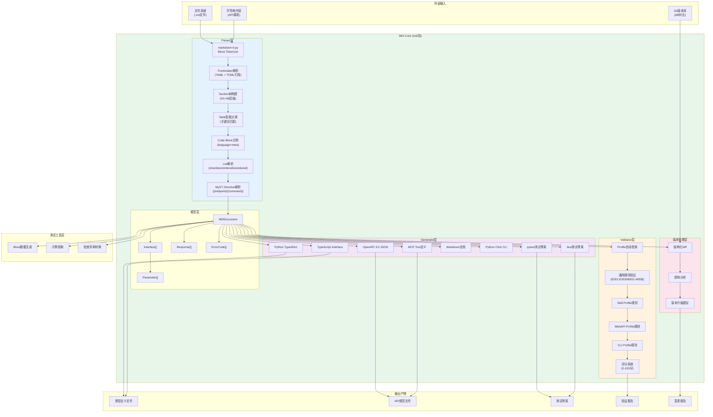
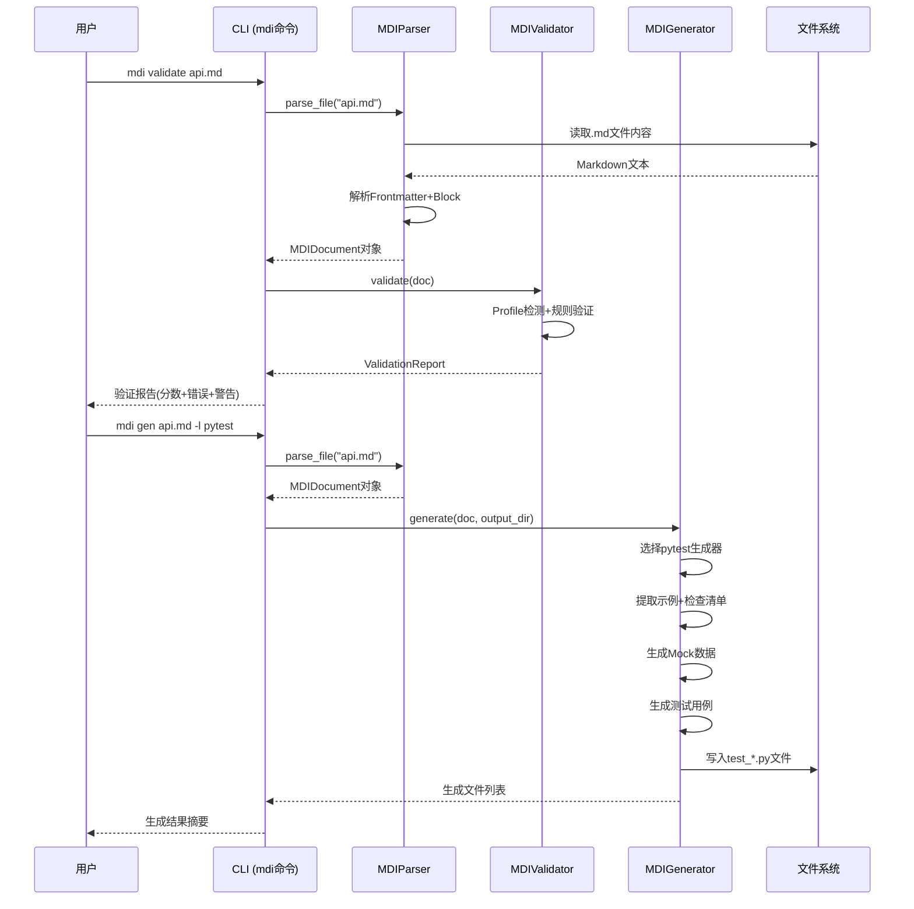
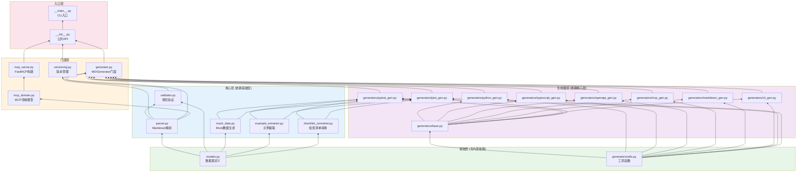

# 技术架构深度解析

## 完整系统架构

## 核心数据流

## 模块依赖关系

---

**下一步阅读**：
- [工具链使用指南](04-toolchain-guide.md) - CLI命令参考、Python API、三种Profile使用指南
- [返回生态对比分析](02-ecosystem-comparison.md)
- [返回索引](../mdi-research-report.md)
