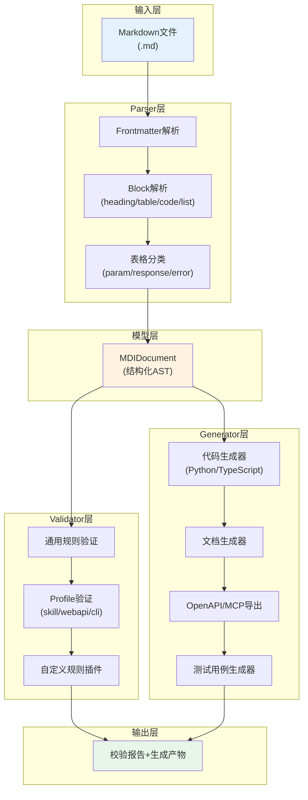
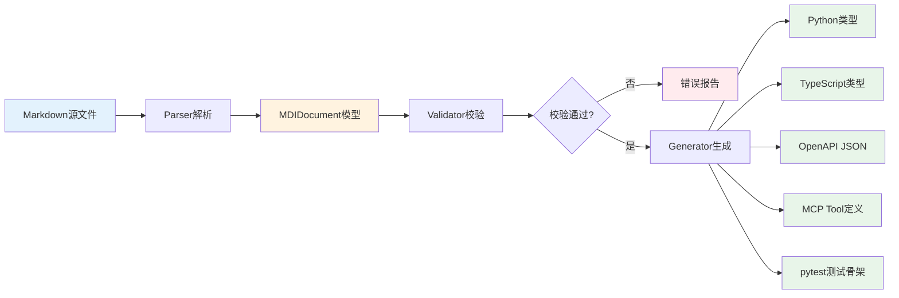
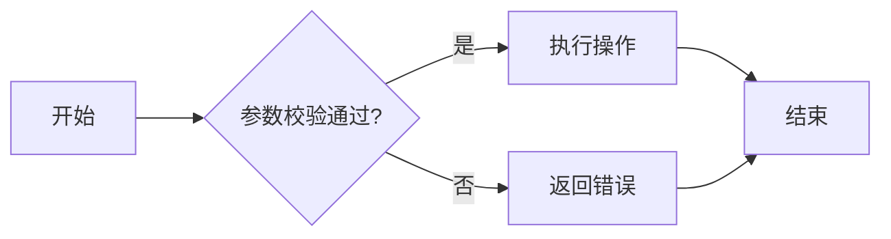
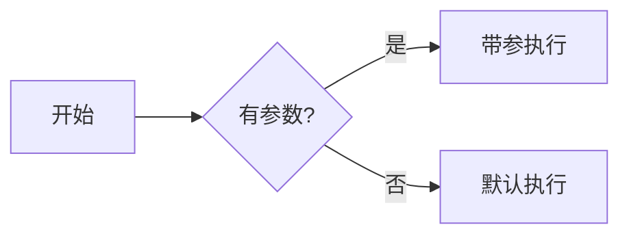
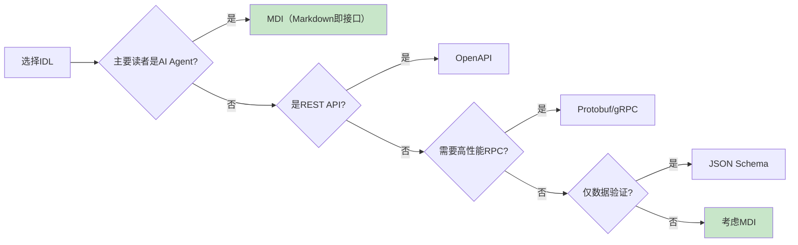

# MDI Spec v1.0：Markdown即接口规范

> 本文档定义Markdown Interface Specification（MDI）v1.0，一种用Markdown文件同时承载人类阅读与机器解析的接口定义语言规范。

## 1. 概述

### 1.1 核心理念

MDI基于"Markdown即接口"模式，利用Markdown的标题层级、表格、代码块、列表等原生语法表达接口定义的结构化信息，实现"一份文档，两种读者"：人类可以自然阅读，机器可以自动解析为结构化接口模型。

### 1.2 三层架构



### 1.3 数据流



## 2. 元数据模型

### 2.1 Frontmatter规范

MDI文件使用YAML格式frontmatter（`---`分隔），这是唯一的标准格式：

```yaml
---
name: user-api
version: 1.0.0
description: "用户管理API接口定义"
type: webapi
baseUrl: https://api.example.com/v1
authors:
  - developer
license: MIT
---
```

**x-toml-ref扩展字段**：通过`x-toml-ref`字段引用外部TOML文件，将其中的键值合并到frontmatter元数据中。适用于从`pyproject.toml`、`Cargo.toml`等已有配置文件读取元数据的场景。

```yaml
---
name: my-cli
description: "CLI工具接口定义"
type: clitool
x-toml-ref: "../../pyproject.toml"
---
```

解析行为：
1. 先解析YAML frontmatter
2. 若存在`x-toml-ref`字段，相对于当前.md文件路径解析TOML文件
3. TOML文件内容合并到元数据中（YAML字段优先级更高，覆盖同名字段）
4. 支持`x-toml-ref: {path: "path/to/file.toml", key: "tool.mdi"}`形式指定TOML中的子键路径

### 2.2 通用必填字段

| 字段 | 类型 | 说明 |
|------|------|------|
| name | string | 接口/工具名称，kebab-case格式，长度不超过64字符 |
| description | string | 功能描述，包含触发词和使用场景说明 |

### 2.3 通用推荐字段

| 字段 | 类型 | 说明 |
|------|------|------|
| version | string | 语义化版本号（如1.0.0） |
| type | string | 文档类型：skill/webapi/clitool |
| authors | list[string] | 作者列表 |
| license | string | 开源协议 |

**正例：**

```yaml
---
name: payment-api
version: 2.1.0
description: "支付服务API，支持支付宝和微信支付"
type: webapi
---
```

**反例：**

```yaml
---
name: PaymentAPI
version: "1"
description: "支付"
---
```

问题：name使用了大驼峰而非kebab-case，version不是语义化格式，description过短缺少上下文。

## 3. Markdown结构映射规则

### 3.1 标题层级映射

| Markdown元素 | MDI模型映射 | 说明 |
|-------------|------------|------|
| H1 (# 标题) | 文档名称 (MDIDocument.title) | 一个文件只能有一个H1 |
| H2 (## 标题) | 顶层Section (Section) | 主要章节划分 |
| H3 (### 标题) | 子Section / 接口定义 | H3在WebAPI Profile下通常是单个接口 |
| H4-H6 | 嵌套子Section | 更深层的内容组织 |

### 3.2 表格映射

表格根据表头关键词自动分类：

**参数表识别关键词**：参数名、名称、name、param、parameter、字段、field、参数、属性

```markdown
| 参数名 | 类型 | 必填 | 说明 |
|--------|------|------|------|
| user_id | string | 是 | 用户ID |
| email | string | 是 | 邮箱地址 |
```

**响应表识别关键词**：状态码、status、响应码、code、返回码

```markdown
| 状态码 | 说明 |
|--------|------|
| 200 | 成功 |
| 404 | 用户不存在 |
```

**错误码表识别关键词**：错误码、error code、errcode、错误

```markdown
| 错误码 | 消息 | 说明 |
|--------|------|------|
| E001 | invalid_token | Token无效 |
```

**正例：**

```markdown
### GET /users/{user_id}

获取用户详情

**参数：**

| 参数名 | 类型 | 必填 | 说明 |
|--------|------|------|------|
| user_id | string | 是 | 用户ID，路径参数 |

**响应：**

| 状态码 | 说明 |
|--------|------|
| 200 | 成功返回用户信息 |
| 404 | 用户不存在 |
```

**反例：**

```markdown
### 获取用户

信息：

| A | B | C |
|---|---|---|
| x | y | z |
```

问题：表头无可识别的关键词，无法判断表格用途。

### 3.3 代码块映射

代码块通过language和meta标注识别用途：

| 标注格式 | purpose | 说明 |
|---------|---------|------|
| ```python example | example | Python示例代码 |
| ```json schema | schema | JSON Schema定义 |
| ```yaml mock | mock | Mock数据 |
| ```bash | example | Shell命令示例 |
| ```mermaid | (图表) | Mermaid流程图/架构图 |
| ```python test | test | 测试用例代码 |

**正例：**

```markdown
**请求示例：**

```json example
{
  "name": "张三",
  "email": "zhangsan@example.com"
}
```

**响应Schema：**

```json schema
{
  "type": "object",
  "properties": {
    "id": {"type": "string"},
    "name": {"type": "string"}
  }
}
```

**反例：**

```markdown
```
some code here
```

问题：未指定language，无法识别用途。

### 3.4 列表映射

| 列表类型 | Markdown语法 | MDI模型映射 |
|---------|-------------|------------|
| 复选框列表 | - [ ] / - [x] | CheckItem（检查清单/验证步骤） |
| 有序列表 | 1. 2. 3. | 执行步骤序列 |
| 无序列表 | - item | 枚举值/触发词/标签列表 |

**正例（安全检查清单）：**

```markdown
## 安全检查清单

- [ ] 执行前验证用户权限
- [ ] 使用dry-run模式预览变更
- [ ] 执行后验证结果
```

**正例（触发词列表）：**

```markdown
## 何时使用本技能

- 链接检查
- 断链修复
- 验证引用有效性
```

### 3.5 Mermaid流程图映射

Mermaid flowchart代码块会被解析为DecisionNode决策树结构，提取节点和连线关系。v1.0仅提取结构（节点ID、标签、连线），不做语义理解。



## 4. 三类场景Profile

### 4.1 Skill Profile（AI Agent Skill）

**适用场景**：定义AI Agent可调用的技能/工具，兼容现有SKILL.md格式。

**必填frontmatter**：name, description

**推荐frontmatter**：version, type, argument-hint, user-invocable, paths, authors, license

**推荐章节**（关键词模糊匹配）：

| 章节Key | 识别关键词 | 必须 |
|---------|-----------|------|
| description | 功能描述、简介、概述 | 是 |
| triggers | 何时使用、触发条件、使用场景 | 是 |
| decision_tree | 决策树、方案选择、流程 | 推荐 |
| steps | 核心步骤、快速开始、使用方法 | 是 |
| safety | 安全检查、检查清单、注意事项 | 是（写操作） |

**description强制措辞**：Skill类型的description必须包含"必须使用"、"Use this skill"、"MUST use"等强制触发措辞之一。

**正例：**

```markdown
---
name: example-skill
version: 1.0.0
description: "当用户提到'示例操作'时，必须使用此技能。执行示例功能。"
type: skill
argument-hint: "<target>"
user-invocable: true
paths: [".agents/scripts/example.py"]
---

# Example Skill

> 本Skill是AI Agent工具（L1索引层）

## 功能描述
执行示例操作的工具。

## 何时使用本技能
- 示例操作
- 演示流程

## 方案选择决策树


## 核心步骤
1. 第一步：准备环境
2. 第二步：执行操作
3. 第三步：验证结果

## 安全检查清单
- [ ] 执行前确认目标路径
- [ ] 使用--dry-run预览
- [ ] 执行后检查输出
```

**反例：**

```markdown
---
name: bad-skill
description: "这是一个工具"
---

# 工具

运行脚本就行。
```

问题：description缺少强制触发措辞，缺少结构化章节，没有安全检查清单。

### 4.2 Web API Profile（RESTful API）

**适用场景**：定义RESTful HTTP API接口。

**必填frontmatter**：name, description, baseUrl

**推荐frontmatter**：version, type, authors, license

**必填章节**：

| 章节Key | 识别关键词 |
|---------|-----------|
| overview | 接口概览、概述、API介绍 |
| auth | 认证、授权、Authentication |
| endpoints | 接口列表、API列表、Endpoints |

每个接口用H3定义，格式为 `### METHOD /path` 或在H3内容中包含HTTP方法+路径。每个接口必须包含参数表和响应表。

**正例：**

```markdown
---
name: user-api
version: 1.0.0
description: "用户管理CRUD API"
type: webapi
baseUrl: https://api.example.com/v1
---

# 用户管理API

## 接口概览
提供用户注册、查询、更新、删除功能。

## 认证方式
使用Bearer Token认证。

## 接口列表

### GET /users

获取用户列表

**参数：**

| 参数名 | 类型 | 必填 | 说明 |
|--------|------|------|------|
| page | integer | 否 | 页码，默认1 |
| limit | integer | 否 | 每页数量，默认20 |

**响应：**

| 状态码 | 说明 |
|--------|------|
| 200 | 成功返回用户列表 |

```json example
{
  "data": [{"id": "u1", "name": "张三"}],
  "total": 100
}
```
```

### 4.3 CLI Tool Profile（命令行工具）

**适用场景**：定义CLI命令行工具的接口。

**必填frontmatter**：name, description

**推荐frontmatter**：version, type, authors, license

**必填章节**：

| 章节Key | 识别关键词 |
|---------|-----------|
| overview | 工具概述、简介 |
| install | 安装方式、安装 |
| commands | 命令列表、Commands、子命令 |

每个子命令用H3定义，包含用法、参数表、示例。

**正例：**

```markdown
---
name: file-cli
version: 1.0.0
description: "文件操作CLI工具"
type: clitool
---

# File CLI

## 工具概述
用于批量处理文件的命令行工具。

## 安装方式
pip install file-cli

## 命令列表

### copy

复制文件

**用法：**
`file-cli copy <source> <dest>`

**参数：**

| 参数名 | 类型 | 必填 | 说明 |
|--------|------|------|------|
| source | string | 是 | 源文件路径 |
| dest | string | 是 | 目标路径 |

**示例：**

```bash example
file-cli copy ./a.txt ./backup/a.txt
```
```

## 5. 扩展机制

### 5.1 自定义Frontmatter字段

使用x-前缀添加自定义字段：

```yaml
---
name: custom-api
x-internal: true
x-rate-limit: 100
---
```

### 5.2 自定义章节类型

使用HTML注释标记章节类型：

```markdown
<!-- section-type: custom-metrics -->
## 性能指标

QPS: 1000
延迟: <50ms
```

### 5.3 自定义验证规则

通过Python插件接口添加验证规则：

```python
from mdi.validator import MDIValidator, ValidationIssue

def custom_rule(doc, source_path):
    issues = []
    if doc.frontmatter.get("x-internal") and not doc.frontmatter.get("x-owner"):
        issues.append(ValidationIssue(
            severity="error",
            code="X001",
            message="内部API必须指定x-owner",
            line=1,
            file=source_path
        ))
    return issues

validator = MDIValidator()
validator.add_rule(custom_rule)
```

### 5.4 自定义代码生成模板

使用Jinja2模板自定义代码生成：

```
templates/
├── python/
│   ├── typed_dict.py.j2
│   └── client.py.j2
└── typescript/
    └── interface.ts.j2
```

## 6. 与现有生态对比

| 特性 | MDI | OpenAPI | JSON Schema | Protobuf |
|------|-----|---------|-------------|----------|
| 人类可读性 | 高（原生Markdown） | 低（YAML/JSON） | 低 | 极低（二进制） |
| 机器可解析 | 中高（AST解析） | 高 | 高 | 极高 |
| 学习成本 | 低（Markdown语法） | 高 | 中 | 高 |
| 类型系统 | 基础类型 | 完整 | 完整 | 完整 |
| 代码生成 | Python/TS/OpenAPI/MCP | 多语言完整 | 多语言 | 多语言 |
| 适用场景 | AI接口、工具门面、文档即代码 | REST API | 数据验证 | 高性能RPC |
| 版本控制友好 | 高（diff友好） | 中 | 中 | 低（二进制） |

**适用场景决策树：**



## 7. 版本历史

| 版本 | 日期 | 变更 |
|------|------|------|
| v1.0 | 2026-07-01 | 初始版本：Parser/Validator/Generator核心工具链，3类Profile，代码生成支持Python/TypeScript/OpenAPI/MCP |
