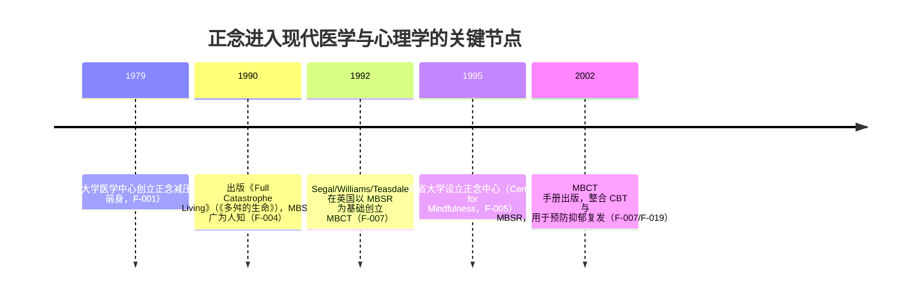

# 01 正念教程：觉察、接纳与当下的科学

> 读完本文你会知道：正念的一句话定义与操作定义原文、1979 年以来的起源沿革、它"到底在练什么"、一个 60 秒就能做的落地练习、实证证据到什么程度、以及最常见的四个误解。

## 0.1 一句话定义

**正念（Mindfulness）= 有目的地、在当下、不加评判地注意（觉察）。**

现代正念的操作定义来自乔恩·卡巴金（Jon Kabat-Zinn），1994 年版原文为：

> "paying attention in a particular way: on purpose, in the present moment, and non-judgmentally"——**有目的地、在当下、不加评判地注意**（F-006）。

修订版在此之上加入觉察要素："经由有目的地、在当下、不加评判地注意当下经验流而升起的**觉察**"（F-006）。

拆开看三个要件（[S11][S12][S13]）：

| 要件 | 含义 | 常见误读 |
|---|---|---|
| **有目的（on purpose）** | 注意是主动选择的，不是被念头牵着走 | "发呆/放空"——那是被动，不是正念 |
| **在当下（in the present moment）** | 注意锚定此刻的身体、呼吸、感受、念头 | "回忆过去/规划未来"——那是思维漫游 |
| **不加评判（non-judgmentally）** | 好坏都是可观察的心理事件，不贴标签、不急着改 | "想开点/别这么消极"——那正是评判 |

## 0.2 起源与沿革



三点沿革事实：

1. **从禅修到临床**：MBSR 取材于内观（vipassana）禅修传统，但以世俗化、去宗教框架的形式呈现；卡巴金是分子生物学博士、并非传统佛教老师（F-003/F-022）。
2. **从门诊到全球**：1979 年的减压门诊发展为麻省大学正念中心，并向全球医院推广（F-005/F-021）。
3. **从减压到认知疗法整合**：1992 年起 MBCT 把正念与认知行为疗法（CBT）结构性整合，用于预防抑郁复发（F-007/F-019/F-020）。

## 0.3 核心机制：正念在练什么

正念训练的核心不是"把念头变好"，而是**改变你与念头的关系**：

| 机制 | 说明 | 对应练习形态 |
|---|---|---|
| **觉察（Awareness）** | 对当下身心经验保持清醒的注意，包括情绪的身体信号 | 身体扫描、呼吸锚点（F-003） |
| **不评判（Non-judging）** | 念头只是升起-停留-消失的心理事件，不归因为"我好/我坏" | 坐姿冥想、正念行走（F-003） |
| **接纳（Acceptance）** | 允许负面体验在场而不与之对抗——"难受就难受，我看着它" | 温和瑜伽、困境中的正念回应（F-003） |
| **去中心化（Decentering）** | 从"我是这个想法"切换到"我有一个想法"的观察者位置 | MBCT 核心练习（F-019） |

> **为什么正念不负责"让你开心"？** 因为目标函数不同：正念的目标是觉察本身（看清事实），不是某个情绪状态。强行把正念当作"积极化工具"，等于让觉察器去做评价器的工作——两者会互相干扰（详见 [03 联系与区别](03-connection-and-differences.md)）。

## 0.4 60 秒落地练习（新人友好版）

> 不需要盘腿、不需要安静房间，随时可做。建议每天 2—3 次，每次 60 秒。

```
步骤1（觉察·20秒）：停下手头的事，闭上眼睛或垂眼。
    问自己："此刻我的身体感觉是什么？"——扫描从头到脚，
    只命名，不评价（如"肩膀紧"而不是"肩膀又出问题了"）。
步骤2（呼吸锚点·20秒）：把注意放在呼吸上，感受吸气与呼气。
    走神了？——正常。发现走神本身就是一次觉察，把注意轻轻带回呼吸。
步骤3（接纳·20秒）：对自己说："现在就是现在，我不需要立刻变好。"
    允许此刻的感受在场，不分析它为什么来，也不赶它走。
```

做完不需要"有效果"——觉察到"我还是很烦"也是成功，因为那是看见，不是压抑（对照 [02 正面教程](02-zheng-mian-positivity.md) 的有毒正能量边界）。

## 0.5 实证证据与边界

**证据（机构/研究团队口径，见 [信源台账](../references/source-inventory.md)）：**

- 麻省大学与 UCI 等机构报道：四十余年研究显示 MBSR 类训练帮助参与者应对**压力、焦虑、疼痛与疾病**（F-008）。
- MBCT 研究团队（Segal/Williams/Teasdale）报告 MBCT **大幅降低**曾患抑郁者的**复发风险**（F-020）——注意：这是研究团队结论口径，原始统计量未在本包内复核。
- MBCT 手册首版采纳卡巴金正念定义，说明"正念+认知技术"整合方案在循证心理学中已有结构化地位（F-019）。

**边界（必须标注的证据等级）：**

| 声称 | 证据等级 | 说明 |
|---|---|---|
| 正念训练与压力/焦虑缓解相关 | 机构综述口径 | 具体效应量未在本包复核 |
| 先接纳后重构顺序更健康 | **机制性顺序假设（L1）** | 有机制逻辑与反模式支撑，非已证因果——见 [03 §0.6](03-connection-and-differences.md) |
| 正念替代药物治疗 | ❌ 无任何依据 | 本包明确不构成医疗建议 |

> **安全边界**：正念练习不能替代心理治疗与精神科治疗。若出现持续的情绪困扰、自伤/伤人念头，请转专业医疗与心理干预，而非继续自我练习。

## 0.6 常见误解

| 误解 | 澄清 |
|---|---|
| 正念 = 放空/不想事 | 正念是主动觉察，不是空白；念头来了就看见它，而不是消灭它 |
| 正念 = 正面思考 | 正念不评判好坏；"往好处想"是评价动作，两者立场相反（[03](03-connection-and-differences.md)） |
| 正念 = 放松技巧 | 放松可能是副产品，不是目标；正念在紧张时依然成立（觉察紧张本身） |
| 正念 = 佛教/宗教 | MBSR 为世俗临床项目，去宗教框架（F-022）；渊源是禅修，但操作不依赖信仰 |

## 0.7 术语速查

| 术语 | 解释 |
|---|---|
| MBSR | 正念减压，1979 年卡巴金创立的 8 周团体课程（F-001/F-002） |
| MBCT | 正念认知疗法，1992 年起由 Segal/Williams/Teasdale 创立，整合 CBT 与 MBSR，预防抑郁复发（F-007） |
| 觉察（Awareness） | 对当下经验保持清醒注意的能力，正念定义的修订版核心词（F-006） |
| 去中心化（Decentering） | 与想法保持距离、观察而非认同的认知姿态（F-019 相关） |
| 身体扫描 | MBSR 经典练习：注意力系统游走身体各部位，只觉察不评判（F-003） |

## 0.8 下一步阅读

- 理解另一极："正面/积极心态"是什么、科学方法与有毒边界 → [02 正面与积极心态教程](02-zheng-mian-positivity.md)
- 对比二者并拿到整合方法 → [03 联系与区别](03-connection-and-differences.md)
- 核查每条事实出处 → [信源台账](../references/source-inventory.md)
