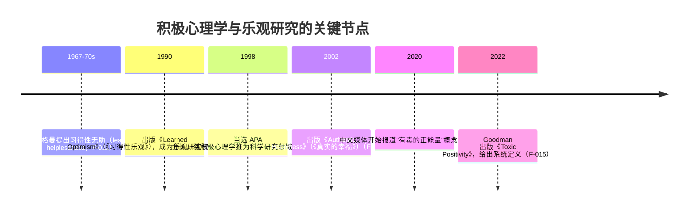

# 02 正面与积极心态教程：从习得性乐观到有毒正能量边界

> 读完本文你会知道："正面/积极心态"在三种语境里各指什么、积极心理学的科学起点、两个可执行的科学方法（ABCDE 与认知重评）、一个 60 秒落地练习、以及最重要的——**有毒正能量**的边界在哪。

## 0.1 一句话定义与语境分层

**"正面/积极心态"不是单一学术概念，而是三种语境的重叠**（⚠️ 本包按 V 审查修正后的口径，显式分层）：

| 语境 | 指什么 | 科学性 |
|---|---|---|
| 日常用语 | "积极一点""往好处想""正能量"——一种态度劝诫 | 非学术概念 |
| 积极心理学 | 研究积极情绪、投入、意义、成就与关系的科学领域（PERMA） | 有科学建制（F-010） |
| 认知技术 | 习得性乐观（ABCDE）、认知重评——改变想法的**可操作技术** | 有明确操作步骤（F-013） |

> **为什么必须先分层？** 因为日常用语中的"正面"往往是模糊的劝诫，容易被滥用成"否认感受"；而积极心理学与认知技术是有边界的科学方法。把三层混为一谈，"积极心态"就从技术滑向话术（详见 0.5 有毒正能量）。

## 0.2 起源与沿革



三点沿革事实：

1. **从"无助"到"乐观"**：塞利格曼先研究习得性无助（人如何学会绝望），后转向习得性乐观（人如何学会乐观）——正面技术的科学起点是"反绝望"（F-011）。
2. **制度化的转折点**：1998 年当选 APA 会长后，积极心理学才成为建制化研究领域；塞利格曼自述起点与花园里女儿 Nikki 的对话相关（F-009/F-014）。
3. **近年的反面校正**：2020—2022 年"有毒正能量"进入公共讨论并成书——正面文化过度扩张后，学界与临床开始划边界（F-015/F-016）。

## 0.3 核心方法 1：习得性乐观 ABCDE

塞利格曼的习得性乐观建立在归因风格上：悲观者把坏事归因为**永久、普遍、个人化**，乐观者把坏事归因为**暂时、局部、外部化**。可操作的驳斥模型为 ABCDE（F-013）：

| 步骤 | 含义 | 示例（面试被拒后） |
|---|---|---|
| **A** Adversity 逆境 | 客观事件 | "简历被筛掉了" |
| **B** Belief 信念 | 自动出现的解释 | "我能力不行，永远找不到工作" |
| **C** Consequence 后果 | 信念带来的情绪与行为 | 沮丧、放弃投递 |
| **D** Disputation 驳斥 | 用证据质疑信念 | "前两周有 3 个面试邀约，这次是岗位匹配问题" |
| **E** Energization 激发 | 更准确的信念带来的新状态 | 恢复投递，针对岗位调整简历 |

> **注意 D 步的本质**：驳斥（Disputation）**必须基于证据**，不是"往好处想"——这正是它与有毒正能量（0.5）的分水岭（[S09][S16]）。

## 0.4 核心方法 2：认知重评（Cognitive Reappraisal）

认知重评是情绪调节研究中的经典策略（**经典文献**：Gross 1998 情绪调节过程模型，未在本包联网复核，作机制引用）：在情绪发生前或早期，重新解释情境的意义，从而改变情绪反应。

与 ABCDE 的关系：ABCDE 重写"对事件归因"，认知重评重写"对情境意义的解释"——两者都是**评价性技术**（先评价、再改写），这正是它与正念的立场差异（见 [03 联系与区别](03-connection-and-differences.md) 的七维度对照）。

## 0.5 核心边界：有毒正能量（Toxic Positivity）

**定义**（Whitney Goodman，2022，F-015）：

> "无论境况如何都被要求一直保持快乐的持续压力"——它是我们施加给自己和他人的压力。

**关键澄清**（F-018）：**积极本身没有毒性**，有毒的是对困境真实反应的**否定性回应**。

常见有毒形态（F-017）：

| 形态 | 例子 |
|---|---|
| 忽视困难事实 | "想开点，事情没那么糟"（事实被跳过） |
| 压抑不愉快感受 | "不许哭，哭是软弱" |
| 为创伤强行找意义 | 任何坏事都被套上"这是让你成长" |
| 把糟糕事件合理化 | 明明是损失，硬说"塞翁失马" |

**判断口诀**：一句话若以"不许难受 / 别想太多 / 这没什么 / 往好处想"开头，且**没有先承认感受**，即标记为有毒正能量话术——正确的替代是"先承认，再重构"（[03 §0.6](03-connection-and-differences.md)）。

## 0.6 60 秒落地练习（新人友好版）

> ABCDE 的微型版：三栏驳斥。需要纸笔或便签。

```
第一栏「事实」：写下发生了什么（只写可验证的事实，30秒）
第二栏「我的解释」：写下脑海里自动冒出的解释（20秒）
第三栏「证据检查」：给解释找反证——
    ① 有什么证据支持它？② 有什么证据反对它？
    ③ 如果朋友有同样遭遇，我会这样评价他吗？（10秒）
完成后：若第三栏找到反证，重写解释为"更准确的版本"，
        并在心里默念一遍（这就是 D→E 步）。
```

若三栏做完发现"找不到反证"（事实确实支持消极解释），说明此刻需要的不是重构，而是接纳与行动方案——回到 [01 正念教程 §0.4](01-zheng-nian-mindfulness.md) 先做觉察接纳，再决定下一步。

## 0.7 常见误解

| 误解 | 澄清 |
|---|---|
| 积极 = 永远开心 | 健康的乐观承认负面情绪存在，只是不放大它的归因 |
| 积极 = 否认负面 | 否认即有毒正能量的起点（F-017） |
| 乐观 = 盲目乐观 | ABCDE 的 D 步强制证据核查，乐观建立在事实修正上（F-013） |
| 积极心理学 = 心灵鸡汤 | 它是 1998 年起的建制化研究领域，有干预与测量（F-009/F-010） |

## 0.8 术语速查

| 术语 | 解释 |
|---|---|
| PERMA | 积极心理学五要素：积极情绪、投入、意义、成就、健康关系（F-010） |
| 习得性乐观 | 塞利格曼提出的乐观可训练观点，1990 年成书（F-011/F-012） |
| ABCDE | 逆境→信念→后果→驳斥→激发 的五步驳斥模型（F-013） |
| 认知重评 | 情绪调节经典策略：重新解释情境意义（经典文献 Gross 1998） |
| 有毒正能量 | 要求无论境况如何都保持快乐的压力，否定真实感受（F-015） |

## 0.9 下一步阅读

- 理解另一极：正念是什么、怎么练 → [01 正念教程](01-zheng-nian-mindfulness.md)
- 对比二者并拿到整合方法 → [03 联系与区别](03-connection-and-differences.md)
- 核查每条事实出处 → [信源台账](../references/source-inventory.md)
