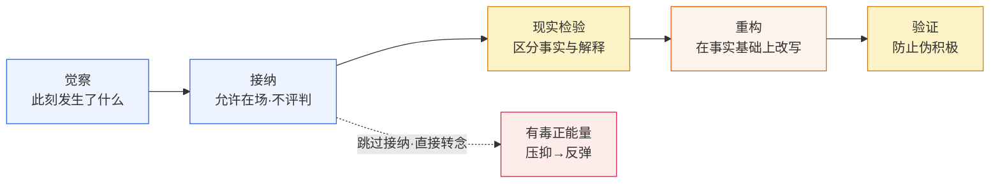

# 03 正念与正面（积极心态）的联系与区别：看见 vs 改写

> 读完本文你会知道：一张七维度对照表、三个最关键的分界点、为什么两者能互补又会冲突、以及可立即执行的「先接纳后重构」五步整合方法（含 60 秒练习与反模式）。

## 0.1 一句话结论

**正念是「看见」，正面是「改写」**：正念不评判地觉察当下的一切（包括坏的），正面则有选择地把注意与认知转向积极面。一个讲接纳，一个讲筛选——底层态度几乎相反；但顺序上互补：**先接纳后重构**是健康路径，跳过接纳的硬转积极就是有毒正能量（F-015/F-018）。

## 0.2 七维度对照表

| 维度 | 正念（Mindfulness） | 正面（Positive / 积极心态） | 事实依据 |
|---|---|---|---|
| 一句话 | "此刻发生了什么？"——看见 | "往好处想。"——改写 | F-006 / F-013 |
| 本质 | 有目的地、在当下、不加评判地注意 | 有选择地评价与重构认知（ABCDE/认知重评） | F-006 / F-013 |
| 对负面情绪 | 允许在场，观察它升起与消退，不与它对抗 | 尽快替换成积极想法（"别想坏的，想好的"） | F-006 / F-015 |
| 评判立场 | 非评判——好坏都只是升起的心理事件 | 本身就是评价活动——贴标签并筛选 | F-006 / F-013 |
| 时间方向 | 锚定当下此刻 | 偏向前方：目标、期待、希望 | F-006 / F-010 |
| 追求目标 | 觉察本身，不追求特定情绪状态 | 达成积极情绪与认知（乐观、能量、意义） | F-006 / F-009~F-010 |
| 过头风险 | 被误用为逃避现实的"放空" | 有毒正能量：压抑真实感受、否认事实 | F-015~F-017 |

## 0.3 三个最关键的分界点

**分界点 1：对负面体验的态度——"允许" vs "替换"**
正念的操作定义锚定"不加评判地注意"（F-006），负面体验被允许在场；正面技术（ABCDE 的 D 步）的本质是替换解释（F-013）。分界即：**这个动作是在容纳，还是在替换**。

**分界点 2：是否在评判——非评判 vs 评价筛选**
正念本身就是非评判的觉察；正面本身就是一种评价筛选活动（对体验贴"正面/负面"标签）。所以"保持正面"无法靠正念实现，反过来，正念冥想也不是在给自己打气。

**分界点 3：时间方向——此刻 vs 前方**
正念锚定当下（呼吸、身体、此刻的念头）；正面偏向前方（目标、期待、希望）。这也解释了为什么两者在"未来导向"的任务（备考、晋升）中，正面技术更直接。

## 0.4 关系图：互补与冲突



**互补（健康顺序）**：先正念接纳，再正面重构——接纳让重构不再自欺，乐观才立得住。MBCT 本身即是"正念+认知技术"的结构化整合实例（F-007/F-019）。

**冲突（有毒正能量）**：跳过接纳直接硬转积极（"不许难受，往好处想"），负面情绪不是被消解而是被压抑，之后往往反弹得更猛（F-015~F-018）。

## 0.5 联系：三个共同点

1. **共享靶标**：两者都反自动负性思维——正念通过"看见它而不认同"削弱其控制力（F-006），正面通过"驳斥它"直接修改内容（F-013）。
2. **都可训练**：正念是练习（MBSR/MBCT，F-001/F-007），乐观也是"习得性"的（learned optimism，F-011）——都不依赖天赋。
3. **临床已整合**：MBCT 把两者结构性整合用于抑郁复发预防（F-007/F-019），证明二者不是互斥路线，而是可编排的两类动作。

## 0.6 整合模式操作版：先接纳后重构（Accept-Then-Reframe）

> 模式定义、边界与成熟度见 [知识包入口 §3](../index.md)。本页为可执行操作版。

### 五步流程

| 步 | 动作 | 时长参考 | 关键检查 |
|---|---|---|---|
| ① 觉察 | 命名此刻的体验："我现在感到焦虑/愤怒/难过"，不分析不评价 | 20 秒 | 是否只命名、没解释"为什么" |
| ② 接纳 | 允许它在场，观察身体感受与念头，用呼吸锚点，不与之对抗 | 30—60 秒 | 是否在"看着它"而不是"赶走它" |
| ③ 现实检验 | 把事实与解释分开，逐条问"有证据支持吗" | 1—2 分钟 | 是否区分了"事件"与"我编的故事" |
| ④ 重构 | 在事实基础上选择更准确的解释或更可行的行动（ABCDE 的 D-E / 认知重评） | 1—2 分钟 | 新解释是否有证据、可证伪 |
| ⑤ 验证 | 检查重构是否仍否定真实感受；通不过则退回② | 30 秒 | 是否出现"否认—压抑—反弹"迹象 |

### 反模式速查（五条）

1. **跳过接纳直接转念** → 有毒正能量（压抑真实感受，F-015）。
2. **把觉察误读为认同** → 看见情绪 ≠ 沉浸其中；觉察者始终在观察位。
3. **重构脱离事实** → 不核查证据的"往好处想" = 伪积极（对照 F-013 的 D 步）。
4. **把正念当放空/逃避** → 用冥想回避问题，而非面对问题。
5. **顺序颠倒（先重构后接纳）** → 重构变成对感受的否定，丧失现实基础。

### 检验标准

- 重构后的语句能通过事实核查（有证据、可证伪）；
- 负面情绪强度下降或可承受性提高；
- 全程未使用否定感受的话术（"不许难受/别想太多"类）；
- 完成一轮后仍无法重构时，接受"此刻不需要重构"，转为接纳+行动方案。

### 60 秒微缩版

```
① 命名此刻感受（20s）→ ② 呼吸锚点允许它在场（20s）
→ ③ 问一句"有证据吗"（15s）→ ④ 在证据上换个说法（5s）
```

### 场景速查：一句话到底属于哪个动作

| 常见话术 | 本质动作 | 正确归属 |
|---|---|---|
| "我注意到我现在很焦虑" | 觉察 | 正念 |
| "焦虑就焦虑吧，我看着它" | 接纳 | 正念 |
| "证据支持我失败了吗？" | 现实检验 | 衔接 |
| "这次是匹配问题，不是我不行" | 重构 | 正面技术 |
| "不许难受，想开点！" | 否定感受 | 有毒正能量（应替换为①②③④） |

## 0.7 下一步阅读

- 正念的机制、练习与证据 → [01 正念教程](01-zheng-nian-mindfulness.md)
- 积极心理学的技术、边界与有毒正能量 → [02 正面与积极心态教程](02-zheng-mian-positivity.md)
- 核查每条事实出处 → [信源台账](../references/source-inventory.md)
- 让 Agent 按规范处理同类问题 → [mindfulness-positivity Skill](../../../../.agents/skills/mindfulness-positivity/SKILL.md)
