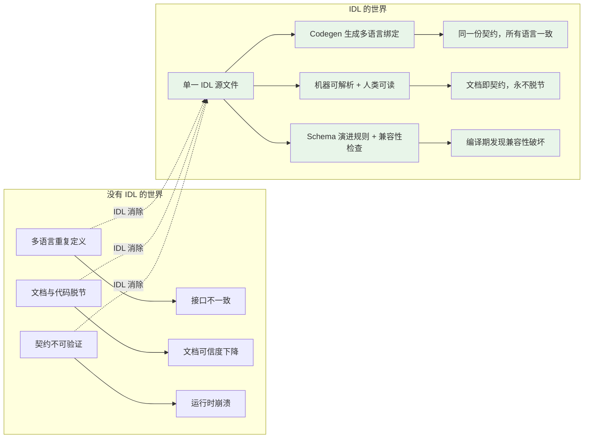
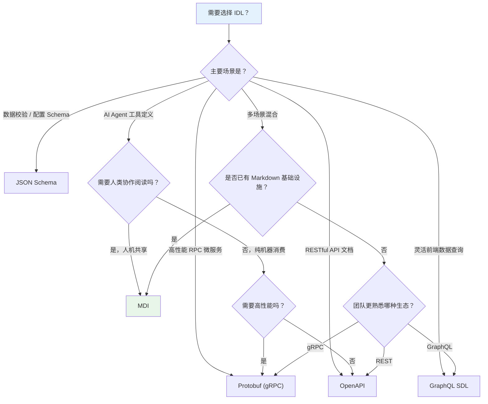

# 01、IDL：接口描述语言

## 概念模板

| 字段 | 内容 |
|------|------|
| **名称** | IDL (Interface Definition Language) |
| **分类层** | 元概念层 (Meta) |
| **核心定义** | 定义"如何定义接口"的元语言。IDL 是一种声明式的领域特定语言（DSL），以语言中立和平台中立的方式描述软件组件间的接口契约——包括数据结构、方法签名、错误码、流式契约等，并通过编译器自动生成多目标语言的桩代码与骨架代码。 |
| **解决的问题** | 提供了统一的方式描述接口的结构、行为和数据格式，使不同语言和平台能够共享接口定义。在没有 IDL 的情况下，每个语言/平台需要各自维护一份接口定义，导致重复劳动、不一致风险和维护成本线性增长。IDL 将"接口契约"提升为单一事实源（SSOT），从源头消除多语言协作中的接口歧义。 |
| **关键属性** | `name`（接口名称）、`syntax_type`（语法类型：proto/thrift/openapi/graphql/mdi）、`version`（语义化版本号）、`schema_format`（Schema 格式）、`target_audience`（目标读者：human/machine/both） |
| **关系** | `describes` → 所有概念（Interface, API, ABI, Protocol, Implementation, MCP, ACP, A2A, ANP, MDI） |
| **MyST Directive** | ` ```{idl} name="..." version="..." ``` ` |
| **MDI 示例** | 见下方"与 MDI 的关系"章节 |

## IDL 的核心价值

### 为什么需要 IDL

在分布式系统和多语言协作场景中，接口定义面临三个核心痛点：

1. **多语言重复定义**：同一个服务接口需要在 Go、Java、Python、TypeScript 等语言中各自声明一次，任何变更都需要同步修改所有语言的定义，极易产生不一致。
2. **文档与代码脱节**：接口文档（Markdown/Wiki/Confluence）与代码实现分别维护，随着迭代演进，文档很快过时，最终无人信任。
3. **契约不可验证**：口头约定或自然语言文档无法被机器解析和校验，接口兼容性破坏只能在运行时发现，代价高昂。

IDL 通过"契约优先"（Contract-First）模式解决这三个问题：



### IDL 的三重价值

| 价值维度 | 说明 | 典型场景 |
|---------|------|---------|
| **契约标准化** | 将接口定义固化为可解析的文本，成为团队间协作的"法律文件" | 前后端 API 约定、跨团队 RPC 契约 |
| **自动化生成** | 从 IDL 自动生成客户端 SDK、服务端骨架、文档、Mock、测试用例 | gRPC 从 `.proto` 生成多语言桩代码 |
| **兼容性保障** | 通过 Schema 演进规则（如 Protobuf 的字段编号不可变）在编译期检测兼容性破坏 | 服务升级时确保老客户端不受影响 |

## 主流 IDL 对比

| 维度 | **OpenAPI** | **Protobuf** | **GraphQL SDL** | **JSON Schema** | **MDI** |
|------|------------|-------------|----------------|-----------------|--------|
| **语法格式** | YAML / JSON | `.proto` 自定义语法 | SDL (Schema Definition Language) | JSON | MyST Markdown |
| **目标读者** | 人类 + 机器 | 机器优先 | 人类 + 机器 | 机器优先 | **人类 + 机器（同等优先）** |
| **类型系统** | JSON Schema 类型 + 扩展 | 标量/枚举/消息/oneof/map | Scalar/Object/Enum/Union/Interface | string/number/object/array 等 7 种基础类型 | 表格驱动，TypeScript 兼容 |
| **生态工具** | Swagger UI/Editor/Codegen, Prism Mock | protoc, buf, grpc-gateway | Apollo, Relay, GraphiQL, graphql-codegen | ajv, jsonschema2pojo, openapi-to-json-schema | Parser/Validator/Generator 三件套 |
| **AI 友好度** | 中（YAML 结构清晰但冗长） | 低（二进制协议，语法对 LLM 不够友好） | 中（SDL 简洁但类型系统特殊） | 中（机器可读性强但人类可读性弱） | **高（Markdown 原生格式，LLM 训练数据中最常见的结构化文本）** |
| **最佳场景** | RESTful API 文档与 Mock | 高性能 RPC 微服务通信 | 灵活的前端数据查询 | 数据校验与配置 Schema | AI Agent 工具定义、人机共享接口契约 |

### 对比解读

- **OpenAPI** 是 REST 生态的事实标准，文档生成能力最强，但 YAML 冗长，对 AI 训练语料占比不高。
- **Protobuf** 是 gRPC 生态的核心，二进制高性能，但语法面向机器，人类直接阅读体验不佳，AI 友好度低。
- **GraphQL SDL** 在灵活查询场景优势明显，但类型系统与 REST/RPC 差异大，学习成本高。
- **JSON Schema** 专精数据校验，但纯 JSON 格式对人类编辑不友好，缺少文档叙事能力。
- **MDI** 在 AI 友好度上具有独特优势：Markdown 是 LLM 训练数据中占比最高的结构化文本格式，表格和标题层级天然适合表达接口的层次结构，且"一份文档两种读者"的设计理念使其在人机协作场景中无可替代。

## IDL 选型决策树



### 决策树解读

决策树的核心逻辑：**先看场景，再看人机协作需求，最后考虑现有基础设施**。

- 高性能 RPC 场景下 Protobuf 是首选，其二进制序列化性能无可匹敌。
- AI Agent 工具定义场景是 MDI 的核心优势区，Markdown 原生格式使其在 LLM 训练语料中天然占优。
- 多场景混合时，优先考虑是否已有 Markdown 基础设施（如文档系统、CI/CD 中的 Markdown 解析链路），如有则 MDI 可无缝集成。

## 在统一化体系中的位置

IDL 位于四层分类架构的**元概念层（Meta）**，是整个体系的逻辑起点。

```
┌─────────────────────────────────────────────────────────────────┐
│                      元概念层 (Meta)                             │
│  ┌───────────────────────────────────────────────────────────┐  │
│  │  IDL (接口描述语言)                        ← 你在这里      │  │
│  │  "如何定义接口的元语言"                                     │  │
│  │  └── describes ──────────────────────────────────────┐    │  │
│  └──────────────────────────────────────────────────────│───┘  │
├────────────────────────────────────────────────────────│──────┤
│                   设计抽象层 (Design)                    │      │
│  Interface · Protocol · Implementation · API · ABI     │      │
│  ┌─ 被 IDL 描述 ───────────────────────────────────────┘      │
├────────────────────────────────────────────────────────────────┤
│                   协议实例层 (Instance)                          │
│  MCP (L1) · ACP (L2) · A2A (L3) · ANP (L4)                   │
│  ┌─ 被 IDL 描述（作为 Protocol 的实例）                         │
├────────────────────────────────────────────────────────────────┤
│                     载体层 (Carrier)                            │
│  MDI                                                            │
│  ┌─ 是 IDL 的一种具体实现，同时承载所有概念的定义                  │
└────────────────────────────────────────────────────────────────┘
```

### 核心关系：describes

在统一化体系中，IDL 与所有其他概念之间是 `describes`（描述）关系：

| 被描述的概念 | 描述内容 | 示例 |
|-------------|---------|------|
| **Interface** | 行为契约的抽象声明 | 定义接口包含哪些方法、每个方法的签名和语义 |
| **API** | 可调用方法端点 | 定义 REST 端点、请求参数、响应格式、错误码 |
| **ABI** | 二进制兼容性约定 | 定义数据结构的字节布局、对齐规则、调用约定 |
| **Protocol** | 完整通信规则集 | 定义消息格式、握手序列、状态机、流控规则 |
| **Implementation** | 接口/协议的具体编码 | 通过 IDL 生成桩代码，约束实现必须遵循契约 |
| **MCP / ACP / A2A / ANP** | 具体协议实例 | 定义每种 Agent 协议的消息格式、能力声明、传输层 |
| **MDI** | 承载格式 | MDI 是 IDL 在 MyST Markdown 上的具体实现 |

IDL 不定义"接口是什么"，而是定义"如何描述接口"。它是元语言（meta-language），其他概念是它描述的对象语言（object language）。

## 与 MDI 的关系

### MDI 是 IDL 的具体实现

MDI（Markdown Document Interface）是本体系中的 IDL 具体实现。如果说 IDL 是"接口描述语言"这个抽象概念，MDI 就是基于 MyST Markdown 语法落地的一套具体 IDL 方言。

```
IDL (抽象概念) ──具体实现──→ MDI (基于 MyST Markdown)
                         ──具体实现──→ Protobuf (基于 .proto 语法)
                         ──具体实现──→ OpenAPI (基于 YAML/JSON)
                         ──具体实现──→ GraphQL SDL (基于 SDL 语法)
```

### MDI 的最小可行示例

下面是一个使用 MDI 描述工具接口的最小示例，展示了 MDI 如何同时服务人类阅读和机器解析：

```markdown
---
name: weather-tool
version: 1.0.0
description: "天气查询工具，支持按城市名查询实时天气"
type: skill
---

# Weather Tool

## 功能描述

查询指定城市的实时天气信息，返回温度、湿度、天气状况等数据。

## 参数

| 参数名 | 类型 | 必填 | 说明 |
|--------|------|------|------|
| city | string | 是 | 城市名称，支持中文和英文 |
| units | string | 否 | 温度单位：metric（摄氏度）/ imperial（华氏度），默认 metric |

## 返回结果

| 字段 | 类型 | 说明 |
|------|------|------|
| temperature | number | 当前温度 |
| humidity | number | 湿度百分比 |
| condition | string | 天气状况描述 |
```

对比等价的 Protobuf 定义：

```protobuf
syntax = "proto3";
service WeatherService {
  rpc GetWeather (WeatherRequest) returns (WeatherResponse);
}
message WeatherRequest {
  string city = 1;
  optional string units = 2;
}
message WeatherResponse {
  double temperature = 1;
  double humidity = 2;
  string condition = 3;
}
```

MDI 版本的优势在于：人类可以直接阅读完整的 Markdown 文档（包括参数说明、使用场景），而 Protobuf 版本需要额外的文档层才能被人类理解。同时，MDI 的 Markdown 格式使其在 LLM 训练语料中占比远高于 Protobuf 的 `.proto` 语法，AI 对 MDI 的理解准确度更高。

## 章节导航

| 章节 | 内容 |
|------|------|
| [README](README.md) | 入口索引、四层架构、概念速查表 |
| [00 - 总览](00-overview.md) | 可行性分析、架构图、关系全景 |
| **01 - IDL**（本章） | 接口描述语言：元概念层定义 |
| [02 - Interface](02-interface.md) | 接口：行为契约的抽象声明 |

<!-- changelog -->
- 2026-07-04 | spec | 初始创建：IDL 概念文档，基于 spec:myst-unified-interface-ecosystem