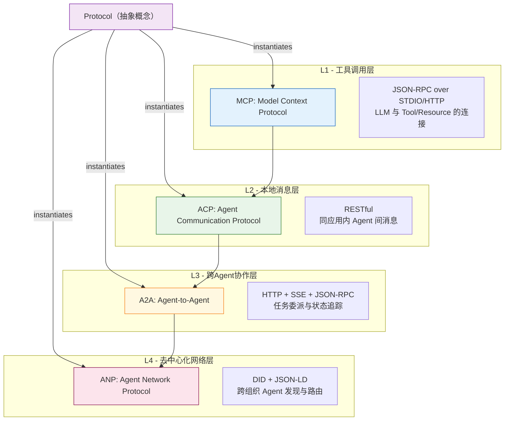

# 05、Protocol：通信协议

## 概念模板

| 字段 | 内容 |
|------|------|
| **名称** | Protocol（通信协议） |
| **分类层** | 设计抽象层 (Design) |
| **核心定义** | 完整的通信规则集，定义"如何传输与交互" |
| **解决的问题** | 定义通信双方的消息格式、交互顺序、状态管理和错误处理规则 |
| **关键属性** | `name`、`version`、`message_format`、`interaction_pattern`、`state_model`、`security_model`、`transport` |
| **关系** | composes → API + ABI；instantiates → MCP/ACP/A2A/ANP；described-by → IDL；carried-by → MDI |
| **MyST Directive** | `{protocol} type="..." version="..."` |
| **MDI 示例** | `{protocol} type="JSON-RPC" version="2024-11-05"` 包裹握手流程、消息格式、状态机定义 |

## 核心定义

Protocol 是设计抽象层中**最具组合性**的概念。如果说 API 定义了单个方法怎么调用，ABI 定义了数据怎么编码，Protocol 则定义了**完整的交互生命周期**：如何握手、如何发现能力、如何委派任务、如何流式返回结果、如何处理错误、如何终止会话。

Protocol 组合了 API 和 ABI（composes → API + ABI），同时作为抽象概念实例化为四个具体的协议标准（instantiates → MCP/ACP/A2A/ANP）。这是整个体系中唯一同时具有"向上组合"和"向下实例化"关系的概念。

## Protocol 与 API 的本质区别

| 维度 | API | Protocol |
|------|-----|----------|
| **关注范围** | 单个方法端点 | 完整交互生命周期 |
| **状态管理** | 无状态（每个请求独立） | 有状态（会话/任务状态机） |
| **消息序列** | 单次请求-响应 | 多轮消息交换（握手→调用→通知→终止） |
| **能力协商** | 不涉及 | 握手阶段协商版本和能力 |
| **错误处理** | 单次错误码 | 会话级错误恢复和重试策略 |
| **安全模型** | 端点级认证（API Key/OAuth） | 会话级认证（DID、TLS、互认） |

一个直观的理解：**MCP 的 `tools/call` 既是一个 API 方法，也是 MCP Protocol 的一部分**。当你关注"这个方法怎么传参、返回什么格式"时，你在看 API；当你关注"调用前需要握手吗？失败了怎么重试？怎么通知进度？整个会话生命周期如何管理？"时，你在看 Protocol。

## Protocol 的四层协议栈视角

统一化生态体系将 Protocol 映射到四层 Agent 协议栈，从底层工具调用到顶层去中心化网络：



### 四层协议定位

| 协议 | 层级 | API 风格 | 传输层 | 核心场景 |
|------|------|---------|--------|---------|
| **MCP** | L1 工具调用 | JSON-RPC 2.0 | STDIO/HTTP/SSE | LLM 连接外部 Tool/Resource/Prompt |
| **ACP** | L2 本地消息 | RESTful | HTTP | 同进程/同应用内 Agent 间消息 |
| **A2A** | L3 跨Agent协作 | JSON-RPC + Task 生命周期 | HTTP + SSE | 不同 Agent 间任务委派与协作 |
| **ANP** | L4 去中心化网络 | JSON-LD + DID | P2P/HTTP | 跨组织/公网 Agent 发现与可信通信 |

## 协议的关键要素：以 MCP initialize 握手为例

```
Client → Server: initialize (protocolVersion, capabilities, clientInfo)
Server → Client: InitializeResult (protocolVersion, capabilities, serverInfo)
Client → Server: initialized (通知握手完成)
--- 握手完成，此后才可调用其他 API ---
Client → Server: tools/list (获取所有 Tool Interface)
Server → Client: Tool 列表（含 inputSchema）
Client → Server: tools/call (name, arguments)
Server → Client: Tool 执行结果
```

这个交互序列展示了 Protocol 的六个关键要素：
1. **语法（Syntax）**：消息格式为 JSON-RPC 2.0
2. **语义（Semantics）**：`initialize` 表示握手，`tools/call` 表示调用工具
3. **时序（Timing）**：必须先握手，再调用；握手未完成前其他请求应被拒绝
4. **状态管理**：会话从"未初始化"→"已初始化"→"活跃"→"终止"
5. **能力协商**：握手阶段交换 `capabilities`，确认双方支持的功能
6. **错误处理**：协议级错误（如 `-32602 Invalid params`）与业务级错误（如 Tool 执行失败）分层处理

## 章节导航

| 章节 | 内容 |
|------|------|
| [00 - 总览](00-overview.md) | 可行性分析、架构图、关系全景 |
| [01 - IDL](01-idl.md) | 接口描述语言：元概念层定义 |
| [02 - Interface](02-interface.md) | 接口：行为契约的抽象声明 |
| [03 - API](03-api.md) | 应用程序编程接口：可调用方法端点 |
| [04 - ABI](04-abi.md) | 应用程序二进制接口：二进制兼容约定 |
| [05 - Protocol](05-protocol.md) | 协议：完整通信规则集（当前章节） |
| [06 - Implementation](06-implementation.md) | 实现：接口/协议的具体编码 |
| [07 - MCP](07-mcp.md) | Model Context Protocol：Agent↔Tool 连接 |
| [08 - ACP](08-acp.md) | Agent Communication Protocol：本地 P2P |
| [09 - A2A](09-a2a.md) | Agent-to-Agent：跨组织协作 |
| [10 - ANP](10-anp.md) | Agent Network Protocol：去中心化网络 |
| [11 - MDI](11-mdi.md) | Markdown Document Interface：载体层 |
| [12 - 关系全景](12-relationships.md) | 7 类关系定义、关系矩阵、交互场景 |

<!-- changelog -->
- 2026-07-04 | spec | 初始创建：Protocol 通信协议定义与四层协议栈映射