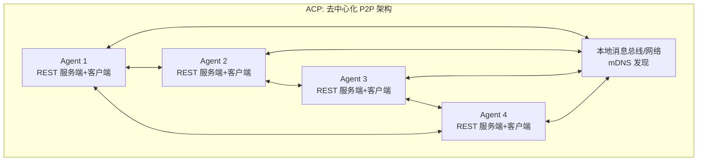

# 08、ACP：Agent Communication Protocol

## 概念模板

| 字段 | 内容 |
|------|------|
| **名称** | ACP（Agent Communication Protocol，Agent 通信协议） |
| **分类层** | 协议实例层 (Instance) |
| **核心定义** | 本地环境下 Agent 间去中心化 P2P 通信协议，Agent 生态的"局域网 Wi-Fi"，协议栈 L2 层 |
| **解决的问题** | 同设备/本地子网内多 Agent 的低延迟、零 SDK 依赖的 P2P 通信，支持气隙/离线环境下的自主运行 |
| **关键属性** | version: `2025-03`; transport: `REST HTTP` / `gRPC` / `ZeroMQ` / `IPC`; message_format: `REST + JSON` / `OpenAPI`; architecture: `去中心化 P2P`; security: `DID + 本地 RBAC`; discovery: `mDNS`; governance: `Linux 基金会 AI & Data`; initiator: `IBM Research / BeeAI 社区` |
| **关系** | `instantiates` → Protocol; `described-by` → IDL; `carried-by` → MDI |
| **MyST Directive** | `{protocol} type="acp"` |
| **MDI 示例** | 见下文"MDI 示例"章节 |

## 1. 协议概述

ACP 由 IBM Research 与 BeeAI 社区于 2025 年 3 月联合发布，现由 Linux 基金会 AI & Data 进行中立治理。ACP 是专注于本地优先、边缘部署和企业内网环境的 Agent 间对等通信协议，与 A2A 的跨网广域定位形成互补。

### 核心定位：本地横向 P2P 层

ACP 解决的是**同一环境内多 Agent 如何高效对等通信**的问题——类比局域网 Wi-Fi，让本地 Agent 能自动发现彼此、直接通信，无需中央调度器，也不需要外网连接。

## 2. 设计哲学

### 零 SDK 依赖

ACP 最核心的设计哲学是不强制使用任何 SDK。开发者使用任意 HTTP 客户端（curl、Postman、浏览器、wget）即可完成集成，大幅降低接入门槛，特别适合资源受限环境和非标准技术栈。

### 本地优先（Local-first）

- **无云依赖**：不依赖任何云服务或外部注册中心
- **气隙环境支持**：完全离线环境（Air-gapped）下可正常工作
- **数据主权**：所有通信和数据保留在本地环境
- **自主运行**：即使网络完全断开，本地 Agent 间仍可协作

### 去中心化 P2P

Agent 之间直接通信，无需中央消息代理。每个 Agent 既是服务提供者也是服务消费者，网络拓扑随 Agent 上下线动态调整。

## 3. 架构设计

ACP 采用去中心化 P2P 架构，与 MCP 的 Client-Server 模式形成对比：



### 架构特性对比（vs MCP）

| 特性 | MCP 架构 | ACP 架构 |
|------|---------|---------|
| 拓扑结构 | 中心化星形 | 网状 P2P |
| 中心节点 | 有（Client/Host） | 无 |
| 通信方向 | Client→Server 单向调用 | Agent 间双向对等 |
| 角色划分 | Client/Server 固定 | 每个 Agent 兼具双角色 |
| 单点故障 | Client 故障影响全局 | 单个 Agent 下线不影响网络 |

## 4. 关键概念

### Agent Card

每个 Agent 通过 Agent Card 描述自身能力、端点和元数据。与 A2A 的关键区别：ACP 的 Agent Card 支持**静态打包分发**，可嵌入 Docker 镜像、部署包或配置文件，Agent 未运行时也能被发现（离线发现）。

### mDNS 本地发现

使用 mDNS（组播 DNS）实现零配置局域网发现，类似 AirPrint、Chromecast 的机制。Agent 启动时广播自身服务，其他 Agent 无需预先知道 IP 地址即可自动发现。

### Task 生命周期

四状态简单状态机：`created` → `running` → `completed` / `failed`。支持异步执行模式。

### 传输协议（灵活多选）

| 传输方式 | 适用场景 | 延迟 | 依赖 |
|---------|---------|------|------|
| RESTful HTTP | 主要方式，通用场景 | 低 | 网络栈 |
| gRPC | 高性能、低延迟场景 | 极低 | HTTP/2 |
| ZeroMQ | 分布式消息、高吞吐 | 极低 | 独立库 |
| 本地总线/IPC | 同设备进程间通信 | 最低 | 操作系统 |

## 5. Interface / API / ABI 在 ACP 中的体现

### Interface（契约层）

ACP 的 Interface 体现为 **Agent Card**——每个 Agent 通过 Agent Card 声明其 `capabilities`（能力列表）、`inputTypes`（接受的输入 MIME 类型）、`outputTypes`（产出的输出 MIME 类型）。这构成了 Agent 间协作的行为契约。

### API（方法端点层）

ACP 的 API 体现为 **RESTful 端点集**。核心端点：

| 方法 | 路径 | 用途 |
|------|------|------|
| GET | `/agent-card` | 获取 Agent 能力描述 |
| POST | `/tasks` | 创建新任务 |
| GET | `/tasks/{id}` | 查询任务状态和结果 |
| DELETE | `/tasks/{id}` | 取消/删除任务 |
| GET | `/tasks` | 列出所有任务 |
| POST | `/messages` | 发送即时消息（可选） |

### ABI（二进制兼容层）

ACP 的 ABI 体现为 **MIME 类型协商 + 传输协议绑定**：
- `text/plain`：纯文本消息
- `application/json`：结构化 JSON 数据
- `application/octet-stream`：二进制数据
- `multipart/form-data`：多部分混合消息
- 传输绑定：REST HTTP 方式使用标准 HTTP 语义，gRPC 方式使用 Protocol Buffers 序列化

## 6. 与 A2A 的对比

| 对比维度 | ACP（本地优先） | A2A（跨平台） |
|---------|----------------|--------------|
| 架构模式 | 去中心化 P2P | Client-Server |
| 传输协议 | REST/gRPC/ZeroMQ/IPC 多选 | 强制 HTTP/HTTPS + JSON-RPC + SSE |
| SDK 依赖 | 零 SDK，原生 HTTP 即可 | 需要官方 SDK |
| 发现机制 | mDNS 本地广播 + 离线静态发现 | Well-Known URI 动态发现 |
| 气隙支持 | 原生支持 | 需要额外配置 |
| 安全模型 | DID + 本地 RBAC | 企业级 OAuth 2.0/OIDC |
| 延迟 | 极低（本地/IPC） | 中高（跨网络） |
| 核心类比 | AI 的局域网 Wi-Fi | AI 的互联网 HTTP |

## 7. MDI 示例

```markdown
---
mdi_version: "1.0"
profile: "Protocol"
id: "example-acp-agent"
title: "Image Processor ACP Agent"
protocol: "acp"
---
# Image Processor ACP Agent

{protocol} type="acp"

## Agent Card

{agent_card}
- **name**: image-processor
- **version**: 1.0.0
- **capabilities**: resize, crop, convert, filter
- **endpoints**: rest=http://localhost:8081, grpc=localhost:8082
- **inputTypes**: image/png, image/jpeg
- **outputTypes**: image/png, image/webp
{/agent_card}

## Tasks

{task} name="resize"
### Input
- `width` (number, required): 目标宽度
- `height` (number, required): 目标高度
- `imageUrl` (string, required): 源图片 URL

### Output
- `resultUrl` (string): 处理后的图片 URL
{/task}
```

## 章节导航

| 章节 | 内容 |
|------|------|
| [00 - 总览](00-overview.md) | 可行性分析、架构图、关系全景 |
| [05 - Protocol](05-protocol.md) | 协议：完整通信规则集（ACP 的抽象父概念） |
| [07 - MCP](07-mcp.md) | Model Context Protocol：Agent↔Tool 连接 |
| [08 - ACP](08-acp.md) | Agent Communication Protocol：本地 P2P（当前） |
| [09 - A2A](09-a2a.md) | Agent-to-Agent：跨组织协作 |
| [10 - ANP](10-anp.md) | Agent Network Protocol：去中心化网络 |
| [11 - MDI](11-mdi.md) | Markdown Document Interface：载体层 |
| [12 - 关系全景](12-relationships.md) | 7 类关系定义、关系矩阵、交互场景 |

<!-- changelog -->
- 2026-07-04 | spec | 初始创建：ACP 协议在 MyST 统一化生态体系中的概念定义