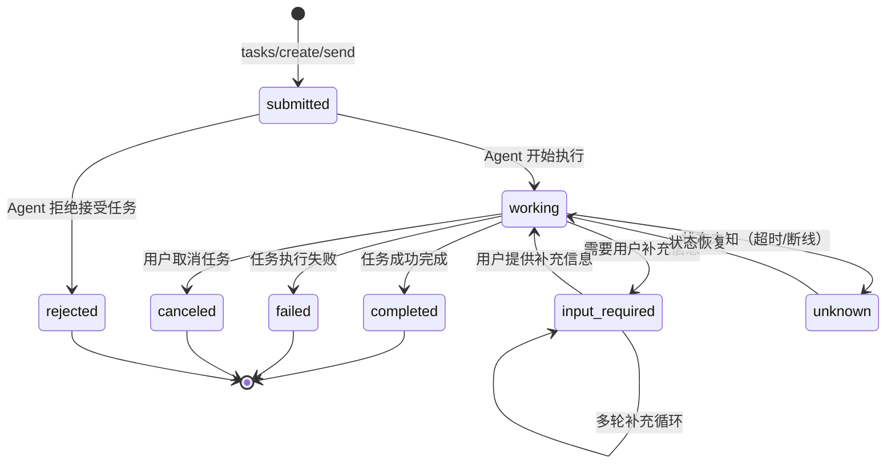

# 09、A2A：Agent-to-Agent

## 概念模板

| 字段 | 内容 |
|------|------|
| **名称** | A2A（Agent-to-Agent Protocol，智能体间协议） |
| **分类层** | 协议实例层 (Instance) |
| **核心定义** | 跨组织、跨厂商的 Agent 间协作协议，Agent 生态的"HTTP"，协议栈 L3 层 |
| **解决的问题** | 跨信任域、跨企业的 Agent 协作，支持长时任务、多轮交互、企业级安全，实现不同厂商 Agent 无需定制集成即可互操作 |
| **关键属性** | version: `2025-04`; transport: `HTTP/HTTPS 强制`; message_format: `JSON-RPC 2.0`; architecture: `Client-Server`; security: `OAuth 2.0 / OIDC`; task_model: `丰富状态机 + input-required`; discovery: `Well-Known URI`; governance: `Linux 基金会`; initiator: `Google`; ecosystem: `150+ 组织支持` |
| **关系** | `instantiates` → Protocol; `described-by` → IDL; `carried-by` → MDI |
| **MyST Directive** | `{protocol} type="a2a"` |
| **MDI 示例** | 见下文"MDI 示例"章节 |

## 1. 协议概述

A2A 由 Google 于 2025 年 4 月在 Cloud Next 大会上正式发布，2025 年 6 月捐赠给 Linux 基金会。目前已获得 150+ 组织支持，覆盖 Atlassian、Salesforce、SAP、LangChain、CrewAI 等主流企业和 AI 框架，是生态增长最快的 Agent 通信协议。

### 核心定位：跨网横向协作层

A2A 被业界类比为"Agent 时代的 HTTP"——HTTP 解决了 Web 服务器之间如何通信，A2A 解决了 Agent 之间如何通信。两者都基于成熟的 Web 标准（HTTP、JSON），都设计为跨平台、跨语言的开放标准。

## 2. 五大设计原则

| 原则 | 说明 |
|------|------|
| **拥抱智能体能力** | Agent 不共享内部实现，仅通过 Agent Card 声明能力，支持非确定性交互和多轮对话 |
| **基于现有标准** | 构建在 HTTP/HTTPS、JSON-RPC 2.0、SSE、OAuth 2.0/OIDC 之上，不重新发明轮子 |
| **默认安全** | 生产强制 HTTPS、内置 OAuth 2.0/OIDC、企业级 IdP 集成、细粒度权限控制 |
| **支持长时任务** | 原生支持小时级甚至天级的长时任务，支持暂停、恢复、人工介入 |
| **模态无关** | 不绑定特定模态，原生支持文本、结构化数据、文件（图片/文档/音频）混合消息 |

## 3. 核心数据模型

A2A 定义了五大核心对象：

| 对象 | 说明 | 关键特征 |
|------|------|---------|
| **Agent Card** | 服务发现元数据，通过 `/.well-known/agent.json` 发布 | 描述能力、技能、认证要求 |
| **Task** | 核心交互单元，有状态的协作任务 | 完整生命周期状态机，支持多轮交互 |
| **Message** | 对话中的一条消息 | 包含 role（user/agent）和 parts 数组 |
| **Part** | 消息内容单元 | 三种子类型：TextPart / DataPart / FilePart |
| **Artifact** | 任务产物，执行结果工件 | 附加名称和描述，标识输出语义 |

## 4. 任务状态机

A2A 定义了丰富的 Task 状态机，这是区别于简单 RPC 协议的核心特征：



### 状态说明

| 状态 | 说明 | 是否终态 |
|------|------|---------|
| `submitted` | 任务已提交，等待 Agent 接受 | 否 |
| `working` | 任务执行中 | 否 |
| `input-required` | Agent 需要更多信息才能继续，等待用户输入 | 否 |
| `completed` | 任务成功完成，包含最终产物 | 是 |
| `failed` | 任务执行失败，包含错误信息 | 是 |
| `canceled` | 任务被用户或 Agent 取消 | 是 |
| `rejected` | Agent 拒绝接受该任务 | 是 |
| `unknown` | 任务状态未知（网络超时、Agent 重启） | 否 |

`input-required` 状态是 A2A 区别于简单 RPC 的重要特性——任务执行过程中可以多次要求用户补充信息，实现多轮对话式协作。

## 5. Interface / API / ABI 在 A2A 中的体现

### Interface（契约层）

A2A 的 Interface 体现为 **Agent Card**——每个 Agent 通过 `/.well-known/agent.json` 发布其能力声明，包括：
- `capabilities`：支持的协议特性（流式、推送通知、状态历史）
- `skills`：技能列表（技能 ID、名称、描述、输入/输出模态）
- `authentication`：认证方式配置（OAuth 端点、Scopes）

### API（方法端点层）

A2A 的 API 体现为 **JSON-RPC 2.0 方法集**，核心 Task API：

| 方法 | 用途 | 交互模式 |
|------|------|---------|
| `tasks/send` | 同步发送任务，等待结果 | 同步请求/响应 |
| `tasks/sendSubscribe` | 发送任务并订阅 SSE 流式更新 | SSE 流式 |
| `tasks/create` | 创建异步任务，提供 Webhook 回调 | Push Notification |
| `tasks/get` | 查询任务状态和结果 | 拉取 |
| `tasks/cancel` | 取消正在执行的任务 | 控制 |

### ABI（二进制兼容层）

A2A 的 ABI 体现为 **JSON + HTTP** 的严格约束：
- **数据格式**：所有消息必须为合法 JSON-RPC 2.0，Part 的 FilePart 支持 Base64 内嵌或 URI 引用
- **传输绑定**：强制 HTTP/HTTPS，消息通过标准 HTTP POST 传递，认证凭证通过 `Authorization` Header 传递
- **流式编码**：SSE 方式使用 `text/event-stream` MIME 类型，按 SSE 标准帧格式推送

## 6. 企业级安全特性

A2A 面向跨组织协作场景，从设计之初就内置企业级安全：

| 安全特性 | 实现方式 |
|---------|---------|
| 传输加密 | 强制 HTTPS/TLS 1.2+ |
| 身份认证 | OAuth 2.0 / OIDC（推荐）、API Key、mTLS |
| 权限控制 | OAuth Scope 精细授权（如 `task:read`、`task:write`） |
| 审计日志 | 所有交互可追溯、可审计 |
| 租户隔离 | 多租户场景下的数据隔离 |
| 速率限制 | 防止滥用和拒绝服务攻击 |

## 7. MDI 示例

```markdown
---
mdi_version: "1.0"
profile: "Protocol"
id: "example-a2a-agent"
title: "Customer Support A2A Agent"
protocol: "a2a"
---
# Customer Support A2A Agent

{protocol} type="a2a"

## Agent Card

{agent_card}
- **name**: customer-support-agent
- **url**: https://api.example.com/a2a
- **version**: 1.0.0
- **capabilities**: streaming, pushNotifications, stateTransitionHistory
- **authentication**: oauth2 (scopes: ticket:read, return:write)
{/agent_card}

## Skills

{skill} id="ticket-query"
### Description
根据工单号或客户信息查询工单状态。

### Input Modes
- text

### Output Modes
- text, json
{/skill}

{skill} id="return-processing"
### Description
处理客户退换货申请，需要上传凭证图片。

### Input Modes
- text, image

### Output Modes
- text
{/skill}
```

## 章节导航

| 章节 | 内容 |
|------|------|
| [00 - 总览](00-overview.md) | 可行性分析、架构图、关系全景 |
| [05 - Protocol](05-protocol.md) | 协议：完整通信规则集（A2A 的抽象父概念） |
| [07 - MCP](07-mcp.md) | Model Context Protocol：Agent↔Tool 连接 |
| [08 - ACP](08-acp.md) | Agent Communication Protocol：本地 P2P |
| [09 - A2A](09-a2a.md) | Agent-to-Agent：跨组织协作（当前） |
| [10 - ANP](10-anp.md) | Agent Network Protocol：去中心化网络 |
| [11 - MDI](11-mdi.md) | Markdown Document Interface：载体层 |
| [12 - 关系全景](12-relationships.md) | 7 类关系定义、关系矩阵、交互场景 |

<!-- changelog -->
- 2026-07-04 | spec | 初始创建：A2A 协议在 MyST 统一化生态体系中的概念定义