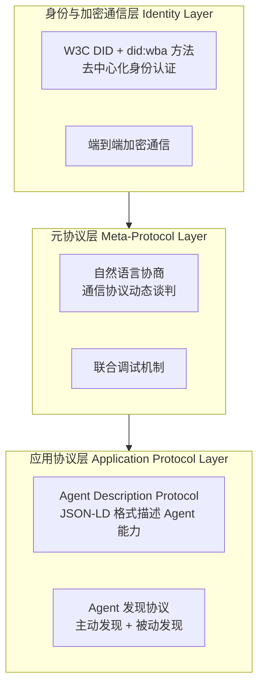

# 10、ANP：Agent Network Protocol

## 概念模板

| 字段 | 内容 |
|------|------|
| **名称** | ANP（Agent Network Protocol，智能体网络协议） |
| **分类层** | 协议实例层 (Instance) |
| **核心定义** | 开放公网中无预置信任的 Agent 发现与协作协议，Agent 生态的"互联网"，协议栈 L4 层 |
| **解决的问题** | 去中心化公网环境下的 Agent 身份验证、服务发现和价值交换——当没有中心化注册中心、没有统一身份提供商、没有预置信任关系时，Agent 如何安全地发现彼此、验证身份、建立信任并进行价值交换 |
| **关键属性** | version: `早期探索`; message_format: `JSON-LD + DID/VC`; architecture: `去中心化网络`; security: `W3C DID + VC 去中心化信任链`; discovery: `去中心化发现（DHT/区块链等）`; maturity: `TRL 2-3（规范制定阶段）`; standardization: `IETF Internet-Draft（draft-zyyhl-agent-networks-framework-01）` |
| **关系** | `instantiates` → Protocol; `described-by` → IDL; `carried-by` → MDI |
| **MyST Directive** | `{protocol} type="anp"` |
| **MDI 示例** | 见下文"MDI 示例"章节 |

## 1. 协议概述

ANP 是面向去中心化 Agent 网络与开放 Agent 市场的新兴协议，旨在解决完全开放的公网环境中 Agent 之间的发现、身份验证、信任建立与经济协作问题。ANP 被业界类比为"Agent 经济的互联网层"——类似 TCP/IP 为互联网提供基础通信能力，ANP 试图为开放的 Agent 经济提供去中心化的信任与协作基础设施。

### 当前成熟度

> **重要说明**：ANP 处于规范制定阶段（TRL 2-3），已发布技术白皮书、ADP 规范草案和 IETF Internet-Draft，但生态尚未成熟。建议当前阶段跟踪研究，不急于生产落地。

## 2. 为什么需要 ANP

MCP、ACP、A2A 三层协议已覆盖大部分场景，但在完全开放的公网 Agent 网络中仍存在四个根本性挑战：

| 挑战 | 现有协议局限 | ANP 的解决思路 |
|------|-------------|---------------|
| **Agent 发现** | A2A 依赖 Well-Known URI 或中心化目录；ACP 仅限本地 mDNS | 去中心化发现机制（DHT/区块链），不依赖单一控制点 |
| **跨信任域身份** | A2A 依赖 OAuth/OIDC 中心化 IdP；ACP 基于本地信任 | W3C DID 自主主权身份，`did:wba` 方法，无需中心化 IdP |
| **可信协作** | 依赖预置信任关系或平台背书 | VC（可验证凭证）+ 去中心化声誉系统，无预置信任 |
| **价值交换** | 不涉及 | 原生支持 Agent 间微支付、自动结算、经济激励 |

## 3. 核心技术基础

ANP 构建在 W3C 去中心化 Web 标准之上：

### W3C DID（去中心化标识符）

每个 Agent 拥有自己的 DID 作为网络上的唯一身份标识。ANP 定义了自定义 DID 方法 **did:wba**（Web-Based Agent）：

```
did:wba:example.com:user:alice
```

| 特性 | 说明 |
|------|------|
| 方法名 | `wba`（Web-Based Agent） |
| 标识格式 | `did:wba:<domain>:<path>:<identifier>` |
| DID Document 存储 | 通过 HTTPS Web 端点访问，无需区块链 |
| 认证方式 | DID Document 中的公钥 + 签名验证 |

### Verifiable Credentials（可验证凭证）

VC 是 W3C 推荐标准，用于构建去中心化信任链：
- 认证机构给合规 Agent 颁发"合规凭证"
- 过往用户给服务良好的 Agent 颁发"声誉凭证"
- Agent 之间可互相验证凭证，无需中心化平台背书

### ANP 三层协议架构



| 层级 | 职责 | 核心技术 |
|------|------|---------|
| 身份与加密通信层 | 跨平台身份认证、安全通信 | W3C DID + did:wba + 端到端加密 |
| 元协议层 | 协议动态协商、自然语言谈判 | AI 原生协商（Agent 用自然语言协商通信协议） |
| 应用协议层 | Agent 能力描述与发现 | ADP + JSON-LD |

**元协议层**是 ANP 的独特创新——传统协议预先定义固定通信格式，ANP 允许 Agent 通过自然语言动态协商通信协议，甚至通过 AI 代码生成实时适配对方接口。

## 4. Interface / API / ABI 在 ANP 中的体现

### Interface（契约层）

ANP 的 Interface 体现为 **ADP（Agent Description Protocol）文档**——基于 JSON-LD 的 Agent 能力描述，包含 `products`（产品/服务列表）、`interfaces`（接口定义，支持自然语言接口和结构化接口）、`securityDefinitions`（认证方式）。使用 schema.org 词汇确保语义互操作性。

### API（方法端点层）

ANP 的 API 尚在规范制定中，核心概念包括：
- **Agent 发现 API**：主动发现（查询分布式域目录）和被动发现（广播注册）
- **ADP 查询端点**：获取 Agent 的 JSON-LD 能力描述文档
- **元协议协商**：通过自然语言动态协商通信协议和服务条款

### ABI（二进制兼容层）

ANP 的 ABI 体现为 **JSON-LD + DID/VC 签名** 的组合约束：
- **数据格式**：所有描述文档使用 JSON-LD 格式，`@context` 定义语义命名空间
- **身份证明**：基于 DID Document 中的公钥进行签名验证，确保消息来源可验证
- **凭证格式**：VC 使用 W3C 标准格式，包含发行方签名、持有者信息和凭证声明

## 5. 与 ACP/A2A 的关系

ANP 不是替代 ACP 或 A2A，而是在它们之上叠加去中心化能力：

| 层级 | 协议 | 网络环境 | 信任模型 | 发现机制 |
|------|------|---------|---------|---------|
| L4 | **ANP** | 开放公网 | 去中心化信任链（DID/VC） | 去中心化发现 |
| L3 | A2A | 跨组织/跨厂商 | 预置信任/OAuth 企业认证 | Well-Known URI |
| L2 | ACP | 本地子网/内网 | 本地信任/气隙环境 | mDNS 广播 |
| L1 | MCP | 本地/远程 | API Key/OAuth | 直接配置 Server 地址 |

ANP 可以看作是为 A2A（或 ACP）的跨域协作增加了一层去中心化的"安全壳"——当你在完全开放的公网中与陌生 Agent 交互时，ANP 提供身份验证、信任建立和激励机制；当你在企业内部或已知合作伙伴之间协作时，直接使用 A2A 即可，不需要 ANP。

## 6. 理性评估：跟踪但不急于生产落地

### 当前进展

- 技术白皮书已发布，定义了三层协议架构
- ADP 规范草案已发布，基于 JSON-LD + schema.org
- did:wba DID 方法规范已定义
- IETF Internet-Draft 已提交（中国移动/中国电信/中国联通/华为联合推进）
- MIT 许可证开源，社区活跃

### 仍面临的挑战

- 规范仍在草案阶段，API 和格式可能随版本演进调整
- 生态尚未成熟，缺少大规模生产部署案例和成熟 SDK
- 元协议层的自然语言协商机制在实际场景中的效果待验证
- 与现有协议的整合方式仍在探索中

### 对 ANP 的正确态度

- **应该做**：关注 W3C DID/VC 标准进展、跟踪 ANP 社区讨论、做原型验证和技术储备
- **不应该做**：在生产系统中重度依赖、基于尚未定型的规范做大规模架构投入、过早优化去中心化场景

## 7. MDI 示例

```markdown
---
mdi_version: "1.0"
profile: "Protocol"
id: "example-anp-agent"
title: "AI Assistant ANP Agent"
protocol: "anp"
---
# AI Assistant ANP Agent

{protocol} type="anp"

## Agent Description (ADP)

{adp}
- **@type**: ad:AgentDescription
- **did**: did:wba:example.com:user:alice
- **name**: SmartAssistant
- **version**: 1.0.0
- **security**: didwba (header: Authorization)
- **products**:
  - AI Assistant Pro: 高端 AI 助手，提供高级定制服务
- **interfaces**:
  - NaturalLanguageInterface: YAML 协议，url=https://example.com/api/nl-interface.yaml
  - StructuredInterface: YAML 协议，humanAuthorization=true
{/adp}
```

## 章节导航

| 章节 | 内容 |
|------|------|
| [00 - 总览](00-overview.md) | 可行性分析、架构图、关系全景 |
| [05 - Protocol](05-protocol.md) | 协议：完整通信规则集（ANP 的抽象父概念） |
| [07 - MCP](07-mcp.md) | Model Context Protocol：Agent↔Tool 连接 |
| [08 - ACP](08-acp.md) | Agent Communication Protocol：本地 P2P |
| [09 - A2A](09-a2a.md) | Agent-to-Agent：跨组织协作 |
| [10 - ANP](10-anp.md) | Agent Network Protocol：去中心化网络（当前） |
| [11 - MDI](11-mdi.md) | Markdown Document Interface：载体层 |
| [12 - 关系全景](12-relationships.md) | 7 类关系定义、关系矩阵、交互场景 |

<!-- changelog -->
- 2026-07-04 | spec | 初始创建：ANP 协议在 MyST 统一化生态体系中的概念定义