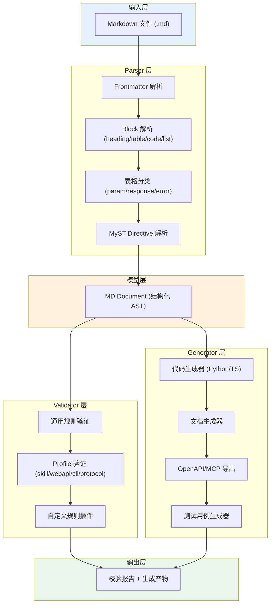
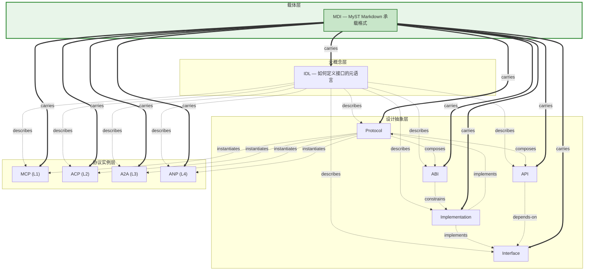

# 11、MDI：Markdown Document Interface

## 概念模板

| 属性 | 内容 |
|------|------|
| **名称** | MDI (Markdown Document Interface) |
| **分类层** | 载体层 (Carrier) |
| **核心定义** | 基于 MyST Markdown 的 IDL 具体承载格式，用 Markdown 文件同时承载人类阅读与机器解析的接口定义 |
| **解决的问题** | 提供一种低学习成本、高可读性、AI 友好的接口定义格式，消除接口定义与文档之间的"文档漂移"问题 |
| **关键属性** | version, type (skill/webapi/clitool/protocol), name, description, profile_specific_fields |
| **关系** | carries → 所有概念 (IDL/Interface/API/ABI/Protocol/Implementation/MCP/ACP/A2A/ANP); described-by → IDL; 是 IDL 的具体承载实现 |
| **MyST Directive** | `{mdi} profile="..."` 声明文档级别归属；各概念对应 directive 见下文清单 |
| **MDI 示例** | 见下方 [完整 MDI 文档示例](#完整-mdi-文档示例) |

## MDI 的核心设计理念

MDI 的设计哲学可概括为"**一份文档，两种读者**"：

- **人类读者**：Markdown 是开发者最熟悉的文档格式，无需学习新 IDL 语法即可阅读和理解接口定义。GitHub/VS Code 原生渲染，diff 友好，版本控制友好。
- **机器读者**：通过 MyST directive、YAML frontmatter、结构化表格等机制，解析器可从 Markdown 中提取完整的结构化接口模型 (MDIDocument AST)，驱动代码生成、文档生成、验证检查等自动化流程。

这一理念的根本价值在于消除"文档漂移"——传统开发流程中接口规范文档与实现代码是两个独立产物，随时间推移必然产生不一致。MDI 让接口定义本身成为唯一的真相源 (Single Source of Truth)，实现代码、文档、测试骨架均从同一份 MDI 文件派生。

## MDI 四层架构

MDI 的工程实现遵循四层架构，从 Markdown 源文件到最终产出物形成完整工具链。该架构源自 MDI Spec v1.0 的核心设计（详见 [mdi-spec-v1.0.md](../mdi-spec-v1.0.md)）：



**核心数据流**：Markdown 源文件 → Parser 解析为 MDIDocument AST → Validator 按 Profile 规则校验 → Generator 生成目标产物（类型定义、API 规范、测试骨架、验证报告）。

## 四种 Profile 介绍

MDI 通过 Profile 机制适配不同接口定义场景。v1.0 定义了三种 Profile，v2.0 新增 Protocol Profile：

| Profile | 类型标识 | 适用场景 | 必填字段 | 核心章节 |
|---------|---------|---------|---------|---------|
| **Skill** | `skill` | AI Agent 可调用的技能/工具定义 | name, description | 功能描述、触发条件、步骤、安全检查 |
| **WebAPI** | `webapi` | RESTful HTTP API 接口定义 | name, description, baseUrl | 接口概览、认证方式、接口列表 |
| **CLI Tool** | `clitool` | 命令行工具接口定义 | name, description | 工具概述、安装方式、命令列表 |
| **Protocol** | `protocol` | 通信协议定义（v2.0 新增） | name, description, version | 协议概述、消息格式、状态机、安全模型 |

**Skill Profile** 面向 AI Agent 场景，兼容现有 SKILL.md 格式，description 必须包含强制触发措辞（如"必须使用"）。**WebAPI Profile** 面向 REST API 场景，每个接口用 H3 定义 (`### METHOD /path`)，包含参数表和响应表。**CLI Tool Profile** 面向命令行工具，每个子命令用 H3 定义。**Protocol Profile** 是 v2.0 新增，面向通信协议定义，支持 MCP/ACP/A2A/ANP 等协议实例的描述。

## 完整的 MyST Directive 清单

MyST Markdown 的 directive 机制是 MDI 实现概念→文档映射的核心。每个统一化体系中的概念对应一个 MyST directive：

| Directive | 对应概念 | 用途 | 示例 |
|-----------|---------|------|------|
| `{mdi}` | MDI 文档声明 | 声明当前文件为 MDI 文档，指定 Profile | `{mdi} profile="skill"` |
| `{interface}` | Interface | 定义行为契约的抽象声明 | `{interface} name="UserService"` |
| `{api}` | API | 定义可调用的方法端点 | `{api} method="GET" path="/users/{id}"` |
| `{abi}` | ABI | 定义二进制兼容性约定 | `{abi} arch="x86_64" calling="cdecl"` |
| `{protocol}` | Protocol | 定义完整通信规则集 | `{protocol} name="MCP" version="2024-11-05"` |
| `{implementation}` | Implementation | 声明接口/协议的具体实现 | `{implementation} of="UserService" lang="python"` |
| `{idl}` | IDL | 声明 IDL 元语言定义 | `{idl} name="MDI" version="2.0"` |

**Directive 使用示例**：

````markdown
---
name: user-service
type: webapi
version: 1.0.0
description: "用户管理服务 API"
---

{mdi} profile="webapi"

# 用户管理 API

## 接口概览

{interface} name="UserService"
提供用户注册、查询、更新、删除功能。

## 接口列表

### GET /users/{id}

{api} method="GET" path="/users/{id}"
获取用户详情。

**参数：**

| 参数名 | 类型 | 必填 | 说明 |
|--------|------|------|------|
| id | string | 是 | 用户唯一标识 |

**响应：**

| 状态码 | 说明 |
|--------|------|
| 200 | 成功返回用户信息 |
| 404 | 用户不存在 |

```json schema
{
  "type": "object",
  "properties": {
    "id": {"type": "string"},
    "name": {"type": "string"},
    "email": {"type": "string"}
  }
}
```

### 实现

{implementation} of="UserService" lang="python"
Python 实现参见 `src/services/user_service.py`。

{implementation} of="UserService" lang="typescript"
TypeScript 实现参见 `src/services/userService.ts`。
````

## MDI 作为统一化体系承载层的角色

在 MyST Markdown 统一化接口生态体系中，MDI 位于**载体层 (Carrier)**，是整个体系唯一的物理承载格式：



MDI 承载全部 11 个概念的定义，通过 `carries` 关系与所有概念建立连接。每个概念都有对应的 MyST directive，开发者可以在一个或多个 MDI 文件中用这些 directive 声明概念及其关系。IDL 通过 `describes` 关系描述 MDI 本身（MDI 是 IDL 的一个具体实现），形成自指涉的元循环。

## MDI 与传统 IDL 的对比

| 特性 | MDI | OpenAPI | Protobuf | GraphQL SDL |
|------|-----|---------|----------|-------------|
| **人类可读性** | 极高（原生 Markdown） | 中（YAML/JSON） | 低（二进制优先） | 中高（专用 SDL） |
| **机器可解析** | 中高（AST 解析） | 高（JSON Schema） | 极高（编译型） | 高（专用解析器） |
| **学习成本** | 极低（Markdown 语法） | 高（大量规范细节） | 高（Proto 语法） | 中（SDL 语法） |
| **类型系统** | 基础类型 + 可扩展 | 完整 JSON Schema | 完整静态类型 | 完整类型系统 |
| **代码生成** | Python/TS/OpenAPI/MCP | 多语言完整 | 多语言完整 | 多语言 |
| **版本控制友好** | 极高（纯文本 diff） | 中 | 低（二进制） | 中 |
| **AI 友好度** | 极高（LLM 原生理解） | 中 | 低 | 中 |
| **适用场景** | AI 接口、工具门面、文档即代码 | REST API 规范 | 高性能 RPC | 数据查询 API |
| **多 Profile 支持** | 是（skill/webapi/cli/protocol） | 否 | 否 | 否 |

**MDI 的独特优势**：
- **多 Profile 统一**：一份格式覆盖 Skill、WebAPI、CLI、Protocol 四种场景，无需为不同场景学习不同工具
- **AI 原生**：LLM 天然理解 Markdown，生成和解析成本远低于专用 IDL，适合 AI Agent 工具定义场景
- **渐进式采用**：从自由格式 Markdown 开始，逐步添加 structured directive 和 frontmatter，无需一次性完整迁移

## MDI v1.0 → v2.0 的演进方向

MDI v1.0 已建立 Parser/Validator/Generator 完整工具链，支持三种 Profile。v2.0 在统一化体系框架下规划以下演进方向：

| 演进方向 | 状态 | 说明 |
|---------|------|------|
| **新增 Protocol Profile** | v2.0 新增 | 支持通信协议的形式化定义，覆盖 MCP/ACP/A2A/ANP 等协议实例 |
| **概念元模型** | v2.0 新增 | 建立 11 个概念的统一元模型，定义属性、关系、约束 |
| **MyST Directive 扩展** | v2.0 新增 | 为每个概念配备 `{concept}` directive，实现概念→文档的精确映射 |
| **关系声明机制** | v2.0 新增 | 通过 MyST 角色 `{ref}` 和 directive 属性声明概念间关系 |
| **多文件项目支持** | v2.0 规划中 | 支持跨 MDI 文件的引用和项目级概念索引 |
| **增强类型系统** | v2.0 规划中 | 支持联合类型、泛型、条件类型等高级类型表达 |
| **企业级治理** | v2.0 规划中 | 接口版本治理、兼容性检测、变更影响分析 |

v1.0 到 v2.0 的核心跨越是从"单一接口定义格式"升级为"统一化接口生态的承载层"，从为三种场景提供 Markdown 描述能力，升级为承载全部 11 个概念及其关系的完整元模型。

## 完整 MDI 文档示例

以下是一个使用 Protocol Profile 的完整 MDI 文档示例，展示了 `{mdi}` directive 的用法：

````markdown
---
name: mcp-spec
version: 2024-11-05
type: protocol
description: "Model Context Protocol — Agent 与 Tool 之间的标准化通信协议"
authors:
  - Anthropic
---

{mdi} profile="protocol"

# Model Context Protocol (MCP)

## 协议概述

{protocol} name="MCP" version="2024-11-05"

MCP 是一种开放的标准化协议，用于在 AI 应用与外部数据源及工具之间建立无缝、
安全的集成。它采用客户端-服务器架构，服务端以轻量级方式暴露能力。

## 核心概念

{interface} name="MCPClient"
MCP 客户端，承载与 Server 的 1:1 连接，由 Host 应用创建。

{interface} name="MCPServer"
MCP 服务端，暴露 Tools、Resources、Prompts 三种原语能力。

## 消息格式

{abi} format="JSON-RPC 2.0"

MCP 使用 JSON-RPC 2.0 作为消息编码格式，所有消息均遵循标准 JSON-RPC 结构。

### 请求示例

```json schema
{
  "jsonrpc": "2.0",
  "id": 1,
  "method": "tools/call",
  "params": {
    "name": "get_weather",
    "arguments": {"city": "Beijing"}
  }
}
```

### 响应示例

```json schema
{
  "jsonrpc": "2.0",
  "id": 1,
  "result": {
    "content": [{"type": "text", "text": "Beijing: 25°C, Sunny"}]
  }
}
```

## 安全模型

- [ ] 服务端必须验证客户端来源
- [ ] 敏感 Tool 调用需要用户确认
- [ ] 网络传输必须使用 TLS 加密
````

## 章节导航

| 章节 | 内容 |
|------|------|
| [上一章：10 - ANP](10-anp.md) | Agent Network Protocol：去中心化公网 Agent 网络协议 |
| [下一章：12 - 关系全景](12-relationships.md) | 7 类关系定义、关系矩阵、交互场景 |
| [返回总览](00-overview.md) | MyST Markdown 统一化接口生态体系总览 |
| [返回入口](README.md) | 体系入口索引 |

<!-- changelog -->
- 2026-07-04 | spec | 初始创建：MDI 概念文档，覆盖四种 Profile、MyST Directive 清单、v1.0→v2.0 演进