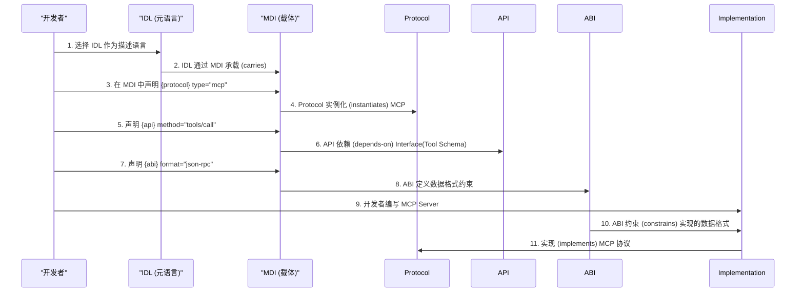
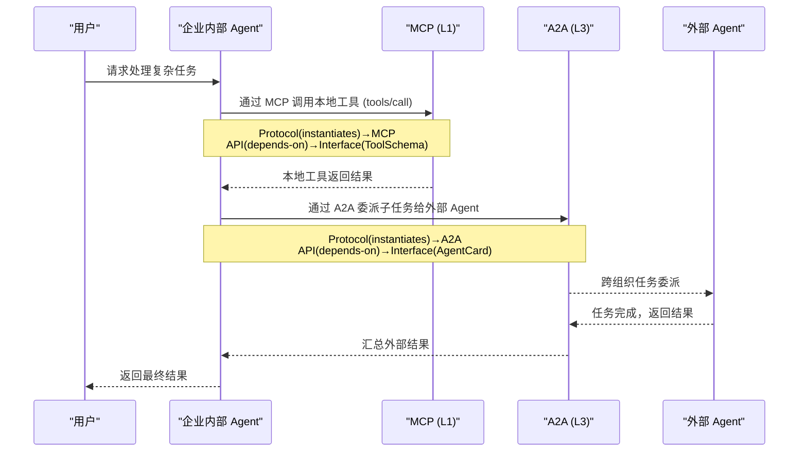
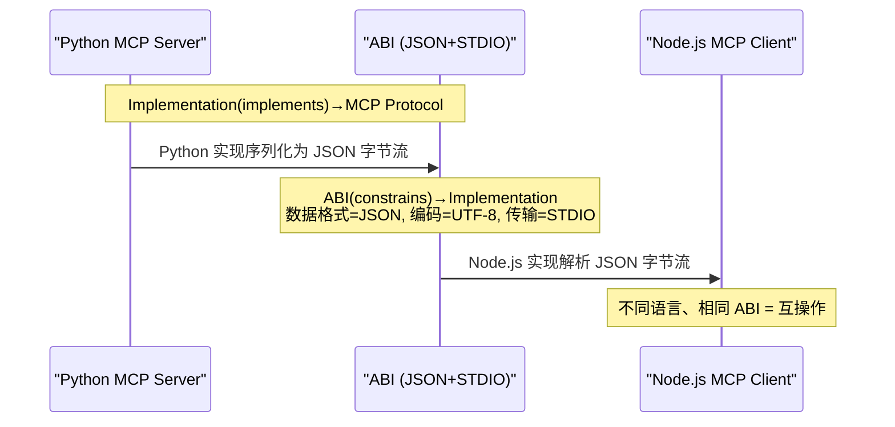
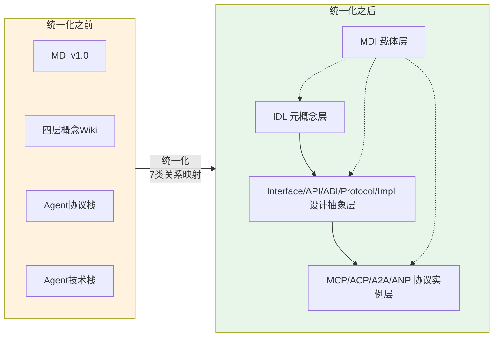

# 12、关系全景：11个概念的形式化关系与交互

## 引言

前面 11 个章节分别定义了统一化体系中的每个核心概念。本章将所有概念串联起来，展示它们之间的 7 类形式化关系、完整的 11×11 关系矩阵，以及典型交互场景。

## 7 类关系形式化定义

### 1. 实例化 (instantiates)

```
源概念: Protocol
目标概念: MCP, ACP, A2A, ANP
方向: Protocol → 具体协议
语义: 具体协议是 Protocol 抽象概念的实例，继承 Protocol 的所有属性并添加协议特定的约束
约束: 单向，不可逆（协议实例不能实例化 Protocol）
```

| 实例 | 协议特有属性 |
|------|-------------|
| MCP | transport=stdio/HTTP, message_format=JSON-RPC 2.0, 通信方向=纵向(Agent↔Tool) |
| ACP | architecture=去中心化P2P, discovery=mDNS, 零SDK设计 |
| A2A | security=OAuth 2.0/OIDC, task_model=丰富状态机, 强制HTTPS |
| ANP | message_format=JSON-LD+DID/VC, discovery=去中心化, TRL=2-3 |

### 2. 实现 (implements)

```
源概念: Implementation
目标概念: Interface, Protocol
方向: Implementation → Interface/Protocol
语义: 实现是对抽象契约的具体编码，必须满足 Interface 定义的契约或 Protocol 规定的规则
约束: 一个 Implementation 可以实现多个 Interface，也可以实现一个 Protocol
```

### 3. 承载 (carries)

```
源概念: MDI
目标概念: 所有 11 个概念
方向: MDI → 所有概念
语义: MDI 作为载体层，承载所有概念的定义。每个概念在 MDI 中通过 frontmatter + MyST directive 声明
约束: 这是一个元关系，MDI 本身不改变概念的定义，仅提供统一的承载格式
```

### 4. 描述 (describes)

```
源概念: IDL
目标概念: 所有概念
方向: IDL → 所有概念
语义: IDL 是描述接口的元语言，MDI 是 IDL 的一个具体实现。IDL 定义"如何描述接口"，而非接口本身
约束: IDL 描述的是概念的结构和格式，而非概念的语义内容
```

### 5. 组合 (composes)

```
源概念: Protocol
目标概念: API, ABI
方向: Protocol → API + ABI
语义: 协议不是单一实体，而是 API（可调用方法）+ ABI（二进制兼容约定）的组合
约束: 一个完整的 Protocol 必须同时定义 API 和 ABI 两个维度
```

### 6. 依赖 (depends-on)

```
源概念: API
目标概念: Interface
方向: API → Interface
语义: API 依赖 Interface 定义参数和返回值的契约。Interface 定义了"什么参数"，API 定义了"怎么调用"
约束: 一个 API 可以依赖多个 Interface（如 MCP 的 tools/call 依赖多个 Tool Schema）
```

### 7. 约束 (constrains)

```
源概念: ABI
目标概念: Implementation
方向: ABI → Implementation
语义: ABI 约束不同实现的二进制兼容性。所有实现必须遵守 ABI 定义的数据格式、编码和传输方式
约束: ABI 约束是硬性约束——违反 ABI 的实现无法与其他实现互操作
```

## 11×11 关系矩阵

| | IDL | Interface | API | ABI | Protocol | Impl | MCP | ACP | A2A | ANP | MDI |
|---|-----|-----------|---|---|---|------|---|------|-----|-----|-----|-----|
| **IDL** | - | describes | describes | describes | describes | describes | describes | describes | describes | describes | describes |
| **Interface** | - | - | depends-on | - | - | - | - | - | - | - | - |
| **API** | - | depends-on | - | - | - | - | - | - | - | - | - |
| **ABI** | - | - | - | - | - | constrains | - | - | - | - | - |
| **Protocol** | - | - | composes | composes | - | - | instantiates | instantiates | instantiates | instantiates | - |
| **Impl** | - | implements | - | - | implements | - | - | - | - | - | - |
| **MCP** | - | - | - | - | - | - | - | - | - | - | - |
| **ACP** | - | - | - | - | - | - | - | - | - | - | - |
| **A2A** | - | - | - | - | - | - | - | - | - | - | - |
| **ANP** | - | - | - | - | - | - | - | - | - | - | - |
| **MDI** | carries | carries | carries | carries | carries | carries | carries | carries | carries | carries | - |

> 行 = 源概念，列 = 目标概念。空单元格 = 无直接形式化关系。MCP/ACP/A2A/ANP 之间是互补关系（协议栈分层），不属于 7 类形式化关系。

## 概念交互场景

### 场景 1：定义一个新协议（以 MCP 为例）



### 场景 2：跨协议协作（MCP + A2A 混合架构）



### 场景 3：ABI 约束跨语言实现



## 统一化体系的价值总结



**统一化带来的三个核心价值**：

1. **概念可追溯**：每个概念在四层分类中有明确位置，概念间关系有形式化定义（7 类关系），开发者可以精准定位和理解任何概念
2. **工具可互操作**：MDI 作为统一载体层，承载所有概念的定义。未来可通过 MDI Parser 自动解析概念间关系，生成关系图谱、一致性验证、跨协议兼容性检查
3. **体系可扩展**：新增概念只需确定其分类层和关系映射，即可纳入统一体系。MyST directive 扩展机制提供了无限的扩展空间

## 后续方向

本阶段（阶段 1）完成了概念规范定义，后续阶段规划：

| 阶段 | 内容 | 状态 |
|------|------|------|
| 阶段 1 | 概念规范定义（11 个概念 + 关系全景） | 当前阶段 |
| 阶段 2 | MDI v2.0 扩展（Protocol Profile + 概念元模型） | 待启动 |
| 阶段 3 | Parser 扩展（MyST directive 解析） | 待启动 |
| 阶段 4 | 关系验证（自动验证 7 类关系约束） | 待启动 |
| 阶段 5 | 统一看板（概念关系可视化 Dashboard） | 待启动 |

## 章节导航

| 章节 | 链接 |
|------|------|
| 返回入口 | [README.md](README.md) |
| 上一章 | [11 - MDI](11-mdi.md) |
| 总览 | [00 - 总览](00-overview.md) |

<!-- changelog -->
- 2026-07-04 | spec | 初始创建：统一化体系关系全景文档