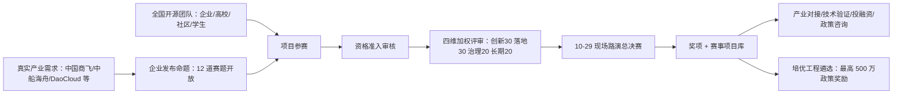

# 大赛全景：一场被写进政府方案的开源赛事

> 时效性提示：本文事实截至 **2026-09-24**。大赛正处于报名期（截止 10 月 16 日 24:00），赛程与奖项以[官网](https://www.oschina.net/os2026/)最新公告为准；方案在 2026-09-22 奖金公布时发生过一轮调整，演进细节见 [02 奖项与赛程](/concepts/02-awards-schedule.md)。

## 一句话认识它

**2026 上海开源软件应用创新大赛**是由开源中国（OSCHINA）主办的首届全国性开源赛事，以"**开源向实**（Open Source, Real Impact）"为主题，围绕产业 AI 设置三条赛道，总奖池 100 万元、57 个获奖名额，总决赛 10 月 29 日在上海张江举行（F-001、F-003、F-033、F-049）。

它不是一场普通的平台运营活动：官网明确其为"落实《上海市加强开源体系建设实施方案》的重要赛事活动"（F-004）。这份由上海市政府办公厅 2025 年 12 月印发的**沪府办〔2025〕33 号**文件，白纸黑字要求"依托开源社区举办各类开源挑战赛、开发者大赛和路演，**每年发掘不少于 50 个优质开源创新创业项目**"（F-006、F-007）。本大赛即该政策条款在 2026 年的具体执行抓手之一。

## 基本信息卡

| 项 | 内容 |
|----|------|
| 全称 | 2026 上海开源软件应用创新大赛（首届）（F-001） |
| 主题 | 开源向实 · Open Source, Real Impact（F-003） |
| 主办 | 开源中国 OSCHINA（运营主体：北京奥密信息技术有限公司；工信部开源软件推进联盟指定官方社区）（F-002） |
| 官网 | https://www.oschina.net/os2026/（F-009） |
| 赛道 | AI+ 工业软件 / 智算云 / 开源 AI 工具，三赛道独立评审、独立设奖（F-010~F-016） |
| 奖池 | 累计 100 万元，57 个名额，现金与 Token 一比一等额配发（F-033） |
| 报名 | 官网表单报名，审核通过后邮件提交材料；**2026-10-16 24:00 截止**（F-047、F-060、F-061） |
| 决赛 | 2026-10-29，上海浦东张江·AI 小镇服务中心 3F（海科路 1650 号），现场路演、当日公布结果（F-049、F-050） |
| 参赛对象 | 企业 / 高校 / 科研机构 / 开源社区 / 学生团队，个人或团队均可，建议 3–5 人（F-058） |
| 会务邮箱 | oscc@oschina.cn（F-061、F-062） |
| 政策红利 | 重磅开源项目有机会入选上海市开源项目培优工程，最高 500 万元奖励（F-045） |

官网首页同时展示三个实时数字：**3** 大赛道、**500+** 开源项目团队、**100 万+** 总奖池（F-008）。其中"500+ 团队"为页面实时计数（2026-09-24 时点），随报名进度变化。

## 核心机制：企业命题 + 项目参赛"双向"组织

大赛采取"**企业命题 + 项目参赛**"双向组织方式（F-005）。理解这张机制图，就理解了赛事为什么同时设置"自主选题"和"企业赛题"两条报名路径：

机制两端各有诉求：出题企业（中国商飞、中船海舟、DaoCloud、百度地图、openKylin、魔珐科技等，详见 [01 赛道与赛题](/concepts/01-tracks-and-challenges.md)）拿到开源社区的解法与人才通道；参赛团队拿到真实场景、专家指导、专项奖金与落地对接机会（F-018~F-032）。选做企业命题的队伍还额外拥有 **12 个"最佳探索奖"专属名额**（F-040）。

## 政策坐标：这场比赛在上海开源版图中的位置

沪府办〔2025〕33 号部署了五大工程，本大赛主要承接其中两项（F-006、F-007、F-046、F-065）：

| 政策工程 | 与大赛的连接点 |
|---------|---------------|
| 开源项目培优工程 | 政策要求每年通过挑战赛/开发者大赛/路演发掘不少于 50 个优质项目；获奖项目纳入赛事项目库并对接产业、投资与政策咨询；优质 AI 开源项目最高奖励 500 万元 |
| 开源基础能力筑基工程 | 政策重点方向（人工智能开源工具链、智能体开发、工业软件、RISC-V）与三条赛道征集方向高度重合 |
| 开源人才集聚工程 | 潜力新锐奖专设学生通道；政策鼓励将开源贡献纳入人才评价体系 |

政策的量化目标同样值得参赛者知晓：到 2027 年培育 100 家开源商业化企业、孵化 200 个以上优质开源项目、集聚开源开发者超 300 万人（F-065）。对参赛团队而言，这意味着赛事不是"终点发奖"，而是上海开源招商与项目孵化体系的**入口筛选器**——赛后的落地对接、在沪创业协同招商才是政策设计的落点。

## 怎样阅读本知识包

| 你的角色 | 推荐路径 |
|---------|---------|
| 想判断"我的项目能不能报、报哪个" | [01 赛道与赛题](/concepts/01-tracks-and-challenges.md) → [03 参赛指南](/concepts/03-participation-guide.md) |
| 关心奖金、时间节点与备赛排期 | [02 奖项与赛程](/concepts/02-awards-schedule.md) → [03 参赛指南](/concepts/03-participation-guide.md) |
| 关心赛事政策含金量与长期价值 | [04 政策脉络与机制洞察](/concepts/04-policy-and-insights.md) |
| 需要核实每个数字的出处 | [信源与事实清单](/references/article-source.md) → [P0 核验报告](/references/verification.md) |

## 事实溯源

- 大赛身份、主题、主办、规模：F-001 ~ F-009
- 政策文件与五大工程：F-006、F-007、F-046、F-065
- 双向组织机制：F-005、F-018 ~ F-032
