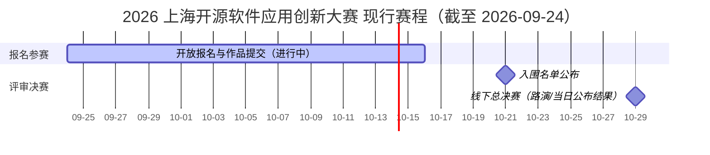

# 百万奖池、57 个名额与赛程时间线

> 本文所有日期与金额均为 **2026-09-22 奖金方案公布后的现行口径**（官网 2026-09-24 实时页面）。8 月启动版的不同口径单列于文末"方案演进对照"，参赛排期请勿使用旧日期。

## 奖项总览：30 个基础奖 + 27 个特设奖

总奖池累计 **100 万元**，共 **57 个获奖名额**；配发方式为现金与 Token **一比一等额**，同时含算力与大模型 API 等开发者资源（F-033）。三个赛道独立评奖，同一项目不重复获奖，按最高等级计（F-034、F-044）。

### 基础奖（每赛道 10 个，共 30 个）

| 等级 | 每队总额 | 现金 / Token 拆分 | 每赛道名额 | 合计名额 |
|------|---------|------------------|-----------|---------|
| 一等奖 | 10 万元 | 5 万 + 5 万 | 1 | 3 |
| 二等奖 | 5 万元 | 2.5 万 + 2.5 万 | 2 | 6 |
| 三等奖 | 2 万元 | 1 万 + 1 万 | 3 | 9 |
| 优秀奖 | 1 万元 | 5000 + 5000 | 4 | 12 |

（F-035 ~ F-038）

### 特设奖（共 27 个）

| 奖项 | 名额 | 每队金额 | 现金 / Token 拆分 | 授予对象 |
|------|------|---------|------------------|---------|
| 最佳探索奖 | 12 | 6000 元 | 3000 + 3000 | 选做企业命题的队伍 |
| 潜力新锐奖 | 10 | 2000 元 | 1000 + 1000 | 未进入决赛的优秀学生团队 |
| 遗珠奖 | 5 | 1600 元 | 800 + 800 | 因微小分差惜败、未进决赛的队伍 |

（F-039 ~ F-042）

特设奖的结构设计值得注意：它把获奖通道从"决赛排位"扩展为三条——**做题通道**（最佳探索）、**学生通道**（潜力新锐）、**惜败保底通道**（遗珠）。即使不进决赛，学生团队和微小分差团队仍有显性激励。

### 100 万是怎么构成的（官方数字复算）

- 基础奖：每赛道 15 万现金 + 15 万 Token，三赛道 = 45 万现金 + 45 万 Token；
- 特设奖：12×3000 + 10×1000 + 5×800 = 5 万现金；Token 同比 = 5 万；
- 合计：**50 万现金 + 50 万 Token = 100 万元**；名额 30 + 27 = **57**。

金额与名额两处口径完全自洽（F-043，复算过程见 [P0 核验报告](/references/verification.md)清单②）。

### 奖金之外：证书、项目库与 500 万政策通道

所有获奖项目均颁发获奖证书并纳入**赛事项目库**，享受赛后产业对接、技术验证、投融资对接及政策咨询服务（F-044）。

更高一阶的政策通道：重磅开源项目有机会入选**上海市开源项目培优工程**，获得上海市**最高 500 万元**奖励（F-045）。该数字在政策原文中对应"对优质 AI 开源项目和开源语料产品给予最高不超过 500 万元的奖励"，属于经遴选的政策性奖励、并非大赛普惠奖项（F-046）。

## 赛程时间线（现行版）

| 节点 | 时间 | 说明 |
|------|------|------|
| ① 开放报名 & 作品提交 | 即日起 — **2026-10-16 24:00 前** | 页面状态"进行中"；材料打包发 oscc@oschina.cn（F-047、F-061） |
| ② 入围名单公布 | **2026-10-21** | 官网公布（F-048） |
| ③ 线下总决赛 | **2026-10-29** | 入围团队现场路演，结果当日公布（F-049） |

**决赛安排（F-050）**：

- 场地：AI 小镇服务中心 3F；
- 地址：上海市浦东新区海科路 1650 号（合作渠道稿表述为"上海张江人工智能创新小镇"）；
- 交通提示：建议提前规划往返交通与住宿，地铁/公交、停车与签到指引以现场通知为准。

第三方报道称约 30 个项目入围决赛、决赛当日路演终审颁奖一次完成（F-051，**三方口径，官网赛程页未明示数量**）。

## 备赛排期建议（据现行节点倒排）

以 2026-09-24 为起点，距提交截止约 22 天：

| 时间窗 | 建议动作 |
|--------|---------|
| 第 1 周（9/24–9/30） | 完成官网报名锁定席位（资格审核随报随审）；确定赛道与"自主/命题"路径；企业命题领取任务书 |
| 第 2–3 周（10/1–10/14） | 代码仓库整理（LICENSE、依赖声明、README、可运行入口）；录制真实环境演示视频；撰写 PDF 介绍文档 |
| 10/15–10/16 | 三件套打包自检并发送至 oscc@oschina.cn，预留邮件退回/补交缓冲，**不要压 24:00 点提交** |
| 10/17–10/20 | 保持手机/邮件畅通，准备入围后的路演材料 |
| 10/21 | 查收入围名单 |
| 10/29 | 现场路演（预留交通住宿；硬件演示提前确认物流） |

## 方案演进对照：8 月启动版 → 9 月现行版

2026-09-22 大赛公布奖金方案，赛事安排同步调整。网络上仍流通大量 8 月旧稿，以下对照表防止按错信息排期（F-063、F-064）：

| 事项 | 8 月启动版（已失效） | 9 月现行版（以此为准） |
|------|--------------------|----------------------|
| 报名/作品截止 | 10 月 11 日 24:00 | **10 月 16 日 24:00** |
| 入围名单 | 10 月 16 日 | **10 月 21 日** |
| 总决赛 | 10 月 24 日·张江科学会堂 | **10 月 29 日·AI 小镇服务中心（海科路 1650 号）** |
| 奖项结构 | 每赛道一/二/三等奖 + 新锐潜力奖，共 30 个 | **基础奖四档 30 个 + 特设奖三类 27 个 = 57 个**；"新锐潜力奖"拆分为"优秀奖（基础）+ 潜力新锐奖（学生特设）" |
| 评审期 | 10 月 12–15 日专家评审（旧稿表述） | 官网现行页未单列评审期，仅保留三节点 |

> 采集过程备注：本知识包首次网页提取一度得到 10 月 11 日旧口径，经浏览器实时渲染复核确认为缓存快照，已弃用（核验细节见 [verification.md](/references/verification.md)）。

## 事实溯源

- 奖金结构与金额：F-033 ~ F-043
- 证书/项目库/政策通道：F-044 ~ F-046
- 赛程与场地：F-047 ~ F-051
- 版本演进：F-063、F-064
