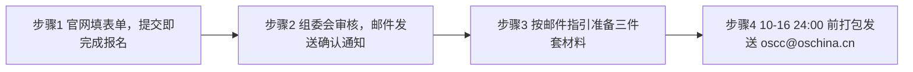

# 参赛操作指南：报名、材料、评审与沟通通道

> 本文操作要求全部来自官网"参赛指南""评审维度"板块（F-052 ~ F-062）；标注"💡 知识包建议"的段落为根据官方评审维度整理的行动建议，非赛事方承诺。

## 一、资格自检：你能不能报

- **对象**：企业、高校、科研机构、开源社区及学生团队；**个人或团队均可**参赛（F-058）。
- **团队**：建议 3–5 人，明确负责人 1 名（F-058）。
- **赛道规则**：每个项目只能选择一个赛道；同一主体可提交多个项目分别参加不同赛道（F-059）。

一句话自检：项目有**可访问的开源代码仓库**、能在**真实或仿真环境演示**，即具备最低报名门槛。评审在资格阶段就会核验开源协议与第三方依赖合规性（F-052、F-056），仅有 PPT、无代码的项目无法通过准入。

## 二、报名与提交流程（四步）

1. **官网报名**：在 https://www.oschina.net/os2026/ 填写报名表单，提交即完成报名（F-060）。
2. **等待确认**：组委会审核后以邮件发送报名确认通知（F-060）。💡 知识包建议：第三方攻略提到资格审核随报随审、先提交基础信息可锁定席位（F-051 同源报道口径），建议尽早报名，不要等作品全部完成。
3. **准备材料**：收到确认邮件后按邮件指引提交作品材料（F-060）。
4. **邮件提交**：材料打包为附件，于 **2026 年 10 月 16 日 24:00 前**发送至大赛组委会邮箱 **oscc@oschina.cn**（F-061）。

## 三、材料三件套怎么做

| 材料 | 官方要求（F-061） | 💡 知识包建议（对应评审维度） |
|------|------------------|------------------------------|
| 代码仓库链接 | 包含完整可运行的代码 | 补 LICENSE、第三方依赖与知识产权声明、README 运行步骤、Issue/PR 规范——直接对应"开源治理 20%"；确保评委按 README 能在干净环境部署——对应"可部署、可运行、可测试" |
| 作品介绍文档（推荐 PDF） | 项目背景、技术架构、应用场景、创新点 | 结构对齐四维度：创新点（技术 30%）、真实场景与验证数据（落地 30%）、治理与社区规划（治理 20%）、版本路线图与团队（长期 20%） |
| 作品演示视频链接 | 展示作品的核心功能与使用流程 | 在真实或仿真环境录屏完整跑通，避免幻灯片式介绍；官网维度释义特别强调"验证数据来自真实或仿真环境"（F-055） |
| 企业命题附加项 | 如赛题任务书指定开发工具，按任务书要求（F-061） | 领题后通读任务书，保留与命题企业的沟通记录 |

## 四、评审机制：两阶段 + 四维度百分制

### 阶段一：资格准入审核

核验申报主体与项目真实性，检查项目介绍、技术方向、应用场景及材料完整性，审核代码仓库或开源计划、开源协议、第三方依赖及知识产权声明，确认项目符合所选赛道征集范围（F-052，阶段释义综合官网与启动稿，启动稿中该段描述在现行页面未作修改性冲突）。

### 阶段二：专家四维加权打分（百分制）

> ⚠️ **企业命题注意**：大赛统一四维是自主选题的评审框架；openKylin、百度地图、魔珐、DaoCloud MatrixHub 四份**官方任务书各自给出了本题专属评分表与权重**（与下表不同），选做这四题须按任务书评分表对位，详见 [05 任务书深读](05-challenge-briefs-deep-dive.md)。

| 维度（权重） | 官方释义（F-054 ~ F-057） | 打分关键词 |
|-------------|--------------------------|-----------|
| 技术创新 **30%** | 技术路线独创性，是否解决已有方案未能解决的问题，相较同类是否有明确优势 | 独创性；解决"未解决问题"；同类对比优势 |
| 场景落地 **30%** | 可部署、可运行、可测试；场景真实；方案适配；验证数据来自真实或仿真环境 | 三"可"；真实场景；真实/仿真数据 |
| 开源治理 **20%** | 协议与依赖合规，贡献机制与文档规范清晰。**新项目看规划，老项目看运营** | LICENSE/依赖合规；CONTRIBUTING；文档；Issue/PR 运营 |
| 长期发展 **20%** | 持续维护能力、长期规划、治理结构与社区/组织支撑 | 维护活跃度；Roadmap；治理结构；社区/组织背书 |

两个关键信号：

1. **"技术酷"不构成压倒性优势**：技术创新与场景落地同分（各 30%），开源治理 + 长期发展合计 40%。纯 Demo、套壳、无治理材料的项目，在 60% 的分数上缺乏支撑。
2. **新项目同样有机会**：开源治理维度明示"新项目看规划，老项目看运营"（F-056），刚开源的项目可用治理规划文件（许可证选择理由、贡献者协议、Roadmap、社区渠道）争取该维度分数。

## 五、沟通通道

| 事项 | 联系人/渠道 | 联系方式 |
|------|-----------|---------|
| 赛事会务、材料提交 | 赛事会务组 | oscc@oschina.cn |
| 商务合作 | 栾春岩 | 15801253940 / luanchunyan@oschina.cn |
| 媒体合作 | 陈筱冬 | 13148866250 / chenxiaodong@oschina.cn |

（F-062）页面同时声明"本赛事解释权归大赛组委会所有"（F-062）。赛题理解、工具指定、日期疑问等以组委会邮件答复为准。

## 六、合作生态

官网合作栏列示 39 家社区与企业（F-062），覆盖三类资源：

- **开源社区/媒体**：FastGPT、Dify、RT-Thread、openKylin、deepin、elastic、TiDB community、DolphinScheduler、白鲸开源、HyperAI、硅星人、WaytoAGI、OpenBuild 等；
- **命题与产业方**：中国商飞、中船海舟、DaoCloud、百度地图、嘉立创、地瓜机器人、开务数据库等；
- **生态载体**：上海人工智能创新小镇、商飞工业软件创新中心、极点 AI Tokenhub 等。

## 七、常见问题（据官网信息整理）

**Q：一个人可以报名吗？**
A：可以，个人或团队均可；团队建议 3–5 人并指定 1 名负责人（F-058）。

**Q：手里有多个项目怎么办？**
A：每个项目限选一个赛道，但同一主体可以用不同项目报名不同赛道（F-059）。

**Q：必须选企业命题吗？**
A：不必须，可自主选题；但选企业命题额外拥有 12 个最佳探索奖名额，并可能获得专项奖金、求职绿色通道、专家指导与落地机会（F-032、F-040）。

**Q：截止时间到底是 10 月 11 日还是 16 日？**
A：现行口径为 **10 月 16 日 24:00**（F-047、F-061）。10 月 11 日是 8 月启动版旧日期，9 月 22 日方案已调整，详见 [02 奖项与赛程](/concepts/02-awards-schedule.md)。

**Q：学生团队有专属奖项吗？**
A：有。潜力新锐奖 10 名（每队 2000 元）面向未进入决赛的优秀学生团队（F-041）。

**Q：必须到上海吗？**
A：入围团队须于 10 月 29 日在上海浦东 AI 小镇服务中心现场路演，结果当日公布（F-049、F-050）。

## 事实溯源

- 资格、报名、材料：F-058 ~ F-061
- 评审机制与四维释义：F-052 ~ F-057
- 联系方式与生态：F-062
