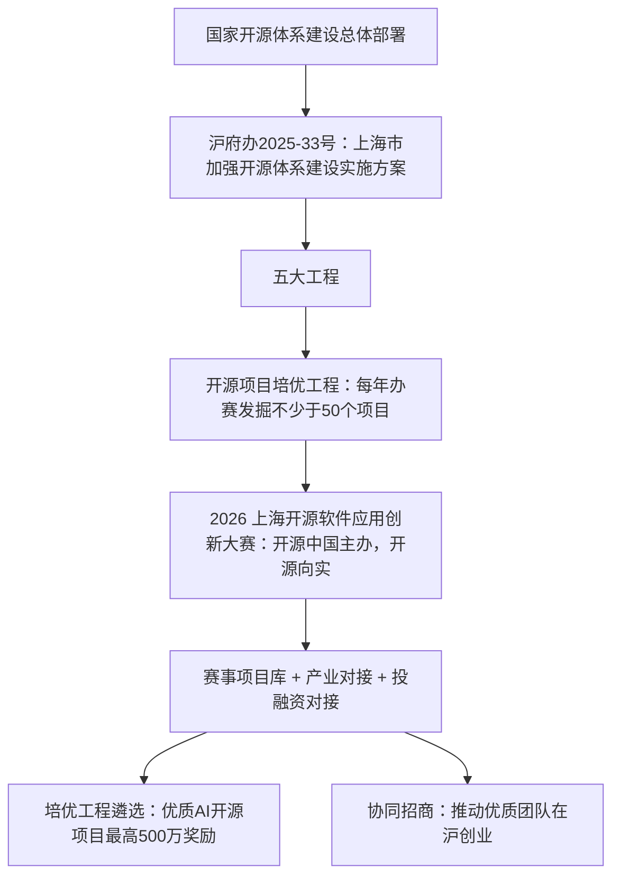

# 政策传导链、核心洞察与可迁移备赛模式

> 本篇前半部分为基于事实的机制分析（洞察均标注事实编号，观点与事实分层）；后半部分把参赛决策经验萃取为可迁移模式，适用于本赛事之外的同类评审型竞赛与项目申报。

## 一、政策传导链：从一份政府文件到一场大赛

链条上的每一环都有文件原文支撑：方案要求"依托开源社区举办各类开源挑战赛、开发者大赛和路演，每年发掘不少于 50 个优质开源创新创业项目，鼓励各类基金机构予以投资"，并"推动优质开发团队在沪创业发展"（F-007）；500 万元奖励对应"对优质 AI 开源项目和开源语料产品给予最高不超过 500 万元的奖励"（F-046）；解放日报报道中经信委负责人将其概括为把开源从"企业成本项"转变为"战略资产"的演进路径（S-003）。

**含义**：这是一场政策目标明确的"选拔—对接—招商"型赛事，奖金是表层激励，项目库入库与后续政策/产业对接才是深层通道。备赛与赛后跟进都应按这个定位安排。

## 二、四条核心洞察

### 洞察 1：这不是商业运营赛，而是政策工程的执行入口——备赛逻辑要"去 Demo 化"

- **陈述**：赛事的评审取向服务于政策选拔，真实可运行与长期治理权重合计 40%，纯展示型项目没有胜算。
- **证据**：F-004、F-006、F-007（政策定位与"不少于 50 个项目"的办赛义务）；F-055、F-056（"可部署可运行可测试"占 30%，"协议依赖合规、贡献机制、文档规范"占 20%）。
- **反常识**：开发者容易把这类比赛理解为"创意路演秀"，但政策语境下评委是在替产业端和招商体系筛选**能被真实采用、能持续维护**的项目，而非最炫的概念。
- **行动**：按"工程交付物"而非"参赛作品"标准准备仓库：可复现部署、真实/仿真数据、LICENSE 与依赖合规清单、CONTRIBUTING 与 Roadmap 齐备。

### 洞察 2：四维权重本身就是一份公开的备赛资源分配表——30/30/20/20 对位投入

- **陈述**：评审维度与权重完全公开，备赛投入按权重对位即可，无需猜评委偏好。
- **证据**：F-053（权重）、F-054 ~ F-057（官方逐维度释义）、F-061（材料三件套）。
- **反常识**：多数团队把绝大多数精力花在"技术创新"叙事上（只占 30%），而对同样占 30% 的场景验证和合计 40% 的治理/长期发展材料敷衍——后者恰恰是可以通过文档工程**低成本拿分**的部分。
- **行动**：把材料准备工时按 30/30/20/20 切分：创新点对位"已有方案未解决的问题"举证；场景部分给真实数据与部署演示；治理部分补许可证选择理由、依赖声明、贡献规范；长期部分给版本 Roadmap、维护承诺与社区/组织支撑证明。

### 洞察 3：9 月 22 日改版的实质不是"延期扩招"，而是激励结构从"排位赛"转向"解题赛"

- **陈述**：方案调整同时包含延期、改场地、扩名额三件事，核心变化是新增 27 个特设名额，其中 12 个专属企业命题队伍。
- **证据**：F-063 vs F-064（三节点与奖项结构前后对照）、F-040 ~ F-042（三类特设奖授予对象）、F-018（12 题开放）。
- **反常识**：截止日延后 5 天表面上像"没招满"，但同期奖池从 30 个排位奖扩为 57 个、且新名额定向投给"做题的人"（最佳探索 12）、"学生"（潜力新锐 10）和"惜败者"（遗珠 5），说明组织方在主动把参赛行为导向**解产业真题**与**扩大参与面**，而非单纯拉长报名期。
- **行动**：从零起步或方向未定的团队优先研究企业命题（多 12 个专属名额 + 专项奖金/求职通道）；学生团队无论是否进决赛都值得投递（潜力新锐奖在决赛之外评定）。

### 洞察 4：三赛道用"交付形态"切分，"零件 vs 成品"是最可操作的选题判据

- **陈述**：赛道边界不按技术栈而按交付对象划分，选错赛道会直接错位评审预期。
- **证据**：F-016（官方划分原则）、F-011/F-013/F-015（三赛道定位原文）、F-017（三方"零件/成品"形象化表述）。
- **反常识**：三条赛道名称都含 AI，RAG、智能体等热词同时出现在赛道二和赛道三——按技术名词选赛道必然混淆；按"谁是直接使用者"选则立即清晰。
- **行动**：产出被其他开发者集成的框架/组件/平台 → 赛道二；终端用户开箱即用的应用 → 赛道三；直接嵌入工业软件/工业现场闭环 → 赛道一。兼具多形态时，以核心交付形态为准（与第三方攻略口径一致，F-051 同源）。

## 三、模式萃取：权重对位备赛法

### 模式名称
**权重对位备赛法**（Weight-Aligned Preparation）

### 触发场景
- **适用于**：评审标准（维度+权重）完全公开的竞赛、黑客松、政府项目申报、基金/课题答辩；交付物以"材料包+演示"形式提交。
- **不适用于**：评审标准不公开或纯主观评审的赛事；以现场对决/竞技为核心、材料权重极低的比赛；尚在需求探索期、无真实场景验证的纯科研构想。

### 核心步骤（5 步）
1. **索取评分表**：找到官方评审维度与权重（本赛事为创新 30/落地 30/治理 20/长期 20，F-053）；没有公开权重时向主办方索取或据评审维度等权假设。
2. **建立对位矩阵**：每个维度列出"官方释义关键词 → 需要的证据物 → 材料承载位置"三列（参见 [03 参赛指南](/concepts/03-participation-guide.md)材料表）。
3. **按权重分配工时**：准备时间按权重比例切分；对可通过文档工程得分的维度（如治理合规、长期规划）优先补齐——其边际成本低于技术创新。
4. **证据化每条主张**：所有"创新/领先"表述对位"已有方案未解决的问题"（F-054）；所有"落地"表述对位真实或仿真环境数据（F-055）；无证据的形容词全部删除。
5. **准入项先清零**：先过资格准入硬条件（开源协议、依赖合规、材料完整性，F-052/F-056），再争取加分项——准入项不过，权重分配无意义。

### 反模式（至少 3 个，均来自本赛事规则的反向推演）
- **❌ 技术独大叙事**：90% 篇幅讲模型多新、架构多酷，场景只有设想没有数据——直接丢掉 30% 落地分与 40% 治理/长期分的基本盘（对应 F-055~F-057）。
- **❌ 仓库临赛抛光**：截止前才公开仓库，无 LICENSE、无第三方依赖声明、README 跑不起来——触发准入审核与开源治理双重失分（F-052、F-056）。
- **❌ 按技术名词选赛道**：因为"用了智能体"就投赛道三，实际产品是供开发者集成的框架——评审预期错位，且每项目限选一个赛道不可更改（F-059）。
- **❌ 卡点 24:00 提交**：邮件大附件/退回无缓冲时间，且官网明示过期不候（F-061）；正确做法是至少提前一天提交并保留发送回执。

### 检验标准（怎么知道做对了）
- 材料目录可逐行勾稽评分表：每个权重百分点都能指向具体证据物；
- 由一名不了解项目的新人按 README 在干净环境完成部署（对位"可部署、可运行、可测试"）；
- 开源合规清单无空白：LICENSE、依赖许可证兼容性、知识产权声明、CONTRIBUTING、Roadmap 五项齐全；
- 视频中出现真实数据流转或仿真验证画面，而非幻灯片讲解。

### 跨场景迁移（≥1 个非当前领域）
- **政府专项资金/课题申报**：申报指南中的评价指标即"评分表"，立项依据对位"场景落地"，团队与实施基础对位"长期发展"，同样适用证据化与工时对位。
- **创业大赛/路演评审**：技术、市场、团队、财务四维公开打分时，按权重配置 BP 篇幅与问答准备，避免技术创始人只讲产品。
- **企业内部晋升评审**：能力素质模型的各项权重即评审维度，举证材料（STAR 案例）对位准备，是同一模式的个人化应用。

> 成熟度声明：本模式由单案例（本赛事规则与官方四维释义）推演萃取，结构上迁移自"公开权重评分"这一通用评审形态，标记为 **L1 单案例待验证**；在第二个同类赛事实战检验后可升 L2。
>
> **模式入库**：本模式已按七概念知识沉淀链路（R→I→E→V）正式萃取至方法论模式库，经四视角对抗审查（8 条意见、采纳 6 条）补充了评分模型判定、边际得分率排序、评分表版本管理、临赛降级路径与第 5 个反模式。权威版本见 [权重对位备赛法](../../../../retrospective/patterns/methodology-patterns/product-growth/weight-aligned-preparation.md)（L1-draft）；本节为赛事语境下的原始萃取记录。

## 四、已知边界与不确定性

1. 本知识包基于公开信息，不掌握评审细则、申报基数与评委构成；"获奖概率"类判断一律未给出。
2. "500+ 团队"（F-008）、"约 30 个入围"（F-051）均为时点/三方口径，勿作稳定事实引用。
3. RT-Thread 赛题与睿赛德赛题的对应关系待官网更新（F-031）。
4. 第三方"某赛道竞争更小"之类攻略观点已被显式排除在事实层之外，不构成参赛建议。

## 事实溯源

- 政策传导：F-004、F-006、F-007、F-046、F-065
- 四条洞察：F-011 ~ F-017、F-040 ~ F-042、F-052 ~ F-064
- 边界声明：F-008、F-017、F-031、F-051
