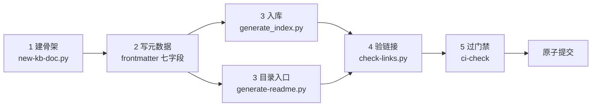

# 文档自动化工具链索引：从写文档到过门禁的统一入口

> **这是什么**：SpecWeave 智能文档系统的自动化工具**任务路由索引**——回答"我要做 X，该用哪个工具、最小命令是什么"。
> **这不是什么**：不是脚本说明书副本。每个工具的完整参数表维护在 `.agents/scripts/docs/usage/` 与脚本 `--help` 中，本文只给最小可用命令与深链，避免双份说明漂移。
> **来源**：[智能文档系统里程碑复盘](../../retrospective/reports/concepts/milestone/retrospective-intelligent-doc-system-milestone-20260910.md) 行动项 A2（P1），配套模式见 [文档自动化生成与验证流水线模式](../../retrospective/patterns/methodology-patterns/concepts/doc-automation-pipeline.md)。

---

## 一、3 分钟上手：一篇知识条目的完整旅程



```bash
# 1. 建骨架（自动生成合规 frontmatter，不覆盖已有文件）
python .agents/scripts/new-kb-doc.py docs/knowledge/operations/my-guide.md \
  --title "我的操作指南" --type knowledge

# 2. 编辑正文，并确认 frontmatter 七个必填字段齐全：
#    title / category / tags / date / status / author / summary

# 3. 入库：重建知识库入口、分类索引、标签分片
cd docs/knowledge/scripts/
python generate_index.py
cd ../../..

# 3'. 若新建了文档目录，为目录生成 README 入口
python .agents/scripts/generate-readme.py --target-dir docs/knowledge/my-topic
python .agents/scripts/generate-readme.py --update   # 刷新父级目录索引

# 4. 验证：只扫本地链接，快速无网络依赖
python .agents/scripts/check-links.py --path docs/knowledge/

# 5. 提交前：跑综合门禁（需 PowerShell 7.4+；Linux/Mac 改用 .agents/scripts/ci-check.sh）
pwsh .agents/scripts/ci-check.ps1 --quick
```

> frontmatter 缺字段时 `generate_index.py` 仅输出告警并将条目**静默降级**（归入 unknown 分类、无标签），不会失败退出——入库后务必检查脚本输出的"告警统计"段。
>
> ✅ **契约已对齐（2026-09-11）**：`categories/index.md`、`tags/index.md` 两个 Sphinx toctree Hub 已改由 `generate_index.py` **同源派生**——无条目的分类不产生分片、也不进入 toctree，全量重生成不再制造悬空引用；全部生成文件统一恢复 `type/title` frontmatter，文件头含自动生成标记，禁止手工编辑。重生成后 diff 中的计数变化（如总条目数 1288→248）是迁移后扫描结果的真实更新；审查要点是"无预期之外的删除"，而非计数不变。

---

## 二、工具链全景：两层脚本 + 两层封装

| 层 | 位置 | 受众 | 调用方式 | 代表工具 |
|---|---|---|---|---|
| 知识库脚本层 | [docs/knowledge/scripts/](../scripts/index.md) | 知识库维护者 | 无参数，重建索引 | `generate_index.py` |
| 仓库脚本层 | [.agents/scripts/](../../../.agents/scripts/README.md) | 全员/CI | CLI 参数丰富 | `generate-readme.py`、`check-links.py`、`docgen.py` |
| Skill 门面层 | [.agents/skills/](../../../.agents/skills/README.md) | AI 智能体 | 自然语言触发词 | docgen-cmd、link-check-cmd、ci-check-cmd |
| CI 编排层 | `ci-check.ps1` / `ci-check.sh` | 提交者/流水线 | 一键 10 步 | 按固定顺序串联上述脚本 |

工具链由**两条流水线**组成，位置与调用约定不同，不要混用：

| | 流水线 1：知识库索引 | 流水线 2：仓库文档工程 |
|---|---|---|
| 工作目录 | `docs/knowledge/scripts/` | `.agents/scripts/` |
| 核心动作 | 扫描知识条目 frontmatter → 重建 README/分类/标签索引 | README 生成、链接验证、导航看板、综合门禁 |
| 入口命令 | `python generate_index.py`（无参数） | `generate-readme.py` / `check-links.py` / `docgen.py` / `ci-check` |
| 详细文档 | [scripts/index.md](../scripts/index.md) | [脚本使用说明总索引](../../../.agents/scripts/README.md) |

---

## 三、核心工具速查（按任务分组）

### A. 新建文档与入库

| 工具 | 用途 | 最小命令 | 深入入口 |
|---|---|---|---|
| `new-kb-doc.py` | 生成合规 frontmatter 骨架（知识库/复盘/模式/Spec） | `python .agents/scripts/new-kb-doc.py <file> --title "标题" --type knowledge` | 脚本头部 docstring |
| `generate_index.py` | 重建知识库 README、category-index、categories/ 与 tags/ 共 16 个分片 | `cd docs/knowledge/scripts/ && python generate_index.py` | [知识库脚本索引](../scripts/index.md) |
| `generate-knowledge-index.py` | 多维 JSON 索引（按 knowledge_type/status/安全级别过滤） | `python .agents/scripts/generate-knowledge-index.py --stats` | 脚本 `--help` |

### B. 目录 README 与导航看板

| 工具 | 用途 | 最小命令 | 深入入口 |
|---|---|---|---|
| `generate-readme.py` | 目录 README 生成与标记区增量更新（保留手写内容） | `python .agents/scripts/generate-readme.py --scan` | [生成与构建脚本说明](../../../.agents/scripts/docs/usage/02-generate-build-scripts.md#generate-readmepy) · [维护验证手册](../../../.agents/scripts/docs/maintenance/01-generate-readme-testing.md) |
| `docgen.py nav` | 全仓文档导航表（README/docs README 标记区） | `python .agents/scripts/docgen.py nav` | Skill：[docgen-cmd](../../../.agents/skills/docgen-cmd/SKILL.md) |
| `docgen.py dashboard` | Spec 执行进度看板 | `python .agents/scripts/docgen.py dashboard` | 同上 |
| `docgen.py all` | nav→dashboard→主题看板→apps→stats 全量刷新 | `python .agents/scripts/docgen.py all` | 同上 |

> `generate-nav.py`、`generate-dashboard.py`、`generate-apps-index.py` 为独立旧入口，功能已聚合进 `docgen.py` 子命令，新流程优先用 docgen。

### C. 链接与元数据验证

| 工具 | 用途 | 最小命令 | 深入入口 |
|---|---|---|---|
| `check-links.py` | Markdown 本地链接校验（默认）/外链检测/自动修复 | `python .agents/scripts/check-links.py --path docs/` | [检查类脚本说明](../../../.agents/scripts/docs/usage/01-check-scripts.md#check-linkspy) · Skill：[link-check-cmd](../../../.agents/skills/link-check-cmd/SKILL.md) |
| `check-frontmatter.py` | id/x-toml-ref/source 完整性与禁止字段校验 | `python .agents/scripts/check-frontmatter.py --dir docs/` | 脚本 `--help` |
| `check-mermaid.py` | Mermaid 语法陷阱检测与修复 | `python .agents/scripts/check-mermaid.py --path docs/` | [检查类脚本说明](../../../.agents/scripts/docs/usage/01-check-scripts.md#check-mermaidpy) |
| `check-filename-convention.py` | 文件名 kebab-case/纯英文规范 | `python .agents/scripts/check-filename-convention.py --directory docs/` | [检查类脚本说明](../../../.agents/scripts/docs/usage/01-check-scripts.md#check-filename-conventionpy) |
| `check-source-traceability.py` | frontmatter source 反向索引与变更影响分析 | `python .agents/scripts/check-source-traceability.py --affected README.md` | [检查类脚本说明](../../../.agents/scripts/docs/usage/01-check-scripts.md#check-source-traceabilitypy) |

### D. 综合门禁与移动重构

| 工具 | 用途 | 最小命令 | 深入入口 |
|---|---|---|---|
| `ci-check.ps1/.sh` | 10 步流水线综合检查（下表） | `pwsh .agents/scripts/ci-check.ps1` | Skill：[ci-check-cmd](../../../.agents/skills/ci-check-cmd/SKILL.md) |
| `check-move.py` | 移动 md 时自动改写内部链接 | `python .agents/scripts/check-move.py --dry-run <src> <dst>` | [检查类脚本说明](../../../.agents/scripts/docs/usage/01-check-scripts.md#check-movepy) |
| `build-ref-index.py` | 文件反向引用索引（移动/删除前查影响面） | `python .agents/scripts/build-ref-index.py --query <file>` | [生成与构建脚本说明](../../../.agents/scripts/docs/usage/02-generate-build-scripts.md#build-ref-indexpy) |
| `finalize-atomization.py` | 原子化收尾：修链+导航+看板一键完成 | `python .agents/scripts/finalize-atomization.py --dry-run` | Skill：atomization-finalize-cmd |
| `check-wiki-staleness.py` | 按 last_verified 递归扫描知识库过期条目（季度体检，可标注 needs-update） | `python .agents/scripts/check-wiki-staleness.py --knowledge` | [定期复核机制](knowledge-review-mechanism.md)；脚本 `--help` |

**ci-check 10 步流水线**（🔴 = 失败阻断）：

| # | 检查 | 级别 | # | 检查 | 级别 |
|---|---|---|---|---|---|
| 1 | 仓库合规（gitignore/vendor/mermaid/filename/roles） | 🔴 | 6 | 跨文件重复代码检测 | 🟡 |
| 2 | Markdown 链接有效性 | 🔴 | 7 | 阶段守卫日志（strict） | 🔴 |
| 3 | Spec 一致性 | 🟡 | 8 | SG 可视化仪表盘 | 🟡 |
| 4 | 模式成熟度 | 🔴 | 9 | 关键配置文件放置 | 🔴 |
| 5 | 文档生成（导航+看板+清单） | 🔴 | 10 | .temp 生命周期（>14d 警告/>30d 阻断） | 🟡🔴 |

`--quick` 仅跑关键阻断项 1/2/4/7；`--skip a,b` 跳过指定步骤。

---

## 四、Skill 门面：用自然语言调用工具

在 Trae 对话中直接说触发词，对应 Skill 会自动按正确顺序与平台约定调用脚本：

| 你说 | 触发 Skill | 底层执行 |
|---|---|---|
| "生成导航 / 更新看板 / 刷新应用清单" | docgen-cmd | `docgen.py nav/dashboard/apps/all` |
| "检查链接 / 修复断链 / 验一下死链" | link-check-cmd | `check-links.py`（含缓存、并发、--fix 预览） |
| "跑一下 CI / 提交前全量检查 / 预检" | ci-check-cmd | `ci-check.ps1/.sh` 10 步 |
| "原子化收尾 / 重构后一键修链刷导航" | atomization-finalize-cmd | `finalize-atomization.py` |
| "检查重复脚本 / 有没有重复实现" | check-duplication-cmd | `check-duplication.py` |

---

## 五、常见任务配方（复制即用）

**配方 1：新增一篇知识条目** → 见第一章"3 分钟上手"。

**配方 2：为新目录补 README 并刷新索引**
```bash
python .agents/scripts/generate-readme.py --scan                      # 先看缺多少
python .agents/scripts/generate-readme.py --target-dir docs/knowledge/new-topic
python .agents/scripts/generate-readme.py --update                   # 父目录状态 📋→✅
```

**配方 3：文件移动/重命名后修链**
```bash
python .agents/scripts/build-ref-index.py --query docs/old.md         # 先查影响面
python .agents/scripts/check-links.py --fix --dry-run                # 预览修复
python .agents/scripts/check-links.py --fix --rename old.md=new.md # 带重命名映射执行
```

**配方 4：外链季度巡检**
```bash
python .agents/scripts/check-links.py --check-external                # 7 天缓存，不重复请求
python .agents/scripts/check-links.py --check-external --no-cache   # 强制全量复检
python .agents/scripts/check-links.py --clear-cache                # 需要时清缓存
```

**配方 5：知识库新鲜度体检**（`--knowledge` 为仓库知识库预设，递归扫描并自动排除机器生成目录与入口页；不带 `--mark-*` 只读；完整 SOP 见[定期复核机制](knowledge-review-mechanism.md)）
```bash
# 只读巡检（退出码 0 全新鲜 / 1 有过期或缺失 / 2 参数错误）
python .agents/scripts/check-wiki-staleness.py --knowledge
# 过期条目标注 status: needs-update（deprecated 跳过，写后须人工复核并登记日志）
python .agents/scripts/check-wiki-staleness.py --knowledge --mark-stale
```

---

## 六、常见陷阱（来自本项目实战）

1. ❌ **手改标记区**：`README_INDEX_START/END`、`nav-start/nav-end` 等标记内的表格会被脚本整段覆盖。自定义说明写在标记区**外**。
2. ❌ **写 `file:///` 绝对路径**：仓库规范只允许相对路径；历史批次曾修复 26 个文件的绝对路径，交给 `check-links.py --fix` 转换。
3. ❌ **不了解两条流水线边界就跑 `generate_index.py`**：该脚本只重建 `docs/knowledge/` 的索引（全仓导航用 `docgen.py nav`，目录 README 用 `generate-readme.py --update`）；重生成会覆盖 `README.md`/`category-index.md`/`categories/`/`tags/` 全部机器索引（含两个同源派生的 toctree Hub），这些文件禁止手工编辑。运行后必须审 diff（重点看分片删除是否对应分类清空），并留意 stderr 的 frontmatter 降级告警。
4. ❌ **`--fix` 不预览直接写**：所有修复类操作先 `--dry-run` 看 diff，确认后再实际执行。
5. ❌ **frontmatter 字段缺失未察觉**：索引脚本以告警+降级处理，不报错退出；入库后必看"告警统计"输出，必填七字段缺一不可。
6. ❌ **外链检查误判**：401/403/405 默认视为可达（反爬/不支持 HEAD）；结果有 7 天缓存，复检加 `--no-cache`。
7. ❌ **Windows 用 5.1 跑 .ps1**：仓库要求 pwsh 7.4+（环境配置见 [Windows 平台兼容指南](windows-platform-compatibility-guide.md)）；Python 脚本另需 3.10+（脚本头部自动校验）。
8. ❌ **新需求直接写脚本**：先查 [.agents/scripts/lib/](../../../.agents/scripts/lib/README.md) 共享库与 [check-duplication Skill](../../../.agents/skills/check-duplication-cmd/SKILL.md)，禁止重复实现已有能力。

---

## 七、相关资源

- [文档自动化生成与验证流水线模式](../../retrospective/patterns/methodology-patterns/concepts/doc-automation-pipeline.md)——本索引的方法论母体（为什么这样组织工具链）
- [Frontmatter 路径与链接批量修复指南](frontmatter-link-batch-repair-guide.md)——断链/路径问题的 8 阶段分层修复流程
- [.agents/scripts 脚本总索引](../../../.agents/scripts/README.md)——全部脚本速查表与分章用法（01 检查 / 02 生成 / 03 Git-CI / 04 修复）
- [运维操作指南库](README.md)——同目录其他操作指南
- [知识库首页](../README.md)——条目入库后的索引入口
