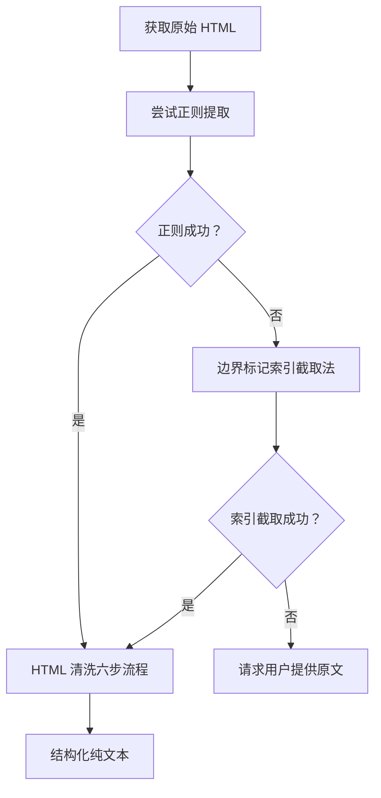

# HTML 正文提取操作指南

> **适用场景**：从原始 HTML 中提取正文内容，特别是容器节点 style 属性复杂导致正则失效的场景。

## 一、核心结论

HTML 正文提取推荐**双方案策略**：优先使用正则提取（简单场景），失败时切换至边界标记索引截取法（复杂场景兜底）。两套方案互为补充，覆盖从简单到复杂的全场景 HTML 结构。

本指南从 claude-tag 任务实战中提炼——微信公众号文章正文容器 `id="js_content"` 的 `style` 属性含数十条 CSS 规则、嵌套引号、分号、`url()` 函数等，导致正则贪婪匹配失效，最终通过边界标记索引截取法成功提取 47016 字符正文。

## 二、决策流程



## 三、方案一：正则提取（首选）

### 3.1 标准正则模板

```powershell
# PowerShell 示例：提取 id=js_content 的 div 内容
$pattern = '<div[^>]*id="js_content"[^>]*>([\s\S]*?)</div>'
if ($html -match $pattern) {
    $content = $Matches[1]
} else {
    Write-Warning "正则提取失败，切换至边界标记索引截取法"
}
```

```python
# Python 示例
import re
pattern = r'<div[^>]*id="js_content"[^>]*>([\s\S]*?)</div>'
match = re.search(pattern, html)
if match:
    content = match.group(1)
```

### 3.2 适用场景

- HTML 结构简单，容器节点 style 属性不含复杂引号嵌套
- 容器结束标签明确且唯一
- 页面由标准模板生成，结构稳定

### 3.3 失败场景（正则贪婪匹配失效）

**根本原因**：当容器节点的 `style` 属性极其复杂时，正则的 `[^>]*` 部分会意外提前闭合。

**典型失败案例**：微信公众号正文容器 `id="js_content"` 的 style 属性可能包含：

```html
<div id="js_content" style="visibility: visible;
    font-size: 16px;
    color: #333;
    background-image: url('data:image/png;base64,...');
    /* 数十条 CSS 规则 */
    content: "引用内容";
    ..."></div>
```

**失败机制**：
1. style 属性值中含 `>` 字符（如 `background-image: url('data:image/svg+xml;...>')`)
2. 正则的 `[^>]*` 在第一个 `>` 处提前闭合
3. 导致匹配到的内容为空或不完整

## 四、方案二：边界标记索引截取法（兜底）

### 4.1 核心思想

放弃正则，改用基于字符串索引的精确截取。仅依赖两个稳定的边界标记：
- **起始边界**：容器属性名（如 `id="js_content"`）
- **结束边界**：闭合标签（如 `</div>`）

### 4.2 标准流程

```powershell
# 步骤 1：起始边界定位
$startMarker = 'id="js_content"'
$startIdx = $html.IndexOf($startMarker)
if ($startIdx -lt 0) {
    throw "未找到起始边界标记：$startMarker"
}

# 步骤 2：从起始位置向后找第一个 '>'（容器开始标签结束位置）
$tagStart = $html.IndexOf('>', $startIdx)
if ($tagStart -lt 0) {
    throw "未找到容器开始标签的闭合 '>'"
}

# 步骤 3：结束边界定位
# 从 tagStart 向后找下一个独立的 </div>
$endIdx = $html.IndexOf('</div>', $tagStart)
if ($endIdx -lt 0) {
    throw "未找到结束边界标记 </div>"
}

# 步骤 4：字符截取
$content = $html.Substring($tagStart + 1, $endIdx - $tagStart - 1)
Write-Host "成功提取 $($content.Length) 字符正文"
```

### 4.3 多结束标记候选策略

当容器内嵌套 `</div>` 时，简单的 `IndexOf('</div>')` 可能定位到内层闭合标签。可采用多候选策略：

```powershell
# 从起始位置向后扫描，记录所有 </div> 位置，选择最远的有效位置
$searchFrom = $tagStart
$candidates = @()
while ($true) {
    $idx = $html.IndexOf('</div>', $searchFrom)
    if ($idx -lt 0) { break }
    $candidates += $idx
    $searchFrom = $idx + 6
}

# 选择使内容长度最合理的位置（通常是最远的）
# 或根据其他启发式规则（如下一个章节标题位置）
$endIdx = $candidates[-1]
```

### 4.4 优势

| 维度 | 正则提取 | 索引截取法 |
|------|---------|-----------|
| HTML 结构复杂性 | 敏感（style 属性复杂即失效） | 免疫（仅依赖边界标记） |
| 实现复杂度 | 简单（一行正则） | 中等（4 步流程） |
| 可读性 | 中（正则难读） | 高（流程清晰） |
| 鲁棒性 | 低（边缘场景多） | 高（边界标记稳定） |
| 性能 | 中（正则回溯） | 高（字符串索引 O(n)） |

### 4.5 实战数据

claude-tag 任务中：
- 输入：3075942 字节原始 HTML
- 起始边界：`id="js_content"` 在 HTML 中位置唯一
- 结束边界：`</div>` 在起始位置后第 47016 字符处
- 输出：47016 字符正文 HTML

## 五、HTML 清洗六步流程

提取正文 HTML 后，需清洗为纯文本。

### 5.1 清洗流程表

| 步骤 | 操作 | 输入 | 输出 | 示例 |
|------|------|------|------|------|
| 1 | 段落转换 | `<p>` 标签 | `\n` | `<p>文本</p>` → `文本\n` |
| 2 | 标题转换 | `<h1>` ~ `<h6>` 标签 | `## ` 加标题文本 | `<h2>标题</h2>` → `## 标题` |
| 3 | 图片占位 | `` 标签 | `[图片]` | `` → `[图片]` |
| 4 | 标签剥离 | 所有剩余 HTML 标签 | 纯文本 | `<span>文本</span>` → `文本` |
| 5 | 实体解码 | `&nbsp;` 等 HTML 实体 | Unicode 字符 | `&nbsp;` → ` ` |
| 6 | 空白规整 | 连续换行 | 单一换行 | `\n\n\n` → `\n` |

### 5.2 PowerShell 实现

```powershell
# 步骤 1：段落转换
$content = $content -replace '</p>', "`n"
$content = $content -replace '<p[^>]*>', ""

# 步骤 2：标题转换
$content = $content -replace '<h([1-6])[^>]*>(.*?)</h\1>', '`' * $matches[1] + ' $2'

# 步骤 3：图片占位
$content = $content -replace ']*>', '[图片]'

# 步骤 4：标签剥离
$content = $content -replace '<[^>]+>', ''

# 步骤 5：实体解码
$content = [System.Net.WebUtility]::HtmlDecode($content)

# 步骤 6：空白规整
$content = $content -replace "(`r`n|`n){2,}", "`n"
```

### 5.3 实战数据

claude-tag 任务中：
- 输入：47016 字符正文 HTML
- 输出：4646 字符纯文本
- 压缩比：约 10:1（HTML 标签占 90% 字符）

## 六、适用与不适用场景

### 6.1 适用场景

| 场景 | 推荐方案 | 原因 |
|------|---------|------|
| 微信公众号文章正文 | 索引截取法 | style 属性复杂，正则失效 |
| 简单博客文章 | 正则提取 | 结构稳定，正则足够 |
| 新闻网站正文 | 正则提取 | 通常有标准正文容器 |
| 需要提取多个容器 | 正则提取 | 可用全局匹配 |
| 容器 style 属性含 base64 图片 | 索引截取法 | 正则会因 `>` 提前闭合 |

### 6.2 不适用场景

- **JavaScript 动态渲染内容**：HTML 中不包含动态加载的内容，需用 Playwright/Puppeteer 等无头浏览器
- **需要保留 HTML 结构**：本指南目标是提取纯文本，如需保留结构请用 BeautifulSoup/lxml 等解析器
- **非 div 容器**：需调整边界标记（如 `<article>`、`<section>`）

## 七、关联资源

- [微信公众号文章内容提取操作指南](wechat-mp-content-extraction.md) — 上游决策模型
- [claude-tag 执行复盘](../../retrospective/reports/competitive-analysis/retrospective-claude-tag-article-learning-20260629/execution-retrospective.md) — 实战案例来源
- [PowerShell 字符串处理官方文档](https://learn.microsoft.com/powershell/module/microsoft.powershell.core/about/about_comparison_operators)
