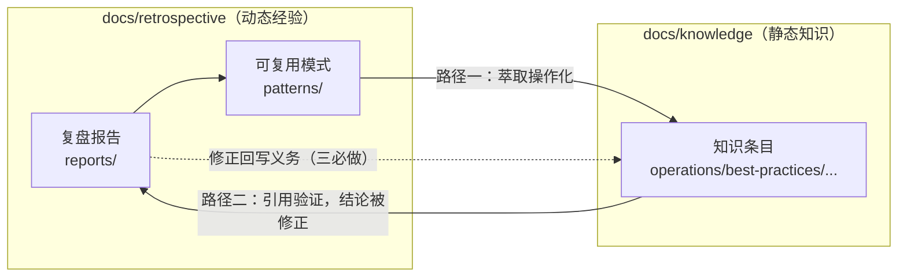

# 知识库与复盘体系双向引用规范

> 本规范是知识沉淀"双轮驱动"架构的引用契约：知识库（`docs/knowledge/`，静态知识）与复盘体系（`docs/retrospective/`，动态经验）之间**什么时候必须建链、链到哪里、修正后谁负责回写**。
>
> 2026-09-11 前，双区链接靠作者习惯自发维护——两个方向都有正确实例，但回链义务、链接位置、路径层级没有判据。本规范补齐契约，不改变既有正确实例。

## 一、定位与边界

### 这是什么

- 两条引用路径的**操作契约**：触发时机、必选链接点、修正回写义务。
- 一份**相对路径层级速查表**：双区任意深度互链不用数目录。
- 一套**提交前检查清单**：评审与门禁的判据。

### 这不是什么

- ❌ 不是链接大全。具体工具与链接修复流程见 [文档自动化工具链索引](doc-automation-toolchain.md) 与 [frontmatter-link 批量修复指南](frontmatter-link-batch-repair-guide.md)。
- ❌ 不替代 [归档搭配 Wiki 联动机制指南](../best-practices/archive-wiki-linkage-guide.md)：那份指南管**外部学习资料**从复盘归档（`retrospective/reports/insight-extraction/external-learning/`）到 OKF 知识包（`projects/awesome-okf-xs/doc/bundles/`，原 `learning/`）的升级路径；本规范管**仓库内部双区**（`docs/knowledge/` ↔ `docs/retrospective/`）。
- ❌ 不重启跨区引用负债治理：双体系重复引用已由 [cross-reference-ledger.md](../../retrospective/cross-reference-ledger.md)（ACT-5，2026-08-31 结项）收敛，本规范只定今后的增量规则。

### 双区三层地图

| 层 | 角色 | 更新方式 |
|---|---|---|
| 复盘报告 `retrospective/reports/` | 单次任务的过程记录与结论 | 归档后基本冻结 |
| 模式库 `retrospective/patterns/` | 从复盘中萃取的可复用模式（中间层） | 随新案例演进 |
| 知识库 `docs/knowledge/` | 面向复用的操作化知识（SOP/手册/规范） | 持续验证、持续更新（见[复核机制](knowledge-review-mechanism.md)） |

---

## 二、路径一：复盘 → 模式 → 知识库（沉淀路径）

**触发**：复盘通过 V 阶段审查，且产出的经验满足"第二次还会用"——具体操作、SOP、配置、判据。

### 三步动作

1. **报告内萃取**：在复盘报告中给出模式/知识条目的落盘位置（行动项表写明目标路径）。
2. **分层落盘**：
   - 抽象模式（触发条件+步骤+反模式+迁移验证）入 `retrospective/patterns/`；
   - 操作化知识（可直接照做的手册/SOP/规范）入 `docs/knowledge/` 对应分类。
   - 两者不是二选一：模式回答"什么时候用、为什么成立"，知识条目回答"具体怎么做"。
3. **建立双链接点（必选）**：
   - 知识条目 frontmatter 加 **`source:` 字段**，指回复盘报告或模式文档（机器可读的溯源锚点，支持 `#锚点`）；
   - 知识条目正文「相关资源/参考」章节加**人读链接**，说明与上游复盘/模式的关系一句话（如"本 SOP 是 X 模式在 Y 场景的操作化"）。

> 复盘/模式一侧的链接：在行动项表、模式文档的"相关知识/实例"章节回链知识条目。**报告侧链接允许一处**（行动项表），但 `source` 与正文链接在知识条目侧不可互相替代。

### 标准实例

- [anti-crawler-strategy-playbook.md](../anti-crawler-strategy-playbook.md)：正文多处回链[知乎复盘报告](../../retrospective/reports/task-reports/retrospective-zhihu-637007780-analysis-20260706/retrospective-report.md)与上游模式；复盘侧 README/insight-extraction/export-suggestions 三个文件成对回链该条目——**成对回链的样板**。
- [b2b-product-info-collection-sop.md](../best-practices/b2b-product-info-collection-sop.md)：`source:` 直接锚定到复盘产物的具体章节（`...export-suggestions.md#问题1`）——**机器溯源锚点的样板**。

---

## 三、路径二：知识库 → 复盘 → 修正（验证回路）

**触发**：新复盘/实战中引用了某知识条目，并发现其内容与当前事实不符（工具行为变化、流程失效、版本差异、链接失效背后的口径过时）。

### 三步动作

1. **复盘内记录修正**：复盘报告写明被引用条目、旧结论、新证据，以及修正结论。
2. **回写知识条目（修正三必做）**：
   1. 直接改正文，不留"以复盘为准"的指针式说明——知识条目必须是**自足的最新版本**；
   2. 更新 frontmatter `last_verified` 为本次复核日期（语义与格式见[知识库定期复核机制](knowledge-review-mechanism.md)）；
   3. 在[知识库复核日志](knowledge-review-log.md)追加一行（日期/条目/结论/关联复盘），保证修正可追溯。
3. **回链**：在知识条目「修订记录」或「相关资源」处链接到本次复盘；严重过期、短期内无法修正的条目，置 `status: needs-update`（待更新），不得静默保留旧结论。

> 反模式：只在复盘里写"X 文档结论已失效"，知识条目原样不动。复盘报告基本冻结，读者从知识条目进入时永远看不到那条修正——**没有回写的验证等于没有验证**。

---

## 四、链接契约（六条）

1. **一律相对路径，禁止 `file:///` 绝对路径**；路径以文件实际位置计算，层级见下表。
2. **两种链接分工明确**：frontmatter `source` 给机器与溯源用（精确到文件，可带锚点）；正文链接给人读（配一句话关系说明）。
3. **新建即成对**：在一侧新建跨区链接时，同一变更内补上对侧回链；单侧链接在评审中标为缺陷。
4. **路由不复制**：跨区引用只放链接与一句话关系，不复制对方正文段落，避免双份维护漂移（与工具链索引"路由层"原则一致）。
5. **`source` 只指起源**：一个条目的 `source` 指向其产生的复盘/模式；后续验证它的复盘放正文「相关资源」，不覆盖 `source`。
6. **失效即修**：跨区链接断链与普通断链同责，提交前过 `check-links.py`；批量失效按[批量修复指南](frontmatter-link-batch-repair-guide.md)处理。

### 相对路径层级速查表

| 链接发出位置 | 目标位置 | 相对前缀 | 实例 |
|---|---|---|---|
| `knowledge/x.md`（根目录条目） | `retrospective/...` | `../retrospective/` | `../retrospective/reports/...` |
| `knowledge/<分类>/x.md`（operations、best-practices 等） | `retrospective/...` | `../../retrospective/` | `../../retrospective/patterns/...` |
| `knowledge/<分类>/<子类>/x.md` | `retrospective/...` | `../../../retrospective/` | — |
| `retrospective/patterns/<分组>/x.md` | `knowledge/...` | `../../../knowledge/` | `code-patterns/` 下直挂文件 |
| `retrospective/patterns/<分组>/<子类>/x.md` | `knowledge/...` | `../../../../knowledge/` | [doc-automation-pipeline.md](../../retrospective/patterns/methodology-patterns/concepts/doc-automation-pipeline.md) 所在层级 |
| `retrospective/reports/<分类>/<报告>/x.md` | `knowledge/...` | `../../../../knowledge/` | 知乎复盘 README/export-suggestions 实测层级 |
| `retrospective/reports/<分类>/<报告>/<子目录>/x.md` | `knowledge/...` | `../../../../../knowledge/` | 外部学习归档常用 |
| `retrospective/reports/concepts/milestone/x.md` | `knowledge/...` | `../../../../knowledge/` | 里程碑复盘常用（与上一行同深度，报告名即末级目录） |

算法：向上退到 `docs/` 所在层级（`knowledge/` 退 1~3 级视嵌套深度；`retrospective/` 退 3~5 级），再进入目标树。拿不准时以同目录既有链接为先例，用 `check-links.py` 验证。

---

## 五、提交前检查清单

**沉淀路径（新建知识条目/模式时）**

- [ ] 知识条目 frontmatter 有 `source` 指回上游复盘/模式
- [ ] 正文「相关资源」有人读回链 + 一句话关系说明
- [ ] 复盘行动项表/模式文档已回链知识条目（成对）
- [ ] frontmatter 必填七字段完整（避免索引降级，见[模板](../template.md)）

**验证回路（复盘修正旧知识时）**

- [ ] 知识条目正文已改为自足的最新版本，无指针式残留
- [ ] `last_verified` 已更新、[复核日志](knowledge-review-log.md)已追加一行
- [ ] 严重过期条目已置 `status: needs-update` 或已当场修复
- [ ] 条目内回链指向本次复盘

**通用**

- [ ] 全部为相对路径，无 `file:///`
- [ ] `python .agents/scripts/check-links.py --path docs/knowledge/` 与变更涉及的 `docs/retrospective/` 子树零新增断链

---

## 六、相关资源

- [知识库定期复核机制](knowledge-review-mechanism.md)：路径二"修正三必做"中 `last_verified`、`needs-update` 与复核日志的完整定义
- [文档自动化工具链索引](doc-automation-toolchain.md)：check-links、generate_index 等工具的最小命令
- [归档搭配 Wiki 联动机制指南](../best-practices/archive-wiki-linkage-guide.md)：外部学习归档 → OKF 知识包的升级路径（相邻场景）
- [frontmatter-link 批量修复指南](frontmatter-link-batch-repair-guide.md)：历史失效链接的批量处置
- [来源复盘：智能文档系统里程碑复盘（行动项 A3）](../../retrospective/reports/concepts/milestone/retrospective-intelligent-doc-system-milestone-20260910.md#4-原子行动项a-阶段)
