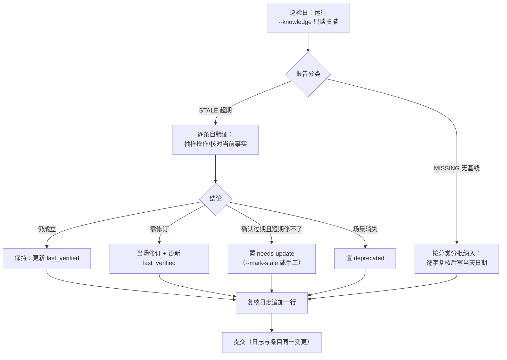

# 知识库定期复核机制

> 知识库（`docs/knowledge/`）的价值取决于"现在还能不能照做"。本机制为每条知识建立**可机器检查的新鲜度信号**、**固定节奏的复核动作**与**可追溯的复核记录**，对应里程碑复盘行动项 A4 的三条验收线：
>
> 1. **复核周期 ≤ 3 个月**——以 `last_verified` 字段 + 90 天阈值机器检查；
> 2. **复核记录可追溯**——集中复核日志 + git 历史双轨；
> 3. **过期条目标注"待更新"**——机器值 `status: needs-update`。

## 一、核心概念

### 1.1 `last_verified`：最近一次人工验证日期

- 格式：`last_verified: YYYY-MM-DD`（frontmatter 标量，与 `date`/`author` 同级）。
- 语义：**最近一次有人按条目内容实际验证过（或逐字复核过）的日期**，不是创建日期，不是编辑日期。错别字、排版修订不更新该字段；结论性修订、流程验证必须更新。
- 更新时机（任一即可）：
  1. 季度巡检中确认条目仍成立；
  2. 复盘/实战触发的验证回路（见[双向引用规范](knowledge-retrospective-cross-reference-spec.md)的"修正三必做"）；
  3. 条目内容结论性修订后。
- 无该字段的条目在巡检报告中记为 **MISSING**（未建立基线），与 **STALE**（曾验证但超期）是两种不同状态，处置节奏不同（见第四节）。

### 1.2 `status` 状态机

| 状态值 | 含义 | 新鲜度义务 |
|---|---|---|
| `draft` | 草稿，内容未完成 | 暂不强制 90 天周期；转正时补 `last_verified` |
| `stable` | 稳定有效（推荐默认值） | 90 天一复核 |
| `needs-update` | **待更新**：已知内容过期或失真，等待修订 | 巡检红色项，下一季度前必须消项 |
| `deprecated` | 已退役：结论明确作废且不打算修订 | 豁免复核；脚本标注时跳过 |

状态迁移：

```mermaid
stateDiagram-v2
    [*] --> draft
    draft --> stable: 内容完成并首次验证
    stable --> needs-update: 巡检/复盘发现过期
    needs-update --> stable: 修订并重新验证（更新 last_verified）
    needs-update --> deprecated: 确认作废不再维护
    stable --> deprecated: 场景消失
```

### 1.3 存量自由值：识别但不一刀切

机制建立前，249 条存量条目存在历史自由状态值（2026-09-11 实测）：`stable` 64、`active` 14、`reviewed` 11、`draft` 8、`accepted` 3、`validated` 1、空值 1，另有 106 条有 frontmatter 但无 `status`、41 条无 frontmatter。

归一规则：

| 历史值 | 归一目标 | 处置 |
|---|---|---|
| `active` | `stable` | 同一语义（现行有效），巡检触达时顺手改，不做批量大改 |
| `reviewed` / `accepted` / `validated` | `stable` | "一次性评审通过"不代表持续新鲜；下次复核时归一并补 `last_verified` |
| 空值 / 无 status | 按内容判定为 `draft` 或 `stable` | 下次编辑该文件时补 |
| 无 frontmatter（41 条） | 先补建 frontmatter | 脚本拒绝自动合成，必须人工补七字段（见[模板](../template.md)） |

原则：**机器只识别新枚举，不阻断旧值**。在存量全部纳入基线前，脚本对历史值照常计算新鲜度，不产生额外告警类型；归一动作随巡检自然完成，避免一次性改动上百个文件造成评审噪音。

## 二、工具

[check-wiki-staleness.py](../../../.agents/scripts/check-wiki-staleness.py) 负责机器检查，知识库预设递归扫描 `docs/knowledge/` 全树，自动排除 `scripts/`、`tags/`、`categories/`（机器生成）与 `template.md`、`README.md`、`category-index.md`（入口页），口径与 `generate_index.py` 的 249 条目一致；不会扫到 `projects/` 下的 OKF bundles。

```bash
# 只读巡检（退出码 0 全部新鲜；1 存在过期/缺失；2 参数错误）
python .agents/scripts/check-wiki-staleness.py --knowledge

# 自定义阈值（天）
python .agents/scripts/check-wiki-staleness.py --knowledge --threshold 180

# 把过期条目标注为 needs-update（只改写 frontmatter；deprecated 跳过）
python .agents/scripts/check-wiki-staleness.py --knowledge --mark-stale

# 为"缺失基线"专项批次打标：按子目录分批（>20 个目标会被护栏拦截，需 --force）
python .agents/scripts/check-wiki-staleness.py --path docs/knowledge/operations --mark-missing
```

安全约定：

- **不带 `--mark-*` 就是只读 dry-run**，可随时运行；带标志才写文件，写后须人工复核，不得把打标当终点。
- **批量护栏**：单次标注目标超过 20 个时脚本直接拒绝（退出码 2），须按目录分批（`--path` 指向子目录）或显式加 `--force`。这是为了防止把 249 条无基线条目一键打成"待更新"，导致红色洪水、机制空转。
- 标注只动 frontmatter 的 `status` 一行（无该行则插入），正文与其他字段不变；脚本单元测试见 [test_check_wiki_staleness.py](../../../.agents/scripts/tests/test_check_wiki_staleness.py)。
- 被标 `needs-update` 的条目，复核确认后须更新 `last_verified` 并把 `status` 改回 `stable`（或置 `deprecated`）。

## 三、季度巡检 SOP

**节奏**：每季度首月第 1 周完成上一季度全量巡检；单季度内由验证回路触发的复核随时进行，不等巡检。



操作要点：

1. **先跑只读报告，再决定动作**。STALE 与 MISSING 分开看：MISSING 只代表"没有基线"，不代表内容错误。
2. **按分类分批**，单批建议 ≤ 20 条（如先 `operations/`、再 `best-practices/`），保证每条确实被人看过，禁止为消报告批量回填假日期。
3. **每条处置都在[复核日志](knowledge-review-log.md)追加一行**；条目修订与日志登记放在**同一个提交**内。
4. **needs-update 消项时限一个季度**：下一轮巡检前必须转为 `stable`（已修订）或 `deprecated`（已作废），连续两个季度挂红的条目上升为复盘议题。
5. 巡检同时顺手完成历史 status 值归一（见 1.3）与缺失 frontmatter 补建。

## 四、存量过渡策略（249 条无基线）

机制建立日（2026-09-11），249 条存量条目全部缺少 `last_verified`。若首日即按 90 天硬门执行，整个知识库会瞬间全红、机制空转。因此分三阶段：

| 阶段 | 时间窗 | 策略 | 门禁 |
|---|---|---|---|
| 一、咨询期 | 2026-09 起 | 脚本 advisory 手动运行；MISSING 不打标、不阻断；巡检按分类分批建立基线，每批 ≤ 20 条 | 不进 CI |
| 二、收敛期 | 基线覆盖率 ≥ 80% | 巡检常态化；新入库条目**必须**带 `last_verified`（评审检查项）；`--mark-stale` 对超期条目打标 | CI 可选告警不阻断 |
| 三、硬门期 | 基线覆盖率 100% 且连续两轮巡检完成 | 超期条目（STALE）纳入提交前检查；MISSING 只可能来自新增漏填，直接判缺陷 | 接入 ci-check |

阶段进入条件由复核日志的累计登记条数核验，不凭估计跳阶段。脚本接口已为硬门期预留（退出码语义稳定）。

基线覆盖率不靠专项运动堆出来，另有两条有机增长渠道：

1. **触达即建基线（强制）**：任何人对存量条目做结论性修改时，必须在同一提交补上 `last_verified`（取实际复核当日）——被触碰的文件就是最优先、成本最低的建基线条目。
2. **验证回路顺带建基线（强制）**：复盘引用旧条目时按[双向引用规范](knowledge-retrospective-cross-reference-spec.md)执行"修正三必做"，自然带入 `last_verified`。

**责任归属**：季度巡检由 SpecWeave 治理角色负责组织（每季度首月第 1 周）；条目的触达式建基线由该次变更的作者负责，评审时按[双向引用规范](knowledge-retrospective-cross-reference-spec.md)第五节清单检查。

## 五、可追溯性（双轨）

1. **集中日志**：[knowledge-review-log.md](knowledge-review-log.md) 一行一条，字段：日期 / 条目 / 复核结论（保持·修订·置待更新·退役）/ 复核人 / 关联复盘或提交。
2. **git 历史**：条目每次 `last_verified`/`status` 变更随条目本身提交，`git log -p -- <条目>` 可还原每次复核的实际内容改动。

两轨互相印证：日志回答"什么时候谁复核了什么、结论是什么"，git 回答"那次复核具体改了什么"。只改字段不留日志视为复核无效。

## 六、与双向引用规范的衔接

本机制是[双向引用规范](knowledge-retrospective-cross-reference-spec.md)路径二（知识库→复盘→修正）的基础设施：

- 复盘中修正知识条目时，"修正三必做"的第 2、3 步就是本机制的动作（更新 `last_verified` + 日志登记）；
- 复盘发现严重过期但当场无法修正时，置 `needs-update` 的规则与状态机一致；
- 巡检中发现条目错误源于某次历史结论的，按路径二在复盘中记录新证据并双向回链。

## 七、反模式

- ❌ **回填假基线**：把所有条目的 `last_verified` 统一填成某一天以消 MISSING——没有真实验证的日期比没有字段更糟。
- ❌ **只打标不消项**：`--mark-stale` 后条目长期挂 `needs-update`，红色泛滥成噪音。
- ❌ **改字段不留日志**：无法回答"这条凭什么说今天仍成立"。
- ❌ **一次性归一上百文件**：历史 status 值随巡检顺手归一即可，大爆炸式改动淹没真实评审。
- ❌ **把巡检当形式**：不实际操作/核对就批量续期——90 天周期约束的是"验证动作"，不是"改日期动作"。

## 八、相关资源

- [知识库与复盘体系双向引用规范](knowledge-retrospective-cross-reference-spec.md)：沉淀路径与验证回路的完整契约
- [知识库复核日志](knowledge-review-log.md)：复核记录登记表
- [check-wiki-staleness.py](../../../.agents/scripts/check-wiki-staleness.py)：新鲜度检查与标注脚本
- [知识条目模板](../template.md)：`last_verified` 字段与 status 枚举说明
- [文档自动化工具链索引](doc-automation-toolchain.md)：知识库相关脚本总览
- [来源复盘：智能文档系统里程碑复盘（行动项 A4）](../../retrospective/reports/concepts/milestone/retrospective-intelligent-doc-system-milestone-20260910.md#4-原子行动项a-阶段)
