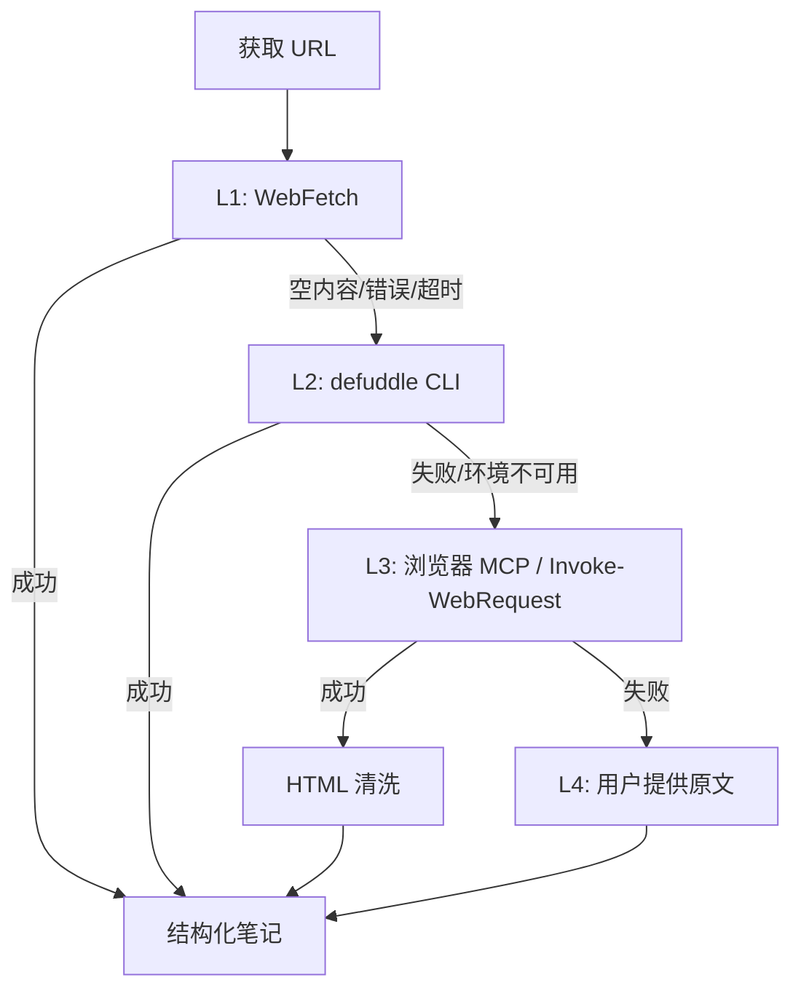
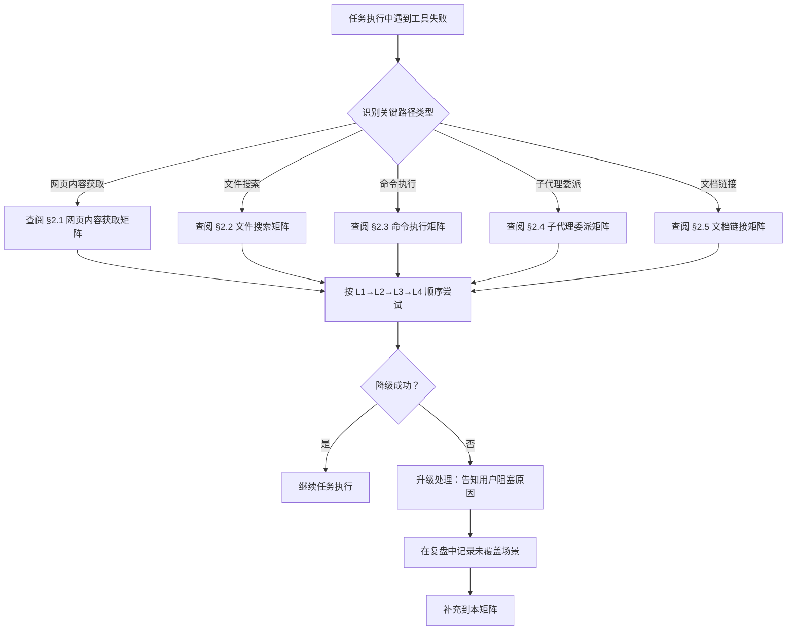

# 关键路径工具失败降级矩阵

> **适用场景**：执行任务时遇到关键路径工具失败，需要快速决策降级方案。本矩阵将"依赖经验判断"的工具降级决策转化为"按标准流程查阅"的标准化操作，避免新成员因不熟悉降级路径而阻塞任务。

## 一、核心原则

### 1.1 工具降级不是"失败后的补救"，而是"预先规划的备选方案"

每次使用关键路径工具时，应预先知道失败后的降级路径，而非临时寻找替代方案。降级矩阵的价值在于**把经验判断转化为标准流程**——任何智能体遇到工具失败时，都能直接查阅矩阵找到正确的降级路径。

### 1.2 三级降级模型

每个关键路径工具都应有**至少三级降级策略**：

| 级别 | 含义 | 响应时间 |
|------|------|---------|
| **L1 首选方案** | 默认使用的工具，性能/质量最优 | 立即 |
| **L2 降级方案** | L1 失败时的备选，覆盖率高但可能耗时更长 | < 1 分钟内决策 |
| **L3 兜底方案** | L2 也失败时的最终方案，可能需要人工介入 | < 5 分钟内决策 |

### 1.3 降级触发条件

降级不应基于"直觉"，而应基于明确的触发条件：

- **明确失败**：工具返回错误码、空内容、异常退出
- **质量不达标**：返回内容不完整、格式错误、信息缺失
- **超时**：超过预期响应时间（默认 30 秒）
- **环境限制**：依赖环境不可用（如 Node.js 未安装）

## 二、降级矩阵

### 2.1 网页内容获取

**典型场景**：用户给出 URL，要求提取网页内容进行学习/分析/总结。

| 级别 | 工具 | 触发条件 | 优势 | 劣势 |
|------|------|---------|------|------|
| **L1** | `WebFetch` | 默认首选 | 直接返回 Markdown，自动剥离噪声 | 反爬机制下成功率低 |
| **L2** | `defuddle` CLI | L1 返回空内容/错误/超时 | 对微信公众号等有优化解析，输出干净 Markdown | 依赖 Node.js / npx |
| **L3** | 浏览器 MCP / `Invoke-WebRequest` | L2 失败或环境不可用 | 模拟真实浏览器，绕过反爬 | 需自行清洗 HTML，耗时较长 |
| **L4** | 用户提供原文 | 所有自动方案均失败 | 100% 可靠 | 依赖用户配合，慢 |

**决策流程**：

**注意事项**：
- 微信公众号文章几乎必然反爬，可跳过 L1 直接使用 L2（参见 [wechat-mp-content-extraction.md](wechat-mp-content-extraction.md)）
- shell 命令中包含 URL 时**必须加引号包裹**，避免 `&`、`#` 等特殊字符被 shell 解析为多条命令
- defuddle 输出大文件时可能因 stderr 输出导致 exit code 非 0，但 stdout 内容仍可用，应基于 stdout 内容判断成功与否

### 2.2 文件搜索与定位

**典型场景**：在代码库中查找特定文件、内容、定义。

| 级别 | 工具 | 触发条件 | 优势 | 劣势 |
|------|------|---------|------|------|
| **L1** | `Glob` / `Grep` | 默认首选，文件名模式或正则匹配 | 快速、精确、支持 ripgrep 语法 | 仅支持精确匹配，不理解意图 |
| **L2** | `SearchCodebase` | L1 未找到或不确定关键词 | 语义搜索，按意图查找 | 索引可能滞后，结果可能不完整 |
| **L3** | `LS` 目录遍历 | L1/L2 都未找到 | 直观查看目录结构 | 耗时长，结果可能过多 |
| **L4** | 子代理委派 | 任务复杂，需多轮搜索 | 可并行探索 | 上下文成本高 |

**注意事项**：
- 优先使用专用工具（Glob/Grep），禁止使用 shell `find`/`grep`/`rg` 命令
- 单次 `semantic_search` 只查一个问题，复合问题应拆分为多次调用
- 已知目录范围时通过 `path` / `target_directories` 限定搜索范围

### 2.3 命令执行

**典型场景**：运行脚本、构建项目、执行测试。

| 级别 | 工具 | 触发条件 | 优势 | 劣势 |
|------|------|---------|------|------|
| **L1** | `RunCommand`（短命令） | 默认首选，命令类型为 `short_running_process` | 同步返回结果，便于即时反馈 | 长时间命令会阻塞 |
| **L2** | `RunCommand`（长进程） | L1 超时或命令类型为 `long_running_process` / `web_server` | 异步执行，可并行其他工作 | 需配合 `CheckCommandStatus` 轮询 |
| **L3** | 写入 shell 脚本执行 | 命令复杂度高、参数多 | 可复用、可版本控制 | 增加文件管理成本 |
| **L4** | 拆分为多个子任务 | 单次执行无法完成 | 可并行、可委派子代理 | 协调成本高 |

**注意事项**：
- 阻塞模式仅用于 `short_running_process`，长进程必须使用 `blocking: false`
- shell 命令包含特殊字符（URL、引号、`&`、`#`）时必须加引号
- 同步链式命令使用 `&&`，独立命令使用并行调用
- 终端会话保持状态，cwd/env 跨调用持续

### 2.4 子代理委派

**典型场景**：任务复杂或可并行，需要委派子代理处理。

| 级别 | 工具 | 触发条件 | 优势 | 劣势 |
|------|------|---------|------|------|
| **L1** | `Task` 工具委派 | 默认首选，任务可独立完成 | 并行执行、隔离上下文 | 子代理可能格式偏差 |
| **L2** | 主会话补全 | L1 返回结果格式错误/内容截断 | 主会话已有上下文，纠错成本低 | 主会话上下文负担增加 |
| **L3** | 任务拆分重试 | L1 连续两次失败 | 小粒度任务成功率高 | 协调成本高 |
| **L4** | 主会话直接执行 | L1/L2/L3 均失败 | 100% 可靠 | 主会话负担最重 |

**注意事项**：
- **事不过二原则**：子代理最多重试 1 次（总共 2 次尝试），第二次失败后必须切换策略
- 委派格式敏感任务时，必须在 Query 中包含"格式参照样本"和"完整性检查清单"
- 一次 `general_purpose_task` 调用只委派一个原子任务，禁止多任务合并委派
- 子代理产出必须经验收检查（参见 [subagent-output-quality-checklist.md](../../../.agents/templates/subagent-output-quality-checklist.md)）

### 2.5 文档链接验证

**典型场景**：归档/导出/移动文件后验证链接有效性。

| 级别 | 工具 | 触发条件 | 优势 | 劣势 |
|------|------|---------|------|------|
| **L1** | `check-links.py`（无参数） | 默认首选，扫描本地引用 | 快速、无需联网 | 仅检查本地文件 |
| **L2** | `check-links.py --fix` | L1 发现断链 | 自动修复相对路径层级错误 | 仅修复文件名搜索能匹配的断链 |
| **L3** | `check-links.py --check-external` | 需要验证外部 URL | 检查可达性，缓存 7 天 | 网络耗时较长 |
| **L4** | 手动 Edit 修复 | L2 自动修复失败 | 可处理复杂路径调整 | 需要人工判断正确路径 |

**注意事项**：
- 文件移动/导出后**必须立即**运行链接检查（相对路径深度变化会导致全部链接失效）
- `--fix` 模式基于文件名搜索匹配，无法处理重命名场景，需手动 Edit
- 外部链接检查结果缓存 7 天，避免重复请求

## 三、决策流程图

## 四、使用指南

### 4.1 何时查阅本矩阵

- **工具返回错误/空内容/超时**：立即查阅对应章节，按 L1→L2→L3 顺序尝试
- **任务开始前规划**：对关键路径工具预先了解降级路径，避免临时决策
- **新成员入职**：作为工具使用培训资料，了解项目工具链的失败应对策略
- **复盘中识别新场景**：发现本矩阵未覆盖的工具失败场景时，补充到对应章节

### 4.2 何时更新本矩阵

- **新工具引入**：新增关键路径工具时，补充到对应章节
- **降级路径变化**：现有降级路径不再适用（如工具升级、环境变化）时更新
- **复盘发现新场景**：复盘识别出未覆盖的工具失败场景时补充
- **降级失败案例**：现有降级路径无法解决时，记录失败原因并补充新方案

### 4.3 与其他规范的关系

| 关联规范 | 关系 |
|---------|------|
| [wechat-mp-content-extraction.md](wechat-mp-content-extraction.md) | 微信公众号场景的详细降级指南，本矩阵 §2.1 的深度展开 |
| [subagent-output-quality-checklist.md](../../../.agents/templates/subagent-output-quality-checklist.md) | 子代理委派质量门，本矩阵 §2.4 的预防性补充 |
| [.agents/tools/](../../../.agents/tools/README.md) | 工具使用规范，本矩阵是其失败应对的补充 |
| [docs/retrospective/patterns/](../../retrospective/patterns/README.md) | 可复用模式库，本矩阵本身是 L3 标准化模式 |

## 五、验证案例

| 案例 | 关键路径 | 触发条件 | 降级路径 | 结果 |
|------|---------|---------|---------|------|
| DSpark 论文学习（2026-07-04） | 网页内容获取 | WebFetch 失败（反爬） | L1→L2（defuddle） | 成功提取 4500 字内容 |
| Claude Tag 文章学习（2026-06-29） | 网页内容获取 | WebFetch + defuddle 失败 | L1→L2→L3（Invoke-WebRequest） | 成功提取 3MB HTML |
| 文件名规范检查（2026-07-04） | 命令执行 | rglob 遇到损坏文件崩溃 | L1→L2（人工判断跳过） | 基于经验判断跳过，但暴露脚本容错缺陷 |

## 六、关联资源

- [wechat-mp-content-extraction.md](wechat-mp-content-extraction.md) — 微信公众号内容提取双路径决策模型
- [html-body-extraction.md](html-body-extraction.md) — HTML 正文提取操作指南
- [subagent-output-quality-checklist.md](../../../.agents/templates/subagent-output-quality-checklist.md) — 通用子代理输出质量校验清单
- [subagent-wiki-delivery-checklist.md](../../../.agents/templates/subagent-wiki-delivery-checklist.md) — Wiki 子代理委派与产出验收检查清单
- [retrospective-dspark-wiki-20260704](../../retrospective/reports/competitive-analysis/retrospective-dspark-wiki-20260704/README.md) — 本矩阵 v1.0 来源复盘（工具降级洞察）

## Changelog

- **v1.0.0** (2026-07-06): 初始版本，基于 retrospective-dspark-wiki-20260704 洞察1（工具降级策略应成为标准操作）萃取，定义 5 类关键路径的三级降级矩阵、决策流程、使用指南与验证案例
