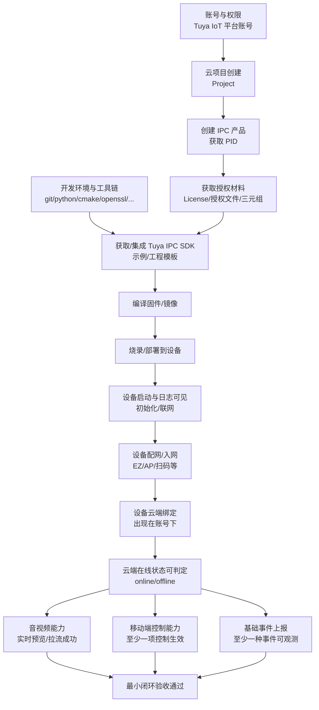

# Tuya IPC 最小闭环跑通路径

## 1. 范围与目标

### 1.1 最小闭环定义（闭环出口）

满足以下条件，即视为“最小闭环跑通”：

- 设备端：固件可编译/烧录/启动，完成初始化与联网，具备音视频采集输入
- 云端：设备能在 Tuya IoT 平台/云项目下可见（在线/离线状态可判定）
- 手机端：使用官方 App（Tuya Smart / Smart Life）完成设备绑定，并至少完成一项可观测控制
- 音视频：手机端可看到实时预览（或能得到“开始拉流成功”的可判定结果）
- 事件：至少一种基础事件（如 motion/doorbell/电量/在线心跳等）能在云端或 App 侧产生可验证记录

### 1.2 最小假设（先决边界）

为避免“文档看似完整但无法执行”，本文档以以下最小假设为前提（不满足则先补齐环境/形态）：

- **最小设备形态**：一台可运行 Tuya IPC 相关 SDK 的设备（常见为 Linux IPC SoC/开发板），具备 Wi‑Fi（2.4GHz）与至少一种音视频输入（摄像头/麦克风）；串口或 SSH 具备可用日志通道。
- **最小移动端形态**：一部 Android/iOS 手机，优先使用 Tuya Smart / Smart Life 官方 App 完成绑定、在线状态查看、预览与控制验证。
- **最小云侧形态**：Tuya IoT 平台账号 + 云项目 + IPC 产品 PID；具备设备授权材料（如 license/授权文件/三元组等 Tuya 平台要求的材料）。
- **最小网络形态**：可用的 2.4GHz Wi‑Fi，路由器不做特殊隔离；设备可访问 Tuya 云域名（DNS、TLS、NTP 可用）。

### 1.3 非目标（本路径不覆盖）

- 不追求量产级安全加固（证书轮换、密钥注入流水线、固件 OTA 全链路）
- 不追求高码率/多路码流/云存储/AI 检测等高级能力
- 不绑定某一特定芯片/SoC/摄像头传感器型号的驱动细节（设备侧音视频采集链路假定已可用）

## 2. 总览：端-云-手机闭环架构与数据流

### 2.1 依赖关系图（Mermaid）

### 2.2 可观测点（建议统一口径）

- **设备侧**：串口/日志文件中可定位关键阶段（初始化、联网、配网、绑定、媒体启动、事件上报）
- **云端侧**：设备列表可见、在线状态变化、事件/日志有记录（以平台能力为准）
- **App 侧**：绑定成功、设备页可打开、状态可刷新、预览/控制有明确成功反馈

## 3. 前置准备清单（账号/产品/授权/工具链/依赖版本）

### 3.1 账号与权限

- [ ] Tuya IoT 平台账号可登录
- [ ] 已开通云项目创建权限
- [ ] 已开通 IPC 产品相关能力（按 Tuya 平台要求）

### 3.2 产品与 PID

- [ ] 已创建 IPC 产品并获得 PID
- [ ] 已确认该 PID 对应的产品类目与所需能力集（至少覆盖：联网绑定、实时预览、基础控制、事件上报）

### 3.3 授权材料（示例口径）

不同 Tuya 方案对授权材料命名可能不同，核心目标是：设备在首次入网/绑定时能通过云端鉴权。

- [ ] 设备授权材料已准备（如 license 文件、设备标识信息、必要密钥/凭据）
- [ ] 授权材料的存放方式已确定（编译期打包 / 运行时注入 / 外置存储）

### 3.4 编译环境与工具版本（建议下限）

以下为“常见可用下限”，实际以 Tuya IPC SDK 文档为准：

- [ ] 操作系统：Windows 仅用于文档与工具，建议在 Linux / WSL2 / Linux 构建机完成编译
- [ ] Python：>= 3.10
- [ ] C/C++ 编译器：gcc >= 9（或 clang >= 12）
- [ ] CMake：>= 3.20
- [ ] OpenSSL：>= 1.1.1（确保设备侧/构建侧 TLS 能力满足）
- [ ] Git：>= 2.30
- [ ] 其他：make/ninja、pkg-config、curl、unzip、rsync（视 SDK 构建系统而定）

### 3.5 联调工具（建议）

- [ ] 串口工具可用（查看启动日志）
- [ ] 网络抓包工具可用（tcpdump/wireshark，至少可在路由器或设备侧抓包）
- [ ] 时间同步可用（NTP；设备时间错误会导致 TLS 握手失败）

## 4. 全流程步骤（每步：操作节点 / 依赖条件 / 验收标准 / 排查方向）

### Step 0：闭环约束确认（避免跑偏）

- 操作节点
  - 选择“一个设备 + 一个 PID + 一个 App + 一个网络”作为唯一闭环组合，避免多变量并行
  - 明确本次闭环要验证的 5 个节点：配网、音视频、绑定、控制、事件
- 依赖条件
  - 已满足「1.2 最小假设」
- 验收标准
  - 输出一份“闭环配置记录”（PID、固件版本、App 账号、Wi‑Fi SSID），后续排查可复用
- 排查方向
  - 若团队成员对“目标形态”理解不一致，先统一最小假设与非目标，再进入后续步骤

### Step 1：云项目与 IPC 产品准备（PID 可用）

- 操作节点
  - 在 Tuya IoT 平台创建云项目
  - 创建 IPC 产品并获取 PID
  - 确认产品能力集满足最小闭环所需的基础能力
- 依赖条件
  - 账号权限已开通（3.1）
- 验收标准
  - PID 可获得且可被 SDK/配置文件引用
- 排查方向
  - 现象：找不到 IPC 产品类目/能力集
  - 可能原因：账号未开通对应行业能力/权限不足
  - 优先排查点：账号权限、云项目类型、产品类目选择是否正确

### Step 2：获取并校验授权材料（鉴权可通过）

- 操作节点
  - 获取该产品/设备所需的授权材料（如 license/凭据）
  - 明确授权材料在设备侧的加载方式（路径/权限/格式）
- 依赖条件
  - PID 已确定（Step 1）
- 验收标准
  - 授权材料在构建机侧与设备侧均可读取，且不会被权限/路径问题阻塞
- 排查方向
  - 现象：设备能联网但无法绑定/持续重试鉴权
  - 可能原因：授权材料缺失、格式不匹配、时间错误导致 TLS 失败
  - 优先排查点：授权材料是否被正确打包/加载；设备时间与时区；DNS 是否可用

### Step 3：搭建编译环境并拉通 SDK 示例工程（编译可过）

- 操作节点
  - 获取 Tuya IPC SDK（或 TuyaOpen 中与 IPC 相关的组件/示例工程，以官方文档为准）
  - 按官方说明完成依赖安装与工程初始化
  - 编译通过（先跑官方示例，避免先改业务）
- 依赖条件
  - 工具链满足最低版本（3.4）
- 验收标准
  - 本地构建输出产物成功生成（固件/镜像/可执行文件），无阻断性错误
- 排查方向
  - 现象：编译失败（找不到 openssl/zlib/alsa 等）
  - 可能原因：系统依赖缺失、交叉编译工具链路径未配置
  - 优先排查点：SDK 文档的依赖清单；CMake toolchain 文件；pkg-config 搜索路径

### Step 4：部署到设备并确认“启动-联网-时间”三件套（设备可在线打点）

- 操作节点
  - 烧录/部署构建产物到设备
  - 打开设备日志（串口/SSH）
  - 确认网络连通与时间同步（NTP）
- 依赖条件
  - 编译产物已生成（Step 3）
- 验收标准
  - 设备启动后日志稳定输出；能获取 IP；能解析 DNS；能与外网建立 TLS（以实际可达域名为准）
- 排查方向
  - 现象：设备能拿到 IP，但云端通信失败
  - 可能原因：DNS 失败、NTP 失败导致 TLS 证书校验失败、路由器阻断 443
  - 优先排查点：`ping`/`nslookup`/`curl https://...`；`date` 输出是否正确；抓包看是否有 TLS 握手失败

### Step 5：完成配网与首次入云（设备进入“可绑定”状态）

- 操作节点
  - 使用官方 App 选择对应的配网方式（EZ/AP/扫码等，以产品支持为准）
  - 让设备获得 Wi‑Fi 信息并完成入网
- 依赖条件
  - 设备侧网络栈可用（Step 4）
  - 手机与设备处于同一局域网（同一 Wi‑Fi 或按配网方式要求）
- 验收标准
  - App 侧提示配网成功；设备侧日志出现“配网完成/入云开始”等关键阶段
- 排查方向
  - 现象：配网超时
  - 可能原因：仅支持 2.4GHz；路由器隔离；SSID/密码特殊字符；设备端配网模块未启用
  - 优先排查点：路由器频段；手机是否连 2.4GHz；设备日志中是否进入配网状态机

### Step 6：云端绑定与在线状态可判定（设备出现在账号下）

- 操作节点
  - 在 App 侧完成绑定（设备出现在设备列表）
  - 在云端（平台控制台）确认设备存在（若平台侧提供设备列表/日志）
- 依赖条件
  - 授权材料有效（Step 2）
  - 配网成功（Step 5）
- 验收标准
  - App 设备列表可见该设备；设备页能刷新在线/离线状态
- 排查方向
  - 现象：App 侧显示绑定成功但设备离线
  - 可能原因：设备心跳未上报、MQTT/TLS 握手失败、设备重启循环
  - 优先排查点：设备日志中云连接阶段；设备时间；网络质量；电源稳定性

### Step 7：音视频最小能力（实时预览/拉流成功）

- 操作节点
  - 启用 IPC 媒体链路（采集、编码、推送/传输），优先跑通实时预览
  - 在 App 侧进入设备预览页触发拉流
- 依赖条件
  - 设备在线（Step 6）
  - 设备侧音视频采集链路可用（来自 1.2 最小假设）
- 验收标准
  - App 侧能看到实时画面；或设备侧日志可判定“媒体通道建立成功/开始发送”
- 排查方向
  - 现象：设备在线但预览黑屏/加载失败
  - 可能原因：码流参数不兼容、媒体服务未启用、音视频采集设备节点不可用、NAT 穿透/端口受限
  - 优先排查点：设备侧是否有摄像头数据输入；编码器是否启动；媒体模块日志等级；抓包看是否建立连接

### Step 8：移动端最小控制（至少一个控制可生效）

- 操作节点
  - 选择一个“最小且可观测”的控制点（建议优先选择设备端日志可确认的控制）
    - 示例：指示灯开关、隐私模式开关、画面翻转、码流档位切换、云台（如硬件支持）
  - 在 App 侧触发该控制并在设备侧确认生效
- 依赖条件
  - 设备在线（Step 6）
- 验收标准
  - App 侧操作有明确成功反馈；设备侧状态变更可被日志/实际行为验证
- 排查方向
  - 现象：App 控制无响应或提示失败
  - 可能原因：产品能力未开通、DP/指令映射不一致、设备端未订阅控制通道
  - 优先排查点：产品能力集；设备端控制回调是否触发；控制参数是否被解析

### Step 9：基础事件上报（至少一种事件可观测）

- 操作节点
  - 选择一个“最小且易触发”的事件
    - 示例：motion 事件、doorbell 按键事件、设备告警、低电量/弱网（按设备能力选择其一）
  - 在设备侧触发事件并上报
- 依赖条件
  - 设备在线（Step 6）
- 验收标准
  - 云端或 App 侧能看到事件记录/通知；或在平台日志中可查询到事件上报成功
- 排查方向
  - 现象：事件触发了但云端无记录
  - 可能原因：事件上报通道未配置、上报频率被限流、事件字段不符合平台要求
  - 优先排查点：设备侧上报接口返回码/错误码；平台侧事件查看入口；日志中是否有上报成功确认

## 5. 最小闭环验收总表（勾选式）

| 编号 | 闭环节点 | 验收项 | 验收方式（可观测点） | 结果 |
|---|---|---|---|---|
| A1 | 前置准备 | PID 已创建可用 | 平台控制台可见 PID / 本地配置可引用 | [ ] |
| A2 | 前置准备 | 授权材料齐备可被加载 | 构建机与设备侧均可读取（路径/权限正确） | [ ] |
| B1 | 设备启动 | 固件可启动且日志可见 | 串口/SSH 日志可定位初始化阶段 | [ ] |
| B2 | 设备联网 | 设备获得 IP / DNS / TLS 可用 | `ip a`/`nslookup`/`curl https://...`（按环境选） | [ ] |
| C1 | 配网 | 配网流程可完成 | App 配网成功 + 设备日志阶段推进 | [ ] |
| C2 | 绑定 | 设备出现在 App 账号下 | App 设备列表可见 | [ ] |
| C3 | 在线 | 在线/离线可判定 | App 侧状态刷新 / 平台侧状态（如可用） | [ ] |
| D1 | 音视频 | 实时预览/拉流成功 | App 侧预览成功 / 设备侧媒体通道成功日志 | [ ] |
| E1 | 控制 | 至少 1 项控制生效 | App 操作成功 + 设备侧状态/日志验证 | [ ] |
| F1 | 事件 | 至少 1 种事件可观测 | App/云端事件记录可见 / 平台日志可查 | [ ] |
| Z1 | 闭环出口 | 端-云-手机闭环通过 | 上述所有必选项均勾选 | [ ] |

## 6. 附录：日志开关、常用命令/工具、问题定位索引

### 6.1 日志建议（统一最小口径）

- 建议至少区分：联网与云连接、配网状态机、绑定与心跳、媒体链路、控制通道、事件上报
- 每个阶段至少输出一个“成功”标记与一个“失败”标记（含错误码/关键字段），便于验收与排查

### 6.2 常用命令/工具（示例）

- 网络连通：`ping`、`ip a`/`ifconfig`、`route -n`/`ip r`
- DNS：`nslookup <域名>` 或 `dig <域名>`
- TLS 基础验证：`curl -v https://<域名>`（仅用于确认 TLS 可用）
- 时间：`date`、`timedatectl`、`ntpdate`（按系统可用性选择）
- 抓包：`tcpdump -i <iface> -w out.pcap`（必要时导出到 Wireshark）

### 6.3 常见问题定位索引（从现象反查）

| 现象 | 优先检查 | 常见根因 |
|---|---|---|
| 配网总是超时 | 2.4GHz、路由器隔离、设备配网状态机日志 | 仅支持 2.4GHz、SSID/密码特殊字符、配网模块未启用 |
| 绑定成功但离线 | 设备云连接日志、时间与 DNS、心跳上报 | NTP 失败导致 TLS 失败、心跳未上报、设备重启循环 |
| 预览黑屏/加载失败 | 设备侧采集/编码启动、媒体模块日志、抓包 | 采集链路不可用、参数不兼容、媒体通道未建立 |
| 控制无响应 | 产品能力集、设备控制回调、指令映射 | DP/指令不一致、设备未订阅控制通道、权限未开通 |
| 事件不上报 | 上报接口返回码、平台事件入口、限流 | 字段不符合、通道未配置、频率限制/被丢弃 |

## 参考

- [TuyaOpen 全面学习报告](../learning/tuya-open-learning-report.md)
